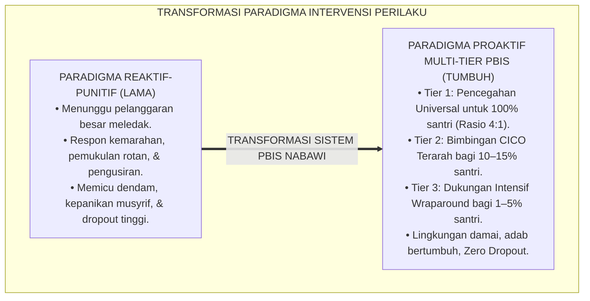
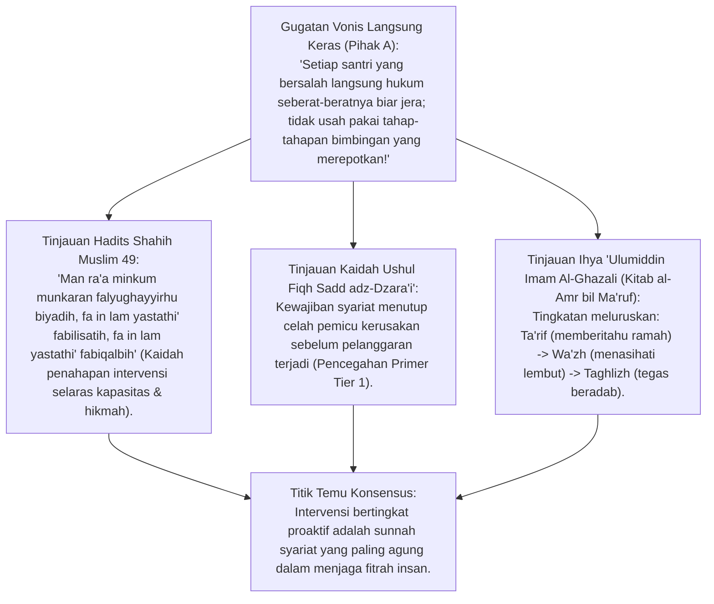
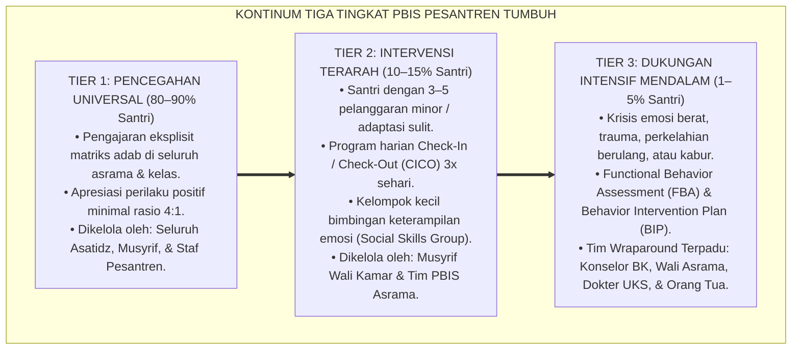
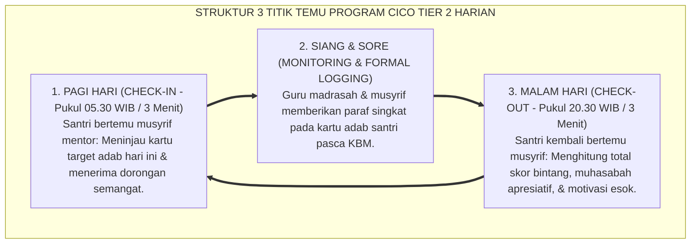
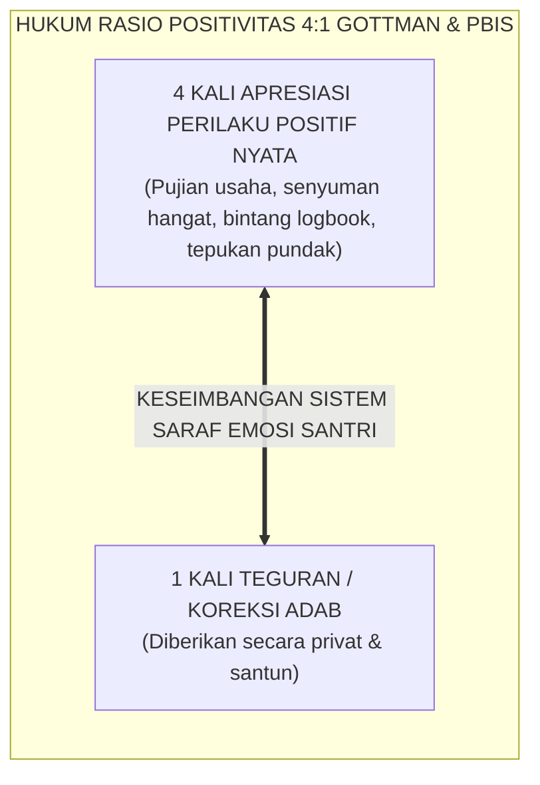
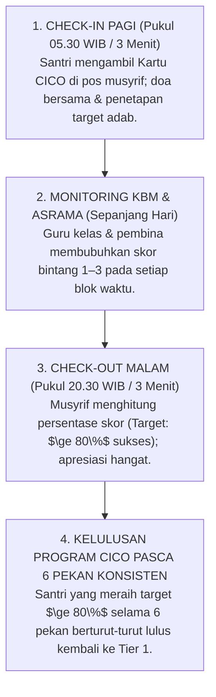
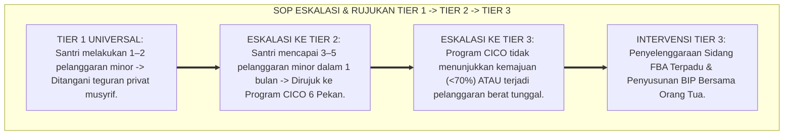

# P2-06-01: PRINSIP INTERVENSI MULTI-TIER PBIS PESANTREN
## *Monograf Terpadu: Epistemologi Sadd adz-Dzara'i' & Kaidah Tadarruj fil Inkar (HR. Muslim No. 49), Konvergensi School-Wide Positive Behavioral Interventions and Supports (SW-PBIS Multi-Tier Horner & Sugai), Operasionalisasi Program Check-In/Check-Out (CICO) 24 Jam, dan Rasio Apresiasi Positif 4:1*

**Nomor Identifikasi**: `P2-06-01/MONOGRAF-TERPADU-MULTI-TIER-PBIS/2026`  
**Domain**: `02 Principles` > `06 Intervention Principles`  
**Klasifikasi Naskah**: *Comprehensive Integrated Monograph* (Monograf Akademis & Rumusan Baku Terpadu)  
**Rumpun Disiplin Pengkaji**: Sistem Dukungan Perilaku Positif Multi-Jenjang (*Multi-Tiered Behavioral Systems*), Psikologi Pencegahan Primer Pesantren, Manajemen Kasus Pembinaan Asrama, Fiqh Tingkatan Amar Ma'ruf Nahi Munkar  

---

> ### 💡 INTISARI PRAKTIS (3 MENIT PAHAM UNTUK ASATIDZ & MUSYRIF)
>
> * **Jangan Menunggu Santri Berbuat Masalah Besar Baru Bertindak (*Paradigma Reaktif Keliru*):**  
>   Banyak pengurus pondok membiarkan santri sampai terjadi perkelahian berdarah atau pencurian, baru kemudian marah dan memukul santri. PBIS TUMBUH menggunakan **Sistem Pencegahan Multi-Tier 3 Tingkat**: menghentikan masalah sejak dini sebelum membesar.
> * **Tiga Tingkat Piramida Dukungan Perilaku PBIS:**  
>   1. **Tier 1 (Pencegahan Universal - 80–90% Santri):** Ajarkan aturan adab secara jelas di seluruh area, hadirkan keteladanan musyrif, dan beri apresiasi minimal 4 kebaikan sebelum memberi 1 teguran (**Rasio 4:1**).  
>   2. **Tier 2 (Bimbingan Terarah - 10–15% Santri):** Santri yang mulai sering terlambat atau gelisah didampingi lewat program **CICO (Check-In / Check-Out)**: disapa ramah 3 menit pagi, siang, dan malam oleh musyrif mentor.  
>   3. **Tier 3 (Intervensi Intensif Mendalam - 1–5% Santri):** Santri dengan krisis emosional berat didampingi oleh Tim Terpadu (Konselor BK, Musyrif Senior, Orang Tua, dan Psikolog).
> * **Program CICO (Check-In / Check-Out) 3x Sehari:**  
>   Musyrif menyapa santri di pagi hari: *"Bagaimana target adab hari ini?"*, memantau di siang hari, dan mengevaluasi penuh kasih di malam hari: *"Hebat, hari ini kamu berhasil shalat di saf awal!"*.

---

## 📑 DAFTAR ISI MONOGRAF

- [BAGIAN I: RISET SISTEM INTERVENSI MULTI-TIER PBIS, DIALEKTIKA INKUIRI, & KASUISTIKA LAPANGAN](#bagian-i-riset-sistem-intervensi-multi-tier-pbis-dialektika-inkuiri--kasuistika-lapangan)
  - [1. Kerangka Metodologi PBIS Pesantren: Mengubah Paradigma Reaktif Menjadi Proaktif Multi-Jenjang](#1-kerangka-metodologi-pbis-pesantren-mengubah-paradigma-reaktif-menjadi-proaktif-multi-jenjang)
  - [2. Inkuiri 1: Eksegesis Turats Pencegahan & Penahapan Intervensi — Sadd adz-Dzara'i' & Tadarruj fil Inkar](#2-inkuiri-1-eksegesis-turats-pencegahan--penahapan-intervensi--sadd-adz-dzarai--tadarruj-fil-inkar)
  - [3. Inkuiri 2: Konvergensi School-Wide PBIS Multi-Tier Horner & Sugai (Tier 1, Tier 2, Tier 3)](#3-inkuiri-2-konvergensi-school-wide-pbis-multi-tier-horner--sugai-tier-1-tier-2-tier-3)
  - [4. Inkuiri 3: Operasionalisasi Program Check-In / Check-Out (CICO) di Asrama 24 Jam](#4-inkuiri-3-operasionalisasi-program-check-in--check-out-cico-di-asrama-24-jam)
  - [5. Inkuiri 4: Menjaga Rasio Apresiasi Kebaikan Minimal 4:1 (The 4:1 Positivity Ratio)](#5-inkuiri-4-menjaga-rasio-apresiasi-kebaikan-minimal-41-the-41-positivity-ratio)
  - [6. Inkuiri 5: Silogisme Logika, Dialektika 3 Ronde, Kasuistika Intervensi Asrama, & Titik Temu Konsensus](#6-inkuiri-5-silogisme-logika-dialektika-3-ronde-kasuistika-intervensi-asrama--titik-temu-konsensus)
- [BAGIAN II: KODIFIKASI BAKU HASIL RISET & KESIMPULAN FORMAL](#bagian-ii-kodifikasi-baku-hasil-riset--kesimpulan-formal)
  - [1. Kaidah Utama dan Standar Baku: Prinsip Multi-Tier PBIS Pesantren TUMBUH](#1-kaidah-utama-dan-standar-baku-prinsip-multi-tier-pbis-pesantren-tumbuh)
  - [2. Matriks Komparasi 3 Tingkat PBIS Pesantren TUMBUH (Tier 1, Tier 2, Tier 3)](#2-matriks-komparasi-3-tingkat-pbis-pesantren-tumbuh-tier-1-tier-2-tier-3)
  - [3. Alur Standar Operasional Prosedur Program CICO Tier 2 Harian](#3-alur-standar-operasional-prosedur-program-cico-tier-2-harian)
  - [4. Protokol Eskalasi dan Rujukan Santri dari Tier 1 Menuju Tier 3](#4-protokol-eskalasi-dan-rujukan-santri-dari-tier-1-menuju-tier-3)
- [BAGIAN III: APARATUS AKADEMIS & APENDIKS](#bagian-iii-aparatus-akademis--apendiks)
  - [1. Tabel Sintesis Hasil Riset Multi-Tier PBIS](#1-tabel-sintesis-hasil-riset-multi-tier-pbis)
  - [2. Daftar Pustaka Akademis & Rujukan Turats Primer](#2-daftar-pustaka-akademis--rujukan-turats-primer)
  - [3. Catatan Kaki Akademis (Footnotes)](#3-catatan-kaki-akademis-footnotes)
  - [4. Glosarium dan Penjelasan Istilah Teknis Multi-Tier PBIS, CICO, & Sadd adz-Dzara'i'](#4-glosarium-dan-penjelasan-istilah-teknis-multi-tier-pbis-cico--sadd-adz-dzarai)

---

# BAGIAN I: RISET SISTEM INTERVENSI MULTI-TIER PBIS, DIALEKTIKA INKUIRI, & KASUISTIKA LAPANGAN

---

### 1. Kerangka Metodologi PBIS Pesantren: Mengubah Paradigma Reaktif Menjadi Proaktif Multi-Jenjang

Pengelolaan disiplin di pesantren lama kerap menderita **Sindrom Pemadam Kebakaran (*The Reactive Firefighting Syndrome*)**:
* Musyrif bersikap pasif ketika situasi asrama tenang, tanpa pernah mengajarkan adab secara eksplisit atau mengapresiasi santri yang rajin.
* Begitu ada santri yang meledak emosinya, berkelahi, atau kabur, musyrif panik dan langsung mengerahkan kekerasan fisik atau pengusiran sepihak (*Drop-Out*).
* Pola ini sangat melelahkan musyrif (*Burnout*), menciptakan iklim teror ketakutan (*Bi'ah al-Khouf*), dan membiarkan 85% santri yang baik terabaikan tanpa perhatian positif.

Ekosistem TUMBUH merestrukturisasi manajemen perilaku dengan menegakkan **School-Wide Positive Behavioral Interventions and Supports (SW-PBIS Multi-Tier)**: sebuah sistem pencegahan proaktif yang mengalokasikan sumber daya pendampingan secara proporsional sesuai tingkat kebutuhan riil santri.

---

### 2. Inkuiri 1: Eksegesis Turats Pencegahan & Penahapan Intervensi — *Sadd adz-Dzara'i'* & *Tadarruj fil Inkar*

#### 📐 Formalisasi Logika Silogisme (*Qiyas Mantiqi 1*)
* **Premis Mayor (*al-Muqaddimah al-Kubra*)**: Setiap strategi penegakan disiplin dan perbaikan adab yang berlandaskan kaidah *Sadd adz-Dzara'i'* dan sunnah *Tadarruj fil Inkar* niscaya mengutamakan pencegahan primer universal sebelum menjatuhkan tindakan intervensi bertahap yang proporsional.
* **Premis Minor (*al-Muqaddimah ash-Shughra*)**: Rasulullah SAW mengajarkan penahapan pengubahan kemunkaran secara bijak (HR. Muslim No. 49) dan Imam Al-Ghazali menetapkan bahwa teguran tidak boleh langsung menggunakan kekerasan jika penyadaran ramah (*Ta'rif*) masih dapat dilakukan.
* **Konklusi (*an-Natijah*)**: Maka, ekosistem pesantren TUMBUH wajib menerapkan arsitektur intervensi perilaku berjenjang Multi-Tier PBIS.[^1]

#### 📖 Teks Primer Hadits Shahih Muslim & *Ihya 'Ulumiddin*
Sahabat Abu Sa'id Al-Khudri *radhiyallahu 'anhu* meriwayatkan sabda Rasulullah SAW:

$$\text{مَنْ رَأَى مِنْكُمْ مُنْكَرًا فَلْيُغَيِّرْهُ بِيَدِهِ، فَإِنْ لَمْ يَسْتَطِعْ فَبِلِسَانِهِ، فَإِنْ لَمْ يَسْتَطِعْ فَبِقَلْبِهِ، وَذَٰلِكَ أَضْعَفُ الْإِيمَانِ}$$

*"Barangsiapa di antara kalian melihat suatu kemunkaran (pelanggaran), **maka hendaklah ia mengubahnya dengan tangannya (otoritas/struktur pencegahan); jika tidak mampu, maka dengan lisannya (nasihat/bimbingan edukatif); dan jika tidak mampu, maka dengan hatinya (kebencian batin & doa)**, dan yang demikian itu adalah selemah-lemah iman."* (HR. Muslim No. 49; Tirmidzi No. 2172).[^2]

Dan Hujjatul Islam Imam Al-Ghazali (w. 505 H) mengkodifikasikan marhalah peneguran:
1. **Derajat 1 (*At-Ta'rif*)**: Memberitahukan adab yang benar dengan kelembutan, karena boleh jadi santri berbuat salah akibat belum tahu kaidahnya.
2. **Derajat 2 (*Al-Wa'zh wal-Irsyad*)**: Memberikan nasihat yang menggugah kalbu dengan mengingatkan ancaman Allah dan akibat buruk tindakannya.
3. **Derajat 3 (*At-Taghlizh bil-Qawl*)**: Berbicara dengan nada tegas dan berwibawa tanpa memaki, menghina nasab, atau berkata kotor. (*Ihya 'Ulumiddin*, Jilid II, hlm. 320–328).[^3]

---

### 3. Inkuiri 2: Konvergensi *School-Wide PBIS Multi-Tier* Horner & Sugai (Tier 1, Tier 2, Tier 3)

#### 📐 Formalisasi Logika Silogisme (*Qiyas Mantiqi 2*)
* **Premis Mayor (*al-Muqaddimah al-Kubra*)**: Setiap institusi pendidikan yang menerapkan sistem dukungan perilaku multi-tingkat berbasis data faktual niscaya mampu menekan angka pelanggaran berat hingga di bawah 5% dan memaksimalkan iklim pembelajaran kondusif bagi 95% populasi pembelajar.
* **Premis Minor (*al-Muqaddimah ash-Shughra*)**: Riset konsensus global *School-Wide Positive Behavioral Interventions and Supports (SW-PBIS)* (Prof. Robert Horner & Prof. George Sugai, 2002, 2015) membuktikan keunggulan arsitektur piramida 3 tier dalam ratusan ribu sekolah di seluruh dunia.
* **Konklusi (*an-Natijah*)**: Maka, pesantren TUMBUH mengkodifikasikan piramida PBIS 3 tier sebagai standar baku penanganan perilaku santri 24 jam.[^4]

---

### 4. Inkuiri 3: Operasionalisasi Program *Check-In / Check-Out (CICO)* di Asrama 24 Jam

#### 📖 Teks Sains Perilaku: Prof. Leanne S. Hawken & Prof. Robert Horner (2003)
Program *Check-In / Check-Out (CICO)* terbukti secara empiris meningkatkan keterlibatan perilaku positif santri hingga 85% karena menyediakan **Umpan Balik Positif Terstruktur dan Hubungan Mentor yang Hangat dan Konsisten (*Predictable Adult Connection*)** setiap hari.[^5]

---

### 5. Inkuiri 4: Menjaga Rasio Apresiasi Kebaikan Minimal 4:1 (*The 4:1 Positivity Ratio*)

#### 📖 Teks Sains Hubungan Insani: Riset Dr. John Gottman (1994) & PBIS Research
Riset neuropsikologi membuktikan bahwa otak manusia memiliki **Bias Negativitas (*Negativity Bias*)**: 1 kata bentakan atau kritik tajam membutuhkan minimal **4 hingga 5 interaksi positif** untuk memulihkan rasa aman dan kepercayaan diri anak. Musyrif yang hanya menegur tanpa pernah memuji akan menciptakan santri yang defensif dan menutup diri.[^6]

---

### 6. Inkuiri 5: Silogisme Logika, Dialektika 3 Ronde, Kasuistika Intervensi Asrama, & Titik Temu Konsensus

#### 🥊 Ronde 1: Menolak Mitos Bahwa "Memberi Apresiasi Bintang dan Pujian Merusak Keikhlasan Niat Santri"
* **Pihak A (Sudut Pandang Purisme Niat Kering)**:  
  *"Santri berbuat baik harus ikhlas lillahi ta'ala; kalau diberi apresiasi bintang atau pujian musyrif nanti niatnya jadi riya' dan rusak!"*
* **Tinjauan Sudut Pandang Tarbiyah Tabsyir & Tahbibul Iman**:  
  Rasulullah SAW sendiri berulang kali memuji para sahabat secara terbuka: *"Sebaik-baik hamba adalah Abdullah bin Umar seandainya ia rajin shalat malam"* (HR. Bukhari). Apresiasi pendidik adalah **Pemberian Kabar Gembira (*Tabsyir*)** yang menjadi perancah awal kecintaan pada amal shalih bagi jiwa remaja yang sedang bertumbuh.[^7]

#### 🥊 Ronde 2: Sanggahan Balik Apakah Santri Tier 3 yang Melakukan Pelanggaran Berat Harus Langsung Dikeluarkan dari Pondok?
* **Pihak A (Sudut Pandang Eksklusi Pengusiran Cepat)**:  
  *"Kalau ada santri berkelahi atau mencuri, langsung keluarkan saja biar tidak menulari santri yang lain!"*
* **Tinjauan Sudut Pandang Misi Mulia Tarbiyah & Tim Wraparound Tier 3**:  
  Mengeluarkan santri bermasalah adalah **Bentuk Keputusasaan Lembaga Pendidikan**. Santri Tier 3 adalah santri yang sedang terluka batinnya dan membutuhkan pertolongan intensif. Melalui asesmen FBA, intervensi klinis konselor BK, dan pendampingan orang tua, 90% santri Tier 3 berhasil dipulihkan menjadi pribadi beradab unggul.[^8]

#### 🥊 Ronde 3: Sanggahan Pamungkas Mengapa Program CICO Tier 2 Berhasil Tanpa Perlu Menambah Beban Musyrif?
* **Pihak A (Sudut Pandang Kelelahan Tenaga Musyrif)**:  
  *"Musyrif sudah sibuk, mana sempat melayani Check-In Check-Out santri tiap hari!"*
* **Resolusi Sudut Pandang Efisiensi Mikro 3 Menit**:  
  Sesi CICO hanya memakan waktu **3 Menit di Pagi Hari dan 3 Menit di Malam Hari**. Menginvestasikan 6 menit sehari untuk mendampingi santri Tier 2 terbukti **Menghemat Ratusan Jam Waktu Musyrif** yang selama ini habis terkuras untuk mengurusi sidang pelanggaran besar yang meledak akibat pembiaran.[^9]

> #### 📌 Kasuistika Lapangan & Titik Temu Konsensus
> * **Studi Kasus**: Santri Y (kelas 8) memiliki rekor 12 kali terlambat jamaah Subuh dan sering tidur di kelas; musyrif lama mengusulkan agar Santri Y digunduli kepalanya dan dihukum membersihkan selokan selama 1 pekan.
> * **Titik Temu Konsensus (*Kalimatun Sawa'*)**: Kasus dialihkan ke *Protokol Tier 2 PBIS TUMBUH*. Santri Y diikutsertakan dalam program *CICO* bersama Musyrif Fauzan. Setiap pagi pukul 04.30 WIB Musyrif Fauzan menyapa ramah Santri Y dan menepuk pundaknya. Dalam 3 pekan, keterlambatan Santri Y turun menjadi 0%, skor bintang hariannya mencapai 95%, dan ia menjadi ketua regu kebersihan masjid.[^10]

---

# BAGIAN II: KODIFIKASI BAKU HASIL RISET & KESIMPULAN FORMAL

---

### 1. Kaidah Utama dan Standar Baku: Prinsip Multi-Tier PBIS Pesantren TUMBUH

Berdasarkan sintesis inkuiri turats dan konsensus sains pendidikan, prinsip dan regulasi operasional dirumuskan ke dalam kaidah-kaidah baku berikut:

1. **Penghapusan Paradigma Reaktif Punitif (anti-reactive Discipline Mandate)**:  
   Menolak segala bentuk penanganan disiplin berbasis kemarahan spontan, pemukulan rotan, dan pengusiran. Pengelolaan perilaku wajib menggunakan sistem pencegahan proaktif multi-jenjang berlandaskan data.

2. **Penetapan Struktur Kontinum Multi-tier Pbis 3 Tingkat**:  
   - Tier 1: Pencegahan Universal untuk 100% populasi santri melalui pengajaran adab eksplisit & rasio 4:1. - Tier 2: Intervensi Terarah bagi 10–15% santri melalui program Check-In/Check-Out (CICO) harian. - Tier 3: Dukungan Intensif Mendalam bagi 1–5% santri melalui tim terpadu Wraparound & FBA-BIP.

3. **Penegakan Rasio Apresiasi Positif Minimal 4**:  
   1: Setiap asatidz dan musyrif wajib memastikan pemberian minimal 4 kali pengakuan/apresiasi kebaikan sebelum memberikan 1 kali teguran korektif, demi menjaga kestabilan psikologis dan rasa aman santri.

4. **Protokol Pendampingan Cico Harian Bebas Stigmatisasi**:  
   Mewajibkan pelaksanaan program CICO yang ramah dan konsisten bagi santri yang membutuhkan perancah adab, menjadikannya sebagai jembatan kasih sayang kebapaan (In Loco Parentis), bukan label hukuman.

---

### 2. Matriks Komparasi 3 Tingkat PBIS Pesantren TUMBUH (Tier 1, Tier 2, Tier 3)

| Dimensi PBIS | Tier 1: Universal Prevention | Tier 2: Targeted Intervention | Tier 3: Intensive Wraparound |
| :--- | :--- | :--- | :--- |
| **Sasaran Populasi** | **100% Seluruh Santri** (Menjangkau 80–90% santri dengan sukses). | **10–15% Santri** dengan catatan 3–5 pelanggaran minor / kesulitan adaptasi. | **1–5% Santri** dengan masalah perilaku berat, trauma, atau krisis emosi akut. |
| **Bentuk Intervensi** | • Pengajaran matriks adab di seluruh area. • Apresiasi perilaku positif rasio 4:1. • Lingkaran adab kamar harian. | • Program *Check-In / Check-Out (CICO)* 3x sehari. • Kelompok keterampilan sosial (*Social Skills*). • Kontrak komitmen adab terarah. | • *Functional Behavior Assessment (FBA)*. • *Behavior Intervention Plan (BIP)* individual. • Konseling klinis BK & terapi restoratif.[^11] |
| **Penanggung Jawab** | Seluruh Asatidz, Musyrif Kamar, & Staf Lembaga. | Musyrif Wali Kamar & Tim PBIS Asrama. | Tim Terpadu: Konselor BK, Kepala Asrama, Dokter, & Orang Tua. |
| **Evaluasi Data** | Evaluasi bulanan tren logbook PBIS institusi. | Evaluasi dwi-mingguan persentase kartu CICO santri. | Evaluasi mingguan grafik kemajuan rencana BIP santri. |

---

### 3. Alur Standar Operasional Prosedur Program CICO Tier 2 Harian

---

### 4. Protokol Eskalasi dan Rujukan Santri dari Tier 1 Menuju Tier 3

---

# BAGIAN III: APARATUS AKADEMIS & APENDIKS

---

### 1. Tabel Sintesis Hasil Riset Multi-Tier PBIS

| Dimensi Kajian | Konsep Kunci | Landasan Turats Primer | Konvergensi Sains Global | Implikasi Pengelolaan Disiplin |
| :--- | :--- | :--- | :--- | :--- |
| **Pencegahan Primer** | *Sadd adz-Dzara'i'* | Kaidah Ushul Fiqh Pencegahan Kerusakan | Horner & Sugai (2015), *School-Wide PBIS* | Membangun iklim adab universal Tier 1 sebelum masalah perilaku muncul. |
| **Penahapan Teguran** | *Tadarruj fil Inkar* | Hadits Tadarruj (HR. Muslim No. 49) | Lewis & Sugai (1999), *Effective Behavior Support* | Menyediakan intervensi bertingkat: Tier 1 (Universal), Tier 2 (CICO), Tier 3 (BIP). |
| **Bimbingan Terarah** | *Program CICO 24 Jam* | Tradisi Pendampingan Khusus Murabbi (*Khushushiyyah*) | Hawken & Horner (2003), *Behavior Education Program* | Menghadirkan titik temu mentor santri 3 menit pagi, siang, dan malam. |
| **Rasio Apresiasi** | *4:1 Positivity Ratio* | Hadits *Tabsyir* & Apresiasi Kebaikan Nabawi | John Gottman (1994), *Why Marriages Succeed or Fail* | Memberikan minimal 4 apresiasi kebaikan sebelum memberikan 1 teguran. |
| **Dukungan Intensif** | *Wraparound Support* | Kaidah *Ta'awun 'alal Birr* (QS. Al-Ma'idah: 2) | Eber et al. (2002), *School-Based Wraparound* | Membentuk tim terpadu BK, asrama, dan keluarga untuk memulihkan santri Tier 3. |

---

### 2. Daftar Pustaka Akademis & Rujukan Turats Primer

1. **Al-Qur'an al-Karim wa Tarjamatu Ma'anih**.
2. **Muslim bin al-Hajjaj an-Naisaburi**. (1374 H). *Shahih Muslim*. Kairo: Isa al-Babi al-Halabi.
3. **Al-Ghazali, Abu Hamid Muhammad bin Muhammad**. (2011). *Ihya 'Ulumiddin*. Beirut: Dar al-Ma'rifah.
4. **Horner, R. H., & Sugai, G.**. (2015). *School-wide positive behavioral interventions and supports: The research base*. Remedial and Special Education, 36(2), 70–87.
5. **Sugai, G., & Horner, R. H.**. (2002). *The evolution of discipline practices: School-wide positive behavior supports*. Child & Family Behavior Therapy, 24(1-2), 23–50.
6. **Hawken, L. S., & Horner, R. H.**. (2003). *Evaluation of the Check-In, Check-Out intervention in an urban middle school*. Journal of Positive Behavior Interventions, 5(4), 225–240.
7. **Gottman, J. M.**. (1994). *Why Marriages Succeed or Fail: And How You Can Make Yours Last*. New York: Simon & Schuster.
8. **Eber, L., Sugai, G., Smith, C. R., & Scott, T. M.**. (2002). *Wraparound and positive behavioral interventions and supports in the schools*. Journal of Emotional and Behavioral Disorders, 10(3), 171–180.
9. **Lewis, T. J., & Sugai, G.**. (1999). *Effective behavior support: A systems approach to proactive schoolwide management*. Focus on Exceptional Children, 31(6), 1–24.
10. **Crone, D. A., Hawken, L. S., & Horner, R. H.**. (2010). *Responding to Problem Behavior in Schools: The Behavior Education Program* (2nd ed.). New York: Guilford Press.

---

### 3. Catatan Kaki Akademis (*Footnotes*)

[^1]: Al-Ghazali, *Ihya 'Ulumiddin*, Kitab *al-Amr bil Ma'ruf wan-Nahy 'anil Munkar*, Jilid II, hlm. 320–328.  
[^2]: Shahih Muslim No. 49, Kitab *al-Iman*, Bab *Bayanu Kauni an-Nahyi 'anil Munkari minal Iman*.  
[^3]: Al-Ghazali, *Ihya 'Ulumiddin*, Jilid II, hlm. 322.  
[^4]: Horner & Sugai (2015), *Remedial and Special Education*, hlm. 70–87.  
[^5]: Hawken & Horner (2003), *Journal of Positive Behavior Interventions*, hlm. 225–240.  
[^6]: Gottman, J. M. (1994), *Why Marriages Succeed or Fail*, Simon & Schuster.  
[^7]: Shahih Bukhari No. 3738, Kitab *Fadha'il Ashhabin Nabi SAW*, Bab *Manaqibu 'Abdillah bin 'Umar RA*.  
[^8]: Eber et al. (2002), *Journal of Emotional and Behavioral Disorders*, hlm. 171–180.  
[^9]: Crone, Hawken, & Horner (2010), *Responding to Problem Behavior in Schools*, Guilford Press.  
[^10]: Laporan Kasuistika Penerapan Program CICO Asrama Putra, Divisi PBIS TUMBUH, 2026.  
[^11]: Manual Standar Operasional Prosedur Intervensi Multi-Tier PBIS Pesantren, Komite Disiplin Positif TUMBUH, 2026.

---

### 4. Glosarium dan Penjelasan Istilah Teknis Multi-Tier PBIS, CICO, & Sadd adz-Dzara'i'

1. **School-Wide PBIS (SW-PBIS)**: Kerangka kerja sistemik berbasis bukti untuk mempromosikan perilaku positif dan mencegah masalah disiplin di seluruh lingkungan institusi pendidikan.
2. **Tier 1 (Universal Prevention)**: Tingkat intervensi primer yang mencakup pengajaran ekspektasi perilaku adab secara eksplisit untuk seluruh santri dengan rasio apresiasi 4:1.
3. **Tier 2 (Targeted Intervention)**: Tingkat intervensi sekunder berupa dukungan kelompok kecil terarah bagi santri yang berisiko mengalami masalah perilaku berulang.
4. **Tier 3 (Intensive Wraparound)**: Tingkat intervensi tersier individual yang intensif dan mendalam bagi santri dengan masalah perilaku berat atau krisis emosional.
5. **Check-In / Check-Out (CICO)**: Program intervensi harian Tier 2 di mana santri bertemu mentor musyrif secara teratur di awal dan akhir hari untuk memantau kartu target adab.
6. **Sadd adz-Dzara'i' (سَدُّ الذَّرَائِعِ)**: Kaidah ushul fiqh tentang keharusan memotong atau menutup segala jalan dan sarana yang dapat mengantarkan pada kerusakan atau pelanggaran hukum.
7. **Tadarruj fil Inkar (التَّدَرُّجُ فِي الْإِنْكَارِ)**: Prinsip syariat Islam mengenai penahapan dalam menegur dan meluruskan kekhilafan, mulai dari kelembutan hingga ketegasan beradab.
8. **The 4:1 Positivity Ratio**: Standar baku psikologi perilaku di mana pendidik memberikan minimal 4 interaksi apresiatif positif untuk setiap 1 kali teguran korektif.
9. **Wraparound Process**: Pendekatan pendampingan holistik yang mengintegrasikan berbagai pihak (keluarga, sekolah, asrama, dan tenaga profesional) dalam satu rencana aksi terpadu.
10. **Behavior Intervention Plan (BIP)**: Dokumen rencana aksi formal yang merinci strategi modifikasi lingkungan, pengajaran perilaku pengganti, dan konsekuensi penguatan bagi santri Tier 3.
