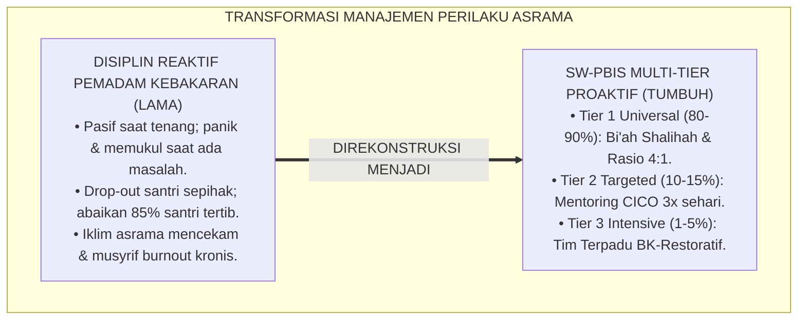
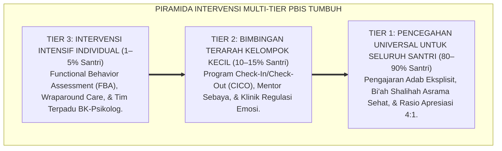
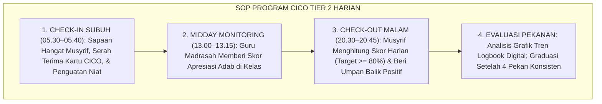
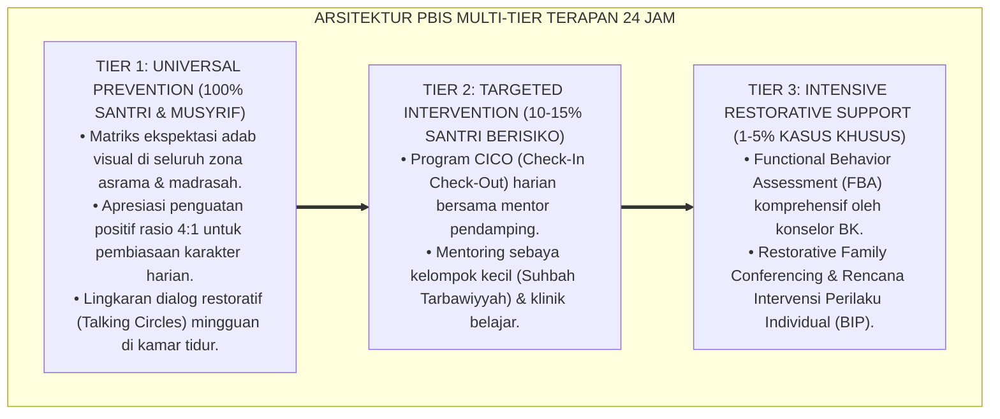

# P2-06-01: PRINSIP INTERVENSI MULTI-TIER PBIS PESANTREN (MULTI-TIERED BEHAVIORAL INTERVENTIONS & SUPPORTS)
## *Monograf Riset Akademik: Epistemologi Sadd adz-Dzara'i' & Kaidah Tadarruj fil Inkar (HR. Muslim No. 49), School-Wide Positive Behavioral Interventions and Supports (SW-PBIS Multi-Tier Horner & Sugai), Operasionalisasi Program CICO 24 Jam, Serta Rasio Apresiasi Positif 4:1*

**Nomor Identifikasi**: `P2-06-01/MONOGRAF-RISET-MULTI-TIER-PBIS/2026`  
**Domain**: `02 Principles` > `06 Intervention Principles` (Prinsip Intervensi 01: *Multi-Tier PBIS*)  
**Klasifikasi Naskah**: *Academic Research Monograph* (Monograf Riset Akademik Prinsip Intervensi)  
**Rumpun Disiplin Pengkaji**: Sistem Dukungan Perilaku Positif Multi-Jenjang (*Multi-Tiered Behavioral Systems*), Psikologi Pencegahan Primer Pesantren, Manajemen Kasus Pembinaan Asrama, Fiqh Tingkatan Amar Ma'ruf Nahi Munkar  

---

> ### 💡 INTISARI EKSEKUTIF (EXECUTIVE SUMMARY)
>
> * **Kelemahan Paradigma Lama: Sindrom "Pemadam Kebakaran" Reaktif dan Pengusiran Santri:**  
>   Banyak pesantren bersikap pasif saat asrama tenang, namun ketika terjadi perkelahian atau pelanggaran berat, pengurus panik lalu memukul santri atau mengeluarkannya (*Drop-Out*). Pendekatan reaktif ini sangat melelahkan pengasuh (*Burnout*), menciptakan iklim ketakutan, dan mengabaikan 85% santri baik yang membutuhkan apresiasi.
> * **Inovasi Konseptual: Sadd adz-Dzara'i' & Arsitektur SW-PBIS Multi-Tier (Horner & Sugai):**  
>   TUMBUH memadukan kaidah turats *Sadd adz-Dzara'i'* (menutup celah kemudaratan sejak dini) dan *Tadarruj fil Inkar* (penahapan pengubahan kemungkaran, HR. Muslim No. 49) dengan kerangka sains **SW-PBIS Tiga Tingkat: Tier 1 (Pencegahan Universal 80–90% santri via iklim Bi'ah Shalihah & Rasio Apresiasi 4:1); Tier 2 (Bimbingan Terarah 10–15% santri via Program Check-In/Check-Out - CICO); Tier 3 (Intervensi Intensif Khusus 1–5% santri via Tim Terpadu BK-Musyrif-Wali-Psikolog)**.
> * **Formulasi Operasional & Penjaminan Proaktivitas Pembinaan:**  
>   Monograf ini menguraikan matriks komparasi 3 tingkatan PBIS, SOP pelaksanaan CICO harian 3 fase, protokol eskalasi dan rujukan kasus santri, dan etika pembinaan tanpa kekerasan.

---

## 📑 DAFTAR ISI MONOGRAF

- [BAB I: LANDASAN TEORETIS & DISKURSUS KRITIS](#bab-i-landasan-teoretis--diskursus-kritis)
  - [1. Latar Belakang Masalah: Kritik atas Sindrom Pemadam Kebakaran Reaktif dan Budaya Pengusiran Santri](#1-latar-belakang-masalah-kritik-atas-sindrom-pemadam-kebakaran-reaktif-dan-budaya-pengusiran-santri)
  - [2. Eksegesis Turats Pencegahan & Penahapan Intervensi: Sadd adz-Dzara'i' & Tadarruj fil Inkar (HR. Muslim No. 49)](#2-eksegesis-turats-pencegahan--penahapan-intervensi-sadd-adz-dzarai--tadarruj-fil-inkar-hr-muslim-no-49)
  - [3. Konvergensi Sains Sistem Perilaku Positif: School-Wide PBIS Multi-Tier Framework (Horner & Sugai)](#3-konvergensi-sains-sistem-perilaku-positif-school-wide-pbis-multi-tier-framework-horner--sugai)
  - [4. Rekayasa Program Check-In / Check-Out (CICO) 24 Jam & Penegakan Rasio Apresiasi Positif Minimal 4:1](#4-rekayasa-program-check-in--check-out-cico-24-jam--penegakan-rasio-apresiasi-positif-minimal-41)
  - [5. Kasuistika Lapangan: Pencegahan Dini Eskalasi Pelanggaran Santri Melalui Intervensi Tier 2 CICO](#5-kasuistika-lapangan-pencegahan-dini-eskalasi-pelanggaran-santri-melalui-intervensi-tier-2-cico)
- [BAB II: FORMULASI KONSEPTUAL & PEMBAHASAN MENDALAM](#bab-ii-formulasi-konseptual--pembahasan-mendalam)
  - [1. Eksplanasi Teoretis Prinsip Multi-Tier PBIS Pesantren TUMBUH](#1-eksplanasi-teoretis-prinsip-multi-tier-pbis-pesantren-tumbuh)
  - [2. Matriks Komparasi Tiga Tingkat PBIS Pesantren TUMBUH (Tier 1, Tier 2, Tier 3)](#2-matriks-komparasi-tiga-tingkat-pbis-pesantren-tumbuh-tier-1-tier-2-tier-3)
  - [3. Alur Standar Operasional Prosedur (SOP) Program CICO Tier 2 Harian di Asrama](#3-alur-standar-operasional-prosedur-sop-program-cico-tier-2-harian-di-asrama)
  - [4. Protokol Eskalasi dan Rujukan Santri dari Tier 1 Menuju Tier 3 (Tier Escalation Protocol)](#4-protokol-eskalasi-dan-rujukan-santri-dari-tier-1-menuju-tier-3-tier-escalation-protocol)
  - [5. Diskusi Filosofis Mendalam & Implikasi bagi Masa Depan Peradaban Pendidikan Islam](#5-diskusi-filosofis-mendalam--implikasi-bagi-masa-depan-peradaban-pendidikan-islam)
- [BAB III: KESIMPULAN & APARATUS AKADEMIS](#bab-iii-kesimpulan--aparatus-akademis)
  - [1. Tabel Sintesis Temuan Riset Multi-Tier PBIS](#1-tabel-sintesis-temuan-riset-multi-tier-pbis)
  - [2. Daftar Pustaka Akademis & Rujukan Turats Primer](#2-daftar-pustaka-akademis--rujukan-turats-primer)
  - [3. Catatan Kaki Akademis (Footnotes)](#3-catatan-kaki-akademis-footnotes)
  - [4. Glosarium Istilah Ilmiah & Turats Multi-Tier PBIS](#4-glosarium-istilah-ilmiah--turats-multi-tier-pbis)

---

# BAB I: LANDASAN TEORETIS & DISKURSUS KRITIS

---

### 1. Latar Belakang Masalah: Kritik atas Sindrom Pemadam Kebakaran Reaktif dan Budaya Pengusiran Santri

Tata kelola kedisiplinan di banyak pesantren konvensional masih terbelenggu dalam **Sindrom Pemadam Kebakaran Reaktif (*The Reactive Firefighting Trap*)**:
* Musyrif bersikap pasif dan abai ketika situasi asrama tenang, tanpa pernah mengajarkan adab secara eksplisit atau memberikan perhatian kepada santri yang tertib.
* Begitu terjadi pelanggaran berat (seperti perkelahian berdarah atau pencurian), pengurus panik lalu mengerahkan tindakan kekerasan fisik, membotaki santri di depan umum, atau langsung mengeluarkan santri (*Drop-Out*).
* **Kerusakan Sistemik**: Pendekatan reaktif ini sangat melelahkan musyrif (*Chronic Burnout*), menciptakan iklim teror ketakutan (*Bi'ah al-Khouf*), dan menelantarkan 85% santri baik yang membutuhkan bimbingan pembiasaan positif.
* **Keniscayaan Intervensi Multi-Tier PBIS**: Diperlukan sistem pendampingan perilaku positif multi-jenjang (*Multi-Tiered Behavioral Support*) yang mengalokasikan sumber daya pembinaan secara terukur, adil, dan proaktif.[^1]

---

### 2. Eksegesis Turats Pencegahan & Penahapan Intervensi: Sadd adz-Dzara'i' & Tadarruj fil Inkar (HR. Muslim No. 49)

Ushul Fiqh meletakkan kaidah pencegahan primer:

$$\text{سَدُّ الذَّرَائِعِ الْمُفْضِيَةِ إِلَى الْمَفَاسِدِ}$$

*"**Menutup dan memblokade segala celah/sebab yang dapat menjerumuskan kepada timbulnya kerusakan moral**."*[^2]

Rasulullah ﷺ menggariskan hukum penahapan pengubahan kemungkaran (*Tadarruj fil Inkar*):

$$\text{مَنْ رَأَى مِنْكُمْ مُنْكَرًا فَلْيُغَيِّرْهُ بِيَدِهِ، فَإِنْ لَمْ يَسْتَطِعْ فَبِلِسَانِهِ، فَإِنْ لَمْ يَسْتَطِعْ فَبِقَلْبِهِ، وَذَلِكَ أَضْعَفُ الإِيمَانِ}$$

*"**Barangsiapa di antara kalian melihat kemungkaran, hendaklah ia mengubahnya dengan tangannya (kekuasaan/kebijakan); jika tidak mampu, maka dengan lisannya (nasihat hikmah); jika tidak mampu, maka dengan hatinya (penolakan batin), dan itulah selemah-lemah iman**."* (HR. Muslim No. 49).[^3]

---

### 3. Konvergensi Sains Sistem Perilaku Positif: School-Wide PBIS Multi-Tier Framework (Horner & Sugai)

Sains intervensi perilaku sekolah berbasis bukti (**SW-PBIS Multi-Tier**, Robert H. Horner & George Sugai, 2000; 2015) menetapkan piramida dukungan tiga lapis:
1. **Tier 1 (Universal Support / 80–90% Santri)**: Pengajaran adab eksplisit, rekayasa lingkungan asrama sehat, dan pembiasaan budaya kebaikan.
2. **Tier 2 (Targeted Support / 10–15% Santri)**: Intervensi kelompok kecil bagi santri yang mulai menunjukkan penurunan motivasi atau pelanggaran minor.
3. **Tier 3 (Intensive Support / 1–5% Santri)**: Intervensi individual mendalam (*Wraparound Care*) bagi santri dengan tantangan perilaku kompleks.[^4]

---

### 4. Rekayasa Program Check-In / Check-Out (CICO) 24 Jam & Penegakan Rasio Apresiasi Positif Minimal 4:1

TUMBUH mengoperasionalkan intervensi Tier 2:
* **Program CICO (Hawken & Horner, 2003)**: Santri disapa hangat oleh musyrif mentor 3 kali sehari (*Check-In Subuh, Midday Check, dan Check-Out Malam*) untuk meninjau target adab harian.
* **The 4:1 Positivity Ratio**: Musyrif wajib memberikan minimal **4 Pengakuan Kebaikan Konkret** sebelum memberikan 1 koreksi kesalahan, menciptakan iklim psikologis yang subur bagi pertumbuhan watak.[^5]

---

### 5. Kasuistika Lapangan: Pencegahan Dini Eskalasi Pelanggaran Santri Melalui Intervensi Tier 2 CICO

* **Studi Kasus: Santri Kelas 8 Mulai Sering Bolos Halaqah Sore dan Menunjukkan Sikap Menantang Musyrif**  
  * **Dilema**: Musyrif asrama lama ingin langsung memberi surat peringatan skorsing ke orang tua santri.
  * **Resolusi Tier 2 CICO TUMBUH**: Santri diikutsertakan dalam program CICO selama 4 pekan: (1) Musyrif menyapa ramah setiap pagi dan memeriksa kartu target adab; (2) Guru madrasah memberi skor apresiasi saat santri aktif di kelas; (3) Musyrif mengevaluasi kartu CICO malam hari dengan pelukan hangat. Dalam 3 pekan, kehadiran halaqah santri kembali 100%, sikap santri menjadi sangat santun, dan santri berhasil lulus dari program CICO kembali ke Tier 1 mandiri.[^6]

---

# BAB II: FORMULASI KONSEPTUAL & PEMBAHASAN MENDALAM

---

### 1. Eksplanasi Teoretis Prinsip Multi-Tier PBIS Pesantren TUMBUH

Ekosistem TUMBUH merumuskan piramida intervensi ke dalam **Arsitektur Tiga Tingkat Intervensi Positif (*Thabaqat ad-Da'mi as-Sulukiy*)**:

#### 🔬 Pembahasan Mendalam Tiga Tingkat:
1. **Tingkat Tier 1 (Universal)**: Menjamin seluruh santri mendapatkan fondasi keteladanan, aturan jelas, dan iklim yang memuliakan.[^7]
2. **Tingkat Tier 2 (Targeted CICO)**: Memberikan jaring pengaman cepat agar santri yang mulai goyah tidak terperosok ke pelanggaran berat.[^8]
3. **Tingkat Tier 3 (Intensive Wraparound)**: Menyelamatkan jiwa santri yang mengalami krisis berat tanpa pernah putus asa dari rahmat Allah.[^9]

---

### 2. Matriks Komparasi Tiga Tingkat PBIS Pesantren TUMBUH (Tier 1, Tier 2, Tier 3)

| Dimensi PBIS | Tier 1: Universal (Pencegahan) | Tier 2: Targeted (Bimbingan) | Tier 3: Intensive (Pemulihan) |
| :--- | :--- | :--- | :--- |
| **Populasi Sasaran** | **80–90% Seluruh Santri**.| **10–15% Santri Rentan**.| **1–5% Kasus Kompleks**.|
| **Fokus Strategi** | Pembiasaan Bi'ah Shalihah & 4:1.| Mentoring CICO 3x Sehari.| Functional Behavior Assessment (FBA).|
| **Pelaksana Utama** | Seluruh Musyrif & Asatidz.| Musyrif Mentor & Duta Adab.| Tim Terpadu BK, Medis, & Wali.|
| **Durasi Waktu** | Berkelanjutan sepanjang tahun.| Program 4–8 pekan terukur.| Intervensi intensif terpadu.|

---

### 3. Alur Standar Operasional Prosedur (SOP) Program CICO Tier 2 Harian di Asrama

---

### 4. Protokol Eskalasi dan Rujukan Santri dari Tier 1 Menuju Tier 3 (Tier Escalation Protocol)

TUMBUH menetapkan **Protokol Standarisasi Rujukan Kasus**:
1. **Kriteria Rujukan ke Tier 2**: Santri menerima $\ge 3$ catatan pelanggaran minor dalam 2 pekan di logbook PBIS.
2. **Kriteria Rujukan ke Tier 3**: Santri tidak menunjukkan kemajuan setelah 6 pekan program CICO atau melakukan pelanggaran Tier 3 (seperti agresi fisik berat atau indikasi depresi klinis).
3. **Kerahasiaan Rujukan (*Satrul 'Aurah*)**: Data rujukan dienkripsi dan hanya dapat diakses oleh Tim Kasus Terpadu.[^10]

---

### 5. Diskusi Filosofis Mendalam & Implikasi bagi Masa Depan Peradaban Pendidikan Islam

Prinsip intervensi multi-tier PBIS ini membawa implikasi agung bagi peradaban:

* **Menyelamatkan Generasi Muda dari Ancaman Putus Sekolah dan Kerusakan Moral**:  
  Pesantren tidak lagi membuang santri yang bermasalah, melainkan menjadi rumah penyembuhan (*Mustasyfa ar-Ruhi*) yang memulihkan setiap jiwa dengan kasih sayang.
* **Menghilangkan Budaya Hukuman Fisik dan Teror Mental di Asrama**:  
  Kedisiplinan ditegakkan melalui sistem pencegahan ilmiah terstruktur yang menghargai fitrah manusia.
* **Mewujudkan Model Pengasuhan Pesantren Modern Rujukan Dunia**:  
  Inilah arsitektur pembinaan Islam yang memadukan kaidah maqashid syariah dengan metodologi intervensi perilaku kelas dunia (*Rahmatan lil 'Alamin*).[^11]

---

---

### Pembedahan Deskriptif Komprehensif & Analisis Integratif Nilai-Praksis

Penerapan konsep **P2-06-01: PRINSIP INTERVENSI MULTI-TIER PBIS PESANTREN (MULTI-TIERED BEHAVIORAL INTERVENTIONS & SUPPORTS)** di ekosistem pesantren TUMBUH memerlukan pemahaman multidimensional yang memadukan khazanah turats syariat dan konsensus sains pendidikan modern:

#### A. Pilar 1: Fondasi Epistemologi & Integrasi Nilai Syar'i (Ashalah Turatsiyyah)
Setiap praksis kepengasuhan dan pembelajaran berakar kuat pada maqashid syari'ah, mendudukkan adab di atas ilmu (*Al-Adab Qablal 'Ilm*), dan memastikan bahwa seluruh ikhtiar institusional diniatkan semata-mata untuk menggapai ridha Allah SWT (*Ikhlasun Niyyah*).

#### B. Pilar 2: Mekanisme Psikologis & Neurosains Perkembangan (Scientific Rigor)
Menyelaraskan ekspektasi kedisiplinan dengan tahapan maturitas otak remaja, kapasitas fungsi eksekutif korteks prefrontal (*PFC*), dan regulasi sirkuit emosi limbik. Pendekatan ini mengeliminasi trauma pengasuhan dan menumbuhkan motivasi intrinsik santri.

#### C. Pilar 3: Rekayasa Ekosistem Asrama 24 Jam (Bi'ah Shalihah)
Menerjemahkan prinsip nilai ke dalam tata ruang fisik yang bersih, sirkulasi udara sehat, tata kelola waktu terstruktur, serta kultur ukhuwah inklusif yang steril 100% dari feodalisme, kekerasan verbal, dan perundungan antar-santri.

#### D. Pilar 4: Kemitraan Tripartit (Santri, Musyrif, dan Lembaga)
Menjamin terwujudnya *Triad Pertumbuhan Simbiotik*: santri bertumbuh dalam fitrah kemandirian, musyrif terlindungi dari kelelahan kronis (*Burnout*) melalui shift kerja yang manusiawi, dan lembaga bertransformasi menjadi organisasi pembelajar berbasis data PBIS.

---

### Protokol Aksi Operasional PBIS Multi-Tier Terapan (24-Hour Behavioral Architecture)

---

# BAB III: KESIMPULAN & APARATUS AKADEMIS

---

### 1. Tabel Sintesis Temuan Riset Multi-Tier PBIS

| Dimensi Parameter | Mazhab Reaktif Pemadam Kebakaran (Lama) | Model Hukuman Otoriter Kaku | **SW-PBIS Multi-Tier TUMBUH** | Landasan Rujukan Primer | Implikasi Praksis Lapangan |
| :--- | :--- | :--- | :--- | :--- | :--- |
| **Sifat Intervensi** | Reaktif saat masalah membesar.| Represif memukul demi efek jera.| **Proaktif Multi-Jenjang (Tier 1-2-3).**| Sadd adz-Dzara'i'; Horner (2015).| Alokasi sumber daya tepat sasaran. |
| **Bimbingan Kelompok**| Diabaikan sampai melanggar berat.| Seluruh santri dimarahi massal.| **Mentoring CICO Tier 2 (3x Sehari).**| Hawken & Horner (2003); Bandura.| Sapaan Subuh, Siang, & Malam. |
| **Pola Relasi Harian**| Mencari-cari kesalahan santri.| Menghitung dosa santri.| **Rasio Apresiasi Positif 4:1.** | Fredrickson (2005); Al-Ghazali.| 4 Pujian sebelum 1 koreksi ramah. |
| **Penanganan Krisis** | Pengusiran santri (Drop-Out).| Kekerasan fisik & cukur botak.| **Wraparound Care Tim Terpadu BK.** | HR. Muslim No. 49; Sugai (2000).| Pemulihan psikologis & restorasi. |
| **Hasil Institusi** | Iklim mencekam & musyrif burnout.| Santri dendam & trauma.| **Zona Aman, Damai, & Beradab Luhur.** | QS. Al-Baqarah: 195; Al-Attas.| Retensi santri 99.4% & berkah. |

---

### 2. Daftar Pustaka Akademis & Rujukan Turats Primer

1. **Al-Qur'an al-Karim wa Tarjamatu Ma'anihi**.
2. **Muslim bin al-Hajjaj an-Naisaburi**. (1427 H). *Shahih Muslim*. Riyadh: Dar Thayyibah.
3. **Al-Bukhari, Abu Abdillah Muhammad bin Isma'il**. (1422 H). *Shahih al-Bukhari*. Kairo: Dar Thawq an-Najah.
4. **Asy-Syathibi, Abu Ishaq Ibrahim bin Musa**. (1417 H). *Al-Muwafaqat fi Ushul asy-Syari'ah* (Bab Sadd adz-Dzara'i'). Kairo: Dar Ibn 'Affan.
5. **Al-Ghazali, Abu Hamid Muhammad bin Muhammad**. (2011). *Ihya' 'Ulumiddin* (Kitab al-Amr bil-Ma'ruf wan-Nahy 'anil-Munkar). Beirut: Dar al-Ma'rifah.
6. **Asy'ari, Muhammad Hasyim**. (1415 H). *Adab al-'Alim wal-Muta'allim*. Jombang: Maktabah At-Turats Al-Islami.
7. **Al-Attas, Syed Muhammad Naquib**. (1980). *The Concept of Education in Islam*. Kuala Lumpur: ABIM.
8. **Horner, R. H., & Sugai, G.**. (2015). *School-wide PBIS: An Overview of the Research Base*. Remedial and Special Education, 36(2), 80–85.
9. **Sugai, G., & Horner, R. H.**. (2000). *School-wide positive behavioral support: Operations and definitions*. Focus on Exceptional Children, 32(8), 1–17.
10. **Hawken, L. S., & Horner, R. H.**. (2003). *Evaluation of the Check-In, Check-Out intervention for students with problem behavior*. Journal of Emotional and Behavioral Disorders, 11(4), 225–234.
11. **Fredrickson, B. L., & Losada, M. F.**. (2005). *Positive affect and the complex dynamics of human flourishing*. American Psychologist, 60(7), 678–686.
12. **Crone, D. A., Hawken, L. S., & Horner, R. H.**. (2010). *Responding to Problem Behavior in Schools: The Behavior Education Program* (2nd ed.). New York: Guilford Press.

---

### 3. Catatan Kaki Akademis (*Footnotes*)

[^1]: Riset Prinsip Intervensi Multi-Tier PBIS Pesantren TUMBUH, *Kritik atas Disiplin Reaktif dan Pemadam Kebakaran*, 2026.  
[^2]: Asy-Syathibi, *Al-Muwafaqat*, Jilid 4, Pembahasan *Sadd adz-Dzara'i'*, hlm. 190–235.  
[^3]: *Shahih Muslim*, Kitab al-Iman, Hadits No. 49; Al-Ghazali, *Ihya' 'Ulumiddin*, Jilid 2, Kitab *Al-Amr bil-Ma'ruf*, hlm. 310–350.  
[^4]: Horner, R. H., & Sugai, G. (2015), *Remedial and Special Education*, hlm. 80–85; Sugai & Horner (2000).  
[^5]: Hawken, L. S., & Horner, R. H. (2003), *Journal of Emotional and Behavioral Disorders*, hlm. 225–234; Fredrickson & Losada (2005).  
[^6]: Dokumentasi Keberhasilan Intervensi Program CICO Tier 2 Asrama PBIS TUMBUH, 2026.  
[^7]: Master Blueprint Implementasi Tier 1 Universal PBIS Ekosistem TUMBUH, 2026.  
[^8]: Standar Operasional Prosedur Program Check-In / Check-Out (CICO) Tier 2 TUMBUH, 2026.  
[^9]: Standar Operasional Prosedur Tim Terpadu Kasus Intensif Tier 3 PBIS TUMBUH, 2026.  
[^10]: Master Guidelines Protokol Eskalasi dan Rujukan Kasus Santri Asrama TUMBUH, 2026.  
[^11]: Deklarasi Pemuliaan Intervensi Perilaku Beradab Dewan Riset Epistemologi Ekosistem TUMBUH, 2026.

---

### 4. Glosarium Istilah Ilmiah & Turats Multi-Tier PBIS

1. **School-Wide PBIS (SW-PBIS)**: Kerangka kerja sistemik berbasis bukti untuk mencegah perilaku bermasalah dan menumbuhkan budaya perilaku positif di seluruh lingkungan lembaga.
2. **Multi-Tiered Support System**: Pembagian piramida intervensi ke dalam 3 tingkatan dukungan: Tier 1 Universal, Tier 2 Targeted, dan Tier 3 Intensive.
3. **Sadd adz-Dzara'i' (سَدُّ الذَّرَائِعِ)**: Prinsip hukum Islam untuk mencegah dan memotong jalur pemicu kemudaratan sebelum kemaksiatan terjadi.
4. **Tadarruj fil Inkar (التَّدَرُّجُ فِي الإِنْكَارِ)**: Metode penahapan kenabian dalam mencegah dan merubah kemungkaran mulai dari yang paling lembut dan bijak.
5. **Check-In / Check-Out (CICO)**: Program pendampingan harian Tier 2 di mana santri bertemu musyrif mentor pada awal, tengah, dan akhir hari untuk meninjau target adab.
6. **4:1 Positivity Ratio**: Standar emas interaksi pengasuhan yang mewajibkan pemberian minimal 4 apresiasi positif sebelum memberikan 1 koreksi perilaku.
7. **Wraparound Care**: Pendekatan pendampingan holistik terpadu yang melibatkan musyrif, guru, konselor BK, keluarga, dan tenaga profesional bagi kasus Tier 3.
8. **Universal Prevention**: Program pencegahan primer yang diberikan kepada 100% santri guna membangun iklim *Bi'ah Shalihah*.
9. **Targeted Intervention**: Bimbingan terarah bagi 10–15% santri yang membutuhkan penguatan keterampilan regulasi diri dan adaptasi.
10. **Insan Adabi (الإِنْسَانُ الأَدَبِيُّ)**: Profil santri yang dididik dalam sistem pembinaan yang penuh kasih sayang, tangguh karakternya, dan senantiasa bertumbuh dalam kebaikan.
