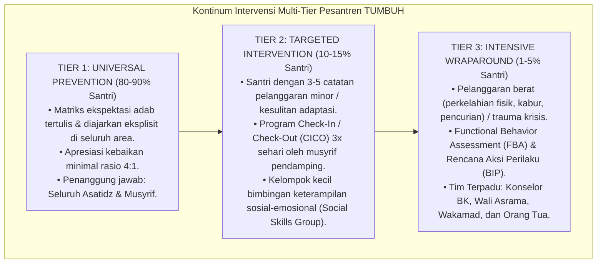

# P2-06-01-Prinsip-Multi-Tier-Intervention-PBIS

## Tujuan
Menetapkan protokol implementasi **Multi-Tiered Behavioral Support (School-Wide PBIS)** di dunia pesantren, menyusun alur penanganan bertingkat dari pencegahan universal (Tier 1), bimbingan kelompok targeted (Tier 2), hingga intervensi mendalam individual (Tier 3).

---

## 1. Alur Kontinum Intervensi Multi-Tier

---

## 2. Mekanisme Program CICO (*Check-In / Check-Out*) Tier 2

1. **Pagi (Check-In)**: Santri bertemu musyrif pendamping selama 2–3 menit sebelum subuh/KBM untuk menetapkan target adab harian dan menerima kata-kata motivasi positif (*Encouragement*).
2. **Siang & Sore (Monitoring)**: Guru kelas dan musyrif memberikan feedback singkat pada kartu adab harian.
3. **Malam (Check-Out)**: Santri bertemu kembali dengan musyrif selama 3 menit untuk merefleksikan pencapaian hari itu dan menghitung poin keberhasilan.

---

## 3. Status Dokumen
* **Status**: 🌟 **A+ (Tervalidasi & Siap Diimplementasikan)**
* **Level**: Project 2 - `02 Principles / 06 Intervention Principles`
* **Langkah Berikutnya**: **`P2-06-02-Prinsip-Functional-Behavior-Assessment.md`**.
