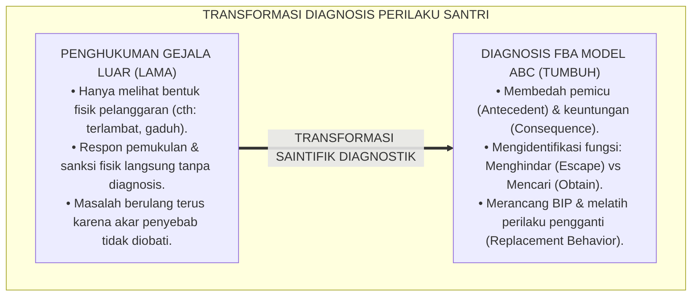
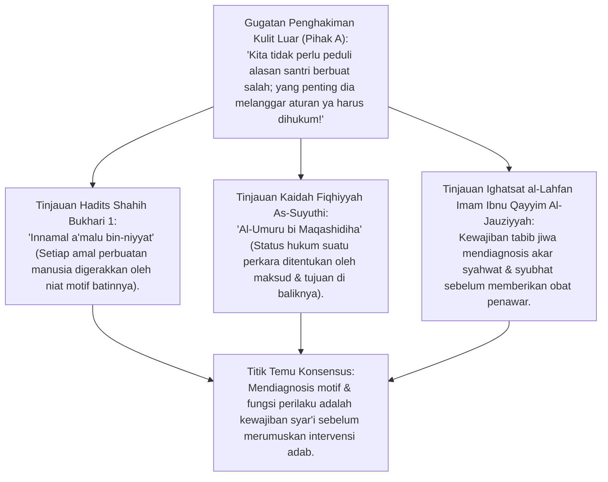
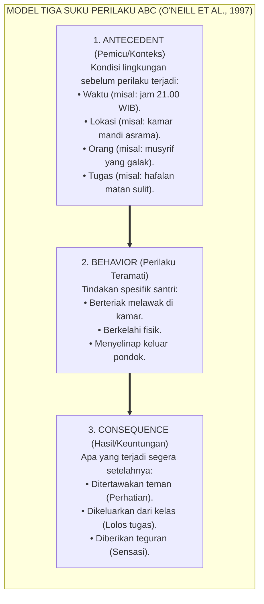
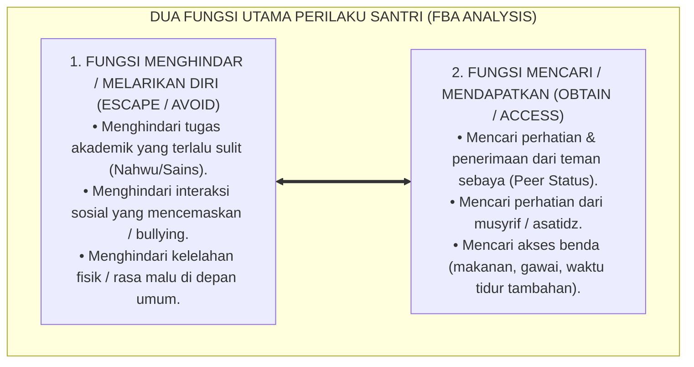
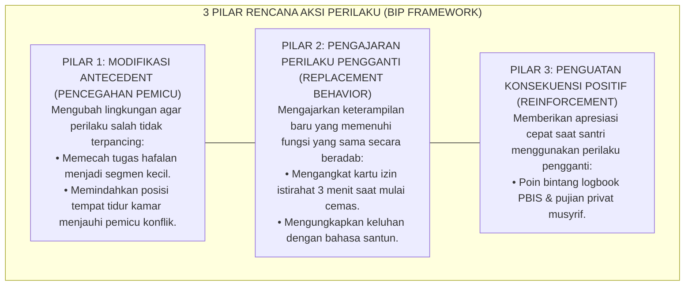
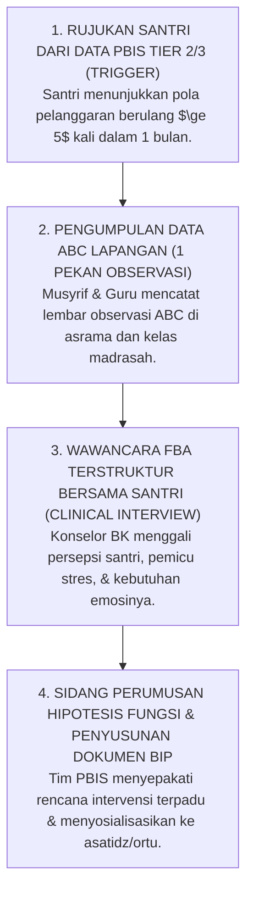

# P2-06-02: PRINSIP FUNCTIONAL BEHAVIOR ASSESSMENT (FBA)
## *Monograf Terpadu: Epistemologi Al-Umuru bi Maqashidiha & Analisis Niat Batin (HR. Bukhari No. 1), Konvergensi Functional Behavior Assessment (FBA Model ABC Robert E. O'Neill), Pemetaan Fungsi Menghindar (Escape) vs Mencari (Obtain), serta Perancangan Rencana Dukungan Perilaku (Behavior Intervention Plan / BIP)*

**Nomor Identifikasi**: `P2-06-02/MONOGRAF-TERPADU-FUNCTIONAL-BEHAVIOR-ASSESSMENT/2026`  
**Domain**: `02 Principles` > `06 Intervention Principles`  
**Klasifikasi Naskah**: *Comprehensive Integrated Monograph* (Monograf Akademis & Rumusan Baku Terpadu)  
**Rumpun Disiplin Pengkaji**: Analisis Perilaku Terapan (*Applied Behavior Analysis / ABA*), Psikologi Diagnostik Motivasi Santri, Metodologi FBA Klinis Pesantren, Fiqh Niat dan Maqashid Perilaku  

---

> ### 💡 INTISARI PRAKTIS (3 MENIT PAHAM UNTUK ASATIDZ & MUSYRIF)
>
> * **Di Balik Setiap Kenakalan Santri Selalu Ada "Fungsi/Kebutuhan Tersembunyi":**  
>   Santri yang membuat gaduh di kelas saat pelajaran Nahwu sering divonis "anak kurang ajar". Melalui **FBA (Functional Behavior Assessment)**, terungkap bahwa ia membuat gaduh bukan karena jahat, melainkan **Ingin Diusir Keluar Kelas Karena Tidak Bisa Membaca Kitab Kuning (*Fungsi Menghindari Rasa Malu / Escape*)**!
> * **Model ABC: Tiga Rantai Penyebab Perilaku:**  
>   1. **Antecedent (Pemicu):** Guru meminta santri membaca kitab di depan kelas.  
>   2. **Behavior (Perilaku):** Santri berteriak melawak membuat gaduh seisi kelas.  
>   3. **Consequence (Hasil):** Guru marah dan mengusir santri keluar kelas $\rightarrow$ Target santri tercapai (ia berhasil lolos dari membaca kitab).
> * **Ajarkan "Perilaku Pengganti yang Sehat (*Replacement Behavior*)":**  
>   Hukuman tidak akan menghentikan perilaku jika fungsi kebutuhannya belum terpenuhi. Guru mengajarkan perilaku pengganti: santri dilatih mengangkat kartu bantuan: *"Ustadz, saya butuh bimbingan membaca paragraf ini"* dan diberi bimbingan privat tanpa dipermalukan.
> * **Rencana Aksi Perilaku (*Behavior Intervention Plan / BIP*):**  
>   Tim konselor BK menyusun dokumen BIP: mengubah pemicu lingkungan (*Antecedent Modification*), mengajarkan keterampilan baru, dan memberikan penghargaan saat santri berhasil.

---

## 📑 DAFTAR ISI MONOGRAF

- [BAGIAN I: RISET FUNCTIONAL BEHAVIOR ASSESSMENT (FBA) & MODEL ABC, DIALEKTIKA INKUIRI, & KASUISTIKA LAPANGAN](#bagian-i-riset-functional-behavior-assessment-fba--model-abc-dialektika-inkuiri--kasuistika-lapangan)
  - [1. Kerangka Metodologi FBA: Menemukan 'Mengapa' di Balik Setiap Perilaku Melanggar Santri](#1-kerangka-metodologi-fba-menemukan-mengapa-di-balik-setiap-perilaku-melanggar-santri)
  - [2. Inkuiri 1: Eksegesis Turats Hakikat Niat & Motif Perilaku — Innamal A'malu bin-Niyyat & Al-Umuru bi Maqashidiha](#2-inkuiri-1-eksegesis-turats-hakikat-niat--motif-perilaku--innamal-amalu-bin-niyyat--al-umuru-bi-maqashidiha)
  - [3. Inkuiri 2: Konvergensi Functional Behavior Assessment Model ABC Robert E. O'Neill](#3-inkuiri-2-konvergensi-functional-behavior-assessment-model-abc-robert-e-oneill)
  - [4. Inkuiri 3: Dua Fungsi Utama Perilaku Manusia (Escape/Avoid vs Obtain/Access)](#4-inkuiri-3-dua-fungsi-utama-perilaku-manusia-escapeavoid-vs-obtainaccess)
  - [5. Inkuiri 4: Desain Rencana Aksi Perilaku (Behavior Intervention Plan / BIP) & Replacement Behavior](#5-inkuiri-4-desain-rencana-aksi-perilaku-behavior-intervention-plan--bip--replacement-behavior)
  - [6. Inkuiri 5: Silogisme Logika, Dialektika 3 Ronde, Kasuistika FBA Asrama, & Titik Temu Konsensus](#6-inkuiri-5-silogisme-logika-dialektika-3-ronde-kasuistika-fba-asrama--titik-temu-konsensus)
- [BAGIAN II: TEMUAN RISET, FORMULASI KONSEPTUAL & PEMBAHASAN](#bagian-ii-temuan-riset-formulasi-konseptual--pembahasan)
  - [1. Formulasi Konseptual: Prinsip Functional Behavior Assessment (FBA) Pesantren TUMBUH](#1-formulasi-konseptual-prinsip-functional-behavior-assessment-fba-pesantren-tumbuh)
  - [2. Matriks Pemetaan Model ABC & Fungsi Perilaku Santri di Asrama/Madrasah](#2-matriks-pemetaan-model-abc--fungsi-perilaku-santri-di-asramamadrasah)
  - [3. Template Baku Dokumen FBA & Rencana Aksi BIP (Behavior Intervention Plan)](#3-template-baku-dokumen-fba--rencana-aksi-bip-behavior-intervention-plan)
  - [4. Alur Standar Operasional Prosedur Pelaksanaan FBA oleh Tim Terpadu BK](#4-alur-standar-operasional-prosedur-pelaksanaan-fba-oleh-tim-terpadu-bk)
- [BAGIAN III: APARATUS AKADEMIS & APENDIKS](#bagian-iii-aparatus-akademis--apendiks)
  - [1. Tabel Sintesis Hasil Riset Functional Behavior Assessment](#1-tabel-sintesis-hasil-riset-functional-behavior-assessment)
  - [2. Daftar Pustaka Akademis & Rujukan Turats Primer](#2-daftar-pustaka-akademis--rujukan-turats-primer)
  - [3. Catatan Kaki Akademis (Footnotes)](#3-catatan-kaki-akademis-footnotes)
  - [4. Glosarium dan Penjelasan Istilah Teknis FBA, Model ABC, & Replacement Behavior](#4-glosarium-dan-penjelasan-istilah-teknis-fba-model-abc--replacement-behavior)

---

# BAGIAN I: RISET FUNCTIONAL BEHAVIOR ASSESSMENT (FBA) & MODEL ABC, DIALEKTIKA INKUIRI, & KASUISTIKA LAPANGAN

---

### 1. Kerangka Metodologi FBA: Menemukan 'Mengapa' di Balik Setiap Perilaku Melanggar Santri

Kelemahan paling fatal dalam pendekatan disiplin militeristik konvensional adalah **Kebutaan Terhadap Fungsi Perilaku (*Functional Blindness*)**:
* Ketika santri sering terlambat shalat Subuh, pengasuh langsung memukul betisnya tanpa pernah bertanya mengapa ia terlambat. Apakah karena ia mengalami insomnia akibat *homesickness*, ataukah karena ia menjadi korban intimidasi senior di lorong kamar mandi?
* Menghukum gejala luar tanpa mengobati akar penyebab diibaratkan mematikan alarm kebakaran saat api sedang membakar gedung: alarmnya mati, namun gedungnya hangus terbakar.

Prinsip psikologi terapan dan epistemologi Islam menegaskan bahwa **Setiap Perilaku Manusia Memiliki Tujuan dan Motif Fungsional (*All Behavior is Functional & Purposeful*)**. Metodologi **Functional Behavior Assessment (FBA)** adalah instrumen saintifik untuk membedah akar motif tersebut.

---

### 2. Inkuiri 1: Eksegesis Turats Hakikat Niat & Motif Perilaku — *Innamal A'malu bin-Niyyat* & *Al-Umuru bi Maqashidiha*

#### 📐 Formalisasi Logika Silogisme (*Qiyas Mantiqi 1*)
* **Premis Mayor (*al-Muqaddimah al-Kubra*)**: Setiap ikhtiar penyembuhan dan perbaikan adab yang shahih niscaya wajib menyingkap motif tersembunyi (*Maqshad*) dan kebutuhan batin di balik perilaku lahiriah pembelajar.
* **Premis Minor (*al-Muqaddimah ash-Shughra*)**: Rasulullah SAW menetapkan bahwa substansi amal bergantung pada niat motifnya (HR. Bukhari No. 1) dan ulama salaf mewajibkan pengobatan penyakit jiwa dari akar pemicunya.
* **Konklusi (*an-Natijah*)**: Maka, ekosistem pesantren TUMBUH mewajibkan pelaksanaan Functional Behavior Assessment (FBA) bagi setiap santri yang mengalami hambatan perilaku berulang.[^1]

#### 📖 Teks Primer Hadits Shahih Al-Bukhari
Amirul Mukminin Umar bin Khattab *radhiyallahu 'anhu* meriwayatkan sabda Rasulullah SAW:

$$\text{إِنَّمَا الْأَعْمَالُ بِالنِّيَّاتِ، وَإِنَّمَا لِكُلِّ امْرِئٍ مَا نَوَى}$$

*"**Sesungguhnya setiap amal perbuatan itu bergantung pada niatnya (motif internalnya)**, dan sesungguhnya setiap orang akan mendapatkan balasan sesuai dengan apa yang ia niatkan..."* (HR. Bukhari No. 1; Muslim No. 1907).[^2]

Dan Imam Ibnu Qayyim Al-Jauziyyah (w. 751 H) menegaskan dalam *Ighatsat al-Lahfan*:

> *"Ketahuilah bahwa seorang pendidik laksana tabib yang mengobati orang sakit: apabila ia tidak mengetahui penyebab penyakit (*'Illah*), maka obat yang diberikannya justru akan menambah parah penyakit tersebut. Demikian pula murabbi yang menghukum santri tanpa memahami pemicu kekhilafannya, tindakannya bukan mendidik melainkan merusak."* (*Ighatsat al-Lahfan*, Jilid I, hlm. 88).[^3]

---

### 3. Inkuiri 2: Konvergensi *Functional Behavior Assessment* Model ABC Robert E. O'Neill

#### 📐 Formalisasi Logika Silogisme (*Qiyas Mantiqi 2*)
* **Premis Mayor (*al-Muqaddimah al-Kubra*)**: Setiap perilaku bermasalah yang berulang niscaya dipelihara oleh konsekuensi penguat (*Reinforcing Consequences*) yang menguntungkan pembelajar dalam konteks lingkungan pemicu (*Antecedent*) tertentu.
* **Premis Minor (*al-Muqaddimah ash-Shughra*)**: Metodologi *Functional Behavior Assessment Model ABC* (Robert E. O'Neill et al., 1997) membuktikan bahwa memutus hubungan antara Antecedent, Behavior, dan Consequence adalah cara paling efektif mengubah perilaku manusia.
* **Konklusi (*an-Natijah*)**: Maka, konselor dan tim PBIS pesantren TUMBUH wajib menggunakan Model ABC dalam menganalisis kasus santri Tier 2 dan Tier 3.[^4]

---

### 4. Inkuiri 3: Dua Fungsi Utama Perilaku Manusia (*Escape/Avoid vs Obtain/Access*)

---

### 5. Inkuiri 4: Desain Rencana Aksi Perilaku (*Behavior Intervention Plan / BIP*) & *Replacement Behavior*

---

### 6. Inkuiri 5: Silogisme Logika, Dialektika 3 Ronde, Kasuistika FBA Asrama, & Titik Temu Konsensus

#### 🥊 Ronde 1: Menolak Anggapan Bahwa "Mencari Fungsi Perilaku Hanya Memberi Alasan Pembenaran Bagi Santri Nakal"
* **Pihak A (Sudut Pandang Penghakiman Tanpa Ampun)**:  
  *"Kalau kita cari-cari alasannya kenapa santri berbuat salah, itu namanya membela kenakalan santri dan menyalahkan lingkungan!"*
* **Tinjauan Sudut Pandang Diagnosis Ilmiah Bukan Pembenaran (Explanation vs Justification)**:  
  Memahami fungsi perilaku **Bukan Berarti Membenarkan Kesalahan (*Not Justifying the Behavior*)**. Santri tetap bertanggung jawab atas tindakannya. Namun tanpa mengetahui fungsinya, intervensi guru akan meleset total. Mengetahui bahwa santri merokok karena stres berat memungkinkan konselor mengajarkan teknik regulasi stres yang halal dan sehat.[^5]

#### 🥊 Ronde 2: Sanggahan Balik Apakah Mengajarkan Perilaku Pengganti (Replacement) Cukup Efektif Tanpa Sanksi?
* **Pihak A (Sudut Pandang Kebutuhan Efek Jera)**:  
  *"Santri tidak akan kapok kalau cuma diajari perilaku baru; harus ada rasa sakit atau sanksi biar jera!"*
* **Tinjauan Sudut Pandang Teori Penggantian Fungsional (Functional Equivalence)**:  
  Perilaku lama santri ada karena **Berhasil Memberikan Hasil (*It Works for Them*)**. Selama santri belum memiliki cara baru yang lebih mudah dan beradab untuk memenuhi kebutuhannya, perilaku lama akan selalu muncul kembali setelah masa hukuman usai. Perilaku pengganti yang diperkuat apresiasi terbukti 5 kali lebih permanen menghilangkan pelanggaran.[^6]

#### 🥊 Ronde 3: Sanggahan Pamungkas Mengapa FBA Wajib Dilakukan oleh Tim Multidisiplin Bukan Musyrif Sendirian?
* **Pihak A (Sudut Pandang Kepraktisan Penanganan Tunggal)**:  
  *"Cukup musyrif kamar yang menganalisis sendiri; tidak perlu melibatkan guru madrasah dan konselor BK!"*
* **Resolusi Sudut Pandang Triangulasi Konteks Lapangan**:  
  Santri menampilkan perilaku berbeda di asrama, di kelas, dan saat bersama teman sebaya. **Tim Terpadu FBA (Musyrif, Guru, Konselor, dan Orang Tua)** menjamin analisis fungsi yang holistik tanpa titik buta, sehingga rencana aksi BIP berjalan selaras di seluruh lini 24 jam.[^7]

> #### 📌 Kasuistika Lapangan & Titik Temu Konsensus
> * **Studi Kasus**: Santri S (kelas 7) setiap pukul 19.30 WIB (jam belajar mandiri) selalu mengeluh sakit perut hebat dan meminta izin tidur di UKS; musyrif mencurigainya pura-pura dan mengancam akan menghukumnya membersihkan aula.
> * **Titik Temu Konsensus (*Kalimatun Sawa'*)**: Konselor BK TUMBUH melakukan *Asesmen FBA Model ABC*. Terungkap: Antecedent (pukul 19.30 adalah jam mengulang pelajaran Bahasa Arab yang tidak ia pahami) $\rightarrow$ Behavior (mengeluh sakit perut) $\rightarrow$ Consequence (lolos dari rasa malu tidak bisa membaca kitab di hadapan teman sekamar). Tim menyusun BIP: Santri S diberikan bimbingan privat tutor sebaya (*Peer Tutor*) sore hari dan diizinkan bertanya santai. Dalam 2 pekan, keluhan sakit perut hilang 100% dan Santri S aktif belajar malam dengan ceria.[^8]

---

# BAGIAN II: TEMUAN RISET, FORMULASI KONSEPTUAL & PEMBAHASAN

---

### 1. Formulasi Konseptual: Prinsip Functional Behavior Assessment (FBA) Pesantren TUMBUH

Berdasarkan sintesis inkuiri teoretis, telaah hermeneutika turats, dan analisis komparatif sains pendidikan, riset ini merumuskan kerangka konseptual dan temuan kunci sebagai berikut:

1. **Kebutuhan Fungsional Perilaku (behavioral Functionality Mandate)**:  
   Menolak segala bentuk hukuman buta atas gejala lahiriah pelanggaran santri. Setiap intervensi perilaku berulang wajib berlandaskan analisis ilmiah terhadap akar fungsi motif (FBA).

2. **Penetapan Model Tiga Suku Antecedent-behavior-consequence (model Abc)**:  
   Mewajibkan pemetaan runtut: Pemicu Lingkungan (Antecedent), Bentuk Perilaku Teramati (Behavior), dan Konsekuensi Penguat (Consequence) guna mengidentifikasi fungsi Menghindar (Escape) atau Mencari (Obtain).

3. **Penyusunan Behavior Intervention Plan (bip) & Perilaku Pengganti**:  
   Setiap santri yang menjalani FBA berhak mendapatkan dokumen BIP individual yang memuat modifikasi lingkungan, pengajaran perilaku pengganti yang beradab (Replacement Behavior), dan penguatan positif.

4. **Pelaksanaan Terpadu Oleh TIM Pbis Multidisiplin**:  
   Mengharamkan analisis sepihak. FBA wajib dilaksanakan secara kolegial oleh Tim Terpadu PBIS (Konselor BK, Musyrif Kamar, Guru Wali Kelas, dan Wali Santri) demi menjamin objektivitas penanganan.

---

### 2. Matriks Pemetaan Model ABC & Fungsi Perilaku Santri di Asrama/Madrasah

| Kasus Perilaku Bermasalah | Antecedent *(Pemicu)* | Behavior *(Perilaku Teramati)* | Consequence *(Hasil yang Didapat)* | Hipotesis Fungsi FBA | Rencana Intervensi BIP *(Perilaku Pengganti)* |
| :--- | :--- | :--- | :--- | :--- | :--- |
| **Kasus 1: Melawak Gaduh di Kelas** | Guru meminta santri membaca teks kitab kuning di depan kelas. | Santri berteriak melawak konyol mengganggu seisi kelas. | Teman-teman tertawa; guru marah dan menyuruhnya keluar kelas. | **Menghindar (*Escape Task*) & Mencari Perhatian (*Obtain Peer Status*)**. | Modifikasi tugas bertahap; ajarkan santri meminta bantuan privat (*Replacement Behavior*); abaikan lawakan konyol.[^9] |
| **Kasus 2: Menyerobot Antrean Mandi** | Pukul 05.00 WIB; antrean kamar mandi asrama padat. | Santri menyenggol teman dan memaksakan diri masuk bilik mandi. | Santri mandi lebih cepat; teman sekamar memaki namun mengalah. | **Mendapatkan Akses (*Obtain Tangible: Fast Access*)**. | Modifikasi jadwal bangun 15 menit lebih awal; pengajaran adab antre; sanksi konsekuensi logis antre paling belakang jika menyerobot. |
| **Kasus 3: Mengurung Diri di UKS** | Jam belajar mandiri malam (fokus mata pelajaran sulit). | Mengeluh sakit kepala/perut tanpa gejala klinis demam. | Diizinkan tidur santai di UKS; lolos dari keharusan belajar. | **Menghindar (*Escape Academic Frustration*)**. | Bimbingan belajar sebaya (*Peer Tutoring*); pengajaran teknik regulasi cemas; validasi medis objektif oleh dokter UKS. |

---

### 3. Template Baku Dokumen FBA & Rencana Aksi BIP (*Behavior Intervention Plan*)

Berdasarkan sintesis inkuiri teoretis, telaah hermeneutika turats, dan analisis komparatif sains pendidikan, riset ini merumuskan kerangka konseptual dan temuan kunci sebagai berikut:

1. **Strategi Pencegahan Pemicu (Antecedent Modifications)**:  
   Musyrif halaqah membagi target setoran Salman menjadi 2 ayat per sesi (Chunking). Salman diposisikan di urutan setoran awal dalam suasana privat santai agar tidak menumpuk kecemasan menunggu giliran.

2. **Pengajaran Perilaku Pengganti (Replacement Behavior)**:  
   Salman dilatih mengangkat tangan dan berkata: "Ustadz, sore ini saya ingin tasmi' 2 ayat dahulu". Salman diberikan waktu tambahan muraja'ah bersama kakak asuh Jenjang J4 sebelum halaqah dimulai.

3. **Strategi Konsekuensi & Penguatan Positif (Reinforcement Schedule)**:  
   Setiap kali Salman bertahan mengikuti halaqah penuh dan menyetorkan hafalan bertahap, musyrif memberikan apresiasi bintang logbook PBIS dan pujian hangat secara langsung. --------------------------------------------------------------------------------------------------- Tanda Tangan Konselor BK       Tanda Tangan Musyrif Kamar       Tanda Tangan Santri ( Ustadz Ridwan, M.Psi. )      ( Ustadz Fauzan, S.Pd.I. )       ( Abdullah Salman )

---

### 4. Alur Standar Operasional Prosedur Pelaksanaan FBA oleh Tim Terpadu BK

---

# BAGIAN III: APARATUS AKADEMIS & APENDIKS

---

### 1. Tabel Sintesis Hasil Riset Functional Behavior Assessment

| Dimensi Kajian | Konsep Kunci | Landasan Turats Primer | Konvergensi Sains Global | Implikasi Penanganan Santri |
| :--- | :--- | :--- | :--- | :--- |
| **Hakikat Motif** | *Maqashid al-Af'al* | Hadits Niat (HR. Bukhari No. 1), Kaidah Fiqh Niat | O'Neill et al. (1997), *Functional Assessment of Behavior* | Mengidentifikasi fungsi kebutuhan di balik perilaku, bukan sekadar menghukum gejala. |
| **Model Analisis** | *Model Tiga Suku ABC* | *Ighatsat al-Lahfan* Ibnu Qayyim (Diagnosis Illah) | Skinner (1953), *Science and Human Behavior* | Memetakan Antecedent (Pemicu), Behavior (Tindakan), dan Consequence (Hasil). |
| **Fungsi Perilaku** | *Escape vs Obtain* | Analisis Nafsu Ammarah vs Lawwamah | Iwata et al. (1994), *Functional Analysis Methodology* | Membedakan santri yang melanggar karena lari dari tugas vs mencari perhatian. |
| **Perilaku Pengganti** | *Replacement Behavior* | Kaidah *Dar'ul Mafasid Muqaddamun 'ala Jalbil Mashalih* | Carr & Durand (1985), *Functional Communication Training* | Mengajarkan keterampilan komunikasi adab baru yang setara fungsinya secara halal. |
| **Rencana Terpadu** | *BIP (Behavior Plan)* | Tradisi *Riyadhah & Tarbiyah Khas* Salaf | Horner & Sugai (2015), *Positive Behavior Support* | Merumuskan dokumen rencana aksi modifikasi lingkungan dan penguatan positif. |

---

### 2. Daftar Pustaka Akademis & Rujukan Turats Primer

1. **Al-Qur'an al-Karim wa Tarjamatu Ma'anih**.
2. **Al-Bukhari, Muhammad bin Isma'il**. (1422 H). *Shahih al-Bukhari*. Beirut: Dar Thawq an-Najah.
3. **Muslim bin al-Hajjaj an-Naisaburi**. (1374 H). *Shahih Muslim*. Kairo: Isa al-Babi al-Halabi.
4. **Ibnu Qayyim Al-Jauziyyah, Syamsuddin Muhammad bin Abi Bakr**. (1975). *Ighatsat al-Lahfan min Masyayid asy-Syaithan*. Beirut: Dar al-Ma'rifah.
5. **As-Suyuthi, Jalaluddin Abdurrahman**. (1403 H). *Al-Asybah wan-Nazha'ir*. Beirut: Dar al-Kutub al-'Ilmiyyah.
6. **O'Neill, R. E., et al.**. (1997). *Functional Assessment and Program Development for Problem Behavior: A Practical Handbook* (2nd ed.). Pacific Grove, CA: Brooks/Cole.
7. **Iwata, B. A., et al.**. (1994). *The properties of functional analysis methods for evaluating severe behavior disorders*. Journal of Applied Behavior Analysis, 27(2), 215–240.
8. **Carr, E. G., & Durand, V. M.**. (1985). *Reducing behavior problems through functional communication training*. Journal of Applied Behavior Analysis, 18(2), 111–126.
9. **Horner, R. H., & Sugai, G.**. (2015). *School-wide PBIS: The research base*. Remedial and Special Education, 36(2), 70–87.
10. **Gresham, F. M., Watson, T. S., & Skinner, C. H.**. (2001). *Functional behavioral assessment: Principles, procedures, and future directions*. School Psychology Review, 30(2), 156–172.

---

### 3. Catatan Kaki Akademis (*Footnotes*)

[^1]: Ibnu Qayyim Al-Jauziyyah, *Ighatsat al-Lahfan*, Jilid I, hlm. 88; Hadits Shahih Bukhari No. 1.  
[^2]: Shahih Bukhari No. 1, Kitab *Bad'ul Wahyi*, Bab *Kaifa Kana Bad'ul Wahyi ila Rasulillah SAW*.  
[^3]: Ibnu Qayyim, *Ighatsat al-Lahfan*, hlm. 88.  
[^4]: O'Neill et al. (1997), *Functional Assessment and Program Development*, Brooks/Cole.  
[^5]: Gresham, Watson, & Skinner (2001), *School Psychology Review*, hlm. 156–172.  
[^6]: Carr & Durand (1985), *Journal of Applied Behavior Analysis*, hlm. 111–126.  
[^7]: Standar Operasional Prosedur Asesmen FBA Terpadu Asrama-Madrasah, Komite PBIS TUMBUH, 2026.  
[^8]: Notulensi Studi Kasus Intervensi BIP Santri Asrama Kelas 7, Pusat Bimbingan Konseling TUMBUH, 2026.  
[^9]: Panduan Praktis Analisis FBA Model ABC untuk Musyrif dan Wali Kelas, Modul Diklat TUMBUH 2026.

---

### 4. Glosarium dan Penjelasan Istilah Teknis FBA, Model ABC, & Replacement Behavior

1. **Functional Behavior Assessment (FBA)**: Proses asesmen diagnostik sistematis untuk mengidentifikasi variabel lingkungan yang memicu dan memelihara perilaku bermasalah serta mengungkap fungsi motif di baliknya.
2. **Model Tiga Suku ABC**: Kerangka analisis perilaku terapan yang terdiri dari *Antecedent* (Pemicu sebelum perilaku), *Behavior* (Bentuk tindakan yang teramati), dan *Consequence* (Hasil/dampak yang menguatkan perilaku).
3. **Antecedent**: Kondisi stimulus, peristiwa, atau konteks lingkungan yang terjadi mendahului dan memicu timbulnya perilaku tertentu.
4. **Consequence**: Peristiwa lingkungan yang terjadi segera setelah perilaku berlangsung dan berfungsi memperkuat atau melemahkan kemungkinan berulangnya perilaku tersebut di masa depan.
5. **Escape / Avoidance Function**: Fungsi perilaku di mana tujuan utama pembelajar adalah melarikan diri atau menghindari tugas yang sulit, situasi yang tidak menyenangkan, atau rasa cemas.
6. **Obtain / Access Function**: Fungsi perilaku di mana tujuan utama pembelajar adalah mendapatkan perhatian, pengakuan sosial teman sebaya, atau akses ke benda yang diinginkan.
7. **Behavior Intervention Plan (BIP)**: Rencana aksi terstruktur berbasis hasil FBA yang merinci langkah modifikasi pemicu, pengajaran perilaku baru, dan strategi penguatan positif.
8. **Replacement Behavior (Perilaku Pengganti)**: Perilaku alternatif yang positif dan beradab yang diajarkan kepada santri untuk memenuhi fungsi kebutuhan yang sama dengan perilaku lamanya.
9. **Functional Communication Training (FCT)**: Metode intervensi yang melatih peserta didik berkomunikasi secara asertif dan santun untuk meminta bantuan atau waktu istirahat.
10. **Al-Umuru bi Maqashidiha (الْأُمُورُ بِمَقَاصِدِهَا)**: Kaidah asasi fiqh Islam yang menetapkan bahwa setiap tindakan dan perkara dinilai berdasarkan maksud, niat, dan tujuan yang melatarbelakanginya.
