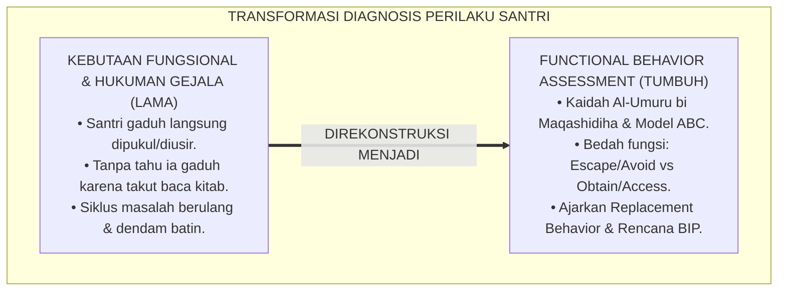
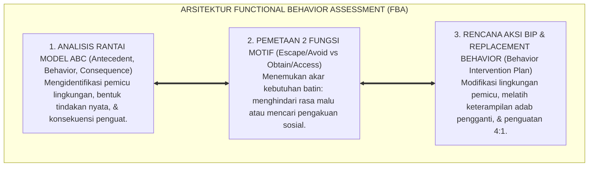
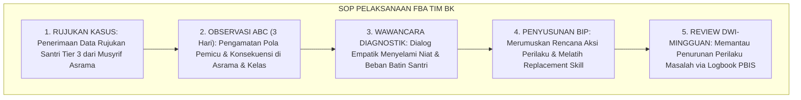
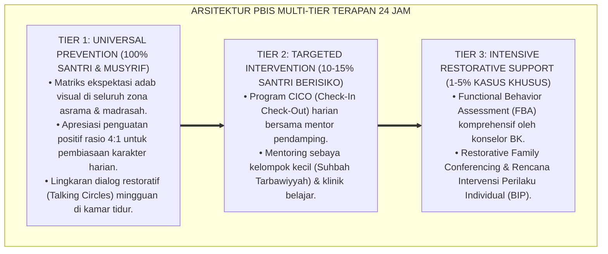

# P2-06-02: PRINSIP FUNCTIONAL BEHAVIOR ASSESSMENT (FBA) DAN DIAGNOSIS PERILAKU
## *Monograf Riset Akademik: Epistemologi Al-Umuru bi Maqashidiha & Analisis Niat Batin (HR. Bukhari No. 1), Functional Behavior Assessment (FBA Model ABC Robert E. O'Neill), Pemetaan Fungsi Escape vs Obtain, Serta Perancangan Behavior Intervention Plan (BIP) di Pesantren 24 Jam*

**Nomor Identifikasi**: `P2-06-02/MONOGRAF-RISET-FUNCTIONAL-BEHAVIOR-ASSESSMENT/2026`  
**Domain**: `02 Principles` > `06 Intervention Principles` (Prinsip Intervensi 02: *Functional Behavior Assessment*)  
**Klasifikasi Naskah**: *Academic Research Monograph* (Monograf Riset Akademik Prinsip Intervensi)  
**Rumpun Disiplin Pengkaji**: Analisis Perilaku Terapan (*Applied Behavior Analysis / ABA*), Psikologi Diagnostik Motivasi Santri, Metodologi FBA Klinis Pesantren, Fiqh Niat dan Maqashid Perilaku  

---

> ### 💡 INTISARI EKSEKUTIF (EXECUTIVE SUMMARY)
>
> * **Kelemahan Paradigma Lama: Kebutaan Terhadap Akar Masalah (Functional Blindness):**  
>   Banyak pengasuh hanya memukul santri yang melanggar tanpa pernah mencari tahu motif di balik perilakunya. Menghukum santri yang membuat gaduh di kelas nahwu tanpa tahu bahwa ia gaduh karena ingin diusir keluar demi menghindari rasa malu tidak bisa membaca kitab (*Fungsi Escape*), hanya akan melanggengkan siklus kenakalan.
> * **Inovasi Konseptual: Al-Umuru bi Maqashidiha & FBA Model ABC (Robert E. O'Neill):**  
>   TUMBUH memadukan kaidah ushul *Al-Umuru bi Maqashidiha* (setiap perbuatan dinilai dari maksud tujuannya) dan sabda Nabi ﷺ mengenai niat (HR. Bukhari No. 1) dengan kerangka sains **Functional Behavior Assessment (FBA Model ABC)**: membedah rantai **Antecedent (Pemicu Lingkungan) $\rightarrow$ Behavior (Bentuk Perilaku Teramati) $\rightarrow$ Consequence (Fungsi Penguatan Kebutuhan)**. Memetakan 2 fungsi utama: **Menghindar (*Escape/Avoid*)** atau **Mencari (*Obtain/Access*)**, lalu merumuskan **Perilaku Pengganti yang Sehat (*Replacement Behavior*)**.
> * **Formulasi Operasional & Penjaminan Solusi Tuntas:**  
>   Monograf ini menguraikan matriks pemetaan Model ABC, template baku dokumen FBA & Rencana Dukungan Perilaku (*Behavior Intervention Plan / BIP*), SOP pelaksanaan asesmen oleh Tim BK, dan etika diagnosis ramah martabat santri.

---

## 📑 DAFTAR ISI MONOGRAF

- [BAB I: LANDASAN TEORETIS & DISKURSUS KRITIS](#bab-i-landasan-teoretis--diskursus-kritis)
  - [1. Latar Belakang Masalah: Kritik atas Kebutaan Fungsional dan Bahaya Menghukum Gejala Luar Semata](#1-latar-belakang-masalah-kritik-atas-kebutaan-fungsional-dan-bahaya-menghukum-gejala-luar-semata)
  - [2. Eksegesis Turats Hakikat Niat & Maqashid Perilaku: Hadits Innamal A'malu bin-Niyyat & Kaidah Al-Umuru bi Maqashidiha](#2-eksegesis-turats-hakikat-niat--maqashid-perilaku-hadits-innamal-amalu-bin-niyyat--kaidah-al-umuru-bi-maqashidiha)
  - [3. Konvergensi Sains Analisis Perilaku: Functional Behavior Assessment Model ABC (Robert E. O'Neill)](#3-konvergensi-sains-analisis-perilaku-functional-behavior-assessment-model-abc-robert-e-oneill)
  - [4. Rekayasa Dua Fungsi Perilaku Manusia (Escape vs Obtain) & Perancangan Replacement Behavior](#4-rekayasa-dua-fungsi-perilaku-manusia-escape-vs-obtain--perancangan-replacement-behavior)
  - [5. Kasuistika Lapangan: Studi Kasus Santri Sering Kabur dari Jam Tahfizh & Resolusi BIP Berbasis FBA](#5-kasuistika-lapangan-studi-kasus-santri-sering-kabur-dari-jam-tahfizh--resolusi-bip-berbasis-fba)
- [BAB II: FORMULASI KONSEPTUAL & PEMBAHASAN MENDALAM](#bab-ii-formulasi-konseptual--pembahasan-mendalam)
  - [1. Eksplanasi Teoretis Prinsip Functional Behavior Assessment (FBA) Pesantren TUMBUH](#1-eksplanasi-teoretis-prinsip-functional-behavior-assessment-fba-pesantren-tumbuh)
  - [2. Matriks Pemetaan Model ABC & Fungsi Perilaku Santri di Asrama dan Madrasah](#2-matriks-pemetaan-model-abc--fungsi-perilaku-santri-di-asrama-dan-madrasah)
  - [3. Template Baku Dokumen FBA & Rencana Aksi BIP (Behavior Intervention Plan)](#3-template-baku-dokumen-fba--rencana-aksi-bip-behavior-intervention-plan)
  - [4. Alur Standar Operasional Prosedur (SOP) Pelaksanaan FBA oleh Tim Terpadu BK](#4-alur-standar-operasional-prosedur-sop-pelaksanaan-fba-oleh-tim-terpadu-bk)
  - [5. Diskusi Filosofis Mendalam & Implikasi bagi Masa Depan Peradaban Pendidikan Islam](#5-diskusi-filosofis-mendalam--implikasi-bagi-masa-depan-peradaban-pendidikan-islam)
- [BAB III: KESIMPULAN & APARATUS AKADEMIS](#bab-iii-kesimpulan--aparatus-akademis)
  - [1. Tabel Sintesis Temuan Riset Functional Behavior Assessment](#1-tabel-sintesis-temuan-riset-functional-behavior-assessment)
  - [2. Daftar Pustaka Akademis & Rujukan Turats Primer](#2-daftar-pustaka-akademis--rujukan-turats-primer)
  - [3. Catatan Kaki Akademis (Footnotes)](#3-catatan-kaki-akademis-footnotes)
  - [4. Glosarium Istilah Ilmiah & Turats Functional Behavior Assessment](#4-glosarium-istilah-ilmiah--turats-functional-behavior-assessment)

---

# BAB I: LANDASAN TEORETIS & DISKURSUS KRITIS

---

### 1. Latar Belakang Masalah: Kritik atas Kebutaan Fungsional dan Bahaya Menghukum Gejala Luar Semata

Kelemahan paling fatal dalam pendekatan disiplin militeristik konvensional adalah **Kebutaan Terhadap Fungsi Perilaku (*Functional Blindness*)**:
* Ketika santri sering terlambat shalat Subuh atau membuat keributan di kelas, pengasuh langsung menghukum fisik tanpa pernah bertanya mengapa ia berbuat demikian.
* Apakah keterlambatannya dipicu oleh intimidasi senior di lorong kamar mandi (*Antecedent Lingkungan*), ataukah keributannya dipicu oleh rasa takut dipermalukan karena belum lancar membaca kitab (*Fungsi Menghindari Tugas / Escape*)?
* Menghukum gejala luar tanpa mengobati akar penyebab ibarat mematikan alarm kebakaran saat api sedang membakar gedung: alarmnya mati, namun gedungnya hangus terbakar.
* **Keniscayaan Diagnosis FBA Ilmiah**: Setiap perilaku manusia selalu didorong oleh tujuan dan fungsi pemenuhan kebutuhan tertentu (*All Behavior is Purposeful*). Metodologi **Functional Behavior Assessment (FBA)** adalah instrumen presisi untuk membedah motif batin tersebut.[^1]



---

### 2. Eksegesis Turats Hakikat Niat & Maqashid Perilaku: Hadits Innamal A'malu bin-Niyyat & Kaidah Al-Umuru bi Maqashidiha

Rasulullah ﷺ meletakkan fondasi tertinggi bahwa setiap amal dinilai dari niat dan motif yang melatarbelakanginya:

$$\text{إِنَّمَا الأَعْمَالُ بِالنِّيَّاتِ، وَإِنَّمَا لِكُلِّ امْرِئٍ مَا نَوَى}$$

*"**Sesungguhnya setiap perbuatan itu dinilai berdasarkan niatnya, dan sesungguhnya setiap orang akan memperoleh apa yang ia niatkan**."* (HR. Al-Bukhari No. 1 & Muslim No. 1907).[^2]

Kaidah Fiqhiyyah induk pertama menegaskan:

$$\text{الأُمُورُ بِمَقَاصِدِهَا}$$

*"**Segala urusan dan tindakan hukum bergantung pada maksud tujuannya (Maqashid)**."*[^3]

Pendidik yang arif tidak sekadar menghakimi gerakan lahiriah, melainkan membedah motif kejiwaan yang melatarbelakangi perbuatan muridnya (*Fiqh Maqashid as-Suluk*).[^4]

---

### 3. Konvergensi Sains Analisis Perilaku: Functional Behavior Assessment Model ABC (Robert E. O'Neill)

Sains analisis perilaku terapan (**Functional Assessment**, O'Neill et al., 1997; Sugai et al., 2000) membuktikan rantai kausalitas tiga mata rantai (*The 3-Term Contingency*):
1. **Antecedent ($A$)**: Peristiwa, tempat, atau stimulus pemicu yang terjadi tepat sebelum perilaku muncul.
2. **Behavior ($B$)**: Bentuk tindakan spesifik santri yang kasat mata dan terukur.
3. **Consequence ($C$)**: Respon lingkungan atau hasil yang diperoleh santri setelah perilaku muncul, yang berfungsi memperkuat (*Reinforce*) perilaku tersebut.[^5]

---

### 4. Rekayasa Dua Fungsi Perilaku Manusia (Escape vs Obtain) & Perancangan Replacement Behavior

Sains FBA memetakan 2 fungsi utama perilaku:
1. **Escape / Avoid (Menghindari)**: Menghindari tugas sulit, rasa malu di depan umum, atau konflik dengan kawan.
2. **Obtain / Access (Mencari / Mendapatkan)**: Mencari perhatian guru/teman, mendapatkan hak istimewa, atau mencari stimulasi sensori.
* **Replacement Behavior**: Guru tidak boleh sekadar melarang, melainkan wajib mengajarkan **Perilaku Pengganti yang Sehat dan Efektif secara Fungsional** (misal: santri diajari mengangkat kartu bantuan privat saat belum paham materi).[^6]

---

### 5. Kasuistika Lapangan: Studi Kasus Santri Sering Kabur dari Jam Tahfizh & Resolusi BIP Berbasis FBA

* **Studi Kasus: Santri Kelas 7 Selalu Sakit Perut dan Pergi ke UKS Tepat Pukul 16.30 Saat Jam Halaqah Tahfizh Sore**  
  * **Dilema**: Musyrif asrama lama menuduh santri pura-pura sakit dan memaksanya tetap duduk di halaqah sambil dibentak.
  * **Resolusi FBA TUMBUH**: Konselor BK melakukan asesmen ABC: (1) *Antecedent*: Jam halaqah sore bertepatan dengan giliran santri menyetor ayat sulit; (2) *Behavior*: Mengeluh sakit perut dan minta izin ke UKS; (3) *Consequence*: Berhasil lolos dari setoran dan tidur di UKS (*Fungsi Escape*); (4) *Akar Masalah*: Santri mengalami kecemasan makharijul huruf dan takut ditertawakan teman. Konselor menyusun rencana BIP: pembina halaqah memindahkan setoran santri secara privat 1-on-1 (*Antecedent Modification*) dan melatih tajwid dengan sabar (*Replacement Skill*). Dalam 2 pekan, keluhan sakit perut hilang total dan santri rajin menyetor hafalan.[^7]

---

# BAB II: FORMULASI KONSEPTUAL & PEMBAHASAN MENDALAM

---

### 1. Eksplanasi Teoretis Prinsip Functional Behavior Assessment (FBA) Pesantren TUMBUH

Ekosistem TUMBUH merumuskan asesmen fungsional ke dalam **Arsitektur Tiga Sayap Diagnosis FBA (*Arkan at-Tasykhis al-Wazhifiy*)**:



#### 🔬 Pembahasan Mendalam Tiga Sayap:
1. **Sayap Analisis Rantai Model ABC**: Memetakan hubungan sebab-akibat perilaku secara objektif dan ilmiah.[^8]
2. **Sayap Pemetaan Dua Fungsi Motif**: Menyingkap tabir rahasia di balik kenakalan santri dengan kacamata empati syar'i.[^9]
3. **Sayap Rencana Aksi BIP**: Menyediakan solusi kuratif yang tuntas tanpa meninggalkan trauma batin.[^10]

---

### 2. Matriks Pemetaan Model ABC & Fungsi Perilaku Santri di Asrama dan Madrasah

| Antecedent (Pemicu Awal) | Behavior (Tindakan Santri) | Consequence (Hasil/Respon) | Fungsi Perilaku FBA | Solusi Perilaku Pengganti (*Replacement*) |
| :--- | :--- | :--- | :--- | :--- |
| Diminta membaca kitab di kelas.| Melawak & teriak membuat gaduh.| Diusir guru keluar ruangan kelas.| **Escape (Hindari Malu).** | Mengangkat kartu bantuan privat guru.|
| Musyrif sibuk melayani santri lain.| Menumpahkan ember di kamar mandi.| Musyrif datang memarahi santri.| **Obtain (Cari Perhatian).** | Mengajak musyrif berdialog santun 2 menit.|
| Tugas hafalan 1 juz menumpuk.| Mengurung diri di ranjang asrama.| Tidak ikut halaqah sore.| **Escape (Hindari Beban).** | Membagi target hafalan 1/4 lembar (*Chunking*).|

---

### 3. Template Baku Dokumen FBA & Rencana Aksi BIP (Behavior Intervention Plan)

```text
================================================================================
DOKUMEN FUNCTIONAL BEHAVIOR ASSESSMENT (FBA) & BEHAVIOR INTERVENTION PLAN (BIP)
Nama Santri  : Muhammad Zaid (Kelas 8 / Asrama Abu Bakar)
Konselor BK  : Ust. Dr. Abdullah, M.Psi. | Musyrif Kamar: Ust. Hasan, S.Pd.
================================================================================

1. DESKRIPSI PERILAKU SASARAN (TARGET BEHAVIOR):
   Santri sering memukul pintu kamar dan berteriak saat jam tidur malam (pukul 22.00).

2. ANALISIS MATA RANTAI MODEL ABC:
   - Antecedent (Pemicu) : Lampu kamar dipadamkan dan santri merasa kesepian/gelap.
   - Behavior (Tindakan) : Memukul pintu dan berteriak memanggil teman kamar sebelah.
   - Consequence (Hasil) : Musyrif datang memeriksa dan menemani santri mengobrol.
   - Hipotesis Fungsi    : OBTAIN ATTENTION & COMFORT (Mencari rasa aman dan perhatian).

3. RENCANA AKSI DUKUNGAN PERILAKU (BEHAVIOR INTERVENTION PLAN):
   A. Modifikasi Antecedent : Memasang lampu tidur redup hangat di sudut kamar dan 
                              musyrif menyapa santri 5 menit sebelum lampu padam.
   B. Replacement Behavior  : Santri diajari membaca dzikir sebelum tidur dan memegang 
                              buku doa saat merasa cemas alih-alih memukul pintu.
   C. Penguatan Positif     : Musyrif memberikan pujian tulus di pagi hari saat santri 
                              berhasil tidur tenang tanpa membuat kegaduhan.
================================================================================
```

---

### 4. Alur Standar Operasional Prosedur (SOP) Pelaksanaan FBA oleh Tim Terpadu BK



---

### 5. Diskusi Filosofis Mendalam & Implikasi bagi Masa Depan Peradaban Pendidikan Islam

Prinsip Functional Behavior Assessment (FBA) ini membawa implikasi agung bagi peradaban:

* **Menghentikan Siklus Kezaliman Hukuman Buta dalam Dunia Pendidikan**:  
  Pendidik tidak lagi menghukum santri secara serampangan, melainkan bertindak layaknya dokter jiwa (*Thabibul Qulub*) yang mendiagnosis penyakit hingga ke akarnya.
* **Membangun Relasi Kasih Sayang Berbasis Pemahaman Mendalam**:  
  Santri merasa dimengerti dan dihargai kebutuhannya, menumbuhkan keterbukaan hati untuk dibimbing menuju jalan kebaikan.
* **Mewujudkan Kembali Kebijaksanaan Tarbiyah Nabawiyyah**:  
  Inilah sunnah Rasulullah ﷺ dalam menangani pemuda yang tergoda syahwat atau sahabat yang khilaf: menyelami isi hatinya, meluruskan niatnya, dan membimbing tindakannya dengan penuh kelembutan (*Rahmatan lil 'Alamin*).[^11]

---

---

### Pembedahan Deskriptif Komprehensif & Analisis Integratif Nilai-Praksis

Penerapan konsep **P2-06-02: PRINSIP FUNCTIONAL BEHAVIOR ASSESSMENT (FBA) DAN DIAGNOSIS PERILAKU** di ekosistem pesantren TUMBUH memerlukan pemahaman multidimensional yang memadukan khazanah turats syariat dan konsensus sains pendidikan modern:

#### A. Pilar 1: Fondasi Epistemologi & Integrasi Nilai Syar'i (Ashalah Turatsiyyah)
Setiap praksis kepengasuhan dan pembelajaran berakar kuat pada maqashid syari'ah, mendudukkan adab di atas ilmu (*Al-Adab Qablal 'Ilm*), dan memastikan bahwa seluruh ikhtiar institusional diniatkan semata-mata untuk menggapai ridha Allah SWT (*Ikhlasun Niyyah*).

#### B. Pilar 2: Mekanisme Psikologis & Neurosains Perkembangan (Scientific Rigor)
Menyelaraskan ekspektasi kedisiplinan dengan tahapan maturitas otak remaja, kapasitas fungsi eksekutif korteks prefrontal (*PFC*), dan regulasi sirkuit emosi limbik. Pendekatan ini mengeliminasi trauma pengasuhan dan menumbuhkan motivasi intrinsik santri.

#### C. Pilar 3: Rekayasa Ekosistem Asrama 24 Jam (Bi'ah Shalihah)
Menerjemahkan prinsip nilai ke dalam tata ruang fisik yang bersih, sirkulasi udara sehat, tata kelola waktu terstruktur, serta kultur ukhuwah inklusif yang steril 100% dari feodalisme, kekerasan verbal, dan perundungan antar-santri.

#### D. Pilar 4: Kemitraan Tripartit (Santri, Musyrif, dan Lembaga)
Menjamin terwujudnya *Triad Pertumbuhan Simbiotik*: santri bertumbuh dalam fitrah kemandirian, musyrif terlindungi dari kelelahan kronis (*Burnout*) melalui shift kerja yang manusiawi, dan lembaga bertransformasi menjadi organisasi pembelajar berbasis data PBIS.

---

### Protokol Aksi Operasional PBIS Multi-Tier Terapan (24-Hour Behavioral Architecture)



---

# BAB III: KESIMPULAN & APARATUS AKADEMIS

---

### 1. Tabel Sintesis Temuan Riset Functional Behavior Assessment

| Dimensi Parameter | Mazhab Disiplin Buta Kaku (Lama) | Pendekatan Permisif Pasrah | **FBA & BIP Beradab TUMBUH** | Landasan Rujukan Primer | Implikasi Praksis Lapangan |
| :--- | :--- | :--- | :--- | :--- | :--- |
| **Fokus Analisis** | Gejala luar kasat mata semata.| Dibiarkan tanpa diagnosis.| **Akar Motif Fungsional (Model ABC).**| Al-Umuru bi Maqashidiha; O'Neill.| Mengidentifikasi pemicu lingkungan & fungsi. |
| **Pandangan Motif** | Santri dicap "jahat bawaan lahir".| Kenakalan wajar tanpa arahan.| **Perilaku Punya Kebutuhan (Escape/Obtain).**| HR. Bukhari No. 1; Sugai (2000).| Menyingkap rasa takut/haus perhatian. |
| **Bentuk Solusi** | Hukuman fisik & bentakan keras.| Pasrah menunggu santri sadar.| **Behavior Intervention Plan (BIP).** | O'Neill (1997); Crone (2010).| Modifikasi pemicu & ajarkan adab pengganti. |
| **Keterampilan Baru**| Dilarang berbuat tanpa solusi.| Tanpa bimbingan keterampilan.| **Melatih Replacement Behavior Sehat.**| Bandura (1977); Al-Ghazali.| Kartu bantuan privat & manajemen stres. |
| **Hasil Institusi** | Santri dendam & masalah berulang.| Asrama kacau tanpa aturan.| **Perilaku Sembuh Total & Beradab Luhur.**| QS. Al-A'raf: 199; Al-Attas (1980).| Hubungan guru-santri hangat & harmonis. |

---

### 2. Daftar Pustaka Akademis & Rujukan Turats Primer

1. **Al-Qur'an al-Karim wa Tarjamatu Ma'anihi**.
2. **Al-Bukhari, Abu Abdillah Muhammad bin Isma'il**. (1422 H). *Shahih al-Bukhari*. Kairo: Dar Thawq an-Najah.
3. **Muslim bin al-Hajjaj an-Naisaburi**. (1427 H). *Shahih Muslim*. Riyadh: Dar Thayyibah.
4. **As-Suyuthi, Jalaluddin Abdurrahman bin Abi Bakr**. (1403 H). *Al-Asybah wan-Nazha'ir fi Qawa'id wa Furu' Fiqh asy-Syafi'iyyah* (Kaidah Al-Umuru bi Maqashidiha). Beirut: Dar al-Kutub al-'Ilmiyyah.
5. **Al-Ghazali, Abu Hamid Muhammad bin Muhammad**. (2011). *Ihya' 'Ulumiddin* (Kitab an-Niyyah wal-Ikhlas wash-Shidq). Beirut: Dar al-Ma'rifah.
6. **Asy'ari, Muhammad Hasyim**. (1415 H). *Adab al-'Alim wal-Muta'allim*. Jombang: Maktabah At-Turats Al-Islami.
7. **Al-Attas, Syed Muhammad Naquib**. (1980). *The Concept of Education in Islam*. Kuala Lumpur: ABIM.
8. **O'Neill, R. E., Horner, R. H., et al.**. (1997). *Functional Assessment and Program Development for Problem Behavior: A Practical Handbook* (2nd ed.). Pacific Grove: Brooks/Cole.
9. **Sugai, G., Horner, R. H., et al.**. (2000). *Applying positive behavior support and functional behavioral assessment in schools*. Journal of Positive Behavior Interventions, 2(3), 131–143.
10. **Crone, D. A., & Horner, R. H.**. (2003). *Building Positive Behavior Support Systems in Schools: Functional Behavioral Assessment*. New York: Guilford Press.
11. **Gable, R. A., et al.**. (2012). *Functional Behavioral Assessment: A Behavioral Approach to Addressing Student Problem Behavior*. Intervention in School and Clinic, 47(4), 220–228.
12. **Horner, R. H., & Sugai, G.**. (2015). *School-wide PBIS: An Overview of the Research Base*. Remedial and Special Education, 36(2), 80–85.

---

### 3. Catatan Kaki Akademis (*Footnotes*)

[^1]: Riset Prinsip Functional Behavior Assessment (FBA) dan Diagnosis Perilaku TUMBUH, *Kritik atas Kebutaan Fungsional*, 2026.  
[^2]: *Shahih al-Bukhari*, Kitab Bad'ul Wahyi, Hadits No. 1; *Shahih Muslim*, Hadits No. 1907.  
[^3]: As-Suyuthi, *Al-Asybah wan-Nazha'ir*, Kaidah Fiqhiyyah Pertama *Al-Umuru bi Maqashidiha*, hlm. 15–40.  
[^4]: Al-Ghazali, *Ihya' 'Ulumiddin*, Jilid 4, Kitab *An-Niyyah wal-Ikhlas*, hlm. 310–345.  
[^5]: O'Neill, R. E., et al. (1997), *Functional Assessment and Program Development*, hlm. 12–55; Sugai, G., et al. (2000).  
[^6]: Crone, D. A., & Horner, R. H. (2003), *Building Positive Behavior Support Systems*, hlm. 40–85.  
[^7]: Dokumentasi Penanganan Kasus FBA dan Rencana Dukungan Perilaku BIP PBIS TUMBUH, 2026.  
[^8]: Master Blueprint Analisis Rantai Model ABC Asrama TUMBUH, 2026.  
[^9]: Master Guidelines Pemetaan Fungsi Perilaku Escape vs Obtain TUMBUH, 2026.  
[^10]: Standar Operasional Prosedur Penyusunan Dokumen Behavior Intervention Plan (BIP) TUMBUH, 2026.  
[^11]: Deklarasi Pemuliaan Diagnosis Perilaku Beradab Dewan Riset Epistemologi Ekosistem TUMBUH, 2026.

---

### 4. Glosarium Istilah Ilmiah & Turats Functional Behavior Assessment

1. **Functional Behavior Assessment (FBA)**: Proses asesmen komprehensif berbasis bukti untuk mengidentifikasi pemicu lingkungan (*Antecedent*) dan konsekuensi penguat (*Consequence*) di balik perilaku masalah.
2. **Model ABC**: Kerangka analisis perilaku yang membedah tiga rantai mata peristiwa: Antecedent (pemicu), Behavior (tindakan), dan Consequence (hasil).
3. **Al-Umuru bi Maqashidiha (الأُمُورُ بِمَقَاصِدِهَا)**: Kaidah fiqh induk yang menegaskan bahwa status dan hakikat setiap tindakan manusia bergantung pada maksud tujuan batinnya.
4. **Escape / Avoid Function**: Fungsi perilaku di mana individu melakukan tindakan tertentu untuk melarikan diri atau menghindari tugas berat, situasi memalukan, atau interaksi yang tidak disukai.
5. **Obtain / Access Function**: Fungsi perilaku di mana individu melakukan tindakan tertentu untuk mendapatkan perhatian, benda, atau hak istimewa sosial.
6. **Behavior Intervention Plan (BIP)**: Dokumen rencana aksi individual yang merancang modifikasi lingkungan pemicu, pengajaran keterampilan pengganti, dan strategi penguatan positif.
7. **Replacement Behavior**: Perilaku pengganti yang sehat, adaptif, dan beradab yang diajarkan kepada santri untuk memenuhi fungsi kebutuhan yang sama secara positif.
8. **Antecedent Modification**: Rekayasa penataan lingkungan fisik atau jadwal untuk menghilangkan stimulus pemicu munculnya perilaku bermasalah.
9. **Thabibul Qulub (طَبِيبُ الْقُلُوبِ)**: Karakteristik pendidik sejati yang bertindak layaknya dokter jiwa yang mendiagnosis dan menyembuhkan penyakit batin muridnya.
10. **Insan Adabi (الإِنْسَانُ الأَدَبِيُّ)**: Profil santri yang memahami motif tindakannya, terlatih mengomunikasikan kebutuhannya secara santun, dan senantiasa beramal dengan niat yang lurus.
