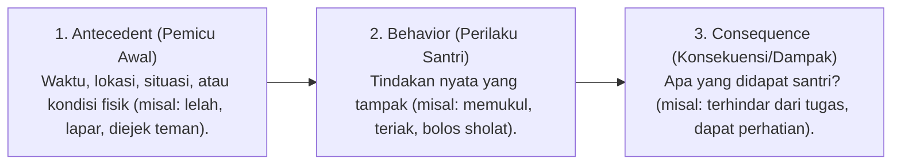

# P2-06-02-Prinsip-Functional-Behavior-Assessment

## Tujuan
Menerapkan metodologi **Functional Behavior Assessment (FBA)** dan model **Antecedent-Behavior-Consequence (ABC)** untuk mengidentifikasi akar pemicu dan fungsi di balik perilaku menyimpang santri, mengubah respon pembina dari sekadar "menghukum gejala lahiriah" menjadi "menyelesaikan akar masalah mendasar".

---

## 1. Model ABC Analisis Perilaku Santri

---

## 2. 4 Fungsi Pokok Perilaku (*Function of Behavior*)

Setiap pelanggaran santri bermuara pada salah satu dari 4 tujuan bawah sadar:

1. **Mendapatkan Perhatian (*To Gain Attention*)**:
   - Santri berbuat onar di kelas atau kamar karena merasa diabaikan oleh musyrif/teman.  
   - *Solusi PBIS*: Berikan perhatian positif yang melimpah saat ia berbuat baik; abaikan provokasi minor.
2. **Menghindari / Melarikan Diri (*To Escape / Avoid*)**:
   - Santri berpura-pura sakit atau terlambat sholat/tahfizh karena takut diuji hafalan yang belum mutqin.  
   - *Solusi PBIS*: Berikan bimbingan tambahan (*Tutoring/Scaffolding*) untuk mengurangi kecemasan akademiknya.
3. **Mendapatkan Sesuatu (*To Access Tangibles*)**:
   - Mengambil barang teman tanpa izin karena tidak memiliki fasilitas yang dibutuhkan.  
   - *Solusi PBIS*: Identifikasi kebutuhan logistik santri dan fasilitasi secara legal.
4. **Kebutuhan Sensoris & Regulasi Fisik (*Sensory / Physical Regulation*)**:
   - Bergerak tidak bisa diam di masjid karena kelelahan duduk atau energi fisik berlebih.  
   - *Solusi PBIS*: Salurkan energi melalui olahraga teratur dan aktivitas fisik terstruktur.

---

## 3. Status Dokumen
* **Status**: 🌟 **A+ (Tervalidasi & Siap Diimplementasikan)**
* **Level**: Project 2 - `02 Principles / 06 Intervention Principles`
* **Langkah Berikutnya**: **`P2-06-03-Prinsip-De-eskalasi-Krisis-dan-Regulasi-Emosi.md`**.
