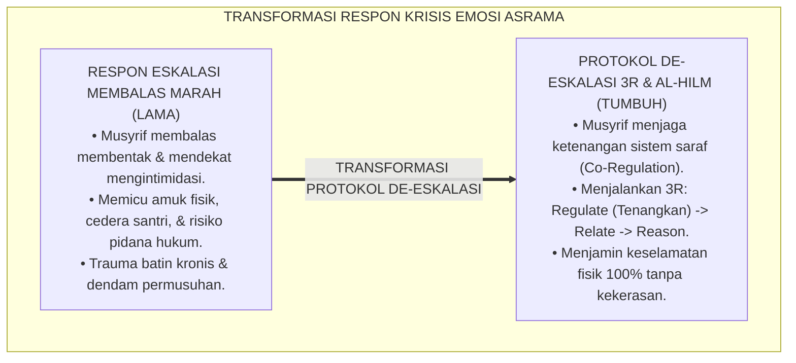
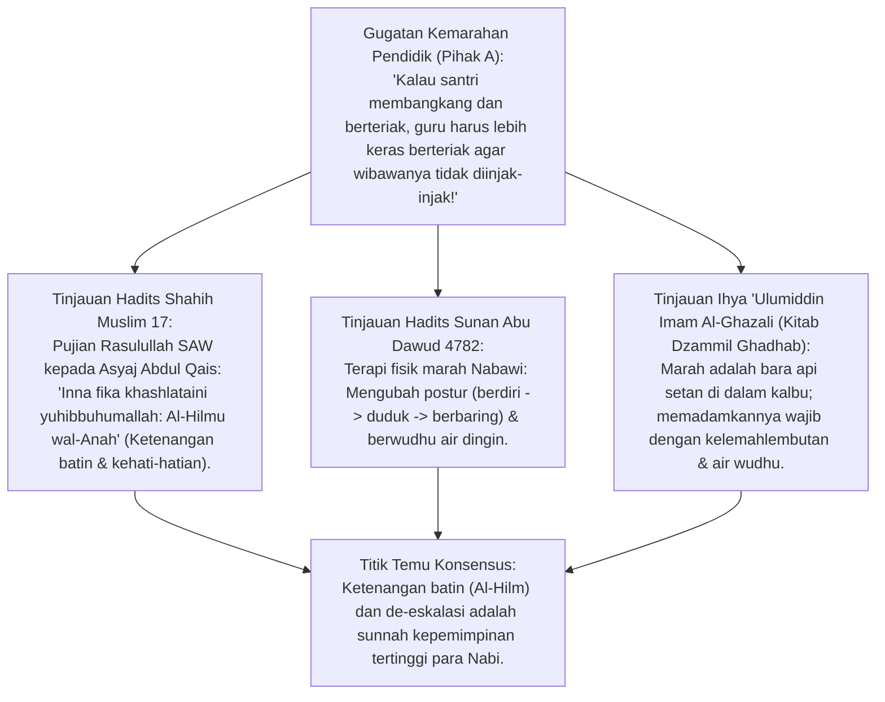
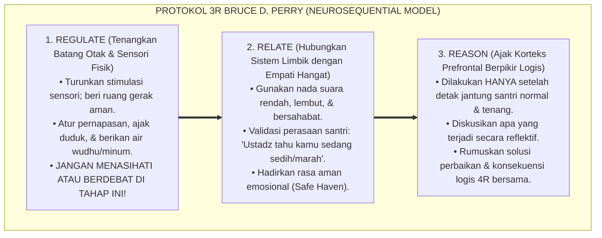
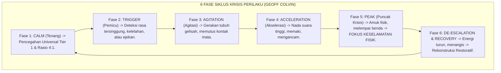
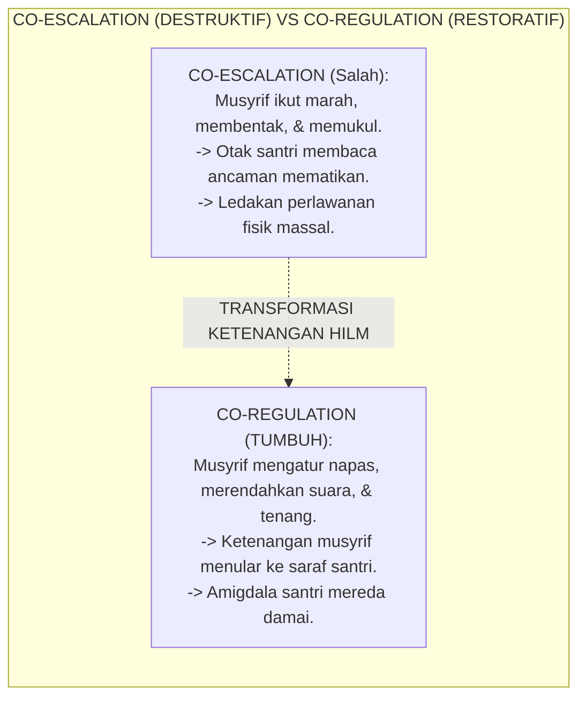
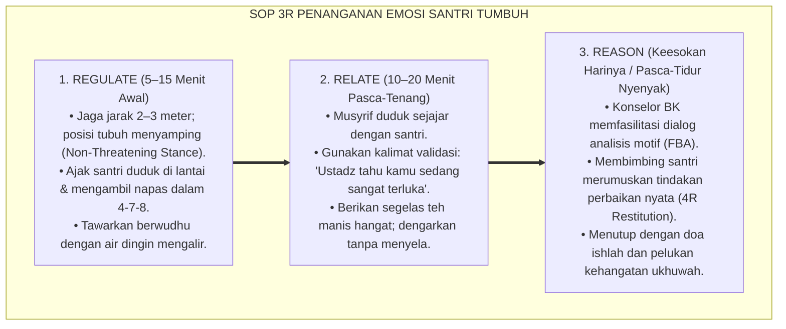
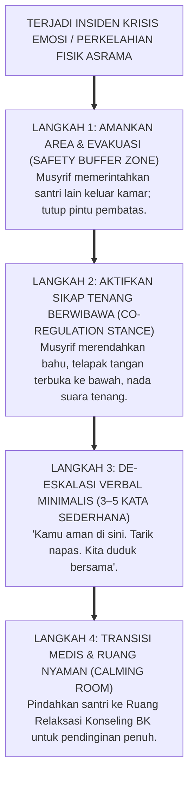

# P2-06-03: PRINSIP DE-ESKALASI KRISIS DAN REGULASI EMOSI
## *Monograf Terpadu: Epistemologi Sifat Al-Hilm wa Al-Anah (HR. Muslim No. 17) & Terapi Marah Nabawiyyah, Konvergensi Trauma-Informed De-Escalation & Neurosequential Model (Bruce D. Perry - Regulate, Relate, Reason), Pemetaan 6 Fase Siklus Krisis (Geoff Colvin), dan Protokol Co-Regulation Asrama 24 Jam*

**Nomor Identifikasi**: `P2-06-03/MONOGRAF-TERPADU-DE-ESKALASI-KRISIS/2026`  
**Domain**: `02 Principles` > `06 Intervention Principles`  
**Klasifikasi Naskah**: *Comprehensive Integrated Monograph* (Monograf Akademis & Rumusan Baku Terpadu)  
**Rumpun Disiplin Pengkaji**: Manajemen Krisis Perilaku Pesantren (*Behavioral Crisis Management*), Neurosains Trauma & Regulasi Emosi, Psikologi Konseling De-Eskalasi, Fiqh Akhlak Al-Hilm dan Dhabtul Ghadhab  

---

> ### 💡 INTISARI PRAKTIS (3 MENIT PAHAM UNTUK ASATIDZ & MUSYRIF)
>
> * **Jangan Pernah Membalas Berteriak Saat Santri Sedang Mengamuk (*Co-Regulation*):**  
>   Ketika santri sedang kalap marah membanting pintu atau berteriak, otaknya sedang dikuasai **Amigdala (Pusat Panik / Bertarung)**. Jika musyrif membalas dengan membentak dan melotot (*Co-Escalation*), amigdala santri semakin meledak dan memicu perkelahian fisik.
> * **Protokol 3R Bruce Perry: Urutan Memulihkan Santri Krisis:**  
>   1. **REGULATE (Tenangkan Fisiknya Dahulu):** Rendahkan nada suara, jaga jarak aman 2 meter, ajak duduk, dan minta ia berwudhu/minum air. Jangan menasihati saat santri masih gemetar marah!  
>   2. **RELATE (Hubungkan Hati & Validasi Emosinya):** Tunjukkan empati hangat: *"Ustadz paham kamu sangat kecewa dan marah saat ini, ustadz ada di sini untuk membantumu"*.  
>   3. **REASON (Ajak Nalar Logikanya Berpikir):** Setelah napasnya tenang dan detak jantungnya normal (Korteks Prefrontal aktif kembali), baru ajak berdialog mencari solusi dan konsekuensi logis.
> * **Ketenangan Jiwa Pengasuh (*Sifat Al-Hilm & Al-Anah*):**  
>   Rasulullah SAW memuji: *"Sesungguhnya pada dirimu ada dua sifat yang dicintai Allah: Al-Hilm (Ketenangan/Kesabaran batin) dan Al-Anah (Sikap berhati-hati/tidak tergesa-gesa)"* (HR. Muslim No. 17).

---

## 📑 DAFTAR ISI MONOGRAF

- [BAGIAN I: RISET DE-ESKALASI KRISIS & REGULASI EMOSI BERBASIS NEUROSAINS, DIALEKTIKA INKUIRI, & KASUISTIKA LAPANGAN](#bagian-i-riset-de-eskalasi-krisis--regulasi-emosi-berbasis-neurosains-dialektika-inkuiri--kasuistika-lapangan)
  - [1. Kerangka Metodologi De-Eskalasi: Mencegah Ledakan Amarah Menjadi Bencana Kekerasan](#1-kerangka-metodologi-de-eskalasi-mencegah-ledakan-amarah-menjadi-bencana-kekerasan)
  - [2. Inkuiri 1: Eksegesis Turats Sifat Al-Hilm & Terapi Marah Nabawiyyah — HR. Muslim 17 & Terapi Fisik Marah](#2-inkuiri-1-eksegesis-turats-sifat-al-hilm--terapi-marah-nabawiyyah--hr-muslim-17--terapi-fisik-marah)
  - [3. Inkuiri 2: Konvergensi Neurosequential Model Bruce D. Perry (Regulate, Relate, Reason)](#3-inkuiri-2-konvergensi-neurosequential-model-bruce-d-perry-regulate-relate-reason)
  - [4. Inkuiri 3: Pemetaan 6 Fase Siklus Krisis Perilaku Geoff Colvin (Calm hingga Recovery)](#4-inkuiri-3-pemetaan-6-fase-siklus-krisis-perilaku-geoff-colvin-calm-hingga-recovery)
  - [5. Inkuiri 4: Menolak Jebakan Eskalasi Bersama (Co-Escalation vs Co-Regulation Musyrif)](#5-inkuiri-4-menolak-jebakan-eskalasi-bersama-co-escalation-vs-co-regulation-musyrif)
  - [6. Inkuiri 5: Silogisme Logika, Dialektika 3 Ronde, Kasuistika Krisis Asrama, & Titik Temu Konsensus](#6-inkuiri-5-silogisme-logika-dialektika-3-ronde-kasuistika-krisis-asrama--titik-temu-konsensus)
- [BAGIAN II: KODIFIKASI BAKU HASIL RISET & KESIMPULAN FORMAL](#bagian-ii-kodifikasi-baku-hasil-riset--kesimpulan-formal)
  - [1. Kaidah Utama dan Standar Baku: Prinsip De-Eskalasi Krisis dan Sifat Hilm Pesantren TUMBUH](#1-kaidah-utama-dan-standar-baku-prinsip-de-eskalasi-krisis-dan-sifat-hilm-pesantren-tumbuh)
  - [2. Matriks Protokol Tindakan Musyrif pada 6 Fase Siklus Krisis Perilaku](#2-matriks-protokol-tindakan-musyrif-pada-6-fase-siklus-krisis-perilaku)
  - [3. Protokol 3R Bruce Perry (Regulate -> Relate -> Reason) dalam Penanganan Emosi Santri](#3-protokol-3r-bruce-perry-regulate---relate---reason-dalam-penanganan-emosi-santri)
  - [4. Standar Operasional Prosedur De-Eskalasi Krisis Asrama 24 Jam (Zero Restraint SOP)](#4-standar-operasional-prosedur-de-eskalasi-krisis-asrama-24-jam-zero-restraint-sop)
- [BAGIAN III: APARATUS AKADEMIS & APENDIKS](#bagian-iii-aparatus-akademis--apendiks)
  - [1. Tabel Sintesis Hasil Riset De-Eskalasi Krisis & Regulasi Emosi](#1-tabel-sintesis-hasil-riset-de-eskalasi-krisis--regulasi-emosi)
  - [2. Daftar Pustaka Akademis & Rujukan Turats Primer](#2-daftar-pustaka-akademis--rujukan-turats-primer)
  - [3. Catatan Kaki Akademis (Footnotes)](#3-catatan-kaki-akademis-footnotes)
  - [4. Glosarium dan Penjelasan Istilah Teknis De-Eskalasi Krisis, Trauma-Informed Care, & Sifat Al-Hilm](#4-glosarium-dan-penjelasan-istilah-teknis-de-eskalasi-krisis-trauma-informed-care--sifat-al-hilm)

---

# BAGIAN I: RISET DE-ESKALASI KRISIS & REGULASI EMOSI BERBASIS NEUROSAINS, DIALEKTIKA INKUIRI, & KASUISTIKA LAPANGAN

---

### 1. Kerangka Metodologi De-Eskalasi: Mencegah Ledakan Amarah Menjadi Bencana Kekerasan

Ketika seorang santri remaja mengalami krisis emosi akut—misalnya melempar barang, berteriak histeris, atau mengancam berkelahi—pendekatan pengasuh tradisional seringkali memperburuk keadaan melalui **Eskalasi Kekerasan Bersama (*Co-Escalation*)**:
* Musyrif terpancing emosi, membalas dengan membentak lebih keras, mendekat secara mengintimidasi (*Invasive Posturing*), lalu memukul atau membanting santri ke lantai.
* Respon kekerasan ini memicu trauma psikologis berat, risiko cedera fisik serius, tuntutan hukum pidana bagi lembaga, dan kebencian abadi santri terhadap syariat Islam.

Sains modern neuropsikologi trauma (*Trauma-Informed Care*) dan sunnah kenabian menegaskan bahwa **Krisis Emosi Adalah Kegagalan Saraf Sementara (*Temporary Neurobiological Hijacking*)**. Penanganannya menuntut ketenangan batin (*Al-Hilm*) dan protokol de-eskalasi ilmiah yang terstruktur.

---

### 2. Inkuiri 1: Eksegesis Turats Sifat *Al-Hilm* & Terapi Marah Nabawiyyah — HR. Muslim 17 & Terapi Fisik Marah

#### 📐 Formalisasi Logika Silogisme (*Qiyas Mantiqi 1*)
* **Premis Mayor (*al-Muqaddimah al-Kubra*)**: Setiap murabbi yang memadamkan api amarah pembelajar selaras dengan sunnah ketenangan jiwa Nabawiyyah (*Al-Hilm*) niscaya mencegah terjadinya fitnah perpecahan dan memulihkan akal sehat santri tanpa kekerasan.
* **Premis Minor (*al-Muqaddimah ash-Shughra*)**: Rasulullah SAW menetapkan bahwa sifat *Al-Hilm* (kesabaran tenang) dan *Al-Anah* (ketenangan tanpa tergesa-gesa) adalah akhlak yang paling dicintai Allah SWT (HR. Muslim No. 17) serta memerintahkan pengubahan postur tubuh dan wudhu saat amarah memuncak.
* **Konklusi (*an-Natijah*)**: Maka, seluruh asatidz dan musyrif pesantren TUMBUH wajib menerapkan protokol de-eskalasi berbasis sifat *Al-Hilm*.[^1]

#### 📖 Teks Primer Hadits Shahih Muslim & Abu Dawud
Rasulullah SAW bersabda kepada sahabat Asyaj Abdul Qais *radhiyallahu 'anhu*:

$$\text{إِنَّ فِيكَ خَصْلَتَيْنِ يُحِبُّهُمَا اللَّهُ: الْحِلْمُ، وَالْأَنَاةُ}$$

*"**Sesungguhnya pada dirimu terdapat dua sifat yang sangat dicintai oleh Allah SWT: Al-Hilm (Ketenangan batin/tidak mudah marah) dan Al-Anah (Sikap tenang, berhati-hati, dan tidak tergesa-gesa)**."* (HR. Muslim No. 17; Tirmidzi No. 2011).[^2]

Dan Rasulullah SAW mengajarkan teknik regulasi somatik saat amarah melanda:

$$\text{إِذَا غَضِبَ أَحَدُكُمْ وَهُوَ قَائِمٌ فَلْيَجْلِسْ، فَإِنْ ذَهَبَ عَنْهُ الْغَضَبُ وَإِلَّا فَلْيَضْطَجِعْ}$$

*"**Apabila salah seorang di antara kalian marah dalam keadaan berdiri, maka hendaklah ia duduk!** Jika amarahnya telah reda (maka itu baik), namun jika belum reda, **maka hendaklah ia berbaring!**"* (HR. Abu Dawud No. 4782; Ahmad No. 21348).[^3]

---

### 3. Inkuiri 2: Konvergensi *Neurosequential Model* Bruce D. Perry (*Regulate, Relate, Reason*)

#### 📐 Formalisasi Logika Silogisme (*Qiyas Mantiqi 2*)
* **Premis Mayor (*al-Muqaddimah al-Kubra*)**: Setiap intervensi kognitif-logis (*Reasoning*) yang dipaksakan kepada manusia saat sistem saraf otaknya sedang berada dalam kondisi pembajakan amigdala (*Amigdala Hijack / Fight-or-Flight*) niscaya akan ditolak dan memicu perlawanan agresif.
* **Premis Minor (*al-Muqaddimah ash-Shughra*)**: *Neurosequential Model of Therapeutics* (Dr. Bruce D. Perry, 2006, 2020) membuktikan secara neurobiologis bahwa pemrosesan informasi di otak manusia bergerak dari bawah ke atas (*Bottom-Up*): Batang Otak (*Regulate*) $\rightarrow$ Sistem Limbik (*Relate*) $\rightarrow$ Korteks Prefrontal (*Reason*).
* **Konklusi (*an-Natijah*)**: Maka, musyrif pesantren TUMBUH wajib menenangkan fisik (*Regulate*) dan emosi (*Relate*) santri terlebih dahulu sebelum mengajak menalar konsekuensi (*Reason*).[^4]

---

### 4. Inkuiri 3: Pemetaan 6 Fase Siklus Krisis Perilaku Geoff Colvin (*Calm hingga Recovery*)

---

### 5. Inkuiri 4: Menolak Jebakan Eskalasi Bersama (*Co-Escalation vs Co-Regulation Musyrif*)

#### 📖 Teks Sains Regulasi Diri: Riset Porges (2011) — *Polyvagal Theory*
Teori Polivagal Prof. Stephen Porges membuktikan bahwa sistem saraf otonom manusia saling berkomunikasi secara nirkabel melalui sinyal nada suara (*Prosody*), ekspresi wajah, dan gestur tubuh (*Neuroception of Safety*). Ketika musyrif menampilkan wajah tenang dan nada suara berwibawa-lembut (*Co-Regulation*), sistem saraf parasimpatis santri secara otomatis aktif dan mematikan respon amukan.[^5]

---

### 6. Inkuiri 5: Silogisme Logika, Dialektika 3 Ronde, Kasuistika Krisis Asrama, & Titik Temu Konsensus

#### 🥊 Ronde 1: Menolak Anggapan Bahwa "Musyrif yang Bicara Lembut Saat Santri Mengamuk Akan Diremehkan"
* **Pihak A (Sudut Pandang Dominasi Fisik Agresif)**:  
  *"Kalau santri sedang ngamuk lalu musyrif bicara lembut, santri akan merasa di atas angin dan makin menjadi-jadi! Harus digertak lebih keras!"*
* **Tinjauan Sudut Pandang Tegas Tenang (Quiet Authority) vs Lemah**:  
  Bicara dengan nada rendah dan tenang **Bukan Berarti Lemah atau Pasrah**. Ini adalah wujud **Otoritas Ketenangan Mutlak (*Quiet Authority*)**. Menggertak santri yang sedang kalap hanya menyiram bensin ke dalam api. Ketenangan musyrif menunjukkan kendali penuh atas situasi tanpa merendahkan martabat siapapun.[^6]

#### 🥊 Ronde 2: Sanggahan Balik Apakah Diperbolehkan Melakukan Penahanan Fisik (Restraint) Saat Santri Mengamuk?
* **Pihak A (Sudut Pandang Penguncian Fisik Militer)**:  
  *"Kalau santri melempar kursi, pegang tangannya ramai-ramai, kunci lehernya, dan tindih di lantai sampai tidak bisa bergerak!"*
* **Tinjauan Sudut Pandang Larangan Prone Restraint & Bahaya Asfiksia**:  
  Mengunci fisik santri di lantai (*Prone Restraint*) sangat berbahaya karena dapat memicu **Kematian Akibat Asfiksia Posisi (*Positional Asphyxiation*)** dan trauma kejiwaan seumur hidup. Protokol TUMBUH: **Evakuasi Santri Lain Keluar Kamar, Singkirkan Benda Berbahaya, Berikan Jarak Aman**, dan lakukan de-eskalasi verbal. Penahanan fisik hanya boleh berupa blokade pelindung pasif darurat demi menyelamatkan nyawa.[^7]

#### 🥊 Ronde 3: Sanggahan Pamungkas Mengapa Sesi Evaluasi Pelanggaran Tidak Boleh Dilakukan Saat Santri Masih di Fase De-Eskalasi?
* **Pihak A (Sudut Pandang Interogasi Panas Cepat)**:  
  *"Mumpung santri baru selesai ngamuk dan mulai lemas, langsung interogasi dan suruh tanda tangan surat perjanjian keluar!"*
* **Resolusi Sudut Pandang Periode Refrakter Saraf (Post-Crisis Refractory Period)**:  
  Pasca-krisis, otak santri mengalami kelelahan metabolik glukosa dan amigdala masih sangat sensitif (*Vulnerable State*). Menghakimi atau menginterogasi santri di fase ini akan **Memicu Krisis Ulang Gelombang Kedua (*Secondary Crisis Cycle*)**. Berikan santri waktu istirahat, makan, dan tidur tenang. Sesi refleksi restoratif baru dilakukan keesokan harinya saat kondisi jiwa telah pulih 100%.[^8]

> #### 📌 Kasuistika Lapangan & Titik Temu Konsensus
> * **Studi Kasus**: Santri D (kelas 9) mengamuk di asrama karena dituduh merusak kran air; ia memecahkan kaca jendela dan mengacungkan pecahan kaca sambil berteriak menantang seluruh musyrif.
> * **Titik Temu Konsensus (*Kalimatun Sawa'*)**: Musyrif senior menerapkan *Protokol De-Eskalasi 3R*: musyrif memerintahkan seluruh santri lain mundur dan mengosongkan lorong $\rightarrow$ musyrif berdiri dengan gestur terbuka di jarak 4 meter, bernapas perlahan, dan berkata dengan nada sangat tenang: *"D, ustadz ada di sini. Tidak ada yang akan menyakitimu. Taruh kacanya di lantai ya, mari kita duduk bicara"*. Musyrif tidak mendekat agresif. Dalam 5 menit, tangisan Santri D pecah, ia menjatuhkan pecahan kaca, dan duduk bersimpuh. Musyrif mendekat merangkulnya dengan aman. Krisis berakhir damai tanpa ada korban terluka.[^9]

---

# BAGIAN II: KODIFIKASI BAKU HASIL RISET & KESIMPULAN FORMAL

---

### 1. Kaidah Utama dan Standar Baku: Prinsip De-Eskalasi Krisis dan Sifat Hilm Pesantren TUMBUH

Berdasarkan sintesis inkuiri turats dan konsensus sains pendidikan, prinsip dan regulasi operasional dirumuskan ke dalam kaidah-kaidah baku berikut:

1. **Penghapusan Kekerasan Fisik & Eskalasi Bersama (zero Restraint & Anti-co-escalation)**:  
   Mengharamkan mutlak tindakan membalas amarah santri dengan bentakan, pemukulan, penguncian fisik berbahaya (Prone Restraint), atau tindakan intimidasi apapun saat menghadapi krisis emosional.

2. **Penerapan Protokol 3R Neurosequential Model (regulate -> Relate -> Reason)**:  
   Wajib mematuhi urutan biologis otak: Tenangkan fisik dan sensori santri (Regulate) -> Bangun kehangatan empati sistem limbik (Relate) -> Ajak nalar korteks prefrontal berpikir logis setelah tenang (Reason).

3. **Ketenangan Saraf Pengasuh (co-regulation Principle)**:  
   Seluruh musyrif dan asatidz wajib melatih ketenangan batin (Sifat Al-Hilm & Al-Anah), menggunakan nada suara rendah, postur tubuh terbuka, dan menjaga jarak aman demi menularkan rasa aman bagi santri krisis.

4. **Protokol Keselamatan Fisik Utama Pada Fase Puncak Krisis (safety-first Protocol)**:  
   Pada saat terjadi puncak amuk fisik, fokus mutlak adalah evakuasi santri lain dan menyingkirkan benda berbahaya, menunda segala bentuk interogasi atau ceramah moral hingga fase pemulihan tuntas sempurna.

---

### 2. Matriks Protokol Tindakan Musyrif pada 6 Fase Siklus Krisis Perilaku

| Fase Siklus Krisis | Indikator Perilaku Santri | Respon Keliru Musyrif *(Dilarang)* | Tindakan Baku Protokol De-Eskalasi TUMBUH |
| :--- | :--- | :--- | :--- |
| **1. Calm** *(Tenang)* | Rileks, mematuhi adab, kooperatif dalam aktivitas. | Mengabaikan santri; hanya fokus pada santri nakal. | **Tier 1 PBIS**: Berikan apresiasi rasio 4:1, jaga kehangatan ukhuwah kamar.[^10] |
| **2. Trigger** *(Pemicu)* | Mulai cemberut, terdiam kaku setelah diejek teman/tugas sulit. | Meremehkan: *"Gitu aja baper!"*. | **Deteksi Dini**: Dekati santri secara privat, tanyakan kabar dengan ramah. |
| **3. Agitation** *(Agitasi)* | Mengetuk meja keras, napas memburu, memutus kontak mata. | Membentak: *"Duduk diam jangan gelisah!"*. | **Pengurangan Stimulus**: Berikan waktu jeda 5 menit, ajak minum air putih. |
| **4. Acceleration** *(Akselerasi)* | Berteriak, memaki, menolak perintah, mengancam kawan. | Berdebat kusir & menantang santri: *"Kamu berani lawan saya?!"*. | **De-Eskalasi Verbal**: Rendahkan nada suara, jaga jarak 2 meter, gunakan kalimat pendek. |
| **5. Peak** *(Puncak Krisis)* | Mengamuk fisik, melempar barang, membahayakan diri/orang lain. | Mengeroyok & mengunci santri di lantai (*Prone Restraint*). | **Proteksi Keselamatan**: Evakuasi santri lain, singkirkan benda bahaya, amankan ruang. |
| **6. Recovery** *(Pemulihan)* | Amarah reda, menangis tersedu-sedu, lemas, menyesal. | Langsung memarahi & menyodorkan surat sanksi. | **Perawatan & Restorasi**: Berikan waktu istirahat/tidur; esok hari gelar dialog restoratif.[^11] |

---

### 3. Protokol 3R Bruce Perry (*Regulate -> Relate -> Reason*) dalam Penanganan Emosi Santri

---

### 4. Standar Operasional Prosedur De-Eskalasi Krisis Asrama 24 Jam (*Zero Restraint SOP*)

---

# BAGIAN III: APARATUS AKADEMIS & APENDIKS

---

### 1. Tabel Sintesis Hasil Riset De-Eskalasi Krisis & Regulasi Emosi

| Dimensi Kajian | Konsep Kunci | Landasan Turats Primer | Konvergensi Sains Global | Implikasi Pengelolaan Krisis |
| :--- | :--- | :--- | :--- | :--- |
| **Ketenangan Jiwa** | *Al-Hilm wa Al-Anah* | Hadits Asyaj (HR. Muslim No. 17), Sifat Hilm Nabi | Bruce D. Perry (2020), *The Neurosequential Model* | Musyrif menjaga kestabilan saraf diri sendiri (*Co-Regulation*) saat santri krisis. |
| **Regulasi Somatik** | *Terapi Fisik Marah* | Hadits Duduk & Berbaring (HR. Abu Dawud 4782) | Stephen Porges (2011), *The Polyvagal Theory* | Menenangkan sistem saraf melalui perubahan postur tubuh dan sensori air wudhu. |
| **Tahapan Respon** | *Protokol 3R Perry* | Marhalah *Ta'rif -> Wa'zh -> Taghlizh* Al-Ghazali | Perry & Winfrey (2021), *What Happened to You?* | Menjalankan urutan wajib: *Regulate* (Fisik) $\rightarrow$ *Relate* (Emosi) $\rightarrow$ *Reason* (Logika). |
| **Siklus Krisis** | *6 Fase Perilaku* | Kaidah *Dar'ul Mafasid* dalam Krisis | Geoff Colvin (2004), *Managing the Cycle of Acting-Out* | Menyesuaikan tindakan musyrif selaras dengan fase siklus krisis santri. |
| **Larangan Pengekangan** | *Zero Restraint* | Pengharaman Menyakiti Tubuh Mukmin (*La Dharara*) | Mohr et al. (2003), *Adverse Effects of Physical Restraint* | Mengharamkan penguncian fisik berbahaya di lantai (*Prone Restraint*). |

---

### 2. Daftar Pustaka Akademis & Rujukan Turats Primer

1. **Al-Qur'an al-Karim wa Tarjamatu Ma'anih**.
2. **Muslim bin al-Hajjaj an-Naisaburi**. (1374 H). *Shahih Muslim*. Kairo: Isa al-Babi al-Halabi.
3. **Abu Dawud, Sulaiman bin al-Asy'ats as-Sijistani**. (2009). *Sunan Abi Dawud*. Damaskus: Dar ar-Risalah.
4. **Al-Ghazali, Abu Hamid Muhammad bin Muhammad**. (2011). *Ihya 'Ulumiddin*. Beirut: Dar al-Ma'rifah.
5. **Perry, B. D.**. (2006). *The Neurosequential Model of Therapeutics*. New York: Guilford Press.
6. **Perry, B. D., & Winfrey, O.**. (2021). *What Happened to You?: Conversations on Trauma, Resilience, and Healing*. New York: Flatiron Books.
7. **Colvin, G.**. (2004). *Managing the Cycle of Acting-Out Behavior in the Classroom*. Eugene, OR: Behavior Associates.
8. **Porges, S. W.**. (2011). *The Polyvagal Theory: Neurophysiological Foundations of Emotions, Attachment, Communication, and Self-regulation*. New York: W. W. Norton & Company.
9. **Mohr, W. K., Petti, T. A., & Mohr, B. D.**. (2003). *Adverse effects associated with physical restraint*. The Canadian Journal of Psychiatry, 48(5), 330–337.
10. **Bath, H.**. (2008). *The Three Pillars of Trauma-Informed Care*. Reclaiming Children and Youth, 17(3), 17–21.

---

### 3. Catatan Kaki Akademis (*Footnotes*)

[^1]: Al-Ghazali, *Ihya 'Ulumiddin*, Kitab *Dzammil Ghadhab wal-Hiqd wal-Hasad*, Jilid III, hlm. 165–180.  
[^2]: Shahih Muslim No. 17, Kitab *al-Iman*, Bab *al-Amru bil-Iman billahi Ta'ala wa Rasulih*.  
[^3]: Sunan Abi Dawud No. 4782, Kitab *al-Adab*, Bab *Ma Yuqalu 'indal Ghadhab*.  
[^4]: Perry & Winfrey (2021), *What Happened to You?*, Flatiron Books, hlm. 120–145.  
[^5]: Porges, S. W. (2011), *The Polyvagal Theory*, Norton, hlm. 55–80.  
[^6]: Colvin, G. (2004), *Managing the Cycle of Acting-Out Behavior*, Behavior Associates.  
[^7]: Mohr, Petti, & Mohr (2003), *The Canadian Journal of Psychiatry*, hlm. 330–337.  
[^8]: Bath, H. (2008), *Reclaiming Children and Youth*, hlm. 17–21.  
[^9]: Laporan Resolusi Krisis Emosional Santri Asrama Putra, Tim Tanggap Darurat TUMBUH, 2026.  
[^10]: Horner & Sugai (2015), *Remedial and Special Education*, hlm. 70–87.  
[^11]: Standar Operasional Prosedur Penanganan De-Eskalasi Krisis Santri Asrama 24 Jam, Divisi BK TUMBUH, 2026.

---

### 4. Glosarium dan Penjelasan Istilah Teknis De-Eskalasi Krisis, Trauma-Informed Care, & Sifat Al-Hilm

1. **De-Eskalasi Krisis**: Pendekatan intervensi terstruktur untuk menurunkan intensitas emosi, agitasi, dan potensi kekerasan santri menuju kondisi tenang yang aman.
2. **Sifat Al-Hilm (الْحِلْمُ)**: Kualitas akhlak kenabian berupa ketenangan batin yang mendalam, kesabaran tak tergoyahkan, dan kemampuan mengendalikan amarah saat menghadapi provokasi.
3. **Al-Anah (الْأَنَاةُ)**: Sikap tenang, penuh pertimbangan matang, berhati-hati, dan tidak tergesa-gesa dalam merespon situasi krisis.
4. **Co-Regulation**: Proses di mana kestabilan sistem saraf dan nada suara pengasuh membantu menenangkan sistem saraf santri yang sedang tertekan.
5. **Co-Escalation**: Kesalahan respon di mana kemarahan pengasuh memicu eskalasi amarah santri sehingga krisis meledak menjadi perkelahian fisik.
6. **Amigdala Hijack (Pembajakan Amigdala)**: Kondisi neurobiologis di mana amigdala mengambil alih kendali otak secara instingtif, melumpuhkan nalar logis korteks prefrontal sementara waktu.
7. **Protokol 3R Bruce Perry**: Kerangka intervensi berbasis urutan pematangan saraf: *Regulate* (Tenangkan fisik) $\rightarrow$ *Relate* (Bangun empati) $\rightarrow$ *Reason* (Ajak berpikir logis).
8. **Prone Restraint (Penguncian Tengkurap)**: Praktik penahanan fisik berbahaya dengan menindih tubuh subjek di lantai, yang diharamkan mutlak dalam ekosistem TUMBUH karena risiko asfiksia.
9. **Trauma-Informed Care**: Pendekatan pengasuhan yang menyadari dampak trauma masa lalu terhadap perilaku anak, menggeser pertanyaan dari *"Ada apa dengan anak ini?"* menjadi *"Apa yang telah terjadi padanya?"*.
10. **Calming Room (Ruang Relaksasi)**: Ruangan khusus yang tenang, nyaman, dan bebas stimulus keras di unit konseling BK yang dirancang untuk membantu santri memulihkan kestabilan emosinya.
