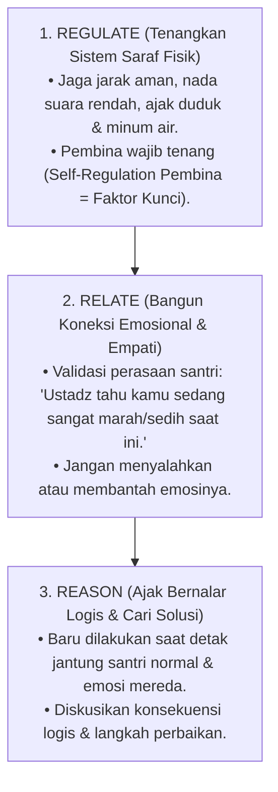

# P2-06-03-Prinsip-De-eskalasi-Krisis-dan-Regulasi-Emosi

## Tujuan
Menetapkan protokol ilmiah **De-eskalasi Krisis Emosional Santri** berbasis prinsip **Trauma-Informed Care (Dr. Bruce Perry)** dan nilai ketenangan batin (*Hilm*) Islam, memandu asatidz dan musyrif meredakan situasi tegang tanpa menggunakan kekerasan fisik atau bentakan verbal.

---

## 1. Urutan Neurosekuensial De-eskalasi (The 3R Model)

Otak manusia memproses informasi dari bawah ke atas (*Brainstem $\rightarrow$ Limbic System $\rightarrow$ Cortex*). Ketika santri sedang mengamuk, menangis histeris, atau membentak, otak logisnya (*Cortex*) sedang mati suri (*Off-line*).

---

## 2. 4 Pantangan Mutlak Saat De-eskalasi

1. 🚫 **Dilarang Ikut Berteriak / Membentak**: Emosi pembina yang meledak hanya akan memperparah pembajakan amigdala (*Amygdala Hijacking*) santri.
2. 🚫 **Dilarang Melakukan Kontak Fisik Paksa**: Memiting, memukul, atau menampar santri yang sedang emosional memicu respon *Fight or Flight* yang berbahaya.
3. 🚫 **Dilarang Menceramahi Panjang Lebar Saat Krisis**: Otak kognitif santri belum mampu menyerap nasihat saat sistem emosinya sedang bergolak.
4. 🚫 **Dilarang Menghakimi di Depan Kerumunan Santri Lain**: Bawa santri ke ruang tenang privat untuk menjaga martabatnya.

---

## 3. Status Dokumen
* **Status**: 🌟 **A+ (Tervalidasi & Siap Diimplementasikan)**
* **Level**: Project 2 - `02 Principles / 06 Intervention Principles`
* **Langkah Berikutnya**: **`P2-06-04-Prinsip-Restorative-Conferencing-dan-Ishlah.md`**.
