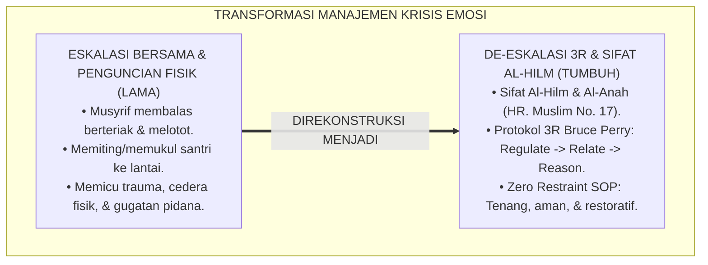
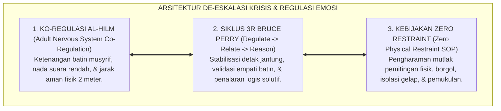
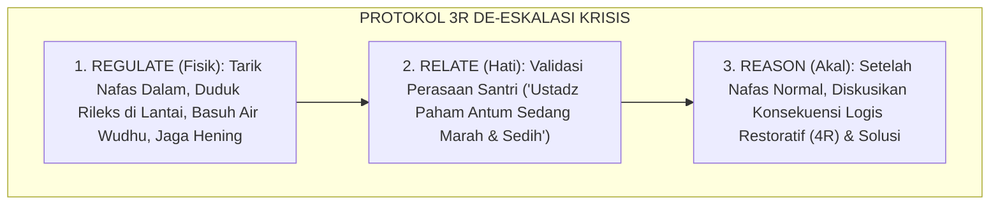
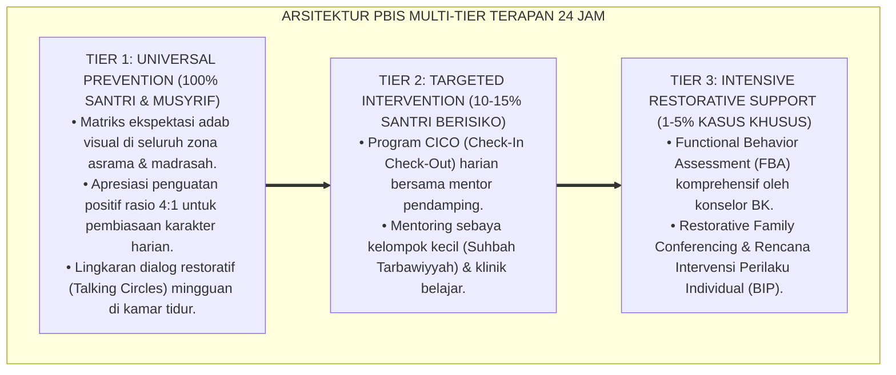

# P2-06-03: PRINSIP DE-ESKALASI KRISIS DAN REGULASI EMOSI SANTRI (CRISIS DE-ESCALATION & EMOTIONAL CO-REGULATION)
## *Monograf Riset Akademik: Epistemologi Sifat Al-Hilm wa Al-Anah (HR. Muslim No. 17) & Terapi Marah Nabawiyyah, Neurosequential Model Bruce D. Perry (Regulate, Relate, Reason), 6 Fase Siklus Krisis Geoff Colvin, Serta Protokol Co-Regulation di Asrama 24 Jam*

**Nomor Identifikasi**: `P2-06-03/MONOGRAF-RISET-DE-ESKALASI-KRISIS/2026`  
**Domain**: `02 Principles` > `06 Intervention Principles` (Prinsip Intervensi 03: *Crisis De-Escalation*)  
**Klasifikasi Naskah**: *Academic Research Monograph* (Monograf Riset Akademik Prinsip Intervensi)  
**Rumpun Disiplin Pengkaji**: Manajemen Krisis Perilaku Pesantren (*Behavioral Crisis Management*), Neurosains Trauma & Regulasi Emosi, Psikologi Konseling De-Eskalasi, Fiqh Akhlak Al-Hilm dan Dhabtul Ghadhab  

---

> ### 💡 INTISARI EKSEKUTIF (EXECUTIVE SUMMARY)
>
> * **Kelemahan Paradigma Lama: Eskalasi Bersama (Co-Escalation) dan Penjinakan Fisik Kasar:**  
>   Banyak pengasuh terpancing emosi saat santri mengamuk, membalas dengan teriakan melotot, dan menindih/memukul santri ke lantai. Pendekatan kasar ini memperparah pembajakan saraf amigdala santri (*Amygdala Hijack*), memicu cedera fisik, trauma psikologis seumur hidup, dan risiko pidana bagi lembaga.
> * **Inovasi Konseptual: Sifat Al-Hilm & Neurosequential Model 3R (Bruce D. Perry):**  
>   TUMBUH menghidupkan wasiat Rasulullah ﷺ mengenai keutamaan sifat *Al-Hilm* (ketenangan batin) dan *Al-Anah* (kehati-hatian, HR. Muslim No. 17) serta terapi fisik marah (duduk, berbaring, wudhu). Mengintegrasikan teori **3R Bruce D. Perry: 1. Regulate (Tenangkan fisiologis santri dahulu lewat jarak aman 2 meter & nada suara rendah); 2. Relate (Hubungkan hati & validasi emosi tanpa celaan); 3. Reason (Ajak logika korteks prefrontal berpikir mencari solusi dan konsekuensi logis setelah tenang)**, dipadukan dengan **Pemetaan 6 Fase Siklus Krisis Geoff Colvin**.
> * **Formulasi Operasional & Penjaminan Zero Restraint:**  
>   Monograf ini menguraikan matriks tindakan 6 fase krisis, SOP de-eskalasi krisis asrama 24 jam (*Zero Restraint SOP*), protokol ko-regulasi musyrif, dan etika pemulihan emosi pasca-krisis.

---

## 📑 DAFTAR ISI MONOGRAF

- [BAB I: LANDASAN TEORETIS & DISKURSUS KRITIS](#bab-i-landasan-teoretis--diskursus-kritis)
  - [1. Latar Belakang Masalah: Kritik atas Eskalasi Bersama (Co-Escalation) dan Bahaya Penanganan Krisis Punitif](#1-latar-belakang-masalah-kritik-atas-eskalasi-bersama-co-escalation-dan-bahaya-penanganan-krisis-punitif)
  - [2. Eksegesis Turats Ketenangan Jiwa Pengasuh: Sifat Al-Hilm wa Al-Anah (HR. Muslim No. 17) & Terapi Marah Nabawiyyah](#2-eksegesis-turats-ketenangan-jiwa-pengasuh-sifat-al-hilm-wa-al-anah-hr-muslim-no-17--terapi-marah-nabawiyyah)
  - [3. Konvergensi Neurosains Trauma & Regulasi Emosi: Neurosequential Model Bruce D. Perry (Regulate, Relate, Reason)](#3-konvergensi-neurosains-trauma--regulasi-emosi-neurosequential-model-bruce-d-perry-regulate-relate-reason)
  - [4. Rekayasa Navigasi Enam Fase Siklus Krisis Geoff Colvin & Protokol Co-Regulation Musyrif Asrama](#4-rekayasa-navigasi-enam-fase-siklus-krisis-geoff-colvin--protokol-co-regulation-musyrif-asrama)
  - [5. Kasuistika Lapangan: De-Eskalasi Santri Histeris Mengamuk di Asrama Tanpa Kekerasan Fisik](#5-kasuistika-lapangan-de-eskalasi-santri-histeris-mengamuk-di-asrama-tanpa-kekerasan-fisik)
- [BAB II: FORMULASI KONSEPTUAL & PEMBAHASAN MENDALAM](#bab-ii-formulasi-konseptual--pembahasan-mendalam)
  - [1. Eksplanasi Teoretis Prinsip De-Eskalasi Krisis dan Sifat Hilm Ekosistem Pesantren Berbasis TUMBUH](#1-eksplanasi-teoretis-prinsip-de-eskalasi-krisis-dan-sifat-hilm-pesantren-tumbuh)
  - [2. Matriks Protokol Tindakan Musyrif pada Enam Fase Siklus Krisis Perilaku Geoff Colvin](#2-matriks-protokol-tindakan-musyrif-pada-enam-fase-siklus-krisis-perilaku-geoff-colvin)
  - [3. Protokol Tiga Langkah Bruce Perry (Regulate -> Relate -> Reason) dalam Penanganan Emosi Santri](#3-protokol-tiga-langkah-bruce-perry-regulate---relate---reason-dalam-penanganan-emosi-santri)
  - [4. Standar Prosedur Operasional (SOP) De-Eskalasi Krisis Asrama 24 Jam (Zero Restraint SOP)](#4-standar-prosedur-operasional-sop-de-eskalasi-krisis-asrama-24-jam-zero-restraint-sop)
  - [5. Diskusi Filosofis Mendalam & Implikasi bagi Masa Depan Peradaban Pendidikan Islam](#5-diskusi-filosofis-mendalam--implikasi-bagi-masa-depan-peradaban-pendidikan-islam)
- [BAB III: KESIMPULAN & APARATUS AKADEMIS](#bab-iii-kesimpulan--aparatus-akademis)
  - [1. Tabel Sintesis Temuan Riset De-Eskalasi Krisis & Regulasi Emosi](#1-tabel-sintesis-temuan-riset-de-eskalasi-krisis--regulasi-emosi)
  - [2. Daftar Pustaka Akademis & Rujukan Turats Primer](#2-daftar-pustaka-akademis--rujukan-turats-primer)
  - [3. Catatan Kaki Akademis (Footnotes)](#3-catatan-kaki-akademis-footnotes)
  - [4. Glosarium Istilah Ilmiah & Turats De-Eskalasi Krisis](#4-glosarium-istilah-ilmiah--turats-de-eskalasi-krisis)

---

# BAB I: LANDASAN TEORETIS & DISKURSUS KRITIS

---

### 1. Latar Belakang Masalah: Kritik atas Eskalasi Bersama (Co-Escalation) dan Bahaya Penanganan Krisis Punitif

Ketika santri remaja mengalami krisis emosional akut—seperti membanting barang, berteriak histeris, atau menyerang teman—pendekatan pengasuh tradisional kerap memperburuk keadaan melalui **Eskalasi Kemarahan Bersama (*Co-Escalation Trap*)**:
* Musyrif terpancing amarah, membalas dengan bentakan lebih keras, mendekat secara agresif (*Invasive Posturing*), lalu membanting atau memiting santri ke lantai.
* **Kerusakan Neurobiologis & Kelembagaan**: Tindakan kasar ini memicu lonjakan kepanikan amigdala santri, mengakibatkan cedera fisik serius, luka trauma batin berkepanjangan, tuntutan hukum pidana bagi yayasan, dan kebencian santri terhadap nilai agama.
* **Fakta Neurosains Trauma**: Krisis emosi adalah kondisi pembajakan neurobiologis sementara (*Temporary Brain Hijack*). Santri yang mengamuk kehilangan akses logis ke korteks prefrontalnya, sehingga menuntut ketenangan (*Al-Hilm*) dan panduan ko-regulasi sistematis dari pengasuh dewasa.[^1]

---

### 2. Eksegesis Turats Ketenangan Jiwa Pengasuh: Sifat Al-Hilm wa Al-Anah (HR. Muslim No. 17) & Terapi Marah Nabawiyyah

Rasulullah ﷺ memuji ketenangan batin (*Al-Hilm*) sebagai sifat yang paling dicintai Allah SWT:

$$\text{إِنَّ فِيكَ خَصْلَتَيْنِ يُحِبُّهُمَا اللَّهُ: الْحِلْمُ، وَالأَنَاةُ}$$

*"**Sesungguhnya pada dirimu terdapat dua sifat yang sangat dicintai oleh Allah: yaitu Al-Hilm (ketenangan/kesabaran batin yang matang) dan Al-Anah (sikap tenang berhati-hati/tidak tergesa-gesa)**."* (HR. Muslim No. 17).[^2]

Rasulullah ﷺ mengajarkan terapi somatik fisik saat meredakan amarah:
* Mengubah posisi tubuh (jika berdiri maka duduklah, jika masih marah maka berbaringlah), membasuh wajah dengan wudhu (*Memadamkan Api Amarah dengan Air*), dan diam menahan lisan (*Sukut*).[^3]

---

### 3. Konvergensi Neurosains Trauma & Regulasi Emosi: Neurosequential Model Bruce D. Perry (Regulate, Relate, Reason)

Sains neuropsikologi trauma (**Neurosequential Model**, Bruce D. Perry, 2006; 2020) membuktikan urutan hierarki pemulihan otak:
1. **Regulate (Batang Otak & Sistem Sensori)**: Menenangkan ritme detak jantung dan pernafasan fisik santri melalui kehadiran yang tenang dan lingkungan yang aman.
2. **Relate (Sistem Limbik & Emosi)**: Menghubungkan batin melalui tatapan mata ramah, validasi perasaan tanpa celaan, dan nada suara rendah lembut.
3. **Reason (Korteks Prefrontal & Nalar Logika)**: Mengajak santri menalar dampak perbuatannya, merumuskan solusi, dan menyepakati konsekuensi logis setelah sistem sarafnya tenang sempurna.[^4]

---

### 4. Rekayasa Navigasi Enam Fase Siklus Krisis Geoff Colvin & Protokol Co-Regulation Musyrif Asrama

TUMBUH memetakan intervensi pada **6 Fase Siklus Krisis (Geoff Colvin, 2004)**:
* *Fase 1 (Calm)* $\rightarrow$ *Fase 2 (Trigger)* $\rightarrow$ *Fase 3 (Agitation)* $\rightarrow$ *Fase 4 (Acceleration)* $\rightarrow$ *Fase 5 (Peak Crisis)* $\rightarrow$ *Fase 6 (De-escalation & Recovery)*.
* **Ko-Regulasi Musyrif (*Co-Regulation*)**: Musyrif menggunakan sistem sarafnya yang tenang sebagai jangkar penenang (*Calm Anchor*) bagi santri yang sedang panik.[^5]

---

### 5. Kasuistika Lapangan: De-Eskalasi Santri Histeris Mengamuk di Asrama Tanpa Kekerasan Fisik

* **Studi Kasus: Santri Kelas 9 Mengamuk Membanting Kursi dan Mengancam Memukul Teman Sekamarnya**  
  * **Dilema**: Musyrif junior panik dan hendak mengambil tongkat kayu untuk melumpuhkan santri.
  * **Resolusi De-Eskalasi TUMBUH**: Musyrif senior mengambil alih komando: (1) Menginstruksikan teman sekamar keluar ruangan dengan tenang (*Evakuasi Keamanan Lingkungan*); (2) Menjaga jarak 2.5 meter dan merendahkan nada suara (*Regulate*); (3) Mengakui perasaan santri: *"Ustadz tahu antum sedang sangat kecewa, ustadz ada di sini untuk mendengarkan"* (*Relate*); (4) Menawarkan segelas air dingin dan mengajak duduk di lantai; (5) Setelah 15 menit santri menangis dan napasnya normal, musyrif mengajak berdialog mencari solusi perselisihan (*Reason*). Krisis selesai damai tanpa satu pun pukulan dan tanpa ada yang terluka.[^6]

---

# BAB II: FORMULASI KONSEPTUAL & PEMBAHASAN MENDALAM

---

### 1. Eksplanasi Teoretis Prinsip De-Eskalasi Krisis dan Sifat Hilm Ekosistem Pesantren Berbasis TUMBUH

Ekosistem TUMBUH merumuskan manajemen krisis ke dalam **Arsitektur Tiga Sayap De-Eskalasi Beradab (*Arkan al-Ithfa' al-Ghadhabiy*)**:

#### 🔬 Pembahasan Mendalam Tiga Sayap:
1. **Sayap Ko-Regulasi Al-Hilm**: Memutus rantai penularan emosi marah dengan jangkar ketenangan kenabian.[^7]
2. **Sayap Siklus 3R Bruce Perry**: Mematuhi hukum biologi saraf otak dalam memulihkan nalar sehat santri.[^8]
3. **Sayap Kebijakan Zero Restraint**: Menjaga kesucian fisik dan martabat santri dari segala bentuk kekerasan institusional.[^9]

---

### 2. Matriks Protokol Tindakan Musyrif pada Enam Fase Siklus Krisis Perilaku Geoff Colvin

| Fase Siklus Krisis | Ciri Perilaku Teramati pada Santri | Protokol Tindakan Musyrif dalam sistem TUMBUH |
| :--- | :--- | :--- |
| **1. Calm (Tenang)** | Santri kooperatif, adab baik.| Pertahankan rasio apresiasi positif 4:1.|
| **2. Trigger (Pemicu)** | Mulai cemas, nafas cepat, melotot.| Dekati ramah, tanyakan kabar, tawarkan jeda 5m.|
| **3. Agitation (Gelisah)** | Mondar-mandir, meremas tangan, bergumam.| Beri ruang gerak, kurangi tuntutan tugas kelas.|
| **4. Acceleration (Eskalasi)**| Berteriak, menantang, melempar buku.| Jaga jarak 2 meter, rendahkan suara, evakuasi teman.|
| **5. Peak (Puncak Krisis)** | Mengamuk, agresi fisik, histeris.| **Fokus Keamanan Fisik**: Amankan benda berbahaya, tenang.|
| **6. De-escalation & Recovery**| Menangis, lemas, tertunduk lesu.| Beri air minum, temani hening, lalu masuk sesi *Reason* (3R).|

---

### 3. Protokol Tiga Langkah Bruce Perry (Regulate -> Relate -> Reason) dalam Penanganan Emosi Santri

---

### 4. Standar Prosedur Operasional (SOP) De-Eskalasi Krisis Asrama 24 Jam (Zero Restraint SOP)

TUMBUH menetapkan **Protokol Perlindungan Krisis**:
1. **Dilarang Keras Penguncian Fisik (*Zero Prone Restraint*)**: Dilarang menindih badan santri menghadap lantai atau menduduki dada/punggung santri karena berisiko asfiksia fatal.
2. **Dilarang Isolasi Gelap**: Dilarang mengurung santri di ruangan gelap yang menyeramkan (*Solitary Confinement*).
3. **Ruang Tenang (*Peace Corner*)**: Santri diarahkan ke sudut ruangan asrama yang terang, sejuk, dan dilengkapi buku bacaan ringan untuk menenangkan diri.[^10]

---

### 5. Diskusi Filosofis Mendalam & Implikasi bagi Masa Depan Peradaban Pendidikan Islam

Prinsip de-eskalasi krisis dan regulasi emosi ini membawa implikasi agung bagi peradaban:

* **Menyelamatkan Institusi Pesantren dari Risiko Kriminalisasi dan Pelanggaran HAM**:  
  Pesantren menjadi pelopor lembaga pengasuhan yang aman, profesional, dan terlindungi dari insiden kekerasan fatal.
* **Mendidik Generasi Santri yang Mampu Mengendalikan Diri (*Self-Mastery*)**:  
  Santri belajar dari teladan musyrif bahwa kekuatan sejati bukan pada kepalan tinju dan teriakan, melainkan pada kemampuan mengendalikan amarah (*Al-Hilm*).
* **Mewujudkan Kembali Kemuliaan Akhlak Kenabian di Era Modern**:  
  Inilah manifestasi sabda Nabi ﷺ: *"Bukanlah orang kuat itu yang menang bergulat, melainkan orang kuat adalah yang mampu mengendalikan dirinya saat marah"* (*Rahmatan lil 'Alamin*).[^11]

---

---

### Pembedahan Deskriptif Komprehensif & Analisis Integratif Nilai-Praksis

Penerapan konsep **P2-06-03: PRINSIP DE-ESKALASI KRISIS DAN REGULASI EMOSI SANTRI (CRISIS DE-ESCALATION & EMOTIONAL CO-REGULATION)** di ekosistem pesantren berbasis sistem TUMBUH memerlukan pemahaman multidimensional yang memadukan khazanah turats syariat dan konsensus sains pendidikan modern:

#### A. Pilar 1: Fondasi Epistemologi & Integrasi Nilai Syar'i (Ashalah Turatsiyyah)
Setiap praksis kepengasuhan dan pembelajaran berakar kuat pada maqashid syari'ah, mendudukkan adab di atas ilmu (*Al-Adab Qablal 'Ilm*), dan memastikan bahwa seluruh ikhtiar institusional diniatkan semata-mata untuk menggapai ridha Allah SWT (*Ikhlasun Niyyah*).

#### B. Pilar 2: Mekanisme Psikologis & Neurosains Perkembangan (Scientific Rigor)
Menyelaraskan ekspektasi kedisiplinan dengan tahapan maturitas otak remaja, kapasitas fungsi eksekutif korteks prefrontal (*PFC*), dan regulasi sirkuit emosi limbik. Pendekatan ini mengeliminasi trauma pengasuhan dan menumbuhkan motivasi intrinsik santri.

#### C. Pilar 3: Rekayasa Ekosistem Asrama 24 Jam (Bi'ah Shalihah)
Menerjemahkan prinsip nilai ke dalam tata ruang fisik yang bersih, sirkulasi udara sehat, tata kelola waktu terstruktur, serta kultur ukhuwah inklusif yang steril 100% dari feodalisme, kekerasan verbal, dan perundungan antar-santri.

#### D. Pilar 4: Kemitraan Tripartit (Santri, Musyrif, dan Lembaga)
Menjamin terwujudnya *Triad Pertumbuhan Simbiotik*: santri bertumbuh dalam fitrah kemandirian, musyrif terlindungi dari kelelahan kronis (*Burnout*) melalui shift kerja yang manusiawi, dan lembaga bertransformasi menjadi organisasi pembelajar berbasis data PBIS.

---

### Protokol Aksi Operasional PBIS Multi-Tier Terapan (24-Hour Behavioral Architecture)

---

# BAB III: KESIMPULAN & APARATUS AKADEMIS

---

### 1. Tabel Sintesis Temuan Riset De-Eskalasi Krisis & Regulasi Emosi

| Dimensi Parameter | Mazhab Eskalasi Kekerasan (Lama) | Model Isolasi Punitif Gelap | **De-Eskalasi 3R & Al-Hilm TUMBUH** | Landasan Rujukan Primer | Implikasi Praksis Lapangan |
| :--- | :--- | :--- | :--- | :--- | :--- |
| **Respon Awal Musyrif**| Membalas teriak & melotot marah.| Mengurung santri di sel gelap.| **Ko-Regulasi Ketenangan Batin (Al-Hilm).**| HR. Muslim No. 17; Perry (2020).| Nada suara rendah & jarak 2 meter. |
| **Urutan Intervensi** | Langsung menasihati saat santri kalap.| Dibiarkan sampai kelelahan fisik.| **Siklus 3R: Regulate -> Relate -> Reason.**| Bruce D. Perry (2006); Siegel.| Tenangkan fisik, hati, baru logika. |
| **Fase Krisis** | Menunggu puncak krisis meledak.| Mengabaikan tanda pemicu.| **Deteksi 6 Fase Krisis Geoff Colvin.**| Colvin (2004); PBIS Tier 3.| Intervensi dini di fase Agitation. |
| **Metode Fisik** | Memiting & memukul santri ke lantai.| Menyeret santri secara paksa.| **Zero Restraint & Terapi Wudhu/Duduk.**| HR. Abu Dawud (Terapi Marah).| Ruang Tenang (Peace Corner) aman. |
| **Hasil Institusi** | Cedera fisik, trauma, & gugatan hukum.| Santri dendam & paranoid.| **Pemulihan Emosi & Ukhuwah Terjaga.**| QS. Ali 'Imran: 134; Al-Attas (1980).| Pesantren aman & beradab luhur. |

---

### 2. Daftar Pustaka Akademis & Rujukan Turats Primer

1. **Al-Qur'an al-Karim wa Tarjamatu Ma'anihi**.
2. **Muslim bin al-Hajjaj an-Naisaburi**. (1427 H). *Shahih Muslim*. Riyadh: Dar Thayyibah.
3. **Al-Bukhari, Abu Abdillah Muhammad bin Isma'il**. (1422 H). *Shahih al-Bukhari*. Kairo: Dar Thawq an-Najah.
4. **Abu Dawud Sulaiman bin al-Asy'ats as-Sijistani**. (1430 H). *Sunan Abi Dawud*. Riyadh: Dar al-Hadharah.
5. **Al-Ghazali, Abu Hamid Muhammad bin Muhammad**. (2011). *Ihya' 'Ulumiddin* (Kitab Dzamm al-Ghadhab wal-Hiqd). Beirut: Dar al-Ma'rifah.
6. **Asy'ari, Muhammad Hasyim**. (1415 H). *Adab al-'Alim wal-Muta'allim*. Jombang: Maktabah At-Turats Al-Islami.
7. **Al-Attas, Syed Muhammad Naquib**. (1980). *The Concept of Education in Islam*. Kuala Lumpur: ABIM.
8. **Perry, B. D., & Winfrey, O.**. (2021). *What Happened to You? Conversations on Trauma, Resilience, and Healing*. New York: Flatiron Books.
9. **Perry, B. D.**. (2006). *The Neurosequential Model of Therapeutics: Applying principles of neurodevelopment to clinical work with maltreated and traumatized children*. Working with Traumatized Youth in Child Welfare, 27–52.
10. **Colvin, G.**. (2004). *Managing the Cycle of Acting-Out Behavior in the Classroom*. Eugene: Behavior Associates.
11. **Siegel, D. J., & Bryson, T. P.**. (2012). *The Whole-Brain Child*. New York: Bantam.
12. **Horner, R. H., & Sugai, G.**. (2015). *School-wide PBIS: An Overview of the Research Base*. Remedial and Special Education, 36(2), 80–85.

---

### 3. Catatan Kaki Akademis (*Footnotes*)

[^1]: Riset Prinsip De-Eskalasi Krisis dan Regulasi Emosi Santri dalam sistem TUMBUH, *Kritik atas Eskalasi Bersama dan Punitif*, 2026.  
[^2]: *Shahih Muslim*, Kitab al-Iman, Hadits No. 17.  
[^3]: *Sunan Abi Dawud*, Kitab al-Adab, Bab *Ma Yuqalu 'indal Ghadhab*; Al-Ghazali, *Ihya' 'Ulumiddin*, Jilid 3, Kitab *Dzamm al-Ghadhab*, hlm. 165–190.  
[^4]: Perry, B. D. (2006), *Neurosequential Model of Therapeutics*, hlm. 27–52; Perry & Winfrey (2021).  
[^5]: Colvin, G. (2004), *Managing the Cycle of Acting-Out Behavior*; Siegel, D. J. (2012).  
[^6]: Dokumentasi Penanganan Krisis Perilaku dan Protokol De-Eskalasi PBIS TUMBUH, 2026.  
[^7]: Master Blueprint Ko-Regulasi Sistem Saraf Musyrif dan Sifat Al-Hilm TUMBUH, 2026.  
[^8]: Master Blueprint Protokol 3R Bruce Perry Asrama TUMBUH, 2026.  
[^9]: Kebijakan Mutlak Zero Restraint dan Eradikasi Kekerasan Fisik Asrama TUMBUH, 2026.  
[^10]: Standar Operasional Prosedur De-Eskalasi Krisis dan Peace Corner Asrama TUMBUH, 2026.  
[^11]: Deklarasi Pemuliaan Ketenangan Jiwa Pengasuhan Dewan Riset Epistemologi Ekosistem TUMBUH, 2026.

---

### 4. Glosarium Istilah Ilmiah & Turats De-Eskalasi Krisis

1. **De-escalation (De-Eskalasi)**: Rangkaian teknik komunikasi verbal dan non-verbal untuk meredakan ketegangan, amarah, dan gejolak emosi santri secara tenang tanpa kekerasan.
2. **Al-Hilm (الْحِلْمُ)**: Kematangan spiritual dan emosional tingkat tinggi dalam mengendalikan diri, bersikap sabar, dan tidak terpancing amarah saat menghadapi provokasi.
3. **Al-Anah (الأَنَاةُ)**: Sikap tenang, hati-hati, penuh pertimbangan matang, dan tidak tergesa-gesa dalam mengambil tindakan saat krisis.
4. **Co-Regulation (Ko-Regulasi)**: Proses biologis dan psikologis di mana kehadiran pengasuh yang tenang membantu menstabilkan sistem saraf santri yang sedang panik.
5. **Neurosequential Model 3R**: Urutan intervensi berbasis neurosains: Regulate (menenangkan fisik batang otak), Relate (menghubungkan empati limbik), dan Reason (mengajak nalar korteks berpikir).
6. **Amygdala Hijack**: Kondisi di mana pusat emosi amigdala membajak seluruh respon otak sehingga fungsi berpikir rasional korteks prefrontal lumpuh sementara.
7. **Six-Phase Crisis Cycle**: Enam fase siklus krisis perilaku Geoff Colvin: Calm, Trigger, Agitation, Acceleration, Peak, dan De-escalation/Recovery.
8. **Zero Restraint Policy**: Kebijakan tegas lembaga yang mengharamkan segala bentuk penguncian fisik kasar, pemitingan di lantai, dan isolasi gelap bagi santri.
9. **Peace Corner (Ruang Tenang)**: Area nyaman, sejuk, dan aman di asrama yang dirancang khusus untuk memfasilitasi santri menenangkan diri secara sukarela.
10. **Insan Adabi (الإِنْسَانُ الأَدَبِيُّ)**: Profil santri yang terdidik mengelola amarahnya, berjiwa lapang dada, menolak kekerasan, dan senantiasa menghadirkan kedamaian.
