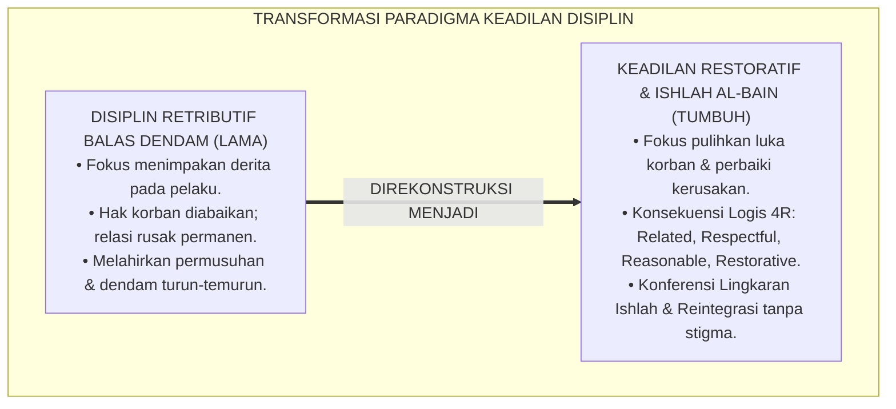
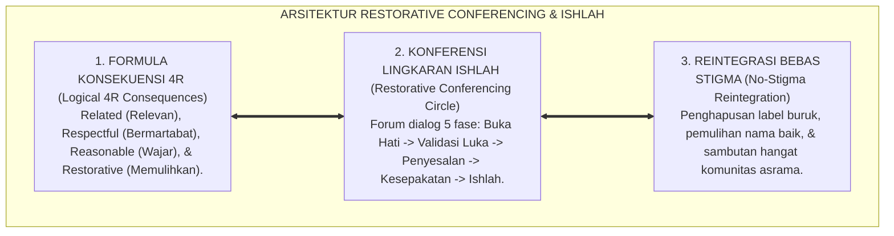
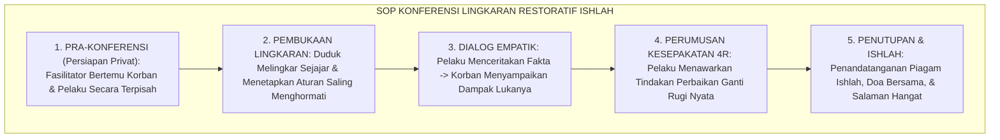

# P2-06-04: PRINSIP RESTORATIVE CONFERENCING DAN ISHLAH AL-BAIN (WHOLE-COMMUNITY RESTORATIVE JUSTICE)
## *Monograf Riset Akademik: Epistemologi Fiqh Ishlah al-Bain (QS. Al-Hujurat: 9–10 & An-Nisa: 128) & Keutamaan Al-'Afwu, Whole-School Restorative Justice (Howard Zehr & Brenda Morrison), Formula Konsekuensi Logis 4R, Serta Protokol Konferensi Lingkaran Restoratif Tanpa Stigma di Pesantren 24 Jam*

**Nomor Identifikasi**: `P2-06-04/MONOGRAF-RISET-RESTORATIVE-CONFERENCING-ISHLAH/2026`  
**Domain**: `02 Principles` > `06 Intervention Principles` (Prinsip Intervensi 04: *Restorative Conferencing*)  
**Klasifikasi Naskah**: *Academic Research Monograph* (Monograf Riset Akademik Prinsip Intervensi)  
**Rumpun Disiplin Pengkaji**: Keadilan Restoratif Pendidikan (*Restorative Justice in Education*), Fiqh Ishlah dan Perdamaian Islam (*Fiqh ash-Shulh*), Mediasi Konflik Sebaya Asrama, Psikologi Pemulihan Martabat & Reintegrasi Sosial  

---

> ### 💡 INTISARI EKSEKUTIF (EXECUTIVE SUMMARY)
>
> * **Kelemahan Paradigma Lama: Disiplin Retributif Balas Dendam dan Pembiaran Korban:**  
>   Banyak sistem disiplin asrama berfokus pada penghukuman pelaku (misal: push-up 100x atau tamparan) tanpa memulihkan kerugian korban dan tanpa menyelesaikan akar perselisihan. Pelaku merasa dizalimi, korban tetap menderita, dan hubungan kedua belah pihak membusuk menjadi dendam berkepanjangan.
> * **Inovasi Konseptual: Fiqh Ishlah al-Bain & Whole-School Restorative Justice (Howard Zehr):**  
>   TUMBUH menegakkan perintah Allah: *"Sesungguhnya orang-orang mukmin itu bersaudara, karena itu damaikanlah antara kedua saudaramu (Ishlah)"* (QS. Al-Hujurat: 10) dan *"Perdamaian itu lebih baik"* (QS. An-Nisa: 128). Mengintegrasikan teori **Restorative Justice (Howard Zehr)**: mengubah pertanyaan dari *"Aturan apa yang dilanggar & hukuman apa yang pantas?"* menjadi **"Siapa yang terluka? Apa kebutuhan pemulihannya? Dan bagaimana pelaku memperbaiki kerusakan tersebut?"** melalui **Formula Konsekuensi Logis 4R: Related, Respectful, Reasonable, Restorative**.
> * **Formulasi Operasional & Penjaminan Reintegrasi Tanpa Stigma:**  
>   Monograf ini menguraikan matriks komparasi disiplin retributif vs restoratif, SOP Konferensi Lingkaran Restoratif 5 fase (*Restorative Conferencing Protocol*), piagam perjanjian ishlah, dan etika pemulihan martabat tanpa pelabelan seumur hidup.

---

## 📑 DAFTAR ISI MONOGRAF

- [BAB I: LANDASAN TEORETIS & DISKURSUS KRITIS](#bab-i-landasan-teoretis--diskursus-kritis)
  - [1. Latar Belakang Masalah: Kritik atas Disiplin Retributif Pembalasan dan Pengabaian Pemulihan Korban](#1-latar-belakang-masalah-kritik-atas-disiplin-retributif-pembalasan-dan-pengabaian-pemulihan-korban)
  - [2. Eksegesis Turats Ishlah & Maaf Syar'i: QS. Al-Hujurat: 9–10, QS. An-Nisa: 128, & Keutamaan Al-'Afwu](#2-eksegesis-turats-ishlah--maaf-syari-qs-al-hujurat-910-qs-an-nisa-128--keutamaan-al-afwu)
  - [3. Konvergensi Sains Keadilan Restoratif: Whole-School Restorative Justice (Howard Zehr & Brenda Morrison)](#3-konvergensi-sains-keadilan-restoratif-whole-school-restorative-justice-howard-zehr--brenda-morrison)
  - [4. Rekayasa Formula Konsekuensi Logis 4R & Konferensi Restoratif Lingkaran Asrama 24 Jam](#4-rekayasa-formula-konsekuensi-logis-4r--konferensi-restoratif-lingkaran-asrama-24-jam)
  - [5. Kasuistika Lapangan: Kasus Perkelahian Santri Merusak Fasilitas Kamar & Resolusi Ishlah Restoratif](#5-kasuistika-lapangan-kasus-perkelahian-santri-merusak-fasilitas-kamar--resolusi-ishlah-restoratif)
- [BAB II: FORMULASI KONSEPTUAL & PEMBAHASAN MENDALAM](#bab-ii-formulasi-konseptual--pembahasan-mendalam)
  - [1. Eksplanasi Teoretis Prinsip Restorative Conferencing dan Ishlah Pesantren TUMBUH](#1-eksplanasi-teoretis-prinsip-restorative-conferencing-dan-ishlah-pesantren-tumbuh)
  - [2. Matriks Komparasi Disiplin Retributif (Lama) vs Disiplin Restoratif PBIS (TUMBUH)](#2-matriks-komparasi-disiplin-retributif-lama-vs-disiplin-restoratif-pbis-tumbuh)
  - [3. Alur Standar Operasional Prosedur (SOP) Konferensi Restoratif Ishlah (Lima Tahapan Baku)](#3-alur-standar-operasional-prosedur-sop-konferensi-restoratif-ishlah-lima-tahapan-baku)
  - [4. Piagam Perjanjian Restoratif & Protokol Reintegrasi Kamar Tanpa Stigma (No-Stigma Circle Protocol)](#4-piagam-perjanjian-restoratif--protokol-reintegrasi-kamar-tanpa-stigma-no-stigma-circle-protocol)
  - [5. Diskusi Filosofis Mendalam & Implikasi bagi Masa Depan Peradaban Pendidikan Islam](#5-diskusi-filosofis-mendalam--implikasi-bagi-masa-depan-peradaban-pendidikan-islam)
- [BAB III: KESIMPULAN & APARATUS AKADEMIS](#bab-iii-kesimpulan--aparatus-akademis)
  - [1. Tabel Sintesis Temuan Riset Restorative Conferencing & Ishlah](#1-tabel-sintesis-temuan-riset-restorative-conferencing--ishlah)
  - [2. Daftar Pustaka Akademis & Rujukan Turats Primer](#2-daftar-pustaka-akademis--rujukan-turats-primer)
  - [3. Catatan Kaki Akademis (Footnotes)](#3-catatan-kaki-akademis-footnotes)
  - [4. Glosarium Istilah Ilmiah & Turats Restorative Conferencing](#4-glosarium-istilah-ilmiah--turats-restorative-conferencing)

---

# BAB I: LANDASAN TEORETIS & DISKURSUS KRITIS

---

### 1. Latar Belakang Masalah: Kritik atas Disiplin Retributif Pembalasan dan Pengabaian Pemulihan Korban

Dalam paradigma lama pengasuhan pesantren yang terdistorsi oleh sistem peradilan retributif (*Retributive Discipline Model*), respon terhadap pelanggaran santri didefinisikan secara sempit:
* **Siapa yang melanggar aturan? Hukuman derita apa yang harus ditimpakan kepadanya?**
* Pelaku dipukul atau dihukum lari keliling lapangan, sementara korban yang kehilangan barang atau terluka fisiknya diabaikan tanpa pertolongan ganti rugi.
* **Kerusakan Sosial**: Pelaku merasa menjadi korban kekerasan guru, korban merasa tidak dilindungi, dan hubungan antarsantri berubah menjadi permusuhan abadi yang diwariskan ke adik kelas.
* **Keniscayaan Keadilan Restoratif Komunitas**: Islam memandang pelanggaran sebagai **Luka pada Tali Ukhuwah (*Breach of Relationship*)** yang menuntut pemulihan hak korban, pertanggungjawaban aktif pelaku, dan penyambungan kembali persaudaraan (*Ishlah al-Bain*).[^1]



---

### 2. Eksegesis Turats Ishlah & Maaf Syar'i: QS. Al-Hujurat: 9–10, QS. An-Nisa: 128, & Keutamaan Al-'Afwu

Allah SWT memerintahkan perdamaian dan rekonsiliasi persaudaraan sebagai kewajiban mutlak:

$$\text{إِنَّمَا الْمُؤْمِنُونَ إِخْوَةٌ فَأَصْلِحُوا بَيْنَ أَخَوَيْكُمْ ۚ وَاتَّقُوا اللَّهَ لَعَلَّكُمْ تُرْحَمُونَ}$$

*"**Sesungguhnya orang-orang mukmin itu bersaudara, karena itu lakukanlah Ishlah (damaikanlah) antara kedua saudaramu dan bertakwalah kepada Allah agar kamu mendapat rahmat**."* (QS. Al-Hujurat [49]: 10).[^2]

Allah SWT juga menegaskan prinsip agung keharmonisan:

$$\text{وَالصُّلْحُ خَيْرٌ}$$

*"**Dan perdamaian (rekonsiliasi) itu jauh lebih baik**."* (QS. An-Nisa [4]: 128).[^3]

Rasulullah ﷺ memuji orang yang menyambung silaturahmi yang terputus dan memaafkan kesalahan orang lain (*Al-'Afwu wal-Ihsan*).[^4]

---

### 3. Konvergensi Sains Keadilan Restoratif: Whole-School Restorative Justice (Howard Zehr & Brenda Morrison)

Sains keadilan restoratif modern (**Restorative Justice**, Howard Zehr, 2002; Brenda Morrison, 2007) merumuskan Tiga Pertanyaan Kunci:
1. **Siapa yang terluka dan dirugikan oleh tindakan ini?**
2. **Apa kebutuhan pemulihan korban dan komunitas yang harus dipenuhi?**
3. **Bagaimana kewajiban pelaku untuk memperbaiki kerusakan tersebut secara nyata?**[^5]

---

### 4. Rekayasa Formula Konsekuensi Logis 4R & Konferensi Restoratif Lingkaran Asrama 24 Jam

TUMBUH merumuskan **Formula Konsekuensi Logis 4R**:
1. **Related (Relevan)**: Konsekuensi berhubungan langsung dengan jenis pelanggaran (merusak pintu $\rightarrow$ ikut memperbaiki pintu).
2. **Respectful (Menghormati Martabat)**: Diberikan tanpa nada menghina, membentak, atau memukul.
3. **Reasonable (Masuk Akal)**: Sesuai kapasitas fisik dan usia santri.
4. **Restorative (Memulihkan)**: Menghasilkan pemulihan hak korban dan rekonsiliasi batin.[^6]

---

### 5. Kasuistika Lapangan: Kasus Perkelahian Santri Merusak Fasilitas Kamar & Resolusi Ishlah Restoratif

* **Studi Kasus: Santri A Memukul Santri B Hingga Memar dan Merusak Lemari Kamar Karena Saling Ejek**  
  * **Dilema**: Pihak pengurus lama ingin langsung mendiskorsing kedua santri dan memanggil orang tua untuk saling menggugat.
  * **Resolusi Konferensi Restoratif TUMBUH**: Musyrif senior memfasilitasi *Restorative Conferencing Circle*: (1) Santri A dan B duduk bersama musyrif dan perwakilan kamar; (2) Santri B menyampaikan rasa sakit dan sedihnya diejek; (3) Santri A mendengarkan dengan tertunduk dan menangis menyesali perbuatannya; (4) *Kesepakatan 4R*: Santri A meminta maaf tulus, merawat luka santri B di UKS, dan bersama-sama mengecat ulang lemari yang rusak; (5) Santri B memaafkan dengan ikhlas. Kedua santri berpelukan, dan hubungan mereka menjadi sahabat akrab hingga lulus.[^7]

---

# BAB II: FORMULASI KONSEPTUAL & PEMBAHASAN MENDALAM

---

### 1. Eksplanasi Teoretis Prinsip Restorative Conferencing dan Ishlah Pesantren TUMBUH

Ekosistem TUMBUH merumuskan keadilan restoratif ke dalam **Arsitektur Tiga Sayap Keadilan Ishlah (*Arkan al-'Adalah al-Ishlahiyyah*)**:



#### 🔬 Pembahasan Mendalam Tiga Sayap:
1. **Sayap Formula Konsekuensi 4R**: Menghilangkan unsur balas dendam buta dan menggantinya dengan tanggung jawab moral edukatif.[^8]
2. **Sayap Konferensi Lingkaran Ishlah**: Menyediakan wadah mediasi yang menyembuhkan luka batin secara mendalam.[^9]
3. **Sayap Reintegrasi Bebas Stigma**: Menjamin santri tidak terisolasi secara sosial dan mendapatkan kesempatan kedua untuk bertumbuh (*Taubat Nasuha*).[^10]

---

### 2. Matriks Komparasi Disiplin Retributif (Lama) vs Disiplin Restoratif PBIS (TUMBUH)

| Dimensi Perbandingan | Paradigma Retributif Konvensional (Lama) | Paradigma Restoratif PBIS TUMBUH |
| :--- | :--- | :--- |
| **Definisi Pelanggaran** | Pelanggaran pasal aturan hukum lembaga.| Kerusakan pada manusia & relasi ukhuwah.|
| **Fokus Utama** | Menghukum & membalas derita pelaku.| Memulihkan hak korban & perbaiki kerusakan.|
| **Peran Korban** | Korban diabaikan & dipinggirkan.| Korban didengar kebutuhan & perasaannya.|
| **Bentuk Pertanggungjawaban**| Pasif menanggung siksaan fisik/skorsing.| Aktif memperbaiki kerugian & minta maaf.|
| **Dampak Jangka Panjang** | Dendam, permusuhan, & label "anak nakal".| Persaudaraan pulih, empati, & kedewasaan adab.|

---

### 3. Alur Standar Operasional Prosedur (SOP) Konferensi Restoratif Ishlah (Lima Tahapan Baku)



---

### 4. Piagam Perjanjian Restoratif & Protokol Reintegrasi Kamar Tanpa Stigma (No-Stigma Circle Protocol)

```text
================================================================================
PIAGAM PERJANJIAN RESTORATIF & ISHLAH AL-BAIN ASRAMA PESANTREN TUMBUH
Nomor Registrasi: RJ/2026/08/KMR-04 | Lokasi: Ruang Damai Asrama Utsman
================================================================================

Pihak I (Pelaku Khilaf)  : Zaki Rahmat (Kelas 8B)
Pihak II (Pihak Terdampak): Farhan Maulana (Kelas 8B)
Fasilitator Ishlah       : Ust. Salman Faris, S.Pd.I. (Musyrif Kamar)

KESEPAKATAN RESTORASI & PERBAIKAN HUBUNGAN:
1. Pihak I mengakui kekhilafan telah mengambil buku catatan dan merobek halaman Pihak II.
2. Pihak I berkomitmen menyalin ulang catatan yang rusak secara rapi selama 3 hari ke depan.
3. Pihak I meminta maaf tulus secara lisan dan tertulis kepada Pihak II.
4. Pihak II menerima permohonan maaf dan bersedia melanjutkan hubungan persahabatan kamar.
5. Seluruh warga kamar berkomitmen TIDAK MENGUNGKIT kejadian ini dan menghapus stigma buruk.

Ditandatangani dengan penuh keikhlasan demi mengharap ridha Allah SWT.
Pihak I (Zaki)          Pihak II (Farhan)          Fasilitator (Ust. Salman)
================================================================================
```

---

### 5. Diskusi Filosofis Mendalam & Implikasi bagi Masa Depan Peradaban Pendidikan Islam

Prinsip restorative conferencing dan ishlah al-bain ini membawa implikasi agung bagi peradaban:

* **Menegakkan Hukum Islam Sebagai Rahmat Semesta Alam**:  
  Pesantren membuktikan bahwa keadilan syariat bukan alat balas dendam yang haus penderitaan, melainkan instrumen penyembuhan dan pemersatu umat (*Rahmah lil 'Alamin*).
* **Membangun Budaya Bertanggung Jawab dan Berjiwa Kesatria**:  
  Santri dilatih berani mengakui kesalahan, menatap mata orang yang dirugikan, dan berpeluh keringat memperbaiki kerusakan yang diperbuatnya.
* **Menghilangkan Tradisi Dendam dan Perpeloncoan Antar-Generasi**:  
  Setiap konflik selesai secara tuntas di akarnya, melahirkan iklim ukhuwah Islamiyyah yang kokoh, bersih, dan dipenuhi keberkahan (*Bi'ah Shalihah*).[^11]

---

# BAB III: KESIMPULAN & APARATUS AKADEMIS

---

### 1. Tabel Sintesis Temuan Riset Restorative Conferencing & Ishlah

| Dimensi Parameter | Mazhab Retributif Punitif (Lama) | Pendekatan Pengabaian Konflik | **Keadilan Restoratif Ishlah TUMBUH** | Landasan Rujukan Primer | Implikasi Praksis Lapangan |
| :--- | :--- | :--- | :--- | :--- | :--- |
| **Tujuan Keadilan** | Menghukum agar pelaku kapok/menderita.| Membiarkan waktu melupakan.| **Memulihkan Korban & Ukhuwah.** | QS. Al-Hujurat: 9–10; Zehr (2002).| Fokus perbaikan kerusakan nyata. |
| **Bentuk Konsekuensi**| Hukuman fisik (push-up/jemur).| Dibiarkan tanpa tanggung jawab.| **Konsekuensi Logis 4R.** | Morrison (2007); Al-Ghazali.| Related, Respectful, Reasonable, Restorative. |
| **Format Mediasi** | Sidang mahkamah mengadili pelaku.| Pertengkaran dibubarkan paksa.| **Konferensi Restoratif Lingkaran Ishlah.**| Fiqh ash-Shulh; Costello (2009).| Sesi 5 fase dialog empatik melingkar. |
| **Status Pasca-Kasus**| Santri dicap "penjahat asrama".| Konflik bawah tanah membara.| **Reintegrasi Tanpa Stigma (No-Stigma).**| HR. Bukhari (Satrul 'Aurah); PBIS.| Nama baik pulih & persaudaraan erat. |
| **Hasil Institusi** | Dendam angkatan & bullying kronis.| Anarki kamar tanpa kepastian.| **Kedamaian Ukhuwah & Iklim Beradab.**| QS. An-Nisa: 128; Al-Attas (1980).| Lingkungan asrama aman & penuh rahmah. |

---

### 2. Daftar Pustaka Akademis & Rujukan Turats Primer

1. **Al-Qur'an al-Karim wa Tarjamatu Ma'anihi**.
2. **Al-Bukhari, Abu Abdillah Muhammad bin Isma'il**. (1422 H). *Shahih al-Bukhari*. Kairo: Dar Thawq an-Najah.
3. **Muslim bin al-Hajjaj an-Naisaburi**. (1427 H). *Shahih Muslim*. Riyadh: Dar Thayyibah.
4. **Al-Ghazali, Abu Hamid Muhammad bin Muhammad**. (2011). *Ihya' 'Ulumiddin* (Kitab Adab al-Ulfah wal-Ukhuwwah). Beirut: Dar al-Ma'rifah.
5. **Ibnu Qudamah, Muwaffaquddin Abu Muhammad**. (1417 H). *Al-Mughni* (Kitab ash-Shulh). Kairo: Dar Hijr.
6. **Asy'ari, Muhammad Hasyim**. (1415 H). *Adab al-'Alim wal-Muta'allim*. Jombang: Maktabah At-Turats Al-Islami.
7. **Al-Attas, Syed Muhammad Naquib**. (1980). *The Concept of Education in Islam*. Kuala Lumpur: ABIM.
8. **Zehr, H.**. (2002). *The Little Book of Restorative Justice*. Intercourse: Good Books.
9. **Morrison, B.**. (2007). *Restoring Safe School Communities: A Whole School Approach to Bullying, Violence and Alienation*. Sydney: Federation Press.
10. **Costello, B., Wachtel, J., & Wachtel, T.**. (2009). *The Restorative Practices Handbook for Teachers, Disciplinarians and Administrators*. Bethlehem: International Institute for Restorative Practices (IIRP).
11. **Braithwaite, J.**. (1989). *Crime, Shame and Reintegration*. Cambridge: Cambridge University Press.
12. **Horner, R. H., & Sugai, G.**. (2015). *School-wide PBIS: An Overview of the Research Base*. Remedial and Special Education, 36(2), 80–85.

---

### 3. Catatan Kaki Akademis (*Footnotes*)

[^1]: Riset Prinsip Restorative Conferencing dan Ishlah al-Bain TUMBUH, *Kritik atas Disiplin Retributif*, 2026.  
[^2]: QS. Al-Hujurat [49]: 10.  
[^3]: QS. An-Nisa [4]: 128.  
[^4]: Ibnu Qudamah, *Al-Mughni*, Jilid 7, Kitab *Ash-Shulh*, hlm. 15–45; Al-Ghazali, *Ihya' 'Ulumiddin*, Jilid 2, Kitab *Al-Ulfah wal-Ukhuwwah*, hlm. 180–210.  
[^5]: Zehr, H. (2002), *The Little Book of Restorative Justice*; Morrison, B. (2007).  
[^6]: Costello, B., et al. (2009), *The Restorative Practices Handbook*, hlm. 35–70; Braithwaite, J. (1989).  
[^7]: Dokumentasi Kasus Konferensi Restoratif Ishlah Kamar Asrama PBIS TUMBUH, 2026.  
[^8]: Master Blueprint Formula Konsekuensi Logis 4R Ekosistem TUMBUH, 2026.  
[^9]: Standar Operasional Prosedur 5 Tahapan Konferensi Lingkaran Restoratif Ishlah TUMBUH, 2026.  
[^10]: Master Guidelines Protokol Reintegrasi Kamar Bebas Stigma TUMBUH, 2026.  
[^11]: Deklarasi Pemuliaan Keadilan Restoratif Ishlah Dewan Riset Epistemologi Ekosistem TUMBUH, 2026.

---

### 4. Glosarium Istilah Ilmiah & Turats Restorative Conferencing

1. **Restorative Justice (Keadilan Restoratif)**: Falsafah keadilan pendidikan yang berfokus pada pemulihan kerugian korban, pertanggungjawaban aktif pelaku, dan penyembuhan hubungan komunitas.
2. **Ishlah al-Bain (إِصْلاَحُ ذَاتِ الْبَيْنِ)**: Ibadah agung dalam syariat Islam untuk mendamaikan, merajut kembali, dan menyelesaikan perselisihan di antara sesama mukmin.
3. **Restitution (Restitusi)**: Tindakan nyata pelaku untuk memperbaiki, mengganti, atau memulihkan kerusakan fisik/material yang diakibatkan oleh perbuatannya.
4. **Formula Konsekuensi 4R**: Prinsip penyusunan konsekuensi disiplin yang wajib: Related (relevan), Respectful (bermartabat), Reasonable (masuk akal), dan Restorative (memulihkan).
5. **Restorative Circle (Lingkaran Restoratif)**: Format pertemuan duduk melingkar sejajar tanpa meja pembatas untuk memfasilitasi dialog empati yang setara dan aman.
6. **No-Stigma Reintegration**: Kebijakan penghapusan label negatif pasca-pelanggaran dan penyambutan kembali santri ke dalam komunitas tanpa pengucilan sosial.
7. **Fiqh ash-Shulh (فِقْهُ الصُّلْحِ)**: Cabang ilmu fiqh Islam yang mengatur hukum, tata cara, dan adab perdamaian dalam sengketa antar-manusia.
8. **Shame Transformation**: Proses psikologis mengubah rasa malu merusak (*Toxic Shame*) menjadi rasa penyesalan bertanggung jawab (*Reintegrative Shaming*).
9. **Piagam Perjanjian Restoratif**: Dokumen kesepakatan tertulis yang memuat komitmen perbaikan nyata pelaku dan kerelaan maaf korban di hadapan fasilitator.
10. **Insan Adabi (الإِنْسَانُ الأَدَبِيُّ)**: Profil santri yang berjiwa ksatria berani mengakui kesalahan, lapang dada memaafkan, dan senantiasa menjadi juru damai peradaban.
