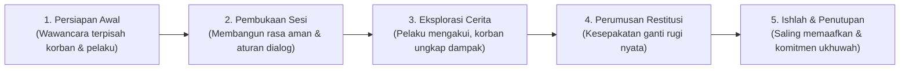

# P2-06-04-Prinsip-Restorative-Conferencing-dan-Ishlah

## Tujuan
Menetapkan protokol **Konferensi Restoratif (*Restorative Conferencing*)** dan mediasi perdamaian Islam (*Ishlah*), memandu proses rekonsiliasi antara korban, pelaku kekhilafan, dan komunitas asrama untuk memulihkan ukhuwah, mengganti kerugian nyata (*Restitusi*), dan menutup dendam sosial.

---

## 1. Dalil Syariat tentang Ishlah

> *"Sesungguhnya orang-orang mukmin itu bersaudara, karena itu damaikanlah antara kedua saudaramu (yang berselisih) dan bertakwalah kepada Allah agar kamu mendapat rahmat."*  
> **(QS. Al-Hujurat [49]: 10)**

---

## 2. 5 Tahapan Konferensi Restoratif TUMBUH

---

## 3. Matriks Peran Fasilitator Musyrif / BK

1. **Netralitas Berempati (*Neutral & Empathetic Facilitation*)**:
   - Musyrif tidak memihak, tidak memojokkan pelaku, dan tidak meremehkan rasa sakit korban.
2. **Fokus pada Pemulihan Kerugian (*Direct Restitution*)**:
   - Jika barang korban rusak/hilang $\rightarrow$ pelaku mengganti barang tersebut secara bertahap atau memperbaikinya.
   - Jika martabat korban tercoreng $\rightarrow$ pelaku menyampaikan klarifikasi dan permintaan maaf tulus.
3. **Mencegah Reviktimisasi (*Safe Environment*)**:
   - Menjamin korban merasa aman berbicara tanpa takut diintimidasi kembali oleh pelaku atau teman-temannya di kamar.

---

## 4. Status Dokumen
* **Status**: 🌟 **A+ (Tervalidasi & Siap Diimplementasikan)**
* **Level**: Project 2 - `02 Principles / 06 Intervention Principles`
* **Langkah Berikutnya**: **`P2-06-05-Sintesis-Intervention-Principles-TUMBUH.md`**.
