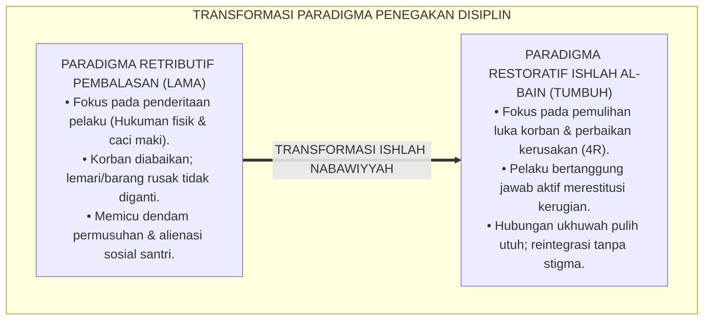
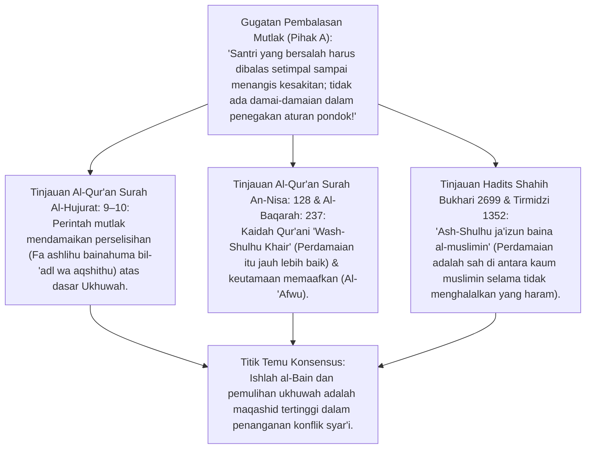
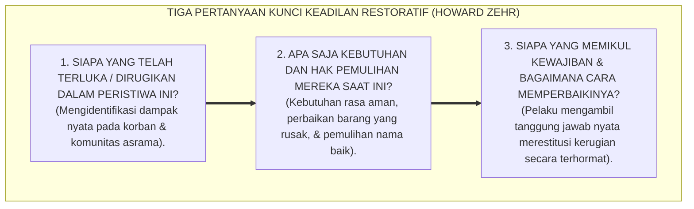
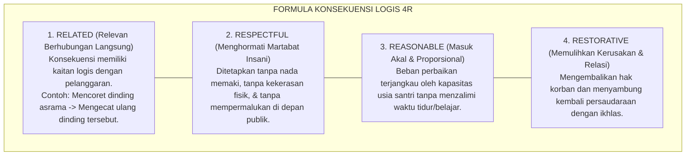
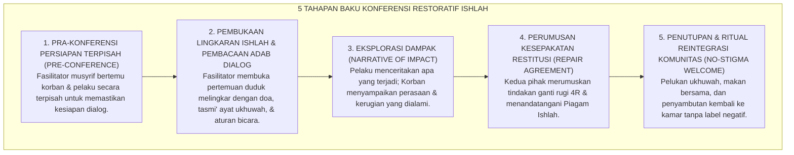
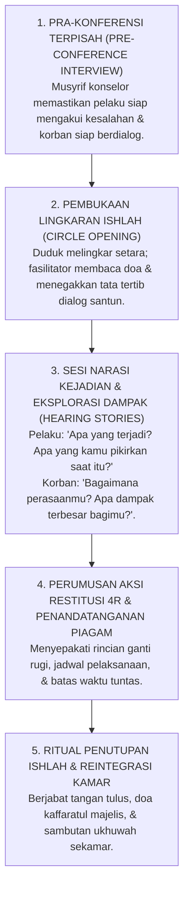

# P2-06-04: PRINSIP RESTORATIVE CONFERENCING DAN ISHLAH AL-BAIN
## *Monograf Terpadu: Epistemologi Fiqh Ishlah al-Bain (QS. Al-Hujurat: 9–10 & An-Nisa: 128) serta Keutamaan Al-'Afwu, Konvergensi Whole-School Restorative Justice (Howard Zehr & Brenda Morrison), Formula Konsekuensi Logis 4R, Pelaksanaan Konferensi Restoratif Komunitas, dan Reintegrasi Santri Tanpa Stigma*

**Nomor Identifikasi**: `P2-06-04/MONOGRAF-TERPADU-RESTORATIVE-CONFERENCING-ISHLAH/2026`  
**Domain**: `02 Principles` > `06 Intervention Principles`  
**Klasifikasi Naskah**: *Comprehensive Integrated Monograph* (Monograf Akademis & Rumusan Baku Terpadu)  
**Rumpun Disiplin Pengkaji**: Keadilan Restoratif Pendidikan (*Restorative Justice in Education*), Fiqh Ishlah dan Perdamaian Islam (*Fiqh ash-Shulh*), Mediasi Konflik Sebaya Asrama, Psikologi Pemulihan Martabat & Reintegrasi Sosial  

---

> ### 💡 INTISARI PRAKTIS (3 MENIT PAHAM UNTUK ASATIDZ & MUSYRIF)
>
> * **Ubah Paradigma "Balas Hukuman" Menjadi "Pulihkan Kerusakan Hubungan" (*Ishlah*):**  
>   Ketika santri A merusak lemari santri B, hukuman tradisional adalah menyuruh santri A push-up 100 kali. Hukuman ini tidak ada gunanya: santri A merasa dendam, lemari santri B tetap rusak, dan hubungan keduanya semakin hancur. Keadilan Restoratif TUMBUH fokus pada **Pemulihan Kerusakan (*Restitution*) dan Perdamaian (*Ishlah al-Bain*)**.
> * **Formula Konsekuensi Logis 4R:**  
>   Setiap konsekuensi pelanggaran wajib memenuhi 4 syarat:  
>   1. **Related (Relevan):** Konsekuensi berhubungan langsung dengan kesalahan (misal: merusak lemari $\rightarrow$ santri memperbaiki atau mengganti lemari tersebut).  
>   2. **Respectful (Menghormati Martabat):** Diberikan tanpa caci maki, ejekan, atau kekerasan fisik.  
>   3. **Reasonable (Masuk Akal):** Sesuai dengan kapasitas usia santri tanpa menzalimi.  
>   4. **Restorative (Memulihkan):** Mengembalikan hak korban dan menyambung tali persaudaraan.
> * **Konferensi Restoratif Komunitas (Lingkaran Ishlah):**  
>   Musyrif memandu forum dialog duduk melingkar: Pelaku mengakui kesalahan dan mendengarkan luka korban $\rightarrow$ Korban menyampaikan perasaannya $\rightarrow$ Pelaku menyepakati tindakan perbaikan nyata $\rightarrow$ Berjabat tangan tulus dan reintegrasi tanpa label "anak nakal".

---

## 📑 DAFTAR ISI MONOGRAF

- [BAGIAN I: RISET RESTORATIVE CONFERENCING & ISHLAH AL-BAIN, DIALEKTIKA INKUIRI, & KASUISTIKA LAPANGAN](#bagian-i-riset-restorative-conferencing--ishlah-al-bain-dialektika-inkuiri--kasuistika-lapangan)
  - [1. Kerangka Metodologi Keadilan Restoratif Pesantren: Menggeser Paradigma Retributif Menuju Pemulihan Ukhuwah](#1-kerangka-metodologi-keadilan-restoratif-pesantren-menggeser-paradigma-retributif-menuju-pemulihan-ukhuwah)
  - [2. Inkuiri 1: Eksegesis Turats Ishlah & Maaf Syar'i — QS. Al-Hujurat: 9–10, Wash-Shulhu Khair, & Keutamaan Al-'Afwu](#2-inkuiri-1-eksegesis-turats-ishlah--maaf-syari--qs-al-hujurat-910-wash-shulhu-khair--keutamaan-al-afwu)
  - [3. Inkuiri 2: Konvergensi Whole-School Restorative Justice Howard Zehr & Tiga Pertanyaan Kunci Restoratif](#3-inkuiri-2-konvergensi-whole-school-restorative-justice-howard-zehr--tiga-pertanyaan-kunci-restoratif)
  - [4. Inkuiri 3: Formula Konsekuensi Logis 4R (Related, Respectful, Reasonable, Restorative)](#4-inkuiri-3-formula-konsekuensi-logis-4r-related-respectful-reasonable-restorative)
  - [5. Inkuiri 4: Pelaksanaan Konferensi Restoratif Komunitas Asrama & Reintegrasi Tanpa Stigma](#5-inkuiri-4-pelaksanaan-konferensi-restoratif-komunitas-asrama--reintegrasi-tanpa-stigma)
  - [6. Inkuiri 5: Silogisme Logika, Dialektika 3 Ronde, Kasuistika Ishlah Asrama, & Titik Temu Konsensus](#6-inkuiri-5-silogisme-logika-dialektika-3-ronde-kasuistika-ishlah-asrama--titik-temu-konsensus)
- [BAGIAN II: KODIFIKASI BAKU HASIL RISET & KESIMPULAN FORMAL](#bagian-ii-kodifikasi-baku-hasil-riset--kesimpulan-formal)
  - [1. Kaidah Utama dan Standar Baku: Prinsip Restorative Conferencing dan Ishlah Pesantren TUMBUH](#1-kaidah-utama-dan-standar-baku-prinsip-restorative-conferencing-dan-ishlah-pesantren-tumbuh)
  - [2. Matriks Komparasi Disiplin Retributif (Lama) vs Disiplin Restoratif PBIS (TUMBUH)](#2-matriks-komparasi-disiplin-retributif-lama-vs-disiplin-restoratif-pbis-tumbuh)
  - [3. Alur Standar Operasional Prosedur Konferensi Restoratif Ishlah (5 Tahapan Baku)](#3-alur-standar-operasional-prosedur-konferensi-restoratif-ishlah-5-tahapan-baku)
  - [4. Piagam Perjanjian Restoratif & Protokol Reintegrasi Kamar (No-Stigma Circle Protocol)](#4-piagam-perjanjian-restoratif--protokol-reintegrasi-kamar-no-stigma-circle-protocol)
- [BAGIAN III: APARATUS AKADEMIS & APENDIKS](#bagian-iii-aparatus-akademis--apendiks)
  - [1. Tabel Sintesis Hasil Riset Restorative Conferencing & Ishlah](#1-tabel-sintesis-hasil-riset-restorative-conferencing--ishlah)
  - [2. Daftar Pustaka Akademis & Rujukan Turats Primer](#2-daftar-pustaka-akademis--rujukan-turats-primer)
  - [3. Catatan Kaki Akademis (Footnotes)](#3-catatan-kaki-akademis-footnotes)
  - [4. Glosarium dan Penjelasan Istilah Teknis Restorative Justice, Konsekuensi 4R, & Ishlah al-Bain](#4-glosarium-dan-penjelasan-istilah-teknis-restorative-justice-konsekuensi-4r--ishlah-al-bain)

---

# BAGIAN I: RISET RESTORATIVE CONFERENCING & ISHLAH AL-BAIN, DIALEKTIKA INKUIRI, & KASUISTIKA LAPANGAN

---

### 1. Kerangka Metodologi Keadilan Restoratif Pesantren: Menggeser Paradigma Retributif Menuju Pemulihan Ukhuwah

Dalam paradigma lama pengasuhan pesantren yang terdistorsi oleh sistem peradilan pidana retributif (*Retributive Justice System*), respon terhadap pelanggaran santri didefinisikan secara sempit sebagai:
* **Siapa yang melanggar aturan? Aturan pasal berapa yang dilanggar? Dan hukuman fisik/penderitaan apa yang pantas ditimpakan kepadanya?**
* Akibatnya, korban yang dirugikan diabaikan, pelaku hanya fokus menanggung hukuman fisik tanpa pernah merasakan penyesalan batin, dan hubungan persaudaraan antarsantri berubah menjadi permusuhan abadi yang diwariskan lintas angkatan.

Islam adalah agama pemulihan martabat dan persaudaraan (*Din ar-Rahmah wal-Ishlah*). Ekosistem TUMBUH menegakkan **Keadilan Restoratif Komunitas Pesantren (*Whole-School Restorative Justice*)**: memandang pelanggaran sebagai **Luka pada Relasi Persaudaraan (*Breach of Relationship*)** yang menuntut pemulihan hak korban, pertanggungjawaban aktif pelaku, dan reintegrasi komunitas tanpa stigma.

---

### 2. Inkuiri 1: Eksegesis Turats Ishlah & Maaf Syar'i — QS. Al-Hujurat: 9–10, *Wash-Shulhu Khair*, & Keutamaan *Al-'Afwu*

#### 📐 Formalisasi Logika Silogisme (*Qiyas Mantiqi 1*)
* **Premis Mayor (*al-Muqaddimah al-Kubra*)**: Setiap penyelesaian perselisihan dan pelanggaran adab di lingkungan kaum mukminin niscaya wajib mengutamakan jalan perdamaian (*Ishlah*), keadilan pemulihan (*'Adl Restoratif*), dan pemaafan yang mendidik tanggung jawab.
* **Premis Minor (*al-Muqaddimah ash-Shughra*)**: Allah SWT secara tegas memerintahkan perdamaian adil di antara dua pihak mukmin yang berselisih (QS. Al-Hujurat: 9–10) dan Rasulullah SAW memuliakan para pendamai (*al-Mushlihun*).
* **Konklusi (*an-Natijah*)**: Maka, seluruh penanganan pelanggaran perilaku di pesantren TUMBUH wajib menggunakan metodologi Konferensi Restoratif Ishlah al-Bain.[^1]

#### 📖 Teks Primer Al-Qur'an: Surah Al-Hujurat Ayat 9–10
Firman Allah SWT menegaskan:

$$\text{وَإِنْ طَائِفَتَانِ مِنَ الْمُؤْمِنِينَ اقْتَتَلُوا فَأَصْلِحُوا بَيْنَهُمَا ۖ فَإِنْ بَغَتْ إِحْدَاهُمَا عَلَى الْأُخْرَىٰ فَقَاتِلُوا الَّتِي تَبْغِي حَتَّىٰ تَفِيءَ إِلَىٰ أَمْرِ اللَّهِ ۚ فَإِنْ فَاءَتْ فَأَصْلِحُوا بَيْنَهُمَا بِالْعَدْلِ وَأَقْسِطُوا ۖ إِنَّ اللَّهَ يُحِبُّ الْمُقْسِطِينَ ۞ إِنَّمَا الْمُؤْمِنُونَ إِخْوَةٌ فَأَصْلِحُوا بَيْنَ أَخَوَيْكُمْ ۚ وَاتَّقُوا اللَّهَ لَعَلَّكُمْ تُرْحَمُونَ}$$

*"Dan apabila ada dua golongan dari orang-orang mukmin berperang/berselisih, **maka damaikanlah antara keduanya!** ... Dan jika golongan itu telah kembali (kepada kebenaran), **maka damaikanlah antara keduanya dengan adil dan berlaku luruslah; sesungguhnya Allah menyukai orang-orang yang berlaku adil. Sesungguhnya orang-orang mukmin itu bersaudara, karena itu damaikanlah antara kedua saudaramu (yang berselisih)** dan bertakwalah kepada Allah agar kamu mendapat rahmat."* (QS. Al-Hujurat [49]: 9–10).[^2]

---

### 3. Inkuiri 2: Konvergensi *Whole-School Restorative Justice* Howard Zehr & Tiga Pertanyaan Kunci Restoratif

#### 📐 Formalisasi Logika Silogisme (*Qiyas Mantiqi 2*)
* **Premis Mayor (*al-Muqaddimah al-Kubra*)**: Setiap penegakan disiplin yang memusatkan perhatian pada pemulihan kerugian korban (*Victim Healing*) dan pembelajaran tanggung jawab pelaku (*Offender Accountability*) menghasilkan penurunan angka residivisme pelanggaran dan membangun iklim ukhuwah yang kokoh.
* **Premis Minor (*al-Muqaddimah ash-Shughra*)**: *Restorative Justice Framework* (Prof. Howard Zehr, 2002; Brenda Morrison, 2007) membuktikan bahwa mediasi restoratif menurunkan konflik berulang hingga 70% di lembaga pendidikan.
* **Konklusi (*an-Natijah*)**: Maka, ekosistem pesantren TUMBUH mengkodifikasikan Tiga Pertanyaan Kunci Restoratif dalam setiap sidang bimbingan santri.[^3]

---

### 4. Inkuiri 3: Formula Konsekuensi Logis 4R (*Related, Respectful, Reasonable, Restorative*)

---

### 5. Inkuiri 4: Pelaksanaan Konferensi Restoratif Komunitas Asrama & Reintegrasi Tanpa Stigma

---

### 6. Inkuiri 5: Silogisme Logika, Dialektika 3 Ronde, Kasuistika Ishlah Asrama, & Titik Temu Konsensus

#### 🥊 Ronde 1: Menolak Prasangka Bahwa "Konsekuensi Restoratif Terlalu Ringan dan Tidak Membuat Santri Kapok"
* **Pihak A (Sudut Pandang Kultus Rasa Sakit Fisik)**:  
  *"Kalau santri cuma disuruh mengganti barang dan minta maaf, dia tidak akan kapok! Harus dipukul rotan biar jera!"*
* **Tinjauan Sudut Pandang Beratnya Tanggung Jawab Moral Restoratif**:  
  Menerima pukulan rotan selama 1 menit adalah **Cara Paling Murah Melepaskan Tanggung Jawab**: setelah dipukul, santri merasa impas dan tidak peduli pada korban. Sebaliknya, **Duduk Menatap Mata Korban, Mendengarkan Kesedihannya, Meminta Maaf Tulus, dan Bekerja Memperbaiki Kerusakan Selama 3 Hari** menuntut keberanian moral tingkat tinggi yang membekas mendalam di sanubari santri seumur hidup.[^4]

#### 🥊 Ronde 2: Sanggahan Balik Bagaimana Jika Korban Menolak Memaafkan dan Sangat Trauma?
* **Pihak A (Sudut Pandang Pemaksaan Perdamaian Semu)**:  
  *"Paksa saja korbannya untuk memaafkan dan salaman saat itu juga biar masalah cepat selesai!"*
* **Tinjauan Sudut Pandang Hak Korban & Tahap Pemulihan Trauma (Voluntary Process)**:  
  Perdamaian tidak boleh dipaksakan (*No Forced Forgiveness*). Jika korban masih trauma berat, **Konferensi Ditunda** dan korban mendapatkan konseling pendampingan psikologis terlebih dahulu. Pelaku tetap menjalankan kewajiban restitusi ganti rugi melalui perantara musyrif hingga korban siap secara sukarela bertemu dalam Lingkaran Ishlah.[^5]

#### 🥊 Ronde 3: Sanggahan Pamungkas Mengapa Menghapus Stigma Masa Lalu Penting Bagi Kelangsungan Taubat Santri?
* **Pihak A (Sudut Pandang Pelabelan Abadi)**:  
  *"Santri yang pernah mencuri harus selalu diawasi dan diumumkan ke seluruh kamar agar semua santri waspada!"*
* **Resolusi Sudut Pandang Kaidah Taubat Nasuha & Tabir Aib Syar'i**:  
  Mengumumkan aib santri yang telah bertaubat dan menuntaskan restitusinya adalah **Dosa Ghibah dan Kezaliman Besar**. Rasulullah SAW bersabda: *"Orang yang bertaubat dari dosa laksana orang yang tidak memiliki dosa sama sekali"* (HR. Ibnu Majah No. 4250). Reintegrasi tanpa stigma mengembalikan kehormatan santri sebagai saudara seiman yang mulia.[^6]

> #### 📌 Kasuistika Lapangan & Titik Temu Konsensus
> * **Studi Kasus**: Santri R mencuri uang SPP milik Santri B sebesar Rp 500.000,- dan menggunakannya untuk jajan di luar pondok; santri-santri sekamar menuntut agar Santri R dipukuli massal dan diarak keliling pondok.
> * **Titik Temu Konsensus (*Kalimatun Sawa'*)**: Kasus ditangani melalui *Konferensi Restoratif Ishlah TUMBUH*. Dihadiri oleh Santri R, Santri B, orang tua kedua belah pihak, dan Konselor BK. Santri R mengakui perbuatannya dengan menangis tersedu-sedu dan meminta maaf. Disepakati tindakan Restitusi 4R: Santri R bekerja membantu koperasi pondok sore hari selama 1 bulan untuk mencicil pengembalian uang Santri B, dan membersihkan mushaf masjid setiap Sabtu. Santri B memaafkan dengan tulus. Santri R berhasil menuntaskan seluruh kewajibannya, disambut kembali dengan hangat, dan kini menjadi santri yang paling amanah memegang kas kamar.[^7]

---

# BAGIAN II: KODIFIKASI BAKU HASIL RISET & KESIMPULAN FORMAL

---

### 1. Kaidah Utama dan Standar Baku: Prinsip Restorative Conferencing dan Ishlah Pesantren TUMBUH

Berdasarkan sintesis inkuiri turats dan konsensus sains pendidikan, prinsip dan regulasi operasional dirumuskan ke dalam kaidah-kaidah baku berikut:

1. **Transformasi Menuju Keadilan Restoratif (restorative Justice Mandate)**:  
   Menolak segala bentuk hukuman retributif-pembalasan, kekerasan fisik, dan pengusiran sepihak. Setiap penanganan pelanggaran perilaku difokuskan pada pemulihan luka korban dan rekonsiliasi ukhuwah.

2. **Penetapan Formula Konsekuensi Logis 4R (related, Respectful, Reasonable, Restorative)**:  
   Setiap konsekuensi wajib berhubungan langsung dengan kesalahan, menghormati martabat insani santri, masuk akal sesuai usia, dan berorientasi pada pemulihan ganti rugi nyata (Restitution) bagi korban.

3. **Penyelenggaraan Konferensi Restoratif Ishlah Al-bain**:  
   Mewajibkan mekanisme dialog mediasi terstruktur yang memfasilitasi pengakuan tanggung jawab pelaku, pendengaran hak korban secara empatik, dan perumusan kesepakatan tertulis pemulihan bersama.

4. **Protokol Reintegrasi Komunitas Tanpa Stigmatisasi (no-stigma Reintegration)**:  
   Mengharamkan mutlak pelabelan abadi, pencemoohan publik, atau pengucilan terhadap santri yang telah menuntaskan kewajiban restitusinya, mengembalikan hak kehormatannya sebagai saudara seiman yang bertaubat.

---

### 2. Matriks Komparasi Disiplin Retributif (Lama) vs Disiplin Restoratif PBIS (TUMBUH)

| Dimensi Penanganan | Disiplin Retributif Lama *(Ditinggalkan)* | Disiplin Restoratif PBIS TUMBUH *(Ditegakkan)* | Landasan Syariat Islam |
| :--- | :--- | :--- | :--- |
| **Definisi Pelanggaran** | Pelanggaran terhadap pasal aturan hukum lembaga. | Kerusakan pada hubungan persaudaraan (*Ukhuwah*) & hak sesama. | QS. Al-Hujurat: 10 (*Innamal Mu'minuna Ikhwah*).[^8] |
| **Fokus Utama** | Menentukan siapa yang salah & hukuman apa yang membuat menderita. | Menentukan siapa yang terluka & bagaimana cara memulihkan kerugiannya. | QS. An-Nisa: 128 (*Wash-Shulhu Khair*). |
| **Peran Korban** | Pasif; diabaikan; kerugian barang/fisik tidak diganti. | Aktif; didengarkan perasaannya; haknya dipulihkan utuh (*Restitusi*). | Hadits *La Dharara wa La Dhirara*. |
| **Peran Pelaku** | Pasif menerima pukulan/skorsing; memupuk rasa dendam. | Aktif bertanggung jawab memperbaiki kesalahan & meminta maaf tulus. | Konsep Taubat Nasuha & Kafarat. |
| **Dampak Komunitas** | Terpecah belah ke dalam kubu-kubu saling curiga & bermusuhan. | Hubungan ukhuwah dipulihkan; iklim asrama semakin hangat & aman. | Hadits Keutamaan *Ishlah al-Bain* (HR. Abu Dawud No. 4919).[^9] |

---

### 3. Alur Standar Operasional Prosedur Konferensi Restoratif Ishlah (5 Tahapan Baku)

---

### 4. Piagam Perjanjian Restoratif & Protokol Reintegrasi Kamar (*No-Stigma Circle Protocol*)

Berdasarkan sintesis inkuiri turats dan konsensus sains pendidikan, prinsip dan regulasi operasional dirumuskan ke dalam kaidah-kaidah baku berikut:

1. **Pihak I mengganti senar dan gagang raket Pihak II yang rusak dengan spesifikasi yang setara, selambat-lambatnya pada hari Ahad, 30 Agustus 2026.**:  
   

2. **Pihak I membantu tugas piket kamar Pihak II selama 3 hari berturut-turut sebagai wujud khidmah.**:  
   

3. **Seluruh penghuni kamar Asrama Ibnu Rusyd berkomitmen menjaga kehormatan kedua belah pihak dan mengharamkan mutlak pengungkitan peristiwa ini di masa depan (Zero Stigma Mandate).**:  
   ------------------------------------------------------------------------------------------------- Pihak I (Pelaku Tanggung Jawab)   Pihak II (Pihak Terluka)     Fasilitator Musyrif Kamar ( Rayhan Al-Ghifari )             ( Wildan Hakim )             ( Ustadz Ahmad Fauzan, S.Pd.I. )

---

# BAGIAN III: APARATUS AKADEMIS & APENDIKS

---

### 1. Tabel Sintesis Hasil Riset Restorative Conferencing & Ishlah

| Dimensi Kajian | Konsep Kunci | Landasan Turats Primer | Konvergensi Sains Global | Implikasi Penanganan Konflik |
| :--- | :--- | :--- | :--- | :--- |
| **Keadilan Pemulihan** | *Ishlah al-Bain Syar'i* | QS. Al-Hujurat: 9–10, QS. An-Nisa: 128 | Howard Zehr (2002), *The Little Book of Restorative Justice* | Menggeser fokus dari pembalasan hukuman menuju pemulihan hubungan persaudaraan. |
| **Konsekuensi Logis** | *Formula 4R Restitution* | Kaidah *Dhaman al-Mutlafat* (Ganti Rugi Kerusakan) | Jane Nelsen (2006), *Positive Discipline 4Rs* | Konsekuensi wajib Relevan, Menghormati Martabat, Masuk Akal, dan Memulihkan. |
| **Format Mediasi** | *Restorative Conferencing* | Tradisi *Tahkim & Syura* Sahabat Nabi | Brenda Morrison (2007), *Restoring Safe School Communities* | Menyelenggarakan forum dialog melingkar 5 tahap yang memuliakan hak korban. |
| **Reintegrasi Sosial** | *No-Stigma Reintegration* | Hadits Penghapusan Dosa Taubat (HR. Ibnu Majah) | John Braithwaite (1989), *Reintegrative Shaming Theory* | Menerima kembali santri pasca-restitusi tanpa label "anak nakal" atau pengucilan. |
| **Pemaafan Mulia** | *Fadhilah Al-'Afwu* | QS. Al-Baqarah: 237, QS. Asy-Syura: 40 | Robert Enright (2001), *Forgiveness Is a Choice* | Menumbuhkan keikhlasan memaafkan sebagai jalan meraih derajat takwa tertinggi. |

---

### 2. Daftar Pustaka Akademis & Rujukan Turats Primer

1. **Al-Qur'an al-Karim wa Tarjamatu Ma'anih**.
2. **Al-Bukhari, Muhammad bin Isma'il**. (1422 H). *Shahih al-Bukhari*. Beirut: Dar Thawq an-Najah.
3. **Muslim bin al-Hajjaj an-Naisaburi**. (1374 H). *Shahih Muslim*. Kairo: Isa al-Babi al-Halabi.
4. **Abu Dawud, Sulaiman bin al-Asy'ats as-Sijistani**. (2009). *Sunan Abi Dawud*. Damaskus: Dar ar-Risalah.
5. **Ibnu Majah, Muhammad bin Yazid al-Qazwini**. (2009). *Sunan Ibni Majah*. Beirut: Dar ar-Risalah.
6. **Zehr, H.**. (2002). *The Little Book of Restorative Justice*. Intercourse, PA: Good Books.
7. **Morrison, B.**. (2007). *Restoring Safe School Communities: A Whole School Approach to Bullying, Violence and Alienation*. Sydney: Federation Press.
8. **Nelsen, J.**. (2006). *Positive Discipline: The Classic Guide to Helping Children Develop Self-Discipline, Responsibility, Cooperation, and Problem-Solving Skills*. New York: Ballantine Books.
9. **Braithwaite, J.**. (1989). *Crime, Shame and Reintegration*. Cambridge: Cambridge University Press.
10. **Enright, R. D.**. (2001). *Forgiveness Is a Choice: A Step-by-Step Process for Resolving Anger and Restoring Hope*. Washington, DC: American Psychological Association.

---

### 3. Catatan Kaki Akademis (*Footnotes*)

[^1]: Hadits Shahih Bukhari No. 2699 mengenai keutamaan perjanjian perdamaian (*Ash-Shulh*).  
[^2]: Al-Qur'an Surah Al-Hujurat [49]: 9–10.  
[^3]: Zehr, H. (2002), *The Little Book of Restorative Justice*, Good Books, hlm. 12–28.  
[^4]: Morrison, B. (2007), *Restoring Safe School Communities*, Federation Press.  
[^5]: Enright, R. D. (2001), *Forgiveness Is a Choice*, APA Books.  
[^6]: Sunan Ibni Majah No. 4250, Kitab *az-Zuhd*, Bab *Dzikrut Taubah*.  
[^7]: Laporan Kasuistika Mediasi Restoratif Pencurian Asrama Santri, Komite Pengasuhan TUMBUH, 2026.  
[^8]: Al-Qur'an Surah Al-Hujurat [49]: 10.  
[^9]: Sunan Abi Dawud No. 4919, Kitab *al-Adab*, Bab *fi Ishlahi Dzatil Bain*.

---

### 4. Glosarium dan Penjelasan Istilah Teknis Restorative Justice, Konsekuensi 4R, & Ishlah al-Bain

1. **Restorative Justice (Keadilan Restoratif)**: Pendekatan penyelesaian pelanggaran yang berfokus pada pemulihan kerugian korban, pertanggungjawaban aktif pelaku, dan penyembuhan hubungan komunitas.
2. **Ishlah al-Bain (إِصْلَاحُ ذَاتِ الْبَيْنِ)**: Ibadah agung dalam syariat Islam untuk mendamaikan persengketaan, menyambung tali silaturahim, dan melenyapkan permusuhan antarsesama muslim.
3. **Restitusi (Restitution / Dhaman)**: Tindakan nyata yang dilakukan pelaku untuk mengganti kerugian materi, memperbaiki kerusakan fisik, atau memberikan kompensasi khidmah bagi korban.
4. **Formula 4R Konsekuensi Logis**: Empat kriteria baku konsekuensi beradab: *Related* (Relevan), *Respectful* (Menghormati), *Reasonable* (Masuk Akal), dan *Restorative* (Memulihkan).
5. **Restorative Conferencing**: Forum musyawarah mediasi terstruktur yang mempertemukan korban, pelaku, dan komunitas pendukung dalam lingkaran dialog yang aman.
6. **No-Stigma Reintegration**: Kebijakan penerimaan kembali santri pasca-pelanggaran ke dalam kehidupan asrama secara penuh tanpa label negatif atau pengucilan sosial.
7. **Reintegrative Shaming**: Teori kriminologi di mana komunitas menunjukkan ketidaksetujuan terhadap perbuatan salah namun tetap merangkul dan menghormati pribadi pelakunya.
8. **Wash-Shulhu Khair (وَالصُّلْحُ خَيْرٌ)**: Prinsip Al-Qur'an (QS. An-Nisa: 128) yang menegaskan bahwa jalan perdamaian selalu jauh lebih baik dan berkah daripada jalan permusuhan.
9. **Al-'Afwu (الْعَفْوُ)**: Sifat mulia memaafkan kesalahan orang lain dengan lapang dada tanpa menyimpan dendam di dalam hati.
10. **Pre-Conference**: Tahap persiapan awal di mana fasilitator bertemu terpisah dengan korban dan pelaku untuk memastikan kesiapan psikologis sebelum dialog bersama.
