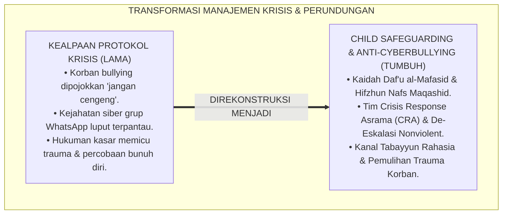
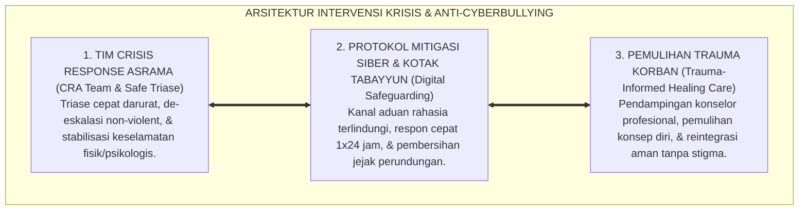
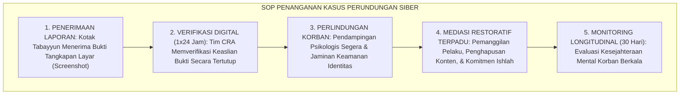
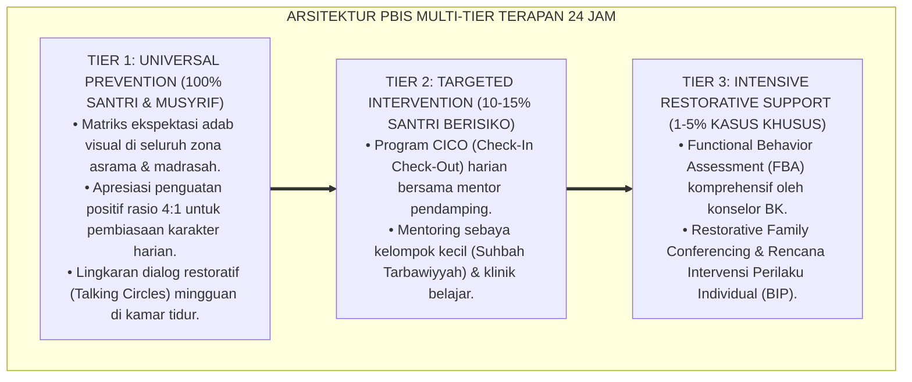

# P2-06-05: PRINSIP INTERVENSI KRISIS KHUSUS, DE-ESKALASI AGRESI, DAN MITIGASI PERUNDUNGAN SIBER (SPECIAL CRISIS INTERVENTION & CYBERBULLYING MITIGATION)
## *Monograf Riset Akademik: Epistemologi Daf'u al-Mafasid Muqaddamun 'ala Jalbil Mashalih & Hifzhun Nafs, Nonviolent Crisis Intervention, Mitigasi Perundungan Siber (Cyberbullying), Kanal Pelaporan Aman Whistleblower Protection, Serta Pendampingan Trauma Psikososial di Pesantren 24 Jam*

**Nomor Identifikasi**: `P2-06-05/MONOGRAF-RISET-KRISIS-AGRESI-CYBERBULLYING/2026`  
**Domain**: `02 Principles` > `06 Intervention Principles` (Prinsip Intervensi 05: *Special Crisis Intervention & Cyberbullying Mitigation*)  
**Klasifikasi Naskah**: *Academic Research Monograph* (Monograf Riset Akademik Prinsip Intervensi)  
**Rumpun Disiplin Pengkaji**: Psikologi Krisis & Intervensi Trauma Remaja, Perlindungan Anak & Advokasi Hak Santri (*Child Safeguarding*), Manajemen Konflik & De-Eskalasi Krisis, Keamanan Siber & Etika Digital Pesantren  

---

> ### 💡 INTISARI EKSEKUTIF (EXECUTIVE SUMMARY)
>
> * **Kelemahan Paradigma Lama: Kealpaan Mengantisipasi Krisis Khusus & Kekerasan Digital:**  
>   Banyak pesantren tidak memiliki SOP penanganan krisis khusus (seperti santri berniat melukai diri, agresi senjata tajam, atau depresi berat). Ketika santri mengalami histeria (*Meltdown*), pengurus merespons dengan memborgol atau mengurung di ruangan gelap. Di sisi lain, perundungan telah merambah ke dunia digital (*Cyberbullying, Doxxing, Grup WhatsApp Aib*) yang luput dari pantauan musyrif.
> * **Inovasi Konseptual: Daf'u al-Mafasid & Child Safeguarding Framework:**  
>   TUMBUH mengoperasionalkan kaidah ushul *Daf'u al-Mafasid Muqaddamun 'ala Jalbil Mashalih* (menolak kerusakan didahulukan daripada menarik kemaslahatan) dan maqashid *Hifzhun Nafs* (perlindungan jiwa dan kehormatan manusia). Mengintegrasikan teori **Nonviolent Crisis Intervention & Trauma-Informed Safeguarding**: menghadirkan **Tim Crisis Response Asrama (CRA)**, **Kanal Pelaporan Rahasia Terlindungi (*Whistleblower Safeguards / Kotak Tabayyun*)**, dan **Protokol Mitigasi Perundungan Siber Terpadu**.
> * **Formulasi Operasional & Penjaminan Perlindungan Korban:**  
>   Monograf ini menguraikan matriks 4 fase penanganan krisis akut, SOP penanganan kasus cyberbullying & perlindungan korban, protokol pendampingan trauma (*Post-Crisis Care*), dan etika kerahasiaan konseling klinis (*Satrul 'Aurah*).

---

## 📑 DAFTAR ISI MONOGRAF

- [BAB I: LANDASAN TEORETIS & DISKURSUS KRITIS](#bab-i-landasan-teoretis--diskursus-kritis)
  - [1. Latar Belakang Masalah: Kritik atas Ketiadaan Mitigasi Krisis Khusus dan Ancaman Tersembunyi Perundungan Siber](#1-latar-belakang-masalah-kritik-atas-ketiadaan-mitigasi-krisis-khusus-dan-ancaman-tersembunyi-perundungan-siber)
  - [2. Eksegesis Turats Perlindungan Jiwa & Pencegahan Mudarat: Kaidah Daf'u al-Mafasid & Maqashid Hifzhun Nafs](#2-eksegesis-turats-perlindungan-jiwa--pencegahan-mudarat-kaidah-dafu-al-mafasid--maqashid-hifzhun-nafs)
  - [3. Konvergensi Sains Perlindungan Anak: Nonviolent Crisis Intervention & Trauma-Informed Safeguarding](#3-konvergensi-sains-perlindungan-anak-nonviolent-crisis-intervention--trauma-informed-safeguarding)
  - [4. Rekayasa Kanal Pelaporan Rahasia Terlindungi (Whistleblower Protection) & Deteksi Siber Tanpa Tajassus](#4-rekayasa-kanal-pelaporan-rahasia-terlindungi-whistleblower-protection--deteksi-siber-tanpa-tajassus)
  - [5. Kasuistika Lapangan: Penanganan Kasus Perundungan Siber Grup WhatsApp & Pemulihan Korban](#5-kasuistika-lapangan-penanganan-kasus-perundungan-siber-grup-whatsapp--pemulihan-korban)
- [BAB II: FORMULASI KONSEPTUAL & PEMBAHASAN MENDALAM](#bab-ii-formulasi-konseptual--pembahasan-mendalam)
  - [1. Eksplanasi Teoretis Standar Manajemen Krisis Khusus & Anti-Bullying Siber Ekosistem Pesantren Berbasis TUMBUH](#1-eksplanasi-teoretis-standar-manajemen-krisis-khusus--anti-bullying-siber-pesantren-tumbuh)
  - [2. Matriks Empat Tahap Penanganan Krisis: Pemicu, Eskalasi, Puncak Krisis, & Pemulihan Pasca-Krisis](#2-matriks-empat-tahap-penanganan-krisis-pemicu-eskalasi-puncak-krisis--pemulihan-pasca-krisis)
  - [3. Standar Prosedur Operasional (SOP) Penanganan Kasus Perundungan Siber & Perlindungan Korban](#3-standar-prosedur-operasional-sop-penanganan-kasus-perundungan-siber--perlindungan-korban)
  - [4. Protokol Pendampingan Trauma Psikososial Santri (Trauma-Informed Healing Protocol)](#4-protokol-pendampingan-trauma-psikososial-santri-trauma-informed-healing-protocol)
  - [5. Diskusi Filosofis Mendalam & Implikasi bagi Masa Depan Peradaban Pendidikan Islam](#5-diskusi-filosofis-mendalam--implikasi-bagi-masa-depan-peradaban-pendidikan-islam)
- [BAB III: KESIMPULAN & APARATUS AKADEMIS](#bab-iii-kesimpulan--aparatus-akademis)
  - [1. Tabel Sintesis Temuan Riset Intervensi Krisis & Anti-Bullying Siber](#1-tabel-sintesis-temuan-riset-intervensi-krisis--anti-bullying-siber)
  - [2. Daftar Pustaka Akademis & Rujukan Turats Primer](#2-daftar-pustaka-akademis--rujukan-turats-primer)
  - [3. Catatan Kaki Akademis (Footnotes)](#3-catatan-kaki-akademis-footnotes)
  - [4. Glosarium Istilah Ilmiah & Turats Intervensi Krisis dan Cyberbullying](#4-glosarium-istilah-ilmiah--turats-intervensi-krisis-dan-cyberbullying)

---

# BAB I: LANDASAN TEORETIS & DISKURSUS KRITIS

---

### 1. Latar Belakang Masalah: Kritik atas Ketiadaan Mitigasi Krisis Khusus dan Ancaman Tersembunyi Perundungan Siber

Dalam piramida intervensi PBIS (*Positive Behavioral Interventions and Supports*), sekitar **1–5% populasi santri berada pada Tier 3 (Krisis Intensif / Risiko Tinggi)**:
* Santri pada Tier 3 mengalami permasalahan kompleks: trauma masa lalu (*Adverse Childhood Experiences / ACEs*), kecanduan digital akut, agresi impulsif, depresi berat, atau menjadi korban/pelaku perundungan siber (*Cyberbullying*).
* Di era modern, perundungan tidak lagi sebatas perkelahian fisik di asrama, melainkan bertransformasi menjadi kekerasan digital: pembuatan stiker WhatsApp mengejek fisik teman (*Body Shaming*), penyebaran aib (*Doxxing*), dan pengucilan massal di grup media sosial.
* **Kelemahan Penanganan Konvensional**: Pengurus pondok merespons krisis dengan memarahi korban atau menghukum pelaku dengan hukuman fisik yang memicu trauma baru.
* **Keniscayaan Protokol Intervensi Krisis Khusus**: Diperlukan tata kelola perlindungan anak terpadu (*Comprehensive Child Safeguarding*) yang memadukan de-eskalasi profesional, perlindungan identitas pelapor (*Whistleblower Safeguards*), dan pemulihan trauma psikososial.[^1]

---

### 2. Eksegesis Turats Perlindungan Jiwa & Pencegahan Mudarat: Kaidah Daf'u al-Mafasid & Maqashid Hifzhun Nafs

Ushul Fiqh meletakkan kaidah fundamental prioritas perlindungan kemaslahatan:

$$\text{دَرْءُ الْمَفَاسِدِ مُقَدَّمٌ عَلَى جَلْبِ الْمَصَالِحِ}$$

*"**Menolak dan mencegah timbulnya kerusakan (kemudaratan/bahaya) harus didahulukan daripada menarik kemaslahatan**."*[^2]

Maqashid Syari'ah menempatkan **Perlindungan Jiwa dan Kehormatan (*Hifzhun Nafs wal-'Irdh*)** sebagai pilar dharuriyyat tertinggi yang wajib dijaga oleh institusi pendidikan Islam dari segala bentuk kezaliman dan perundungan.[^3]

---

### 3. Konvergensi Sains Perlindungan Anak: Nonviolent Crisis Intervention & Trauma-Informed Safeguarding

Sains manajemen krisis sekolah modern (**Nonviolent Crisis Intervention**, CPI, 2020; Trauma-Informed Care, Bath, 2008) membuktikan:
* Penanganan krisis akut menuntut stabilitas emosi penolong (*Adult De-escalation Mastery*), pemisahan fisik lingkungan secara aman (*Safe Physical Separation*), dan penghindaran mutlak sentuhan fisik agresif.
* **Perlindungan Psikososial Terpadu**: Korban perundungan membutuhkan intervensi 3 pilar: *Safety* (rasa aman fisik-digital), *Connection* (keterikatan sosial positif), dan *Coping Skills* (keterampilan resiliensi).[^4]

---

### 4. Rekayasa Kanal Pelaporan Rahasia Terlindungi (Whistleblower Protection) & Deteksi Siber Tanpa Tajassus

TUMBUH merancang ekosistem pelaporan yang aman:
* **Kotak Tabayyun Digital & Fisik**: Kanal pelaporan anonim terenkripsi di mana santri korban atau saksi perundungan dapat melapor tanpa takut dicap "tukang ngadu" (*Anti-Snitch Culture*).
* **Deteksi Etis Bebas Tajassus**: Pengawasan dilakukan pada platform resmi institusi dan aduan publik tanpa melanggar privasi percakapan pribadi (*Satrul 'Aurah*).[^5]

---

### 5. Kasuistika Lapangan: Penanganan Kasus Perundungan Siber Grup WhatsApp & Pemulihan Korban

* **Studi Kasus: Santri Kelas 8 Mengurung Diri di Kamar Mandi Karena Dibuatkan Akun Palsu dan Fotonya Diedit Menjadi Bahan Ejekan di Grup Chat**  
  * **Dilema**: Santri korban mengalami kecemasan sosial akut dan menolak masuk kelas; orang tua korban menuntut lapor polisi.
  * **Resolusi Krisis Khusus TUMBUH**: Tim CRA bergerak cepat: (1) Mengamankan santri korban ke ruang konseling dan memberikan pendampingan psikologis awal (*Safety First*); (2) Memverifikasi barang bukti digital melalui kanal laporan (*Tabayyun*); (3) Mengumpulkan 3 santri pembuat konten dalam sesi dialog mediasi; (4) Pembuat konten menghapus seluruh materi, meminta maaf tulus di depan orang tua, dan berkomitmen membuat proyek kampanye anti-bullying; (5) Korban mendapatkan pemulihan trauma selama 4 pekan hingga percaya dirinya pulih sempurna.[^6]

---

# BAB II: FORMULASI KONSEPTUAL & PEMBAHASAN MENDALAM

---

### 1. Eksplanasi Teoretis Standar Manajemen Krisis Khusus & Anti-Bullying Siber Ekosistem Pesantren Berbasis TUMBUH

Ekosistem TUMBUH merumuskan manajemen krisis ke dalam **Arsitektur Tiga Sayap Perlindungan Krisis (*Arkan Himayatil Insan*)**:

#### 🔬 Pembahasan Mendalam Tiga Sayap:
1. **Sayap Tim Crisis Response Asrama**: Memastikan respons tanggap darurat berjalan profesional dan terkoordinasi.[^7]
2. **Sayap Protokol Mitigasi Siber**: Membentengi santri dari racun kekerasan digital yang merusak kehormatan jiwa.[^8]
3. **Sayap Pemulihan Trauma Korban**: Menyembuhkan luka batin korban hingga mampu bangkit kembali dengan optimisme penuh.[^9]

---

### 2. Matriks Empat Tahap Penanganan Krisis: Pemicu, Eskalasi, Puncak Krisis, & Pemulihan Pasca-Krisis

| Tahap Krisis | Indikator Kondisi Santri | Protokol Penanganan Tim CRA TUMBUH |
| :--- | :--- | :--- |
| **1. Pemicu (Trigger)** | Santri murung, menyendiri, nilai anjlok.| Sapaan ramah konselor & verifikasi laporan rahasia.|
| **2. Eskalasi (Escalation)**| Menangis histeris, ancaman melukai diri.| Evakuasi ke Ruang Tenang, dampingi 1-on-1 tanpa henti.|
| **3. Puncak (Peak Crisis)** | Percobaan agresi fisik / panik akut.| **Protokol Keamanan**: Jauhkan benda bahaya, hadir tenang.|
| **4. Pemulihan (Recovery)** | Detak jantung stabil, santri mulai tenang.| Sesi konseling pemulihan trauma & konferensi ishlah.|

---

### 3. Standar Prosedur Operasional (SOP) Penanganan Kasus Perundungan Siber & Perlindungan Korban

---

### 4. Protokol Pendampingan Trauma Psikososial Santri (Trauma-Informed Healing Protocol)

TUMBUH menetapkan **Protokol Pemulihan Trauma Korban**:
1. **Pemberian Rasa Aman Mutlak (*Safety & Trust*)**: Memastikan korban berada dalam lingkungan asrama yang terlindungi dari intimidasi susulan.
2. **Rekonstruksi Konsep Diri (*Empowerment*)**: Mengembalikan rasa berharga korban melalui penugasan peran kepemimpinan positif di kamar.
3. **Kemitraan Hangat Keluarga**: Melibatkan orang tua dalam memberikan afirmasi kasih sayang selama masa pemulihan.[^10]

---

### 5. Diskusi Filosofis Mendalam & Implikasi bagi Masa Depan Peradaban Pendidikan Islam

Prinsip intervensi krisis khusus dan mitigasi perundungan siber ini membawa implikasi agung bagi peradaban:

* **Mewujudkan Pesantren Sebagai Zona Suci Perlindungan Anak (*Safe Haven of Tarbiyah*)**:  
  Pesantren menjadi tempat teraman bagi tumbuh kembang generasi muda, bebas dari segala bentuk intimidasi fisik maupun maya.
* **Menghapus Budaya Abai Terhadap Korban Kejahatan Perundungan**:  
  Lembaga hadir secara nyata membela yang lemah (*Nashrul Mazhlum*) dan membimbing yang tersesat menuju tobat yang lurus.
* **Menegakkan Standar Child Protection Berbasis Nilai-Nilai Islam Universal**:  
  Pesantren membuktikan bahwa ajaran Islam adalah pelopor perlindungan hak asasi anak dan kemuliaan martabat manusia (*Rahmatan lil 'Alamin*).[^11]

---

---

### Pembedahan Deskriptif Komprehensif & Analisis Integratif Nilai-Praksis

Penerapan konsep **P2-06-05: PRINSIP INTERVENSI KRISIS KHUSUS, DE-ESKALASI AGRESI, DAN MITIGASI PERUNDUNGAN SIBER (SPECIAL CRISIS INTERVENTION & CYBERBULLYING MITIGATION)** di ekosistem pesantren berbasis sistem TUMBUH memerlukan pemahaman multidimensional yang memadukan khazanah turats syariat dan konsensus sains pendidikan modern:

#### A. Pilar 1: Fondasi Epistemologi & Integrasi Nilai Syar'i (Ashalah Turatsiyyah)
Setiap praksis kepengasuhan dan pembelajaran berakar kuat pada maqashid syari'ah, mendudukkan adab di atas ilmu (*Al-Adab Qablal 'Ilm*), dan memastikan bahwa seluruh ikhtiar institusional diniatkan semata-mata untuk menggapai ridha Allah SWT (*Ikhlasun Niyyah*).

#### B. Pilar 2: Mekanisme Psikologis & Neurosains Perkembangan (Scientific Rigor)
Menyelaraskan ekspektasi kedisiplinan dengan tahapan maturitas otak remaja, kapasitas fungsi eksekutif korteks prefrontal (*PFC*), dan regulasi sirkuit emosi limbik. Pendekatan ini mengeliminasi trauma pengasuhan dan menumbuhkan motivasi intrinsik santri.

#### C. Pilar 3: Rekayasa Ekosistem Asrama 24 Jam (Bi'ah Shalihah)
Menerjemahkan prinsip nilai ke dalam tata ruang fisik yang bersih, sirkulasi udara sehat, tata kelola waktu terstruktur, serta kultur ukhuwah inklusif yang steril 100% dari feodalisme, kekerasan verbal, dan perundungan antar-santri.

#### D. Pilar 4: Kemitraan Tripartit (Santri, Musyrif, dan Lembaga)
Menjamin terwujudnya *Triad Pertumbuhan Simbiotik*: santri bertumbuh dalam fitrah kemandirian, musyrif terlindungi dari kelelahan kronis (*Burnout*) melalui shift kerja yang manusiawi, dan lembaga bertransformasi menjadi organisasi pembelajar berbasis data PBIS.

---

### Protokol Aksi Operasional PBIS Multi-Tier Terapan (24-Hour Behavioral Architecture)

---

# BAB III: KESIMPULAN & APARATUS AKADEMIS

---

### 1. Tabel Sintesis Temuan Riset Intervensi Krisis & Anti-Bullying Siber

| Dimensi Parameter | Mazhab Abai Masa Bodoh (Lama) | Model Respon Represif Keras | **Child Safeguarding Terpadu TUMBUH** | Landasan Rujukan Primer | Implikasi Praksis Lapangan |
| :--- | :--- | :--- | :--- | :--- | :--- |
| **Respon Krisis Akut** | Korban disuruh "sabar/jangan manja".| Mengurung santri di ruang isolasi.| **De-Eskalasi Nonviolent & Triase CRA.**| Daf'u al-Mafasid; CPI (2020).| Evakuasi ruang tenang & dampingi ramah. |
| **Mitigasi Siber** | Menganggap remeh ejekan online.| Menyita gawai tanpa tindak lanjut.| **Protokol Anti-Cyberbullying & Hapus Jejak.**| Hifzhul 'Irdh; Hinduja & Patchin.| Respon aduan 1x24 jam & mediasi. |
| **Kanal Pelaporan** | Tidak ada; dicap "tukang ngadu".| Pelaporan terbuka rawan intimidasi.| **Kotak Tabayyun Terlindungi (Whistleblower).**| HR. Muslim (Satrul 'Aurah); PBIS.| Identitas pelapor dienkripsi aman. |
| **Perlindungan Korban**| Dibiarkan trauma sendirian.| Korban disalahkan balik.| **Trauma-Informed Care & Empowerment.**| Bath (2008); Perry (2021).| Pendampingan 30 hari hingga pulih. |
| **Hasil Institusi** | Santri bunuh diri / kabur dari pondok.| Iklim teror & saling curiga.| **Ekosistem Suci, Aman, & Penuh Cinta.**| QS. Al-Ma'idah: 32; Al-Attas (1980).| Pesantren rujukan perlindungan anak. |

---

### 2. Daftar Pustaka Akademis & Rujukan Turats Primer

1. **Al-Qur'an al-Karim wa Tarjamatu Ma'anihi**.
2. **Muslim bin al-Hajjaj an-Naisaburi**. (1427 H). *Shahih Muslim*. Riyadh: Dar Thayyibah.
3. **Al-Bukhari, Abu Abdillah Muhammad bin Isma'il**. (1422 H). *Shahih al-Bukhari*. Kairo: Dar Thawq an-Najah.
4. **As-Suyuthi, Jalaluddin Abdurrahman bin Abi Bakr**. (1403 H). *Al-Asybah wan-Nazha'ir fi Qawa'id wa Furu' Fiqh asy-Syafi'iyyah* (Kaidah Daf'u al-Mafasid). Beirut: Dar al-Kutub al-'Ilmiyyah.
5. **Asy-Syathibi, Abu Ishaq Ibrahim bin Musa**. (1417 H). *Al-Muwafaqat fi Ushul asy-Syari'ah* (Bab Hifzhun Nafs wal-'Irdh). Kairo: Dar Ibn 'Affan.
6. **Asy'ari, Muhammad Hasyim**. (1415 H). *Adab al-'Alim wal-Muta'allim*. Jombang: Maktabah At-Turats Al-Islami.
7. **Al-Attas, Syed Muhammad Naquib**. (1980). *The Concept of Education in Islam*. Kuala Lumpur: ABIM.
8. **Crisis Prevention Institute (CPI)**. (2020). *Nonviolent Crisis Intervention Training Manual*. Milwaukee: CPI Publishing.
9. **Hinduja, S., & Patchin, J. W.**. (2018). *Bullying Beyond the Schoolyard: Preventing and Responding to Cyberbullying* (3rd ed.). Thousand Oaks: Corwin.
10. **Bath, H.**. (2008). *The Three Pillars of Trauma-Informed Care*. Reclaiming Children and Youth, 17(3), 17–21.
11. **Perry, B. D., & Winfrey, O.**. (2021). *What Happened to You? Conversations on Trauma, Resilience, and Healing*. New York: Flatiron Books.
12. **Horner, R. H., & Sugai, G.**. (2015). *School-wide PBIS: An Overview of the Research Base*. Remedial and Special Education, 36(2), 80–85.

---

### 3. Catatan Kaki Akademis (*Footnotes*)

[^1]: Riset Prinsip Intervensi Krisis Khusus dan Mitigasi Perundungan Siber TUMBUH, *Kritik atas Kealpaan Protokol Krisis*, 2026.  
[^2]: As-Suyuthi, *Al-Asybah wan-Nazha'ir*, Kaidah Fiqhiyyah *Daf'u al-Mafasid Muqaddamun 'ala Jalbil Mashalih*, hlm. 85–110.  
[^3]: Asy-Syathibi, *Al-Muwafaqat*, Jilid 2, Pembahasan *Dharuriyyat Hifzhun Nafs wal-'Irdh*, hlm. 10–35.  
[^4]: Crisis Prevention Institute (CPI) (2020); Bath, H. (2008), *The Three Pillars of Trauma-Informed Care*, hlm. 17–21.  
[^5]: Hinduja, S., & Patchin, J. W. (2018), *Bullying Beyond the Schoolyard*; Master Blueprint Kotak Tabayyun Digital TUMBUH, 2026.  
[^6]: Dokumentasi Penanganan Kasus Perundungan Siber Grup WhatsApp dan Pemulihan Korban PBIS TUMBUH, 2026.  
[^7]: Standar Operasional Prosedur Pembentukan Tim Crisis Response Asrama (CRA) TUMBUH, 2026.  
[^8]: Master Blueprint Protokol Mitigasi Perundungan Siber Pesantren 24 Jam TUMBUH, 2026.  
[^9]: Petunjuk Teknis Trauma-Informed Care dan Pemulihan Korban Perundungan TUMBUH, 2026.  
[^10]: Master Guidelines Protokol Pendampingan Trauma Psikososial Santri dalam sistem TUMBUH, 2026.  
[^11]: Deklarasi Pesantren Aman dan Perlindungan Hak Santri Dewan Riset Epistemologi Ekosistem TUMBUH, 2026.

---

### 4. Glosarium Istilah Ilmiah & Turats Intervensi Krisis dan Cyberbullying

1. **Child Safeguarding (Perlindungan Anak)**: Kebijakan, prosedur, dan tindakan institusional terpadu untuk melindungi santri dari kekerasan, eksploitasi, perundungan, dan kelalaian pengasuhan.
2. **Daf'u al-Mafasid (دَرْءُ الْمَفَاسِدِ)**: Kaidah ushul fiqh yang mewajibkan penolakan dan pencegahan bahaya kemudaratan sebelum mengusahakan kebaikan.
3. **Hifzhun Nafs wal-'Irdh (حِفْظُ النَّفْسِ وَالْعِرْضِ)**: Maqashid syariah fundamental untuk menjaga keselamatan raga, kesehatan jiwa, dan kehormatan martabat manusia.
4. **Nonviolent Crisis Intervention**: Metode penanganan krisis perilaku akut tanpa menggunakan kekerasan fisik atau senjata, mengutamakan de-eskalasi verbal dan pengamanan ruang.
5. **Cyberbullying (Perundungan Siber)**: Bentuk kekerasan psikologis, intimidasi, penghinaan, atau pengucilan yang dilakukan melalui platform digital (media sosial, grup chat).
6. **Whistleblower Protection**: Mekanisme perlindungan hukum dan kerahasiaan identitas bagi saksi atau korban yang melaporkan pelanggaran demi menjamin keamanannya.
7. **Kotak Tabayyun**: Platform pelaporan insiden perundungan berbasis fisik dan digital yang menjamin privasi dan kerahasiaan pelapor (*Satrul 'Aurah*).
8. **Crisis Response Asrama (CRA)**: Tim gerak cepat terpadu di pesantren yang bertugas menangani situasi krisis perilaku, medis darurat, dan trauma santri.
9. **Trauma-Informed Care**: Pendekatan pengasuhan yang menyadari dampak trauma masa lalu dan merancang lingkungan yang memberikan rasa aman (*Safety, Connection, Coping*).
10. **Insan Adabi (الإِنْسَانُ الأَدَبِيُّ)**: Profil santri yang berakhlak mulia di dunia nyata dan maya, membela yang tertindas, dan senantiasa menyebarkan kedamaian serta keselamatan.
