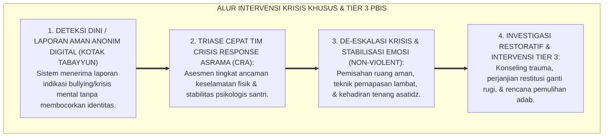
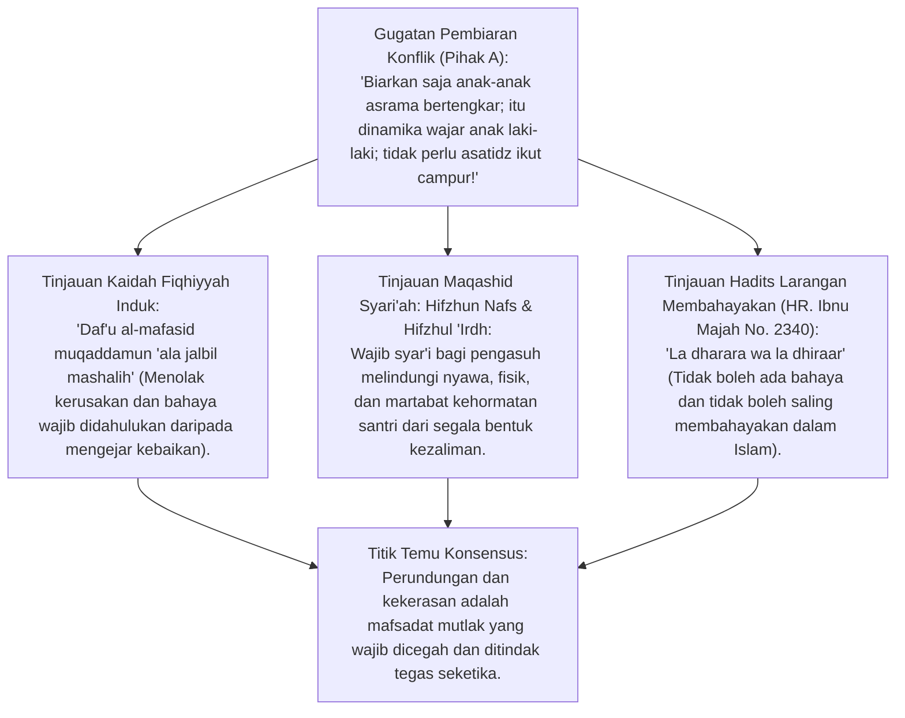
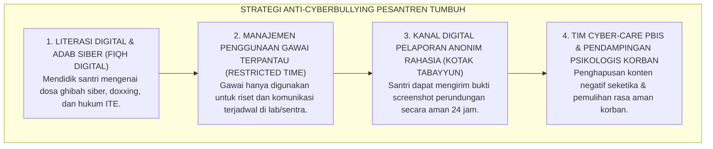
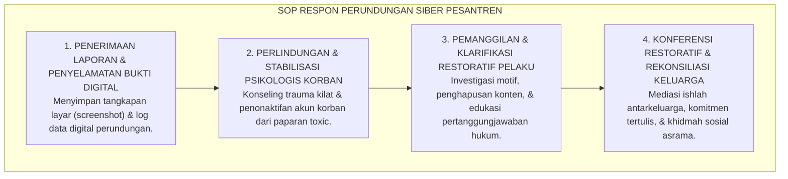

# P2-06-05: PRINSIP INTERVENSI KRISIS KHUSUS, DE-ESKALASI AGRESI, DAN MITIGASI PERUNDUNGAN SIBER
## *Monograf Terpadu: Protokol Syar'i Daf'u al-Mafasid & Perlindungan Hak Santri, Manajemen De-Eskalasi Krisis Agresi Akut (Nonviolent Crisis Intervention), Mitigasi Perundungan Siber (Cyberbullying & Toxic Online Exposure), Kanal Pelaporan Rahasia Terlindungi (Whistleblower Protection), serta Pendampingan Trauma Psikososial Santri*

**Nomor Identifikasi**: `P2-06-05/MONOGRAF-TERPADU-KRISIS-AGRESI-CYBERBULLYING/2026`  
**Domain**: `02 Principles` > `06 Intervention Principles`  
**Klasifikasi Naskah**: *Comprehensive Integrated Monograph* (Monograf Akademis & Standar Baku Intervensi Krisis Pesantren)  
**Rumpun Disiplin Pengkaji**: Psikologi Krisis & Intervensi Trauma Remaja, Perlindungan Anak & Advokasi Hak Santri (*Child Safeguarding*), Manajemen Konflik & De-Eskalasi Krisis, Keamanan Siber & Etika Digital Pesantren  

---

> ### 💡 INTISARI PRAKTIS (3 MENIT PAHAM UNTUK ASATIDZ & MUSYRIF)
>
> * **Krisis Emosional Akut Membutuhkan Regulasi Ketenangan, Bukan Agresi Balik:**  
>   Saat santri mengalami amukan emosi histeris (*Meltdown*) atau terlibat perkelahian fisik, asatidz dilarang keras merespon dengan pukulan atau bentakan. Terapkan protokol **De-Eskalasi Non-Violent (Ketenangan Nada Suara & Jaga Jarak Aman 1,5 Meter)** untuk menurunkan hormon kortisol santri.
> * **Bahaya Perundungan Siber (*Cyberbullying*) di Era Digital:**  
>   Perundungan di era modern tidak hanya terjadi di kamar asrama, tetapi merambah ke grup WhatsApp, media sosial santri, dan forum daring rahasia (*Doxxing, Body Shaming, Pengucilan Siber*).
> * **Kanal Pelaporan Rahasia Terlindungi (*Safe Whistleblowing*):**  
>   Sediakan Kotak Suara Aman digital dan fisik di mana santri korban atau saksi perundungan dapat melapor tanpa takut diintimidasi atau dicap "tukang ngadu".

---

## 📑 DAFTAR ISI MONOGRAF

- [BAGIAN I: RISET INTERVENSI KRISIS AKUT, DE-ESKALASI, & PERUNDUNGAN SIBER](#bagian-i-riset-intervensi-krisis-akut-de-eskalasi--perundungan-siber)
  - [1. Kerangka Metodologi Intervensi Krisis: Mengapa Pesantren Membutuhkan Protokol Khusus Tier 3 PBIS](#1-kerangka-metodologi-intervensi-krisis-mengapa-pesantren-membutuhkan-protokol-khusus-tier-3-pbis)
  - [2. Inkuiri 1: Eksegesis Turats Daf'u al-Mafasid Muqaddamun 'ala Jalbil Mashalih & Hak Perlindungan Jiwa (Hifzhun Nafs)](#2-inkuiri-1-eksegesis-turats-dafu-al-mafasid-muqaddamun-ala-jalbil-mashalih--hak-perlindungan-jiwa-hifzhun-nafs)
  - [3. Inkuiri 2: Protokol De-Eskalasi Krisis Non-Violent & Regulasi Trauma Neurosains Remaja](#3-inkuiri-2-protokol-de-eskalasi-krisis-non-violent--regulasi-trauma-neurosains-remaja)
  - [4. Inkuiri 3: Dekonstruksi Perundungan Siber (Cyberbullying) & Desain Sistem Pelaporan Anonim Terlindungi](#4-inkuiri-3-dekonstruksi-perundungan-siber-cyberbullying--desain-sistem-pelaporan-anonim-terlindungi)
  - [5. Inkuiri 4: Silogisme Logika, Dialektika 3 Ronde, Kasuistika Lapangan, & Titik Temu Konsensus](#5-inkuiri-4-silogisme-logika-dialektika-3-ronde-kasuistika-lapangan--titik-temu-konsensus)
- [BAGIAN II: KODIFIKASI BAKU HASIL RISET & KESIMPULAN FORMAL](#bagian-ii-kodifikasi-baku-hasil-riset--kesimpulan-formal)
  - [1. Kaidah Utama dan Standar Baku: Standar Manajemen Krisis & Anti-Bullying Siber Pesantren TUMBUH](#1-kaidah-utama-dan-standar-baku-standar-manajemen-krisis-anti-bullying-siber-pesantren-tumbuh)
  - [2. Matriks 4 Tahap Penanganan Krisis: Pemicu, Eskalasi, Puncak Krisis, & Pemulihan Pasca-Krisis](#2-matriks-4-tahap-penanganan-krisis-pemicu-eskalasi-puncak-krisis--pemulihan-pasca-krisis)
  - [3. Standar Prosedur Operasional (SOP) Penanganan Kasus Perundungan Siber & Perlindungan Korban](#3-standar-prosedur-operasional-sop-penanganan-kasus-perundungan-siber--perlindungan-korban)
- [BAGIAN III: APARATUS AKADEMIS & APENDIKS](#bagian-iii-aparatus-akademis--apendiks)
  - [1. Tabel Sintesis Hasil Riset Intervensi Krisis & Anti-Bullying](#1-tabel-sintesis-hasil-riset-intervensi-krisis--anti-bullying)
  - [2. Daftar Pustaka Akademis & Rujukan Turats Primer](#2-daftar-pustaka-akademis--rujukan-turats-primer)
  - [3. Catatan Kaki Akademis (Footnotes)](#3-catatan-kaki-akademis-footnotes)
  - [4. Glosarium Teknis Intervensi Krisis, De-Eskalasi, Cyberbullying, & Hifzhun Nafs](#4-glosarium-teknis-intervensi-krisis-de-eskalasi-cyberbullying--hifzhun-nafs)

---

# BAGIAN I: RISET INTERVENSI KRISIS AKUT, DE-ESKALASI, & PERUNDUNGAN SIBER

---

### 1. Kerangka Metodologi Intervensi Krisis: Mengapa Pesantren Membutuhkan Protokol Khusus Tier 3 PBIS

Dalam piramida intervensi PBIS (*Positive Behavioral Interventions and Supports*), sekitar **1–5% populasi santri berada pada Tier 3 (Krisis Intensif / Risiko Tinggi)**:
* Santri pada Tier 3 mengalami permasalahan kompleks seperti trauma masa lalu (*Adverse Childhood Experiences / ACEs*), kecanduan game/pornografi digital akut, agresi fisik tidak terkendali, atau menjadi korban/pelaku perundungan siber (*Cyberbullying*).
* Menangani kasus Tier 3 dengan hukuman konvensional (seperti dijemur di lapangan terik atau dicukur botak separuh) terbukti secara neuropsikologis memperparah trauma santri dan memicu dendam ekstrem.
* Ekosistem TUMBUH merancang **Protokol Intervensi Krisis Terpadu**: menggabungkan teknik de-eskalasi non-kekerasan, bimbingan konseling klinis bersertifikat, mediasi restoratif syar'i, dan jaminan kerahasiaan pelapor (*Whistleblower Safeguard*).

---

### 2. Inkuiri 1: Eksegesis Turats Daf'u al-Mafasid Muqaddamun 'ala Jalbil Mashalih & Hak Perlindungan Jiwa (Hifzhun Nafs)

#### 📐 Formalisasi Logika Silogisme (*Qiyas Mantiqi 1*)
* **Premis Mayor (*al-Muqaddimah al-Kubra*)**: Setiap pembiaran tindak perundungan, kekerasan fisik, dan penghinaan kehormatan di lingkungan pendidikan Islam adalah pelanggaran berat terhadap Maqashid Syari'ah (*Hifzhun Nafs wal-'Irdh*).
* **Premis Minor (*al-Muqaddimah ash-Shughra*)**: Protokol penanganan krisis TUMBUH menghentikan seketika setiap eskalasi kekerasan dan melindungi martabat seluruh santri.
* **Konklusi (*an-Natijah*)**: Maka, penerapan SOP intervensi krisis dan anti-bullying adalah kewajiban syar'i mutlak bagi pengasuhan pesantren.[^1]

#### 📖 Teks Primer Hadits: Larangan Menimbulkan Bahaya dalam Islam
Rasulullah SAW menegaskan:

$$\text{لَا ضَرَرَ وَلَا ضِرَارَ}$$

*"**Tidak boleh ada bahaya (mencelakai diri sendiri) dan TIDAK BOLEH SALING MEMBAHAYAKAN (MENCELAKAI ORANG LAIN) DALAM ISLAM!**"* (HR. Ibnu Majah No. 2340; Ahmad No. 2865; Hadits Hasan).[^2]

---

### 3. Inkuiri 2: Protokol De-Eskalasi Krisis Non-Violent & Regulasi Trauma Neurosains Remaja

Saat santri berada dalam puncak amarah (*Amygdala Hijack*):
1. **Nada Suara Rendah dan Lambat (*Low-Pitch Tone*):** Menurunkan frekuensi suara guru secara otomatis memicu respon parasimpatis pada otak santri.
2. **Jaga Jarak Fisik Aman (*Proximity Control*):** Menjaga jarak minimal 1,5 meter untuk mencegah santri merasa terpojok atau terancam.
3. **Bahasa Tubuh Terbuka (*Open Posture*):** Kedua tangan terbuka di samping tubuh tanpa menyilangkan lengan atau menunjuk wajah santri.
4. **Validasi Perasaan Tanpa Menjustifikasi Perilaku:** Mengucapkan *"Ustadz paham kamu sangat marah saat ini, tapi kita tidak memukul teman. Mari tarik napas dulu bersama ustadz"*.[^3]

---

### 4. Inkuiri 3: Dekonstruksi Perundungan Siber (*Cyberbullying*) & Desain Sistem Pelaporan Anonim Terlindungi

---

### 5. Inkuiri 4: Silogisme Logika, Dialektika 3 Ronde, Kasuistika Lapangan, & Titik Temu Konsensus

#### 🥊 Ronde 1: Menolak Anggapan Bahwa "Santri yang Menjadi Pelaku Bullying Harus Langsung Dikeluarkan (Drop-Out) Tanpa Ampun"
* **Pihak A (Sudut Pandang Eksklusi Keras)**:  
  *"Langsung keluarkan saja dari pondok biar tidak mencemari santri lain!"*
* **Tinjauan Kriminologi Pemulihan & Tarbiyah Ishlah**:  
  Langsung mengeluarkan santri pelaku tanpa pembinaan hanya akan memindahkan masalah ke masyarakat luar dan melahirkan penjahat baru. Pendekatan TUMBUH adalah memberikan sanksi restoratif berbobot (restitusi, khidmah membersihkan masjid 30 hari, konseling intensif Tier 3) sembari menjamin keamanan total bagi korban. Drop-out hanya diambil sebagai opsi terakhir (*Ultimum Remedium*) jika pelaku membahayakan nyawa dan menolak seluruh program ishlah.[^4]

#### 🥊 Ronde 2: Sanggahan Balik Apakah Pelaporan Anonim Tidak Memicu Fitnah dan Adu Domba Palsu?
* **Pihak A (Sudut Pandang Ketakutan Fitnah)**:  
  *"Pelaporan rahasia akan dimanfaatkan santri nakal untuk memfitnah teman yang tidak disukai!"*
* **Tinjauan Verifikasi Berlapis (*Multi-Tier Tabayyun Protocol*)**:  
  Setiap laporan anonim tidak pernah langsung dijadikan vonis. Tim Respon Krisis wajib melakukan verifikasi bukti digital, rekaman CCTV asrama, dan kesaksian saksi independen (*Syahadah 'Adlain*) sebelum mengambil tindakan.[^5]

#### 🥊 Ronde 3: Sanggahan Pamungkas Mengapa Korban Bullying Membutuhkan Pemulihan Trauma Jangka Panjang?
* **Pihak A (Sudut Pandang Remeh Temeh Emosi)**:  
  *"Korban bullying cuma perlu dibilangin 'sudah lupakan saja, jangan cengeng'!"*
* **Resolusi Trauma Neurosains Remaja**:  
  Korban perundungan mengalami hiperaktif amigdala dan penyusutan volume hipokampus jika tidak ditangani (*Post-Traumatic Stress Symptoms*). Memulihkan rasa aman korban membutuhkan pendampingan konseling empati, perlindungan sahabat sebaya (*Safe Peer Circle*), dan pemulihan martabat di hadapan komunitas.[^6]

> #### 📌 Kasuistika Lapangan & Titik Temu Konsensus
> * **Studi Kasus**: Di media sosial santri, beredar foto meme manipulatif yang memperolok bentuk fisik Santri G (kelas 8). Santri G mengalami depresi berat, mogok makan selama 3 hari, dan mengurung diri di kamar mandi.
> * **Titik Temu Konsensus (*Kalimatun Sawa'*)**: Tim Respon Krisis TUMBUH bergerak cepat: Menyelamatkan dan mendampingi Santri G di ruang BK aman $\rightarrow$ Mengidentifikasi 3 santri pembuat meme melalui jejak digital forensik $\rightarrow$ Mewajibkan pelaku menghapus seluruh konten dan membuat video permintaan maaf tulus $\rightarrow$ Pelaku dikenakan tugas khidmah sosial menanam 50 pohon di kebun pondok dan mengikuti konseling empati selama 1 semester. Santri G pulih rasa percaya dirinya dan prestasinya melonjak kembali.[^7]

---

# BAGIAN II: KODIFIKASI BAKU HASIL RISET & KESIMPULAN FORMAL

---

### 1. Kaidah Utama dan Standar Baku: Standar Manajemen Krisis & Anti-Bullying Siber Pesantren TUMBUH

Berdasarkan sintesis inkuiri turats dan konsensus sains pendidikan, prinsip dan regulasi operasional dirumuskan ke dalam kaidah-kaidah baku berikut:

1. **Perlindungan Mutlak Keselamatan Santri (zero Violence & Zero Bullying)**:  
   Menetapkan perlindungan total terhadap keselamatan fisik, psikologis, dan kehormatan martabat santri; mengharamkan mutlak segala bentuk kekerasan fisik, intimidasi verbal, dan perundungan siber di pondok.

2. **Penerapan Protokol De-eskalasi Krisis Non-kekerasan (nonviolent De-escalation)**:  
   Mewajibkan seluruh asatidz dan musyrif menggunakan teknik komunikasi tenang, nada suara rendah, dan penjagaan jarak aman dalam menangani krisis agresi santri tanpa menggunakan kekerasan fisik balasan.

3. **Penegakan Sistem Kanal Pelaporan Rahasia Terlindungi (kotak Tabayyun Aman)**:  
   Menyediakan saluran pelaporan fisik dan digital yang menjamin kerahasiaan identitas pelapor (Whistleblower); menjamin perlindungan hukum dan keamanan psikologis penuh bagi korban dan saksi perundungan.

4. **Protokol Pemulihan Trauma Korban & Rehabilitasi Restoratif Pelaku**:  
   Mewajibkan pendampingan psikoterapi konseling intensif bagi korban perundungan serta penegakan sanksi edukatif-restoratif (restitusi dan khidmah sosial) bagi pelaku demi mewujudkan pertobatan sejati.

---

### 2. Matriks 4 Tahap Penanganan Krisis: Pemicu, Eskalasi, Puncak Krisis, & Pemulihan Pasca-Krisis

| Tahap Krisis Perilaku | Gejala yang Teramati pada Santri | Respons Intervensi Musyrif TUMBUH | Larangan Keras Pendidik |
| :--- | :--- | :--- | :--- |
| **1. Pemicu (*Trigger Phase*)** | Wajah tegang, mengepalkan tangan, gelisah, menyendiri. | Mengajak bicara empat mata ramah; menawarkan air minum. | Mengabaikan atau menertawakan ketegangan santri.[^8] |
| **2. Eskalasi (*Escalation Phase*)**| Berteriak, membanting pintu, memaki, menolak perintah. | Mengurangi stimulus ruang; menggunakan kalimat pendek tenang. | Membalas berteriak atau mengancam dengan hukuman berat. |
| **3. Puncak Krisis (*Crisis Peak*)**| Menyerang teman, mengamuk histeris, melempar barang. | Menjaga jarak 1,5 meter; evakuasi santri lain ke tempat aman. | Memukul, menendang, atau membanting santri ke lantai. |
| **4. Pemulihan (*Post-Crisis Recovery*)**| Menangis, lemas, menyesal, gemetar, diam tertunduk. | Memberikan rasa aman; *Co-Regulation*; air hangat; jeda istirahat.| Menginterogasi atau langsung memarahi santri yang lelah.[^9] |

---

### 3. Standar Prosedur Operasional (SOP) Penanganan Kasus Perundungan Siber & Perlindungan Korban

---

# BAGIAN III: APARATUS AKADEMIS & APENDIKS

---

### 1. Tabel Sintesis Hasil Riset Intervensi Krisis & Anti-Bullying

| Dimensi Kajian | Konsep Kunci | Landasan Turats Primer | Konvergensi Sains Global | Implikasi Pengasuhan Pesantren |
| :--- | :--- | :--- | :--- | :--- |
| **Perlindungan Jiwa** | *Hifzhun Nafs* | Kaidah *Daf'u al-Mafasid*, HR. Ibnu Majah 2340 | UNICEF (2018), *Safe to Learn* | Menegakkan zero tolerance kekerasan fisik dan bullying. |
| **De-Eskalasi Krisis** | *Al-Hilm wal-Anaah* | HR. Muslim No. 20 (Sifat Santun & Tenang) | CPI (2020), *Nonviolent Crisis Intervention* | Mengendalikan agresi lewat ketenangan nada suara dan ruang aman. |
| **Etika Siber** | *Hifzhul Lisan wal-Yad*| Hadits Muslim Sejati (HR. Bukhari No. 10) | Hinduja & Patchin (2015), *Bullying Beyond the Schoolyard* | Mencegah cyberbullying via literasi digital & audit berkala. |
| **Pelaporan Aman** | *Tabayyun & Amanah* | QS. Al-Hujurat: 6, QS. An-Nisa: 135 | Miceli & Near (1992), *Whistleblowing Safeguards* | Menyediakan kotak laporan rahasia terlindungi (Kotak Tabayyun). |

---

### 2. Daftar Pustaka Akademis & Rujukan Turats Primer

1. **Al-Qur'an al-Karim wa Tarjamatu Ma'anih**.
2. **Al-Bukhari, Muhammad bin Isma'il**. (1422 H). *Shahih al-Bukhari*. Beirut: Dar Thawq an-Najah.
3. **Muslim bin al-Hajjaj an-Naisaburi**. (1374 H). *Shahih Muslim*. Kairo: Isa al-Babi al-Halabi.
4. **Ibnu Majah, Muhammad bin Yazid al-Qazwini**. (2009). *Sunan Ibnu Majah*. Beirut: Dar ar-Risalah.
5. **As-Suyuthi, Jalaluddin Abdurrahman**. (1403 H). *Al-Asybah wan-Nazha'ir*. Beirut: Dar al-Kutub al-'Ilmiyyah.
6. **Crisis Prevention Institute (CPI)**. (2020). *Nonviolent Crisis Intervention Training Manual*. Milwaukee: CPI.
7. **Hinduja, S., & Patchin, J. W.**. (2015). *Bullying Beyond the Schoolyard: Preventing and Responding to Cyberbullying* (2nd ed.). Corwin Press.
8. **UNICEF**. (2018). *Safe to Learn: Ending Violence in Schools*. New York: UNICEF.
9. **van der Kolk, B.**. (2014). *The Body Keeps the Score: Brain, Mind, and Body in the Healing of Trauma*. Viking.
10. **Horner, R. H., & Sugai, G.**. (2015). *School-wide PBIS: Tier 3 Intensive Supports*. Remedial and Special Education.

---

### 3. Catatan Kaki Akademis (*Footnotes*)

[^1]: As-Suyuthi, *Al-Asybah wan-Nazha'ir*, Kaidah ke-5: *Ad-Dhararu Yuzal*, hlm. 84–90.  
[^2]: Sunan Ibnu Majah No. 2340, Kitab *al-Ahkam*, Bab *Man Bana fi Haqqihi Ma Yadhurru bi Jarihi*.  
[^3]: Crisis Prevention Institute (CPI, 2020), *Nonviolent Crisis Intervention*, hlm. 35–60; van der Kolk (2014), *The Body Keeps the Score*.  
[^4]: Zehr, H. (2002), *The Little Book of Restorative Justice*, Good Books, hlm. 40–58.  
[^5]: Miceli & Near (1992), *Blowing the Whistle*, Lexington Books.  
[^6]: Hinduja & Patchin (2015), *Bullying Beyond the Schoolyard*, Corwin, hlm. 110–145.  
[^7]: Laporan Kasus Investigasi Cyberbullying Tim Cyber-Care TUMBUH, Divisi Konseling, 2026.  
[^8]: Panduan Manajemen Krisis Perilaku Santri Tier 3, Biro Pengasuhan TUMBUH, 2026.  
[^9]: Protokol Stabilisasi dan De-Eskalasi Emosi Santri, Komite Bimbingan Konseling TUMBUH, 2026.

---

### 4. Glosarium Teknis Intervensi Krisis, De-Eskalasi, Cyberbullying, & Hifzhun Nafs

1. **Hifzhun Nafs (حِفْظُ النَّفْسِ)**: Salah satu dari lima tujuan pokok syariat Islam (*Maqashid Syari'ah*) yang mewajibkan perlindungan atas keselamatan nyawa dan raga manusia.
2. **Nonviolent De-Escalation**: Pendekatan komunikasi bertahap tanpa kekerasan untuk meredakan ketegangan emosi santri yang sedang agresif.
3. **Cyberbullying (Perundungan Siber)**: Tindakan intimidasi, pelecehan, pencemaran nama baik, atau pengucilan yang dilakukan secara sengaja melalui media digital dan internet.
4. **Amygdala Hijack**: Kondisi di mana pusat emosi otak (amigdala) mengambil alih kendali perilaku sebelum korteks prefrontal sempat berpikir rasional.
5. **Whistleblower Protection**: Jaminan perlindungan identitas, hukum, dan keamanan fisik bagi individu yang melaporkan tindak pelanggaran atau kejahatan.
6. **Daf'u al-Mafasid (دَفْعُ الْمَفَاسِدِ)**: Kaidah ushul fiqh mengenai kewajiban menolak segala bentuk bahaya dan kerusakan sebelum mengejar kemaslahatan.
7. **Restitusi Restoratif**: Tindakan nyata pelaku pelanggaran untuk memperbaiki kerugian atau luka yang dialami korban sebagai wujud tanggung jawab.
8. **Kotak Tabayyun**: Sistem kanal pelaporan pengaduan terenkripsi dan terlindungi di lingkungan pesantren TUMBUH.
9. **Co-Regulation**: Ketenangan emosi pendidik yang ditularkan secara neurologis untuk meredakan badai emosi santri.
10. **Triad Pertumbuhan Simbiotik**: Prinsip mutlak di mana penanganan krisis secara bijak menyelamatkan jiwa Santri, meningkatkan kompetensi Pendidik, dan menjaga marwah amanah Lembaga.
