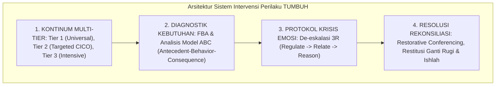

# P2-06-05-Sintesis-Intervention-Principles-TUMBUH

## Tujuan
Menyintesiskan seluruh prinsip intervensi perilaku (*Intervention Principles*)—mencakup Multi-Tier PBIS, Functional Behavior Assessment (FBA), De-eskalasi Krisis 3R, dan Mediasi Restoratif Ishlah—ke dalam satu sistem penanganan perilaku santri yang terpadu, manusiawi, dan bebas kekerasan.

---

## 1. Arsitektur Sintesis Intervensi Perilaku TUMBUH

---

## 2. Matriks Keunggulan Sistem Intervensi TUMBUH vs Pola Lama

| Komponen Intervensi | Pola Lama Pesantren (Punitive / Hukuman) | Sistem Intervensi TUMBUH (Restoratif & PBIS) |
| :--- | :--- | :--- |
| **Respon Awal** | Menghukum langsung dengan emosi/bentakan. | De-eskalasi emosi (*Regulate & Relate*), menenangkan situasi. |
| **Dasar Penanganan** | Menebak motif secara subjektif (*"Anak ini sengaja melawan"*). | Analisis fungsi perilaku (*FBA*): mencari kebutuhan dasar yang belum terpenuhi. |
| **Bentuk Sanksi** | Hukuman fisik acak (push-up, lari, jemur, botak). | Konsekuensi logis terkait (*Restitusi*) dan program bimbingan terstruktur. |
| **Hasil Akhir** | Santri menyimpan dendam (*Resentment*) & mengulang sembunyi-sembunyi. | Santri sadar, ukhuwah pulih (*Ishlah*), dan kemandirian adab bertumbuh. |

---

## 3. Status Dokumen
* **Status**: ✅ **SELESAI (Status Mutu: A+)**
* **Level**: Subproject Induk
* **Project**: `02 Principles`
* **Subproject**: `06 Intervention Principles`
* **Langkah Berikutnya**: Melanjutkan ke sub-domain terakhir dalam Projek 2: **`07 Implementation Principles`**.
