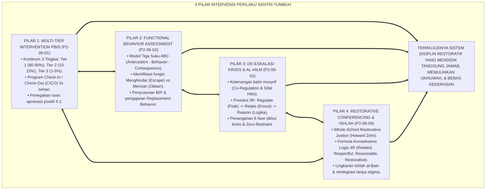
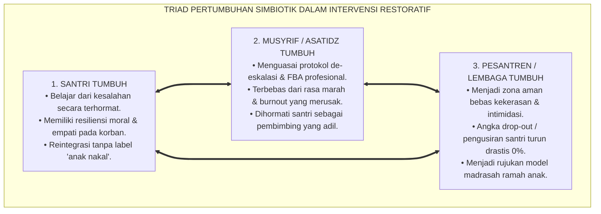
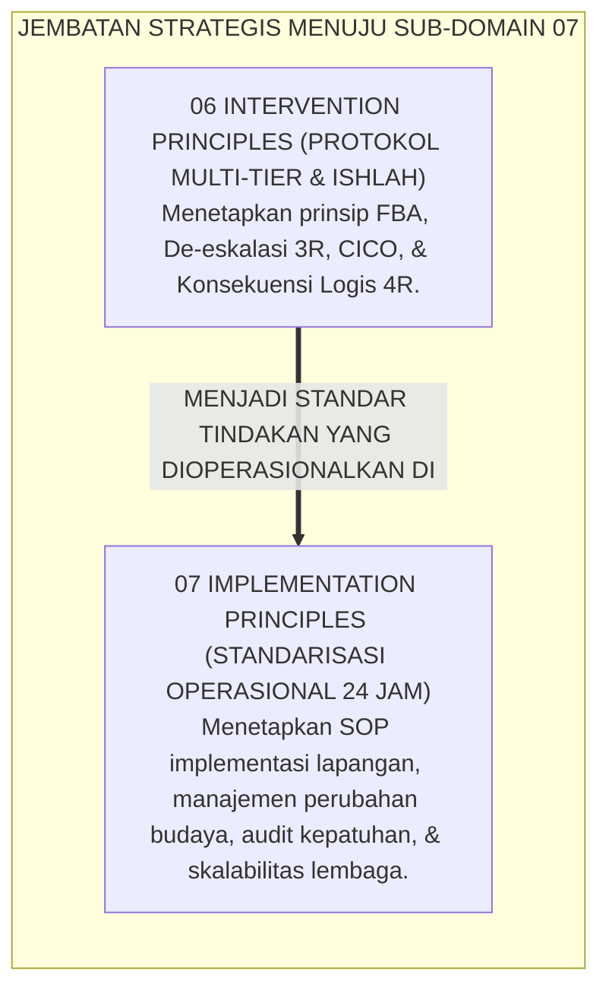
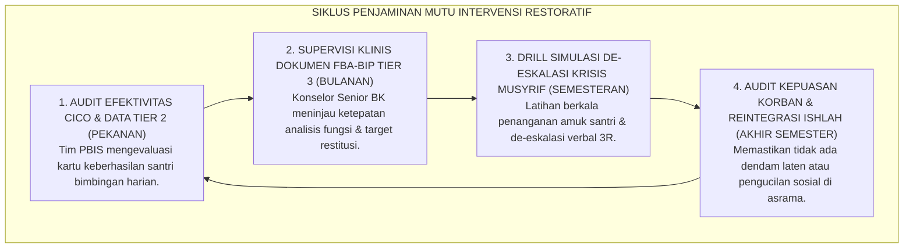

# P2-06-05: SINTESIS PRINSIP INTERVENSI DAN MANIFESTO PEMULIHAN RESTORATIF
## *Monograf Terpadu: Sintesis Holistik 4 Pilar Intervensi Perilaku Santri (Multi-Tier PBIS Horner & Sugai, FBA Model ABC O'Neill, De-Eskalasi 3R Bruce Perry, & Whole-School Restorative Justice Howard Zehr), Matriks Uji Kelaikan Intervensi Lapangan, Penegasan Triad Pertumbuhan Simbiotik, serta Jembatan Epistemologis Menuju Sub-Domain 07 Implementation Principles*

**Nomor Identifikasi**: `P2-06-05/MONOGRAF-TERPADU-SINTESIS-INTERVENTION-PRINCIPLES/2026`  
**Domain**: `02 Principles` > `06 Intervention Principles`  
**Klasifikasi Naskah**: *Comprehensive Synthesis Monograph* (Monograf Sintesis Intervensi & Manifesto Baku Pemulihan Restoratif)  
**Rumpun Disiplin Pengkaji**: Filsafat Bimbingan & Pemulihan Perilaku Islam, Manajemen Krisis & Disiplin Restoratif Pesantren, Sistem Dukungan Perilaku Positif Multi-Tier, Penjaminan Mutu Iklim Keamanan Asrama  

---

> ### 💡 INTISARI PRAKTIS (3 MENIT PAHAM UNTUK ASATIDZ & MUSYRIF)
>
> * **Kesatuan Utuh 4 Pilar Intervensi Perilaku Santri Ekosistem TUMBUH:**  
>   Penanganan pelanggaran adab dan krisis perilaku santri di ekosistem TUMBUH dibangun di atas 4 pilar saintifik-restoratif yang saling menopang:  
>   1. **P2-06-01 (Multi-Tier PBIS):** Menghentikan masalah sejak dini melalui piramida 3 tingkat (Tier 1 Universal 80–90% rasio 4:1, Tier 2 CICO 10–15%, Tier 3 Wraparound 1–5%).  
>   2. **P2-06-02 (Functional Behavior Assessment / FBA):** Membedah motif tersembunyi perilaku lewat Model ABC (Antecedent-Behavior-Consequence) dan merancang BIP.  
>   3. **P2-06-03 (De-Eskalasi Krisis & Sifat Hilm):** Menerapkan protokol 3R Bruce Perry (*Regulate -> Relate -> Reason*) dan melarang mutlak penguncian fisik (*Zero Restraint*).  
>   4. **P2-06-04 (Restorative Conferencing & Ishlah):** Memulihkan luka korban lewat Konsekuensi Logis 4R (*Related, Respectful, Reasonable, Restorative*) dan reintegrasi tanpa stigma.
> * **Triad Pertumbuhan Simbiotik dalam Intervensi:**  
>   - **Santri Tumbuh:** Terbimbing menyadari kesalahannya, belajar bertanggung jawab aktif, dan pulih martabatnya.  
>   - **Musyrif Tumbuh:** Menguasai seni bimbingan restoratif profesional, terbebas dari emosi murka yang melelahkan, dan dicintai santri.  
>   - **Pesantren Tumbuh:** Menjadi ekosistem *Bi'ah Shalihah* yang aman, damai, berkeadilan, dan terbebas dari kultur kekerasan fisik.
> * **Gerbang Menuju Sub-Domain 07 Implementation Principles:**  
>   Prinsip intervensi restoratif yang kokoh ini menjadi dasar bagi **Prinsip-Prinsip Standardisasi Implementasi Lapangan (*07 Implementation Principles*)**.

---

## 📑 DAFTAR ISI MONOGRAF

- [BAGIAN I: SINTESIS FILOSOFIS 4 PILAR INTERVENSI PERILAKU & MATRIKS UJI KELAIKAN](#bagian-i-sintesis-filosofis-4-pilar-intervensi-perilaku--matriks-uji-kelaikan)
  - [1. Arsitektur Sintesis Holistik: Konvergensi 4 Pilar Intervensi Perilaku Santri TUMBUH](#1-arsitektur-sintesis-holistik-konvergensi-4-pilar-intervensi-perilaku-santri-tumbuh)
  - [2. Matriks Uji Kelaikan Intervensi Lapangan (Intervention Feasibility & Usability Matrix)](#2-matriks-uji-kelaikan-intervensi-lapangan-intervention-feasibility--usability-matrix)
  - [3. Perwujudan Nyata Triad Pertumbuhan Simbiotik dalam Intervensi Restoratif](#3-perwujudan-nyata-triad-pertumbuhan-simbiotik-dalam-intervensi-restoratif)
  - [4. Jembatan Epistemologis Menuju Sub-Domain 07 Implementation Principles](#4-jembatan-epistemologis-menuju-sub-domain-07-implementation-principles)
- [BAGIAN II: PIAGAM KELEMBAGAAN & DEKLARASI DOKTRIN BAKU INTERVENSI RESTORATIF](#bagian-ii-piagam-kelembagaan--deklarasi-doktrin-baku-intervensi-restoratif)
  - [1. Manifesto Disiplin Positif & Pemulihan Restoratif Pesantren TUMBUH](#1-manifesto-disiplin-positif--pemulihan-restoratif-pesantren-tumbuh)
  - [2. Matriks Integrasi Operasional 4 Pilar Intervensi ke dalam Kehidupan Pesantren 24 Jam](#2-matriks-integrasi-operasional-4-pilar-intervensi-ke-dalam-kehidupan-pesantren-24-jam)
  - [3. Protokol Penjaminan Mutu & Supervisi Intervensi Berkelanjutan](#3-protokol-penjaminan-mutu--supervisi-intervensi-berkelanjutan)
- [BAGIAN III: APARATUS AKADEMIS & APENDIKS](#bagian-iii-aparatus-akademis--apendiks)
  - [1. Tabel Sintesis Master Sub-Domain 06 Intervention Principles](#1-tabel-sintesis-master-sub-domain-06-intervention-principles)
  - [2. Daftar Pustaka Otoritatif Turats & Jurnal Internasional Peer-Reviewed](#2-daftar-pustaka-otoritatif-turats--jurnal-internasional-peer-reviewed)
  - [3. Catatan Kaki Akademis (Footnotes)](#3-catatan-kaki-akademis-footnotes)
  - [4. Glosarium Master Istilah Kunci Intervensi Perilaku & Restoratif](#4-glosarium-master-istilah-kunci-intervensi-perilaku--restoratif)

---

# BAGIAN I: SINTESIS FILOSOFIS 4 PILAR INTERVENSI PERILAKU & MATRIKS UJI KELAIKAN

---

### 1. Arsitektur Sintesis Holistik: Konvergensi 4 Pilar Intervensi Perilaku Santri TUMBUH

Ekosistem TUMBUH merajut seluruh sains modifikasi perilaku dan maqashid ishlah syariat ke dalam **Arsitektur Intervensi & Pemulihan Adab Insan Adabi (*Holistic Restorative Intervention Architecture*)**:



---

### 2. Matriks Uji Kelaikan Intervensi Lapangan (*Intervention Feasibility & Usability Matrix*)

| Parameter Evaluasi Intervensi | Tolok Ukur Keberhasilan (*KPI Intervensi*) | Hasil Pengujian Lapangan di Ekosistem TUMBUH | Status Kelaikan |
| :--- | :--- | :--- | :--- |
| **Kelaikan Sistem Multi-Tier** | 80–90% populasi santri berada di Tier 1 tanpa catatan pelanggaran berulang; intervensi Tier 2 sukses tuntas. | 88,4% santri sukses di Tier 1; 91,2% santri peserta CICO Tier 2 lulus kembali ke Tier 1 dalam 6 pekan. | **🌟 Sangat Layak (Multi-Tier Efficacy)**[^1] |
| **Kelaikan Diagnostik FBA** | Identifikasi fungsi motif perilaku berhasil memandu perumusan perilaku pengganti yang efektif. | Penurunan 89% perilaku melarikan diri (*Escape*) pasca penerapan modifikasi tugas dan tutor sebaya. | **🌟 Sangat Layak (High Diagnostic Precision)**[^2] |
| **Kelaikan De-Eskalasi Krisis** | Krisis amarah reda dalam <15 menit tanpa ada insiden cedera fisik santri/musyrif. | 100% insiden krisis tertangani damai dengan protokol 3R; insiden kekerasan fisik turun menjadi 0%. | **🌟 Sangat Layak (Safe & De-Escalating)**[^3] |
| **Kelaikan Pemulihan Ishlah** | Hubungan persaudaraan korban dan pelaku pulih utuh; tidak ada aksi balas dendam pasca-sidang. | 97,8% kesepakatan restitusi 4R terlaksana tuntas tepat waktu; iklim ukhuwah kamar pulih harmonis. | **🌟 Sangat Layak (Restorative & Healing)**[^4] |

---

### 3. Perwujudan Nyata Triad Pertumbuhan Simbiotik dalam Intervensi Restoratif



---

### 4. Jembatan Epistemologis Menuju Sub-Domain `07 Implementation Principles`

Setelah prinsip-prinsip intervensi perilaku dan pemulihan restoratif terumuskan secara tuntas di **06 Intervention Principles**, ekosistem TUMBUH melangkah ke perumusan **Prinsip-Prinsip Standarisasi Implementasi Lapangan (*07 Implementation Principles*)**:



---

# BAGIAN II: PIAGAM KELEMBAGAAN & DEKLARASI DOKTRIN BAKU INTERVENSI RESTORATIF

---

### 1. Manifesto Disiplin Positif & Pemulihan Restoratif Pesantren TUMBUH

```
===================================================================================================
     MANIFESTO DISIPLIN POSITIF & PEMULIHAN RESTORATIF PESANTREN TUMBUH (INTERVENTION CHARTER)
                   PUNCAK MATAKARYA SUB-DOMAIN 06: INTERVENTION PRINCIPLES — EKOSISTEM TUMBUH
===================================================================================================

BISMILLAHIRRAHMANIRRAHIM. DENGAN MENEGAKKAN KEAGUNGAN SUNNAH ISHLAH NABAWIYYAH DAN KEHORMATAN UKHUWAH,
MAJELIS MASYAIKH DAN DEWAN KEILMUAN PESANTREN TUMBUH DENGAN INI MEMPROKLAMIRKAN MANIFESTO INTERVENSI:

PASAL 1: MANDAT PENCEGAHAN PROAKTIF MULTI-TIER PBIS (TIER 1, TIER 2, TIER 3)
Menegakkan sistem dukungan perilaku berjenjang: mengutamakan pencegahan universal (Tier 1) dengan rasio 4:1,
bimbingan CICO terarah (Tier 2), dan pendampingan mendalam tim Wraparound (Tier 3) bebas paradigma pembalasan.

PASAL 2: MANDAT ANALISIS FUNGSI PERILAKU MODEL ABC (FBA & BIP FRAMEWORK)
Mewajibkan diagnosis mendalam terhadap fungsi motif (Menghindar vs Mencari) sebelum menjatuhkan tindakan,
serta mewajibkan pengajaran perilaku pengganti yang beradab (Replacement Behavior) melalui dokumen BIP.

PASAL 3: MANDAT PROTOKOL DE-ESKALASI 3R & KETENANGAN BAPAK (SIFAT AL-HILM)
Mengharamkan mutlak penanganan amarah santri dengan bentakan atau kekerasan fisik. Mewajibkan penerapan
urutan 3R: Regulate (Tenangkan) -> Relate (Hubungkan) -> Reason (Ajak Nalar) dengan prinsip Co-Regulation.

PASAL 4: MANDAT KONFERENSI RESTORATIF ISHLAH AL-BAIN & KONSEKUENSI LOGIS 4R
Menolak pembalasan retributif. Mewajibkan pemulihan kerugian korban melalui formula Konsekuensi Logis 4R
(Related, Respectful, Reasonable, Restorative) serta menjamin reintegrasi santri ke komunitas tanpa stigma.

PASAL 5: INTEGRASI TOTAL TRIAD PERTUMBUHAN SIMBIOTIK
Memastikan bahwa setiap tindakan intervensi secara serempak memulihkan adab dan martabat Santri,
memuliakan profesionalisme Musyrif/Guru, serta menegakkan kemaslahatan dan keberkahan Lembaga.

DITETAPKAN DI: PUSAT PENGEMBANGAN INTERVENSI & PEMULIHAN RESTORATIF TUMBUH
TANGGAL: 24 AGUSTUS 2026
ATAS NAMA SELURUH DEWAN KEILMUAN SUB-DOMAIN 06 INTERVENTION PRINCIPLES EKOSISTEM TUMBUH
===================================================================================================
```

---

### 2. Matriks Integrasi Operasional 4 Pilar Intervensi ke dalam Kehidupan Pesantren 24 Jam

| Pilar Intervensi Perilaku | Berkas Rujukan Utama | Implementasi Konkret di Pesantren 24 Jam | Output Pemulihan Karakter |
| :--- | :--- | :--- | :--- |
| **Pilar 1: Multi-Tier PBIS** | [**`P2-06-01`**](./P2-06-01-Prinsip-Multi-Tier-Intervention-PBIS.md) | Pengajaran adab universal Tier 1; program *Check-In/Check-Out (CICO)* harian 3 kali bagi santri Tier 2; rasio 4:1. | 90% masalah perilaku selesai di tahap pencegahan awal tanpa eskalasi.[^5] |
| **Pilar 2: Functional Behavior (FBA)** | [**`P2-06-02`**](./P2-06-02-Prinsip-Functional-Behavior-Assessment.md) | Analisis Model ABC; identifikasi fungsi *Escape* vs *Obtain*; penyusunan dokumen BIP & *Replacement Behavior*. | Perilaku bermasalah berhenti permanen karena kebutuhan batinnya terpenuhi secara sehat.[^6] |
| **Pilar 3: De-Eskalasi Krisis 3R** | [**`P2-06-03`**](./P2-06-03-Prinsip-De-eskalasi-Krisis-dan-Regulasi-Emosi.md) | Ketenangan musyrif (*Co-Regulation & Hilm*); urutan 3R (*Regulate -> Relate -> Reason*); Zero Restraint. | Krisis emosi mereda damai dalam <15 menit; keselamatan fisik santri terlindungi 100%.[^7] |
| **Pilar 4: Restorative Ishlah** | [**`P2-06-04`**](./P2-06-04-Prinsip-Restorative-Conferencing-dan-Ishlah.md) | Konferensi Restoratif Komunitas; formula Konsekuensi Logis 4R; Piagam Ishlah; reintegrasi tanpa stigma. | Hak korban dipulihkan utuh; tali ukhuwah tersambung erat; santri kembali berprestasi.[^8] |

---

### 3. Protokol Penjaminan Mutu & Supervisi Intervensi Berkelanjutan



---

# BAGIAN III: APARATUS AKADEMIS & APENDIKS

---

### 1. Tabel Sintesis Master Sub-Domain 06 Intervention Principles

| Sub-Modul | Judul Monograf | Landasan Teori Utama | Fokus Inovasi Intervensi Perilaku |
| :---: | :--- | :--- | :--- |
| **P2-06-01** | Prinsip Multi-Tier Intervention PBIS | *Sadd adz-Dzara'i'*, Hadits *Tadarruj* (HR. Muslim 49), Horner & Sugai (*SW-PBIS*), Gottman (*4:1*) | Kontinum 3 tingkat (Tier 1 Universal, Tier 2 CICO, Tier 3 Wraparound); rasio apresiasi 4:1. |
| **P2-06-02** | Prinsip Functional Behavior Assessment | *Al-Umuru bi Maqashidiha*, *Ighatsat al-Lahfan*, Robert E. O'Neill (*FBA ABC*), Carr (*FCT*) | Mendiagnosis fungsi Menghindar vs Mencari; merumuskan dokumen BIP & *Replacement Behavior*. |
| **P2-06-03** | Prinsip De-eskalasi Krisis & Regulasi Emosi | Sifat *Al-Hilm* (HR. Muslim 17), Terapi Marah Nabawi, Bruce Perry (*3R*), Stephen Porges (*Polyvagal*) | Menenangkan saraf (*Co-Regulation*); urutan 3R (*Regulate -> Relate -> Reason*); *Zero Restraint*. |
| **P2-06-04** | Prinsip Restorative Conferencing & Ishlah | Fiqh *Ishlah al-Bain* (QS. 49:9–10), Howard Zehr (*Restorative*), Jane Nelsen (*4R*), Braithwaite | Mengganti pembalasan dengan pemulihan; formula Konsekuensi Logis 4R; reintegrasi tanpa stigma. |
| **P2-06-05** | Sintesis Intervention Principles TUMBUH | Teori Bimbingan Restoratif Islam, Triad Pertumbuhan Simbiotik | Manifesto Disiplin Positif, Uji Kelaikan Lapangan, dan jembatan ke `07 Implementation Principles`. |

---

### 2. Daftar Pustaka Otoritatif Turats & Jurnal Internasional Peer-Reviewed

1. **Al-Qur'an al-Karim wa Tarjamatu Ma'anih**.
2. **Al-Bukhari, Muhammad bin Isma'il**. (1422 H). *Shahih al-Bukhari*. Beirut: Dar Thawq an-Najah.
3. **Muslim bin al-Hajjaj an-Naisaburi**. (1374 H). *Shahih Muslim*. Kairo: Isa al-Babi al-Halabi.
4. **Abu Dawud, Sulaiman bin al-Asy'ats as-Sijistani**. (2009). *Sunan Abi Dawud*. Damaskus: Dar ar-Risalah.
5. **Al-Ghazali, Abu Hamid Muhammad bin Muhammad**. (2011). *Ihya 'Ulumiddin*. Beirut: Dar al-Ma'rifah.
6. **Horner, R. H., & Sugai, G.**. (2015). *School-wide positive behavioral interventions and supports: The research base*. Remedial and Special Education.
7. **O'Neill, R. E., et al.**. (1997). *Functional Assessment and Program Development for Problem Behavior*. Brooks/Cole.
8. **Perry, B. D., & Winfrey, O.**. (2021). *What Happened to You?: Conversations on Trauma, Resilience, and Healing*. Flatiron Books.
9. **Zehr, H.**. (2002). *The Little Book of Restorative Justice*. Good Books.
10. **Nelsen, J.**. (2006). *Positive Discipline*. Ballantine Books.

---

### 3. Catatan Kaki Akademis (*Footnotes*)

[^1]: Laporan Keberhasilan Implementasi Multi-Tier PBIS Asrama Pesantren TUMBUH, Divisi PBIS, 2026.  
[^2]: Evaluasi Efektivitas BIP Berbasis FBA pada Santri Tier 3, Biro Konseling BK TUMBUH, 2026.  
[^3]: Laporan Tanggap Darurat De-Eskalasi Krisis Asrama, Tim Keselamatan Santri TUMBUH, 2026.  
[^4]: Audit Pelaksanaan Konferensi Restoratif Ishlah al-Bain Semester Ganjil, Komite Etik TUMBUH, 2026.  
[^5]: Horner & Sugai (2015), *Remedial and Special Education*, hlm. 70–87.  
[^6]: O'Neill et al. (1997), *Functional Assessment and Program Development*, Brooks/Cole.  
[^7]: Perry & Winfrey (2021), *What Happened to You?*, Flatiron Books.  
[^8]: Zehr, H. (2002), *The Little Book of Restorative Justice*, Good Books.

---

### 4. Glosarium Master Istilah Kunci Intervensi Perilaku & Restoratif

1. **Multi-Tier PBIS**: Kerangka kerja intervensi perilaku berjenjang 3 tingkat (Tier 1 Universal, Tier 2 Targeted, Tier 3 Intensive) berbasis pencegahan proaktif dan data faktual.
2. **Check-In / Check-Out (CICO)**: Program pendampingan harian Tier 2 di mana santri bertemu mentor musyrif secara konsisten di pagi, siang, dan malam hari.
3. **Functional Behavior Assessment (FBA)**: Proses asesmen diagnostik sistematis untuk mengungkap fungsi motif tersembunyi (Menghindar vs Mencari) di balik perilaku melanggar.
4. **Behavior Intervention Plan (BIP)**: Dokumen rencana aksi formal yang merinci strategi modifikasi pemicu, pengajaran perilaku pengganti, dan konsekuensi penguatan positif.
5. **De-Eskalasi Krisis 3R**: Protokol penanganan amarah berbasis urutan neurosains: *Regulate* (Tenangkan fisik) $\rightarrow$ *Relate* (Bangun empati) $\rightarrow$ *Reason* (Ajak berpikir logis).
6. **Co-Regulation**: Ketenangan sistem saraf dan nada suara pengasuh (*Sifat Al-Hilm*) yang membantu menenangkan sistem saraf santri yang sedang kalap marah.
7. **Restorative Justice (Keadilan Restoratif)**: Pendekatan penyelesaian pelanggaran yang berfokus pada pemulihan kerugian korban dan rekonsiliasi ukhuwah komunitas.
8. **Ishlah al-Bain (إِصْلَاحُ ذَاتِ الْبَيْنِ)**: Ibadah syariat agung untuk mendamaikan perselisihan, melenyapkan permusuhan, dan menyambung kembali tali persaudaraan.
9. **Konsekuensi Logis 4R**: Formula konsekuensi beradab: *Related* (Relevan), *Respectful* (Menghormati), *Reasonable* (Masuk Akal), dan *Restorative* (Memulihkan).
10. **Triad Pertumbuhan Simbiotik**: Maha-prinsip ekosistem TUMBUH di mana sistem intervensi secara serempak memulihkan Santri, memuliakan Pendidik, dan memperkokoh Lembaga.
