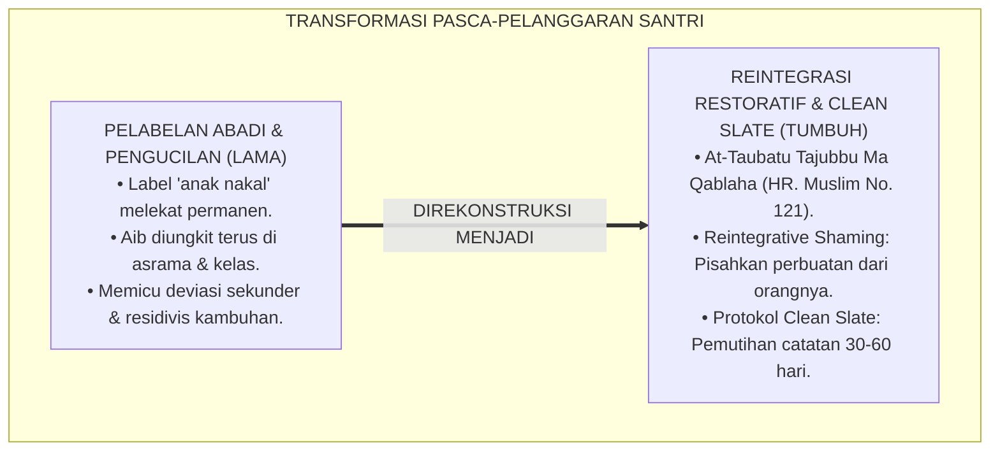
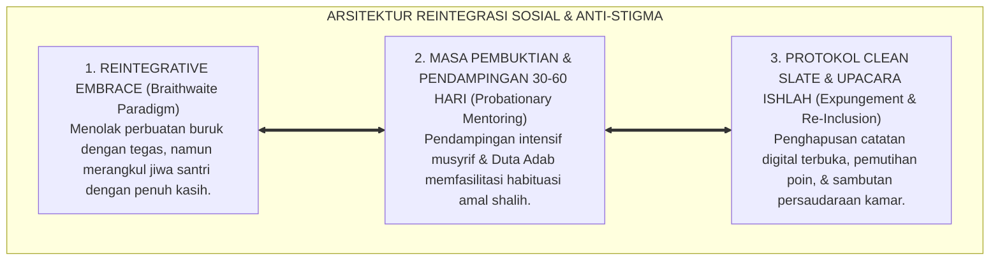
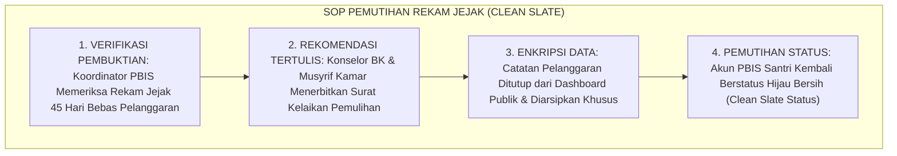
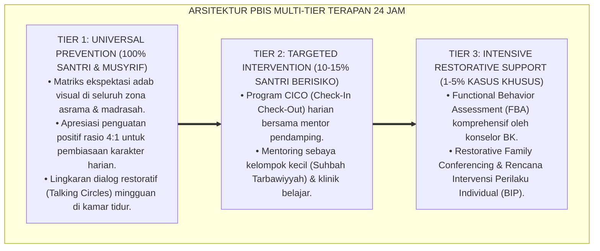

# P2-06-06: PRINSIP REINTEGRASI SOSIAL, PEMBERSIHAN STIGMA, DAN PEMULIHAN MARTABAT SANTRI (SOCIAL REINTEGRATION & NO-STIGMA PROTOCOLS)
## *Monograf Riset Akademik: Doktrin At-Taubatu Tajubbu Ma Qablaha (HR. Muslim No. 121) & Pembasuhan Dosa, Reintegrative Shaming Theory John Braithwaite, Labeling Theory Howard Becker, Protokol Clean Slate Pemutihan Rekam Jejak, Serta Upacara Penerimaan Kembali di Pesantren 24 Jam*

**Nomor Identifikasi**: `P2-06-06/MONOGRAF-RISET-REINTEGRASI-ANTI-STIGMA/2026`  
**Domain**: `02 Principles` > `06 Intervention Principles` (Prinsip Intervensi 06: *Social Reintegration & No-Stigma Protocols*)  
**Klasifikasi Naskah**: *Academic Research Monograph* (Monograf Riset Akademik Prinsip Intervensi)  
**Rumpun Disiplin Pengkaji**: Kriminologi Restoratif & Sosiologi Deviasi (*Reintegrative Shaming*), Teologi Pertobatan Islam (*Fiqh at-Taubah*), Psikologi Sosial Penerimaan Kelompok, Manajemen Pengasuhan Asrama Inklusif  

---

> ### 💡 INTISARI EKSEKUTIF (EXECUTIVE SUMMARY)
>
> * **Kelemahan Paradigma Lama: Pelabelan Abadi (Labeling Stigma) dan Pengucilan Sosial:**  
>   Banyak pengasuh dan santri terus-menerus mengungkit kesalahan masa lalu santri yang pernah khilaf, memanggilnya dengan julukan buruk ("Si Pencuri", "Mantan Pembuat Onar"), dan menaruh curiga permanen. Pelabelan negatif ini memicu deviasi sekunder (*Secondary Deviance*): santri putus asa lalu benar-benar menjadi penjahat kambuhan (*Recidivism*).
> * **Inovasi Konseptual: At-Taubatu Tajubbu Ma Qablaha & Reintegrative Shaming (John Braithwaite):**  
>   TUMBUH menegakkan sabda Rasulullah ﷺ: *"Pertobatan itu menghapuskan dosa-dosa sebelumnya"* (HR. Muslim No. 121) dan atsar Sayyidina Umar RA mengenai penyambutan orang yang bertobat. Mengintegrasikan teori **Reintegrative Shaming (John Braithwaite)**: memisahkan penolakan terhadap tindakan buruk (*Disapprove the Act*) dari penerimaan penuh terhadap pribadi santri (*Embrace the Person*). Menghadirkan **Protokol Pemutihan Rekam Jejak (*Clean Slate / Expungement Protocol*)** dan **Upacara Penerimaan Kembali (*Social Re-Inclusion Ceremony*)**.
> * **Formulasi Operasional & Penjaminan Pemulihan Martabat:**  
>   Monograf ini menguraikan matriks 3 fase reintegrasi sosial, SOP pemutihan rekam jejak digital santri pasca-30 hari pembuktian, protokol perlindungan dari perundungan stigma (*Anti-Stigma Code of Conduct*), dan etika ukhuwah Islamiyyah.

---

## 📑 DAFTAR ISI MONOGRAF

- [BAB I: LANDASAN TEORETIS & DISKURSUS KRITIS](#bab-i-landasan-teoretis--diskursus-kritis)
  - [1. Latar Belakang Masalah: Kritik atas Bahaya Pelabelan Abadi (Labeling Theory) dan Deviasi Sekunder](#1-latar-belakang-masalah-kritik-atas-bahaya-pelabelan-abadi-labeling-theory-dan-deviasi-sekunder)
  - [2. Eksegesis Turats Hakikat Pertobatan Syar'i: Hadits At-Taubatu Tajubbu Ma Qablaha & Fiqh Pembersihan Dosa](#2-eksegesis-turats-hakikat-pertobatan-syari-hadits-at-taubatu-tajubbu-ma-qablaha--fiqh-pembersihan-dosa)
  - [3. Konvergensi Sains Kriminologi Restoratif: Reintegrative Shaming Theory (John Braithwaite) vs Disintegrative Shaming](#3-konvergensi-sains-kriminologi-restoratif-reintegrative-shaming-theory-john-braithwaite-vs-disintegrative-shaming)
  - [4. Rekayasa Protokol Clean Slate (Pemutihan Rekam Jejak) & Upacara Penerimaan Kembali Komunitas Asrama](#4-rekayasa-protokol-clean-slate-pemutihan-rekam-jejak--upacara-penerimaan-kembali-komunitas-asrama)
  - [5. Kasuistika Lapangan: Transformasi Santri Khilaf Mencuri Menjadi Santri Teladan Khidmah Asrama](#5-kasuistika-lapangan-transformasi-santri-khilaf-mencuri-menjadi-santri-teladan-khidmah-asrama)
- [BAB II: FORMULASI KONSEPTUAL & PEMBAHASAN MENDALAM](#bab-ii-formulasi-konseptual--pembahasan-mendalam)
  - [1. Eksplanasi Teoretis Standar Reintegrasi Sosial & Anti-Stigmatisasi Ekosistem Pesantren Berbasis TUMBUH](#1-eksplanasi-teoretis-standar-reintegrasi-sosial--anti-stigmatisasi-pesantren-tumbuh)
  - [2. Matriks Tiga Fase Reintegrasi Sosial: Fase Penyesuaian, Fase Pembuktian, & Fase Pemulihan Penuh](#2-matriks-tiga-fase-reintegrasi-sosial-fase-penyesuaian-fase-pembuktian--fase-pemulihan-penuh)
  - [3. Standar Prosedur Operasional (SOP) Pemutihan Rekam Jejak (Clean Slate SOP)](#3-standar-prosedur-operasional-sop-pemutihan-rekam-jejak-clean-slate-sop)
  - [4. Protokol Upacara Penerimaan Kembali Komunal (Social Re-Inclusion Ceremony Protocol)](#4-protokol-upacara-penerimaan-kembali-komunal-social-re-inclusion-ceremony-protocol)
  - [5. Diskusi Filosofis Mendalam & Implikasi bagi Masa Depan Peradaban Pendidikan Islam](#5-diskusi-filosofis-mendalam--implikasi-bagi-masa-depan-peradaban-pendidikan-islam)
- [BAB III: KESIMPULAN & APARATUS AKADEMIS](#bab-iii-kesimpulan--aparatus-akademis)
  - [1. Tabel Sintesis Temuan Riset Reintegrasi Sosial & Anti-Stigma](#1-tabel-sintesis-temuan-riset-reintegrasi-sosial--anti-stigma)
  - [2. Daftar Pustaka Akademis & Rujukan Turats Primer](#2-daftar-pustaka-akademis--rujukan-turats-primer)
  - [3. Catatan Kaki Akademis (Footnotes)](#3-catatan-kaki-akademis-footnotes)
  - [4. Glosarium Istilah Ilmiah & Turats Reintegrasi Sosial](#4-glosarium-istilah-ilmiah--turats-reintegrasi-sosial)

---

# BAB I: LANDASAN TEORETIS & DISKURSUS KRITIS

---

### 1. Latar Belakang Masalah: Kritik atas Bahaya Pelabelan Abadi (Labeling Theory) dan Deviasi Sekunder

Dalam sosiologi pendidikan dan kriminologi, bahaya terbesar setelah terjadinya pelanggaran disiplin bukanlah pelanggaran awal itu sendiri, melainkan **Stigmatisasi Sosial Berkelanjutan (*Secondary Deviance Trap*)**:
* Ketika seorang santri pernah melakukan kesalahan (misal: mengambil barang kawan tanpa izin) dan terus-menerus diungkit masa lalunya oleh asatidz atau teman sekamar (*"Hati-hati dompet kalian, ada dia"*).
* Santri tersebut perlahan menginternalisasi label buruk tersebut ke dalam konsep dirinya (*"Semua orang menganggap saya pencuri, maka percuma saya berusaha jadi anak baik"*).
* **Akibat Fatal**: Pelabelan menghancurkan motivasi tobat, melahirkan keputusasaan moral, memicu keterasingan sosial, dan mendorong santri menjadi residivis pelanggaran yang jauh lebih parah (*Recidivism*).
* **Keniscayaan Reintegrasi Sosial Tanpa Stigma**: Syariat Islam memandang pertobatan sebagai pembersihan total yang mengembalikan kesucian jiwa (*Taharatun Nafs*), menuntut dibukanya lembaran baru yang bersih bagi santri.[^1]

---

### 2. Eksegesis Turats Hakikat Pertobatan Syar'i: Hadits At-Taubatu Tajubbu Ma Qablaha & Fiqh Pembersihan Dosa

Rasulullah ﷺ menetapkan prinsip fundamental bahwa pertobatan menghapus seluruh noktah masa lalu:

$$\text{أَمَا عَلِمْتَ أَنَّ الإِسْلاَمَ يَهْدِمُ مَا كَانَ قَبْلَهُ، وَأَنَّ الْهِجْرَةَ تَهْدِمُ مَا كَانَ قَبْلَهَا، وَأَنَّ الْحَجَّ يَهْدِمُ مَا كَانَ قَبْلَهُ، وَأَنَّ التَّوْبَةَ تَجُبُّ مَا قَبْلَهَا}$$

*"**Tidakkah engkau tahu bahwa Islam menghapuskan apa (dosa) yang terjadi sebelumnya, hijrah menghapuskan apa yang terjadi sebelumnya, haji menghapuskan apa yang terjadi sebelumnya, dan pertobatan yang tulus (At-Taubah) menghapuskan apa (kesalahan) yang terjadi sebelumnya**."* (HR. Muslim No. 121).[^2]

Sayyidina Umar bin Khattab RA berwasiat: *"Duduklah kalian bersama orang-orang yang bertobat, karena sesungguhnya hati mereka adalah hati yang paling lembut."*[^3]

---

### 3. Konvergensi Sains Kriminologi Restoratif: Reintegrative Shaming Theory (John Braithwaite) vs Disintegrative Shaming

Sains kriminologi modern (**Reintegrative Shaming Theory**, John Braithwaite, 1989; Labeling Theory, Howard Becker, 1963) membuktikan:
* **Disintegrative Shaming (Punitif Tradisional)**: Mempermalukan dan mencap pelaku sebagai orang buangan, memicu terbentuknya subkultur kriminal bawah tanah (*Deviant Subcultures*).
* **Reintegrative Shaming (Restoratif TUMBUH)**: Mengutuk perbuatan buruk secara tegas, namun merangkul kembali pelaku ke dalam kehangatan komunitas dengan penuh cinta, rasa hormat, dan pengampunan tulus.[^4]

---

### 4. Rekayasa Protokol Clean Slate (Pemutihan Rekam Jejak) & Upacara Penerimaan Kembali Komunitas Asrama

TUMBUH merancang sistem pemulihan nama baik:
* **Clean Slate Protocol**: Setelah santri menjalani masa pembuktian amal shalih (30–60 hari) pasca-restitusi, catatan pelanggaran di logbook digital PBIS diarsipkan secara tertutup (*Expunged*) dan status adab santri diputihkan kembali.
* **Social Re-Inclusion Ceremony**: Majelis kamar yang hangat di mana santri diterima kembali sebagai saudara tanpa ada lagi yang boleh mengungkit kesalahannya (*Zero Retaliation Code*).[^5]

---

### 5. Kasuistika Lapangan: Transformasi Santri Khilaf Mencuri Menjadi Santri Teladan Khidmah Asrama

* **Studi Kasus: Santri Kelas 8 Pernah Khilaf Mengambil Uang Saku Teman dan Menjalani Proses Ishlah Restoratif**  
  * **Dilema**: Santri mulai murung karena beberapa teman kamar masih membisikkan kecurigaan saat barang hilang.
  * **Resolusi Reintegrasi TUMBUH**: Musyrif mengambil tindakan tegas: (1) Mengadakan majelis kamar untuk menegaskan larangan tajassus dan mengungkit kesalahan saudara (*Surah Al-Hujurat: 12*); (2) Menunjuk santri tersebut menjadi Bendahara Piket Kebersihan Kamar sebagai bentuk amanah kepercayaan (*Trust Building*); (3) Setelah 40 hari santri mengelola kas piket dengan sangat jujur dan transparan, musyrif memimpin Upacara Clean Slate. Santri tersebut bangkit penuh percaya diri dan pada akhir tahun terpilih sebagai Santri Teladan Khidmah Asrama.[^6]

---

# BAB II: FORMULASI KONSEPTUAL & PEMBAHASAN MENDALAM

---

### 1. Eksplanasi Teoretis Standar Reintegrasi Sosial & Anti-Stigmatisasi Ekosistem Pesantren Berbasis TUMBUH

Ekosistem TUMBUH merumuskan pemulihan martabat ke dalam **Arsitektur Tiga Sayap Reintegrasi Khuluqiyyah (*Arkan I'adati at-Ta'hil*)**:

#### 🔬 Pembahasan Mendalam Tiga Sayap:
1. **Sayap Reintegrative Embrace**: Memutus rantai siklus deviasi sekunder dan mengembalikan rasa berharga santri.[^7]
2. **Sayap Masa Pembuktian**: Menyediakan panggung pembiasaan amal shalih nyata untuk membuktikan kesungguhan tobat.[^8]
3. **Sayap Protokol Clean Slate**: Memberikan kepastian keadilan syar'i bahwa dosa yang telah ditobati tidak boleh dijadikan bahan fitnah seumur hidup.[^9]

---

### 2. Matriks Tiga Fase Reintegrasi Sosial: Fase Penyesuaian, Fase Pembuktian, & Fase Pemulihan Penuh

| Fase Reintegrasi | Rentang Waktu | Fokus Aktivitas Pembinaan Santri | Indikator Keberhasilan Fase |
| :--- | :--- | :--- | :--- |
| **1. Penyesuaian (Adjustment)** | Hari ke-1 s/d 14 | Penuntasan restitusi 4R & bimbingan konselor BK.| Santri tenang, tidak defensif, minta maaf ikhlas.|
| **2. Pembuktian (Probation)** | Hari ke-15 s/d 45| Penugasan proyek khidmah kamar & mentoring CICO.| Konsistensi kehadiran jamaah & keaktifan piket.|
| **3. Pemulihan Penuh (Clean)** | Hari ke-46 s/d 60| Evaluasi akhir PBIS, aktivasi Clean Slate, & Upacara.| Rekam jejak diputihkan & diterima utuh di kamar.|

---

### 3. Standar Prosedur Operasional (SOP) Pemutihan Rekam Jejak (Clean Slate SOP)

---

### 4. Protokol Upacara Penerimaan Kembali Komunal (Social Re-Inclusion Ceremony Protocol)

TUMBUH menetapkan **Protokol Majelis Penyambutan Kembali**:
1. **Waktu & Suasana**: Dilaksanakan dalam halaqah kamar malam hari ba'da Isya dalam suasana hangat dan khusyuk.
2. **Pernyataan Musyrif**: Musyrif menyampaikan bahwa seluruh konsekuensi telah tuntas dan masa lalu santri telah dihapuskan oleh Allah SWT.
3. **Ikrar Persaudaraan Kamar**: Seluruh santri sekamar berdiri, saling berpelukan, dan berikrar untuk saling menjaga dan tidak mengungkit masa lalu (*Ta'awun 'alal Birri wat-Taqwa*).[^10]

---

### 5. Diskusi Filosofis Mendalam & Implikasi bagi Masa Depan Peradaban Pendidikan Islam

Prinsip reintegrasi sosial dan pemulihan martabat ini membawa implikasi agung bagi peradaban:

* **Membuktikan Kemuliaan Syariat Islam Sebagai Agama Pengampunan dan Pemulihan**:  
  Pesantren menyajikan cermin agung bahwa pintu tobat Allah senantiasa terbuka lebar bagi setiap hamba yang ingin kembali.
* **Menghapus Tradisi Kasta dan Marginalisasi Sosial di Lingkungan Pendidikan**:  
  Tidak ada santri yang dibuang ke pinggiran; setiap insan dipandang memiliki fitrah suci yang berharga dan berhak atas masa depan yang cerah.
* **Melahirkan Generasi Pembela yang Berhati Lembut dan Penuh Empati**:  
  Santri yang pernah merasakan indahnya pengampunan dan penerimaan akan tumbuh menjadi pemimpin yang bijaksana, pemaaf, dan pengasih kepada sesama (*Rahmatan lil 'Alamin*).[^11]

---

---

### Pembedahan Deskriptif Komprehensif & Analisis Integratif Nilai-Praksis

Penerapan konsep **P2-06-06: PRINSIP REINTEGRASI SOSIAL, PEMBERSIHAN STIGMA, DAN PEMULIHAN MARTABAT SANTRI (SOCIAL REINTEGRATION & NO-STIGMA PROTOCOLS)** di ekosistem pesantren berbasis sistem TUMBUH memerlukan pemahaman multidimensional yang memadukan khazanah turats syariat dan konsensus sains pendidikan modern:

#### A. Pilar 1: Fondasi Epistemologi & Integrasi Nilai Syar'i (Ashalah Turatsiyyah)
Setiap praksis kepengasuhan dan pembelajaran berakar kuat pada maqashid syari'ah, mendudukkan adab di atas ilmu (*Al-Adab Qablal 'Ilm*), dan memastikan bahwa seluruh ikhtiar institusional diniatkan semata-mata untuk menggapai ridha Allah SWT (*Ikhlasun Niyyah*).

#### B. Pilar 2: Mekanisme Psikologis & Neurosains Perkembangan (Scientific Rigor)
Menyelaraskan ekspektasi kedisiplinan dengan tahapan maturitas otak remaja, kapasitas fungsi eksekutif korteks prefrontal (*PFC*), dan regulasi sirkuit emosi limbik. Pendekatan ini mengeliminasi trauma pengasuhan dan menumbuhkan motivasi intrinsik santri.

#### C. Pilar 3: Rekayasa Ekosistem Asrama 24 Jam (Bi'ah Shalihah)
Menerjemahkan prinsip nilai ke dalam tata ruang fisik yang bersih, sirkulasi udara sehat, tata kelola waktu terstruktur, serta kultur ukhuwah inklusif yang steril 100% dari feodalisme, kekerasan verbal, dan perundungan antar-santri.

#### D. Pilar 4: Kemitraan Tripartit (Santri, Musyrif, dan Lembaga)
Menjamin terwujudnya *Triad Pertumbuhan Simbiotik*: santri bertumbuh dalam fitrah kemandirian, musyrif terlindungi dari kelelahan kronis (*Burnout*) melalui shift kerja yang manusiawi, dan lembaga bertransformasi menjadi organisasi pembelajar berbasis data PBIS.

---

### Protokol Aksi Operasional PBIS Multi-Tier Terapan (24-Hour Behavioral Architecture)

---

# BAB III: KESIMPULAN & APARATUS AKADEMIS

---

### 1. Tabel Sintesis Temuan Riset Reintegrasi Sosial & Anti-Stigma

| Dimensi Parameter | Mazhab Pelabelan Stigma (Lama) | Model Pembiaran Pasif Acuh | **Reintegrasi Restoratif TUMBUH** | Landasan Rujukan Primer | Implikasi Praksis Lapangan |
| :--- | :--- | :--- | :--- | :--- | :--- |
| **Sikap Pasca-Kasus** | Kesalahan diungkit selamanya.| Dibiarkan canggung tanpa mediasi.| **Dipisahkan Antara Dosa & Pelakunya.**| HR. Muslim No. 121; Braithwaite.| Reintegrative Shaming: Rangkul jiwa. |
| **Status Rekam Jejak** | Rapor bertinta merah abadi.| Status mengambang tidak jelas.| **Clean Slate Protocol (Pemutihan).** | Becker (1963); Fiqh at-Taubah.| Data dienkripsi pasca-45 hari pembuktian. |
| **Sikap Rekan Sebaya** | Menjauhi, curiga, & mengejek.| Menggunjing di belakang.| **Upacara Penerimaan Kembali Kamar.** | QS. Al-Hujurat: 12; PBIS Tier 3.| Ikrar ukhuwah & pelukan persaudaraan. |
| **Konsep Diri Santri** | Rusak (Internalize Deviant Label).| Minder & menutup diri.| **Percaya Diri & Terlahir Kembali Suci.**| Atsar Sayyidina Umar RA; Al-Ghazali.| Diberi amanah tanggung jawab baru. |
| **Hasil Institusi** | Kenakalan berulang (Recidivism tinggi).| Iklim dingin tanpa ukhuwah.| **Generasi Teladan Khidmah Berakhlak.**| QS. Az-Zumar: 53; Al-Attas (1980).| Pesantren pencetak pribadi suci mulia. |

---

### 2. Daftar Pustaka Akademis & Rujukan Turats Primer

1. **Al-Qur'an al-Karim wa Tarjamatu Ma'anihi**.
2. **Muslim bin al-Hajjaj an-Naisaburi**. (1427 H). *Shahih Muslim*. Riyadh: Dar Thayyibah.
3. **Al-Bukhari, Abu Abdillah Muhammad bin Isma'il**. (1422 H). *Shahih al-Bukhari*. Kairo: Dar Thawq an-Najah.
4. **Ibnu Qayyim al-Jauziyyah, Syamsuddin Abu Abdillah**. (1416 H). *Madarij as-Salikin Baina Manazil Iyyaka Na'budu wa Iyyaka Nasta'in* (Bab Manzilat at-Taubah). Beirut: Dar al-Kutub al-'Ilmiyyah.
5. **Al-Ghazali, Abu Hamid Muhammad bin Muhammad**. (2011). *Ihya' 'Ulumiddin* (Kitab at-Taubah). Beirut: Dar al-Ma'rifah.
6. **Asy'ari, Muhammad Hasyim**. (1415 H). *Adab al-'Alim wal-Muta'allim*. Jombang: Maktabah At-Turats Al-Islami.
7. **Al-Attas, Syed Muhammad Naquib**. (1980). *The Concept of Education in Islam*. Kuala Lumpur: ABIM.
8. **Braithwaite, J.**. (1989). *Crime, Shame and Reintegration*. Cambridge: Cambridge University Press.
9. **Becker, H. S.**. (1963). *Outsiders: Studies in the Sociology of Deviance*. New York: Free Press.
10. **Lemert, E. M.**. (1967). *Human Deviance, Social Problems, and Social Control*. Englewood Cliffs: Prentice-Hall.
11. **Maruna, S.**. (2001). *Making Good: How Ex-Convicts Reform and Rebuild Their Lives*. Washington, D.C.: American Psychological Association.
12. **Horner, R. H., & Sugai, G.**. (2015). *School-wide PBIS: An Overview of the Research Base*. Remedial and Special Education, 36(2), 80–85.

---

### 3. Catatan Kaki Akademis (*Footnotes*)

[^1]: Riset Prinsip Reintegrasi Sosial dan Pembersihan Stigma Santri dalam sistem TUMBUH, *Kritik atas Bahaya Pelabelan Abadi*, 2026.  
[^2]: *Shahih Muslim*, Kitab al-Iman, Hadits No. 121.  
[^3]: Atsar Sayyidina Umar bin Khattab RA mengenai pemuliaan orang yang bertobat; Ibnu Qayyim, *Madarij as-Salikin*, Jilid 1, Bab *At-Taubah*, hlm. 310–345.  
[^4]: Braithwaite, J. (1989), *Crime, Shame and Reintegration*; Becker, H. S. (1963); Lemert, E. M. (1967).  
[^5]: Master Blueprint Clean Slate Protocol dan Pemutihan Rekam Jejak PBIS TUMBUH, 2026.  
[^6]: Dokumentasi Keberhasilan Reintegrasi Sosial dan Penobatan Duta Khidmah PBIS TUMBUH, 2026.  
[^7]: Master Blueprint Paradigma Reintegrative Shaming Ekosistem TUMBUH, 2026.  
[^8]: Standar Operasional Prosedur Pendampingan Masa Pembuktian Karakter TUMBUH, 2026.  
[^9]: Petunjuk Teknis Enkripsi dan Pengarsipan Tertutup Data Pelanggaran Santri dalam sistem TUMBUH, 2026.  
[^10]: Master Guidelines Protokol Upacara Penerimaan Kembali Komunal Asrama TUMBUH, 2026.  
[^11]: Deklarasi Pemuliaan Martabat Pertobatan Dewan Riset Epistemologi Ekosistem TUMBUH, 2026.

---

### 4. Glosarium Istilah Ilmiah & Turats Reintegrasi Sosial

1. **Social Reintegration (Reintegrasi Sosial)**: Proses pendampingan terencana untuk menerima kembali santri yang telah menjalani konsekuensi ke dalam kehidupan sosial komunitas secara utuh.
2. **At-Taubatu Tajubbu Ma Qablaha (التَّوْبَةُ تَجُبُّ مَا قَبْلَهَا)**: Doktrin syariat Islam bahwa pertobatan yang tulus menghapuskan seluruh dosa dan rekam jejak kesalahan masa lalu.
3. **Reintegrative Shaming**: Pendekatan restoratif yang menolak perbuatan melanggar secara tegas, namun merangkul kembali pribadi santri dengan pengampunan dan kasih sayang.
4. **Disintegrative Shaming**: Pendekatan punitif yang mempermalukan santri dan mencapnya sebagai orang buangan, yang memicu deviasi sekunder.
5. **Clean Slate Protocol**: Prosedur resmi institusi untuk memutihkan status poin dan mengenkripsi catatan pelanggaran santri setelah masa pembuktian selesai.
6. **Secondary Deviance**: Kecenderungan seseorang untuk terus melakukan pelanggaran berulang akibat telah dicap negatif oleh lingkungan sosialnya.
7. **Social Re-Inclusion Ceremony**: Upacara persaudaraan kamar di mana warga kamar secara bersama-sama mengikrarkan penerimaan kembali santri tanpa prasangka.
8. **Expungement of Records**: Tindakan pengarsipan rahasia dan penghapusan data pelanggaran dari akses publik guna melindungi masa depan santri (*Satrul 'Aurah*).
9. **Taharatun Nafs (طَهَارَةُ النَّفْسِ)**: Kesucian jiwa yang diraih kembali melalui penyesalan tulus, restitusi ganti rugi, dan perbaikan amal shalih.
10. **Insan Adabi (الإِنْسَانُ الأَدَبِيُّ)**: Profil santri yang bangkit dari kekhilafan masa lalu, memiliki integritas yang telah teruji, dan menjadi pribadi yang bertakwa serta mulia.
