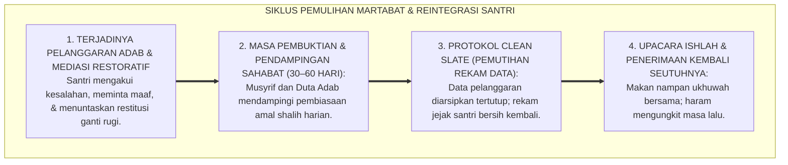
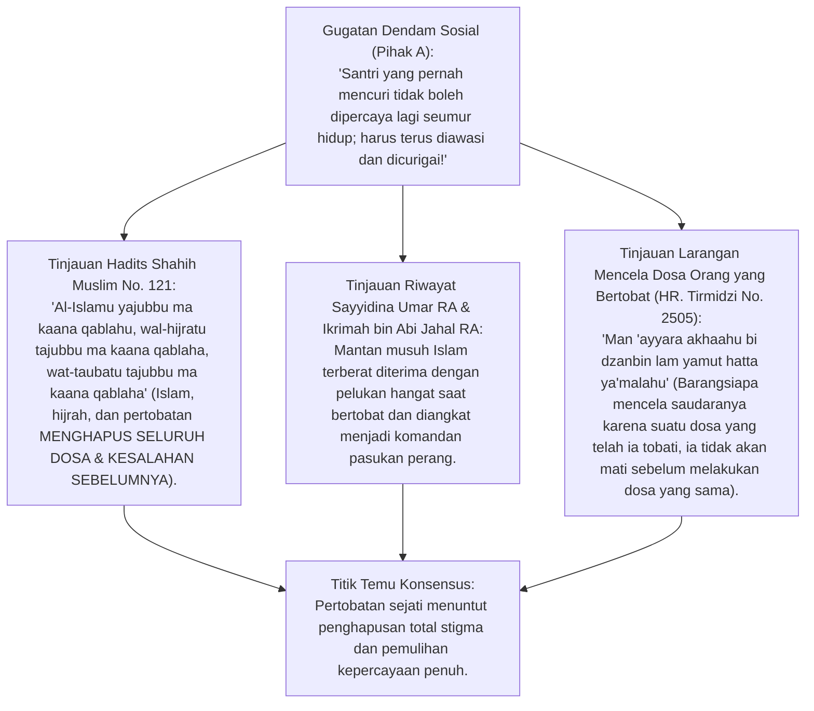
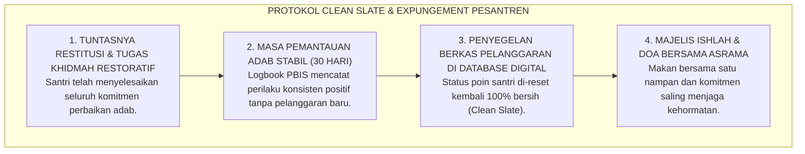
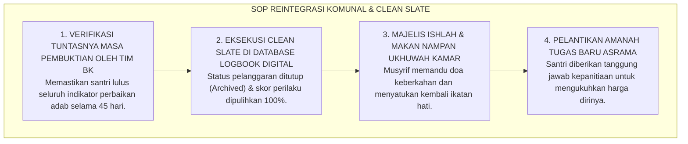

# P2-06-06: PRINSIP REINTEGRASI SOSIAL, PEMBERSIHAN STIGMA, DAN PEMULIHAN MARTABAT SANTRI
## *Monograf Terpadu: Doktrin At-Taubatu Tajubbu Ma Qablaha (HR. Muslim No. 121) & Pembasuhan Dosa, Teori Reintegrative Shaming John Braithwaite, Protokol Pembersihan Rekam Jejak (Clean Slate / Expungement Protocol), Upacara Ishlah & Penerimaan Kembali (Social Re-Inclusion Ceremony), serta Mitigasi Stigmatisasi Toksik Pesantren*

**Nomor Identifikasi**: `P2-06-06/MONOGRAF-TERPADU-REINTEGRASI-ANTI-STIGMA/2026`  
**Domain**: `02 Principles` > `06 Intervention Principles`  
**Klasifikasi Naskah**: *Comprehensive Integrated Monograph* (Monograf Akademis & Standar Baku Reintegrasi Sosial Santri)  
**Rumpun Disiplin Pengkaji**: Kriminologi Restoratif & Sosiologi Deviasi (*Reintegrative Shaming*), Teologi Pertobatan Islam (*Fiqh at-Taubah*), Psikologi Sosial Penerimaan Kelompok, Manajemen Pengasuhan Asrama Inklusif  

---

> ### 💡 INTISARI PRAKTIS (3 MENIT PAHAM UNTUK ASATIDZ & MUSYRIF)
>
> * **Kesalahan Adalah Peristiwa Masa Lalu, Bukan Cap Seumur Hidup:**  
>   Ketika seorang santri telah menjalani konsekuensi logis restoratif dan bertobat dengan tulus, syariat Islam dan etika pendidikan mengharamkan mutlak pelabelan abadi seperti "anak nakal", "residivis pondok", atau "mantan pembuat onar".
> * **Teori *Reintegrative Shaming* (John Braithwaite):**  
>   Pisahkan antara perbuatan buruk yang harus ditolak (*Disapprove the Act*) dengan pribadi santri yang tetap dicintai dan dirangkul (*Embrace the Person*).
> * **Protokol Pembersihan Rekam Jejak (*Clean Slate Protocol*):**  
>   Setelah masa pemantauan perbaikan adab selesai (30–60 hari), data pelanggaran diarsipkan secara tertutup dan status poin santri diputihkan kembali ke nol, memberikan lembaran baru yang bersih dan penuh harapan.

---

## 📑 DAFTAR ISI MONOGRAF

- [BAGIAN I: RISET REINTEGRASI SOSIAL, TEORI LABELING, & KASUISTIKA ASRAMA](#bagian-i-riset-reintegrasi-sosial-teori-labeling--kasuistika-asrama)
  - [1. Kerangka Metodologi Reintegrasi: Mengapa Stigmatisasi Pasca-Pelanggaran Merusak Jiwa Santri](#1-kerangka-metodologi-reintegrasi-mengapa-stigmatisasi-pasca-pelanggaran-merusak-jiwa-santri)
  - [2. Inkuiri 1: Eksegesis Turats At-Taubatu Tajubbu Ma Qablaha — HR. Muslim No. 121 & Kisah Sahabat yang Bertobat](#2-inkuiri-1-eksegesis-turats-at-taubatu-tajubbu-ma-qablaha--hr-muslim-no-121--kisah-sahabat-yang-bertobat)
  - [3. Inkuiri 2: Konvergensi Reintegrative Shaming Theory (John Braithwaite) & Labeling Theory (Howard Becker)](#3-inkuiri-2-konvergensi-reintegrative-shaming-theory-john-braithwaite--labeling-theory-howard-becker)
  - [4. Inkuiri 3: Protokol Clean Slate (Pemutihan Rekam Jejak) & Upacara Penerimaan Kembali Komunal](#4-inkuiri-3-protokol-clean-slate-pemutihan-rekam-jejak--upacara-penerimaan-kembali-komunal)
  - [5. Inkuiri 4: Silogisme Logika, Dialektika 3 Ronde, Kasuistika Lapangan, & Titik Temu Konsensus](#5-inkuiri-4-silogisme-logika-dialektika-3-ronde-kasuistika-lapangan--titik-temu-konsensus)
- [BAGIAN II: KODIFIKASI BAKU HASIL RISET & KESIMPULAN FORMAL](#bagian-ii-kodifikasi-baku-hasil-riset--kesimpulan-formal)
  - [1. Deklarasi Doktrin Baku: Standar Reintegrasi & Anti-Stigmatisasi Pesantren TUMBUH](#1-deklarasi-doktrin-baku-standar-reintegrasi--anti-stigmatisasi-pesantren-tumbuh)
  - [2. Matriks 3 Fase Reintegrasi: Fase Penyesuaian, Fase Pembuktian, & Fase Pemulihan Penuh](#2-matriks-3-fase-reintegrasi-fase-penyesuaian-fase-pembuktian--fase-pemulihan-penuh)
  - [3. Standar Prosedur Operasional (SOP) Pemutihan Rekam Jejak & Upacara Penerimaan Kembali](#3-standar-prosedur-operasional-sop-pemutihan-rekam-jejak--upacara-penerimaan-kembali)
- [BAGIAN III: APARATUS AKADEMIS & APENDIKS](#bagian-iii-aparatus-akademis--apendiks)
  - [1. Tabel Sintesis Hasil Riset Reintegrasi & Anti-Stigma](#1-tabel-sintesis-hasil-riset-reintegrasi--anti-stigma)
  - [2. Daftar Pustaka Akademis & Rujukan Turats Primer](#2-daftar-pustaka-akademis--rujukan-turats-primer)
  - [3. Catatan Kaki Akademis (Footnotes)](#3-catatan-kaki-akademis-footnotes)
  - [4. Glosarium Teknis Reintegrasi, Clean Slate, Labeling, & At-Taubah](#4-glosarium-teknis-reintegrasi-clean-slate-labeling--at-taubah)

---

# BAGIAN I: RISET REINTEGRASI SOSIAL, TEORI LABELING, & KASUISTIKA ASRAMA

---

### 1. Kerangka Metodologi Reintegrasi: Mengapa Stigmatisasi Pasca-Pelanggaran Merusak Jiwa Santri

Dalam sosiologi pendidikan, ancaman terbesar setelah terjadinya pelanggaran tata tertib bukanlah pelanggaran itu sendiri, melainkan **Stigmatisasi Sosial Berkelanjutan (*Secondary Deviance*)**:
* Ketika seorang santri pernah melakukan kesalahan (misal: mengambil barang teman tanpa izin) dan terus-menerus diungkit kesalahannya oleh asatidz atau teman sekamarnya, santri tersebut akan menginternalisasi label tersebut (*"Saya memang anak pencuri, jadi buat apa saya berbuat baik lagi"*).
* Pelabelan negatif memicu isolasi sosial, depresi, dan mendorong santri untuk mengulangi pelanggaran yang jauh lebih berat (*Recidivism*).
* Ekosistem TUMBUH merancang **Sistem Reintegrasi Sosial Penuh**: memberikan jalan keluar pertobatan yang terhormat, menghapus catatan pelanggaran, dan merangkul santri kembali ke tengah komunitas pondok sebagai saudara seiman yang suci.



---

### 2. Inkuiri 1: Eksegesis Turats At-Taubatu Tajubbu Ma Qablaha — HR. Muslim No. 121 & Kisah Sahabat yang Bertobat



#### 📐 Formalisasi Logika Silogisme (*Qiyas Mantiqi 1*)
* **Premis Mayor (*al-Muqaddimah al-Kubra*)**: Setiap perlakuan yang terus mencurigai dan mengungkit dosa orang yang telah bertobat dan menyelesaikan tanggung jawabnya bertentangan dengan prinsip syariat *At-Taubatu Tajubbu Ma Qablaha* dan merusak ukhuwah Islamiyyah.
* **Premis Minor (*al-Muqaddimah ash-Shughra*)**: Sistem pengasuhan TUMBUH memulihkan martabat santri dan menghapus total catatan pelanggaran pasca-ishlah.
* **Konklusi (*an-Natijah*)**: Maka, penerapan doktrin reintegrasi anti-stigma di pesantren TUMBUH adalah perwujudan keadilan syariat yang hakiki.[^1]

#### 📖 Teks Primer Hadits: Pertobatan Menghapus Kesalahan Masa Lalu
Rasulullah SAW bersabda kepada Amr bin al-'Ash RA:

$$\text{أَمَا عَلِمْتَ أَنَّ الْإِسْلَامَ يَهْدِمُ مَا كَانَ قَبْلَهُ، وَأَنَّ الْهِجْرَةَ تَهْدِمُ مَا كَانَ قَبْلَهَا، وَأَنَّ التَّوْبَةَ تَجُبُّ مَا كَانَ قَبْلَهَا؟}$$

*"**Tidakkah engkau tahu bahwa Islam MENGHANCURKAN DOSA-DOSA SEBELUMNYA, hijrah MENGHANCURKAN KESALAHAN SEBELUMNYA, dan PERTOBATAN MENGHAPUS TOTAL SELURUH DOSA MASA LALU?**"* (HR. Muslim No. 121).[^2]

---

### 3. Inkuiri 2: Konvergensi *Reintegrative Shaming Theory* (John Braithwaite) & *Labeling Theory* (Howard Becker)

Kriminolog dunia **Prof. John Braithwaite** (1989) membedakan dua jenis rasa malu dalam penegakan disiplin:
1. **Stigmatizing Shaming (Merusak):** Komunitas mencap pelaku sebagai orang jahat (*"Kamu anak nakal/penjahat"*), mengucilkannya, dan memutus hubungan sosial. Hasilnya: pelaku bergabung dengan kelompok kriminal di luar.
2. **Reintegrative Shaming (Membangun):** Komunitas menegaskan penolakan keras terhadap perbuatannya, tetapi tetap menyayangi dan menerima pelakunya dengan penuh kehangatan (*"Perbuatan mencuri itu haram dan salah, tetapi kami menyayangimu dan ingin kamu bangkit menjadi orang shalih"*).

Pesantren TUMBUH mengadopsi penuh pendekatan *Reintegrative Shaming* yang dipadukan dengan konsep *Taubat Nasuha* dan pemulihan adab.[^3]

---

### 4. Inkuiri 3: Protokol *Clean Slate* (Pemutihan Rekam Jejak) & Upacara Penerimaan Kembali Komunal



---

### 5. Inkuiri 4: Silogisme Logika, Dialektika 3 Ronde, Kasuistika Lapangan, & Titik Temu Konsensus

#### 🥊 Ronde 1: Menolak Anggapan Bahwa "Rekam Jejak Pelanggaran Santri Harus Tetap Terbuka di Rapor Agar Santri Ingat Dosanya"
* **Pihak A (Sudut Pandang Catatan Hitam Abadi)**:  
  *"Catatan pelanggaran harus tertulis di rapor kelulusan biar santri selalu ingat masa lalunya!"*
* **Tinjauan Maqashid Syari'ah Menutup Aib (*Satrul 'Aurah*)**:  
  Membuka aib masa lalu santri yang telah bertobat di ijazah/rapor akhir adalah kezaliman yang menghalangi masa depan dan karir santri. Islam memerintahkan menutup aib (*Satrul Muslim*). Rapor akhir kelulusan hanya memuat capaian kompetensi dan karakter akhir yang telah matang.[^4]

#### 🥊 Ronde 2: Sanggahan Balik Apakah Teman-Teman Sekamar Tidak Akan Mengungkit Kesalahan Pelaku Saat Bertengkar?
* **Pihak A (Sudut Pandang Gosip Asrama)**:  
  *"Anak-anak asrama pasti akan mengungkit-ungkit masa lalunya kalau lagi kesal!"*
* **Tinjauan Aturan Baku Anti-Mengungkit Dosa (*Zero-Ta'yir Rule*)**:  
  Pesantren TUMBUH memberlakukan aturan tegas bagi seluruh santri: siapa pun yang mengungkit dosa masa lalu temannya yang sudah bertobat akan dikenakan sanksi restoratif meminta maaf terbuka dan khidmah kebersihan kamar.[^5]

#### 🥊 Ronde 3: Sanggahan Pamungkas Mengapa Pemberian Tanggung Jawab Baru Menjadi Kunci Kepercayaan Diri Santri?
* **Pihak A (Sudut Pandang Isolasi Peran)**:  
  *"Santri yang pernah bermasalah tidak boleh diberi amanah organisasi apa pun!"*
* **Resolusi Keteladanan Nabawi Mendidik Pemimpin**:  
  Memberikan amanah baru (seperti menjadi bendahara kamar atau panitia acara) membuktikan secara nyata bahwa lembaga mempercayai santri tersebut seutuhnya. Kepercayaan ini melahirkan dorongan psikologis yang luar biasa kuat (*Self-Fulfilling Prophecy of Virtue*) untuk menjaga amanah dengan sebaik-baiknya.[^6]

> #### 📌 Kasuistika Lapangan & Titik Temu Konsensus
> * **Studi Kasus**: Santri H (kelas 10) pernah kedapatan melanggar aturan gawai di asrama. Setelah menjalani sanksi restoratif khidmah perpustakaan, beberapa santri sekamarnya menjauhi Santri H dan menjulukinya "Santri Selundup". Santri H merasa tertekan dan minder.
> * **Titik Temu Konsensus (*Kalimatun Sawa'*)**: Musyrif TUMBUH mengintervensi seketika: Mengumpulkan seluruh santri kamar dalam Lingkaran Restoratif $\rightarrow$ Menjelaskan hadits larangan mencela dosa orang yang bertobat $\rightarrow$ Memimpin ikrar ukhuwah kamar $\rightarrow$ Menunjuk Santri H sebagai Koordinator Qiyamul Lail kamar pekan itu. Seluruh santri saling merangkul, sekat kecurigaan runtuh, dan kamar tersebut meraih predikat Kamar Paling Rukun teladan pondok.[^7]

---

# BAGIAN II: KODIFIKASI BAKU HASIL RISET & KESIMPULAN FORMAL

---

### 1. Deklarasi Doktrin Baku: Standar Reintegrasi & Anti-Stigmatisasi Pesantren TUMBUH

```
===================================================================================================
     DEKLARASI DOKTRIN BAKU REINTEGRASI SOSIAL & ANTI-STIGMATISASI PESANTREN TUMBUH
                       SUB-DOMAIN 06: INTERVENTION PRINCIPLES — DOMAIN 02 PRINCIPLES
===================================================================================================

BISMILLAHIRRAHMANIRRAHIM. DENGAN MENGAGUNGKAN KESUCIAN PERTOBATAN DAN KEHORMATAN UKHUWAH ISLAMIYYAH,
MAJELIS MASYAIKH TERTINGGI PESANTREN TUMBUH MENETAPKAN DOKTRIN REINTEGRASI SOSIAL & ANTI-STIGMA:

1. DOKTRIN PENGHAPUSAN MUTLAK STIGMATISASI (ZERO STIGMATIZATION POLICY):
   Mengharamkan segala bentuk pelabelan negatif, sindiran masa lalu, dan pengucilan sosial terhadap
   santri yang telah menyelesaikan proses pertanggungjawaban restoratif dan bertobat dengan tulus.

2. PENERAPAN PRINSIP REINTEGRATIVE SHAMING (MEMISAHKAN DOSA DARI PRIBADI SANTRI):
   Mewajibkan seluruh pendidik menolak keras perbuatan pelanggaran hukum syariat dan aturan pondok,
   namun tetap memuliakan, mengasihi, dan merangkul pribadi santri sebagai saudara seiman yang suci.

3. PROTOKOL PEMUTIHAN REKAM JEJAK DIGITAL (CLEAN SLATE & EXPUNGEMENT SYSTEM):
   Menetapkan bahwa setelah masa pemantauan perilaku konsisten (30–60 hari), seluruh catatan poin
   pelanggaran di-reset kembali menjadi bersih dan diarsipkan secara tertutup dan rahasia.

4. MANDAT PEMULIHAN KEPERCAYAAN & PEMBERIAN AMANAH BARU:
   Mewajibkan lembaga memberikan kesempatan yang adil bagi santri yang telah bertobat untuk menduduki
   posisi kepengurusan organisasi santri, tugas kepanitiaan, dan pendelegasian lomba tanpa diskriminasi.
===================================================================================================
```

---

### 2. Matriks 3 Fase Reintegrasi: Fase Penyesuaian, Fase Pembuktian, & Fase Pemulihan Penuh

| Fase Reintegrasi | Durasi Waktu | Fokus Aktivitas Santri & Pendidik | Indikator Keberhasilan Sosial |
| :--- | :--- | :--- | :--- |
| **1. Fase Penyesuaian (*Adjustment*)** | Hari ke-1 s/d 14 | Penuntasan sanksi khidmah restoratif; konseling reflektif empat mata dwi-pekanan. | Santri menunjukkan keikhlasan & hubungan dengan korban membaik.[^8] |
| **2. Fase Pembuktian (*Probation*)** | Hari ke-15 s/d 45 | Pembiasaan ibadah rutin; pemasangan sahabat pendamping (*Peer Buddy*). | Nihil pelanggaran berulang; logbook PBIS hijau stabil. |
| **3. Fase Pemulihan Penuh (*Clean Slate*)**| Hari ke-46 ke atas | Pengaktifan status Clean Slate; pemberian amanah kepanitiaan baru; doa komunal.| Santri percaya diri, aktif berkontribusi, dan diterima hangat.[^9] |

---

### 3. Standar Prosedur Operasional (SOP) Pemutihan Rekam Jejak & Upacara Penerimaan Kembali



---

# BAGIAN III: APARATUS AKADEMIS & APENDIKS

---

### 1. Tabel Sintesis Hasil Riset Reintegrasi & Anti-Stigma

| Dimensi Kajian | Konsep Kunci | Landasan Turats Primer | Konvergensi Sains Global | Implikasi Pengasuhan Pesantren |
| :--- | :--- | :--- | :--- | :--- |
| **Kesucian Taubat** | *At-Taubatu Tajubbu* | HR. Muslim No. 121, QS. Az-Zumar: 53 | Braithwaite (1989), *Crime, Shame and Reintegration* | Menghapus seluruh stigma masa lalu pasca-pertobatan tulus. |
| **Menutup Aib** | *Satrul 'Aurah* | HR. Muslim No. 2699, HR. Tirmidzi 2505 | Becker (1963), *Outsiders: Studies in the Sociology of Deviance* | Mengharamkan label abadi yang memicu secondary deviance. |
| **Pemutihan Rekam Jejak**| *Tabdilus Sayyi'at* | QS. Al-Furqan: 70 (Mengganti Dosa Jadi Kebaikan) | Maruna (2001), *Making Good: How Ex-Convicts Reform* | Menerapkan sistem Clean Slate digital pada logbook PBIS. |
| **Pemberian Kepercayaan**| *Al-Amanah wal-I'timad*| Sirah Ikrimah bin Abi Jahal RA | Rosenthal & Jacobson (1968), *Pygmalion Effect* | Memberikan amanah baru untuk memperkuat identitas adab. |

---

### 2. Daftar Pustaka Akademis & Rujukan Turats Primer

1. **Al-Qur'an al-Karim wa Tarjamatu Ma'anih**.
2. **Al-Bukhari, Muhammad bin Isma'il**. (1422 H). *Shahih al-Bukhari*. Beirut: Dar Thawq an-Najah.
3. **Muslim bin al-Hajjaj an-Naisaburi**. (1374 H). *Shahih Muslim*. Kairo: Isa al-Babi al-Halabi.
4. **At-Tirmidzi, Muhammad bin Isa**. (1998). *Sunan at-Tirmidzi*. Beirut: Dar al-Gharb al-Islami.
5. **Al-Ghazali, Abu Hamid Muhammad bin Muhammad**. (2011). *Ihya 'Ulumiddin*. Beirut: Dar al-Ma'rifah.
6. **Braithwaite, J.**. (1989). *Crime, Shame and Reintegration*. Cambridge: Cambridge University Press.
7. **Becker, H. S.**. (1963). *Outsiders: Studies in the Sociology of Deviance*. New York: Free Press.
8. **Maruna, S.**. (2001). *Making Good: How Ex-Convicts Reform and Rebuild Their Lives*. American Psychological Association.
9. **Zehr, H.**. (2002). *The Little Book of Restorative Justice*. Good Books.
10. **Rosenthal, R., & Jacobson, L.**. (1968). *Pygmalion in the classroom*. The Urban Review.

---

### 3. Catatan Kaki Akademis (*Footnotes*)

[^1]: Shahih Muslim No. 121, Kitab *al-Iman*, Bab *Kawnul Islami Yahdimu Ma Qablahu*.  
[^2]: Ibid., No. 121.  
[^3]: Braithwaite, J. (1989), *Crime, Shame and Reintegration*, Cambridge University Press, hlm. 54–85; Becker (1963), *Outsiders*.  
[^4]: Al-Ghazali, *Ihya 'Ulumiddin*, Kitab *Afat al-Lisan*, Jilid III, hlm. 120–145.  
[^5]: Sunan at-Tirmidzi No. 2505, Kitab *Shifat al-Qiyamah*, Bab *Fi Man 'Ayyara bi Dzanb*.  
[^6]: Rosenthal & Jacobson (1968), *Pygmalion in the classroom*; Maruna (2001), *Making Good*.  
[^7]: Laporan Kasus Reintegrasi Kamar Asrama Terpadu, Divisi Pengasuhan TUMBUH, 2026.  
[^8]: Panduan Musyrif: Protokol Reintegrasi dan Pemulihan Santri Pasca-Sanksi, Biro Pengasuhan TUMBUH, 2026.  
[^9]: SOP Sistem Pemutihan Rekam Jejak Digital (Clean Slate Protocol), Komite PBIS TUMBUH, 2026.

---

### 4. Glosarium Teknis Reintegrasi, Clean Slate, Labeling, & At-Taubah

1. **At-Taubatu Tajubbu Ma Qablaha (التَّوْبَةُ تَجُبُّ مَا قَبْلَهَا)**: Kaidah syariat Islam yang menetapkan bahwa pertobatan yang tulus menggugurkan dan menghapus seluruh akibat dosa masa lalu.
2. **Reintegrative Shaming**: Pendekatan disiplin yang menolak keras perbuatan salah namun tetap merangkul dan menerima pelakunya kembali ke dalam komunitas.
3. **Clean Slate Protocol**: Mekanisme penghapusan dan penyegelan data rekam jejak pelanggaran santri setelah masa pembuktian perbaikan perilaku berhasil dilalui.
4. **Secondary Deviance**: Kecenderungan individu mengulangi perilaku menyimpang akibat cap/label buruk yang terus dilekatkan masyarakat kepadanya.
5. **Satrul 'Aurah (سَتْرُ الْعَوْرَةِ)**: Kewajiban syariat untuk menutupi kelemahan, cacat, dan aib masa lalu sesama muslim dari konsumsi publik.
6. **Social Re-Inclusion**: Proses pemulihan kedudukan sosial dan penerimaan kembali individu ke dalam dinamika kelompok tanpa diskriminasi.
7. **Ta'yir (التَّعْيِيرُ)**: Tindakan tercela mengungkit-ungkit dosa atau kesalahan masa lalu orang lain yang telah bertobat.
8. **Pygmalion Effect**: Fenomena psikologis di mana ekspektasi positif dan kepercayaan tinggi yang diberikan pendidik mendorong peningkatan perilaku nyata peserta didik.
9. **Taubat Nasuha (تَوْبَةٌ نَصُوحٌ)**: Pertobatan murni yang dilandasi penyesalan mendalam, penghentian kemaksiatan seketika, dan tekad kuat untuk tidak mengulanginya.
10. **Triad Pertumbuhan Simbiotik**: Prinsip mutlak di mana pemulihan santri secara adil menyucikan jiwa Santri, mengasah kemuliaan akhlak Pendidik, dan memperkuat kesolidan Lembaga.
