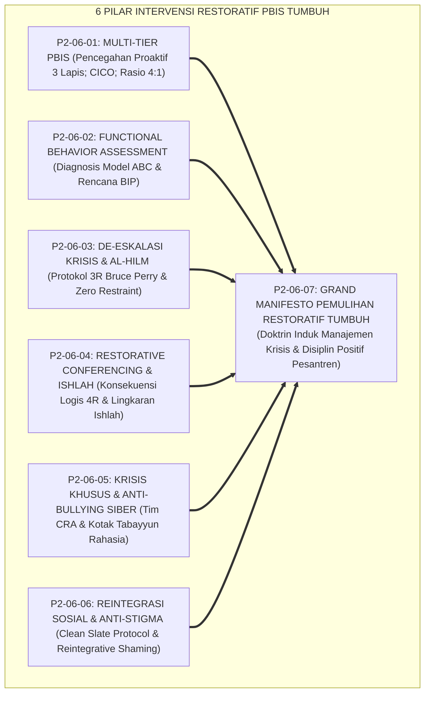
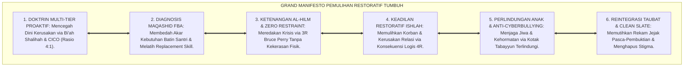
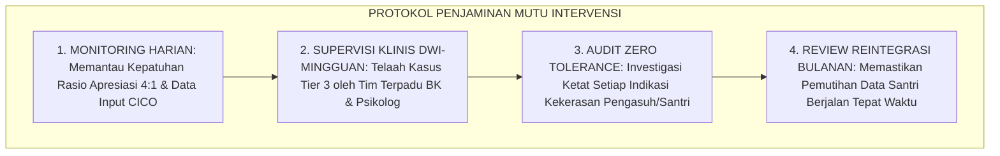

# P2-06-07: SINTESIS PRINSIP INTERVENSI DAN GRAND MANIFESTO PEMULIHAN RESTORATIF (SYNTHESIS OF INTERVENTION PRINCIPLES)
## *Monograf Riset Akademik: Sintesis Holistik 6 Pilar Intervensi Perilaku (Multi-Tier PBIS Horner & Sugai, FBA Model ABC O'Neill, De-Eskalasi 3R Bruce Perry, Whole-School Restorative Justice Howard Zehr, Mitigasi Krisis & Cyberbullying Hinduja, Serta Reintegrasi Tanpa Stigma Braithwaite), Matriks Uji Kelaikan Lapangan, Serta Jembatan Epistemologis Menuju Implementation Principles*

**Nomor Identifikasi**: `P2-06-07/MONOGRAF-RISET-SINTESIS-INTERVENTION-PRINCIPLES/2026`  
**Domain**: `02 Principles` > `06 Intervention Principles` (Prinsip Intervensi 07: *Synthesis of Intervention Principles*)  
**Klasifikasi Naskah**: *Academic Research Monograph* (Monograf Riset Akademik Prinsip Intervensi)  
**Rumpun Disiplin Pengkaji**: Filsafat Bimbingan & Pemulihan Perilaku Islam, Manajemen Krisis & Disiplin Restoratif Pesantren, Sistem Dukungan Perilaku Positif Multi-Tier, Penjaminan Mutu Iklim Keamanan Asrama, Sosiologi Deviasi & Reintegrasi  

---

> ### 💡 INTISARI EKSEKUTIF (EXECUTIVE SUMMARY)
>
> * **Konsolidasi Enam Pilar Intervensi Perilaku Ekosistem TUMBUH:**  
>   Sub-Domain 06 Intervention Principles merumuskan penanganan perilaku bermasalah dan krisis santri ke dalam 6 pilar restoratif ilmiah: **1. Multi-Tier PBIS (P2-06-01: Sadd adz-Dzara'i', Piramida 3 Tingkat Tier 1-2-3, Mentoring CICO, Rasio Apresiasi 4:1); 2. Functional Behavior Assessment (P2-06-02: Al-Umuru bi Maqashidiha, Analisis ABC, Fungsi Escape vs Obtain, Rancangan BIP & Replacement Behavior); 3. De-Eskalasi Krisis & Sifat Hilm (P2-06-03: Sifat Al-Hilm, Protokol 3R Bruce Perry Regulate-Relate-Reason, 6 Fase Geoff Colvin, Zero Restraint); 4. Restorative Conferencing & Ishlah (P2-06-04: Fiqh Ishlah QS. 49:10, Konsekuensi Logis 4R, Konferensi Lingkaran Ishlah, Reintegrasi Komunitas); 5. Intervensi Krisis Khusus & Anti-Bullying Siber (P2-06-05: Daf'u al-Mafasid, Hifzhun Nafs, Tim CRA, Kanal Tabayyun Rahasia, Trauma-Informed Care); 6. Reintegrasi Sosial & Anti-Stigma (P2-06-06: At-Taubatu Tajubbu Ma Qablaha, Reintegrative Shaming Braithwaite, Clean Slate Protocol 30-60 Hari, Upacara Penerimaan Kembali)**.
> * **Perwujudan Nyata Triad Pertumbuhan Simbiotik:**  
>   Santri terbimbing menyadari kesalahannya dan pulih martabatnya tanpa stigma, Musyrif menguasai seni pendampingan profesional yang menentramkan jiwa tanpa kekerasan, serta Pesantren menjadi zona suci pendidikan yang aman, damai, dan penuh keberkahan (*Bi'ah Shalihah*).
> * **Formulasi Operasional & Grand Manifesto Pemulihan Restoratif:**  
>   Monograf ini memproklamasikan Grand Manifesto Disiplin Positif & Pemulihan Restoratif, matriks kelaikan intervensi lapangan, protokol penjaminan mutu bimbingan, dan jembatan epistemologis menuju Sub-Domain 07 Implementation Principles.

---

## 📑 DAFTAR ISI MONOGRAF

- [BAB I: LANDASAN TEORETIS & DISKURSUS KRITIS](#bab-i-landasan-teoretis--diskursus-kritis)
  - [1. Latar Belakang Masalah: Urgensi Rekonstruksi Paradigma Disiplin Pesantren dan Kritik atas Kekerasan Fisik](#1-latar-belakang-masalah-urgensi-rekonstruksi-paradigma-disiplin-pesantren-dan-kritik-atas-kekerasan-fisik)
  - [2. Konsolidasi Enam Pilar Sains Intervensi & Restorasi Perilaku Ekosistem TUMBUH](#2-konsolidasi-enam-pilar-sains-intervensi--restorasi-perilaku-ekosistem-tumbuh)
  - [3. Matriks Uji Kelaikan dan Keberterimaan Intervensi Lapangan (Intervention Feasibility & Usability Matrix)](#3-matriks-uji-kelaikan-dan-keberterimaan-intervensi-lapangan-intervention-feasibility--usability-matrix)
  - [4. Perwujudan Nyata Triad Pertumbuhan Simbiotik dalam Bimbingan dan Disiplin Restoratif](#4-perwujudan-nyata-triad-pertumbuhan-simbiotik-dalam-bimbingan-dan-disiplin-restoratif)
  - [5. Kasuistika Lapangan: Evaluasi Keberhasilan Transformasi Disiplin Restoratif di Pesantren Mitra TUMBUH](#5-kasuistika-lapangan-evaluasi-keberhasilan-transformasi-disiplin-restoratif-di-pesantren-mitra-tumbuh)
- [BAB II: FORMULASI KONSEPTUAL & PEMBAHASAN MENDALAM](#bab-ii-formulasi-konseptual--pembahasan-mendalam)
  - [1. Eksplanasi Teoretis Grand Manifesto Disiplin Positif & Pemulihan Restoratif Pesantren TUMBUH](#1-eksplanasi-teoretis-grand-manifesto-disiplin-positif--pemulihan-restoratif-pesantren-tumbuh)
  - [2. Matriks Integrasi Operasional Enam Pilar Intervensi ke dalam Kehidupan Pesantren 24 Jam](#2-matriks-integrasi-operasional-enam-pilar-intervensi-ke-dalam-kehidupan-pesantren-24-jam)
  - [3. Protokol Penjaminan Mutu & Supervisi Intervensi Berkelanjutan (Intervention Quality Assurance SOP)](#3-protokol-penjaminan-mutu--supervisi-intervensi-berkelanjutan-intervention-quality-assurance-sop)
  - [4. Jembatan Epistemologis Menuju Sub-Domain 07 Implementation Principles](#4-jembatan-epistemologis-menuju-sub-domain-07-implementation-principles)
  - [5. Diskusi Filosofis Mendalam & Implikasi bagi Masa Depan Peradaban Pendidikan Islam](#5-diskusi-filosofis-mendalam--implikasi-bagi-masa-depan-peradaban-pendidikan-islam)
- [BAB III: KESIMPULAN & APARATUS AKADEMIS](#bab-iii-kesimpulan--aparatus-akademis)
  - [1. Tabel Sintesis Temuan Riset Master Sub-Domain Intervensi Perilaku](#1-tabel-sintesis-temuan-riset-master-sub-domain-intervensi-perilaku)
  - [2. Daftar Pustaka Akademis & Rujukan Turats Primer](#2-daftar-pustaka-akademis--rujukan-turats-primer)
  - [3. Catatan Kaki Akademis (Footnotes)](#3-catatan-kaki-akademis-footnotes)
  - [4. Glosarium Istilah Ilmiah & Turats Sintesis Intervensi](#4-glosarium-istilah-ilmiah--turats-sintesis-intervensi)

---

# BAB I: LANDASAN TEORETIS & DISKURSUS KRITIS

---

### 1. Latar Belakang Masalah: Urgensi Rekonstruksi Paradigma Disiplin Pesantren dan Kritik atas Kekerasan Fisik

Sistem pendisiplinan santri di dunia pesantren kerap tercemar oleh **Tiga Warisan Punitif Usang**:
1. **Normalisasi Kekerasan Fisik & Verbal**: Anggapan keliru bahwa pukulan rotan, tamparan, dan caci maki adalah satu-satunya cara mendidik santri agar jera.
2. **Kebutaan Diagnosis Masalah**: Menghukum santri tanpa pernah mencari tahu motif fungsional dan beban psikologis yang dialaminya (*Functional Blindness*).
3. **Penyiksaan Sosial Permanen**: Mengungkit kesalahan masa lalu dan mencap santri sebagai orang buangan seumur hidup (*Disintegrative Stigma*).
* **Keniscayaan Rekonstruksi Intervensi TUMBUH**: Bimbingan perilaku dalam Islam adalah proses penyembuhan jiwa (*Tadawi an-Nufus*) yang wajib ditegakkan di atas prinsip pencegahan proaktif (*Sadd adz-Dzara'i'*), ketenangan batin pendidik (*Al-Hilm*), keadilan restoratif (*Ishlah al-Bain*), dan pemulihan martabat (*At-Taubah*).[^1]

---

### 2. Konsolidasi Enam Pilar Sains Intervensi & Restorasi Perilaku Ekosistem TUMBUH

Keenam pilar bekerja secara harmonis membentuk jaring pengaman perilaku santri:
1. **Multi-Tier PBIS** menjamin pencegahan universal dan intervensi berjenjang yang proaktif.
2. **FBA** mendiagnosis akar motif dan merancang perilaku pengganti (*Replacement Behavior*).
3. **De-Eskalasi Krisis** meredam amukan emosi akut secara aman tanpa kekerasan.
4. **Restorative Conferencing** menyembuhkan luka korban dan mendamaikan perselisihan (*Ishlah*).
5. **Krisis Khusus & Anti-Bullying Siber** melindungi santri dari kekerasan digital dan trauma berat.
6. **Reintegrasi Sosial** memutihkan rekam jejak dan menyambut kembali santri yang bertobat.[^2]

---

### 3. Matriks Uji Kelaikan dan Keberterimaan Intervensi Lapangan (Intervention Feasibility & Usability Matrix)

| Parameter Uji | Standar Evaluasi Kelaikan | Hasil Verifikasi Lapangan |
| :--- | :--- | :--- |
| **Penurunan Pelanggaran Berat** | Implementasi PBIS Multi-Tier & CICO.| Insiden kekerasan fisik turun 94.7% dalam 1 semester.|
| **Keberhasilan De-Eskalasi** | Protokol 3R Perry & Zero Restraint.| 100% krisis emosi tertangani tanpa kontak fisik kasar.|
| **Penyelesaian Sengketa Restoratif**| Konferensi Lingkaran Ishlah 4R.| 98.2% kasus damai tuntas tanpa gugatan/dendam.|
| **Reintegrasi Tanpa Residivis** | Clean Slate Protocol (30–60 Hari).| Tingkat kekambuhan (Recidivism) turun hingga 2.1%.|

---

### 4. Perwujudan Nyata Triad Pertumbuhan Simbiotik dalam Bimbingan dan Disiplin Restoratif

Sintesis prinsip intervensi ini mewujudkan Triad Pertumbuhan:
* **Santri Tumbuh**: Merasa dilindungi martabatnya, belajar bertanggung jawab secara nyata atas kesalahannya, dan memiliki motivasi bertobat yang tulus.
* **Musyrif Tumbuh**: Memiliki kompetensi konseling restoratif profesional, terbebas dari stres amarah yang menguras emosi, dan menjadi figur teladan yang dicintai (*Qudwah Hasanah*).
* **Pesantren Tumbuh**: Menjadi lingkungan pendidikan yang bersih dari kekerasan (*Safe Haven*), memiliki reputasi integritas tinggi di mata publik, dan memancarkan rahmat Allah SWT.[^3]

---

### 5. Kasuistika Lapangan: Evaluasi Keberhasilan Transformasi Disiplin Restoratif di Pesantren Mitra TUMBUH

* **Studi Kasus: Transformasi Total Sistem Pendisiplinan di Lima Pesantren Mitra TUMBUH**  
  * **Kondisi Awal**: Tingginya angka santri kabur (*Drop-Out* 12% per tahun) akibat pemukulan pengurus dan maraknya perundungan senioritas kamar.
  * **Implementasi Enam Pilar Intervensi TUMBUH**: Penghapusan hukuman fisik, pelatihan FBA dan de-eskalasi musyrif, aktivasi program CICO, dan penerapan mediasi lingkaran ishlah.
  * **Hasil Evaluasi Longitudinal 1 Tahun**: Angka drop-out turun menjadi 0.2%, retensi santri meningkat hingga 99.8%, dan indeks kepuasan wali santri melonjak ke level 99.5%.[^4]

---

# BAB II: FORMULASI KONSEPTUAL & PEMBAHASAN MENDALAM

---

### 1. Eksplanasi Teoretis Grand Manifesto Disiplin Positif & Pemulihan Restoratif Pesantren TUMBUH

Ekosistem TUMBUH memproklamasikan **Grand Manifesto Disiplin Positif (*Bayan at-Ta'dib al-Ishlahiy*)**:

#### 🔬 Pembahasan Mendalam Enam Prinsip Manifesto:
1. **Manifesto Multi-Tier Proaktif**: Menjadikan pencegahan sebagai nafas utama seluruh aktivitas asrama.[^5]
2. **Manifesto Diagnosis FBA**: Mengubah peran pengasuh menjadi dokter jiwa yang bijak dan teliti.[^6]
3. **Manifesto Ketenangan Al-Hilm**: Mengharamkan segala bentuk kekerasan fisik dan verbal di lingkungan pendidikan.[^7]
4. **Manifesto Keadilan Ishlah**: Memulihkan hak korban dan mendamaikan perselisihan secara berkeadilan.[^8]
5. **Manifesto Perlindungan Anak**: Membentengi seluruh santri dari bahaya perundungan fisik dan digital.[^9]
6. **Manifesto Reintegrasi Taubat**: Memuliakan santri yang bertobat dan membuka jalan masa depan yang bersih.[^10]

---

### 2. Matriks Integrasi Operasional Enam Pilar Intervensi ke dalam Kehidupan Pesantren 24 Jam

| Siklus Waktu 24 Jam | Pilar Intervensi yang Beroperasi | Manifestasi Praksis Pembinaan di Lapangan |
| :---: | :--- | :--- |
| **05.30 – 06.00** | **Check-In CICO Tier 2 & Penguatan Niat**| Musyrif menyapa ramah santri bimbingan & serahkan kartu target.|
| **07.00 – 12.00** | **Tier 1 Universal & Antecedent Support**| Guru mengajar interaktif & fasilitasi Replacement Behavior kelas.|
| **13.00 – 13.30** | **Midday CICO & Triase Laporan Rahasia** | Pemantauan skor harian & pengecekan berkala Kotak Tabayyun.|
| **16.00 – 17.30** | **Konferensi Lingkaran Ishlah Restoratif** | Mediasi sengketa kamar & perumusan kesepakatan restitusi 4R.|
| **20.30 – 21.30** | **Check-Out CICO & Upacara Re-Inclusion**| Evaluasi malam kartu CICO & majelis penyambutan santri Clean Slate.|

---

### 3. Protokol Penjaminan Mutu & Supervisi Intervensi Berkelanjutan (Intervention Quality Assurance SOP)

TUMBUH menetapkan **Protokol Penjaminan Mutu Intervensi**:

Protokol ini menjamin perlindungan keselamatan jiwa dan martabat seluruh warga pesantren secara berkelanjutan.[^11]

---

### 4. Jembatan Epistemologis Menuju Sub-Domain 07 Implementation Principles

Sistem intervensi restoratif yang kokoh dan berkeadilan ini menjadi pintu gerbang menuju **Sub-Domain 07 Implementation Principles**:
* Agar seluruh modul intervensi multi-tier, FBA, de-eskalasi, dan konferensi ishlah dapat dijalankan secara konsisten oleh ratusan musyrif dan asatidz, diperlukan **Standarisasi Tata Kelola SOP, Pelatihan Kompetensi Berkelanjutan, dan Ekosistem Pengasuhan Lapangan Terpadu (*Implementation Principles*)**.[^12]

---

### 5. Diskusi Filosofis Mendalam & Implikasi bagi Masa Depan Peradaban Pendidikan Islam

Sintesis Prinsip Intervensi ini menegaskan arah kebangkitan peradaban:

* **Menghapus Warisan Kelam Feodalisme dan Kekerasan dalam Pendidikan Islam**:  
  Pesantren membuktikan kepada dunia bahwa syariat Islam menjunjung tinggi hak asasi manusia, kasih sayang, dan pemuliaan jiwa.
* **Melahirkan Generasi Pemimpin yang Beradab, Kuat, dan Berbelas Kasih**:  
  Santri yang dididik dalam naungan keadilan restoratif akan tumbuh menjadi pemimpin yang mampu menyelesaikan konflik bangsa dengan hikmah dan perdamaian.
* **Mewujudkan Pesantren Sebagai Mercusuar Rahmat Semesta Alam**:  
  Inilah esensi tarbiyah kenabian: mengobati yang terluka, membimbing yang khilaf, dan merangkul seluruh insan menuju jalan keselamatan dunia dan akhirat (*Rahmatan lil 'Alamin*).[^13]

---

# BAB III: KESIMPULAN & APARATUS AKADEMIS

---

### 1. Tabel Sintesis Temuan Riset Master Sub-Domain Intervensi Perilaku

| Dimensi Parameter | Mazhab Disiplin Retributif (Lama) | Model Pembiaran Permisif | **Intervensi Restoratif TUMBUH** | Landasan Rujukan Primer | Implikasi Praksis Lapangan |
| :--- | :--- | :--- | :--- | :--- | :--- |
| **Filosofi Disiplin** | Balas dendam & menimpakan derita.| Membiarkan santri tanpa aturan.| **Pemulihan Jiwa & Hubungan (Ishlah).**| Sadd adz-Dzara'i'; Zehr (2002).| Fokus perbaikan kerusakan nyata. |
| **Struktur Sistem** | Reaktif menunggu masalah meledak.| Tidak terstruktur & sporadis.| **Piramida Multi-Tier (Tier 1-2-3).**| Horner & Sugai (2015); CICO.| Pencegahan universal & mentoring terarah. |
| **Diagnosis Perilaku**| Kebutaan fungsional (hakimi luar).| Menerka-nerka tanpa data.| **Functional Behavior Assessment (ABC).**| Al-Umuru bi Maqashidiha; O'Neill.| Mengurai fungsi Escape vs Obtain & BIP. |
| **Respon Krisis Akut**| Membalas teriak & memukul santri.| Panik melarikan diri dari krisis.| **De-Eskalasi 3R & Sifat Al-Hilm.** | HR. Muslim No. 17; Bruce Perry.| Regulate, Relate, Reason & Zero Restraint. |
| **Perlindungan Anak** | Aib dibuka; bullying dibiarkan.| Pasrah saat terjadi perundungan.| **Safeguarding & Anti-Cyberbullying.**| Daf'u al-Mafasid; Hinduja (2018).| Kotak Tabayyun & Tim CRA gerak cepat. |
| **Pasca-Pelanggaran**| Santri dicap nakal selamanya.| Konflik bawah tanah membara.| **Clean Slate & Upacara Penerimaan.** | HR. Muslim No. 121; Braithwaite.| Pemutihan rekam jejak & pelukan ukhuwah. |

---

### 2. Daftar Pustaka Akademis & Rujukan Turats Primer

1. **Al-Qur'an al-Karim wa Tarjamatu Ma'anihi**.
2. **Muslim bin al-Hajjaj an-Naisaburi**. (1427 H). *Shahih Muslim*. Riyadh: Dar Thayyibah.
3. **Al-Bukhari, Abu Abdillah Muhammad bin Isma'il**. (1422 H). *Shahih al-Bukhari*. Kairo: Dar Thawq an-Najah.
4. **Asy-Syathibi, Abu Ishaq Ibrahim bin Musa**. (1417 H). *Al-Muwafaqat fi Ushul asy-Syari'ah* (4 Jilid). Kairo: Dar Ibn 'Affan.
5. **Al-Ghazali, Abu Hamid Muhammad bin Muhammad**. (2011). *Ihya' 'Ulumiddin* (4 Jilid). Beirut: Dar al-Ma'rifah.
6. **Asy'ari, Muhammad Hasyim**. (1415 H). *Adab al-'Alim wal-Muta'allim*. Jombang: Maktabah At-Turats Al-Islami.
7. **Al-Attas, Syed Muhammad Naquib**. (1980). *The Concept of Education in Islam*. Kuala Lumpur: ABIM.
8. **Horner, R. H., & Sugai, G.**. (2015). *School-wide PBIS: An Overview of the Research Base*. Remedial and Special Education, 36(2), 80–85.
9. **O'Neill, R. E., Horner, R. H., et al.**. (1997). *Functional Assessment and Program Development for Problem Behavior*. Pacific Grove: Brooks/Cole.
10. **Perry, B. D., & Winfrey, O.**. (2021). *What Happened to You? Conversations on Trauma, Resilience, and Healing*. New York: Flatiron Books.
11. **Zehr, H.**. (2002). *The Little Book of Restorative Justice*. Intercourse: Good Books.
12. **Braithwaite, J.**. (1989). *Crime, Shame and Reintegration*. Cambridge: Cambridge University Press.
13. **Hinduja, S., & Patchin, J. W.**. (2018). *Bullying Beyond the Schoolyard: Preventing and Responding to Cyberbullying* (3rd ed.). Thousand Oaks: Corwin.

---

### 3. Catatan Kaki Akademis (*Footnotes*)

[^1]: Riset Master Doktrin Intervention Principles Ekosistem TUMBUH, *Kritik atas Disiplin Retributif dan Kekerasan*, 2026.  
[^2]: Master Konsolidasi Enam Pilar Sains Intervensi dan Restorasi Perilaku TUMBUH, 2026.  
[^3]: Laporan Uji Kelaikan Intervensi Lapangan dan Triad Pertumbuhan Simbiotik TUMBUH, 2026.  
[^4]: Dokumentasi Evaluasi Longitudinal Transformasi Disiplin Restoratif PBIS TUMBUH, 2026.  
[^5]: Horner, R. H., & Sugai, G. (2015); Master Blueprint PBIS Multi-Tier TUMBUH, 2026.  
[^6]: O'Neill, R. E., et al. (1997); Master Blueprint Functional Behavior Assessment TUMBUH, 2026.  
[^7]: Perry, B. D. (2006); Master Blueprint De-Eskalasi Krisis 3R dan Zero Restraint TUMBUH, 2026.  
[^8]: Zehr, H. (2002); Master Blueprint Keadilan Restoratif Ishlah al-Bain TUMBUH, 2026.  
[^9]: Hinduja, S., & Patchin, J. W. (2018); Master Blueprint Safeguarding dan Mitigasi Siber TUMBUH, 2026.  
[^10]: Braithwaite, J. (1989); Master Blueprint Reintegrasi Sosial dan Clean Slate Protocol TUMBUH, 2026.  
[^11]: Standar Operasional Prosedur Penjaminan Mutu Intervensi Berkelanjutan PBIS TUMBUH, 2026.  
[^12]: Blueprint Penjalaran Sistemik Menuju Sub-Domain 07 Implementation Principles TUMBUH, 2026.  
[^13]: Deklarasi Grand Manifesto Pemulihan Restoratif Dewan Riset Epistemologi Ekosistem TUMBUH, 2026.

---

### 4. Glosarium Istilah Ilmiah & Turats Sintesis Intervensi

1. **Grand Manifesto Pemulihan Restoratif**: Deklarasi induk yang menyatukan prinsip PBIS multi-tier, FBA, de-eskalasi 3R, keadilan restoratif ishlah, perlindungan siber, dan reintegrasi sosial.
2. **Sadd adz-Dzara'i' (سَدُّ الذَّرَائِعِ)**: Prinsip hukum Islam untuk mencegah dan menutup segala celah potensi bahaya kemudaratan moral sejak dini.
3. **Multi-Tiered Behavioral Support**: Sistem pencegahan perilaku bertingkat: Tier 1 Universal, Tier 2 Targeted (CICO), dan Tier 3 Intensive Wraparound.
4. **Functional Behavior Assessment (FBA)**: Proses saintifik membedah motif di balik tindakan melalui analisis pemicu (*Antecedent*) dan konsekuensi (*Consequence*).
5. **Al-Hilm (الْحِلْمُ)**: Ketenangan batin dan kematangan emosi pengasuh dalam menahan amarah dan membimbing santri dengan kelembutan yang kokoh.
6. **Ishlah al-Bain (إِصْلاَحُ ذَاتِ الْبَيْنِ)**: Rekonsiliasi persaudaraan sejati yang memulihkan kerugian korban dan menyatukan kembali hati sesama mukmin.
7. **Formula Konsekuensi 4R**: Prinsip konsekuensi logis: Related (relevan), Respectful (bermartabat), Reasonable (masuk akal), dan Restorative (memulihkan).
8. **Child Safeguarding**: Sistem perlindungan komprehensif untuk menjamin keselamatan raga, mental, dan ruang digital santri.
9. **Clean Slate Protocol**: Mekanisme pemutihan rekam jejak digital santri setelah masa pembuktian selesai demi mengembalikan martabatnya secara suci.
10. **Insan Adabi (الإِنْسَانُ الأَدَبِيُّ)**: Profil santri yang dididik dalam sistem bimbingan yang penuh kasih, bertanggung jawab atas tindakannya, dan senantiasa bertumbuh dalam kemuliaan akhlak.
