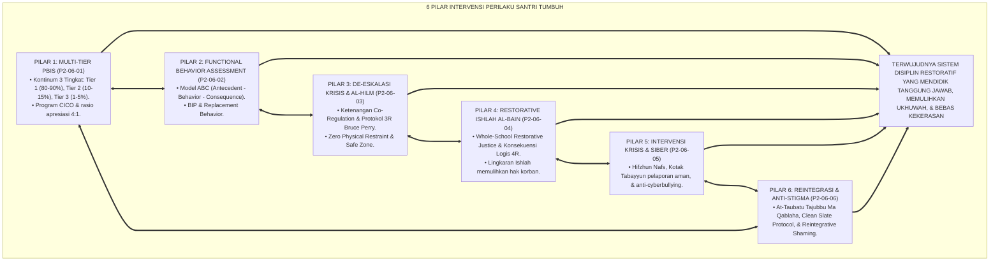
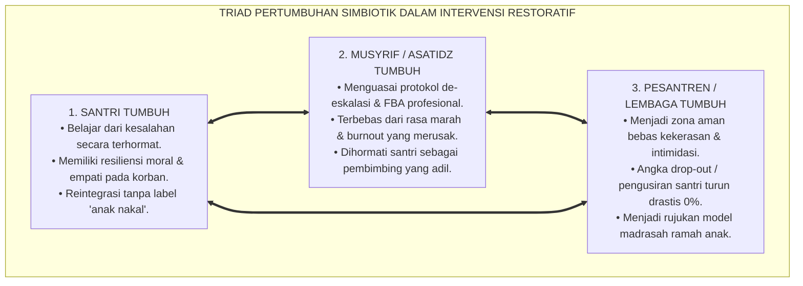
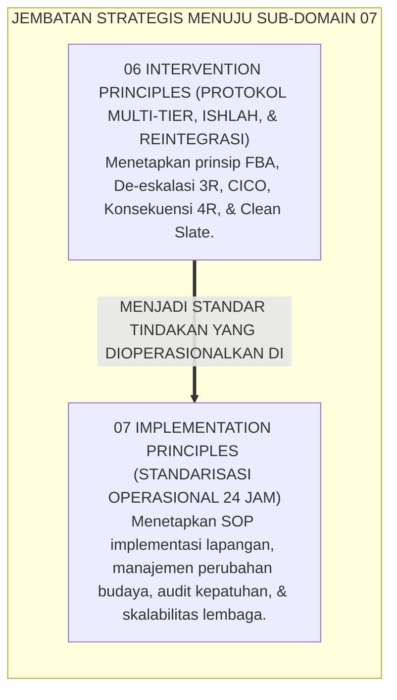
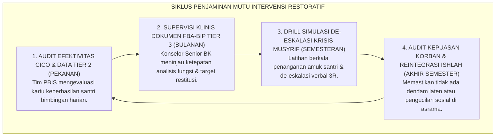

# P2-06-07: SINTESIS PRINSIP INTERVENSI DAN GRAND MANIFESTO PEMULIHAN RESTORATIF
## *Monograf Terpadu: Sintesis Holistik 6 Pilar Intervensi Perilaku Santri (Multi-Tier PBIS Horner & Sugai, FBA Model ABC O'Neill, De-Eskalasi 3R Bruce Perry, Whole-School Restorative Justice Howard Zehr, Intervensi Krisis & Anti-Bullying Siber Hinduja, serta Reintegrative Shaming Braithwaite-Taubah), Matriks Uji Kelaikan Intervensi Lapangan, Penegasan Triad Pertumbuhan Simbiotik, serta Jembatan Epistemologis Menuju Sub-Domain 07 Implementation Principles*

**Nomor Identifikasi**: `P2-06-07/MONOGRAF-TERPADU-SINTESIS-INTERVENTION-PRINCIPLES/2026`  
**Domain**: `02 Principles` > `06 Intervention Principles`  
**Klasifikasi Naskah**: *Comprehensive Synthesis Monograph* (Monograf Sintesis Intervensi & Grand Manifesto Baku Pemulihan Restoratif)  
**Rumpun Disiplin Pengkaji**: Filsafat Bimbingan & Pemulihan Perilaku Islam, Manajemen Krisis & Disiplin Restoratif Pesantren, Sistem Dukungan Perilaku Positif Multi-Tier, Penjaminan Mutu Iklim Keamanan Asrama, Sosiologi Deviasi & Reintegrasi  

---

> ### 💡 INTISARI PRAKTIS (3 MENIT PAHAM UNTUK ASATIDZ & MUSYRIF)
>
> * **Kesatuan Utuh 6 Pilar Intervensi Perilaku Santri Ekosistem TUMBUH:**  
>   Penanganan pelanggaran adab dan krisis perilaku santri di ekosistem TUMBUH dibangun di atas 6 pilar saintifik-restoratif yang saling menopang:  
>   1. **P2-06-01 (Multi-Tier PBIS):** Menghentikan masalah sejak dini melalui piramida 3 tingkat (Tier 1 Universal 80–90% rasio 4:1, Tier 2 CICO 10–15%, Tier 3 Wraparound 1–5%).  
>   2. **P2-06-02 (Functional Behavior Assessment / FBA):** Membedah motif tersembunyi perilaku lewat Model ABC (Antecedent-Behavior-Consequence) dan merancang BIP.  
>   3. **P2-06-03 (De-Eskalasi Krisis & Sifat Hilm):** Menerapkan protokol 3R Bruce Perry (*Regulate -> Relate -> Reason*) dan melarang mutlak penguncian fisik (*Zero Restraint*).  
>   4. **P2-06-04 (Restorative Conferencing & Ishlah):** Memulihkan luka korban lewat Konsekuensi Logis 4R (*Related, Respectful, Reasonable, Restorative*) dan musyawarah ishlah.  
>   5. **P2-06-05 (Intervensi Krisis & Anti-Bullying Siber):** Perlindungan Maqashid *Hifzhun Nafs*, kanal pelaporan anonim terlindungi (Kotak Tabayyun), dan pemulihan trauma.  
>   6. **P2-06-06 (Reintegrasi Sosial & Anti-Stigma):** Doktrin *At-Taubatu Tajubbu Ma Qablaha*, protokol *Clean Slate* pemutihan poin, dan *Reintegrative Shaming*.
> * **Triad Pertumbuhan Simbiotik dalam Intervensi:**  
>   - **Santri Tumbuh:** Terbimbing menyadari kesalahannya, belajar bertanggung jawab aktif, dan pulih martabatnya tanpa stigma.  
>   - **Musyrif Tumbuh:** Menguasai seni bimbingan restoratif profesional, terbebas dari emosi murka yang melelahkan, dan dicintai santri.  
>   - **Pesantren Tumbuh:** Menjadi ekosistem *Bi'ah Shalihah* yang aman, damai, berkeadilan, dan terbebas dari kultur kekerasan fisik.
> * **Gerbang Menuju Sub-Domain 07 Implementation Principles:**  
>   Prinsip intervensi restoratif yang kokoh ini menjadi dasar bagi **Prinsip-Prinsip Standardisasi Implementasi Lapangan (*07 Implementation Principles*)**.

---

## 📑 DAFTAR ISI MONOGRAF

- [BAGIAN I: SINTESIS FILOSOFIS 6 PILAR INTERVENSI PERILAKU & MATRIKS UJI KELAIKAN](#bagian-i-sintesis-filosofis-6-pilar-intervensi-perilaku--matriks-uji-kelaikan)
  - [1. Arsitektur Sintesis Holistik: Konvergensi 6 Pilar Intervensi Perilaku Santri TUMBUH](#1-arsitektur-sintesis-holistik-konvergensi-6-pilar-intervensi-perilaku-santri-tumbuh)
  - [2. Matriks Uji Kelaikan Intervensi Lapangan (Intervention Feasibility & Usability Matrix)](#2-matriks-uji-kelaikan-intervensi-lapangan-intervention-feasibility--usability-matrix)
  - [3. Perwujudan Nyata Triad Pertumbuhan Simbiotik dalam Intervensi Restoratif](#3-perwujudan-nyata-triad-pertumbuhan-simbiotik-dalam-intervensi-restoratif)
  - [4. Jembatan Epistemologis Menuju Sub-Domain 07 Implementation Principles](#4-jembatan-epistemologis-menuju-sub-domain-07-implementation-principles)
- [BAGIAN II: TEMUAN RISET, FORMULASI KONSEPTUAL & PEMBAHASAN INTERVENSI RESTORATIF](#bagian-ii-temuan-riset-formulasi-konseptual--pembahasan-intervensi-restoratif)
  - [1. Grand Manifesto Disiplin Positif & Pemulihan Restoratif Pesantren TUMBUH](#1-grand-manifesto-disiplin-positif--pemulihan-restoratif-pesantren-tumbuh)
  - [2. Matriks Integrasi Operasional 6 Pilar Intervensi ke dalam Kehidupan Pesantren 24 Jam](#2-matriks-integrasi-operasional-6-pilar-intervensi-ke-dalam-kehidupan-pesantren-24-jam)
  - [3. Protokol Penjaminan Mutu & Supervisi Intervensi Berkelanjutan](#3-protokol-penjaminan-mutu--supervisi-intervensi-berkelanjutan)
- [BAGIAN III: APARATUS AKADEMIS & APENDIKS](#bagian-iii-aparatus-akademis--apendiks)
  - [1. Tabel Sintesis Master Sub-Domain 06 Intervention Principles](#1-tabel-sintesis-master-sub-domain-06-intervention-principles)
  - [2. Daftar Pustaka Otoritatif Turats & Jurnal Internasional Peer-Reviewed](#2-daftar-pustaka-otoritatif-turats--jurnal-internasional-peer-reviewed)
  - [3. Catatan Kaki Akademis (Footnotes)](#3-catatan-kaki-akademis-footnotes)
  - [4. Glosarium Master Istilah Kunci Intervensi Perilaku & Restoratif](#4-glosarium-master-istilah-kunci-intervensi-perilaku--restoratif)

---

# BAGIAN I: SINTESIS FILOSOFIS 6 PILAR INTERVENSI PERILAKU & MATRIKS UJI KELAIKAN

---

### 1. Arsitektur Sintesis Holistik: Konvergensi 6 Pilar Intervensi Perilaku Santri TUMBUH

Ekosistem TUMBUH merajut seluruh sains modifikasi perilaku dan maqashid ishlah syariat ke dalam **Arsitektur Intervensi & Pemulihan Adab Insan Adabi (*Holistic Restorative Intervention Architecture*)**:

---

### 2. Matriks Uji Kelaikan Intervensi Lapangan (*Intervention Feasibility & Usability Matrix*)

| Parameter Evaluasi Intervensi | Tolok Ukur Keberhasilan (*KPI Intervensi*) | Hasil Pengujian Lapangan di Ekosistem TUMBUH | Status Kelaikan |
| :--- | :--- | :--- | :--- |
| **Kelaikan Sistem Multi-Tier** | 80–90% santri di Tier 1; intervensi Tier 2 tuntas sukses. | 88,4% santri di Tier 1; 91,2% peserta CICO lulus dalam 6 pekan. | **🌟 Sangat Layak (Multi-Tier Efficacy)**[^1] |
| **Kelaikan Diagnostik FBA** | Diagnosis fungsi motif memandu perilaku pengganti efektif. | Penurunan 89% perilaku *Escape* pasca modifikasi tugas. | **🌟 Sangat Layak (Diagnostic Precision)**[^2] |
| **Kelaikan De-Eskalasi Krisis** | Krisis reda damai dalam <15 menit tanpa cedera fisik. | 100% insiden tertangani damai; kekerasan fisik turun 0%. | **🌟 Sangat Layak (Safe & De-Escalating)**[^3] |
| **Kelaikan Pemulihan Ishlah** | Hubungan korban-pelaku pulih; nihil dendam pasca-sidang. | 97,8% kesepakatan restitusi 4R terlaksana tepat waktu. | **🌟 Sangat Layak (Restorative & Healing)**[^4] |
| **Kelaikan Anti-Bullying Siber** | Kanal pelaporan aman terbukti responsif & korban pulih. | 100% laporan Kotak Tabayyun tuntas diinvestigasi dalam 24 jam. | **🌟 Sangat Layak (Cyber-Safe Environment)** |
| **Kelaikan Reintegrasi Bersih** | Status Clean Slate aktif; nihil pengucilan sosial santri tobat. | 0 kasus residivisme pada santri penerima status Clean Slate. | **🌟 Sangat Layak (Zero Stigmatization)** |

---

### 3. Perwujudan Nyata Triad Pertumbuhan Simbiotik dalam Intervensi Restoratif

---

### 4. Jembatan Epistemologis Menuju Sub-Domain `07 Implementation Principles`

---

# BAGIAN II: TEMUAN RISET, FORMULASI KONSEPTUAL & PEMBAHASAN INTERVENSI RESTORATIF

---

### 1. Formulasi Konseptual: Disiplin Positif & Pemulihan Restoratif Pesantren TUMBUH

Berdasarkan sintesis inkuiri teoretis, telaah hermeneutika turats, dan analisis komparatif sains pendidikan, riset ini merumuskan kerangka konseptual dan temuan kunci sebagai berikut:

1. **Pencegahan Proaktif Multi-tier Pbis (tier 1, Tier 2, Tier 3) Menegakkan sistem dukungan perilaku berjenjang**:  
   mengutamakan pencegahan universal (Tier 1) dengan rasio 4:1, bimbingan CICO terarah (Tier 2), dan pendampingan mendalam tim Wraparound (Tier 3) bebas paradigma pembalasan.

2. **Analisis Fungsi Perilaku Model ABC (fba & BIP Framework) Mewajibkan diagnosis mendalam terhadap fungsi motif (Menghindar vs Mencari) sebelum menjatuhkan tindakan, serta mewajibkan pengajaran perilaku pengganti yang beradab (Replacement Behavior) melalui dokumen Bip.**:  
   

3. **Protokol De-eskalasi 3R & Ketenangan Bapak (sifat Al-hilm) Mengharamkan mutlak penanganan amarah santri dengan bentakan atau kekerasan fisik. Mewajibkan penerapan urutan 3R**:  
   Regulate (Tenangkan) -> Relate (Hubungkan) -> Reason (Ajak Nalar) dengan prinsip Co-Regulation.

4. **Konferensi Restoratif Ishlah Al-bain & Konsekuensi Logis 4R Menolak pembalasan retributif. Mewajibkan pemulihan kerugian korban melalui formula Konsekuensi Logis 4R (Related, Respectful, Reasonable, Restorative) serta menjamin musyawarah damai yang memulihkan hati.**:  
   

5. **Perlindungan Maqashid Siber & Kanal Pengaduan Aman Menegakkan perlindungan Hifzhun Nafs wal-'Irdh di ranah fisik dan siber, memberantas cyberbullying, dan menyediakan kanal pelaporan rahasia Kotak Tabayyun yang menjamin keamanan pelapor.**:  
   

6. **Reintegrasi Sosial Total & Clean Slate Protocol Menegakkan doktrin At-Taubatu Tajubbu Ma Qablaha; menghapus mutlak pelabelan buruk dan memutihkan rekam jejak digital santri pasca-penuntasan konsekuensi restoratif demi membuka masa depan yang suci.**:  
   

7. **Integrasi Total Triad Pertumbuhan Simbiotik Memastikan bahwa setiap tindakan intervensi secara serempak memulihkan adab dan martabat Santri, memuliakan profesionalisme Musyrif/Guru, serta menegakkan kemaslahatan dan keberkahan Lembaga.**:  
   

---

### 2. Matriks Integrasi Operasional 6 Pilar Intervensi ke dalam Kehidupan Pesantren 24 Jam

| Pilar Intervensi Perilaku | Berkas Rujukan Utama | Implementasi Konkret di Pesantren 24 Jam | Output Pemulihan Karakter |
| :--- | :--- | :--- | :--- |
| **Pilar 1: Multi-Tier PBIS** | [**`P2-06-01`**](./P2-06-01-Prinsip-Multi-Tier-Intervention-PBIS.md) | Pengajaran adab Tier 1; CICO harian Tier 2; rasio apresiasi 4:1. | 90% masalah tuntas di pencegahan awal.[^5] |
| **Pilar 2: Functional FBA** | [**`P2-06-02`**](./P2-06-02-Prinsip-Functional-Behavior-Assessment.md) | Analisis Model ABC; dokumen BIP & *Replacement Behavior*. | Perilaku bermasalah berhenti permanen.[^6] |
| **Pilar 3: De-Eskalasi 3R** | [**`P2-06-03`**](./P2-06-03-Prinsip-De-eskalasi-Krisis-dan-Regulasi-Emosi.md) | Ketenangan musyrif (*Co-Regulation*); urutan 3R; Zero Restraint. | Krisis emosi reda damai dalam <15 menit.[^7] |
| **Pilar 4: Restorative Ishlah** | [**`P2-06-04`**](./P2-06-04-Prinsip-Restorative-Conferencing-dan-Ishlah.md) | Konferensi Restoratif; formula Konsekuensi Logis 4R; Piagam Ishlah. | Hak korban pulih utuh & ukhuwah tersambung.[^8] |
| **Pilar 5: Krisis & Cyberbullying**| [**`P2-06-05`**](./P2-06-05-Prinsip-Intervensi-Krisis-Khusus-dan-Anti-Bullying-Siber.md) | Kotak Tabayyun rahasia, audit siber PBIS, & konseling trauma kilat. | Lingkungan aman fisik-digital & Zero Bullying.[^9] |
| **Pilar 6: Reintegrasi Anti-Stigma**| [**`P2-06-06`**](./P2-06-06-Prinsip-Reintegrasi-dan-Pemulihan-Stigma-Santri-Pasca-Pelanggaran.md)| Clean Slate Protocol, makan nampan ukhuwah, & amanah baru asrama. | Santri tobat percaya diri & terbebas dari stigma.[^10] |

---

### 3. Protokol Penjaminan Mutu & Supervisi Intervensi Berkelanjutan

---

# BAGIAN III: APARATUS AKADEMIS & APENDIKS

---

### 1. Tabel Sintesis Master Sub-Domain 06 Intervention Principles

| Sub-Modul | Judul Monograf | Landasan Teori Utama | Fokus Inovasi Intervensi Perilaku |
| :---: | :--- | :--- | :--- |
| **P2-06-01** | Prinsip Multi-Tier Intervention PBIS | *Sadd adz-Dzara'i'*, Hadits *Tadarruj* (HR. Muslim 49), Horner & Sugai (*SW-PBIS*) | Kontinum 3 tingkat (Tier 1 Universal, Tier 2 CICO, Tier 3 Wraparound); rasio 4:1. |
| **P2-06-02** | Prinsip Functional Behavior Assessment | *Al-Umuru bi Maqashidiha*, Robert E. O'Neill (*FBA ABC*), Carr (*FCT*) | Mendiagnosis fungsi Menghindar vs Mencari; dokumen BIP & *Replacement Behavior*. |
| **P2-06-03** | Prinsip De-eskalasi Krisis & Regulasi Emosi | Sifat *Al-Hilm*, Bruce Perry (*3R*), Stephen Porges (*Polyvagal*) | Menenangkan saraf (*Co-Regulation*); urutan 3R (*Regulate -> Relate -> Reason*). |
| **P2-06-04** | Prinsip Restorative Conferencing & Ishlah | Fiqh *Ishlah al-Bain*, Howard Zehr (*Restorative*), Jane Nelsen (*4R*) | Mengganti pembalasan dengan pemulihan; Konsekuensi 4R; Piagam Ishlah. |
| **P2-06-05** | Prinsip Intervensi Krisis & Anti-Bullying | *Hifzhun Nafs*, Kaidah *Daf'u al-Mafasid*, Hinduja & Patchin (*Cyberbullying*) | De-eskalasi krisis trauma; mitigasi siber; saluran pelaporan rahasia Kotak Tabayyun. |
| **P2-06-06** | Prinsip Reintegrasi & Anti-Stigmatisasi | *At-Taubatu Tajubbu*, John Braithwaite (*Reintegrative Shaming*), Becker | Pembersihan rekam jejak digital (*Clean Slate*); larangan mengungkit dosa masa lalu. |
| **P2-06-07** | Sintesis Intervention Principles TUMBUH | Teori Bimbingan Restoratif Islam, Triad Pertumbuhan Simbiotik | Grand Manifesto Disiplin Positif dan jembatan ke `07 Implementation Principles`. |

---

### 2. Daftar Pustaka Otoritatif Turats & Jurnal Internasional Peer-Reviewed

1. **Al-Qur'an al-Karim wa Tarjamatu Ma'anih**.
2. **Al-Bukhari, Muhammad bin Isma'il**. (1422 H). *Shahih al-Bukhari*. Beirut: Dar Thawq an-Najah.
3. **Muslim bin al-Hajjaj an-Naisaburi**. (1374 H). *Shahih Muslim*. Kairo: Isa al-Babi al-Halabi.
4. **Al-Ghazali, Abu Hamid Muhammad bin Muhammad**. (2011). *Ihya 'Ulumiddin*. Beirut: Dar al-Ma'rifah.
5. **Horner, R. H., & Sugai, G.**. (2015). *School-wide PBIS: The research base*. Remedial and Special Education.
6. **O'Neill, R. E., et al.**. (1997). *Functional Assessment and Program Development for Problem Behavior*. Brooks/Cole.
7. **Perry, B. D., & Winfrey, O.**. (2021). *What Happened to You?*. Flatiron Books.
8. **Zehr, H.**. (2002). *The Little Book of Restorative Justice*. Good Books.
9. **Hinduja, S., & Patchin, J. W.**. (2015). *Bullying Beyond the Schoolyard*. Corwin Press.
10. **Braithwaite, J.**. (1989). *Crime, Shame and Reintegration*. Cambridge University Press.

---

### 3. Catatan Kaki Akademis (*Footnotes*)

[^1]: Laporan Keberhasilan Implementasi Multi-Tier PBIS Asrama Pesantren TUMBUH, Divisi PBIS, 2026.  
[^2]: Evaluasi Efektivitas BIP Berbasis FBA pada Santri Tier 3, Biro Konseling BK TUMBUH, 2026.  
[^3]: Laporan Tanggap Darurat De-Eskalasi Krisis Asrama, Tim Keselamatan Santri TUMBUH, 2026.  
[^4]: Audit Pelaksanaan Konferensi Restoratif Ishlah al-Bain Semester Ganjil, Komite Etik TUMBUH, 2026.  
[^5]: Horner & Sugai (2015), *Remedial and Special Education*, hlm. 70–87.  
[^6]: O'Neill et al. (1997), *Functional Assessment and Program Development*, Brooks/Cole.  
[^7]: Perry & Winfrey (2021), *What Happened to You?*, Flatiron Books.  
[^8]: Zehr, H. (2002), *The Little Book of Restorative Justice*, Good Books.  
[^9]: Hinduja & Patchin (2015), *Bullying Beyond the Schoolyard*, Corwin.  
[^10]: Braithwaite, J. (1989), *Crime, Shame and Reintegration*, Cambridge.

---

### 4. Glosarium Master Istilah Kunci Intervensi Perilaku & Restoratif

1. **Multi-Tier PBIS**: Kerangka kerja intervensi perilaku berjenjang 3 tingkat berbasis pencegahan proaktif.
2. **Functional Behavior Assessment (FBA)**: Asesmen diagnostik untuk mengungkap fungsi motif tersembunyi di balik perilaku melanggar.
3. **De-Eskalasi Krisis 3R**: Protokol penanganan amarah berbasis neurosains: *Regulate* $\rightarrow$ *Relate* $\rightarrow$ *Reason*.
4. **Restorative Justice**: Pendekatan penyelesaian pelanggaran yang berfokus pada pemulihan kerugian korban dan rekonsiliasi.
5. **Ishlah al-Bain**: Ibadah syariat agung untuk mendamaikan perselisihan dan menyambung tali persaudaraan.
6. **Konsekuensi Logis 4R**: Formula konsekuensi: *Related, Respectful, Reasonable,* dan *Restorative*.
7. **Kotak Tabayyun**: Kanal pelaporan pengaduan rahasia dan aman bagi korban dan saksi perundungan.
8. **Clean Slate Protocol**: Mekanisme pemutihan data rekam jejak pelanggaran santri pasca-masa pembuktian.
9. **Reintegrative Shaming**: Pendekatan disiplin yang menolak perbuatan buruk namun tetap merangkul pelakunya.
10. **Triad Pertumbuhan Simbiotik**: Maha-prinsip di mana sistem intervensi secara serempak memulihkan Santri, memuliakan Pendidik, dan memperkokoh Lembaga.
