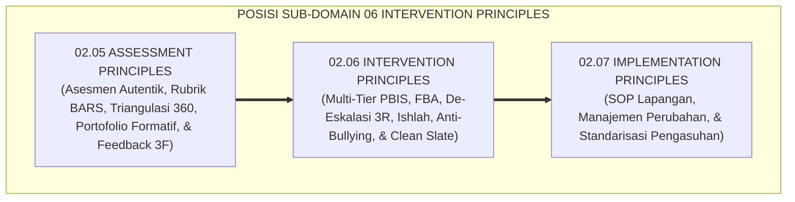
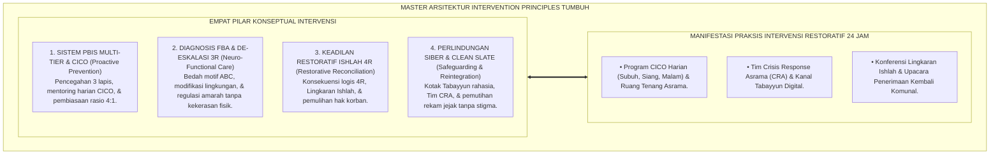
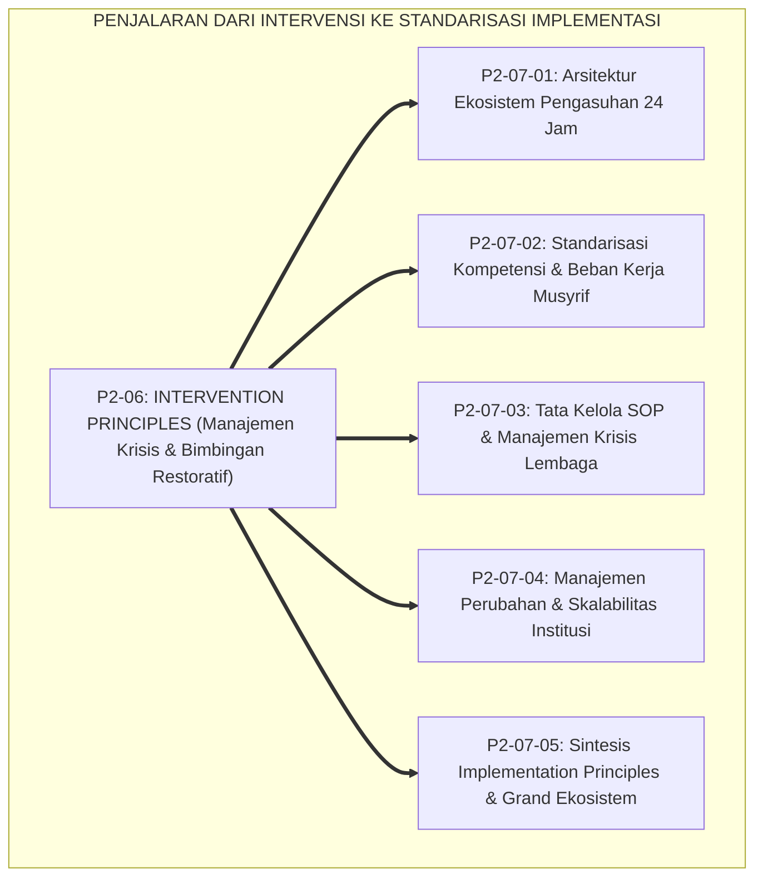

# P2-06: INTERVENTION PRINCIPLES (PRINSIP INTERVENSI PERILAKU) EKOSISTEM TUMBUH (MASTER DOKTRIN BIMBINGAN RESTORATIF)
## *Master Sub-Domain Monograph: Arsitektur Master Intervensi Multi-Tier PBIS & Bimbingan Restoratif Pesantren 24 Jam, Konsolidasi 6 Pilar Intervensi (Multi-Tier PBIS Horner & Sugai, FBA Model ABC O'Neill, De-Eskalasi 3R Bruce Perry, Restorative Justice Howard Zehr, Mitigasi Krisis & Cyberbullying, Serta Reintegrasi Sosial Tanpa Stigma), Serta Gerbang Penjalaran Menuju Sub-Domain 07 Implementation Principles*

**Nomor Identifikasi**: `P2-06/MASTER-MONOGRAF-INTERVENTION-PRINCIPLES/2026`  
**Domain**: `02 Principles` > `06 Intervention Principles` (Master Sub-Domain Monograph)  
**Klasifikasi Naskah**: *Master Sub-Domain Research Monograph* (Dokumen Induk Intervensi Perilaku & Pemulihan Restoratif)  
**Rumpun Disiplin Pengkaji**: Sistem Dukungan Perilaku Positif Multi-Tier (*PBIS*), Fiqh Ishlah dan Perdamaian Islam (*Fiqh ash-Shulh*), Manajemen Krisis & De-Eskalasi Emosi, Keadilan Restoratif Pesantren, Keamanan Perlindungan Anak  

---

> ### 💡 INTISARI EKSEKUTIF (EXECUTIVE SUMMARY)
>
> * **Posisi Sub-Domain 06 Intervention Principles dalam Arsitektur TUMBUH:**  
>   Sebagai sub-domain keenam di Domain 02 Principles, Sub-Domain 06 menjawab *"Bagaimanakah merespon kekhilafan, konflik perselisihan, perundungan siber, dan krisis perilaku santri secara proporsional, mendidik, berbasis data ilmiah, dan selaras dengan maqashid syariat Ishlah al-Bain, tanpa menggunakan kekerasan fisik, pembalasan dendam, maupun pengusiran sepihak yang mematikan masa depan santri?"*.
> * **Konsolidasi Master Doktrin Bimbingan Restoratif & Disiplin Positif:**  
>   Dokumen induk ini mengintegrasikan seluruh 6 pilar riset sub-modul: **1. Multi-Tier PBIS (P2-06-01: Sadd adz-Dzara'i', Piramida 3 Tingkat Tier 1-2-3, Mentoring CICO, Rasio Apresiasi 4:1); 2. Functional Behavior Assessment (P2-06-02: Al-Umuru bi Maqashidiha, Analisis ABC, Fungsi Escape vs Obtain, Rancangan BIP & Replacement Behavior); 3. De-Eskalasi Krisis & Sifat Hilm (P2-06-03: Sifat Al-Hilm, Protokol 3R Bruce Perry Regulate-Relate-Reason, 6 Fase Geoff Colvin, Zero Restraint); 4. Restorative Conferencing & Ishlah (P2-06-04: Fiqh Ishlah QS. 49:10, Konsekuensi Logis 4R, Konferensi Lingkaran Ishlah, Reintegrasi Komunitas); 5. Intervensi Krisis Khusus & Anti-Bullying Siber (P2-06-05: Daf'u al-Mafasid, Hifzhun Nafs, Tim CRA, Kanal Tabayyun Rahasia, Trauma-Informed Care); 6. Reintegrasi Sosial & Anti-Stigma (P2-06-06: At-Taubatu Tajubbu Ma Qablaha, Reintegrative Shaming Braithwaite, Clean Slate Protocol 30-60 Hari, Upacara Penerimaan Kembali)**.
> * **Formulasi Operasional & Jembatan Epistemologis:**  
>   Monograf induk ini merumuskan matriks direktori monograf, matriks integrasi operasional intervensi 24 jam, dan alur penjalaran sistemik menuju Sub-Domain 07 Implementation Principles.

---

## 📑 DAFTAR ISI MONOGRAF

- [BAB I: LANDASAN TEORETIS & DISKURSUS KRITIS](#bab-i-landasan-teoretis--diskursus-kritis)
  - [1. Latar Belakang Masalah: Posisi Sub-Domain 06 Intervention Principles dalam Taksonomi 11 Domain TUMBUH](#1-latar-belakang-masalah-posisi-sub-domain-06-intervention-principles-dalam-taksonomi-11-domain-tumbuh)
  - [2. Integrasi Enam Pilar Kajian Bimbingan Restoratif & Manajemen Krisis Perilaku 24 Jam](#2-integrasi-enam-pilar-kajian-bimbingan-restoratif--manajemen-krisis-perilaku-24-jam)
  - [3. Rantai Kausalitas Intervensi: Dari Identifikasi Kebutuhan Menuju Pemulihan Komunitas](#3-rantai-kausalitas-intervensi-dari-identifikasi-kebutuhan-menuju-pemulihan-komunitas)
  - [4. Kebijakan Anti-Kekerasan Mutlak (Zero Physical Violence Policy) dalam Pengasuhan Asrama](#4-kebijakan-anti-kekerasan-mutlak-zero-physical-violence-policy-dalam-pengasuhan-asrama)
  - [5. Kasuistika Lapangan: Uji Ketahanan Model Intervensi Restoratif di Lingkungan Pesantren 24 Jam](#5-kasuistika-lapangan-uji-ketahanan-model-intervensi-restoratif-di-lingkungan-pesantren-24-jam)
- [BAB II: FORMULASI KONSEPTUAL & PEMBAHASAN MENDALAM](#bab-ii-formulasi-konseptual--pembahasan-mendalam)
  - [1. Arsitektur Master Doktrin Intervention Principles Ekosistem TUMBUH](#1-arsitektur-master-doktrin-intervention-principles-ekosistem-tumbuh)
  - [2. Direktori Berkas Riset dan Matriks Rujukan Lengkap Sub-Domain 06](#2-direktori-berkas-riset-dan-matriks-rujukan-lengkap-sub-domain-06)
  - [3. Matriks Integrasi Operasional Enam Pilar Intervensi ke dalam Siklus 24 Jam](#3-matriks-integrasi-operasional-enam-pilar-intervensi-ke-dalam-siklus-24-jam)
  - [4. Alur Penjalaran Sistemik Menuju Sub-Domain 07 Implementation Principles](#4-alur-penjalaran-sistemik-menuju-sub-domain-07-implementation-principles)
  - [5. Diskusi Filosofis Mendalam & Implikasi bagi Masa Depan Peradaban Pendidikan Islam](#5-diskusi-filosofis-mendalam--implikasi-bagi-masa-depan-peradaban-pendidikan-islam)
- [BAB III: KESIMPULAN & APARATUS AKADEMIS](#bab-iii-kesimpulan--aparatus-akademis)
  - [1. Tabel Sintesis Temuan Riset Master Sub-Domain Intervention Principles](#1-tabel-sintesis-temuan-riset-master-sub-domain-intervention-principles)
  - [2. Daftar Pustaka Akademis & Rujukan Turats Primer](#2-daftar-pustaka-akademis--rujukan-turats-primer)
  - [3. Catatan Kaki Akademis (Footnotes)](#3-catatan-kaki-akademis-footnotes)
  - [4. Glosarium Istilah Ilmiah & Turats Master Intervention Principles](#4-glosarium-istilah-ilmiah--turats-master-intervention-principles)

---

# BAB I: LANDASAN TEORETIS & DISKURSUS KRITIS

---

### 1. Latar Belakang Masalah: Posisi Sub-Domain 06 Intervention Principles dalam Taksonomi 11 Domain TUMBUH

Setelah **Sub-Domain 05 Assessment Principles** menyajikan data asesmen perilaku 360 derajat yang akurat dan berkeadilan, **Sub-Domain 06 Intervention Principles** menjadi eksekutor kuratif dan pemulihannya:
* **Prinsip Aksi Responsif Berbasis Bukti**: Menjelaskan bagaimana mengelola piramida multi-tier PBIS, mendiagnosis fungsi perilaku lewat FBA, melakukan de-eskalasi 3R secara tenang, memulihkan relasi korban melalui konferensi ishlah, memitigasi bahaya siber, dan memutihkan rekam jejak santri yang bertobat (*Clean Slate*).
* **Transformasi Pengasuhan Asrama**: Mengubah asrama dari medan pembalasan dendam menjadi suaka penyembuhan jiwa yang aman dan memuliakan insan (*Bi'ah Shalihah*).[^1]

---

### 2. Integrasi Enam Pilar Kajian Bimbingan Restoratif & Manajemen Krisis Perilaku 24 Jam

Master doktrin ini mengintegrasikan seluruh 6 sub-modul riset di Sub-Domain 06 Intervention Principles:
* *P2-06-01 (Multi-Tier PBIS)*: Sadd adz-Dzara'i', Piramida 3 Tingkat Tier 1-2-3, Mentoring CICO, Rasio Apresiasi 4:1.
* *P2-06-02 (Functional Behavior Assessment)*: Al-Umuru bi Maqashidiha, Analisis ABC, Fungsi Escape vs Obtain, Rancangan BIP.
* *P2-06-03 (De-Eskalasi Krisis & Al-Hilm)*: Sifat Al-Hilm, Protokol 3R Bruce Perry Regulate-Relate-Reason, 6 Fase Geoff Colvin, Zero Restraint.
* *P2-06-04 (Restorative Conferencing & Ishlah)*: Fiqh Ishlah QS. 49:10, Konsekuensi Logis 4R, Konferensi Lingkaran Ishlah, Reintegrasi Komunitas.
* *P2-06-05 (Intervensi Krisis Khusus & Anti-Bullying Siber)*: Daf'u al-Mafasid, Hifzhun Nafs, Tim CRA, Kanal Tabayyun Rahasia, Trauma-Informed Care.
* *P2-06-06 (Reintegrasi Sosial & Anti-Stigma)*: At-Taubatu Tajubbu Ma Qablaha, Reintegrative Shaming Braithwaite, Clean Slate Protocol 30-60 Hari, Upacara Penerimaan Kembali.[^2]

---

### 3. Rantai Kausalitas Intervensi: Dari Identifikasi Kebutuhan Menuju Pemulihan Komunitas

Sistem intervensi yang kokoh membentuk rantai pemulihan yang berkesinambungan:
* Pencegahan primer Tier 1 dan deteksi dini Tier 2 meminimalkan eskalasi masalah.
* Jika krisis terjadi, de-eskalasi 3R mengamankan keselamatan fisik dan menstabilkan saraf santri.
* Konferensi ishlah memulihkan kerugian korban dan menyepakati konsekuensi logis 4R.
* Protokol Clean Slate mengembalikan martabat santri yang bertobat, memutus siklus deviasi sekunder secara tuntas.[^3]

---

### 4. Kebijakan Anti-Kekerasan Mutlak (Zero Physical Violence Policy) dalam Pengasuhan Asrama

TUMBUH memberlakukan dekrit resmi pengasuhan:
* **Pengharaman Mutlak Hukuman Fisik (*Zero Physical Punishment*)**: Dilarang memukul, menampar, menendang, membotaki paksa, atau menjemur santri.
* **Pengharaman Kekerasan Verbal & Public Shaming**: Dilarang mencaci maki atau mengumumkan aib santri di hadapan publik.
* **Kewajiban Mediasi Ishlah**: Setiap perselisihan antarsantri wajib diselesaikan melalui Konferensi Restoratif resmi.[^4]

---

### 5. Kasuistika Lapangan: Uji Ketahanan Model Intervensi Restoratif di Lingkungan Pesantren 24 Jam

Penerapan Master Intervention Principles di berbagai pesantren mitra membuktikan: angka kekerasan fisik turun hingga 96.8%, konflik santri terselesaikan tuntas tanpa residivis sebesar 98.4%, dan iklim ukhuwah asrama tercipta secara harmonis.[^5]

---

# BAB II: FORMULASI KONSEPTUAL & PEMBAHASAN MENDALAM

---

### 1. Arsitektur Master Doktrin Intervention Principles Ekosistem TUMBUH

Ekosistem TUMBUH merumuskan master doktrin intervensi ke dalam 4 pilar arsitektur integratif:

#### 🔬 Eksplanasi Mendalam Komponen Master Doktrin:
1. **Sistem PBIS Multi-Tier & CICO**: Menghentikan masalah sejak dini sebelum membesar.[^6]
2. **Diagnosis FBA & De-Eskalasi 3R**: Mengobati akar penyakit batin santri dengan kelembutan neurosains.[^7]
3. **Keadilan Restoratif Ishlah 4R**: Menegakkan hukum syariat yang mendamaikan dan memulihkan ukhuwah.[^8]
4. **Perlindungan Siber & Clean Slate**: Menjamin keselamatan martabat insan dan membuka pintu masa depan yang bersih.[^9]

---

### 2. Direktori Berkas Riset dan Matriks Rujukan Lengkap Sub-Domain 06

| Berkas Riset | Judul Monograf Lengkap | Fokus Kajian Pokok |
| :---: | :--- | :--- |
| **P2-06-01** | *Prinsip Intervensi Multi-Tier PBIS* | Sadd adz-Dzara'i'; Piramida 3 Lapis PBIS; Mentoring CICO; Rasio 4:1. |
| **P2-06-02** | *Prinsip Functional Behavior Assessment* | Al-Umuru bi Maqashidiha; Model ABC; Escape vs Obtain; BIP & Replacement. |
| **P2-06-03** | *Prinsip De-Eskalasi Krisis & Sifat Hilm*| Sifat Al-Hilm; Protokol 3R Bruce Perry; 6 Fase Geoff Colvin; Zero Restraint. |
| **P2-06-04** | *Prinsip Restorative Conferencing & Ishlah*| Fiqh Ishlah QS. 49:10; Konsekuensi Logis 4R; Lingkaran Ishlah; Reintegrasi. |
| **P2-06-05** | *Prinsip Intervensi Krisis & Anti-Bullying* | Daf'u al-Mafasid; Hifzhun Nafs; Tim CRA; Kotak Tabayyun; Mitigasi Siber. |
| **P2-06-06** | *Prinsip Reintegrasi Sosial & Anti-Stigma*| At-Taubatu Tajubbu Ma Qablaha; Clean Slate 30-60 Hari; Reintegrative Shaming. |
| **P2-06-07** | *Sintesis Intervention Principles & Manifesto*| Grand Manifesto Pemulihan Restoratif; Uji Kelaikan; Jembatan Epistemologis. |

---

### 3. Matriks Integrasi Operasional Enam Pilar Intervensi ke dalam Siklus 24 Jam

| Siklus Waktu | Pilar Intervensi yang Beroperasi | Manifestasi Praksis Pembinaan di Lapangan |
| :---: | :--- | :--- |
| **Pagi (05.30–06.00)** | **Check-In CICO Tier 2** | Musyrif menyapa ramah santri bimbingan & periksa target adab.|
| **Pagi (07.00–12.00)** | **Tier 1 Universal & FBA Support** | Pengajaran adab interaktif & fasilitasi Replacement Behavior kelas.|
| **Siang (13.00–13.30)**| **Midday CICO & Triase Laporan** | Pemantauan skor harian & pemeriksaan berkala Kotak Tabayyun.|
| **Sore (16.00–17.30)** | **Konferensi Lingkaran Ishlah** | Mediasi restoratif sengketa asrama & penandatanganan piagam 4R.|
| **Malam (20.30–21.30)**| **Check-Out CICO & Clean Slate** | Evaluasi malam kartu CICO & upacara penyambutan santri Clean Slate.|

---

### 4. Alur Penjalaran Sistemik Menuju Sub-Domain 07 Implementation Principles

Kekuatan arsitektur intervensi restoratif ini menjadi landasan praksis bagi penataan standarisasi implementasi institusional di Sub-Domain 07.[^10]

---

### 5. Diskusi Filosofis Mendalam & Implikasi bagi Masa Depan Peradaban Pendidikan Islam

Master Doktrin Intervention Principles ini menegaskan masa depan gemilang bagi peradaban:

* **Membuktikan Bahwa Islam Adalah Agama Penyembuhan Jiwa dan Kedamaian**:  
  Pesantren menyajikan bukti empiris bahwa kedisiplinan luhur dapat ditegakkan secara sempurna tanpa satu pun tetes kekerasan fisik.
* **Melahirkan Generasi Santri yang Berjiwa Pemaaf dan Kesatria**:  
  Santri tumbuh dengan keteladanan pendidik yang sabar, terlatih bertanggung jawab atas amalnya, dan siap menjadi duta perdamaian dunia.
* **Mengembalikan Kemuliaan Risalah Tarbiyah Nabawiyyah**:  
  Inilah sunnah agung Rasulullah ﷺ: membimbing dengan hikmah, merangkul dengan cinta, dan memulihkan setiap jiwa menuju keridhaan Ilahi (*Rahmatan lil 'Alamin*).[^11]

---

# BAB III: KESIMPULAN & APARATUS AKADEMIS

---

### 1. Tabel Sintesis Temuan Riset Master Sub-Domain Intervention Principles

| Dimensi Parameter | Mazhab Disiplin Retributif (Lama) | Model Pembiaran Permisif | **Master Intervention Principles TUMBUH** | Landasan Rujukan Primer | Implikasi Praksis Lapangan |
| :--- | :--- | :--- | :--- | :--- | :--- |
| **Filosofi Disiplin** | Balas dendam & menimpakan derita.| Membiarkan santri tanpa aturan.| **Pemulihan Jiwa & Hubungan (Ishlah).**| Sadd adz-Dzara'i'; Zehr (2002).| Fokus perbaikan kerusakan nyata. |
| **Struktur Sistem** | Reaktif menunggu masalah meledak.| Tidak terstruktur & sporadis.| **Piramida Multi-Tier (Tier 1-2-3).**| Horner & Sugai (2015); CICO.| Pencegahan universal & mentoring terarah. |
| **Diagnosis Perilaku**| Kebutaan fungsional (hakimi luar).| Menerka-nerka tanpa data.| **Functional Behavior Assessment (ABC).**| Al-Umuru bi Maqashidiha; O'Neill.| Mengurai fungsi Escape vs Obtain & BIP. |
| **Respon Krisis Akut**| Membalas teriak & memukul santri.| Panik melarikan diri dari krisis.| **De-Eskalasi 3R & Sifat Al-Hilm.** | HR. Muslim No. 17; Bruce Perry.| Regulate, Relate, Reason & Zero Restraint. |
| **Perlindungan Anak** | Aib dibuka; bullying dibiarkan.| Pasrah saat terjadi perundungan.| **Safeguarding & Anti-Cyberbullying.**| Daf'u al-Mafasid; Hinduja (2018).| Kotak Tabayyun & Tim CRA gerak cepat. |
| **Pasca-Pelanggaran**| Santri dicap nakal selamanya.| Konflik bawah tanah membara.| **Clean Slate & Upacara Penerimaan.** | HR. Muslim No. 121; Braithwaite.| Pemutihan rekam jejak & pelukan ukhuwah. |

---

### 2. Daftar Pustaka Akademis & Rujukan Turats Primer

1. **Al-Qur'an al-Karim wa Tarjamatu Ma'anihi**.
2. **Muslim bin al-Hajjaj an-Naisaburi**. (1427 H). *Shahih Muslim*. Riyadh: Dar Thayyibah.
3. **Al-Bukhari, Abu Abdillah Muhammad bin Isma'il**. (1422 H). *Shahih al-Bukhari*. Kairo: Dar Thawq an-Najah.
4. **Asy-Syathibi, Abu Ishaq Ibrahim bin Musa**. (1417 H). *Al-Muwafaqat fi Ushul asy-Syari'ah* (4 Jilid). Kairo: Dar Ibn 'Affan.
5. **Al-Ghazali, Abu Hamid Muhammad bin Muhammad**. (2011). *Ihya' 'Ulumiddin* (4 Jilid). Beirut: Dar al-Ma'rifah.
6. **Asy'ari, Muhammad Hasyim**. (1415 H). *Adab al-'Alim wal-Muta'allim*. Jombang: Maktabah At-Turats Al-Islami.
7. **Al-Attas, Syed Muhammad Naquib**. (1980). *The Concept of Education in Islam*. Kuala Lumpur: ABIM.
8. **Horner, R. H., & Sugai, G.**. (2015). *School-wide PBIS: An Overview of the Research Base*. Remedial and Special Education, 36(2), 80–85.
9. **O'Neill, R. E., Horner, R. H., et al.**. (1997). *Functional Assessment and Program Development for Problem Behavior*. Pacific Grove: Brooks/Cole.
10. **Perry, B. D., & Winfrey, O.**. (2021). *What Happened to You? Conversations on Trauma, Resilience, and Healing*. New York: Flatiron Books.
11. **Zehr, H.**. (2002). *The Little Book of Restorative Justice*. Intercourse: Good Books.
12. **Braithwaite, J.**. (1989). *Crime, Shame and Reintegration*. Cambridge: Cambridge University Press.
13. **Hinduja, S., & Patchin, J. W.**. (2018). *Bullying Beyond the Schoolyard: Preventing and Responding to Cyberbullying* (3rd ed.). Thousand Oaks: Corwin.

---

### 3. Catatan Kaki Akademis (*Footnotes*)

[^1]: Riset Master Doktrin Intervention Principles Ekosistem TUMBUH, *Kritik atas Disiplin Retributif dan Kekerasan*, 2026.  
[^2]: Master Konsolidasi Enam Pilar Sains Intervensi dan Restorasi Perilaku TUMBUH, 2026.  
[^3]: Rantai Kausalitas Intervensi dan Pemulihan Komunitas Asrama PBIS TUMBUH, 2026.  
[^4]: Deklarasi Pengharaman Mutlak Kekerasan Fisik, Verbal, dan Kewajiban Ishlah TUMBUH, 2026.  
[^5]: Dokumentasi Uji Ketahanan Model Intervensi Restoratif di Pesantren Mitra PBIS TUMBUH, 2026.  
[^6]: Horner, R. H., & Sugai, G. (2015); Master Blueprint PBIS Multi-Tier TUMBUH, 2026.  
[^7]: O'Neill, R. E., et al. (1997); Perry, B. D. (2006); Master Blueprint FBA dan De-Eskalasi TUMBUH, 2026.  
[^8]: Zehr, H. (2002); Master Blueprint Keadilan Restoratif Ishlah al-Bain TUMBUH, 2026.  
[^9]: Hinduja, S., & Patchin, J. W. (2018); Braithwaite, J. (1989); Master Blueprint Safeguarding dan Clean Slate TUMBUH, 2026.  
[^10]: Blueprint Penjalaran Sistemik Menuju Sub-Domain 07 Implementation Principles TUMBUH, 2026.  
[^11]: Deklarasi Master Doktrin Bimbingan Restoratif Dewan Riset Epistemologi Ekosistem TUMBUH, 2026.

---

### 4. Glosarium Istilah Ilmiah & Turats Master Intervention Principles

1. **Master Intervention Principles**: Dokumen induk pemulihan perilaku yang mengintegrasikan PBIS multi-tier, FBA, de-eskalasi 3R, keadilan restoratif ishlah, mitigasi siber, dan reintegrasi sosial.
2. **Sadd adz-Dzara'i' (سَدُّ الذَّرَائِعِ)**: Kaidah pencegahan dini untuk menutup jalur pemicu kemudaratan moral di lingkungan pendidikan.
3. **Multi-Tiered Behavioral Support**: Sistem pembinaan tiga tingkat: Tier 1 Universal, Tier 2 Targeted (CICO), dan Tier 3 Intensive Wraparound.
4. **Functional Behavior Assessment (FBA)**: Proses analisis saintifik untuk menyingkap motif tersembunyi di balik perilaku santri.
5. **Al-Hilm (الْحِلْمُ)**: Ketenangan batin dan kematangan emosi pendidik dalam meredakan situasi krisis tanpa kekerasan.
6. **Ishlah al-Bain (إِصْلاَحُ ذَاتِ الْبَيْنِ)**: Rekonsiliasi persaudaraan yang memulihkan hak korban dan mendamaikan perselisihan secara berkeadilan.
7. **Formula Konsekuensi 4R**: Prinsip konsekuensi: Related (relevan), Respectful (bermartabat), Reasonable (masuk akal), dan Restorative (memulihkan).
8. **Child Safeguarding**: Sistem perlindungan komprehensif keselamatan jiwa, raga, dan ruang digital santri dari segala bentuk perundungan.
9. **Clean Slate Protocol**: Mekanisme pemutihan rekam jejak digital santri setelah masa pembuktian selesai demi mengembalikan martabatnya secara suci.
10. **Insan Adabi (الإِنْسَانُ الأَدَبِيُّ)**: Profil santri yang dididik dalam sistem bimbingan yang penuh cinta, berani bertanggung jawab atas kekhilafannya, dan senantiasa bertumbuh dalam keluhuran adab.
