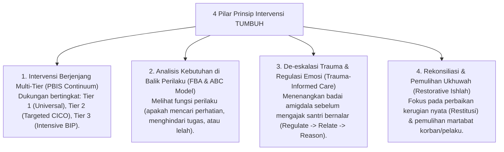

# P2-06-Prinsip-Intervensi-Perilaku-TUMBUH (Intervention Principles Induk)

## Tujuan
Menetapkan prinsip-prinsip intervensi perilaku (*Intervention Principles*) di ekosistem pesantren TUMBUH, memadukan pendekatan sistemik Multi-Tier PBIS, Functional Behavior Assessment (FBA), de-eskalasi emosi, dan keadilan restoratif (*Ishlah*) untuk memulihkan santri yang mengalami hambatan perilaku secara adil, ilmiah, dan penuh kasih sayang.

---

## 1. 4 Pilar Prinsip Intervensi TUMBUH

---

## 2. Rincian 4 Pilar Intervensi

### 1. Intervensi Berjenjang Multi-Tier (*Tiered Support Continuum*)
* Seluruh intervensi tidak dipukul rata.
* Mayoritas santri (80–90%) cukup dengan penguatan lingkungan dan apresiasi Tier 1.
* Santri yang membutuhkan perhatian ekstra (10–15%) didampingi lewat program *Check-In/Check-Out* (Tier 2) tanpa distigmatisasi.
* Santri dalam krisis berat (1–5%) mendapatkan penanganan terpadu tim BK, musyrif, dan orang tua (Tier 3).

### 2. Memahami Kebutuhan di Balik Perilaku (*Functional Behavior Assessment / FBA*)
* Perilaku menyimpang bukanlah tujuan akhir santri, melainkan cara maladaptif untuk memenuhi kebutuhan dasar yang belum terpenuhi (kebutuhan istirahat, pengakuan teman, rasa aman, atau pemahaman materi).

### 3. Protokol De-eskalasi Krisis (*Trauma-Informed De-escalation*)
* Mengikuti hukum neurobiologis Dr. Bruce Perry: **Regulate (Tenangkan fisik/emosi) $\rightarrow$ Relate (Bangun koneksi empati) $\rightarrow$ Reason (Ajak bernalar logis)**. Pembina dilarang menceramahi santri yang sedang dalam kondisi histeris/marah meluap.

### 4. Rekonsiliasi Restoratif (*Ishlah & Restitution*)
* Penyelesaian perselisihan diarahkan untuk mencapai *Ishlah* sejati: pelaku mengakui kesalahan, meminta maaf tulus, memperbaiki kerugian, dan diterima kembali dalam persaudaraan tanpa dendam.

---

## 3. Status Dokumen
* **Status**: 🌟 **A+ (Dokumen Induk Intervention Principles)**
* **Level**: Project 2 - `02 Principles / 06 Intervention Principles`
* **Langkah Berikutnya**: **`P2-06-01-Prinsip-Multi-Tier-Intervention-PBIS.md`**.
