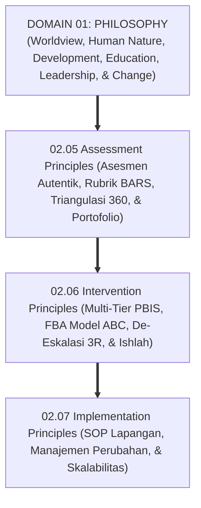
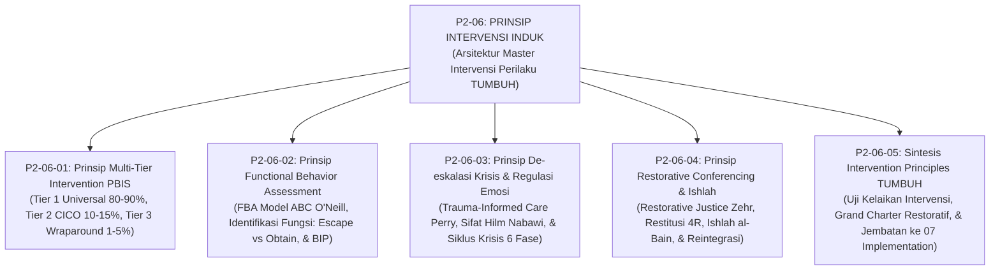
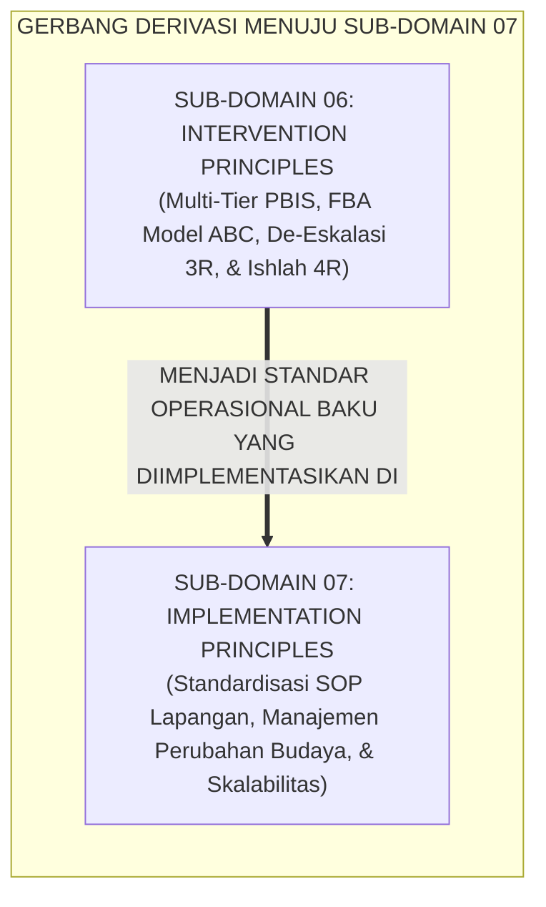

# P2-06: INTERVENTION PRINCIPLES (PRINSIP INTERVENSI PERILAKU) EKOSISTEM TUMBUH
## *Monograf Induk Sub-Domain 06: Arsitektur Master Intervensi Multi-Tier PBIS & Bimbingan Restoratif Pesantren 24 Jam, Rekapitulasi 4 Pilar Intervensi (Multi-Tier PBIS Horner & Sugai, FBA Model ABC O'Neill, De-Eskalasi 3R Bruce Perry, & Restorative Justice Howard Zehr), serta Gerbang Derivasi Menuju Sub-Domain 07 Implementation Principles*

**Nomor Identifikasi**: `P2-06/MONOGRAF-INDUK-INTERVENTION-PRINCIPLES/2026`  
**Domain**: `02 Principles` > `06 Intervention Principles`  
**Klasifikasi Naskah**: *Master Sub-Domain Monograph* (Monograf Induk Sub-Domain Prinsip Intervensi & Pemulihan Perilaku)  
**Rumpun Disiplin Pengkaji**: Sistem Dukungan Perilaku Positif Multi-Tier (*PBIS*), Fiqh Ishlah dan Perdamaian Islam (*Fiqh ash-Shulh*), Manajemen Krisis & De-Eskalasi Emosi, Keadilan Restoratif Pesantren  

---

> ### 💡 INTISARI PRAKTIS (3 MENIT PAHAM UNTUK ASATIDZ & MUSYRIF)
>
> * **Posisi Sub-Domain 06 Intervention Principles:**  
>   Menjawab pertanyaan mendasar keenam dalam ekosistem pesantren: *"Bagaimanakah merespon kekhilafan, konflik perselisihan, dan krisis perilaku santri secara proporsional, mendidik, berbasis data ilmiah, dan selaras dengan maqashid syariat Ishlah al-Bain, tanpa menggunakan kekerasan fisik, pembalasan dendam, maupun pengusiran sepihak yang mematikan masa depan santri?"*
> * **Empat Pilar Intervensi Ekosistem TUMBUH yang Terintegrasi:**  
>   1. **P2-06-01 (Multi-Tier PBIS):** Menghentikan masalah sejak dini melalui piramida 3 tingkat (Tier 1 Universal 80–90% rasio 4:1, Tier 2 CICO 10–15%, Tier 3 Wraparound 1–5%).  
>   2. **P2-06-02 (Functional Behavior Assessment / FBA):** Membedah motif fungsi perilaku lewat Model ABC (Antecedent-Behavior-Consequence) dan merancang BIP.  
>   3. **P2-06-03 (De-Eskalasi Krisis & Sifat Hilm):** Menerapkan protokol 3R Bruce Perry (*Regulate -> Relate -> Reason*) dan melarang mutlak penguncian fisik (*Zero Restraint*).  
>   4. **P2-06-04 (Restorative Conferencing & Ishlah):** Memulihkan luka korban lewat Konsekuensi Logis 4R (*Related, Respectful, Reasonable, Restorative*) dan reintegrasi tanpa stigma.
> * **Fondasi Kuat Bagi Standarisasi Lapangan (07 Implementation Principles):**  
>   Prinsip intervensi restoratif yang kokoh ini menjadi dasar pijakan bagi **Prinsip-Prinsip Standardisasi Implementasi Lapangan (*07 Implementation Principles*)**.

---

## 📑 DAFTAR ISI MONOGRAF INDUK

- [BAGIAN I: ARSITEKTUR ONTOLOGIS & POHON HUBUNGAN SUB-DOMAIN 06](#bagian-i-arsitektur-ontologis--pohon-hubungan-sub-domain-06)
  - [1. Posisi Dokumen dalam Taksonomi 11 Domain TUMBUH](#1-posisi-dokumen-dalam-taksonomi-11-domain-tumbuh)
  - [2. Pohon Hubungan Antar-Monograf Sub-Domain 06 Intervention Principles](#2-pohon-hubungan-antar-monograf-sub-domain-06-intervention-principles)
  - [3. Rangkuman 4 Pilar Intervensi Perilaku Santri](#3-rangkuman-4-pilar-intervensi-perilaku-santri)
  - [4. Penegasan Triad Pertumbuhan Simbiotik dalam Intervensi](#4-penegasan-triad-pertumbuhan-simbiotik-dalam-intervensi)
- [BAGIAN II: KODIFIKASI MATRIKS RESMI & DIREKTORI MONOGRAF TERPADU](#bagian-ii-kodifikasi-matriks-resmi--direktori-monograf-terpadu)
  - [1. Matriks Rujukan Lengkap 5 Berkas Monograf Sub-Domain 06](#1-matriks-rujukan-lengkap-5-berkas-monograf-sub-domain-06)
  - [2. Gerbang Derivasi Menuju Sub-Domain 07 Implementation Principles](#2-gerbang-derivasi-menuju-sub-domain-07-implementation-principles)
- [BAGIAN III: APARATUS AKADEMIS & APENDIKS](#bagian-iii-aparatus-akademis--apendiks)
  - [1. Daftar Pustaka Otoritatif Turats & Sains Global](#1-daftar-pustaka-otoritatif-turats--sains-global)
  - [2. Catatan Kaki Akademis (Footnotes)](#2-catatan-kaki-akademis-footnotes)
  - [3. Glosarium Istilah Kunci Intervensi Perilaku Induk](#3-glosarium-istilah-kunci-intervensi-perilaku-induk)

---

# BAGIAN I: ARSITEKTUR ONTOLOGIS & POHON HUBUNGAN SUB-DOMAIN 06

---

### 1. Posisi Dokumen dalam Taksonomi 11 Domain TUMBUH

Jika **Sub-Domain 05 Assessment Principles** menyediakan data diagnostik perilaku yang objektif, maka **Sub-Domain 06 Intervention Principles** menetapkan **Bagaimana Tindakan Pemulihan dan Intervensi Bimbingan Dilakukan Secara Presisi, Bertingkat, dan Penuh Kasih Sayang**:

---

### 2. Pohon Hubungan Antar-Monograf Sub-Domain 06 Intervention Principles

Sub-Domain `06 Intervention Principles` memuat 1 Monograf Induk dan 5 Monograf Riset Khusus yang saling menopang secara utuh:

---

### 3. Rangkuman 4 Pilar Intervensi Perilaku Santri

1. **Pilar 1: Multi-Tier PBIS (P2-06-01)**:  
   Menegakkan kaidah *Sadd adz-Dzara'i'* dan sunnah *Tadarruj fil Inkar* (HR. Muslim No. 49). Membangun kontinum 3 tingkat: Tier 1 (Universal Prevention 80–90% dengan rasio apresiasi 4:1), Tier 2 (Targeted CICO 10–15% santri dengan 3 titik temu harian), dan Tier 3 (Intensive Wraparound 1–5% santri).
2. **Pilar 2: Functional Behavior Assessment (P2-06-02)**:  
   Menegakkan kaidah *Al-Umuru bi Maqashidiha* (HR. Bukhari No. 1). Menganalisis perilaku melanggar menggunakan Model Tiga Suku ABC (*Antecedent, Behavior, Consequence*), membedakan fungsi *Escape* (Menghindar) vs *Obtain* (Mencari Perhatian), serta menyusun dokumen BIP untuk melatih *Replacement Behavior*.
3. **Pilar 3: De-Eskalasi Krisis & Sifat Hilm (P2-06-03)**:  
   Mengharamkan bentakan dan penguncian fisik (*Zero Restraint*). Menerapkan protokol 3R Bruce Perry (*Regulate -> Relate -> Reason*), mengaktifkan ketenangan batin pengasuh (*Co-Regulation & Sifat Hilm* HR. Muslim No. 17), dan mengelola 6 fase siklus krisis dengan memprioritaskan keselamatan fisik (*Safety First*).
4. **Pilar 4: Restorative Conferencing & Ishlah (P2-06-04)**:  
   Menegakkan syariat *Ishlah al-Bain* (QS. Al-Hujurat: 9–10) dan *Whole-School Restorative Justice* Howard Zehr. Mengganti hukuman retributif dengan formula Konsekuensi Logis 4R (*Related, Respectful, Reasonable, Restorative*), memfasilitasi Konferensi Restoratif Komunitas, dan menjamin reintegrasi santri tanpa stigma.[^1]

---

### 4. Penegasan Triad Pertumbuhan Simbiotik dalam Intervensi

* **Santri Tumbuh**: Merasa dibimbing dan ditolong keluar dari masalah perilakunya, belajar bertanggung jawab aktif memulihkan kerugian korban, dan terbebas dari trauma kekerasan fisik.
* **Musyrif Tumbuh**: Menguasai protokol penanganan krisis yang terstruktur dan tenang, terhindar dari rasa frustrasi atau amarah yang melelahkan, dan dihormati santri sebagai sosok pengayom yang adil.
* **Pesantren Tumbuh**: Menjadi institusi pendidikan Islam yang aman, berkeadaban luhur, berwibawa di hadapan masyarakat, dan terbebas dari risiko hukum kekerasan anak.

---

# BAGIAN II: KODIFIKASI MATRIKS RESMI & DIREKTORI MONOGRAF TERPADU

---

### 1. Matriks Rujukan Lengkap 5 Berkas Monograf Sub-Domain 06

| Kode Berkas | Judul Naskah Monograf | Dewan Keilmuan Pengkaji | Tautan Berkas Markdown |
| :---: | :--- | :--- | :--- |
| **P2-06-01** | **Prinsip Multi-Tier Intervention PBIS** | `pakar-pbis` `pakar-arsitektur-pbis-restoratif` `pakar-intervensi-preventif` | [**`Buka Naskah P2-06-01`**](./P2-06-01-Prinsip-Multi-Tier-Intervention-PBIS.md) |
| **P2-06-02** | **Prinsip Functional Behavior Assessment** | `pakar-arsitektur-pbis-restoratif` `pakar-bimbingan-konseling` `pakar-psikologi-belajar` | [**`Buka Naskah P2-06-02`**](./P2-06-02-Prinsip-Functional-Behavior-Assessment.md) |
| **P2-06-03** | **Prinsip De-eskalasi Krisis dan Regulasi Emosi** | `pakar-bimbingan-konseling` `pakar-neurosains-perkembangan` `pakar-pengasuhan-asrama` | [**`Buka Naskah P2-06-03`**](./P2-06-03-Prinsip-De-eskalasi-Krisis-dan-Regulasi-Emosi.md) |
| **P2-06-04** | **Prinsip Restorative Conferencing dan Ishlah** | `pakar-kuratif-restoratif` `pakar-epistemologi-turats` `pakar-disiplin-positif` | [**`Buka Naskah P2-06-04`**](./P2-06-04-Prinsip-Restorative-Conferencing-dan-Ishlah.md) |
| **P2-06-05** | **Sintesis Intervention Principles TUMBUH** | `pakar-filosofi-tumbuh` `pakar-kritikus-dan-auditor-kualitas` `pakar-kuratif-restoratif` | [**`Buka Naskah P2-06-05`**](./P2-06-05-Sintesis-Intervention-Principles-TUMBUH.md) |

---

### 2. Gerbang Derivasi Menuju Sub-Domain 07 Implementation Principles

---

# BAGIAN III: APARATUS AKADEMIS & APENDIKS

---

### 1. Daftar Pustaka Otoritatif Turats & Sains Global

1. **Al-Qur'an al-Karim wa Tarjamatu Ma'anih**.
2. **Al-Bukhari, Muhammad bin Isma'il**. (1422 H). *Shahih al-Bukhari*. Beirut: Dar Thawq an-Najah.
3. **Muslim bin al-Hajjaj an-Naisaburi**. (1374 H). *Shahih Muslim*. Kairo: Isa al-Babi al-Halabi.
4. **Abu Dawud, Sulaiman bin al-Asy'ats as-Sijistani**. (2009). *Sunan Abi Dawud*. Damaskus: Dar ar-Risalah.
5. **Al-Ghazali, Abu Hamid Muhammad bin Muhammad**. (2011). *Ihya 'Ulumiddin*. Beirut: Dar al-Ma'rifah.
6. **Horner, R. H., & Sugai, G.**. (2015). *School-wide PBIS: The research base*. Remedial and Special Education.
7. **O'Neill, R. E., et al.**. (1997). *Functional Assessment and Program Development for Problem Behavior*. Brooks/Cole.
8. **Perry, B. D., & Winfrey, O.**. (2021). *What Happened to You?: Conversations on Trauma, Resilience, and Healing*. Flatiron Books.
9. **Zehr, H.**. (2002). *The Little Book of Restorative Justice*. Good Books.
10. **Nelsen, J.**. (2006). *Positive Discipline*. Ballantine Books.

---

### 2. Catatan Kaki Akademis (*Footnotes*)

[^1]: Horner & Sugai (2015), *SW-PBIS*; O'Neill et al. (1997), *FBA ABC*; Perry (2021), *3R Model*; Zehr (2002), *Restorative Justice*.

---

### 3. Glosarium Istilah Kunci Intervensi Perilaku Induk

1. **Multi-Tier PBIS**: Kerangka kerja dukungan perilaku berjenjang 3 tingkat berbasis pencegahan proaktif dan data faktual.
2. **CICO (Check-In / Check-Out)**: Program intervensi harian Tier 2 dengan pertemuan mentor musyrif 3x sehari.
3. **FBA (Functional Behavior Assessment)**: Proses diagnostik untuk menyingkap fungsi motif kebutuhan di balik perilaku melanggar.
4. **BIP (Behavior Intervention Plan)**: Rencana aksi individual untuk modifikasi pemicu lingkungan dan pengajaran perilaku pengganti.
5. **De-Eskalasi Krisis 3R**: Protokol penanganan amarah berbasis urutan neurosains: *Regulate* $\rightarrow$ *Relate* $\rightarrow$ *Reason*.
6. **Co-Regulation**: Ketenangan sistem saraf pengasuh (*Sifat Al-Hilm*) yang menenangkan sistem saraf santri krisis.
7. **Restorative Justice**: Keadilan pemulihan yang berfokus pada perbaikan luka korban dan rekonsiliasi ukhuwah komunitas.
8. **Ishlah al-Bain**: Ibadah syariat mendamaikan perselisihan dan menyambung tali persaudaraan mukmin.
9. **Konsekuensi Logis 4R**: Formula konsekuensi: *Related, Respectful, Reasonable, Restorative*.
10. **Triad Pertumbuhan Simbiotik**: Prinsip mutlak di mana sistem intervensi secara serempak memulihkan Santri, memuliakan Pendidik, dan memperkokoh Lembaga.
