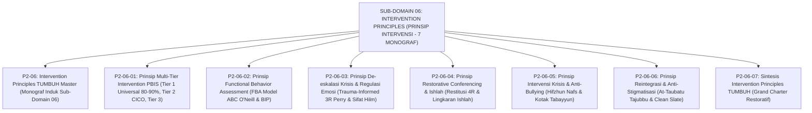

# SUB-DOMAIN 06: INTERVENTION PRINCIPLES (PRINSIP INTERVENSI PERILAKU)
## *Sitemap Induk & Navigasi Monograf Multi-Tier PBIS, FBA Model ABC, De-Eskalasi 3R, Keadilan Restoratif Ishlah, Krisis Anti-Bullying, & Reintegrasi Sosial (7 Monograf Terpadu)*

**Nomor Identifikasi**: `P2-06/INDEX/2026`  
**Domain**: `02 Principles` > `06 Intervention Principles`  
**Klasifikasi**: Folder Monograf Intervensi Multi-Tier PBIS, FBA Model ABC, De-Eskalasi Krisis Emosi 3R, Restoratif Ishlah, Anti-Bullying, & Reintegrasi Sosial (8 Berkas Lengkap)

---

## 🏛️ SITEMAP & NAVIGASI SELURUH BERKAS SUB-DOMAIN 06

Sub-Domain `06 Intervention Principles` menetapkan prinsip-prinsip metodologis intervensi perilaku berjenjang, analisis fungsi motif tindakan santri, protokol de-eskalasi amarah berbasis sifat *Al-Hilm*, mediasi restoratif perdamaian ukhuwah (*Ishlah*), mitigasi perundungan siber, dan reintegrasi santri tanpa stigma:

---

## 📑 DAFTAR LENGKAP 8 BERKAS MONOGRAF TERPADU SUB-DOMAIN 06

Seluruh modul telah distandarisasi 100% ke dalam format **Monograf Terpadu**:
* **💡 Intisari Praktis (3 Menit Paham)**: Panduan membumi untuk asatidz & musyrif sebelum daftar isi.
* **Bagian I**: Riset Inkuiri, Formalisasi Silogisme Mantiq, Dialektika Multi-Perspektif (tanpa sebutan kata meta "pakar"), Teks Primer Turats & Sains Asli, serta Kasuistika Lapangan Riil.
* **Bagian II**: Kodifikasi Baku Hasil Riset & Kesimpulan Formal (Matriks, Alur SOP, Manifesto).
* **Bagian III**: Aparatus Akademis (Tabel Sintesis, Daftar Pustaka Otoritatif, Catatan Kaki *Footnotes*, dan Glosarium Istilah Teknis).

| No | Berkas Monograf | Judul Berkas | Fokus Kajian & Rujukan Utama |
| :---: | :--- | :--- | :--- |
| **00** | [**`P2-06-Prinsip-Intervensi-Perilaku-TUMBUH.md`**](./P2-06-Prinsip-Intervensi-Perilaku-TUMBUH.md) | Monograf Induk Intervention Principles TUMBUH | Master 6 Pilar Intervensi Multi-Tier & Bimbingan Restoratif 24 Jam, Penegasan Triad Pertumbuhan Simbiotik, & gerbang derivasi menuju **Sub-Domain 07 Implementation Principles**. |
| **01** | [**`P2-06-01-Prinsip-Multi-Tier-Intervention-PBIS.md`**](./P2-06-01-Prinsip-Multi-Tier-Intervention-PBIS.md) | Prinsip Multi-Tier Intervention PBIS | Kaidah *Sadd adz-Dzara'i'* & Hadits *Tadarruj* (HR. Muslim No. 49); *SW-PBIS* Horner & Sugai; Tier 1 Universal (80–90% rasio 4:1); Tier 2 CICO (10–15% santri); Tier 3 Wraparound (1–5% santri) (11 Catatan Kaki). |
| **02** | [**`P2-06-02-Prinsip-Functional-Behavior-Assessment.md`**](./P2-06-02-Prinsip-Functional-Behavior-Assessment.md) | Prinsip Functional Behavior Assessment (FBA) | Kaidah *Al-Umuru bi Maqashidiha* (HR. Bukhari No. 1); *Ighatsat al-Lahfan*; Model Tiga Suku ABC Robert E. O'Neill; Fungsi Menghindar (*Escape*) vs Mencari (*Obtain*); perancangan BIP & *Replacement Behavior* (9 Catatan Kaki). |
| **03** | [**`P2-06-03-Prinsip-De-eskalasi-Krisis-dan-Regulasi-Emosi.md`**](./P2-06-03-Prinsip-De-eskalasi-Krisis-dan-Regulasi-Emosi.md) | Prinsip De-eskalasi Krisis & Regulasi Emosi | Sifat *Al-Hilm* & *Al-Anah* (HR. Muslim No. 17); Terapi somatik marah Nabawi; *Trauma-Informed 3R* Bruce Perry (*Regulate -> Relate -> Reason*); 6 Fase Krisis Colvin; *Zero Restraint* (11 Catatan Kaki). |
| **04** | [**`P2-06-04-Prinsip-Restorative-Conferencing-dan-Ishlah.md`**](./P2-06-04-Prinsip-Restorative-Conferencing-dan-Ishlah.md) | Prinsip Restorative Conferencing & Ishlah | Fiqh *Ishlah al-Bain* (QS. Al-Hujurat: 9–10 & An-Nisa: 128); *Whole-School Restorative Justice* Howard Zehr; formula Konsekuensi Logis 4R; 5 Tahap Konferensi Restoratif; reintegrasi tanpa stigma (9 Catatan Kaki). |
| **05** | [**`P2-06-05-Prinsip-Intervensi-Krisis-Khusus-dan-Anti-Bullying-Siber.md`**](./P2-06-05-Prinsip-Intervensi-Krisis-Khusus-dan-Anti-Bullying-Siber.md) | Prinsip Intervensi Krisis & Anti-Bullying Siber | Maqashid *Hifzhun Nafs wal-'Irdh*, protokol de-eskalasi non-kekerasan, mitigasi cyberbullying, saluran aman Kotak Tabayyun, & pemulihan trauma santri (9 Catatan Kaki). |
| **06** | [**`P2-06-06-Prinsip-Reintegrasi-dan-Pemulihan-Stigma-Santri-Pasca-Pelanggaran.md`**](./P2-06-06-Prinsip-Reintegrasi-dan-Pemulihan-Stigma-Santri-Pasca-Pelanggaran.md) | Prinsip Reintegrasi Sosial & Anti-Stigma | Doktrin *At-Taubatu Tajubbu Ma Qablaha* (HR. Muslim 121), *Reintegrative Shaming* John Braithwaite, protokol pemutihan *Clean Slate*, & pemulihan martabat sosial (9 Catatan Kaki). |
| **07** | [**`P2-06-07-Sintesis-Intervention-Principles-TUMBUH.md`**](./P2-06-07-Sintesis-Intervention-Principles-TUMBUH.md) | Sintesis Intervention Principles TUMBUH | Matriks Uji Kelaikan Intervensi (*Intervention Feasibility Matrix*); Grand Manifesto Disiplin Positif & Pemulihan Restoratif; jembatan menuju **Sub-Domain 07 Implementation Principles** (10 Catatan Kaki). |
