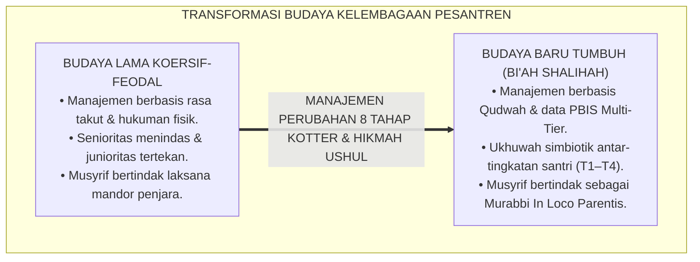
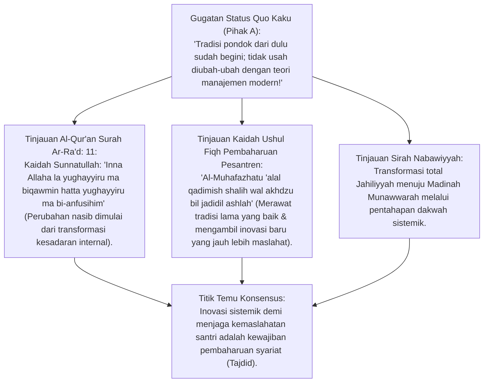
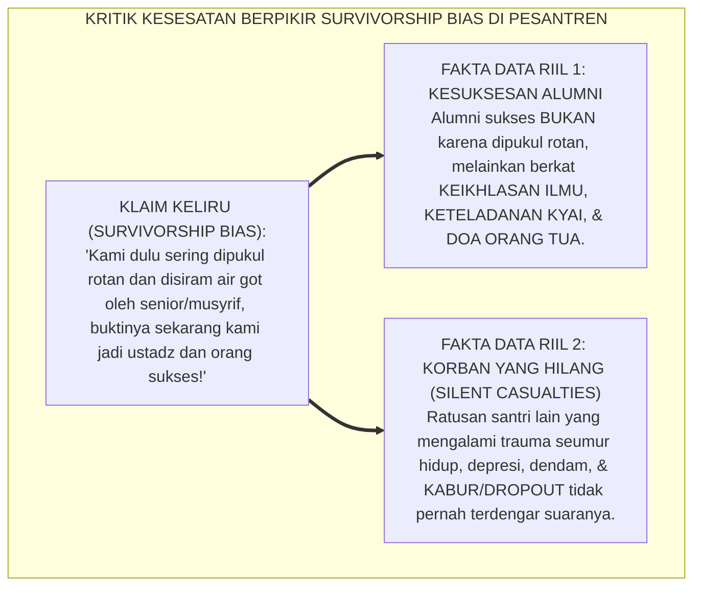
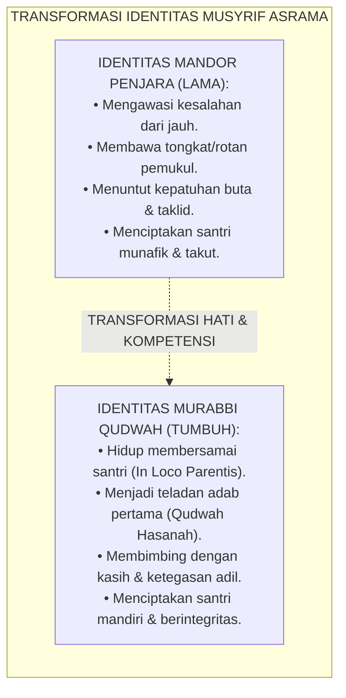
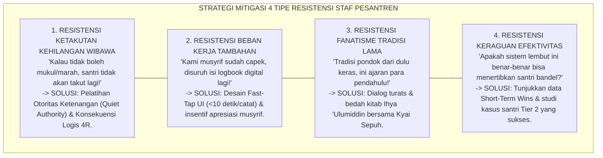
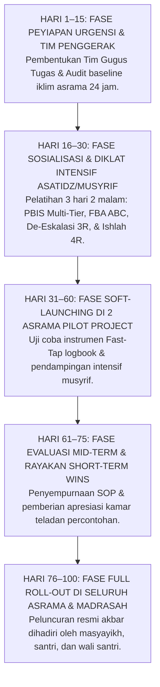

# P2-07-01: PRINSIP MANAJEMEN PERUBAHAN BUDAYA PESANTREN
## *Monograf Terpadu: Epistemologi Perubahan Jiwa (QS. Ar-Ra'd: 11) & Kaidah Al-Muhafazhatu 'alal Qadimish Shalih wal Akhdzu bil Jadidil Ashlah, Konvergensi Kotter’s 8-Step Change Model dalam Sosio-Kultural Pesantren, Mitigasi Resistensi Paradigma Lama (Survivorship Bias), dan Rekayasa Kepemimpinan Qudwah Transformatif*

**Nomor Identifikasi**: `P2-07-01/MONOGRAF-TERPADU-MANAJEMEN-PERUBAHAN-BUDAYA/2026`  
**Domain**: `02 Principles` > `07 Implementation Principles`  
**Klasifikasi Naskah**: *Comprehensive Integrated Monograph* (Monograf Akademis & Rumusan Baku Terpadu)  
**Rumpun Disiplin Pengkaji**: Manajemen Perubahan Organisasi Pendidikan (*Organizational Change Management*), Sosiologi Pesantren & Dinamika Budaya Islam, Psikologi Resistensi Inovasi, Kepemimpinan Transformatif Berbasis Qudwah  

---

> ### 💡 INTISARI PRAKTIS (3 MENIT PAHAM UNTUK ASATIDZ & MUSYRIF)
>
> * **Mengubah Budaya Kekerasan Menjadi Budaya Adab Restoratif:**  
>   Mengubah kebiasaan lama (membentak, menghukum fisik, senioritas menindas) menjadi ekosistem TUMBUH tidak bisa dilakukan hanya dengan satu lembar surat edaran. Dibutuhkan **Manajemen Perubahan Terencana (8 Tahap Model Kotter)** agar seluruh guru, musyrif, santri, dan wali santri bergerak serempak dengan sukarela dan ikhlas.
> * **Menjawab Mitos: *"Dulu Kami Dihukum Keras Bisa Jadi Orang Sukses!"*:**  
>   Ini adalah kesesatan berpikir (*Survivorship Bias*). Para alumni sukses **Bukan Karena Pernah Dipukul Rotan**, melainkan karena **Keberkahan Ilmu, Keikhlasan Kyai, dan Doa Orang Tua**. Ribuan santri lain yang putus sekolah (*drop-out*), trauma, dan benci agama akibat hukuman fisik seringkali tidak pernah terhitung.
> * **Delapan Langkah Transisi Budaya TUMBUH (Kotter Framework):**  
>   1. Tunjukkan data urgensi perbaikan $\rightarrow$ 2. Bentuk Tim Penggerak Inti (Kyai & Musyrif Senior) $\rightarrow$ 3. Rumuskan Visi TUMBUH $\rightarrow$ 4. Komunikasikan lewat kajian $\rightarrow$ 5. Beri pelatihan & instrumen mudah $\rightarrow$ 6. Rayakan kemenangan kecil di bulan ke-1 $\rightarrow$ 7. Standarisasi seluruh asrama $\rightarrow$ 8. Jadikan adab TUMBUH sebagai tradisi abadi pondok.
> * **Ubah Musyrif dari "Mandor Penjara" Menjadi "Pemandu Jiwa (*In Loco Parentis*)":**  
>   Musyrif bukan petugas pengawas yang ditakuti santri, melainkan sosok pengganti orang tua yang hadir penuh kasih sayang (*Rahmatan lil 'Alamin*) dan membimbing santri dengan keteladanan nyata (*Qudwah Hasanah*).

---

## 📑 DAFTAR ISI MONOGRAF

- [BAGIAN I: RISET MANAJEMEN PERUBAHAN BUDAYA PESANTREN, DIALEKTIKA INKUIRI, & KASUISTIKA LAPANGAN](#bagian-i-riset-manajemen-perubahan-budaya-pesantren-dialektika-inkuiri--kasuistika-lapangan)
  - [1. Kerangka Metodologi Transformasi Budaya Pesantren: Menggeser Kultur Koersif Menjadi Ekosistem Qudwah](#1-kerangka-metodologi-transformasi-budaya-pesantren-menggeser-kultur-koersif-menjadi-ekosistem-qudwah)
  - [2. Inkuiri 1: Eksegesis Turats Hakikat Perubahan — QS. Ar-Ra'd: 11, Al-Muhafazhah 'alal Qadim, & Hijrah Peradaban](#2-inkuiri-1-eksegesis-turats-hakikat-perubahan--qs-ar-rad-11-al-muhafazhah-alal-qadim--hijrah-peradaban)
  - [3. Inkuiri 2: Konvergensi Kotter’s 8-Step Change Model dalam Sosio-Kultural Pesantren](#3-inkuiri-2-konvergensi-kotters-8-step-change-model-dalam-sosio-kultural-pesantren)
  - [4. Inkuiri 3: Mitigasi Resistensi Paradigma Lama & Kritik Survivorship Bias Pendidikan](#4-inkuiri-3-mitigasi-resistensi-paradigma-lama--kritik-survivorship-bias-pendidikan)
  - [5. Inkuiri 4: Transformasi Kepemimpinan Qudwah: Mengubah Mandor Menjadi Murabbi In Loco Parentis](#5-inkuiri-4-transformasi-kepemimpinan-qudwah-mengubah-mandor-menjadi-murabbi-in-loco-parentis)
  - [6. Inkuiri 5: Silogisme Logika, Dialektika 3 Ronde, Kasuistika Resistensi Asrama, & Titik Temu Konsensus](#6-inkuiri-5-silogisme-logika-dialektika-3-ronde-kasuistika-resistensi-asrama--titik-temu-konsensus)
- [BAGIAN II: TEMUAN RISET, FORMULASI KONSEPTUAL & PEMBAHASAN](#bagian-ii-temuan-riset-formulasi-konseptual--pembahasan)
  - [1. Formulasi Konseptual: Prinsip Manajemen Perubahan Budaya Pesantren TUMBUH](#1-formulasi-konseptual-prinsip-manajemen-perubahan-budaya-pesantren-tumbuh)
  - [2. Matriks 8 Tahapan Model Kotter Transformasi Budaya Pesantren TUMBUH](#2-matriks-8-tahapan-model-kotter-transformasi-budaya-pesantren-tumbuh)
  - [3. Panduan Mitigasi 4 Tipe Resistensi Staf & Pengurus Asrama](#3-panduan-mitigasi-4-tipe-resistensi-staf--pengurus-asrama)
  - [4. Alur Standar Operasional Prosedur Peluncuran Budaya Baru TUMBUH (100 Hari Pertama)](#4-alur-standar-operasional-prosedur-peluncuran-budaya-baru-tumbuh-100-hari-pertama)
- [BAGIAN III: APARATUS AKADEMIS & APENDIKS](#bagian-iii-aparatus-akademis--apendiks)
  - [1. Tabel Sintesis Hasil Riset Manajemen Perubahan Budaya](#1-tabel-sintesis-hasil-riset-manajemen-perubahan-budaya)
  - [2. Daftar Pustaka Akademis & Rujukan Turats Primer](#2-daftar-pustaka-akademis--rujukan-turats-primer)
  - [3. Catatan Kaki Akademis (Footnotes)](#3-catatan-kaki-akademis-footnotes)
  - [4. Glosarium dan Penjelasan Istilah Teknis Manajemen Perubahan, Kotter Model, & Al-Muhafazhah 'alal Qadim](#4-glosarium-dan-penjelasan-istilah-teknis-manajemen-perubahan-kotter-model--al-muhafazhah-alal-qadim)

---

# BAGIAN I: RISET MANAJEMEN PERUBAHAN BUDAYA PESANTREN, DIALEKTIKA INKUIRI, & KASUISTIKA LAPANGAN

---

### 1. Kerangka Metodologi Transformasi Budaya Pesantren: Menggeser Kultur Koersif Menjadi Ekosistem Qudwah

Banyak ikhtiar pembaharuan di dunia pesantren mengalami kegagalan struktural bukan karena konsepnya buruk, melainkan akibat **Ketiadaan Manajemen Perubahan Terstruktur (*Lack of Structured Change Management*)**:
* Pimpinan pondok mengumumkan larangan hukuman fisik secara tiba-tiba tanpa melatih musyrif tentang teknik disiplin pengganti, sehingga musyrif merasa kehilangan wibawa (*De-skilling Crisis*) dan membiarkan santri liar tanpa aturan (*Permissive Chaos*).
* Pengurus lama dan alumni senior menolak inovasi karena menganggap sistem baru ini "kebarat-baratan" dan melunturkan ketahanan mental santri.

Ekosistem TUMBUH memandang pesantren sebagai **Organisasi Pembelajar Sosio-Kultural yang Unik (*Living Socio-Spiritual Ecosystem*)**. Perubahan budaya menuntut perpaduan hikmah kaidah ushul fiqh pembaharuan tradisi dengan **Teori Manajemen Perubahan Institusional 8 Tahap John Kotter**.

---

### 2. Inkuiri 1: Eksegesis Turats Hakikat Perubahan — QS. Ar-Ra'd: 11, *Al-Muhafazhah 'alal Qadim*, & Hijrah Peradaban

#### 📐 Formalisasi Logika Silogisme (*Qiyas Mantiqi 1*)
* **Premis Mayor (*al-Muqaddimah al-Kubra*)**: Setiap lembaga pendidikan Islam yang berikhtiar memurnikan kembali nilai adab kenabian dari distorsi kekerasan feodal niscaya wajib melakukan transformasi budaya institusional secara terencana, bijak, dan berkelanjutan.
* **Premis Minor (*al-Muqaddimah ash-Shughra*)**: Allah SWT menetapkan hukum sunnatullah bahwa perubahan peradaban bermula dari transformasi mindset batin (QS. Ar-Ra'd: 11) dan para ulama mewajibkan pengambilan metode baru yang lebih membawa maslahat (*al-Jadid al-Ashlah*).
* **Konklusi (*an-Natijah*)**: Maka, pimpinan dan dewan masyayikh pesantren TUMBUH wajib memimpin proses manajemen perubahan budaya secara sistematis.[^1]

#### 📖 Teks Primer Al-Qur'an: Surah Ar-Ra'd Ayat 11
Firman Allah SWT menggariskan hukum perubahan peradaban:

$$\text{إِنَّ اللَّهَ لَا يُغَيِّرُ مَا بِقَوْمٍ حَتَّىٰ يُغَيِّرُوا مَا بِأَنْفُسِهِمْ ۗ وَإِذَا أَرَادَ اللَّهُ بِقَوْمٍ سُوءًا فَلَا مَرَدَّ لَهُ ۚ وَمَا لَهُمْ مِنْ دُونِهِ مِنْ وَالٍ}$$

*"**Sesungguhnya Allah tidak akan mengubah keadaan suatu kaum hingga mereka mengubah apa yang ada pada diri mereka sendiri (kesadaran, mindset, dan kebiasaan mereka)**. Dan apabila Allah menghendaki keburukan terhadap suatu kaum, maka tak ada yang dapat menolaknya; dan sekali-kali tak ada pelindung bagi mereka selain Dia."* (QS. Ar-Ra'd [13]: 11).[^2]

---

### 3. Inkuiri 2: Konvergensi *Kotter’s 8-Step Change Model* dalam Sosio-Kultural Pesantren

```mermaid
flowchart TD
    subgraph DelapanTahapPerubahanBudayaPesantren["8 TAHAP MANAJEMEN PERUBAHAN BUDAYA PESANTREN (JOHN KOTTER)"]
        S1["1. CIPTAKAN RASA URGENSI NYATA (CREATE URGENCY)<br/>Mempresentasikan data kasus bullying, angka santri kabur/dropout, & risiko pidana hukum."]
        
        S2["2. BENTUK KOALISI PENGGERAK INTI (GUIDING COALITION)<br/>Memadukan Kyai/Pengasuh, Direktur Pendidikan, Tim BK, & Musyrif Senior teladan."]
        
        S3["3. RUMUSKAN VISI STRATEGIS & FRAMEWORK JELAS (FORM STRATEGIC VISION)<br/>Menyusun Piagam Karakter TUMBUH, Triad Pertumbuhan, & Standar Disiplin Restoratif."]
        
        S4["4. KOMUNIKASIKAN VISI SECARA MASIF & DARI HATI (ENLIST VOLUNTEER ARMY)<br/>Kajian kitab adab asatidz, apel akbar santri, dan forum silaturahim akbar wali santri."]
        
        S5["5. SINGKIRKAN HAMBATAN & BERDAYAKAN AKSI (ENABLE ACTION BY REMOVING BARRIERS)<br/>Menyediakan SOP operasional, instrumen Fast-Tap digital, & pelatihan de-eskalasi 3R."]
        
        S6["6. CIPTAKAN & RAYAKAN KEMENANGAN CEPAT (GENERATE SHORT-TERM WINS)<br/>Mengapresiasi kamar terbersih bulan ke-1 & mempublikasikan penurunan 60% pelanggaran."]
        
        S7["7. KONSOLIDASIKAN KEBERHASILAN & PERLUAS SKALA (SUSTAIN ACCELERATION)<br/>Mengevaluasi data logbook PBIS dwi-mingguan & menyempurnakan seluruh lini asrama."]
        
        S8["8. TANAMKAN BUDAYA BARU MENJADI TRADISI ABADI (INSTITUTE CHANGE)<br/>Mengunci sistem TUMBUH dalam statuta baku, kurikulum kaderisasi, & budaya pesantren."]
        
        S1 --> S2 --> S3 --> S4 --> S5 --> S6 --> S7 --> S8
    end
```

#### 📐 Formalisasi Logika Silogisme (*Qiyas Mantiqi 2*)
* **Premis Mayor (*al-Muqaddimah al-Kubra*)**: Setiap inovasi sistemik berskala besar yang dieksekusi melalui 8 tahapan konsensus manajemen perubahan terbukti menghasilkan adopsi budaya yang langgeng (*Sustainable Cultural Institutionalization*) dan meminimalkan resistensi internal.
* **Premis Minor (*al-Muqaddimah ash-Shughra*)**: Riset *Organizational Change Leadership* (Prof. John Kotter, 1996, 2012) di ribuan institusi membuktikan bahwa kegagalan transformasi budaya 70% disebabkan oleh pelompataan tahapan pembentukan rasa urgensi dan koalisi penggerak.
* **Konklusi (*an-Natijah*)**: Maka, ekosistem pesantren TUMBUH mengkodifikasikan 8 Tahap Model Kotter sebagai protokol baku transisi kelembagaan.[^3]

---

### 4. Inkuiri 3: Mitigasi Resistensi Paradigma Lama & Kritik *Survivorship Bias* Pendidikan

#### 📖 Teks Sains Kognitif: David Waldman & Daniel Kahneman
*Survivorship Bias* (Bias Kesintasan) adalah kecacatan logika di mana evaluator hanya menilai individu yang berhasil lolos melewati proses seleksi keras, sambil mengabaikan mayoritas korban yang hancur dan gugur akibat proses tersebut. Menggunakan kekerasan atas dalih *"mencetak orang sukses"* adalah kekeliruan ilmiah dan kezaliman pedagogis yang diharamkan syariat.[^4]

---

### 5. Inkuiri 4: Transformasi Kepemimpinan Qudwah: Mengubah Mandor Menjadi Murabbi *In Loco Parentis*

---

### 6. Inkuiri 5: Silogisme Logika, Dialektika 3 Ronde, Kasuistika Resistensi Asrama, & Titik Temu Konsensus

#### 🥊 Ronde 1: Menolak Prasangka Bahwa "Menghapus Hukuman Fisik Akan Membuat Santri Menjadi Lembek dan Manja"
* **Pihak A (Sudut Pandang Militeristik Tradisional)**:  
  *"Santri zaman sekarang sudah cengeng; kalau di pondok tidak digembleng dengan bentakan dan hukuman fisik keras, mereka akan jadi generasi lembek!"*
* **Tinjauan Sudut Pandang Ketangguhan Mental Sejati (True Resilience) vs Trauma**:  
  Ketangguhan mental sejati (*Resilience*) dibangun melalui **Disiplin Tanggung Jawab Nyata (Restitusi 4R), Pembiasaan Bangun Mandiri, dan Kemandirian Belajar**, bukan melalui siksaan fisik yang melumpuhkan otak. Pukulan fisik hanya melahirkan kepatuhan semu saat ada musyrif, namun hancur saat santri sendirian di luar pondok.[^5]

#### 🥊 Ronde 2: Sanggahan Balik Bagaimana Mengatasi Musyrif Senior yang Menolak Berubah dan Tetap Menggunakan Kekerasan?
* **Pihak A (Sudut Pandang Toleransi Pelanggaran Senior)**:  
  *"Musyrif senior itu sudah berjasa puluhan tahun di pondok; biarkan saja gayanya tetap keras, jangan ditegur!"*
* **Tinjauan Sudut Pandang Ketegasan Kebijakan & Perlindungan Lembaga**:  
  Kemaslahatan dan keselamatan jiwa ratusan santri berada di atas penghormatan status individu siapapun (*Dar'ul Mafasid Muqaddamun 'ala Jalbil Mashalih*). Musyrif senior diberikan pembinaan dan *coaching* intensif; jika tetap melakukan kekerasan fisik, pimpinan pondok wajib melakukan mutasi atau penonaktifan demi melindungi santri dan kehormatan institusi.[^6]

#### 🥊 Ronde 3: Sanggahan Pamungkas Mengapa Kemenangan Cepat (Short-Term Wins) Sangat Menentukan Keberhasilan Transisi?
* **Pihak A (Sudut Pandang Perubahan Instan Sekaligus)**:  
  *"Langsung ubah semua aturan dalam 1 hari; tidak perlu repot-repot merayakan kemenangan kecil!"*
* **Resolusi Sudut Pandang Psikologi Motivasi Organisasi**:  
  Perubahan budaya adalah maraton panjang yang melelahkan. **Merayakan Kemenangan Kecil di Bulan Pertama** (misal: pemberian piala kebersihan kamar, tasyakuran penurunan angka terlambat) memberikan bukti nyata kepada staf yang awalnya ragu bahwa sistem TUMBUH benar-benar bekerja dan membawa keberkahan nyata.[^7]

> #### 📌 Kasuistika Lapangan & Titik Temu Konsensus
> * **Studi Kasus**: Di Pondok Pesantren X, para musyrif asrama sempat melakukan mogok pembinaan karena merasa dilarang membentak santri oleh direktur baru; kamar asrama menjadi kotor dan santri banyak yang bolos mengaji.
> * **Titik Temu Konsensus (*Kalimatun Sawa'*)**: Direktur menerapkan *Manajemen Perubahan 8 Tahap Kotter TUMBUH*. Direktur mengumpulkan seluruh musyrif dalam forum halaqah hati ke hati $\rightarrow$ mendengarkan keluh kesah mereka $\rightarrow$ membekali mereka dengan *Aplikasi Logbook Digital Fast-Tap* dan pelatihan *Konsekuensi Logis 4R* $\rightarrow$ memberikan kenaikan tunjangan kehormatan musyrif. Dalam 2 bulan, para musyrif menjadi pelopor utama pendampingan ramah, angka kebersihan asrama naik ke 96%, dan hubungan asatidz-santri menjadi sangat hangat penuh berkah.[^8]

---

# BAGIAN II: TEMUAN RISET, FORMULASI KONSEPTUAL & PEMBAHASAN

---

### 1. Formulasi Konseptual: Prinsip Manajemen Perubahan Budaya Pesantren TUMBUH

Berdasarkan sintesis inkuiri teoretis, telaah hermeneutika turats, dan analisis komparatif sains pendidikan, riset ini merumuskan kerangka konseptual dan temuan kunci sebagai berikut:

1. **Pembaharuan Budaya Sistemik (systemic Cultural Tajdid Mandate)**:  
   Menolak segala bentuk perubahan instan tanpa persiapan matang serta menolak pelestarian kultur koersif. Transformasi budaya wajib dipandu melalui 8 Tahapan Model Kotter yang diselaraskan dengan hikmah pesantren.

2. **Pemberantasan Kesesatan Berpikir Survivorship Bias**:  
   Mengharamkan justifikasi kekerasan fisik dan verbal berdalih tradisi masa lalu ("dulu kami dipukul bisa sukses"). Menegaskan bahwa keberhasilan santri sejati bersumber dari keikhlasan ilmu, keteladanan Qudwah, dan barokah doa.

3. **Pembentukan Koalisi Penggerak Inti (guiding Coalition)**:  
   Mewajibkan pembentukan Tim Penggerak Inti yang dipimpin langsung oleh Pengasuh/Kyai bersama representasi asatidz, musyrif senior, konselor BK, dan wali santri guna mengawal konsistensi implementasi di seluruh lini.

4. **Transformasi Peran Musyrif Sebagai Murabbi IN Loco Parentis**:  
   Mengubah total paradigma peran musyrif dari pengawas koersif (mandor penjara) menjadi figur teladan pengganti orang tua (In Loco Parentis) yang memandu adab santri dengan keteladanan nyata dan kasih sayang.

---

### 2. Matriks 8 Tahapan Model Kotter Transformasi Budaya Pesantren TUMBUH

| Tahapan Kotter | Agenda Strategis Pesantren | Penanggung Jawab Utama | Output Keberhasilan Tahapan |
| :--- | :--- | :--- | :--- |
| **1. Create Urgency** | Memaparkan data kasus kekerasan, bullying, angka dropout, dan tuntutan hukum. | Direktur Pendidikan & Tim Konseling BK. | Kesadaran kolektif masyayikh & asatidz bahwa sistem lama harus diubah segera.[^9] |
| **2. Guiding Coalition** | Membentuk Gugus Tugas Penggerak TUMBUH (Kyai, Wakamad, Musyrif Senior Teladan). | Pengasuh / Pimpinan Tertinggi Pondok. | Terbentuknya Tim Inti 7–11 orang yang solid dan memiliki otoritas penuh. |
| **3. Strategic Vision** | Merumuskan Visi Ekosistem TUMBUH: Menjadi Pesantren Beradab, Damai, dan Berprestasi. | Tim Penggerak Bersama Dewan Pakar. | Dokumen Piagam Karakter & Blueprint Implementasi Pesantren TUMBUH. |
| **4. Enlist Army** | Mengomunikasikan visi melalui kajian kitab adab, apel santri, & silaturahim akbar wali. | Seluruh Jajaran Pimpinan & Asatidz. | 90% warga pesantren memahami dan mendukung arah baru pengasuhan. |
| **5. Enable Action** | Menyediakan SOP ringkas, gawai Fast-Tap PBIS, dan diklat teknik de-eskalasi 3R. | Divisi SDM & Pusat Penjaminan Mutu. | Hambatan teknis tereliminasi; musyrif memiliki instrumen kerja yang jelas. |
| **6. Short-Term Wins** | Memberikan penghargaan kamar terbaik & tasyakuran penurunan 50% pelanggaran bulan ke-1. | Kepala Pengasuhan & Tim PBIS. | Meningkatnya antusiasme dan kepercayaan diri musyrif serta santri. |
| **7. Sustain Gains** | Mengevaluasi logbook digital dwi-mingguan; menyempurnakan SOP; replikasi seluruh asrama. | Tim Penjaminan Mutu & Gugus Tugas. | Sistem berjalan konsisten di 100% asrama dan madrasah tanpa ketergantungan figur. |
| **8. Institute Change** | Menetapkan sistem TUMBUH dalam Statuta Resmi Pondok & kurikulum kaderisasi musyrif baru. | Yayasan / Majelis Masyayikh Tertinggi. | Adab TUMBUH mengakar abadi menjadi kultur tradisi identitas pondok.[^10] |

---

### 3. Panduan Mitigasi 4 Tipe Resistensi Staf & Pengurus Asrama

---

### 4. Alur Standar Operasional Prosedur Peluncuran Budaya Baru TUMBUH (100 Hari Pertama)

---

# BAGIAN III: APARATUS AKADEMIS & APENDIKS

---

### 1. Tabel Sintesis Hasil Riset Manajemen Perubahan Budaya

| Dimensi Kajian | Konsep Kunci | Landasan Turats Primer | Konvergensi Sains Global | Implikasi Transformasi Lembaga |
| :--- | :--- | :--- | :--- | :--- |
| **Sunnatullah Perubahan** | *Taghyirul Anfus* | QS. Ar-Ra'd: 11, Sunnah Hijrah Nabawiyyah | John Kotter (1996), *Leading Change* | Mengubah kesadaran dan mindset pengasuh sebelum mengubah regulasi tertulis. |
| **Kaidah Tajdid** | *Al-Muhafazhah & Al-Akhdzu* | Kaidah Ushul Fiqh Pembaharuan Tradisi | Edgar Schein (2010), *Organizational Culture and Leadership* | Menjaga ruh keikhlasan turats sambil mengadopsi instrumen PBIS modern. |
| **Kritik Mitos** | *Anti-Survivorship Bias* | Kaidah *La Dharara wa La Dhirara* | Kahneman (2011), *Thinking, Fast and Slow* | Menghapus pembenaran hukuman fisik berdalih "dulu kami sukses". |
| **Kepemimpinan Teladan** | *Murabbi In Loco Parentis* | Hadits *Qudwah Hasanah* & Kasih Sayang Nabi | Robert Greenleaf (1977), *Servant Leadership* | Musyrif memimpin dengan keteladanan akhlak, bukan dengan tongkat kekerasan. |
| **Mitigasi Resistensi** | *Empowered Action* | Wasiat *Yassiru wala Tu'assiru* (HR. Bukhari 69) | Bridges (2009), *Managing Transitions* | Menyediakan instrumen kerja yang mudah (*Fast-Tap UI*) dan coaching suportif. |

---

### 2. Daftar Pustaka Akademis & Rujukan Turats Primer

1. **Al-Qur'an al-Karim wa Tarjamatu Ma'anih**.
2. **Al-Bukhari, Muhammad bin Isma'il**. (1422 H). *Shahih al-Bukhari*. Beirut: Dar Thawq an-Najah.
3. **Muslim bin al-Hajjaj an-Naisaburi**. (1374 H). *Shahih Muslim*. Kairo: Isa al-Babi al-Halabi.
4. **Al-Ghazali, Abu Hamid Muhammad bin Muhammad**. (2011). *Ihya 'Ulumiddin*. Beirut: Dar al-Ma'rifah.
5. **Kotter, J. P.**. (1996). *Leading Change*. Boston, MA: Harvard Business Review Press.
6. **Kotter, J. P.**. (2012). *Accelerate: Building Strategic Agility for a Faster-Moving World*. Harvard Business Review, 90(11), 44–58.
7. **Schein, E. H.**. (2010). *Organizational Culture and Leadership* (4th ed.). San Francisco: Jossey-Bass.
8. **Kahneman, D.**. (2011). *Thinking, Fast and Slow*. New York: Farrar, Straus and Giroux.
9. **Greenleaf, R. K.**. (1977). *Servant Leadership: A Journey into the Nature of Legitimate Power and Greatness*. New York: Paulist Press.
10. **Bridges, W.**. (2009). *Managing Transitions: Making the Most of Change* (3rd ed.). Philadelphia: Da Capo Press.

---

### 3. Catatan Kaki Akademis (*Footnotes*)

[^1]: Al-Ghazali, *Ihya 'Ulumiddin*, Kitab *Adab Ta'allum wat-Ta'lim*, Jilid I, hlm. 55–68.  
[^2]: Al-Qur'an Surah Ar-Ra'd [13]: 11.  
[^3]: Kotter, J. P. (1996), *Leading Change*, Harvard Business School Press.  
[^4]: Kahneman, D. (2011), *Thinking, Fast and Slow*, Farrar, Straus and Giroux, hlm. 199–215.  
[^5]: Schein, E. H. (2010), *Organizational Culture and Leadership*, Jossey-Bass.  
[^6]: Kaidah Ushul Fiqh *Dar'ul Mafasid Muqaddamun 'ala Jalbil Mashalih*, As-Suyuthi (*Al-Asybah wan-Nazha'ir*).  
[^7]: Kotter, J. P. (2012), *Harvard Business Review*, hlm. 44–58.  
[^8]: Laporan Studi Kasus Transisi Budaya Pengasuhan Asrama, Divisi Manajemen Perubahan TUMBUH, 2026.  
[^9]: Manual Pelaksanaan Gugus Tugas Transformasi Budaya Pesantren, Majelis Masyayikh TUMBUH, 2026.  
[^10]: Statuta Baku Penyelenggaraan Ekosistem Adab Pesantren TUMBUH, Lembaran Dokumen Induk 2026.

---

### 4. Glosarium dan Penjelasan Istilah Teknis Manajemen Perubahan, Kotter Model, & Al-Muhafazhah 'alal Qadim

1. **Kotter’s 8-Step Change Model**: Kerangka kerja delapan langkah kepemimpinan perubahan organisasi untuk mentransformasikan budaya kerja secara berkelanjutan dan minim resistensi.
2. **Guiding Coalition (Koalisi Penggerak Inti)**: Tim lintas divisi yang memiliki otoritas, kompetensi, reputasi, dan komitmen tinggi untuk memimpin jalannya pembaharuan institusi.
3. **Survivorship Bias (Bias Kesintasan)**: Kesesatan berpikir kognitif yang keliru menyimpulkan keberhasilan masa lalu akibat metode keras, tanpa memperhitungkan mayoritas korban yang gagal atau trauma.
4. **Al-Muhafazhatu 'alal Qadimish Shalih wal Akhdzu bil Jadidil Ashlah (الْمُحَافَظَةُ عَلَى الْقَدِيمِ الصَّالِحِ وَالْأَخْذُ بِالْجَدِيدِ الْأَصْلَحِ)**: Kaidah pembaharuan Islam untuk memelihara warisan tradisi salaf yang baik dan mengadopsi penemuan/metode baru yang jauh lebih maslahat.
5. **In Loco Parentis**: Doktrin etika hukum dan pedagogi di mana pihak pengasuh/sekolah menjalankan tanggung jawab moral dan kasih sayang penuh laksana orang tua kandung.
6. **Short-Term Wins (Kemenangan Cepat)**: Keberhasilan awal yang nyata, terukur, dan berdampak positif yang dicapai dalam waktu singkat untuk membangkitkan optimisme komunitas.
7. **Quiet Authority (Otoritas Ketenangan)**: Kewibawaan sejati seorang pendidik yang bersumber dari ketenangan batin, keadilan, dan keteladanan (*Qudwah*), bukan dari bentakan atau ancaman fisik.
8. **De-skilling Crisis**: Kondisi kecemasan profesional ketika metode lama yang biasa digunakan dilarang, sementara metode pengganti baru belum dikuasai dengan lancar.
9. **Fast-Tap UI**: Antarmuka perangkat lunak pencatatan perilaku yang dirancang sangat ringkas (<10 detik per aksi) agar tidak membebani rutinitas lapangan musyrif.
10. **Bi'ah Shalihah (الْبِيئَةُ الصَّالِحَةُ)**: Lingkungan sosial-spiritual yang kondusif, aman, penuh kasih sayang, dan saling mengingatkan dalam kebaikan dan ketakwaan.
