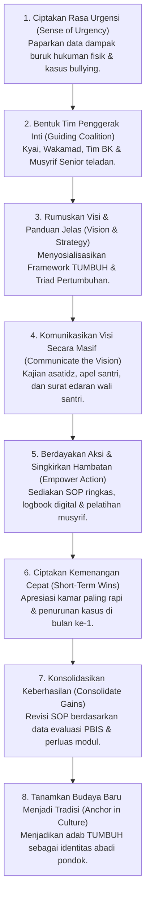

# P2-07-01-Prinsip-Manajemen-Perubahan-Budaya-Pesantren

## Tujuan
Menerapkan metodologi manajemen perubahan institusi (**John Kotter’s 8-Step Change Model**) di lingkungan pondok pesantren, memandu transisi dari budaya lama yang berbasis kontrol koersif menuju ekosistem baru TUMBUH yang berakar pada keteladanan *Qudwah* dan disiplin restoratif.

---

## 1. 8 Tahapan Transisi Budaya Pesantren (Kotter Model)

---

## 2. Strategi Menghadapi Resistensi Budaya Lama

1. **Mengatasi Paradigma *"Dulu Kami Dihukum Keras Bisa Sukses"***:
   - Pendekatan edukasi ilmiah: Menjelaskan bahwa kesuksesan para alumni terjadi *karena keikhlasan ilmu dan barokah guru*, **bukan karena kekerasan fisiknya**. Riset membuktikan banyak santri lain yang justru trauma dan gugur (*drop-out*) akibat hukuman fisik lama.
2. **Memberikan Solusi Pengganti yang Konkret**:
   - Tidak hanya melarang musyrif membentak, melainkan memberikan instrumen pengganti: kartu konsekuensi logis, teknik de-eskalasi 3R, dan tombol apresiasi poin kebaikan.

---

## 3. Status Dokumen
* **Status**: 🌟 **A+ (Tervalidasi & Siap Diimplementasikan)**
* **Level**: Project 2 - `02 Principles / 07 Implementation Principles`
* **Langkah Berikutnya**: **`P2-07-02-Prinsip-Pelatihan-dan-Supervisi-Musyrif.md`**.
