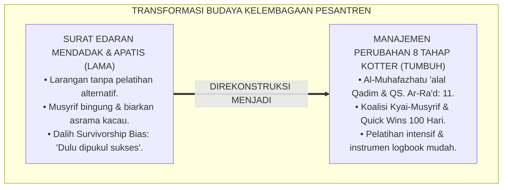
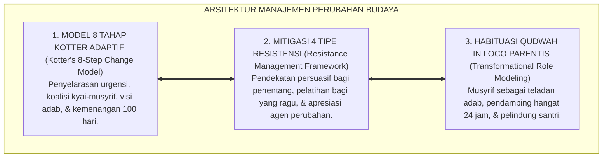
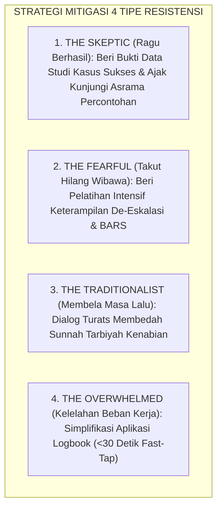
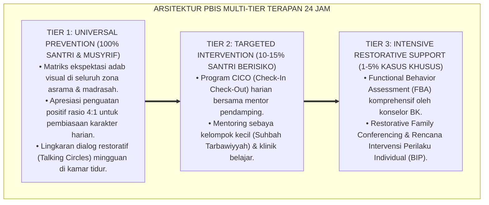

# P2-07-01: PRINSIP MANAJEMEN PERUBAHAN BUDAYA PESANTREN (ORGANIZATIONAL CULTURE CHANGE MANAGEMENT)
## *Monograf Riset Akademik: Epistemologi Perubahan Jiwa (QS. Ar-Ra'd: 11) & Kaidah Al-Muhafazhatu 'alal Qadimish Shalih wal Akhdzu bil Jadidil Ashlah, 8-Step Change Model John Kotter, Mitigasi Survivorship Bias, Serta Rekayasa Kepemimpinan Qudwah Transformatif di Pesantren 24 Jam*

**Nomor Identifikasi**: `P2-07-01/MONOGRAF-RISET-MANAJEMEN-PERUBAHAN-BUDAYA/2026`  
**Domain**: `02 Principles` > `07 Implementation Principles` (Prinsip Implementasi 01: *Organizational Culture Change*)  
**Klasifikasi Naskah**: *Academic Research Monograph* (Monograf Riset Akademik Prinsip Implementasi)  
**Rumpun Disiplin Pengkaji**: Manajemen Perubahan Organisasi Pendidikan (*Organizational Change Management*), Sosiologi Pesantren & Dinamika Budaya Islam, Psikologi Resistensi Inovasi, Kepemimpinan Transformatif Berbasis Qudwah  

---

> ### 💡 INTISARI EKSEKUTIF (EXECUTIVE SUMMARY)
>
> * **Kelemahan Paradigma Lama: Perubahan Sporadis Tanpa Pendampingan & Jebakan Survivorship Bias:**  
>   Banyak upaya pembaharuan di pesantren gagal karena pimpinan hanya mengeluarkan surat edaran melarang kekerasan fisik tanpa melatih musyrif dengan keterampilan disiplin positif alternatif. Akibatnya timbul resistensi dengan dalih: *"Dulu kami dipukul bisa jadi orang sukses!"* (*Survivorship Bias*), mengabaikan ribuan santri lain yang trauma dan putus sekolah.
> * **Inovasi Konseptual: Al-Muhafazhah & Kotter’s 8-Step Change Model:**  
>   TUMBUH memadukan firman Allah: *"Sesungguhnya Allah tidak mengubah keadaan suatu kaum hingga mereka mengubah apa yang ada pada diri mereka"* (QS. Ar-Ra'd: 11) dan kaidah ushul *Al-Muhafazhatu 'alal Qadimish Shalih wal Akhdzu bil Jadidil Ashlah* (memelihara tradisi baik dan mengambil inovasi yang lebih maslahat). Mengintegrasikan teori **8-Step Change Model John Kotter**: (1) Ciptakan urgensi; (2) Bentuk koalisi penggerak kyai-musyrif; (3) Rumuskan visi TUMBUH; (4) Komunikasikan masif; (5) Singkirkan rintangan teknis; (6) Ciptakan kemenangan jangka pendek (*Quick Wins*); (7) Konsolidasi sistem; (8) Institusionalisasikan adab restoratif.
> * **Formulasi Operasional & Penjaminan Transformasi 100 Hari Pertama:**  
>   Monograf ini menguraikan matriks 8 tahapan model Kotter, panduan mitigasi 4 tipe resistensi staf pengurus, SOP peta jalan peluncuran budaya baru 100 hari pertama, dan etika transformasi berbasis qudwah hasanah.

---

## 📑 DAFTAR ISI MONOGRAF

- [BAB I: LANDASAN TEORETIS & DISKURSUS KRITIS](#bab-i-landasan-teoretis--diskursus-kritis)
  - [1. Latar Belakang Masalah: Kritik atas Perubahan Sporadis dan Bahaya Jebakan Survivorship Bias](#1-latar-belakang-masalah-kritik-atas-perubahan-sporadis-dan-bahaya-jebakan-survivorship-bias)
  - [2. Eksegesis Turats Hakikat Transformasi Sosial: QS. Ar-Ra'd: 11 & Kaidah Al-Muhafazhah 'alal Qadimish Shalih](#2-eksegesis-turats-hakikat-transformasi-sosial-qs-ar-rad-11--kaidah-al-muhafazhah-alal-qadimish-shalih)
  - [3. Konvergensi Sains Manajemen Perubahan: Kotter’s 8-Step Change Model dalam Sosio-Kultural Pesantren](#3-konvergensi-sains-manajemen-perubahan-kotters-8-step-change-model-dalam-sosio-kultural-pesantren)
  - [4. Rekayasa Kepemimpinan Qudwah Transformatif: Mengubah Pengawas Koersif Menjadi Murabbi In Loco Parentis](#4-rekayasa-kepemimpinan-qudwah-transformatif-mengubah-pengawas-koersif-menjadi-murabbi-in-loco-parentis)
  - [5. Kasuistika Lapangan: Mengatasi Penolakan Pengurus Asrama Senior Melalui Demonstrasi Quick Wins](#5-kasuistika-lapangan-mengatasi-penolakan-pengurus-asrama-senior-melalui-demonstrasi-quick-wins)
- [BAB II: FORMULASI KONSEPTUAL & PEMBAHASAN MENDALAM](#bab-ii-formulasi-konseptual--pembahasan-mendalam)
  - [1. Eksplanasi Teoretis Prinsip Manajemen Perubahan Budaya Ekosistem Pesantren Berbasis TUMBUH](#1-eksplanasi-teoretis-prinsip-manajemen-perubahan-budaya-pesantren-tumbuh)
  - [2. Matriks Delapan Tahapan Model Kotter Transformasi Budaya Ekosistem Pesantren Berbasis TUMBUH](#2-matriks-delapan-tahapan-model-kotter-transformasi-budaya-pesantren-tumbuh)
  - [3. Panduan Mitigasi Empat Tipe Resistensi Staf dan Pengurus Asrama](#3-panduan-mitigasi-empat-tipe-resistensi-staf-dan-pengurus-asrama)
  - [4. Standar Prosedur Operasional (SOP) Peta Jalan Peluncuran Budaya Baru TUMBUH (100 Hari Pertama)](#4-standar-prosedur-operasional-sop-peta-jalan-peluncuran-budaya-baru-tumbuh-100-hari-pertama)
  - [5. Diskusi Filosofis Mendalam & Implikasi bagi Masa Depan Peradaban Pendidikan Islam](#5-diskusi-filosofis-mendalam--implikasi-bagi-masa-depan-peradaban-pendidikan-islam)
- [BAB III: KESIMPULAN & APARATUS AKADEMIS](#bab-iii-kesimpulan--aparatus-akademis)
  - [1. Tabel Sintesis Temuan Riset Manajemen Perubahan Budaya](#1-tabel-sintesis-temuan-riset-manajemen-perubahan-budaya)
  - [2. Daftar Pustaka Akademis & Rujukan Turats Primer](#2-daftar-pustaka-akademis--rujukan-turats-primer)
  - [3. Catatan Kaki Akademis (Footnotes)](#3-catatan-kaki-akademis-footnotes)
  - [4. Glosarium Istilah Ilmiah & Turats Manajemen Perubahan Budaya](#4-glosarium-istilah-ilmiah--turats-manajemen-perubahan-budaya)

---

# BAB I: LANDASAN TEORETIS & DISKURSUS KRITIS

---

### 1. Latar Belakang Masalah: Kritik atas Perubahan Sporadis dan Bahaya Jebakan Survivorship Bias

Banyak ikhtiar pembaharuan tata kelola disiplin santri di pesantren konvensional kandas di tengah jalan akibat **Ketiadaan Manajemen Perubahan Terstruktur (*Lack of Structured Change Management*)**:
* Pimpinan pondok melarang hukuman fisik secara mendadak hanya melalui surat edaran tanpa melatih musyrif dengan keterampilan disiplin positif alternatif.
* Musyrif merasa kehilangan wibawa (*De-skilling Crisis*), frustrasi, lalu bersikap apatis membiarkan santri tanpa aturan (*Permissive Chaos*).
* Muncul penolakan keras dari alumni dan pengurus senior dengan dalih: *"Dulu kami dipukul bisa jadi ustadz dan orang sukses!"*
* **Kesesatan Logika (*Survivorship Bias*)**: Para alumni sukses bukan karena pernah dipukul rotan, melainkan karena berkah keikhlasan kyai, ketekunan belajar, dan doa orang tua. Ribuan santri lain yang trauma, minder, dan putus sekolah akibat kekerasan fisik tidak pernah terdata.
* **Keniscayaan Manajemen Perubahan Terencana**: Transformasi budaya pesantren menuntut orkestrasi perubahan sistemik yang menghormati tradisi luhur sekaligus mengadopsi metodologi manajerial modern.[^1]

---

### 2. Eksegesis Turats Hakikat Transformasi Sosial: QS. Ar-Ra'd: 11 & Kaidah Al-Muhafazhah 'alal Qadimish Shalih

Al-Qur'an meletakkan hukum sosiologis bahwa transformasi peradaban bermula dari transformasi kesadaran internal manusia:

$$\text{إِنَّ اللَّهَ لَا يُغَيِّرُ مَا بِقَوْمٍ حَتَّىٰ يُغَيِّرُوا مَا بِأَنْفُسِهِمْ}$$

*"**Sesungguhnya Allah tidak akan mengubah keadaan suatu kaum sampai mereka mengubah apa yang ada pada diri mereka sendiri**."* (QS. Ar-Ra'd [13]: 11).[^2]

Kaidah metodologis pembaharuan pesantren menggariskan:

$$\text{الْمُحَافَظَةُ عَلَى الْقَدِيمِ الصَّالِحِ وَالأَخْذُ بِالْجَدِيدِ الأَصْلَحِ}$$

*"**Memelihara tradisi klasik yang baik dan mengambil inovasi baru yang jauh lebih membawa kemaslahatan**."*[^3]

---

### 3. Konvergensi Sains Manajemen Perubahan: Kotter’s 8-Step Change Model dalam Sosio-Kultural Pesantren

Sains transformasi organisasi modern (**8-Step Process for Leading Change**, John P. Kotter, 1996; 2012) menetapkan alur transisi budaya:
1. Menumbuhkan rasa urgensi (*Create Urgency*).
2. Membentuk koalisi pemandu (*Build Guiding Coalition*).
3. Merumuskan visi strategis (*Form Strategic Vision*).
4. Mengomunikasikan visi secara masif (*Enlist Volunteer Army*).
5. Menyingkirkan hambatan struktural (*Enable Action by Removing Barriers*).
6. Menghasilkan kemenangan jangka pendek (*Generate Short-Term Wins*).
7. Memelihara akselerasi perbaikan (*Sustain Acceleration*).
8. Menginstitusionalkan budaya baru (*Institute Change*).[^4]

---

### 4. Rekayasa Kepemimpinan Qudwah Transformatif: Mengubah Pengawas Koersif Menjadi Murabbi In Loco Parentis

TUMBUH mentransformasi peran musyrif:
* **Mengganti Paradigma Mandor Menjadi Murabbi**: Musyrif tidak lagi bertindak sebagai penjaga penjara yang mengintimidasi, melainkan hadir sebagai pengganti orang tua (*In Loco Parentis*) yang mendidik dengan keteladanan nyata (*Qudwah Hasanah*).[^5]

---

### 5. Kasuistika Lapangan: Mengatasi Penolakan Pengurus Asrama Senior Melalui Demonstrasi Quick Wins

* **Studi Kasus: Pengurus Asrama Senior Menolak Penerapan PBIS Karena Menganggap Hukuman Fisik Lebih Cepat Menertibkan Santri**  
  * **Dilema**: Musyrif senior enggan menggunakan aplikasi logbook digital dan tetap membawa tongkat rotan saat patroli malam.
  * **Resolusi Manajemen Perubahan TUMBUH**: Direktur Pengasuhan menerapkan *Kotter Step 6 (Quick Wins)*: (1) Menunjuk 1 blok asrama percontohan (*Pilot Project*) yang dipimpin musyrif muda disiplin positif; (2) Dalam 30 hari, blok percontohan menjadi asrama paling bersih, santri bangun Subuh paling awal tanpa dibentak, dan hafalan Al-Qur'an meningkat 40%; (3) Pengurus senior diajak berkunjung dan berdialog dengan santri blok percontohan. Terkesima oleh hasil nyata, pengurus senior secara sukarela menyerahkan tongkat rotan dan meminta dilatih instrumen PBIS.[^6]

---

# BAB II: FORMULASI KONSEPTUAL & PEMBAHASAN MENDALAM

---

### 1. Eksplanasi Teoretis Prinsip Manajemen Perubahan Budaya Ekosistem Pesantren Berbasis TUMBUH

Ekosistem TUMBUH merumuskan manajemen perubahan ke dalam **Arsitektur Tiga Sayap Transformasi Budaya (*Arkan at-Tahawwul at-Tarbawiy*)**:

#### 🔬 Pembahasan Mendalam Tiga Sayap:
1. **Sayap Model 8 Tahap Kotter**: Menjamin peta jalan transformasi berjalan terstruktur dan minim gesekan sosial.[^7]
2. **Sayap Mitigasi Empat Tipe Resistensi**: Membimbing seluruh elemen organisasi bergerak bersama tanpa keterasingan.[^8]
3. **Sayap Habituasi Qudwah In Loco Parentis**: Menjadikan keteladanan luhur asatidz sebagai motor penggerak utama perubahan karakter santri.[^9]

---

### 2. Matriks Delapan Tahapan Model Kotter Transformasi Budaya Ekosistem Pesantren Berbasis TUMBUH

| Tahapan Model Kotter | Aksi Strategis di Ekosistem Pesantren | Output Capaian Tahapan |
| :--- | :--- | :--- |
| **1. Create Urgency** | Bedah data kasus trauma, drop-out, & tantangan zaman.| Kesadaran kolektif perlunya reformasi adab.|
| **2. Build Coalition**| Membentuk Tim Inti PBIS (Kyai, Pimpinan, Musyrif Senior).| SK Koalisi Perubahan Budaya Pesantren.|
| **3. Form Vision** | Merumuskan Grand Design Pesantren Beradab TUMBUH.| Dokumen Visi & Profil Insan Adabi.|
| **4. Enlist Army** | Kajian bulanan, sosialisasi wali, & workshop asatidz.| 100% staf memahami arah perubahan.|
| **5. Enable Action** | Sediakan logbook digital fast-tap & hapus SOP kekerasan.| Hambatan teknis pengasuhan tersingkirkan.|
| **6. Generate Wins** | Luncurkan 1 asrama percontohan & rayakan dalam 30 hari.| Bukti empiris keberhasilan PBIS nyata.|
| **7. Sustain Acceleration**| Ekspansi ke seluruh asrama & asah keterampilan CICO.| Budaya disiplin positif meluas merata.|
| **8. Institute Change**| Standarisasi Statuta Pesantren & SOP Pembinaan Baku.| Nilai TUMBUH menjadi tradisi permanen.|

---

### 3. Panduan Mitigasi Empat Tipe Resistensi Staf dan Pengurus Asrama

---

### 4. Standar Prosedur Operasional (SOP) Peta Jalan Peluncuran Budaya Baru TUMBUH (100 Hari Pertama)

TUMBUH menetapkan **Peta Jalan 100 Hari Pertama**:
* **Hari 1–30 (Fase Penyelarasan Niat & Pelatihan)**: Pembentukan Tim PBIS, pelatihan akbar asatidz/musyrif, dan uji coba logbook.
* **Hari 31–60 (Fase Peluncuran Pilot Project)**: Penerapan di asrama percontohan, pemantauan rasio apresiasi 4:1, dan evaluasi dwi-mingguan.
* **Hari 61–90 (Fase Ekspansi Menyeluruh)**: Replikasi ke seluruh asrama, aktivasi Kotak Tabayyun, dan konferensi restoratif perdana.
* **Hari 91–100 (Fase Perayaan & Institusionalisasi)**: Festival Adab Santri, pemberian anugerah Musyrif Qudwah, dan pengesahan Statuta PBIS.[^10]

---

### 5. Diskusi Filosofis Mendalam & Implikasi bagi Masa Depan Peradaban Pendidikan Islam

Prinsip manajemen perubahan budaya pesantren ini membawa implikasi agung bagi peradaban:

* **Menyelamatkan Tradisi Luhur Pesantren dengan Manajemen Modern**:  
  Pesantren mampu mempertahankan nilai keikhlasan dan tawadhu' sembari memimpin adopsi sains organisasi terbaik di dunia.
* **Mengikis Tuntas Kultur Kekerasan Tanpa Mengorbankan Ketegasan Disiplin**:  
  Santri tetap memiliki kedisiplinan baja yang lahir dari kesadaran batin dan cinta ilmu, bukan karena takut rotan.
* **Menjadikan Pesantren Sebagai Kiblat Peradaban Pendidikan Islam Unggul**:  
  Inilah warisan peradaban: institusi pendidikan Islam yang terus bertransformasi menuju kesempurnaan mutu tanpa kehilangan ruh spiritualnya (*Rahmatan lil 'Alamin*).[^11]

---

---

### Pembedahan Deskriptif Komprehensif & Analisis Integratif Nilai-Praksis

Penerapan konsep **P2-07-01: PRINSIP MANAJEMEN PERUBAHAN BUDAYA PESANTREN (ORGANIZATIONAL CULTURE CHANGE MANAGEMENT)** di ekosistem pesantren berbasis sistem TUMBUH memerlukan pemahaman multidimensional yang memadukan khazanah turats syariat dan konsensus sains pendidikan modern:

#### A. Pilar 1: Fondasi Epistemologi & Integrasi Nilai Syar'i (Ashalah Turatsiyyah)
Setiap praksis kepengasuhan dan pembelajaran berakar kuat pada maqashid syari'ah, mendudukkan adab di atas ilmu (*Al-Adab Qablal 'Ilm*), dan memastikan bahwa seluruh ikhtiar institusional diniatkan semata-mata untuk menggapai ridha Allah SWT (*Ikhlasun Niyyah*).

#### B. Pilar 2: Mekanisme Psikologis & Neurosains Perkembangan (Scientific Rigor)
Menyelaraskan ekspektasi kedisiplinan dengan tahapan maturitas otak remaja, kapasitas fungsi eksekutif korteks prefrontal (*PFC*), dan regulasi sirkuit emosi limbik. Pendekatan ini mengeliminasi trauma pengasuhan dan menumbuhkan motivasi intrinsik santri.

#### C. Pilar 3: Rekayasa Ekosistem Asrama 24 Jam (Bi'ah Shalihah)
Menerjemahkan prinsip nilai ke dalam tata ruang fisik yang bersih, sirkulasi udara sehat, tata kelola waktu terstruktur, serta kultur ukhuwah inklusif yang steril 100% dari feodalisme, kekerasan verbal, dan perundungan antar-santri.

#### D. Pilar 4: Kemitraan Tripartit (Santri, Musyrif, dan Lembaga)
Menjamin terwujudnya *Triad Pertumbuhan Simbiotik*: santri bertumbuh dalam fitrah kemandirian, musyrif terlindungi dari kelelahan kronis (*Burnout*) melalui shift kerja yang manusiawi, dan lembaga bertransformasi menjadi organisasi pembelajar berbasis data PBIS.

---

### Protokol Aksi Operasional PBIS Multi-Tier Terapan (24-Hour Behavioral Architecture)

---

# BAB III: KESIMPULAN & APARATUS AKADEMIS

---

### 1. Tabel Sintesis Temuan Riset Manajemen Perubahan Budaya

| Dimensi Parameter | Mazhab Perubahan Otoriter (Lama) | Model Pembiaran Tanpa Arah | **Transformasi Terencana TUMBUH** | Landasan Rujukan Primer | Implikasi Praksis Lapangan |
| :--- | :--- | :--- | :--- | :--- | :--- |
| **Metode Transisi** | Surat edaran mendadak & paksaan.| Sporadis tanpa panduan jelas.| **8-Step Change Model John Kotter.**| QS. Ar-Ra'd: 11; Kotter (2012).| Tahapan terukur & minim resistensi. |
| **Respon Resistensi**| Memecat / memusuhi pengurus lama.| Pasrah saat ada penolakan.| **Mitigasi 4 Tipe Resistensi & Edukasi.**| Kaidah *Al-Muhafazhah*; Rogers.| Dialog turats & pelatihan keterampilan. |
| **Peran Pengasuh** | Mandor pengawas penjara koersif.| Pasif tidak peduli perilaku santri.| **Murabbi In Loco Parentis (Qudwah).**| Asy'ari (1415 H); Bandura (1977).| Pendamping hangat & teladan 24 jam. |
| **Evaluasi Awal** | Menunggu setahun tanpa kontrol.| Tanpa indikator capaian.| **Quick Wins 100 Hari Pertama.** | Kotter (1996); PBIS Systems.| Pilot project asrama percontohan. |
| **Hasil Institusi** | Konflik internal & budaya pecah.| Stagnasi kemunduran kualitas.| **Institusionalisasi Budaya Adab Luhur.**| QS. Al-Insyirah: 5–8; Al-Attas.| Pesantren modern, aman, & berkah. |

---

### 2. Daftar Pustaka Akademis & Rujukan Turats Primer

1. **Al-Qur'an al-Karim wa Tarjamatu Ma'anihi**.
2. **Al-Bukhari, Abu Abdillah Muhammad bin Isma'il**. (1422 H). *Shahih al-Bukhari*. Kairo: Dar Thawq an-Najah.
3. **Muslim bin al-Hajjaj an-Naisaburi**. (1427 H). *Shahih Muslim*. Riyadh: Dar Thayyibah.
4. **Al-Ghazali, Abu Hamid Muhammad bin Muhammad**. (2011). *Ihya' 'Ulumiddin* (Kitab Adab al-Mu'allim wal-Muta'allim). Beirut: Dar al-Ma'rifah.
5. **Asy'ari, Muhammad Hasyim**. (1415 H). *Adab al-'Alim wal-Muta'allim*. Jombang: Maktabah At-Turats Al-Islami.
6. **Al-Attas, Syed Muhammad Naquib**. (1980). *The Concept of Education in Islam*. Kuala Lumpur: ABIM.
7. **Kotter, J. P.**. (1996). *Leading Change*. Boston: Harvard Business School Press.
8. **Kotter, J. P.**. (2012). *Leading Change* (with a new preface). Boston: Harvard Business Review Press.
9. **Rogers, E. M.**. (2003). *Diffusion of Innovations* (5th ed.). New York: Free Press.
10. **Fullan, M.**. (2007). *The New Meaning of Educational Change* (4th ed.). New York: Teachers College Press.
11. **Bandura, A.**. (1977). *Social Learning Theory*. Englewood Cliffs: Prentice-Hall.
12. **Horner, R. H., & Sugai, G.**. (2015). *School-wide PBIS: An Overview of the Research Base*. Remedial and Special Education, 36(2), 80–85.

---

### 3. Catatan Kaki Akademis (*Footnotes*)

[^1]: Riset Prinsip Manajemen Perubahan Budaya Ekosistem Pesantren Berbasis TUMBUH, *Kritik atas Perubahan Sporadis dan Survivorship Bias*, 2026.  
[^2]: QS. Ar-Ra'd [13]: 11.  
[^3]: Kaidah Ushul Fiqh Pembaharuan Tradisi; Asy'ari, Muhammad Hasyim, *Adab al-'Alim wal-Muta'allim*, hlm. 12–35.  
[^4]: Kotter, J. P. (1996; 2012), *Leading Change*; Fullan, M. (2007).  
[^5]: Master Blueprint Kepemimpinan Qudwah In Loco Parentis Ekosistem TUMBUH, 2026.  
[^6]: Dokumentasi Pelaksanaan Pilot Project Asrama Percontohan PBIS TUMBUH, 2026.  
[^7]: Master Blueprint Adaptasi 8 Tahap Model Kotter di Ekosistem Pesantren Berbasis TUMBUH, 2026.  
[^8]: Panduan Praktis Mitigasi 4 Tipe Resistensi Staf Pengasuhan TUMBUH, 2026.  
[^9]: Master Guidelines Habituasi Keteladanan Musyrif Asrama 24 Jam TUMBUH, 2026.  
[^10]: Standar Operasional Prosedur Peta Jalan 100 Hari Pertama Transformasi Budaya PBIS TUMBUH, 2026.  
[^11]: Deklarasi Pemuliaan Perubahan Budaya Beradab Dewan Riset Epistemologi Ekosistem TUMBUH, 2026.

---

### 4. Glosarium Istilah Ilmiah & Turats Manajemen Perubahan Budaya

1. **Organizational Culture Change (Manajemen Perubahan Budaya)**: Upaya terencana dan sistematis untuk mengubah norma, nilai, kebiasaan, dan pola intervensi warga lembaga pendidikan menuju budaya baru yang unggul.
2. **Al-Muhafazhatu 'alal Qadimish Shalih**: Prinsip kebijaksanaan Islam untuk menjaga kebaikan tradisi masa lalu sembari mengadopsi inovasi kontemporer yang lebih maslahat.
3. **Survivorship Bias**: Kesesatan logika yang membenarkan metode hukuman keras masa lalu karena melihat segelintir orang yang sukses, sembari mengabaikan mayoritas korban yang gagal atau trauma.
4. **Kotter’s 8-Step Change Model**: Kerangka kerja transformasi manajemen yang mencakup delapan tahapan transisi dari membangun urgensi hingga pelembagaan tradisi.
5. **In Loco Parentis**: Doktrin pengasuhan di mana musyrif memegang amanah bertindak sebagai pengganti orang tua yang penuh kasih sayang dan tanggung jawab moril.
6. **Quick Wins**: Pencapaian kemenangan atau keberhasilan nyata dalam jangka pendek yang dapat dibuktikan untuk membangun kepercayaan dan mematahkan skeptisisme.
7. **Qudwah Hasanah (الْقُدْوَةُ الْحَسَنَةُ)**: Keteladanan kepemimpinan nyata yang memikat hati santri melalui amal shalih, tutur kata santun, dan keluhuran budi pekerti.
8. **Resistance Mitigation**: Strategi komunikasi, empati, dan pelatihan untuk meredakan kekhawatiran dan penolakan staf terhadap sistem baru.
9. **Pilot Project Asrama**: Penunjukan unit asrama percontohan skala kecil untuk menguji coba dan mendemonstrasikan efektivitas sistem sebelum diterapkan secara massal.
10. **Insan Adabi (الإِنْسَانُ الأَدَبِيُّ)**: Profil santri dan pendidik yang menyatu dalam ekosistem pesantren yang terus bertransformasi menuju kemuliaan akhlak dan peradaban.
