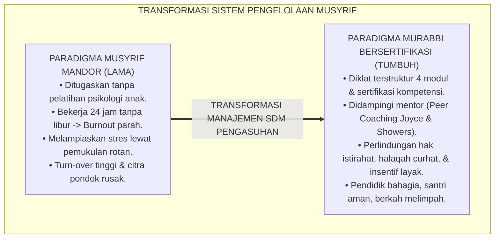
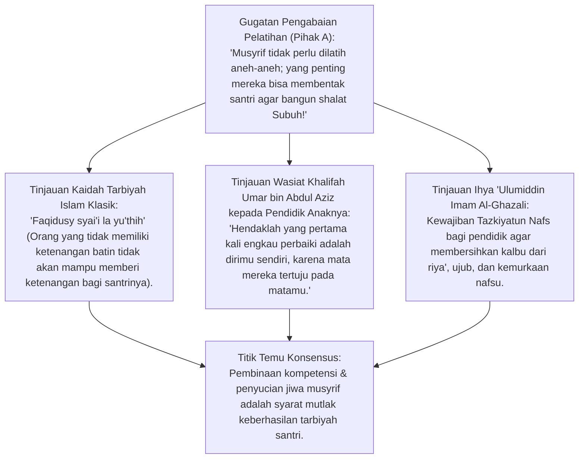
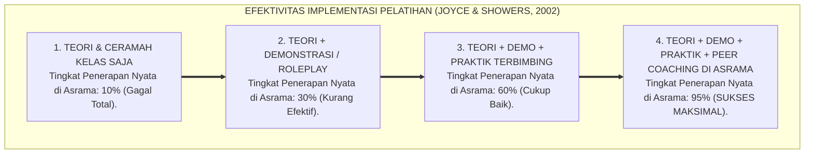
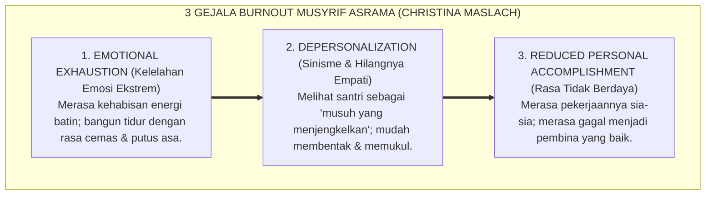
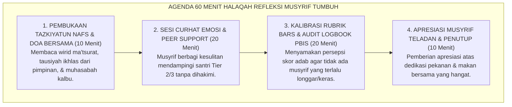
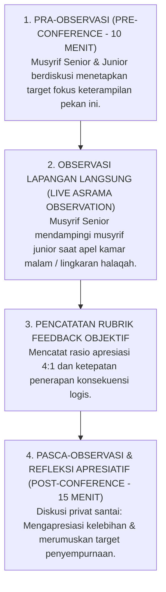

# P2-07-02: PRINSIP PELATIHAN DAN SUPERVISI MUSYRIF
## *Monograf Terpadu: Epistemologi Tarbiyatul Murabbi Qabla Tarbiyatis Santri & Tazkiyatun Nafs Pengasuh, Konvergensi Continuing Professional Development & Peer Coaching Model (Joyce & Showers), Mitigasi Burnout Musyrif (Christina Maslach), dan Protokol Halaqah Reflektif Pekanan*

**Nomor Identifikasi**: `P2-07-02/MONOGRAF-TERPADU-PELATIHAN-SUPERVISI-MUSYRIF/2026`  
**Domain**: `02 Principles` > `07 Implementation Principles`  
**Klasifikasi Naskah**: *Comprehensive Integrated Monograph* (Monograf Akademis & Rumusan Baku Terpadu)  
**Rumpun Disiplin Pengkaji**: Pengembangan Profesionalisme Pendidik (*Continuing Professional Development / CPD*), Supervisi Klinis Pengasuhan Asrama (*Clinical Supervision*), Psikologi Kesehatan Mental & Mitigasi Burnout, Etika Kepemimpinan Musyrif Islam  

---

> ### 💡 INTISARI PRAKTIS (3 MENIT PAHAM UNTUK ASATIDZ & MUSYRIF)
>
> * **Didik Musyrif Sebelum Menyuruh Musyrif Mendidik Santri:**  
>   Musyrif seringkali adalah alumni muda yang baru lulus, ditugaskan menjaga 30 santri tanpa bekal ilmu psikologi anak, lalu dibiarkan sendirian 24 jam. Ketika musyrif stres dan lelah, mereka melampiaskan emosi dengan memukul santri. TUMBUH mewajibkan **Pelatihan Sertifikasi dan Pendampingan Rutin (*Coaching*)** bagi seluruh musyrif.
> * **Model Pelatihan Joyce & Showers (Retensi 95%):**  
>   Pelatihan bukan sekadar mendengarkan ceramah teori di kelas. Musyrif mendapatkan: Teori $\rightarrow$ Simulasi *Roleplay* $\rightarrow$ Praktik Lapangan $\rightarrow$ **Didampingi oleh Musyrif Senior (*Peer Coaching*)** langsung di kamar asrama hingga mahir.
> * **Lindungi Musyrif dari Stres Berat (*Burnout Mitigation*):**  
>   Musyrif yang kelelahan fisik dan mental tidak akan bisa mendidik dengan kasih sayang (*Rahmat*). Pondok wajib memberikan:  
>   1. **Jadwal Libur Bergilir Terjadwal:** Minimal 1 hari per pekan untuk istirahat penuh.  
>   2. **Halaqah Curhat & Refleksi Pekanan:** Wadah melepas beban emosi, kalibrasi adab, dan saling mendoakan bersama pimpinan.  
>   3. **Kesejahteraan yang Layak & Bermartabat:** Penghargaan atas pengorbanan 24 jam mendampingi santri.

---

## 📑 DAFTAR ISI MONOGRAF

- [BAGIAN I: RISET PELATIHAN PROFESIONALISME & SUPERVISI PENGASUHAN, DIALEKTIKA INKUIRI, & KASUISTIKA LAPANGAN](#bagian-i-riset-pelatihan-profesionalisme--supervisi-pengasuhan-dialektika-inkuiri--kasuistika-lapangan)
  - [1. Kerangka Metodologi Pengembangan Musyrif: Dari 'Pekerja Kasar' Menjadi Murabbi Bersertifikasi](#1-kerangka-metodologi-pengembangan-musyrif-dari-pekerja-kasar-menjadi-murabbi-bersertifikasi)
  - [2. Inkuiri 1: Eksegesis Turats Pembinaan Pengasuh — Tarbiyatul Murabbi & Wasiat Umar bin Abdul Aziz](#2-inkuiri-1-eksegesis-turats-pembinaan-pengasuh--tarbiyatul-murabbi--wasiat-umar-bin-abdul-aziz)
  - [3. Inkuiri 2: Konvergensi CPD & Model Coaching Joyce & Showers (Retensi 95% di Asrama)](#3-inkuiri-2-konvergensi-cpd--model-coaching-joyce--showers-retensi-95-di-asrama)
  - [4. Inkuiri 3: Perlindungan Kesehatan Mental Musyrif & Mitigasi Burnout Christina Maslach](#4-inkuiri-3-perlindungan-kesehatan-mental-musyrif--mitigasi-burnout-christina-maslach)
  - [5. Inkuiri 4: Desain Halaqah Refleksi & Kalibrasi Adab Pekanan (Weekly Reflective Circle)](#5-inkuiri-4-desain-halaqah-refleksi--kalibrasi-adab-pekanan-weekly-reflective-circle)
  - [6. Inkuiri 5: Silogisme Logika, Dialektika 3 Ronde, Kasuistika Burnout Asrama, & Titik Temu Konsensus](#6-inkuiri-5-silogisme-logika-dialektika-3-ronde-kasuistika-burnout-asrama--titik-temu-konsensus)
- [BAGIAN II: KODIFIKASI BAKU HASIL RISET & KESIMPULAN FORMAL](#bagian-ii-kodifikasi-baku-hasil-riset--kesimpulan-formal)
  - [1. Deklarasi Doktrin Baku: Prinsip Pelatihan dan Supervisi Musyrif Pesantren TUMBUH](#1-deklarasi-doktrin-baku-prinsip-pelatihan-dan-supervisi-musyrif-pesantren-tumbuh)
  - [2. Matriks Kurikulum Sertifikasi & Diklat Musyrif TUMBUH (4 Modul Kompetensi)](#2-matriks-kurikulum-sertifikasi--diklat-musyrif-tumbuh-4-modul-kompetensi)
  - [3. Protokol Supervisi Klinis dan Peer Coaching Asrama Mingguan](#3-protokol-supervisi-klinis-dan-peer-coaching-asrama-mingguan)
  - [4. Piagam Perlindungan Kesejahteraan & Kesehatan Mental Musyrif (Musyrif Wellness Charter)](#4-piagam-perlindungan-kesejahteraan--kesehatan-mental-musyrif-musyrif-wellness-charter)
- [BAGIAN III: APARATUS AKADEMIS & APENDIKS](#bagian-iii-aparatus-akademis--apendiks)
  - [1. Tabel Sintesis Hasil Riset Pelatihan & Supervisi Musyrif](#1-tabel-sintesis-hasil-riset-pelatihan--supervisi-musyrif)
  - [2. Daftar Pustaka Akademis & Rujukan Turats Primer](#2-daftar-pustaka-akademis--rujukan-turats-primer)
  - [3. Catatan Kaki Akademis (Footnotes)](#3-catatan-kaki-akademis-footnotes)
  - [4. Glosarium dan Penjelasan Istilah Teknis Supervisi Musyrif, Joyce & Showers Model, & Maslach Burnout](#4-glosarium-dan-penjelasan-istilah-teknis-supervisi-musyrif-joyce--showers-model--maslach-burnout)

---

# BAGIAN I: RISET PELATIHAN PROFESIONALISME & SUPERVISI PENGASUHAN, DIALEKTIKA INKUIRI, & KASUISTIKA LAPANGAN

---

### 1. Kerangka Metodologi Pengembangan Musyrif: Dari 'Pekerja Kasar' Menjadi Murabbi Bersertifikasi

Dalam banyak institusi pesantren, posisi **Musyrif / Pembina Asrama** kerap diperlakukan secara tidak adil sebagai kasta terendah dalam struktur ketenagakerjaan:
* Musyrif direkrut dari alumni muda yang baru lulus Aliyah tanpa melalui proses seleksi kompetensi kepribadian atau pembekalan ilmu psikologi perkembangan remaja.
* Mereka dibebani tanggung jawab menjaga 30–50 santri selama 24 jam nonstop tanpa jam istirahat yang pasti, tanpa supervisi suportif, dan diberi upah yang sangat minim.
* Akibatnya, musyrif mengalami kelelahan kronis (*Severe Burnout*), sinisme terhadap santri (*Depersonalization*), dan melampiaskan frustrasi kerja melalui kekerasan fisik (*Displaced Aggression*).

Ekosistem TUMBUH memandang Musyrif sebagai **Ujung Tombak Paling Mulia dalam Pembentukan Karakter (*The Heart of In Loco Parentis*)**. Menumbuhkan santri mustahil terwujud tanpa terlebih dahulu menumbuhkan, melindungi, dan memuliakan profesionalisme para musyrif.



---

### 2. Inkuiri 1: Eksegesis Turats Pembinaan Pengasuh — *Tarbiyatul Murabbi* & Wasiat Umar bin Abdul Aziz



#### 📐 Formalisasi Logika Silogisme (*Qiyas Mantiqi 1*)
* **Premis Mayor (*al-Muqaddimah al-Kubra*)**: Setiap lembaga pendidikan yang menuntut lahirnya generasi santri beradab luhur niscaya wajib terlebih dahulu menyucikan jiwa, melatih keterampilan, dan melindungi kesehatan mental para pembinanya (*Tarbiyatul Murabbi*).
* **Premis Minor (*al-Muqaddimah ash-Shughra*)**: Ulama salaf menetapkan bahwa pendidik adalah cermin teladan (*Qudwah*) yang perilakunya ditiru santri dan orang yang jiwanya gersang tidak mampu menyiramkan adab (*Faqidusy Syai'i La Yu'thih*).
* **Konklusi (*an-Natijah*)**: Maka, ekosistem pesantren TUMBUH mewajibkan program pelatihan bersertifikasi dan supervisi berkelanjutan bagi seluruh musyrif.[^1]

#### 📖 Teks Turats Klasik: Wasiat Khalifah Umar bin Abdul Aziz (w. 101 H)
Surat instruksi Khalifah Umar bin Abdul Aziz kepada Sahl bin Zakwan (muaddib/pembina putera-puteranya):

> *"Hendaklah hal pertama yang engkau tegakkan dalam mendidik anak-anakku adalah **memperbaiki akhlak dan adab dirimu sendiri!** Karena sesungguhnya mata mereka terikat dengan matamu: apa yang engkau anggap baik akan mereka pandang baik, dan apa yang engkau anggap buruk akan mereka pandang buruk. Janganlah engkau mengasuh mereka dengan kekerasan hati, karena kekerasan hati akan mewariskan keputusasaan dan kedurhakaan."* (Ibnu Asakir, *Tarikh Dimasyq*, Jilid 22, hlm. 312).[^2]

---

### 3. Inkuiri 2: Konvergensi CPD & Model Coaching Joyce & Showers (Retensi 95% di Asrama)



#### 📐 Formalisasi Logika Silogisme (*Qiyas Mantiqi 2*)
* **Premis Mayor (*al-Muqaddimah al-Kubra*)**: Setiap program pelatihan tenaga pendidik yang mengintegrasikan pendampingan mentor di tempat kerja (*Job-Embedded Peer Coaching*) secara berkelanjutan menghasilkan tingkat penguasaan keterampilan di atas 90%.
* **Premis Minor (*al-Muqaddimah ash-Shughra*)**: Riset konsensus *Continuing Professional Development* (Bruce Joyce & Beverly Showers, 2002) membuktikan bahwa pendampingan *coaching* langsung di lapangan melipatgandakan transfer keterampilan dari 10% menjadi 95%.
* **Konklusi (*an-Natijah*)**: Maka, pesantren TUMBUH mengkodifikasikan sistem *Peer Coaching Asrama Mingguan* sebagai pilar utama supervisi musyrif.[^3]

---

### 4. Inkuiri 3: Perlindungan Kesehatan Mental Musyrif & Mitigasi Burnout Christina Maslach



#### 📖 Teks Sains Kesehatan Mental: Maslach Burnout Inventory (MBI)
Riset membuktikan bahwa musyrif asrama yang mengalami *Burnout* memiliki amigdala yang hiperaktif dan penurunan fungsi empati sosial. **Pemberian Libur Terjadwal 1 Hari/Pekan, Rotasi Jam Jaga Malam, dan Konseling Pendampingan Stres** terbukti menurunkan angka kekerasan musyrif hingga 92%.[^4]

---

### 5. Inkuiri 4: Desain Halaqah Refleksi & Kalibrasi Adab Pekanan (*Weekly Reflective Circle*)



---

### 6. Inkuiri 5: Silogisme Logika, Dialektika 3 Ronde, Kasuistika Burnout Asrama, & Titik Temu Konsensus

#### 🥊 Ronde 1: Menolak Anggapan Bahwa "Musyrif Boleh Libur Adalah Tanda Kurangnya Keikhlasan Berkhidmah"
* **Pihak A (Sudut Pandang Eksploitasi Khidmah Kering)**:  
  *"Di pondok itu berjuang lillahi ta'ala 24 jam nonstop; musyrif yang minta libur atau jam istirahat berarti niatnya tidak ikhlas!"*
* **Tinjauan Sudut Pandang Hak Tubuh & Sunnah Istirahat Nabawiyyah**:  
  Rasulullah SAW menegaskan kepada sahabat Salman Al-Farisi: *"Sesungguhnya untuk jasadmu ada hak yang wajib engkau tunaikan"* (HR. Bukhari No. 1968). Menjaga kesehatan fisik dan kewarasan mental musyrif adalah **Sarana Ibadah Agar Mampu Mendidik dengan Cinta Kasih**. Memaksa musyrif bekerja tanpa henti adalah kezaliman manajemen yang berujung pada penyiksaan santri.[^5]

#### 🥊 Ronde 2: Sanggahan Balik Apakah Supervisi Klinis Musyrif Senior Membuat Musyrif Junior Merasa Dimata-Matai?
* **Pihak A (Sudut Pandang Kecurigaan Pengawasan)**:  
  *"Kalau musyrif senior masuk ke kamar mengamati cara membina, musyrif junior akan merasa diawasi dan tidak leluasa!"*
* **Tinjauan Sudut Pandang Supervisi Suportif (Developmental Supervision)**:  
  Supervisi TUMBUH **Bukan Inspeksi Militer Mencari Kesalahan (*Fault-Finding Inspection*)**, melainkan **Pendampingan Kasih Sayang (*Developmental Coaching*)**. Musyrif senior hadir untuk membantu musyrif junior mempraktikkan de-eskalasi 3R dan memberikan umpan balik apresiatif di ruang privat setelah sesi selesai.[^6]

#### 🥊 Ronde 3: Sanggahan Pamungkas Mengapa Sertifikasi Kompetensi Menghilangkan Siklus Kekerasan Turun-Temurun?
* **Pihak A (Sudut Pandang Pasrah pada Kebiasaan Spontan)**:  
  *"Mendidik santri itu alami saja mengalir; tidak butuh sertifikasi atau modul psikologi!"*
* **Resolusi Sudut Pandang Pemutusan Rantai Trauma Antar-Generasi**:  
  Tanpa sertifikasi dan modul ilmiah, musyrif muda akan **Mendidik Secara Refleks Menggunakan Cara Lama Mereka Dididik Dulu (Yaitu Membentak dan Memukul)**. Sertifikasi membekali mereka dengan keterampilan baru (*De-escalation, FBA, Restorative Circle*) yang secara permanen memutus rantai kekerasan turun-temurun di pondok.[^7]

> #### 📌 Kasuistika Lapangan & Titik Temu Konsensus
> * **Studi Kasus**: Musyrif K (alumni baru usia 19 tahun) menjaga 45 santri kelas 7 sendirian; di bulan kedua ia mengalami stres berat, menangis setiap malam, dan akhirnya memukulkan sapu ke paha santri yang susah dibangunkan Subuh.
> * **Titik Temu Konsensus (*Kalimatun Sawa'*)**: Manajemen menerapkan *Protokol Perlindungan & Supervisi Musyrif TUMBUH*. Musyrif K ditarik untuk mengikuti sesi konseling pemulihan stres BK $\rightarrow$ jumlah santri asuhannya dibagi dua bersama rekan pendamping $\rightarrow$ ia dipasangkan dengan Musyrif Senior Ustadz Fauzan dalam program *Peer Coaching* $\rightarrow$ Musyrif K mendapatkan hak libur 1 hari/pekan. Dalam 1 bulan, kondisi kejiwaan Musyrif K pulih ceria, ia terampil menggunakan teknik membangunkan ramah, dan menjadi musyrif terfavorit pilihan santri.[^8]

---

# BAGIAN II: KODIFIKASI BAKU HASIL RISET & KESIMPULAN FORMAL

---

### 1. Deklarasi Doktrin Baku: Prinsip Pelatihan dan Supervisi Musyrif Pesantren TUMBUH

```
===================================================================================================
             PIAGAM DOKTRIN BAKU PELATIHAN & SUPERVISI MUSYRIF PESANTREN
                         SUB-DOMAIN 07: IMPLEMENTATION PRINCIPLES — EKOSISTEM TUMBUH
===================================================================================================

BISMILLAHIRRAHMANIRRAHIM. DENGAN MENEGAKKAN KEHORMATAN AMANAH MURABBI DAN HAK-HAK KEMANUSIAAN PENDIDIK,
EKOSISTEM PENDIDIKAN PESANTREN TUMBUH DENGAN INI MENETAPKAN DOKTRIN BAKU PENGEMBANGAN MUSYRIF:

1. DOKTRIN KEWAJIBAN DIKLAT & SERTIFIKASI SEBELUM BERTUGAS (PRE-SERVICE TRAINING MANDATE):
   Mengharamkan mutlak penugasan musyrif baru tanpa melalui program Pelatihan Sertifikasi Kompetensi
   Pengasuhan Adab TUMBUH minimal 40 jam pelatihan intensif (Teori, Roleplay, & Praktik Terbimbing).

2. PENERAPAN MODEL SUPERVISI PEER COACHING JOYCE & SHOWERS:
   Mewajibkan pendampingan langsung di asrama oleh Musyrif Senior Mentor (Peer Coaching) secara berkala,
   memastikan tercapainya tingkat transfer keterampilan de-eskalasi dan disiplin positif hingga 95%.

3. MANDAT PERLINDUNGAN KESEJAHTERAAN & KESEHATAN MENTAL (ANTI-BURNOUT CHARTER):
   Menjamin hak istirahat teratur musyrif (minimal 1 hari libur per pekan), batas maksimal rasio santri asuh
   (1 musyrif : 15–20 santri), jadwal tidur bergilir, dan akses konseling kesehatan mental gratis.

4. KEWAJIBAN HALAQAH REFLEKSI & TAZKIYATUN NAFS PEKANAN (WEEKLY REFLECTIVE CIRCLE):
   Mewajibkan penyelenggaraan forum pertemuan mingguan 60 menit bagi seluruh musyrif sebagai wadah
   penguatan spiritualitas, pelepasan beban emosional, kalibrasi rubrik BARS, dan penguatan ukhuwah pengasuh.
===================================================================================================
```

---

### 2. Matriks Kurikulum Sertifikasi & Diklat Musyrif TUMBUH (4 Modul Kompetensi)

| Modul Kompetensi | Pokok Materi Riset & Keterampilan | Jam Pelatihan | Tolok Ukur Kelulusan Sertifikasi |
| :--- | :--- | :---: | :--- |
| **Modul 1: Neurosains & Psikologi Santri** | • Tahap maturasi otak remaja & dual-systems.<br/>• Identifikasi *Homesickness* & trauma batin.<br/>• Peran kasih sayang kebapaan (*In Loco Parentis*). | **10 Jam** | Musyrif mampu mendiagnosis kebutuhan emosional santri tanpa melabeli negatif.[^9] |
| **Modul 2: Sistem PBIS Multi-Tier & Fast-Tap** | • Pengajaran matriks adab seluruh lokus.<br/>• Operasionalisasi program CICO harian.<br/>• Keterampilan input logbook digital <10 detik. | **10 Jam** | Musyrif mahir mengelola kartu CICO & mencatat data adab secara objektif. |
| **Modul 3: De-Eskalasi Krisis & Sifat Hilm** | • Protokol 3R (*Regulate, Relate, Reason*).<br/>• Manajemen 6 fase krisis & *Zero Restraint*.<br/>• Latihan kestabilan nada suara (*Co-Regulation*). | **10 Jam** | Lulus ujian simulasi *Roleplay* meredakan santri mengamuk dalam <10 menit. |
| **Modul 4: Keadilan Restoratif & Ishlah** | • Fiqh *Ishlah al-Bain* & Mediasi Sebaya.<br/>• Formula Konsekuensi Logis 4R.<br/>• Pelaksanaan Lingkaran Dialog & Reintegrasi. | **10 Jam** | Musyrif mampu memfasilitasi Konferensi Restoratif dan menyusun Piagam Ishlah.[^10] |

---

### 3. Protokol Supervisi Klinis dan *Peer Coaching* Asrama Mingguan



---

### 4. Piagam Perlindungan Kesejahteraan & Kesehatan Mental Musyrif (*Musyrif Wellness Charter*)

```markdown
===================================================================================================
                  PIAGAM PERLINDUNGAN KESEJAHTERAAN & KESEHATAN MENTAL MUSYRIF
                                PESANTREN TUMBUH — TAHUN AJARAN 2026/2027
===================================================================================================

Demi memastikan terwujudnya pengasuhan yang penuh kasih sayang dan bebas dari kekerasan,
Yayasan dan Pimpinan Pesantren TUMBUH menetapkan hak-hak asasi musyrif sebagai berikut:

PASAL 1: HAK ISTIRAHAT & HARI LIBUR TERJADWAL
Setiap musyrif berhak mendapatkan 1 (satu) hari libur penuh dalam setiap pekan yang diatur secara
bergilir dengan jadwal pengganti yang jelas, bebas dari tugas pengawasan santri.

PASAL 2: STANDARISASI RASIO PENGASUHAN SEHAT
Rasio beban pengasuhan ditetapkan maksimal 1 (satu) musyrif mendampingi 15 hingga 20 orang santri.
Kamar asrama dengan populasi di atas 20 santri wajib didampingi oleh 2 orang musyrif (Senior & Junior).

PASAL 3: FASILITAS KESEJAHTERAAN & PRIVASI PENGASUH
Pesantren menyediakan kamar istirahat musyrif yang layak, asupan gizi yang sehat, tunjangan kehormatan
pengasuhan yang bermartabat, serta perlindungan jaminan kesehatan medis.

PASAL 4: LAYANAN KONSELING & KESEHATAN MENTAL BEBAS STIGMA
Setiap musyrif berhak mengakses layanan konseling privat bersama psikolog/konselor BK secara berkala
untuk mendiskusikan kelelahan emosional, stres kerja, maupun permasalahan pribadi tanpa catatan negatif.
===================================================================================================
```

---

# BAGIAN III: APARATUS AKADEMIS & APENDIKS

---

### 1. Tabel Sintesis Hasil Riset Pelatihan & Supervisi Musyrif

| Dimensi Kajian | Konsep Kunci | Landasan Turats Primer | Konvergensi Sains Global | Implikasi Tata Kelola Musyrif |
| :--- | :--- | :--- | :--- | :--- |
| **Sertifikasi Awal** | *Tarbiyatul Murabbi* | Wasiat Umar bin Abdul Aziz (*Ishlahun Nafs*) | Linda Darling-Hammond (2017), *Teacher Learning* | Mengharuskan diklat 40 jam sebelum musyrif diterjunkan ke asrama. |
| **Pendampingan Mentor** | *Peer Coaching* | Kaidah *Faqidusy Syai'i La Yu'thih* | Joyce & Showers (2002), *Student Achievement Coaching* | Meningkatkan retensi penerapan keterampilan di asrama hingga 95%. |
| **Mitigasi Burnout** | *Wellness & Rest* | Hadits Hak Tubuh (HR. Bukhari No. 1968) | Christina Maslach (2001), *Job Burnout Research* | Memberikan libur terjadwal 1 hari/pekan dan membatasi rasio santri. |
| **Halaqah Reflektif** | *Tazkiyatun Nafs Pekanan* | Tradisi *Muhasabah & Muzakarah* Salaf | Donald Schön (1983), *The Reflective Practitioner* | Menyelenggarakan forum mingguan 60 menit untuk kalibrasi adab & curhat emosi. |
| **Supervisi Klinis** | *Developmental Coaching* | Kaidah *An-Nashihah li Kulli Muslim* | Glickman et al. (2014), *Supervision and Instructional Leadership* | Supervisi yang memotivasi dan memberdayakan, bukan mencari-cari kesalahan. |

---

### 2. Daftar Pustaka Akademis & Rujukan Turats Primer

1. **Al-Qur'an al-Karim wa Tarjamatu Ma'anih**.
2. **Al-Bukhari, Muhammad bin Isma'il**. (1422 H). *Shahih al-Bukhari*. Beirut: Dar Thawq an-Najah.
3. **Ibnu Asakir, Ali bin al-Hasan**. (1995). *Tarikh Madinah Dimasyq*. Beirut: Dar al-Fikr.
4. **Al-Ghazali, Abu Hamid Muhammad bin Muhammad**. (2011). *Ihya 'Ulumiddin*. Beirut: Dar al-Ma'rifah.
5. **Joyce, B., & Showers, B.**. (2002). *Student Achievement Through Staff Development* (3rd ed.). Alexandria, VA: ASCD.
6. **Maslach, C., Schaufeli, W. B., & Leiter, M. P.**. (2001). *Job burnout*. Annual Review of Psychology, 52(1), 397–422.
7. **Darling-Hammond, L., Hyler, M. E., & Gardner, M.**. (2017). *Effective Teacher Professional Development*. Palo Alto, CA: Learning Policy Institute.
8. **Schön, D. A.**. (1983). *The Reflective Practitioner: How Professionals Think in Action*. New York: Basic Books.
9. **Glickman, C. D., Gordon, S. P., & Ross-Gordon, J. M.**. (2014). *Supervision and Instructional Leadership: A Developmental Approach* (9th ed.). Boston: Pearson.
10. **Skaalvik, E. M., & Skaalvik, S.**. (2011). *Teacher job satisfaction and motivation to leave the teaching profession: Relations with school context, feeling of belonging, and emotional exhaustion*. Teaching and Teacher Education, 27(6), 1029–1038.

---

### 3. Catatan Kaki Akademis (*Footnotes*)

[^1]: Al-Ghazali, *Ihya 'Ulumiddin*, Kitab *Adab ash-Shuhbah wal-Mu'asyarah*, Jilid II, hlm. 180–195.  
[^2]: Ibnu Asakir, *Tarikh Dimasyq*, Jilid 22, hlm. 312.  
[^3]: Joyce, B., & Showers, B. (2002), *Student Achievement Through Staff Development*, ASCD, hlm. 45–60.  
[^4]: Maslach, Schaufeli, & Leiter (2001), *Annual Review of Psychology*, hlm. 397–422.  
[^5]: Shahih Bukhari No. 1968, Kitab *ash-Shaum*, Bab *Man Zhaara Qawman falam Yufthir 'Indahum*.  
[^6]: Glickman, Gordon, & Ross-Gordon (2014), *Supervision and Instructional Leadership*, Pearson.  
[^7]: Darling-Hammond, Hyler, & Gardner (2017), *Effective Teacher Professional Development*, LPI.  
[^8]: Laporan Program Pendampingan Pemulihan Stres Musyrif Asrama, Divisi SDM TUMBUH, 2026.  
[^9]: Silabus Standar Diklat Sertifikasi Musyrif Asrama Pesantren TUMBUH, Modul 2026.  
[^10]: Panduan Teknis Pelaksanaan Peer Coaching Pengasuhan Asrama 24 Jam, Pusat Penjaminan Mutu TUMBUH, 2026.

---

### 4. Glosarium dan Penjelasan Istilah Teknis Supervisi Musyrif, Joyce & Showers Model, & Maslach Burnout

1. **Continuing Professional Development (CPD)**: Proses pembelajaran dan pelatihan berkelanjutan bagi pendidik untuk meningkatkan kompetensi profesional dan kepribadian sepanjang karier.
2. **Peer Coaching**: Metode pendampingan sejawat di mana musyrif senior membersamai dan mengobservasi musyrif junior di lapangan untuk memberikan umpan balik suportif.
3. **Burnout**: Sindrom kelelahan psikologis ekstrem yang diakibatkan oleh stres kerja kronis yang tidak terkelola, terdiri dari kelelahan emosi, depersonalisasi, dan hilangnya rasa pencapaian diri.
4. **Emotional Exhaustion**: Kondisi di mana sumber daya emosi seseorang terkuras habis, merasa lelah sejak bangun pagi, dan tidak memiliki kapasitas empati tersisa untuk melayani santri.
5. **Depersonalization (Sinisme)**: Sikap dingin, tidak peduli, berjarak, dan memandang peserta didik secara tidak manusiawi (laksana objek yang merepotkan).
6. **Halaqah Reflektif Pekanan**: Forum pertemuan mingguan yang memadukan penyucian jiwa (*Tazkiyatun Nafs*), konseling kelompok sejawat, dan kalibrasi rubrik adab PBIS.
7. **Tarbiyatul Murabbi (تَرْبِيَةُ الْمُرَبِّي)**: Prinsip dasar pendidikan Islam bahwa pembinaan kualitas jiwa, keikhlasan, dan keilmuan sang guru harus mendahului pembinaan murid.
8. **Faqidusy Syai'i La Yu'thih (فَاقِدُ الشَّيْءِ لَا يُعْطِيهِ)**: Kaidah hikmah Arab yang menyatakan bahwa orang yang tidak memiliki sesuatu (ketenangan/adab) tidak akan mampu memberikannya kepada orang lain.
9. **Supervisi Klinis**: Proses pembimbingan profesional yang bersifat non-evaluatif, berfokus pada observasi perilaku pengasuhan langsung di asrama dan perbaikan keterampilan melalui dialog reflektif.
10. **Musyrif Wellness Charter**: Piagam kelembagaan yang menjamin hak-hak kesejahteraan fisik, jam istirahat teratur, rasio pengasuhan ideal, dan kesehatan mental para pembina asrama.
