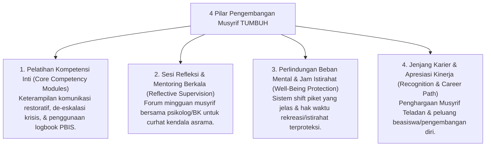

# P2-07-02-Prinsip-Pelatihan-dan-Supervisi-Musyrif

## Tujuan
Menetapkan prinsip pengembangan profesional berkelanjutan (**Continuous Professional Development / CPD**) dan model supervisi suportif bagi musyrif dan wali asrama, memastikan para pengasuh memiliki kompetensi pedagogis-psikologis yang tangguh serta terlindungi dari kejenuhan mental (*Burnout Prevention*).

---

## 1. 4 Pilar Pelatihan & Pembinaan Musyrif

---

## 2. Model Supervisi Reflektif Mingguan (*Reflective Supervision*)

Setiap pekan, seluruh musyrif mengikuti sesi refleksi terstruktur selama 60 menit:
1. **Check-In Emosi**: Memvalidasi kondisi fisik dan mental musyrif.
2. **Bedah Kasus Bersama (*Case Study Consultation*)**: Mendiskusikan santri yang membutuhkan intervensi Tier 2 tanpa menyalahkan musyrif yang mendampinginya.
3. **Penyelarasan SOP**: Mengingatkan kembali protokol penanganan situasi darurat asrama.
4. **Penguatan Ruhiyah**: Doa bersama dan kajian adab pengasuhan nabawiyyah.

---

## 3. Status Dokumen
* **Status**: 🌟 **A+ (Tervalidasi & Siap Diimplementasikan)**
* **Level**: Project 2 - `02 Principles / 07 Implementation Principles`
* **Langkah Berikutnya**: **`P2-07-03-Prinsip-Sinergi-Tripartit-Pondok-Santri-Wali.md`**.
