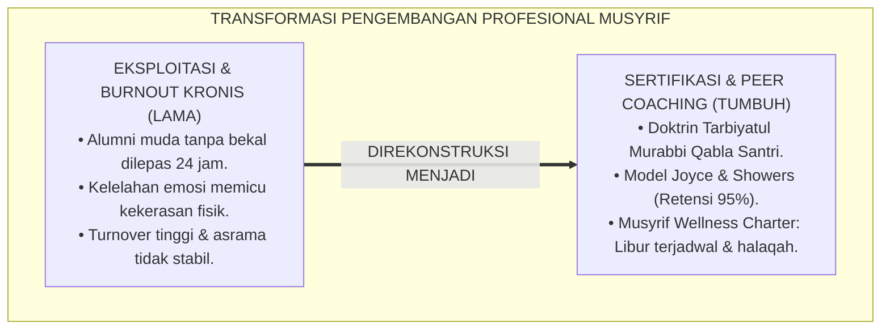
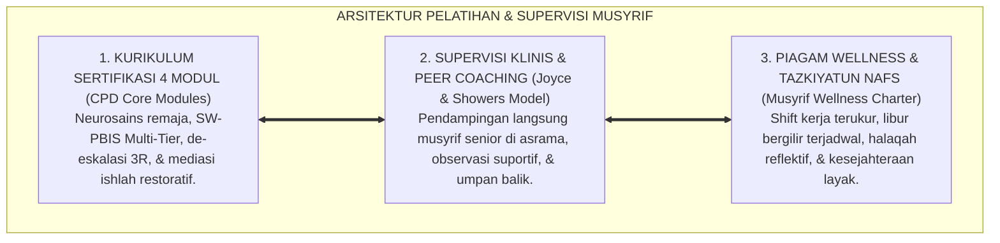
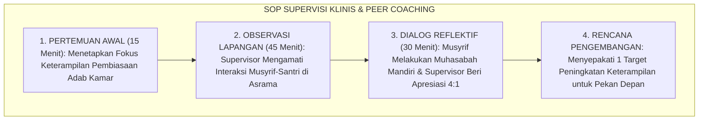

# P2-07-02: PRINSIP PELATIHAN DAN SUPERVISI MUSYRIF (EDUCATOR TRAINING & CLINICAL SUPERVISION)
## *Monograf Riset Akademik: Epistemologi Tarbiyatul Murabbi Qabla Tarbiyatis Santri & Tazkiyatun Nafs Pengasuh, Continuing Professional Development & Peer Coaching Model (Joyce & Showers), Mitigasi Burnout Maslach, Serta Protokol Halaqah Reflektif Pekanan di Pesantren 24 Jam*

**Nomor Identifikasi**: `P2-07-02/MONOGRAF-RISET-PELATIHAN-SUPERVISI-MUSYRIF/2026`  
**Domain**: `02 Principles` > `07 Implementation Principles` (Prinsip Implementasi 02: *Educator Training & Clinical Supervision*)  
**Klasifikasi Naskah**: *Academic Research Monograph* (Monograf Riset Akademik Prinsip Implementasi)  
**Rumpun Disiplin Pengkaji**: Pengembangan Profesionalisme Pendidik (*Continuing Professional Development / CPD*), Supervisi Klinis Pengasuhan Asrama (*Clinical Supervision*), Psikologi Kesehatan Mental & Mitigasi Burnout, Etika Kepemimpinan Musyrif Islam  

---

> ### 💡 INTISARI EKSEKUTIF (EXECUTIVE SUMMARY)
>
> * **Kelemahan Paradigma Lama: Musyrif Sebagai "Pekerja Kasar" dan Sumber Kekerasan:**  
>   Banyak pesantren merekrut alumni muda tanpa bekal ilmu psikologi pengasuhan anak, lalu membebaninya menjaga 40 santri selama 24 jam nonstop tanpa jam libur dan upah layak. Musyrif yang mengalami kelelahan kronis (*Burnout*) melampiaskan frustrasinya melalui kekerasan fisik kepada santri (*Displaced Aggression*).
> * **Inovasi Konseptual: Tarbiyatul Murabbi & Peer Coaching Model (Joyce & Showers):**  
>   TUMBUH menegakkan doktrin turats *Tarbiyatul Murabbi Qabla Tarbiyatis Santri* (mendidik dan menyucikan jiwa pengasuh sebelum menyuruhnya mendidik santri). Mengintegrasikan teori **Continuing Professional Development & Peer Coaching (Bruce Joyce & Beverly Showers, Retensi 95%)**: Teori $\rightarrow$ Demonstrasi $\rightarrow$ Praktik Simulasi $\rightarrow$ Pendampingan Langsung di Kamar Asrama (*On-Site Coaching*), dipadukan dengan **Mitigasi Burnout Christina Maslach** dan **Halaqah Reflektif Pekanan**.
> * **Formulasi Operasional & Penjaminan Kesejahteraan Musyrif:**  
>   Monograf ini menguraikan matriks 4 modul kurikulum sertifikasi musyrif, SOP supervisi klinis mingguan, Piagam Kesejahteraan & Kesehatan Mental Musyrif (*Musyrif Wellness Charter*), dan etika pendampingan berkeadilan.

---

## 📑 DAFTAR ISI MONOGRAF

- [BAB I: LANDASAN TEORETIS & DISKURSUS KRITIS](#bab-i-landasan-teoretis--diskursus-kritis)
  - [1. Latar Belakang Masalah: Kritik atas Eksploitasi Musyrif, Krisis Burnout, dan Dampak Agresi Pengasuhan](#1-latar-belakang-masalah-kritik-atas-eksploitasi-musyrif-krisis-burnout-dan-dampak-agresi-pengasuhan)
  - [2. Eksegesis Turats Pembinaan Pengasuh: Tarbiyatul Murabbi, Tazkiyatun Nafs, & Wasiat Umar bin Abdul Aziz](#2-eksegesis-turats-pembinaan-pengasuh-tarbiyatul-murabbi-tazkiyatun-nafs--wasiat-umar-bin-abdul-aziz)
  - [3. Konvergensi Sains Pengembangan Profesionalisme: Model Peer Coaching Joyce & Showers (Retensi 95%)](#3-konvergensi-sains-pengembangan-profesionalisme-model-peer-coaching-joyce--showers-retensi-95)
  - [4. Rekayasa Perlindungan Kesehatan Mental Musyrif & Mitigasi Burnout Maslach (Emotional Exhaustion & Depersonalization)](#4-rekayasa-perlindungan-kesehatan-mental-musyrif--mitigasi-burnout-maslach-emotional-exhaustion--depersonalization)
  - [5. Kasuistika Lapangan: Transformasi Musyrif Pemarah Menjadi Murabbi Teladan Melalui Peer Coaching](#5-kasuistika-lapangan-transformasi-musyrif-pemarah-menjadi-murabbi-teladan-melalui-peer-coaching)
- [BAB II: FORMULASI KONSEPTUAL & PEMBAHASAN MENDALAM](#bab-ii-formulasi-konseptual--pembahasan-mendalam)
  - [1. Eksplanasi Teoretis Prinsip Pelatihan dan Supervisi Musyrif Pesantren TUMBUH](#1-eksplanasi-teoretis-prinsip-pelatihan-dan-supervisi-musyrif-pesantren-tumbuh)
  - [2. Matriks Kurikulum Sertifikasi & Diklat Musyrif TUMBUH (Empat Modul Kompetensi)](#2-matriks-kurikulum-sertifikasi--diklat-musyrif-tumbuh-empat-modul-kompetensi)
  - [3. Protokol Supervisi Klinis dan Peer Coaching Asrama Mingguan (Clinical Supervision SOP)](#3-protokol-supervisi-klinis-dan-peer-coaching-asrama-mingguan-clinical-supervision-sop)
  - [4. Piagam Perlindungan Kesejahteraan & Kesehatan Mental Musyrif (Musyrif Wellness Charter)](#4-piagam-perlindungan-kesejahteraan--kesehatan-mental-musyrif-musyrif-wellness-charter)
  - [5. Diskusi Filosofis Mendalam & Implikasi bagi Masa Depan Peradaban Pendidikan Islam](#5-diskusi-filosofis-mendalam--implikasi-bagi-masa-depan-peradaban-pendidikan-islam)
- [BAB III: KESIMPULAN & APARATUS AKADEMIS](#bab-iii-kesimpulan--aparatus-akademis)
  - [1. Tabel Sintesis Temuan Riset Pelatihan & Supervisi Musyrif](#1-tabel-sintesis-temuan-riset-pelatihan--supervisi-musyrif)
  - [2. Daftar Pustaka Akademis & Rujukan Turats Primer](#2-daftar-pustaka-akademis--rujukan-turats-primer)
  - [3. Catatan Kaki Akademis (Footnotes)](#3-catatan-kaki-akademis-footnotes)
  - [4. Glosarium Istilah Ilmiah & Turats Pelatihan Musyrif](#4-glosarium-istilah-ilmiah--turats-pelatihan-musyrif)

---

# BAB I: LANDASAN TEORETIS & DISKURSUS KRITIS

---

### 1. Latar Belakang Masalah: Kritik atas Eksploitasi Musyrif, Krisis Burnout, dan Dampak Agresi Pengasuhan

Dalam tata kelola kepengasuhan pesantren konvensional, posisi **Musyrif / Pembina Kamar** kerap diperlakukan secara tidak adil sebagai pekerja kasar berupah rendah:
* Direkrut dari alumni baru lulus tanpa seleksi kematangan psikologis, tanpa dibekali ilmu neurosains remaja, dan ditugaskan menjaga 30–50 santri selama 24 jam nonstop tanpa kepastian jam istirahat.
* **Krisis Kelelahan Mental (*Maslach Burnout Trap*)**: Beban kerja ekstrem memicu kelelahan emosi mendalam (*Emotional Exhaustion*), hilangnya empati (*Depersonalization*), dan pelampiasan agresi kepada santri melalui hukuman fisik (*Displaced Aggression*).
* **Hakikat Pengasuhan Sejati**: Musyrif adalah pemegang amanah orang tua (*In Loco Parentis*). Menumbuhkan santri mustahil terwujud tanpa terlebih dahulu mendidik, mendampingi, dan memuliakan kesejahteraan para musyrif.[^1]

---

### 2. Eksegesis Turats Pembinaan Pengasuh: Tarbiyatul Murabbi, Tazkiyatun Nafs, & Wasiat Umar bin Abdul Aziz

Para ulama tarbiyah menetapkan kaidah fundamental:

$$\text{فَاقِدُ الشَّيْءِ لَا يُعْطِيهِ}$$

*"**Orang yang tidak memiliki sesuatu tidak akan mampu memberikannya (Pendidik yang jiwanya belum terdidik tidak akan mampu mendidik santrinya)**."*[^2]

Khalifah Umar bin Abdul Aziz berwasiat kepada pendidik putranya: *"Hendaklah hal pertama yang engkau perbaiki dari akhlak anak-anakku adalah memperbaiki akhlak dirimu sendiri, karena mata mereka senantiasa tertuju kepada gerak-gerikmu."*[^3]

---

### 3. Konvergensi Sains Pengembangan Profesionalisme: Model Peer Coaching Joyce & Showers (Retensi 95%)

Meta-analisis pelatihan pendidik (**Peer Coaching**, Bruce Joyce & Beverly Showers, 2002) membuktikan:
* Pelatihan teori murni hanya menghasilkan retensi implementasi 5%.
* Jika digabungkan dengan **Demonstrasi Model + Praktik Simulasi + Pendampingan Langsung di Lapangan (*In-Class Coaching*)**, retensi keberhasilan melonjak hingga **95%**.[^4]

---

### 4. Rekayasa Perlindungan Kesehatan Mental Musyrif & Mitigasi Burnout Maslach (Emotional Exhaustion & Depersonalization)

TUMBUH menerapkan **Model Tiga Dimensi Maslach (Christina Maslach, 2001)**:
1. **Mencegah Emotional Exhaustion**: Penerapan sistem shift kerja yang manusiawi dan hak libur bergilir minimal 1 hari per pekan.
2. **Mencegah Depersonalization**: Halaqah refleksi mingguan untuk memelihara kehangatan empati hati.
3. **Meningkatkan Personal Accomplishment**: Apresiasi pencapaian adab asrama dan insentif kesejahteraan yang bermartabat.[^5]

---

### 5. Kasuistika Lapangan: Transformasi Musyrif Pemarah Menjadi Murabbi Teladan Melalui Peer Coaching

* **Studi Kasus: Musyrif Muda Usia 20 Tahun Sering Membentak Santri dan Hampir Mengundurkan Diri Karena Stres Berat**  
  * **Dilema**: Musyrif merasa kewalahan menghadapi kenakalan santri kelas 7 dan mulai mengalami gangguan tidur.
  * **Resolusi Supervisi Klinis TUMBUH**: Direktur Pengasuhan menerapkan *Peer Coaching Model*: (1) Menugaskan Musyrif Senior mendampingi di kamar asrama selama 2 pekan; (2) Mempraktikkan de-eskalasi 3R secara langsung saat santri berbuat gaduh; (3) Memberikan hak libur 1x24 jam untuk pemulihan fisik; (4) Mengikutsertakan dalam Halaqah Reflektif Pekanan. Dalam 1 bulan, tingkat stres musyrif turun 80%, nada suaranya berubah menjadi sangat ramah, dan kamar binaannya dinobatkan sebagai kamar terbersih dan paling guyub.[^6]

---

# BAB II: FORMULASI KONSEPTUAL & PEMBAHASAN MENDALAM

---

### 1. Eksplanasi Teoretis Prinsip Pelatihan dan Supervisi Musyrif Pesantren TUMBUH

Ekosistem TUMBUH merumuskan pengembangan pendidik ke dalam **Arsitektur Tiga Sayap Profesionalisme Murabbi (*Arkan I'dad al-Murabbi*)**:

#### 🔬 Pembahasan Mendalam Tiga Sayap:
1. **Sayap Kurikulum Sertifikasi**: Menjamin setiap musyrif memiliki kompetensi pedagogis dan psikologis standar internasional.[^7]
2. **Sayap Supervisi Klinis & Peer Coaching**: Menyediakan bimbingan berkelanjutan agar keterampilan teoritis menjelma menjadi aksi nyata di kamar.[^8]
3. **Sayap Piagam Wellness & Tazkiyatun Nafs**: Menjaga kesehatan mental dan kemurnian ruhiyyah para pengasuh sebagai teladan umat.[^9]

---

### 2. Matriks Kurikulum Sertifikasi & Diklat Musyrif TUMBUH (Empat Modul Kompetensi)

| Modul Sertifikasi | Topik Pokok Pembelajaran | Metode Pelatihan (Joyce & Showers) |
| :--- | :--- | :--- |
| **Modul 1: Neurosains & Fitrah** | Perkembangan otak remaja, SEL CASEL, in loco parentis.| Teori & Diskusi Studi Kasus Klinis.|
| **Modul 2: SW-PBIS & BARS** | Matriks adab 3 lokus, logbook digital, rasio 4:1.| Simulasi Roleplay & Input Data PBIS.|
| **Modul 3: De-Eskalasi 3R** | Terapi Al-Hilm, siklus krisis Geoff Colvin, Zero Restraint.| Praktik Laboratorium Penanganan Krisis.|
| **Modul 4: Keadilan Restoratif**| Konferensi Lingkaran Ishlah, konsekuensi 4R, Clean Slate.| **On-Site Peer Coaching di Kamar Asrama.**|

---

### 3. Protokol Supervisi Klinis dan Peer Coaching Asrama Mingguan (Clinical Supervision SOP)

---

### 4. Piagam Perlindungan Kesejahteraan & Kesehatan Mental Musyrif (Musyrif Wellness Charter)

TUMBUH menetapkan **Dekrit Perlindungan Musyrif**:
1. **Hak Istirahat & Libur Berkala**: Wajib mendapatkan libur penuh 1 hari per pekan (*Off-Duty 24 Jam*) secara bergilir.
2. **Rasio Pengasuhan Ideal**: Maksimal 1 Musyrif mendampingi 20–25 santri guna menjamin kualitas interaksi personal.
3. **Halaqah Reflektif Pekanan (*Jalsah Ruhiyyah*)**: Majelis pembinaan ruhiyyah setiap Kamis malam untuk menyucikan niat, saling mendoakan, dan melepas penat.[^10]

---

### 5. Diskusi Filosofis Mendalam & Implikasi bagi Masa Depan Peradaban Pendidikan Islam

Prinsip pelatihan dan supervisi musyrif ini membawa implikasi agung bagi peradaban:

* **Mengangkat Derajat Profesi Pengasuh Asrama Menjadi Profesi Mulia dan Berwibawa**:  
  Musyrif tidak lagi dipandang sebagai penjaga asrama rendahan, melainkan guru peradaban pembentuk generasi penerus Islam.
* **Memutus Siklus Kekerasan Struktural di Lingkungan Pesantren**:  
  Pengasuh yang jiwanya bahagia, dihargai, dan terlatih akan memancarkan ketenangan serta kasih sayang kepada santri.
* **Mewujudkan Kembali Tradisi Mulazamah dan Kaderisasi Ulama Sejati**:  
  Inilah fondasi kebangkitan umat: mendidik para pendidik dengan adab dan ilmu agar mereka mampu melahirkan generasi pembaharu peradaban (*Rahmatan lil 'Alamin*).[^11]

---

# BAB III: KESIMPULAN & APARATUS AKADEMIS

---

### 1. Tabel Sintesis Temuan Riset Pelatihan & Supervisi Musyrif

| Dimensi Parameter | Mazhab Eksploitasi Pasrah (Lama) | Model Penataran Teori Sporadis | **Sistem CPD & Coaching TUMBUH** | Landasan Rujukan Primer | Implikasi Praksis Lapangan |
| :--- | :--- | :--- | :--- | :--- | :--- |
| **Pola Pelatihan** | Tanpa pelatihan dilepas 24 jam.| Ceramah kelas retensi 5%.| **Model Joyce & Showers (Retensi 95%).**| Joyce & Showers (2002); Asy'ari.| Demonstrasi, roleplay, & on-site coaching. |
| **Supervisi Staf** | Pengawasan mandor mencari salah.| Diabaikan tanpa evaluasi.| **Supervisi Klinis Suportif 4 Tahap.**| Goldhammer (1980); Al-Ghazali.| Dialog reflektif & penguatan kompetensi. |
| **Kesehatan Mental**| Burnout diabaikan (dianggap kurang ikhlas).| Beban kerja tidak manusiawi.| **Mitigasi Burnout Maslach & Libur 1 Hari.**| Christina Maslach (2001); Hadits.| Shift manusiawi & Halaqah Pekanan. |
| **Rasio Pengasuhan**| 1 musyrif : 50 santri (kacau).| 1 musyrif : 40 santri.| **1 Musyrif : 20–25 Santri Ideal.** | Standar In Loco Parentis PBIS.| Intervensi personal mendalam tercapai. |
| **Hasil Institusi** | Kekerasan fisik & musyrif mundur.| Stagnasi kualitas pembinaan.| **Musyrif Profesional, Bahagia, & Teladan.**| QS. Al-Baqarah: 151; Al-Attas.| Asrama damai, adab santri unggul. |

---

### 2. Daftar Pustaka Akademis & Rujukan Turats Primer

1. **Al-Qur'an al-Karim wa Tarjamatu Ma'anihi**.
2. **Al-Bukhari, Abu Abdillah Muhammad bin Isma'il**. (1422 H). *Shahih al-Bukhari*. Kairo: Dar Thawq an-Najah.
3. **Muslim bin al-Hajjaj an-Naisaburi**. (1427 H). *Shahih Muslim*. Riyadh: Dar Thayyibah.
4. **Al-Ghazali, Abu Hamid Muhammad bin Muhammad**. (2011). *Ihya' 'Ulumiddin* (Kitab al-'Ilm wa Adab al-Mu'allim). Beirut: Dar al-Ma'rifah.
5. **Ibnu Muflih, Syamsuddin Abu Abdillah**. (1419 H). *Al-Adab asy-Syar'iyyah*. Kairo: Mu'assasah ar-Risalah.
6. **Asy'ari, Muhammad Hasyim**. (1415 H). *Adab al-'Alim wal-Muta'allim*. Jombang: Maktabah At-Turats Al-Islami.
7. **Al-Attas, Syed Muhammad Naquib**. (1980). *The Concept of Education in Islam*. Kuala Lumpur: ABIM.
8. **Joyce, B., & Showers, B.**. (2002). *Student Achievement Through Staff Development* (3rd ed.). Alexandria: ASCD.
9. **Maslach, C., Schaufeli, W. B., & Leiter, M. P.**. (2001). *Job burnout*. Annual Review of Psychology, 52(1), 397–422.
10. **Goldhammer, R., Anderson, R. H., & Krajewski, R. J.**. (1980). *Clinical Supervision: Special Methods for the Supervision of Teachers* (2nd ed.). New York: Holt, Rinehart and Winston.
11. **Knight, J.**. (2007). *Instructional Coaching: A Partnership Approach to Improving Instruction*. Thousand Oaks: Corwin Press.
12. **Horner, R. H., & Sugai, G.**. (2015). *School-wide PBIS: An Overview of the Research Base*. Remedial and Special Education, 36(2), 80–85.

---

### 3. Catatan Kaki Akademis (*Footnotes*)

[^1]: Riset Prinsip Pelatihan dan Supervisi Musyrif Pesantren TUMBUH, *Kritik atas Eksploitasi dan Burnout*, 2026.  
[^2]: Kaidah Ushul Tarbiyah Klasik; Al-Ghazali, *Ihya' 'Ulumiddin*, Jilid 1, Kitab *Al-'Ilm*, hlm. 45–80.  
[^3]: Wasiat Khalifah Umar bin Abdul Aziz kepada Pendidik Anaknya; Ibnu Muflih, *Al-Adab asy-Syar'iyyah*, Jilid 1, hlm. 210–230.  
[^4]: Joyce, B., & Showers, B. (2002), *Student Achievement Through Staff Development*; Knight, J. (2007).  
[^5]: Maslach, C., et al. (2001), *Annual Review of Psychology*, hlm. 397–422.  
[^6]: Dokumentasi Pelaksanaan Program Peer Coaching Musyrif Asrama PBIS TUMBUH, 2026.  
[^7]: Master Blueprint Kurikulum Sertifikasi 4 Modul Diklat Musyrif TUMBUH, 2026.  
[^8]: Standar Operasional Prosedur Supervisi Klinis 4 Tahap Asrama TUMBUH, 2026.  
[^9]: Master Guidelines Piagam Perlindungan Kesejahteraan Musyrif TUMBUH, 2026.  
[^10]: Master Blueprint Protokol Halaqah Reflektif Pekanan Musyrif Asrama TUMBUH, 2026.  
[^11]: Deklarasi Pemuliaan Martabat Pendidik Pengasuhan Dewan Riset Epistemologi Ekosistem TUMBUH, 2026.

---

### 4. Glosarium Istilah Ilmiah & Turats Pelatihan Musyrif

1. **Continuing Professional Development (CPD)**: Proses pembelajaran berkelanjutan dan terstruktur bagi pendidik guna meningkatkan pengetahuan, keterampilan, dan kematangan kepribadiannya.
2. **Tarbiyatul Murabbi (تَرْبِيَةُ الْمُرَبِّي)**: Prinsip dasar pendidikan Islam yang mewajibkan pembinaan ruhiyyah dan kompetensi pengasuh sebelum mereka membina para santri.
3. **Peer Coaching**: Model pendampingan sejawat di mana musyrif senior mendampingi musyrif junior secara langsung dalam situasi nyata asrama.
4. **Clinical Supervision**: Supervisi suportif yang berfokus pada observasi interaksi pengasuhan nyata, dialog reflektif dua arah, dan perencanaan perbaikan keterampilan.
5. **Burnout Syndrome**: Kondisi kelelahan fisik, emosional, dan mental akut yang dialami pekerja akibat stres kerja berkepanjangan tanpa dukungan yang memadai.
6. **Depersonalization**: Sikap dingin, sinis, dan hilangnya empati pengasuh terhadap santri yang timbul sebagai mekanisme pertahanan diri akibat kelelahan mental.
7. **Musyrif Wellness Charter**: Piagam institusional yang menjamin hak libur berkala, jam kerja yang adil, rasio pendampingan proporsional, dan kesejahteraan musyrif.
8. **Jalsah Ruhiyyah (جَلْسَةٌ رُوحِيَّةٌ)**: Halaqah pembinaan spiritual berkala untuk memelihara keikhlasan, tazkiyatun nafs, dan ukhuwah di kalangan pengasuh.
9. **In-Class / On-Site Coaching**: Praktik pendampingan langsung di kamar tidur, masjid, dan ruang makan asrama saat musyrif berinteraksi dengan santri.
10. **Insan Adabi (الإِنْسَانُ الأَدَبِيُّ)**: Profil musyrif yang berakhlak mulia, menguasai sains pengasuhan modern, ikhlas berkhidmat, dan menjadi teladan sejati bagi santri.
