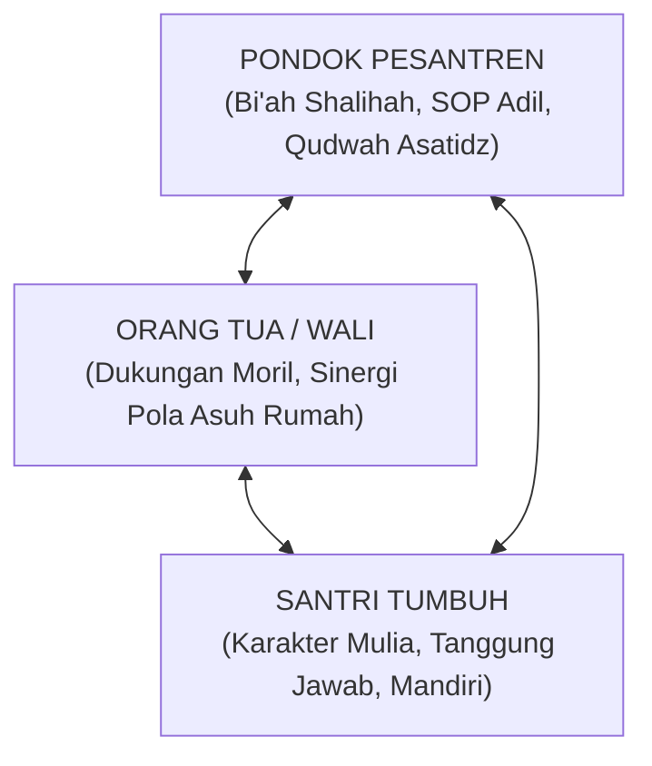

# P2-07-03-Prinsip-Sinergi-Tripartit-Pondok-Santri-Wali

## Tujuan
Menetapkan prinsip kemitraan tripartit yang kokoh antara **Pondok Pesantren**, **Santri**, dan **Orang Tua / Wali Santri**, menjamin kesinambungan nilai dan pembiasaan adab dari pesantren hingga ke rumah (*Ecological Systems Consistency*).

---

## 1. Segitiga Emas Kemitraan Tripartit

---

## 2. 3 Kaidah Baku Kemitraan Orang Tua

1. **Keselarasan Ekspektasi Sejak Awal (*Upfront Alignment*)**:
   - Saat mendaftar, orang tua menandatangani komitmen bersama mengenai penerapan **Disiplin Restoratif** (tidak menuntut hukuman fisik pada anak orang lain, dan siap berkolaborasi jika anak sendiri khilaf).
2. **Komunikasi Proaktif Berita Baik (*Proactive Positive Communication*)**:
   - Musyrif tidak hanya menghubungi orang tua saat santri bermasalah. Musyrif secara berkala mengirimkan catatan apresiasi kebaikan (*Positive Postcard / WhatsApp Update*) tentang capaian adab santri.
3. **Panduan Adab Liburan Semester (*Vacation Habit Continuity*)**:
   - Sebelum santri pulang liburan, pesantren memberikan lembar panduan sederhana bagi orang tua untuk menjaga rutinitas sholat berjamaah, tilawah, dan pembatasan gawai di rumah.

---

## 3. Status Dokumen
* **Status**: 🌟 **A+ (Tervalidasi & Siap Diimplementasikan)**
* **Level**: Project 2 - `02 Principles / 07 Implementation Principles`
* **Langkah Berikutnya**: **`P2-07-04-Prinsip-Penjaminan-Mutu-dan-Continuous-Improvement.md`**.
