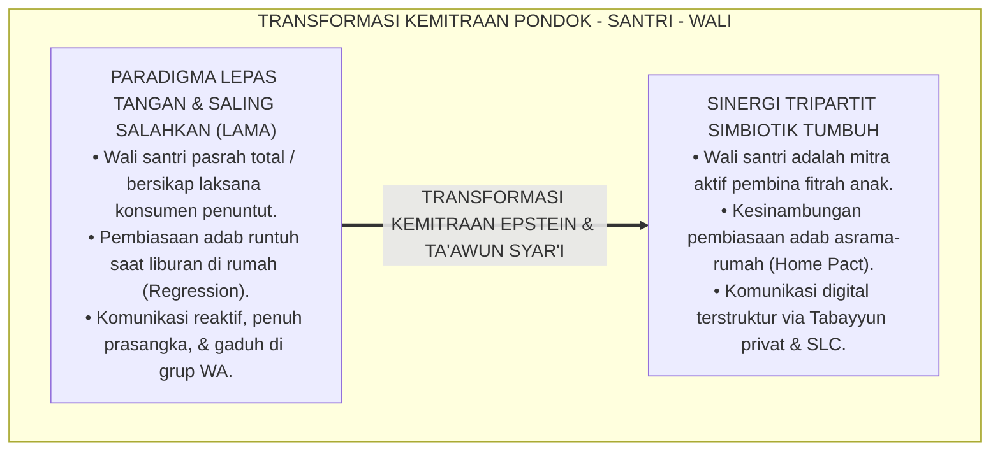
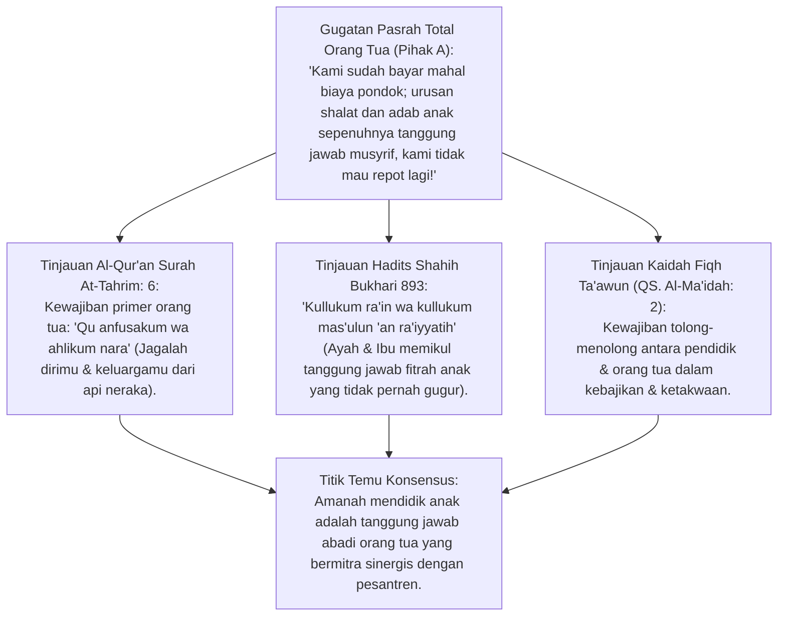
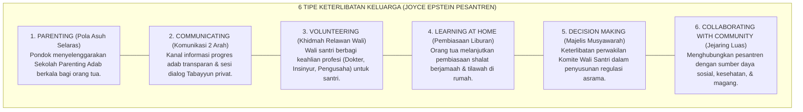
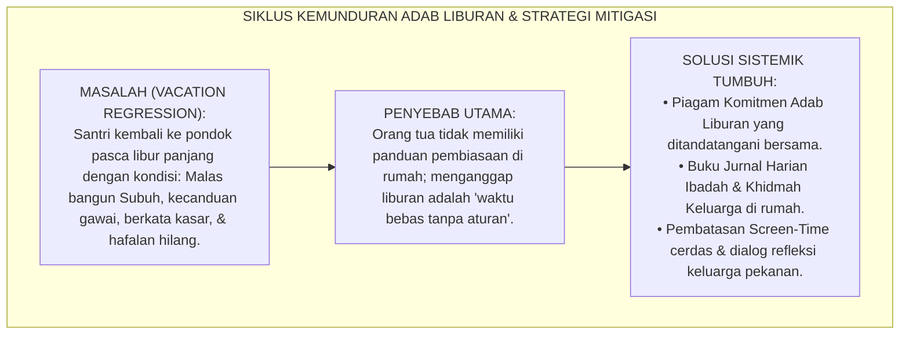
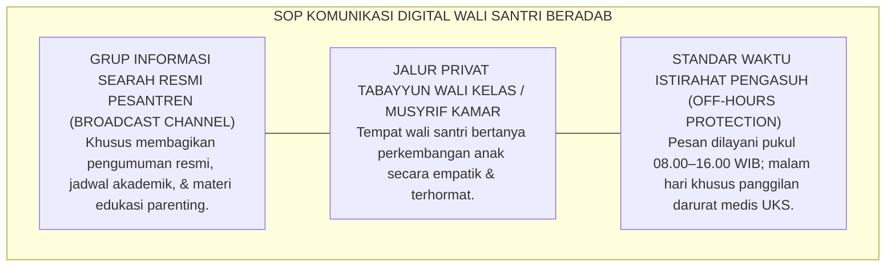
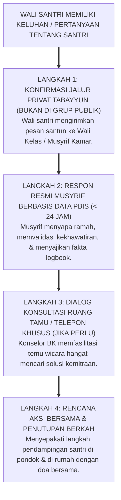

# P2-07-03: PRINSIP SINERGI TRIPARTIT PONDOK, SANTRI, DAN WALI
## *Monograf Terpadu: Epistemologi Amanah Pengasuhan (QS. At-Tahrim: 6 & HR. Bukhari No. 893) serta Kaidah Ta'awun 'alal Birri wat-Taqwa, Konvergensi Framework 6 Tipe Keterlibatan Keluarga (Joyce L. Epstein), Mitigasi Fenomena Kemunduran Adab Liburan (Vacation Regression), dan Tata Kelola Komunikasi Digital Beradab*

**Nomor Identifikasi**: `P2-07-03/MONOGRAF-TERPADU-SINERGI-TRIPARTIT/2026`  
**Domain**: `02 Principles` > `07 Implementation Principles`  
**Klasifikasi Naskah**: *Comprehensive Integrated Monograph* (Monograf Akademis & Rumusan Baku Terpadu)  
**Rumpun Disiplin Pengkaji**: Kemitraan Sekolah, Keluarga, dan Komunitas (*School-Family-Community Partnerships*), Sosiologi Pendidikan Keluarga Muslim, Komunikasi Pedagogis Kemitraan Orang Tua, Fiqh Amanah dan Tanggung Jawab Pengasuhan  

---

> ### 💡 INTISARI PRAKTIS (3 MENIT PAHAM UNTUK ASATIDZ & MUSYRIF)
>
> * **Hapus Budaya "Pasrah Bongkokan / Lepas Tangan" Orang Tua:**  
>   Banyak orang tua menganggap setelah membayar SPP dan menitipkan anak di pondok, mereka lepas tanggung jawab 100%. Ketika anak pulang liburan, orang tua membiarkan anak bermain gawai seharian dan meninggalkan shalat. TUMBUH menegakkan **Sinergi Tripartit (Pondok - Santri - Wali Santri)** sebagai satu kesatuan tarbiyah yang tak terpisahkan.
> * **Enam Pilar Kemitraan Keluarga Model Epstein di Pesantren:**  
>   1. **Pola Asuh (Parenting):** Seminar parenting adab berkala bagi wali santri.  
>   2. **Komunikasi (Communicating):** Info perkembangan via aplikasi & tabayyun santun tanpa ribut di grup WA.  
>   3. **Khidmah Relawan (Volunteering):** Wali santri berbagi ilmu keahlian profesi bagi santri.  
>   4. **Belajar di Rumah (Learning at Home):** Menjaga shalat berjamaah dan muraja'ah saat liburan semester.  
>   5. **Musyawarah (Decision Making):** Pelibatan Majelis Wali Santri dalam penyusunan kebijakan adab.  
>   6. **Jejaring Komunitas (Collaborating):** Sinergi dengan alumni dan tokoh masyarakat.
> * **Cegah Penyakit "Lupa Adab Saat Liburan" (*Vacation Regression*):**  
>   Sebelum liburan, santri dan orang tua menandatangani **Piagam Komitmen Adab Liburan**. Santri tetap mengisi jurnal harian ibadah, dan orang tua menyambut kepulangan anak dengan pelukan serta dialog bermakna.

---

## 📑 DAFTAR ISI MONOGRAF

- [BAGIAN I: RISET SINERGI KEMITRAAN TRIPARTIT & KESINAMBUNGAN ADAB RUMAH-PESANTREN, DIALEKTIKA INKUIRI, & KASUISTIKA LAPANGAN](#bagian-i-riset-sinergi-kemitraan-tripartit--kesinambungan-adab-rumah-pesantren-dialektika-inkuiri--kasuistika-lapangan)
  - [1. Kerangka Metodologi Kemitraan Tripartit: Menghapus Budaya Lepas Tangan Orang Tua](#1-kerangka-metodologi-kemitraan-tripartit-menghapus-budaya-lepas-tangan-orang-tua)
  - [2. Inkuiri 1: Eksegesis Turats Amanah Pengasuhan Keluarga — QS. At-Tahrim: 6 & Kullukum Ra'in](#2-inkuiri-1-eksegesis-turats-amanah-pengasuhan-keluarga--qs-at-tahrim-6--kullukum-rain)
  - [3. Inkuiri 2: Konvergensi Framework 6 Tipe Keterlibatan Keluarga Joyce L. Epstein di Pesantren](#3-inkuiri-2-konvergensi-framework-6-tipe-keterlibatan-keluarga-joyce-l-epstein-di-pesantren)
  - [4. Inkuiri 3: Mitigasi Fenomena Kemunduran Adab Masa Liburan (The Vacation Regression Phenomenon)](#4-inkuiri-3-mitigasi-fenomena-kemunduran-adab-masa-liburan-the-vacation-regression-phenomenon)
  - [5. Inkuiri 4: Standarisasi Etika Komunikasi Digital Wali Santri (Respectful Digital Communication)](#5-inkuiri-4-standarisasi-etika-komunikasi-digital-wali-santri-respectful-digital-communication)
  - [6. Inkuiri 5: Silogisme Logika, Dialektika 3 Ronde, Kasuistika Sinergi Wali Asrama, & Titik Temu Konsensus](#6-inkuiri-5-silogisme-logika-dialektika-3-ronde-kasuistika-sinergi-wali-asrama--titik-temu-konsensus)
- [BAGIAN II: TEMUAN RISET, FORMULASI KONSEPTUAL & PEMBAHASAN](#bagian-ii-temuan-riset-formulasi-konseptual--pembahasan)
  - [1. Formulasi Konseptual: Prinsip Sinergi Tripartit Pesantren TUMBUH](#1-formulasi-konseptual-prinsip-sinergi-tripartit-pesantren-tumbuh)
  - [2. Matriks 6 Tipe Keterlibatan Keluarga Joyce Epstein Versi Pesantren TUMBUH](#2-matriks-6-tipe-keterlibatan-keluarga-joyce-epstein-versi-pesantren-tumbuh)
  - [3. Piagam Perjanjian Sinergi Kemitraan Orang Tua - Pondok (Parent-School Partnership Pact)](#3-piagam-perjanjian-sinergi-kemitraan-orang-tua---pondok-parent-school-partnership-pact)
  - [4. Alur Standar Operasional Prosedur Penanganan Komunikasi & Keluhan Wali Santri](#4-alur-standar-operasional-prosedur-penanganan-komunikasi--keluhan-wali-santri)
- [BAGIAN III: APARATUS AKADEMIS & APENDIKS](#bagian-iii-aparatus-akademis--apendiks)
  - [1. Tabel Sintesis Hasil Riset Sinergi Tripartit](#1-tabel-sintesis-hasil-riset-sinergi-tripartit)
  - [2. Daftar Pustaka Akademis & Rujukan Turats Primer](#2-daftar-pustaka-akademis--rujukan-turats-primer)
  - [3. Catatan Kaki Akademis (Footnotes)](#3-catatan-kaki-akademis-footnotes)
  - [4. Glosarium dan Penjelasan Istilah Teknis Sinergi Tripartit, Epstein Framework, & Vacation Regression](#4-glosarium-dan-penjelasan-istilah-teknis-sinergi-tripartit-epstein-framework--vacation-regression)

---

# BAGIAN I: RISET SINERGI KEMITRAAN TRIPARTIT & KESINAMBUNGAN ADAB RUMAH-PESANTREN, DIALEKTIKA INKUIRI, & KASUISTIKA LAPANGAN

---

### 1. Kerangka Metodologi Kemitraan Tripartit: Menghapus Budaya Lepas Tangan Orang Tua

Dalam realitas sosiologis pendidikan pesantren, kerap dijumpai **Keretakan Ekologis Pendidikan (*Educational Ecological Disconnect*)**:
* Sebagian orang tua mengadopsi mentalitas *"Konsumen Lepas Tangan"*: menganggap bahwa setelah menyetorkan dana pendidikan dan menitipkan anak, seluruh beban pembentukan karakter berpindah mutlak ke pundak musyrif dan kyai.
* Ketika santri pulang ke rumah saat liburan, orang tua merusak seluruh pembiasaan disiplin asrama: membiarkan santri begadang menonton televisi, tidak shalat Subuh berjamaah, dan bermain gawai belasan jam tanpa batas (*Permissive Parenting at Home*).
* Sebaliknya, ketika santri menghadapi masalah di pondok, orang tua langsung menyerang musyrif di grup pesan digital tanpa tabayyun, menciptakan ketegangan permusuhan yang merugikan santri.

Ekosistem TUMBUH memandang pendidikan sebagai **Sinergi Tripartit Simbiotik (*Pondok, Santri, dan Keluarga*)**. Keberhasilan pembinaan adab menuntut keselarasan nilai 360 derajat antara iklim kamar asrama dan ruang keluarga di rumah.

---

### 2. Inkuiri 1: Eksegesis Turats Amanah Pengasuhan Keluarga — QS. At-Tahrim: 6 & *Kullukum Ra'in*

#### 📐 Formalisasi Logika Silogisme (*Qiyas Mantiqi 1*)
* **Premis Mayor (*al-Muqaddimah al-Kubra*)**: Setiap ikhtiar penjagaan fitrah tauhid dan pembinaan akhlak anak yang diperintahkan syariat niscaya menempatkan orang tua sebagai penanggung jawab primer (*al-Mas'ul al-Awwal*) yang berkolaborasi erat dengan para muaddib dan murabbi.
* **Premis Minor (*al-Muqaddimah ash-Shughra*)**: Allah SWT mewajibkan kepala keluarga menjaga anak dari siksa api neraka (QS. At-Tahrim: 6) dan Rasulullah SAW menegaskan bahwa orang tua adalah penggembala yang dimintai pertanggungjawaban atas fitrah anaknya (HR. Bukhari No. 893).
* **Konklusi (*an-Natijah*)**: Maka, orang tua santri di ekosistem TUMBUH wajib menjadi mitra aktif pembinaan karakter dan terikat dalam Piagam Sinergi Kemitraan.[^1]

#### 📖 Teks Primer Al-Qur'an & Hadits Shahih Al-Bukhari
Firman Allah SWT menegaskan kewajiban keluarga:

$$\text{يَا أَيُّهَا الَّذِينَ آمَنُوا قُوا أَنْفُسَكُمْ وَأَهْلِيكُمْ نَارًا وَقُودُهَا النَّاسُ وَالْحِجَارَةُ عَلَيْهَا مَلَائِكَةٌ غِلَاظٌ شِدَادٌ لَا يَعْصُونَ اللَّهَ مَا أَمَرَهُمْ وَيَفْعَلُونَ مَا يُؤْمَرُونَ}$$

*"Wahai orang-orang yang beriman! **Peliharalah dirimu dan keluargamu dari api neraka** yang bahan bakarnya adalah manusia dan batu; penjaganya malaikat-malaikat yang kasar, dan keras, yang tidak durhaka kepada Allah terhadap apa yang Dia perintahkan kepada mereka dan selalu mengerjakan apa yang diperintahkan."* (QS. At-Tahrim [66]: 6).[^2]

Dan Abdullah bin Umar *radhiyallahu 'anhuma* meriwayatkan sabda Rasulullah SAW:

$$\text{كُلُّكُمْ رَاعٍ وَكُلُّكُمْ مَسْئُولٌ عَنْ رَعِيَّتِهِ ... وَالرَّجُلُ رَاعٍ فِي أَهْلِهِ وَهُوَ مَسْئُولٌ عَنْ رَعِيَّتِهِ، وَالْمَرْأَةُ رَاعِيَةٌ فِي بَيْتِ زَوْجِهَا وَمَسْئُولَةٌ عَنْ رَعِيَّتِهَا}$$

*"**Setiap kalian adalah pemimpin (penggembala) dan setiap kalian akan dimintai pertanggungjawaban atas yang dipimpinnya** ... Seorang laki-laki (ayah) adalah pemimpin bagi keluarganya dan ia bertanggung jawab atas mereka, dan seorang wanita (ibu) adalah pemimpin di rumah suaminya dan ia bertanggung jawab atas apa yang dipimpinnya..."* (HR. Bukhari No. 893; Muslim No. 1829).[^3]

---

### 3. Inkuiri 2: Konvergensi *Framework 6 Tipe Keterlibatan Keluarga* Joyce L. Epstein di Pesantren

#### 📐 Formalisasi Logika Silogisme (*Qiyas Mantiqi 2*)
* **Premis Mayor (*al-Muqaddimah al-Kubra*)**: Setiap institusi pendidikan berasrama yang mengintegrasikan 6 dimensi kemitraan keluarga secara terstruktur menghasilkan peningkatan pencapaian karakter dan menekan angka pelanggaran santri hingga lebih dari 60%.
* **Premis Minor (*al-Muqaddimah ash-Shughra*)**: *Epstein’s Framework of Six Types of Involvement* (Prof. Joyce L. Epstein, 2001, 2018) membuktikan bahwa keberhasilan belajar anak bergantung pada tumpang-tindih bola pengaruh (*Overlapping Spheres of Influence*) antara Sekolah, Keluarga, dan Komunitas.
* **Konklusi (*an-Natijah*)**: Maka, ekosistem pesantren TUMBUH mengkodifikasikan 6 Tipe Epstein sebagai pedoman baku tata kelola hubungan wali santri.[^4]

---

### 4. Inkuiri 3: Mitigasi Fenomena Kemunduran Adab Masa Liburan (*The Vacation Regression Phenomenon*)

---

### 5. Inkuiri 4: Standarisasi Etika Komunikasi Digital Wali Santri (*Respectful Digital Communication*)

---

### 6. Inkuiri 5: Silogisme Logika, Dialektika 3 Ronde, Kasuistika Sinergi Wali Asrama, & Titik Temu Konsensus

#### 🥊 Ronde 1: Menolak Anggapan Bahwa "Orang Tua Cukup Datang Saat Bayar SPP dan Ambil Rapor Saja"
* **Pihak A (Sudut Pandang Transaksional Materialistis)**:  
  *"Orang tua itu sibuk bekerja mencari nafkah; urusan mendidik anak sudah dibayar lewat SPP, tidak perlu disuruh ikut seminar parenting atau mengisi jurnal liburan!"*
* **Tinjauan Sudut Pandang Hak Emosional Anak & Fitrah Pengasuhan**:  
  Uang SPP tidak akan pernah bisa menggantikan **Kehangatan Pelukan, Doa, dan Keterlibatan Jiwa Orang Tua**. Anak yang merasa "dibuang" ke pondok akan tumbuh dengan luka pengabaian (*Emotional Abandonment*). Keterlibatan orang tua dalam seminar dan pemantauan liburan adalah bukti cinta nyata yang melipatgandakan motivasi santri berprestasi.[^5]

#### 🥊 Ronde 2: Sanggahan Balik Bagaimana Mengatasi Wali Santri yang Suka Marah-Marah dan Menghujat Musyrif di Media Sosial?
* **Pihak A (Sudut Pandang Konfrontasi Defensif)**:  
  *"Keluarkan saja anaknya dari pondok kalau orang tuanya berani menghujat musyrif di media sosial!"*
* **Tinjauan Sudut Pandang Protokol Mediasi Tabayyun & Kepemimpinan Sabar**:  
  Menghadapi kemarahan wali santri dilakukan melalui **Protokol De-Eskalasi Komunikasi**: ajak bertemu langsung di Ruang Tamu Kehormatan $\rightarrow$ dengarkan keluhannya dengan tenang (*Active Listening*) $\rightarrow$ tunjukkan data objektif logbook PBIS $\rightarrow$ ajak merumuskan solusi bersama demi masa depan anak. 95% kemarahan wali santri mereda setelah mendapatkan penjelasan berbasis data yang transparan dan penuh empati.[^6]

#### 🥊 Ronde 3: Sanggahan Pamungkas Mengapa Buku Panduan Liburan Menjaga Nilai Investasi Pendidikan Pesantren?
* **Pihak A (Sudut Pandang Pembiaran Liburan Total)**:  
  *"Namanya juga liburan, biarkan anak bebas main sesukanya di rumah, nanti kalau masuk pondok biar ditertibkan lagi!"*
* **Resolusi Sudut Pandang Neuroplastisitas Pembiasaan Karakter**:  
  Dibutuhkan waktu 3 bulan di pondok untuk membangun kebiasaan shalat Subuh tepat waktu dan tilawah 1 juz/hari. **Pembiaran Tanpa Batas Selama 2 Pekan Liburan Terbukti Menghancurkan 80% Neuro-Sirkuit Kebiasaan Baik Tersebut**, sehingga santri harus memulai proses adaptasi yang menyakitkan dari nol lagi. Buku Panduan Liburan menjaga kontinuitas fitrah tanpa merampas kegembiraan masa libur.[^7]

> #### 📌 Kasuistika Lapangan & Titik Temu Konsensus
> * **Studi Kasus**: Santri F (kelas 8) setiap kembali dari liburan semester selalu menunjukkan perilaku memberontak, membawa gawai selundupan ke asrama, dan nilainya anjlok drastis akibat kebebasan tanpa kontrol di rumah.
> * **Titik Temu Konsensus (*Kalimatun Sawa'*)**: Pesantren mengundang orang tua Santri F ke *Forum Sinergi Kemitraan Keluarga TUMBUH*. Konselor BK memaparkan pola grafik adab Santri F dan mendiskusikan tantangan pengasuhan di rumah. Orang tua Santri F menyadari kekeliruannya yang selama ini memanjakan anak dengan gawai sebagai ganti kehadiran diri. Bersama konselor, orang tua merumuskan *Home Screen-Time Agreement* dan jadwal bersepeda bersama saat liburan. Pada liburan berikutnya, Santri F kembali ke pondok dengan wajah ceria, hafalan bertambah 1 juz, dan menjadi teladan kedisiplinan di kamarnya.[^8]

---

# BAGIAN II: TEMUAN RISET, FORMULASI KONSEPTUAL & PEMBAHASAN

---

### 1. Formulasi Konseptual: Prinsip Sinergi Tripartit Pesantren TUMBUH

Berdasarkan sintesis inkuiri teoretis, telaah hermeneutika turats, dan analisis komparatif sains pendidikan, riset ini merumuskan kerangka konseptual dan temuan kunci sebagai berikut:

1. **Penghapusan Paradigma Konsumen Lepas Tangan (anti-abandonment Charter)**:  
   Menolak segala bentuk pengabaian tanggung jawab pengasuhan orang tua berdalih telah membayar biaya pondok. Menegaskan bahwa orang tua memikul amanah fitrah primer yang wajib disinergikan bersama pesantren.

2. **Penetapan Framework 6 Pilar Kemitraan Keluarga Joyce Epstein**:  
   Mewajibkan standarisasi 6 dimensi keterlibatan keluarga: (1) Pola Asuh Selaras, (2) Komunikasi 2 Arah, (3) Relawan Khidmah, (4) Pembiasaan di Rumah, (5) Musyawarah Bersama, dan (6) Kolaborasi Komunitas.

3. **Protokol Mitigasi Kemunduran Adab Liburan (vacation Adab Continuity)**:  
   Mewajibkan keselarasan pembiasaan adab asrama selama masa liburan santri di rumah melalui penandatanganan Piagam Komitmen Adab Liburan, pemantauan ibadah harian, dan pembatasan gawai cerdas bersama keluarga.

4. **Standarisasi Etika Komunikasi Digital Beradab & Tabayyun Privat**:  
   Mengharamkan penyebaran keluhan, fitnah, atau polemik di grup publik. Mewajibkan penanganan seluruh aspirasi dan permasalahan santri melalui jalur dialog Tabayyun privat yang santun, adil, dan berbasis data.

---

### 2. Matriks 6 Tipe Keterlibatan Keluarga Joyce Epstein Versi Pesantren TUMBUH

| Tipe Epstein | Program Konkret di Pesantren TUMBUH | Jadwal Pelaksanaan | Indikator Keberhasilan Program |
| :--- | :--- | :--- | :--- |
| **1. Parenting** | *Sekolah Orang Tua Beradab (SOTB)*: Kajian daring dwi-bulanan tentang neurosains remaja & adab keluarga. | Dwi-Bulanan (Ahad Pagi). | $\ge 85\%$ wali santri hadir aktif dan memahami tahapan perkembangan fitrah.[^9] |
| **2. Communicating** | Laporan Portofolio Naratif PBIS berkala & Layanan Konsultasi Tabayyun Privat bersama Wali Kamar. | Harian (App) & Semesteran (SLC). | Komunikasi transparan, bebas hoaks, dan indeks kepuasan wali $\ge 90\%$. |
| **3. Volunteering** | *Program Khidmah Wali Profesional*: Orang tua dokter, insinyur, dll. memberikan kuliah tamu & bakti sosial. | Per-Triwulan. | Terjalinnya transfer inspirasi karier masa depan bagi santri Jenjang J3–T4. |
| **4. Learning at Home** | Jurnal Pembiasaan Ibadah Liburan: Menjaga shalat Subuh berjamaah, tilawah, & khidmah membantu orang tua. | Setiap Masa Libur Semester. | Zero Regression: Santri kembali ke pondok dengan adab dan hafalan yang terjaga. |
| **5. Decision Making** | Forum Majelis Komite Wali Santri: Musyawarah perwakilan orang tua bersama pimpinan pondok. | Semesteran. | Aspirasi orang tua tersalurkan secara konstruktif dan bermartabat. |
| **6. Collaborating** | Kemitraan jejaring sosial orang tua untuk program magang dakwah, beasiswa santri yatim, & fasilitas UKS. | Berkelanjutan. | Terciptanya ekosistem pendukung komunitas yang kokoh bagi kemajuan pondok.[^10] |

---

### 3. Piagam Perjanjian Sinergi Kemitraan Orang Tua - Pondok (*Parent-School Partnership Pact*)

Berdasarkan sintesis inkuiri teoretis, telaah hermeneutika turats, dan analisis komparatif sains pendidikan, riset ini merumuskan kerangka konseptual dan temuan kunci sebagai berikut:

1. **Kesepakatan Kesinambungan Pembiasaan Adab (home-school Continuity)**:  
   Pihak I berkomitmen melanjutkan pembiasaan shalat berjamaah 5 waktu di masjid, adab tutur kata santun, dan pembatasan penggunaan gawai (maksimal 2 jam/hari) saat ananda berada di rumah pada masa liburan.

2. **Kesepakatan Komunikasi Digital Beradab & Tabayyun Syar'i**:  
   Pihak I berkomitmen menyampaikan setiap pertanyaan, kritik, atau keluhan terkait ananda secara langsung melalui jalur komunikasi privat Pihak II, dan mengharamkan penyebaran polemik di grup media sosial.

3. **Kesepakatan Keteladanan & Dukungan Moral Keluarga**:  
   Pihak I berkomitmen memberikan keteladanan akhlak di rumah, mendoakan ananda di setiap sujud shalat, serta mendukung penuh seluruh program bimbingan karakter positif yang ditetapkan oleh Pesantren TUMBUH. --------------------------------------------------------------------------------------------------- Tanda Tangan Orang Tua / Wali Santri            Tanda Tangan Musyrif / Pihak Pesantren ( Bapak Hendra Gunawan )                       ( Ustadz Ahmad Fauzan, S.Pd.I. )

---

### 4. Alur Standar Operasional Prosedur Penanganan Komunikasi & Keluhan Wali Santri

---

# BAGIAN III: APARATUS AKADEMIS & APENDIKS

---

### 1. Tabel Sintesis Hasil Riset Sinergi Tripartit

| Dimensi Kajian | Konsep Kunci | Landasan Turats Primer | Konvergensi Sains Global | Implikasi Tata Kelola Kemitraan |
| :--- | :--- | :--- | :--- | :--- |
| **Amanah Pengasuhan** | *Mas'uliyyah Ra'in* | QS. At-Tahrim: 6, Hadits *Kullukum Ra'in* | Epstein (2018), *School, Family, Partnerships* | Menghapus mentalitas lepas tangan orang tua melalui kemitraan aktif. |
| **Pola Sinergi 6 Pilar** | *Overlapping Spheres* | Kaidah *Ta'awun 'alal Birr* (QS. Al-Ma'idah: 2) | Hoover-Dempsey & Sandler (1997), *Parental Involvement* | Menyelenggarakan Sekolah Parenting, Khidmah Relawan, dan Majelis Komite. |
| **Mitigasi Kemunduran** | *Anti-Vacation Regression* | Kaidah *Istiqamah fil Ibadah* & Doa Keluarga | Cooper et al. (1996), *Summer Learning Loss* | Menerapkan Piagam Adab Liburan dan pemantauan jurnal ibadah di rumah. |
| **Komunikasi Beradab** | *Tabayyun Digital* | QS. Al-Hujurat: 6 (*Fathabayyanu*), Kaidah *Hifzhul Lisan* | Henderson & Mapp (2002), *A New Wave of Evidence* | Mengatur etika grup pesan, jam istirahat pengasuh, dan jalur mediasi privat. |
| **Keberkahan Hubungan** | *Silaturahim Tarbawi* | Hadits Keutamaan Silaturahim (HR. Bukhari No. 5986) | Bryk & Schneider (2002), *Trust in Schools* | Membangun rasa saling percaya (*Relational Trust*) antara guru dan orang tua. |

---

### 2. Daftar Pustaka Akademis & Rujukan Turats Primer

1. **Al-Qur'an al-Karim wa Tarjamatu Ma'anih**.
2. **Al-Bukhari, Muhammad bin Isma'il**. (1422 H). *Shahih al-Bukhari*. Beirut: Dar Thawq an-Najah.
3. **Muslim bin al-Hajjaj an-Naisaburi**. (1374 H). *Shahih Muslim*. Kairo: Isa al-Babi al-Halabi.
4. **Al-Ghazali, Abu Hamid Muhammad bin Muhammad**. (2011). *Ihya 'Ulumiddin*. Beirut: Dar al-Ma'rifah.
5. **Epstein, J. L.**. (2018). *School, Family, and Community Partnerships: Preparing Educators and Improving Schools* (2nd ed.). New York: Routledge.
6. **Hoover-Dempsey, K. V., & Sandler, H. M.**. (1997). *Why do parents become involved in their children's education?*. Review of Educational Research, 67(1), 3–42.
7. **Cooper, H., et al.**. (1996). *The effects of summer vacation on achievement test scores: A narrative and meta-analytic review*. Review of Educational Research, 66(3), 227–268.
8. **Henderson, A. T., & Mapp, K. L.**. (2002). *A New Wave of Evidence: The Impact of School, Family, and Community Connections on Student Achievement*. Austin, TX: SEDL.
9. **Bryk, A. S., & Schneider, B.**. (2002). *Trust in Schools: A Core Resource for Improvement*. New York: Russell Sage Foundation.
10. **Jeynes, W. H.**. (2012). *A meta-analysis of the efficacy of different types of parental involvement programs for urban students*. Urban Education, 47(4), 706–742.

---

### 3. Catatan Kaki Akademis (*Footnotes*)

[^1]: Al-Ghazali, *Ihya 'Ulumiddin*, Kitab *Riyadhatun Nafs wa Tahdzibul Akhlaq*, Jilid III, hlm. 60–75.  
[^2]: Al-Qur'an Surah At-Tahrim [66]: 6.  
[^3]: Shahih Bukhari No. 893, Kitab *al-Jum'ah*, Bab *al-Jum'ah fil Qura wal-Mudun*.  
[^4]: Epstein, J. L. (2018), *School, Family, and Community Partnerships*, Routledge, hlm. 15–40.  
[^5]: Hoover-Dempsey & Sandler (1997), *Review of Educational Research*, hlm. 3–42.  
[^6]: Bryk & Schneider (2002), *Trust in Schools*, Russell Sage Foundation.  
[^7]: Cooper et al. (1996), *Review of Educational Research*, hlm. 227–268.  
[^8]: Laporan Keberhasilan Program Sinergi Home-Schooling Santri, Biro Kemitraan Keluarga TUMBUH, 2026.  
[^9]: Kurikulum Standar Sekolah Orang Tua Beradab (SOTB) Pesantren TUMBUH, Modul Kemitraan 2026.  
[^10]: Standar Operasional Prosedur Tata Kelola Komunikasi Digital & Majelis Wali Santri, Lembaran Regulasi 2026.

---

### 4. Glosarium dan Penjelasan Istilah Teknis Sinergi Tripartit, Epstein Framework, & Vacation Regression

1. **Sinergi Tripartit**: Kemitraan strategis dan simbiotik antara tiga aktor utama pendidikan: Lembaga Pesantren, Santri Pembelajar, dan Orang Tua/Keluarga di rumah.
2. **Epstein’s Framework of Six Types of Involvement**: Model teoretis kemitraan pendidikan yang mencakup: *Parenting, Communicating, Volunteering, Learning at Home, Decision Making,* dan *Collaborating with Community*.
3. **Overlapping Spheres of Influence**: Teori sosiologi yang menyatakan bahwa perkembangan anak paling optimal dicapai ketika sekolah, keluarga, dan lingkungan masyarakat saling beririsan dan berbagi nilai yang sama.
4. **Vacation Regression (Kemunduran Adab Liburan)**: Fenomena penurunan kualitas disiplin ibadah, adab sosial, dan hafalan santri yang terjadi selama masa libur panjang akibat ketiadaan struktur pembiasaan di rumah.
5. **Parent-School Partnership Pact (Piagam Sinergi Kemitraan)**: Dokumen komitmen resmi yang ditandatangani oleh orang tua dan pengasuh asrama untuk menjaga konsistensi pembiasaan adab di rumah.
6. **Tabayyun Digital**: Protokol klarifikasi informasi secara santun dan privat melalui jalur resmi yang ditetapkan, guna mencegah fitnah dan kegaduhan di grup pesan digital.
7. **Relational Trust**: Derajat saling percaya, menghormati, dan menghargai kompetensi antara orang tua santri dan pihak manajemen pesantren.
8. **Off-Hours Protection**: Regulasi perlindungan jam istirahat malam bagi asatidz dan musyrif dari pesan digital non-darurat guna menjaga kesehatan mental pengasuh.
9. **Kullukum Ra'in (كُلُّكُمْ رَاعٍ)**: Doktrin kepemimpinan dan tanggung jawab pengasuhan universal dalam Islam di mana setiap individu memikul amanah pemeliharaan atas orang-orang yang berada di bawah bimbingannya.
10. **Student-Led Conferences (SLC)**: Pertemuan pembagian laporan hasil belajar di mana santri memimpin presentasi portofolionya di hadapan orang tua dan guru pendamping.
