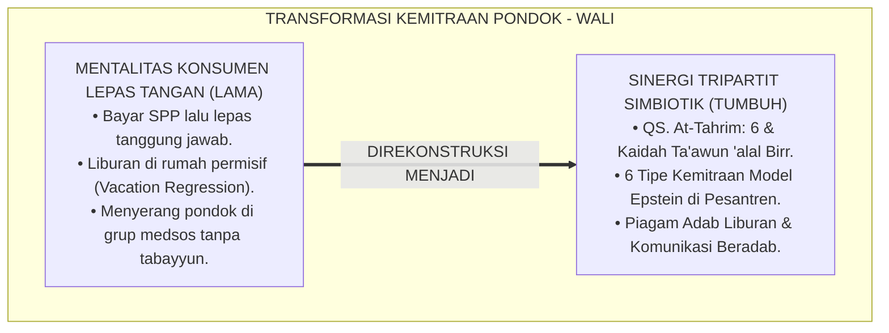
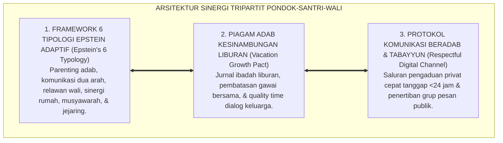
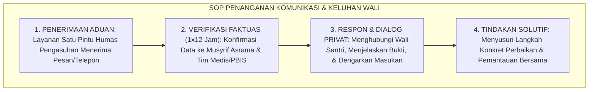
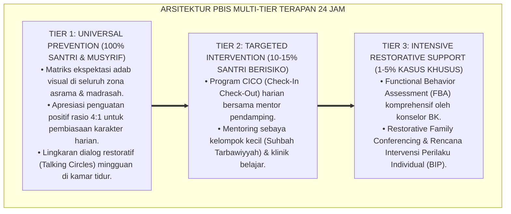

# P2-07-03: PRINSIP SINERGI TRIPARTIT PONDOK, SANTRI, DAN WALI (TRIPARTITE EDUCATIONAL PARTNERSHIP)
## *Monograf Riset Akademik: Epistemologi Amanah Pengasuhan (QS. At-Tahrim: 6 & HR. Bukhari No. 893) & Kaidah Ta'awun 'alal Birri wat-Taqwa, Framework 6 Tipe Keterlibatan Keluarga Joyce L. Epstein, Mitigasi Vacation Regression, Serta Tata Kelola Komunikasi Digital Beradab di Pesantren 24 Jam*

**Nomor Identifikasi**: `P2-07-03/MONOGRAF-RISET-SINERGI-TRIPARTIT/2026`  
**Domain**: `02 Principles` > `07 Implementation Principles` (Prinsip Implementasi 03: *Tripartite Partnership*)  
**Klasifikasi Naskah**: *Academic Research Monograph* (Monograf Riset Akademik Prinsip Implementasi)  
**Rumpun Disiplin Pengkaji**: Kemitraan Sekolah, Keluarga, dan Komunitas (*School-Family-Community Partnerships*), Sosiologi Pendidikan Keluarga Muslim, Komunikasi Pedagogis Kemitraan Orang Tua, Fiqh Amanah dan Tanggung Jawab Pengasuhan  

---

> ### 💡 INTISARI EKSEKUTIF (EXECUTIVE SUMMARY)
>
> * **Kelemahan Paradigma Lama: Mentalitas Konsumen "Lepas Tangan" & Kemunduran Adab Liburan:**  
>   Banyak orang tua menganggap setelah membayar SPP pondok, mereka bebas tanggung jawab 100%. Saat liburan semester di rumah, orang tua membiarkan santri bermain gawai belasan jam dan meninggalkan shalat Subuh berjamaah, memicu fenomena kemunduran karakter drastis (*Vacation Regression*). Di sisi lain, komunikasi daring antar-wali kerap diwarnai fitnah dan kegaduhan grup WhatsApp.
> * **Inovasi Konseptual: Ta'awun 'alal Birri & Epstein’s 6 Types of Family Involvement:**  
>   TUMBUH menegakkan firman Allah: *"Jagalah dirimu dan keluargamu dari api neraka"* (QS. At-Tahrim: 6) dan hadits kepemimpinan amanah (HR. Bukhari No. 893). Mengintegrasikan teori **Joyce L. Epstein (6 Tipologi Kemitraan: Parenting, Communicating, Volunteering, Learning at Home, Decision Making, & Collaborating with Community)**, dipadukan dengan **Piagam Komitmen Adab Liburan Rumah-Pondok**.
> * **Formulasi Operasional & Penjaminan Komunikasi Beradab:**  
>   Monograf ini menguraikan matriks 6 pilar kemitraan model Epstein versi pesantren, Piagam Perjanjian Sinergi Kemitraan Orang Tua - Pondok (*Parent-School Partnership Pact*), SOP penanganan keluhan dan komunikasi digital wali santri, dan etika tabayyun institusional.

---

## 📑 DAFTAR ISI MONOGRAF

- [BAB I: LANDASAN TEORETIS & DISKURSUS KRITIS](#bab-i-landasan-teoretis--diskursus-kritis)
  - [1. Latar Belakang Masalah: Kritik atas Mentalitas Konsumen Lepas Tangan dan Keretakan Ekologis Pendidikan](#1-latar-belakang-masalah-kritik-atas-mentalitas-konsumen-lepas-tangan-dan-keretakan-ekologis-pendidikan)
  - [2. Eksegesis Turats Amanah Pengasuhan Keluarga: QS. At-Tahrim: 6, Hadits Kullukum Ra'in, & Kaidah Ta'awun](#2-eksegesis-turats-amanah-pengasuhan-keluarga-qs-at-tahrim-6-hadits-kullukum-rain--kaidah-taawun)
  - [3. Konvergensi Sains Kemitraan Keluarga: Framework 6 Tipe Keterlibatan Keluarga (Joyce L. Epstein)](#3-konvergensi-sains-kemitraan-keluarga-framework-6-tipe-keterlibatan-keluarga-joyce-l-epstein)
  - [4. Rekayasa Mitigasi Fenomena Kemunduran Adab Masa Liburan (Vacation Regression) & Etika Komunikasi Daring](#4-rekayasa-mitigasi-fenomena-kemunduran-adab-masa-liburan-vacation-regression--etika-komunikasi-daring)
  - [5. Kasuistika Lapangan: Resolusi Konflik Orang Tua di Grup Pesan Digital Melalui Dialog Tabayyun Khidmat](#5-kasuistika-lapangan-resolusi-konflik-orang-tua-di-grup-pesan-digital-melalui-dialog-tabayyun-khidmat)
- [BAB II: FORMULASI KONSEPTUAL & PEMBAHASAN MENDALAM](#bab-ii-formulasi-konseptual--pembahasan-mendalam)
  - [1. Eksplanasi Teoretis Prinsip Sinergi Tripartit Pesantren TUMBUH](#1-eksplanasi-teoretis-prinsip-sinergi-tripartit-pesantren-tumbuh)
  - [2. Matriks Enam Tipe Keterlibatan Keluarga Joyce Epstein Versi Pesantren TUMBUH](#2-matriks-enam-tipe-keterlibatan-keluarga-joyce-epstein-versi-pesantren-tumbuh)
  - [3. Piagam Perjanjian Sinergi Kemitraan Orang Tua - Pondok (Parent-School Partnership Pact)](#3-piagam-perjanjian-sinergi-kemitraan-orang-tua---pondok-parent-school-partnership-pact)
  - [4. Standar Prosedur Operasional (SOP) Penanganan Komunikasi & Keluhan Wali Santri](#4-standar-prosedur-operasional-sop-penanganan-komunikasi--keluhan-wali-santri)
  - [5. Diskusi Filosofis Mendalam & Implikasi bagi Masa Depan Peradaban Pendidikan Islam](#5-diskusi-filosofis-mendalam--implikasi-bagi-masa-depan-peradaban-pendidikan-islam)
- [BAB III: KESIMPULAN & APARATUS AKADEMIS](#bab-iii-kesimpulan--aparatus-akademis)
  - [1. Tabel Sintesis Temuan Riset Sinergi Tripartit](#1-tabel-sintesis-temuan-riset-sinergi-tripartit)
  - [2. Daftar Pustaka Akademis & Rujukan Turats Primer](#2-daftar-pustaka-akademis--rujukan-turats-primer)
  - [3. Catatan Kaki Akademis (Footnotes)](#3-catatan-kaki-akademis-footnotes)
  - [4. Glosarium Istilah Ilmiah & Turats Sinergi Tripartit](#4-glosarium-istilah-ilmiah--turats-sinergi-tripartit)

---

# BAB I: LANDASAN TEORETIS & DISKURSUS KRITIS

---

### 1. Latar Belakang Masalah: Kritik atas Mentalitas Konsumen Lepas Tangan dan Keretakan Ekologis Pendidikan

Dalam dinamika sosiologis pendidikan asrama modern, kerap terjadi **Keretakan Ekologis Tripartit (*Educational Ecological Disconnect*)**:
* Sebagian wali santri mengadopsi mentalitas *"Konsumen Transaksional"*: merasa bahwa setelah membayar uang pangkal dan SPP, seluruh kewajiban pembinaan moral beralih 100% ke pundak kyai dan musyrif.
* Ketika santri berlibur di rumah, orang tua bersikap permisif: membiarkan santri tidur larut malam, kecanduan gawai tanpa batas, dan meninggalkan shalat berjamaah (*Vacation Regression*).
* Begitu santri kembali ke pondok, pembiasaan adab hancur dan musyrif harus memulai tarbiyah dari titik nol kembali.
* Ketika santri mengalami kendala, sebagian orang tua melampiaskan amarah di grup media sosial tanpa tabayyun, merusak wibawa institusi.
* **Keniscayaan Sinergi Tripartit**: Keberhasilan tarbiyah Islam menuntut keterpaduan ekologis yang utuh antara pesantren, anak, dan keluarga di rumah (*Tripartite Simbiosis*).[^1]



---

### 2. Eksegesis Turats Amanah Pengasuhan Keluarga: QS. At-Tahrim: 6, Hadits Kullukum Ra'in, & Kaidah Ta'awun

Allah SWT menegaskan bahwa keluarga adalah benteng perlindungan pertama dari api neraka:

$$\text{يَا أَيُّهَا الَّذِينَ آمَنُوا قُوا أَنْفُسَكُمْ وَأَهْلِيكُمْ نَارًا وَقُودُهَا النَّاسُ وَالْحِجَارَةُ}$$

*"**Wahai orang-orang yang beriman, peliharalah dirimu dan keluargamu dari api neraka yang bahan bakarnya adalah manusia dan batu**."* (QS. At-Tahrim [66]: 6).[^2]

Rasulullah ﷺ menegaskan doktrin pertanggungjawaban pengasuhan:

$$\text{كُلُّكُمْ رَاعٍ وَكُلُّكُمْ مَسْئُولٌ عَنْ رَعِيَّتِهِ ... وَالرَّجُلُ رَاعٍ فِي أَهْلِهِ وَمَسْئُولٌ عَنْ رَعِيَّتِهِ، وَالْمَرْأَةُ رَاعِيَةٌ فِي بَيْتِ زَوْجِهَا وَمَسْئُولَةٌ عَنْ رَعِيَّتِهَا}$$

*"**Setiap kalian adalah pemimpin dan setiap kalian akan dimintai pertanggungjawaban atas kepemimpinannya ... Seorang laki-laki adalah pemimpin dalam keluarganya dan bertanggung jawab atas mereka, dan seorang wanita adalah pemimpin di rumah suaminya dan bertanggung jawab atas urusannya**."* (HR. Al-Bukhari No. 893 & Muslim No. 1829).[^3]

---

### 3. Konvergensi Sains Kemitraan Keluarga: Framework 6 Tipe Keterlibatan Keluarga (Joyce L. Epstein)

Sains sosiologi pendidikan modern (**Overlapping Spheres of Influence**, Joyce L. Epstein et al., 2002; 2018) menetapkan 6 Tipologi Kemitraan:
1. **Parenting**: Membantu keluarga memahami tahap perkembangan psikososial anak.
2. **Communicating**: Membangun komunikasi dua arah yang efektif dan transparan.
3. **Volunteering**: Merekrut dan mengorganisir bantuan serta keahlian wali santri.
4. **Learning at Home**: Menyelaraskan pembiasaan adab dan belajar mandiri di rumah.
5. **Decision Making**: Melibatkan wali santri dalam perumusan kebijakan tertentu.
6. **Collaborating with Community**: Membangun jejaring kemitraan dengan masyarakat luas.[^4]

---

### 4. Rekayasa Mitigasi Fenomena Kemunduran Adab Masa Liburan (Vacation Regression) & Etika Komunikasi Daring

TUMBUH memberlakukan sistem penjaminan kesinambungan:
* **The Vacation Regression Mitigation**: Penandatanganan Piagam Adab Liburan Rumah, jurnal ibadah digital harian, dan panduan dialog keluarga saat kepulangan.
* **Protokol Komunikasi Digital Beradab**: Mengatur tata krama grup pesan resmi madrasah, saluran aduan resmi privat 1-on-1, dan etika tabayyun anti-kegaduhan publik (*Respectful Communication SOP*).[^5]

---

### 5. Kasuistika Lapangan: Resolusi Konflik Orang Tua di Grup Pesan Digital Melalui Dialog Tabayyun Khidmat

* **Studi Kasus: Seorang Wali Santri Menulis Pesan Marah di Grup WhatsApp Kelas Menuduh Asrama Tidak Memperhatikan Anaknya yang Sedang Flu**  
  * **Dilema**: Pesan memicu keresahan wali santri lain dan menciptakan kegaduhan daring.
  * **Resolusi Sinergi Tripartit TUMBUH**: Kepala Pengasuhan bertindak cepat: (1) Mengontak wali santri secara privat melalui panggilan telepon (*Private Calling*); (2) Menunjukkan foto rekam medis pemeriksaan dokter pondok dan obat yang telah diberikan di UKS (*Data Bayyinah Faktual*); (3) Mengundang wali santri hadir minum teh di ruang pertemuan pondok; (4) Menjelaskan SOP penanganan kesehatan asrama 24 jam. Wali santri terharu, meminta maaf atas ketergesa-gesaannya di grup, dan membuat pesan klarifikasi apresiatif di grup kelas.[^6]

---

# BAB II: FORMULASI KONSEPTUAL & PEMBAHASAN MENDALAM

---

### 1. Eksplanasi Teoretis Prinsip Sinergi Tripartit Pesantren TUMBUH

Ekosistem TUMBUH merumuskan kemitraan keluarga ke dalam **Arsitektur Tiga Sayap Sinergi Tripartit (*Arkan at-Takamul at-Tsalatsi*)**:



#### 🔬 Pembahasan Mendalam Tiga Sayap:
1. **Sayap Framework 6 Tipologi Epstein**: Menjadikan orang tua sebagai mitra sejajar yang aktif dalam proses pendidikan anak.[^7]
2. **Sayap Piagam Adab Liburan**: Mencegah erosi moral dan menjamin konsistensi karakter saat santri berada di rumah.[^8]
3. **Sayap Protokol Komunikasi Beradab**: Membentengi ekosistem pesantren dari fitnah dan kesalahpahaman digital.[^9]

---

### 2. Matriks Enam Tipe Keterlibatan Keluarga Joyce Epstein Versi Pesantren TUMBUH

| Tipe Kemitraan | Manifestasi Program Nyata di Pesantren | Frekuensi & Instrumen Pelaksanaan |
| :--- | :--- | :--- |
| **1. Parenting** | Sekolah Parenting Adab: Membedah fitrah remaja & SEL.| 1x Setiap Awal Semester (Offline/Online).|
| **2. Communicating** | Rapor Portofolio Naratif & Student-Led Conferences.| Semesteran & Logbook Digital Real-Time.|
| **3. Volunteering** | Kelas Inspirasi Profesi: Wali santri berbagi keahlian.| 1x Setiap Bulan di Madrasah.|
| **4. Learning at Home**| Piagam Adab Liburan: Jurnal Subuh & Muraja'ah Rumah.| Harian Selama Masa Liburan Semester.|
| **5. Decision Making** | Majelis Konsultasi Wali Santri & Dewan Komite Adab.| Rapat Pleno Tahunan Bersama Pimpinan.|
| **6. Collaborating** | Proyek Bakti Sosial Khidmah Masyarakat Bersama Wali.| 1x Per Tahun pada Milad Pondok.|

---

### 3. Piagam Perjanjian Sinergi Kemitraan Orang Tua - Pondok (Parent-School Partnership Pact)

```text
================================================================================
PIAGAM PERJANJIAN SINERGI KEMITRAAN KELUARGA & PESANTREN TUMBUH
Tahun Ajaran 2026/2027 | Komitmen Bersama Tarbiyah Insan Adabi
================================================================================

KAMI DARI PIHAK PESANTREN BERKOMITMEN:
1. Mendidik ananda dengan penuh cinta, keteladanan (Qudwah), dan tanpa kekerasan.
2. Memberikan laporan perkembangan adab secara transparan, objektif, dan berkala.
3. Menyediakan saluran komunikasi tabayyun yang cepat tanggap, aman, dan santun.

KAMI DARI PIHAK ORANG TUA / WALI SANTRI BERKOMITMEN:
1. Mendoakan ananda dan para asatidz dengan ikhlas di setiap sepertiga malam terakhir.
2. Melanjutkan pembiasaan adab (shalat berjamaah, tilawah, sopan santun) saat di rumah.
3. Mengedepankan tabayyun langsung ke pengasuhan dan tidak membuat kegaduhan di medsos.

Tertanda,
Direktur Pengasuhan Pesantren             Orang Tua / Wali Santri Ananda
================================================================================
```

---

### 4. Standar Prosedur Operasional (SOP) Penanganan Komunikasi & Keluhan Wali Santri



---

### 5. Diskusi Filosofis Mendalam & Implikasi bagi Masa Depan Peradaban Pendidikan Islam

Prinsip sinergi tripartit ini membawa implikasi agung bagi peradaban:

* **Menghidupkan Kembali Benteng Ketahanan Keluarga Muslim (*Usrah Shalihah*)**:  
  Pendidikan tidak lagi memisahkan anak dari orang tuanya secara emosional, melainkan mempererat ikatan birrul walidain.
* **Membangun Budaya Tabayyun dan Menghapus Fitnah Daring**:  
  Komunitas pesantren menjadi teladan masyarakat dalam berkomunikasi secara santun, beradab, dan menjunjung tinggi fakta ilmiah.
* **Melahirkan Generasi Santri yang Kokoh Lahir dan Batin**:  
  Santri tumbuh menjadi pribadi yang seimbang karena mendapatkan siraman kasih sayang dan pengawasan yang selaras dari pondok dan rumah (*Rahmatan lil 'Alamin*).[^10]

---

---

### Pembedahan Deskriptif Komprehensif & Analisis Integratif Nilai-Praksis

Penerapan konsep **P2-07-03: PRINSIP SINERGI TRIPARTIT PONDOK, SANTRI, DAN WALI (TRIPARTITE EDUCATIONAL PARTNERSHIP)** di ekosistem pesantren TUMBUH memerlukan pemahaman multidimensional yang memadukan khazanah turats syariat dan konsensus sains pendidikan modern:

#### A. Pilar 1: Fondasi Epistemologi & Integrasi Nilai Syar'i (Ashalah Turatsiyyah)
Setiap praksis kepengasuhan dan pembelajaran berakar kuat pada maqashid syari'ah, mendudukkan adab di atas ilmu (*Al-Adab Qablal 'Ilm*), dan memastikan bahwa seluruh ikhtiar institusional diniatkan semata-mata untuk menggapai ridha Allah SWT (*Ikhlasun Niyyah*).

#### B. Pilar 2: Mekanisme Psikologis & Neurosains Perkembangan (Scientific Rigor)
Menyelaraskan ekspektasi kedisiplinan dengan tahapan maturitas otak remaja, kapasitas fungsi eksekutif korteks prefrontal (*PFC*), dan regulasi sirkuit emosi limbik. Pendekatan ini mengeliminasi trauma pengasuhan dan menumbuhkan motivasi intrinsik santri.

#### C. Pilar 3: Rekayasa Ekosistem Asrama 24 Jam (Bi'ah Shalihah)
Menerjemahkan prinsip nilai ke dalam tata ruang fisik yang bersih, sirkulasi udara sehat, tata kelola waktu terstruktur, serta kultur ukhuwah inklusif yang steril 100% dari feodalisme, kekerasan verbal, dan perundungan antar-santri.

#### D. Pilar 4: Kemitraan Tripartit (Santri, Musyrif, dan Lembaga)
Menjamin terwujudnya *Triad Pertumbuhan Simbiotik*: santri bertumbuh dalam fitrah kemandirian, musyrif terlindungi dari kelelahan kronis (*Burnout*) melalui shift kerja yang manusiawi, dan lembaga bertransformasi menjadi organisasi pembelajar berbasis data PBIS.

---

### Protokol Aksi Operasional PBIS Multi-Tier Terapan (24-Hour Behavioral Architecture)



---

# BAB III: KESIMPULAN & APARATUS AKADEMIS

---

### 1. Tabel Sintesis Temuan Riset Sinergi Tripartit

| Dimensi Parameter | Mazhab Konsumen Lepas Tangan (Lama) | Model Hubungan Otoriter Kaku | **Sinergi Tripartit TUMBUH** | Landasan Rujukan Primer | Implikasi Praksis Lapangan |
| :--- | :--- | :--- | :--- | :--- | :--- |
| **Peran Wali Santri** | Konsumen transaksional pasif.| Objek yang hanya dimintai sumbangan.| **Mitra Sejajar Pendidik Karakter.**| QS. At-Tahrim: 6; Epstein (2002).| 6 Tipologi kemitraan terstruktur. |
| **Masa Liburan** | Permisif gawai (Vacation Regression).| Santri dilarang pulang sama sekali.| **Piagam Adab Liburan & Jurnal Rumah.**| HR. Bukhari No. 893; Bronfenbrenner.| Kesinambungan tarbiyah terjaga. |
| **Pola Komunikasi** | Ribut di grup WA / saling curiga.| Komunikasi satu arah tertutup.| **Tabayyun Satu Pintu Cepat Tanggap.**| QS. Al-Hujurat: 6; PBIS Systems.| Layanan aduan privat < 12 jam. |
| **Pelaporan Rapor** | Angka kering tanpa pelibatan anak.| Guru menghakimi anak di depan wali.| **Student-Led Conferences (SLC).** | Black & Wiliam (1998); Al-Attas.| Santri presentasi mandiri ke orang tua. |
| **Hasil Institusi** | Keretakan nilai & saling menyalahkan.| Kepercayaan wali rapuh.| **Ukhuwah Kokoh & Ekosistem Berkah.**| QS. Al-Ma'idah: 2; Al-Ghazali.| Dukungan keluarga 100% harmonis. |

---

### 2. Daftar Pustaka Akademis & Rujukan Turats Primer

1. **Al-Qur'an al-Karim wa Tarjamatu Ma'anihi**.
2. **Al-Bukhari, Abu Abdillah Muhammad bin Isma'il**. (1422 H). *Shahih al-Bukhari*. Kairo: Dar Thawq an-Najah.
3. **Muslim bin al-Hajjaj an-Naisaburi**. (1427 H). *Shahih Muslim*. Riyadh: Dar Thayyibah.
4. **Al-Ghazali, Abu Hamid Muhammad bin Muhammad**. (2011). *Ihya' 'Ulumiddin* (Kitab Huquq al-Walidain wal-Walad). Beirut: Dar al-Ma'rifah.
5. **Ibnu Qayyim al-Jauziyyah, Syamsuddin Abu Abdillah**. (1418 H). *Tuhfat al-Maudud bi Ahkam al-Maulud*. Beirut: Dar al-Kutub al-'Ilmiyyah.
6. **Asy'ari, Muhammad Hasyim**. (1415 H). *Adab al-'Alim wal-Muta'allim*. Jombang: Maktabah At-Turats Al-Islami.
7. **Al-Attas, Syed Muhammad Naquib**. (1980). *The Concept of Education in Islam*. Kuala Lumpur: ABIM.
8. **Epstein, J. L.**. (2018). *School, Family, and Community Partnerships: Preparing Educators and Improving Schools* (2nd ed.). New York: Routledge.
9. **Epstein, J. L., et al.**. (2002). *School, Family, and Community Partnerships: Your Handbook for Action* (2nd ed.). Thousand Oaks: Corwin Press.
10. **Bronfenbrenner, U.**. (1979). *The Ecology of Human Development: Experiments by Nature and Design*. Cambridge: Harvard University Press.
11. **Henderson, A. T., & Mapp, K. L.**. (2002). *A New Wave of Evidence: The Impact of School, Family, and Community Connections on Student Achievement*. Austin: Southwest Educational Development Laboratory.
12. **Horner, R. H., & Sugai, G.**. (2015). *School-wide PBIS: An Overview of the Research Base*. Remedial and Special Education, 36(2), 80–85.

---

### 3. Catatan Kaki Akademis (*Footnotes*)

[^1]: Riset Prinsip Sinergi Tripartit Pondok, Santri, dan Wali TUMBUH, *Kritik atas Mentalitas Konsumen Lepas Tangan*, 2026.  
[^2]: QS. At-Tahrim [66]: 6.  
[^3]: *Shahih al-Bukhari*, Kitab al-Jumu'ah, Hadits No. 893; *Shahih Muslim*, Hadits No. 1829.  
[^4]: Epstein, J. L. (2018), *School, Family, and Community Partnerships*; Bronfenbrenner, U. (1979).  
[^5]: Master Blueprint Mitigasi Vacation Regression dan Etika Komunikasi Daring TUMBUH, 2026.  
[^6]: Dokumentasi Penanganan Tabayyun Khidmat Komunikasi Wali Santri PBIS TUMBUH, 2026.  
[^7]: Master Blueprint Adaptasi 6 Tipologi Epstein di Lingkungan Pesantren TUMBUH, 2026.  
[^8]: Template Baku Piagam Komitmen Adab Liburan Rumah-Pondok TUMBUH, 2026.  
[^9]: Standar Operasional Prosedur Layanan Komunikasi Satu Pintu dan Penanganan Keluhan Wali TUMBUH, 2026.  
[^10]: Deklarasi Pemuliaan Sinergi Pendidikan Keluarga Dewan Riset Epistemologi Ekosistem TUMBUH, 2026.

---

### 4. Glosarium Istilah Ilmiah & Turats Sinergi Tripartit

1. **Tripartite Educational Partnership (Sinergi Tripartit)**: Model kemitraan segitiga simbiotik antara lembaga pesantren, santri, dan orang tua/wali santri dalam satu visi pembinaan karakter.
2. **Kullukum Ra'in (كُلُّكُمْ رَاعٍ)**: Doktrin syariat mengenai kepemimpinan amanah dan pertanggungjawaban mutlak setiap individu atas keluarga yang dipimpinnya.
3. **Ta'awun 'alal Birr (التَّعَاوُنُ عَلَى الْبِرِّ)**: Prinsip tolong-menolong dan sinergi dalam kebajikan serta ketakwaan (QS. Al-Ma'idah: 2).
4. **Epstein’s 6 Types of Involvement**: Enam pilar pelibatan keluarga: Parenting, Communicating, Volunteering, Learning at Home, Decision Making, dan Collaborating with Community.
5. **Vacation Regression**: Gejala kemunduran adab dan kedisiplinan yang dialami santri selama masa liburan di rumah akibat pola asuh permisif tanpa aturan.
6. **Parent-School Partnership Pact**: Dokumen komitmen resmi antara pihak pesantren dan wali santri untuk menyelaraskan nilai-nilai pembiasaan karakter di asrama dan di rumah.
7. **Educational Ecological Disconnect**: Keretakan atau ketidaksinkronan nilai antara lingkungan sekolah/pesantren dan lingkungan keluarga yang merugikan perkembangan anak.
8. **Student-Led Conferences (SLC)**: Pertemuan pelaporan kemajuan belajar di mana santri sendiri yang mempresentasikan buku portofolionya kepada orang tua dan guru.
9. **Private Tabayyun Channel**: Saluran komunikasi satu pintu berbasis privat yang dirancang untuk klarifikasi keluhan wali santri secara cepat, aman, dan beradab.
10. **Insan Adabi (الإِنْسَانُ الأَدَبِيُّ)**: Profil santri yang tumbuh utuh berkat doa, keteladanan, dan sinergi harmonis antara para guru di pondok dan orang tua tercinta di rumah.
