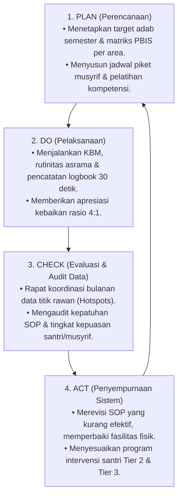

# P2-07-04-Prinsip-Penjaminan-Mutu-dan-Continuous-Improvement

## Tujuan
Menetapkan prinsip penjaminan mutu pengasuhan dan pembelajaran pesantren berbasis siklus **Plan-Do-Check-Act (PDCA / Kaizen)** dan audit data PBIS berkala, memastikan sistem TUMBUH terus menyempurnakan diri sebagai organisasi pembelajar (*Learning Organization*).

---

## 1. Siklus PDCA Mutu Pengasuhan Pesantren

---

## 2. 3 Indikator Kunci Kinerja Mutu Sistem (*System Quality KPIs*)

1. **Tingkat Penurunan Pelanggaran (*Behavior Incident Reduction*)**:
   - Target: Terjadi penurunan angka kasus pelanggaran asrama sebesar **30–50% per tahun**.
2. **Indeks Kesejahteraan & Retensi Musyrif (*Staff Well-Being & Retention*)**:
   - Target: Tingkat pergantian (*turnover*) musyrif di bawah 10% per tahun, menandakan lingkungan kerja sehat dan terlindungi dari *burnout*.
3. **Tingkat Kepuasan & Kenyamanan Santri (*Student Psychological Safety Index*)**:
   - Target: 90%+ santri merasa aman di kamar asrama dari segala bentuk perundungan (*bullying*) dan intimidasi.

---

## 3. Status Dokumen
* **Status**: 🌟 **A+ (Tervalidasi & Siap Diimplementasikan)**
* **Level**: Project 2 - `02 Principles / 07 Implementation Principles`
* **Langkah Berikutnya**: **`P2-07-05-Sintesis-Implementation-Principles-TUMBUH.md`**.
