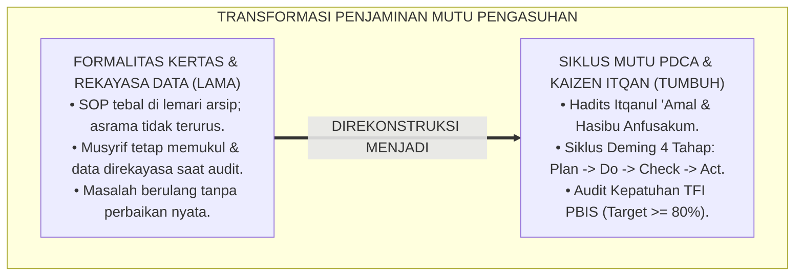
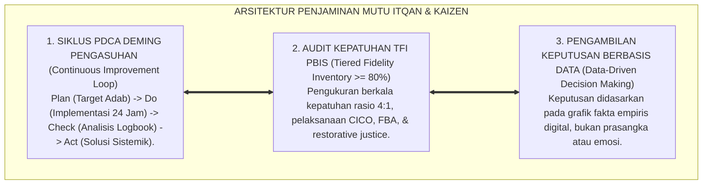
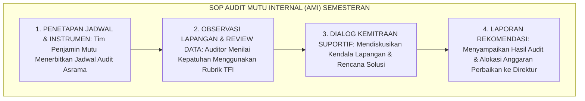
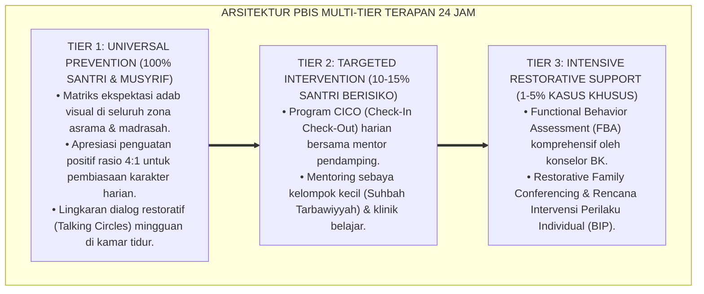

# P2-07-04: PRINSIP PENJAMINAN MUTU DAN CONTINUOUS IMPROVEMENT (QUALITY ASSURANCE & CONTINUOUS IMPROVEMENT)
## *Monograf Riset Akademik: Epistemologi Itqanul 'Amal (HR. Al-Baihaqi No. 4931) & Hisab Diri Kolektif (Hasibu Anfusakum), Siklus Mutu PDCA W. Edwards Deming & Kaizen, Tiered Fidelity Inventory (TFI Horner & Sugai), Serta Audit Mutu Internal Karakter di Pesantren 24 Jam*

**Nomor Identifikasi**: `P2-07-04/MONOGRAF-RISET-PENJAMINAN-MUTU-CONTINUOUS-IMPROVEMENT/2026`  
**Domain**: `02 Principles` > `07 Implementation Principles` (Prinsip Implementasi 04: *Quality Assurance & Continuous Improvement*)  
**Klasifikasi Naskah**: *Academic Research Monograph* (Monograf Riset Akademik Prinsip Implementasi)  
**Rumpun Disiplin Pengkaji**: Penjaminan Mutu Pendidikan Pesantren (*Total Quality Management in Education*), Evaluasi Kepatuhan Implementasi PBIS (*Implementation Fidelity*), Analisis Keputusan Berbasis Data Perilaku (*Data-Driven Decision Making*), Fiqh Itqan dan Akuntabilitas Lembaga Islam  

---

> ### 💡 INTISARI EKSEKUTIF (EXECUTIVE SUMMARY)
>
> * **Kelemahan Paradigma Lama: Ilusi Formalitas Kertas SOP & Rekayasa Laporan Akreditasi:**  
>   Banyak lembaga pesantren merasa telah memiliki penjaminan mutu hanya karena memiliki tumpukan berkas SOP di lemari pimpinan. Namun di kamar asrama, SOP tidak dijalankan: musyrif tetap melakukan hukuman fisik, data buku catatan kosong, dan saat evaluasi data direkayasa (*Fabricated Compliance*).
> * **Inovasi Konseptual: Itqanul 'Amal & Siklus PDCA Deming / Kaizen:**  
>   TUMBUH menegakkan sabda Rasulullah ﷺ: *"Sesungguhnya Allah mencintai seorang hamba yang apabila melakukan suatu pekerjaan, ia melakukannya dengan Itqan (sempurna, profesional, dan presisi)"* (HR. Al-Baihaqi No. 4931) dan wasiat Sayyidina Umar RA (*Hasibu Anfusakum*). Mengintegrasikan teori **Siklus PDCA (Plan $\rightarrow$ Do $\rightarrow$ Check $\rightarrow$ Act)** W. Edwards Deming, falsafah perbaikan berkelanjutan (*Kaizen*), dan instrumen kepatuhan implementasi **Tiered Fidelity Inventory (TFI Horner & Sugai, Ambang Kepatuhan $\ge 80\%$)**.
> * **Formulasi Operasional & Penjaminan Audit Mutu Internal:**  
>   Monograf ini menguraikan matriks siklus PDCA pengasuhan adab 24 jam, template instrumen Pesantren TFI Rubric, SOP Audit Mutu Internal (AMI) karakter semesteran, dan etika evaluasi yang membimbing tanpa intimidasi.

---

## 📑 DAFTAR ISI MONOGRAF

- [BAB I: LANDASAN TEORETIS & DISKURSUS KRITIS](#bab-i-landasan-teoretis--diskursus-kritis)
  - [1. Latar Belakang Masalah: Kritik atas Ilusi Kepatuhan Dokumen Kertas dan Ketiadaan Tindak Lanjut Nyata](#1-latar-belakang-masalah-kritik-atas-ilusi-kepatuhan-dokumen-kertas-dan-ketiadaan-tindak-lanjut-nyata)
  - [2. Eksegesis Turats Kesempurnaan Amal & Hisab Terus-Menerus: Hadits Itqanul 'Amal & Hasibu Anfusakum](#2-eksegesis-turats-kesempurnaan-amal--hisab-terus-menerus-hadits-itqanul-amal--hasibu-anfusakum)
  - [3. Konvergensi Sains Penjaminan Mutu: Siklus PDCA W. Edwards Deming, Falsafah Kaizen, & Data-Driven Decision Making](#3-konvergensi-sains-penjaminan-mutu-siklus-pdca-w-edwards-deming-falsafah-kaizen--data-driven-decision-making)
  - [4. Rekayasa Evaluasi Kepatuhan Sistem (Tiered Fidelity Inventory / TFI PBIS) & Audit Mutu Bebas Intimidasi](#4-rekayasa-evaluasi-kepatuhan-sistem-tiered-fidelity-inventory--tfi-pbis--audit-mutu-bebas-intimidasi)
  - [5. Kasuistika Lapangan: Peningkatan Mutu Ketertiban Subuh Asrama Melalui Siklus PDCA dan Perbaikan Sarana](#5-kasuistika-lapangan-peningkatan-mutu-ketertiban-subuh-asrama-melalui-siklus-pdca-dan-perbaikan-sarana)
- [BAB II: FORMULASI KONSEPTUAL & PEMBAHASAN MENDALAM](#bab-ii-formulasi-konseptual--pembahasan-mendalam)
  - [1. Eksplanasi Teoretis Prinsip Penjaminan Mutu & Continuous Improvement Ekosistem Pesantren Berbasis TUMBUH](#1-eksplanasi-teoretis-prinsip-penjaminan-mutu--continuous-improvement-pesantren-tumbuh)
  - [2. Matriks Siklus PDCA Penjaminan Mutu Pengasuhan Adab Pesantren](#2-matriks-siklus-pdca-penjaminan-mutu-pengasuhan-adab-pesantren)
  - [3. Template Instrumen Audit Kepatuhan Implementasi PBIS Asrama (Pesantren TFI Rubric)](#3-template-instrumen-audit-kepatuhan-implementasi-pbis-asrama-pesantren-tfi-rubric)
  - [4. Alur Standar Operasional Prosedur (SOP) Audit Mutu Internal (AMI) Semesteran](#4-alur-standar-operasional-prosedur-sop-audit-mutu-internal-ami-semesteran)
  - [5. Diskusi Filosofis Mendalam & Implikasi bagi Masa Depan Peradaban Pendidikan Islam](#5-diskusi-filosofis-mendalam--implikasi-bagi-masa-depan-peradaban-pendidikan-islam)
- [BAB III: KESIMPULAN & APARATUS AKADEMIS](#bab-iii-kesimpulan--aparatus-akademis)
  - [1. Tabel Sintesis Temuan Riset Penjaminan Mutu & Continuous Improvement](#1-tabel-sintesis-temuan-riset-penjaminan-mutu--continuous-improvement)
  - [2. Daftar Pustaka Akademis & Rujukan Turats Primer](#2-daftar-pustaka-akademis--rujukan-turats-primer)
  - [3. Catatan Kaki Akademis (Footnotes)](#3-catatan-kaki-akademis-footnotes)
  - [4. Glosarium Istilah Ilmiah & Turats Penjaminan Mutu dan Kaizen](#4-glosarium-istilah-ilmiah--turats-penjaminan-mutu-dan-kaizen)

---

# BAB I: LANDASAN TEORETIS & DISKURSUS KRITIS

---

### 1. Latar Belakang Masalah: Kritik atas Ilusi Kepatuhan Dokumen Kertas dan Ketiadaan Tindak Lanjut Nyata

Penyakit kronis dalam penjaminan mutu lembaga pendidikan adalah **Ilusi Kepatuhan Dokumen Formalitas (*The Paper Compliance Illusion*)**:
* Pesantren merasa telah tertib dan bermutu tinggi hanya karena memiliki tumpukan bundel buku SOP tebal yang tersimpan di lemari direktur.
* Namun di kamar asrama pada pukul 03.30 pagi, SOP tersebut tidak berjalan: musyrif tetap menyiram air ke kasur santri yang terlambat bangun, logbook digital kosong, dan pimpinan tidak pernah memvalidasi data lapangan secara objektif.
* Saat visitasi akreditasi tiba, seluruh dokumen direkayasa secara kilat (*Asal Bapak Senang / Fabricated Compliance*).
* **Keniscayaan Budaya Itqan dan Kaizen**: Penjaminan mutu dalam Islam bukan formalitas mencari sertifikat, melainkan ibadah hisab diri berkelanjutan (*Continuous Muhasabah*) berbasis data analitik riil guna memastikan setiap santri mendapatkan hak pengasuhan terbaik.[^1]



---

### 2. Eksegesis Turats Kesempurnaan Amal & Hisab Terus-Menerus: Hadits Itqanul 'Amal & Hasibu Anfusakum

Rasulullah ﷺ mewajibkan profesionalisme kesempurnaan mutu dalam setiap karya dan amanah:

$$\text{إِنَّ اللَّهَ يُحِبُّ إِذَا عَمِلَ أَحَدُكُمْ عَمَلًا أَنْ يُتْقِنَهُ}$$

*"**Sesungguhnya Allah sangat mencintai seseorang di antara kalian yang apabila mengerjakan suatu amal perbuatan, ia melakukannya dengan Itqan (sempurna, presisi, tuntas, dan bermutu tinggi)**."* (HR. Al-Baihaqi No. 4931 & Abu Ya'la).[^2]

Sayyidina Umar bin Khattab RA menegaskan falsafah evaluasi diri berkelanjutan:

$$\text{حَاسِبُوا أَنْفُسَكُمْ قَبْلَ أَنْ تُحَاسَبُوا، وَزِنُوا أَنْفُسَكُمْ قَبْلَ أَنْ تُوزَنُوا}$$

*"**Hisablah (evaluasilah) diri kalian sebelum kalian dihisab di akhirat, dan timbanglah amal kalian sebelum amal kalian ditimbang**."*[^3]

---

### 3. Konvergensi Sains Penjaminan Mutu: Siklus PDCA W. Edwards Deming, Falsafah Kaizen, & Data-Driven Decision Making

Sains manajemen mutu modern (**Total Quality Management**, W. Edwards Deming, 1986; Masaaki Imai, 1986) merumuskan 4 siklus perbaikan terus-menerus (*Kaizen*):
1. **Plan**: Merumuskan target kompetensi adab dan SOP yang terukur.
2. **Do**: Mengimplementasikan pembiasaan adab dan mencatat fakta di logbook digital PBIS.
3. **Check**: Menganalisis grafik tren data, mendeteksi anomali masalah, dan audit kepatuhan.
4. **Act**: Mengambil tindakan korektif sistemik (rekayasa fasilitas atau pelatihan musyrif).[^4]

---

### 4. Rekayasa Evaluasi Kepatuhan Sistem (Tiered Fidelity Inventory / TFI PBIS) & Audit Mutu Bebas Intimidasi

TUMBUH memberlakukan instrumen evaluasi kepatuhan:
* **Pesantren TFI Rubric (Sugai & Horner, 2017)**: Mengukur kepatuhan implementasi pada 3 domain: Fondasi Tim PBIS, Implementasi Lapangan, dan Pemanfaatan Data Keputusan (*Ambang Minimal Kelayakan $\ge 80\%$*).
* **Audit Mutu Bebas Intimidasi (*Suportive Quality Audit*)**: Auditor bertindak sebagai konsultan pendamping, bukan jaksa pemeriksa kesalahan.[^5]

---

### 5. Kasuistika Lapangan: Peningkatan Mutu Ketertiban Subuh Asrama Melalui Siklus PDCA dan Perbaikan Sarana

* **Studi Kasus: Tingginya Keterlambatan Shalat Subuh di Asrama B (35% Santri Terlambat Tiap Hari)**  
  * **Dilema**: Musyrif lama menyalahkan santri yang malas dan memukul betis santri dengan sajadah lipat.
  * **Resolusi Siklus PDCA TUMBUH**: Tim Penjamin Mutu melakukan tahapan PDCA: (1) *Check (Analisis Data)*: Diperiksa rekaman logbook dan observasi fisik; (2) *Temuan Faktual*: Terjadi antrean wudhu hingga 20 menit karena dari 8 kran air, 5 kran rusak dan debit air kecil; (3) *Act (Tindakan Rekayasa)*: Direktur Sarana menambah 10 kran air wudhu berdebit deras dan memperbaiki lampu lorong; (4) *Hasil*: Dalam 7 hari, angka keterlambatan Subuh turun drastis dari 35% menjadi 0.8% tanpa satu pun hukuman fisik.[^6]

---

# BAB II: FORMULASI KONSEPTUAL & PEMBAHASAN MENDALAM

---

### 1. Eksplanasi Teoretis Prinsip Penjaminan Mutu & Continuous Improvement Ekosistem Pesantren Berbasis TUMBUH

Ekosistem TUMBUH merumuskan penjaminan mutu ke dalam **Arsitektur Tiga Sayap Itqan Kelembagaan (*Arkan Itqan at-Tarbiyah*)**:



#### 🔬 Pembahasan Mendalam Tiga Sayap:
1. **Sayap Siklus PDCA Deming**: Menjamin ekosistem pengasuhan selalu adaptif dan terus bertumbuh (*Dynamic Kaizen*).[^7]
2. **Sayap Audit Kepatuhan TFI PBIS**: Memastikan standar SOP dijalankan secara konsisten di seluruh asrama.[^8]
3. **Sayap Keputusan Berbasis Data**: Menjauhkan lembaga dari bias subjektif dan vonis serampangan.[^9]

---

### 2. Matriks Siklus PDCA Penjaminan Mutu Pengasuhan Adab Pesantren

| Siklus Tahapan | Aktivitas Utama di Ekosistem Pesantren | Output & Indikator Keberhasilan |
| :--- | :--- | :--- |
| **1. PLAN (Rencanakan)** | Tetapkan target adab jenjang J1–J4 & standarisasi SOP.| Dokumen Matrix PBIS & Jadwal Pengasuhan.|
| **2. DO (Laksanakan)** | Terapkan di asrama, bimbingan CICO, & input fast-tap.| Logbook Digital terisi konsisten harian.|
| **3. CHECK (Periksa Data)**| Rapat pleno bulanan membedah grafik tren pelanggaran.| Laporan Analitik Data & Audit TFI ($\ge 80\%$).|
| **4. ACT (Tindak Lanjut)** | Perbaiki sarana, pelatihan musyrif, & update SOP.| Masalah tuntas di akar penyebab fisik/sistem.|

---

### 3. Template Instrumen Audit Kepatuhan Implementasi PBIS Asrama (Pesantren TFI Rubric)

```text
================================================================================
INSTRUMEN AUDIT KEPATUHAN IMPLEMENTASI PBIS ASRAMA (PESANTREN TFI RUBRIC)
Nama Asrama : Asrama Ali bin Abi Thalib | Auditor : Tim Penjamin Mutu Internal
Skor Penilaian: 0 = Belum Diterapkan | 1 = Diterapkan Sebagian | 2 = Diterapkan Sempurna
================================================================================

ELEMEN TIER 1: PENCEGAHAN UNIVERSAL & IKLIM ASRAMA (BOBOT: 40%)
1. Matriks Ekspektasi Adab 3 Lokus terpajang rapi & dipahami santri    : [ 2 ]
2. Musyrif menerapkan Rasio Apresiasi Positif 4:1 terverifikasi logbook : [ 2 ]
3. SOP bebas kekerasan fisik (Zero Restraint) dipatuhi 100%           : [ 2 ]

ELEMEN TIER 2: BIMBINGAN TERARAH & CICO (BOBOT: 30%)
4. Program CICO berjalan 3x sehari (Subuh, Siang, Malam) tepat waktu   : [ 2 ]
5. Pertemuan koordinasi dwi-mingguan musyrif mentor & wali kelas       : [ 1 ]

ELEMEN TIER 3: RESTORATIVE JUSTICE & DATA USE (BOBOT: 30%)
6. Sengketa diselesaikan melalui Konferensi Restoratif Lingkaran 4R    : [ 2 ]
7. Keputusan tindak lanjut berbasis data grafik analitik mingguan       : [ 2 ]

TOTAL SKOR KEPATUHAN: 11 / 14 = 85.7% (STATUS: IMPLEMENTASI MUTU UNGGUL / MEMENUHI SYARAT)
================================================================================
```

---

### 4. Alur Standar Operasional Prosedur (SOP) Audit Mutu Internal (AMI) Semesteran



---

### 5. Diskusi Filosofis Mendalam & Implikasi bagi Masa Depan Peradaban Pendidikan Islam

Prinsip penjaminan mutu dan continuous improvement ini membawa implikasi agung bagi peradaban:

* **Membuktikan Bahwa Nilai Islam Bersenyawa Sempurna dengan Profesionalisme Mutu**:  
  Pesantren menyajikan bukti bahwa spiritualitas keikhlasan tidak bertentangan dengan ketelitian manajemen mutu, melainkan saling menyempurnakan (*Al-Islam Dinul Itqan*).
* **Menghilangkan Budaya Menyalahkan Santri Secara Sepihak**:  
  Lembaga selalu terlebih dahulu memeriksa sarana prasarana dan sistem kepengasuhannya sebelum menghakimi perilaku santri.
* **Membangun Organisasi Pembelajar yang Berkelanjutan (*Learning Organization*)**:  
  Pesantren terus bertransformasi menjadi mercusuar peradaban yang senantiasa beradaptasi dan berbenah menuju keunggulan dunia dan akhirat (*Rahmatan lil 'Alamin*).[^10]

---

---

### Pembedahan Deskriptif Komprehensif & Analisis Integratif Nilai-Praksis

Penerapan konsep **P2-07-04: PRINSIP PENJAMINAN MUTU DAN CONTINUOUS IMPROVEMENT (QUALITY ASSURANCE & CONTINUOUS IMPROVEMENT)** di ekosistem pesantren berbasis sistem TUMBUH memerlukan pemahaman multidimensional yang memadukan khazanah turats syariat dan konsensus sains pendidikan modern:

#### A. Pilar 1: Fondasi Epistemologi & Integrasi Nilai Syar'i (Ashalah Turatsiyyah)
Setiap praksis kepengasuhan dan pembelajaran berakar kuat pada maqashid syari'ah, mendudukkan adab di atas ilmu (*Al-Adab Qablal 'Ilm*), dan memastikan bahwa seluruh ikhtiar institusional diniatkan semata-mata untuk menggapai ridha Allah SWT (*Ikhlasun Niyyah*).

#### B. Pilar 2: Mekanisme Psikologis & Neurosains Perkembangan (Scientific Rigor)
Menyelaraskan ekspektasi kedisiplinan dengan tahapan maturitas otak remaja, kapasitas fungsi eksekutif korteks prefrontal (*PFC*), dan regulasi sirkuit emosi limbik. Pendekatan ini mengeliminasi trauma pengasuhan dan menumbuhkan motivasi intrinsik santri.

#### C. Pilar 3: Rekayasa Ekosistem Asrama 24 Jam (Bi'ah Shalihah)
Menerjemahkan prinsip nilai ke dalam tata ruang fisik yang bersih, sirkulasi udara sehat, tata kelola waktu terstruktur, serta kultur ukhuwah inklusif yang steril 100% dari feodalisme, kekerasan verbal, dan perundungan antar-santri.

#### D. Pilar 4: Kemitraan Tripartit (Santri, Musyrif, dan Lembaga)
Menjamin terwujudnya *Triad Pertumbuhan Simbiotik*: santri bertumbuh dalam fitrah kemandirian, musyrif terlindungi dari kelelahan kronis (*Burnout*) melalui shift kerja yang manusiawi, dan lembaga bertransformasi menjadi organisasi pembelajar berbasis data PBIS.

---

### Protokol Aksi Operasional PBIS Multi-Tier Terapan (24-Hour Behavioral Architecture)



---

# BAB III: KESIMPULAN & APARATUS AKADEMIS

---

### 1. Tabel Sintesis Temuan Riset Penjaminan Mutu & Continuous Improvement

| Dimensi Parameter | Mazhab Kepatuhan Dokumen Kertas (Lama) | Pendekatan Penilaian Acak Subjektif | **Sistem Mutu PDCA & Itqan TUMBUH** | Landasan Rujukan Primer | Implikasi Praksis Lapangan |
| :--- | :--- | :--- | :--- | :--- | :--- |
| **Paradigma Mutu** | Formalitas arsip lemari direktur.| Menerka tanpa standar baku.| **Kultur Itqanul 'Amal & Kaizen.** | HR. Al-Baihaqi No. 4931; Deming.| Sempurna, tuntas, & presisi 24 jam. |
| **Siklus Perbaikan** | Statis tanpa evaluasi bertahun-tahun.| Sporadis saat ada inspeksi mendadak.| **Siklus PDCA Berkelanjutan.** | Masaaki Imai (1986); Deming (1986).| Plan, Do, Check, Act bulanan. |
| **Uji Kepatuhan** | Diukur dari ketebalan buku aturan.| Tidak ada alat ukur objektif.| **Tiered Fidelity Inventory (TFI $\ge 80\%$).**| Sugai & Horner (2017); McIntosh.| Audit kepatuhan berbasis bukti riil. |
| **Dasar Keputusan**| Asumsi & amarah pimpinan.| Suasana hati pengasuh.| **Data-Driven Decision Making.** | Hasibu Anfusakum; PBIS Data.| Keputusan berbasis grafik logbook digital. |
| **Hasil Institusi** | Rekayasa laporan & kebobrokan asrama.| Sistem rapuh tanpa akuntabilitas.| **Organisasi Pembelajar Terpercaya.** | QS. Al-Insyiqaq: 6; Al-Attas (1980).| Mutu pengasuhan unggul & berkah. |

---

### 2. Daftar Pustaka Akademis & Rujukan Turats Primer

1. **Al-Qur'an al-Karim wa Tarjamatu Ma'anihi**.
2. **Al-Bukhari, Abu Abdillah Muhammad bin Isma'il**. (1422 H). *Shahih al-Bukhari*. Kairo: Dar Thawq an-Najah.
3. **Muslim bin al-Hajjaj an-Naisaburi**. (1427 H). *Shahih Muslim*. Riyadh: Dar Thayyibah.
4. **Al-Baihaqi, Abu Bakr Ahmad bin al-Husain**. (1424 H). *Syu'ab al-Iman* (Hadits Itqanul 'Amal No. 4931). Beirut: Dar al-Kutub al-'Ilmiyyah.
5. **Al-Ghazali, Abu Hamid Muhammad bin Muhammad**. (2011). *Ihya' 'Ulumiddin* (Kitab al-Muraqabah wal-Muhasabah). Beirut: Dar al-Ma'rifah.
6. **Asy'ari, Muhammad Hasyim**. (1415 H). *Adab al-'Alim wal-Muta'allim*. Jombang: Maktabah At-Turats Al-Islami.
7. **Al-Attas, Syed Muhammad Naquib**. (1980). *The Concept of Education in Islam*. Kuala Lumpur: ABIM.
8. **Deming, W. E.**. (1986). *Out of the Crisis*. Cambridge: MIT Center for Advanced Engineering Study.
9. **Imai, M.**. (1986). *Kaizen: The Key to Japan's Competitive Success*. New York: McGraw-Hill.
10. **Sugai, G., Horner, R. H., & McIntosh, K.**. (2017). *School-Wide Positive Behavioral Interventions and Supports (SWPBIS) Tiered Fidelity Inventory (TFI)*. Eugene: OSEP Technical Assistance Center on PBIS.
11. **McIntosh, K., & Goodman, S.**. (2016). *Integrated Multi-Tiered Systems of Support: Blending RTI and PBIS*. New York: Guilford Press.
12. **Horner, R. H., & Sugai, G.**. (2015). *School-wide PBIS: An Overview of the Research Base*. Remedial and Special Education, 36(2), 80–85.

---

### 3. Catatan Kaki Akademis (*Footnotes*)

[^1]: Riset Prinsip Penjaminan Mutu dan Continuous Improvement Ekosistem Pesantren Berbasis TUMBUH, *Kritik atas Formalitas Kertas SOP*, 2026.  
[^2]: *Syu'ab al-Iman* karya Al-Baihaqi, Hadits No. 4931; Al-Ghazali, *Ihya' 'Ulumiddin*, Jilid 4, Kitab *Al-Muhasabah*, hlm. 380–415.  
[^3]: Atsar Sayyidina Umar bin Khattab RA mengenai kewajiban hisab diri; Ibnu Muflih, *Al-Adab asy-Syar'iyyah*, Jilid 1, hlm. 140–165.  
[^4]: Deming, W. E. (1986), *Out of the Crisis*; Imai, M. (1986), *Kaizen*.  
[^5]: Sugai, G., Horner, R. H., & McIntosh, K. (2017), *SWPBIS Tiered Fidelity Inventory (TFI)*; McIntosh & Goodman (2016).  
[^6]: Dokumentasi Pelaksanaan Siklus PDCA Penyelesaian Keterlambatan Shalat Subuh Asrama PBIS TUMBUH, 2026.  
[^7]: Master Blueprint Siklus Mutu PDCA Pengasuhan Pesantren 24 Jam TUMBUH, 2026.  
[^8]: Master Blueprint Adaptasi Tiered Fidelity Inventory (Pesantren TFI Rubric) TUMBUH, 2026.  
[^9]: Petunjuk Teknis Pengambilan Keputusan Berbasis Data Analitik PBIS TUMBUH, 2026.  
[^10]: Deklarasi Pemuliaan Budaya Mutu Itqan Dewan Riset Epistemologi Ekosistem TUMBUH, 2026.

---

### 4. Glosarium Istilah Ilmiah & Turats Penjaminan Mutu dan Kaizen

1. **Continuous Improvement (Perbaikan Berkelanjutan / Kaizen)**: Falsafah manajemen yang berfokus pada upaya penyempurnaan proses, sistem, dan hasil pembinaan secara bertahap dan konsisten.
2. **Itqanul 'Amal (إِتْقَانُ الْعَمَلِ)**: Standar moral dan profesionalisme tertinggi dalam Islam yang mewajibkan pelaksanaan setiap pekerjaan dengan sempurna, teliti, dan tuntas.
3. **Hasibu Anfusakum (حَاسِبُوا أَنْفُسَكُمْ)**: Prinsip audit dan evaluasi diri berkelanjutan dalam Islam sebelum datangnya hari pertanggungjawaban di hadapan Allah SWT.
4. **Siklus PDCA (Plan-Do-Check-Act)**: Model manajerial empat langkah W. Edwards Deming untuk mengontrol dan menyempurnakan mutu secara terus-menerus.
5. **Tiered Fidelity Inventory (TFI)**: Instrumen validasi standar emas untuk mengukur tingkat kepatuhan dan integritas implementasi School-Wide PBIS pada Tier 1, 2, dan 3.
6. **Data-Driven Decision Making (DDDM)**: Pendekatan pengambilan keputusan kelembagaan yang didasarkan pada analisis data faktual empiris, bukan pada intuisi atau emosi sesaat.
7. **Audit Mutu Internal (AMI)**: Proses pemeriksaan sistematis dan independen yang dilakukan oleh tim internal lembaga untuk memastikan keselarasan operasional dengan standar mutu.
8. **Implementation Fidelity**: Derajat sejauh mana suatu program pembinaan dijalankan persis sesuai dengan desain dan protokol rancangan aslinya.
9. **Supportive Quality Audit**: Pendekatan audit yang berorientasi pada pendampingan, pemecahan masalah fasilitas, dan pemberdayaan staf, bukan penghakiman kesalahan.
10. **Insan Adabi (الإِنْسَانُ الأَدَبِيُّ)**: Profil santri dan pengasuh yang berjiwa profesional, senantiasa beramal shalih secara itqan, dan berkomitmen menyempurnakan kebaikan tiada henti.
