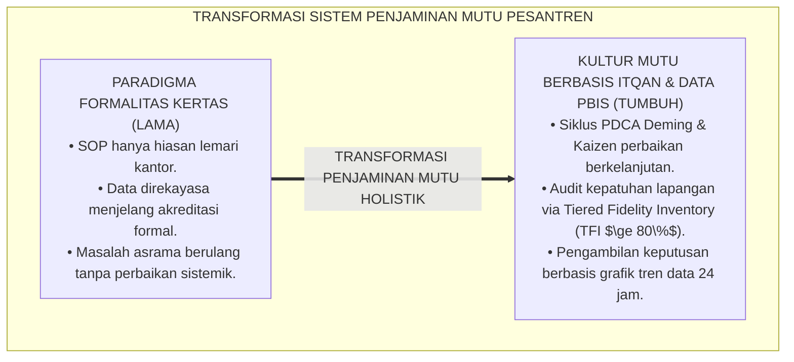
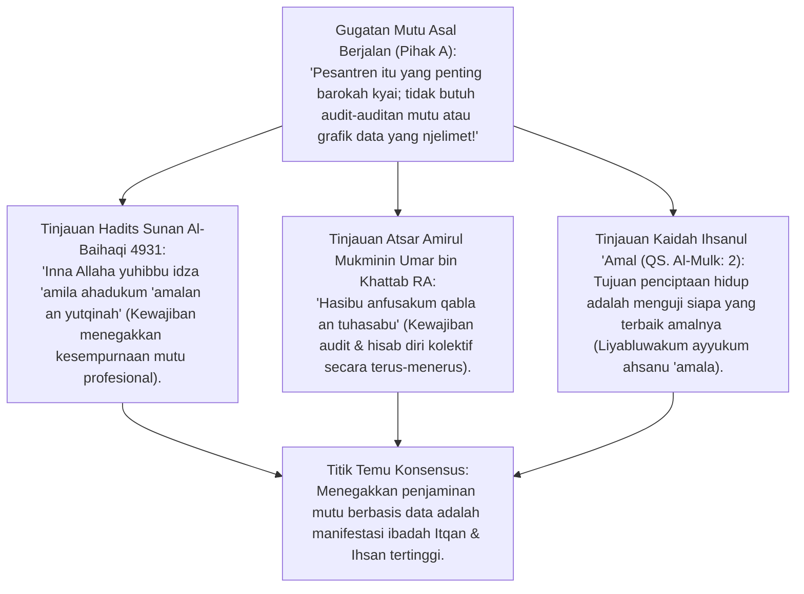
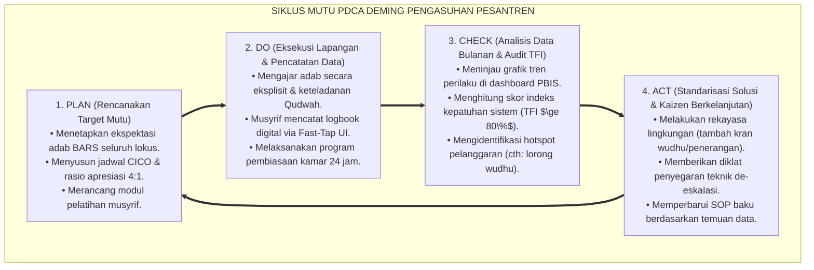
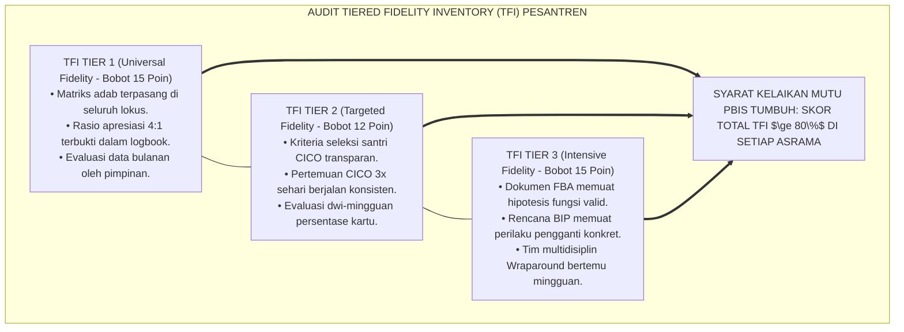
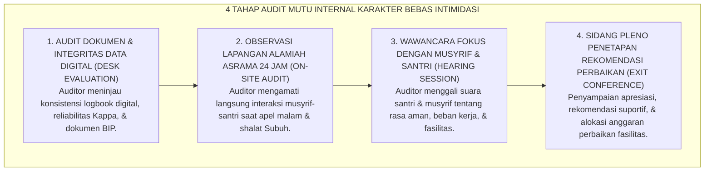
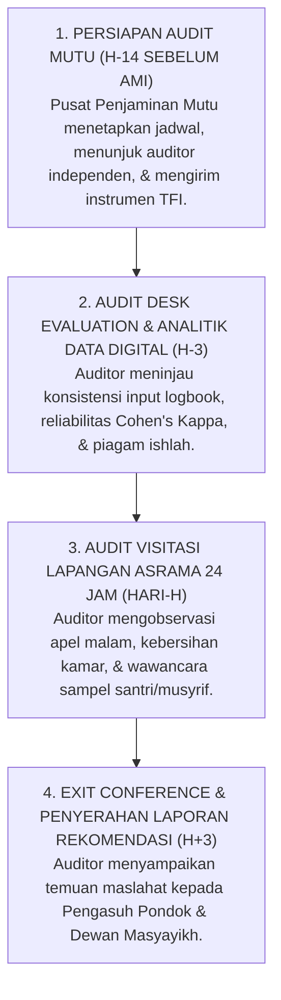

# P2-07-04: PRINSIP PENJAMINAN MUTU DAN CONTINUOUS IMPROVEMENT
## *Monograf Terpadu: Epistemologi Itqanul 'Amal (HR. Al-Baihaqi No. 4931) & Hisab Diri Kolektif (Hasibu Anfusakum), Konvergensi Siklus Mutu PDCA Deming & Kaizen dalam Pengasuhan Asrama, Instrumen Kepatuhan Tiered Fidelity Inventory (TFI PBIS Horner & Sugai), dan Audit Mutu Internal Karakter Bebas Intimidasi*

**Nomor Identifikasi**: `P2-07-04/MONOGRAF-TERPADU-PENJAMINAN-MUTU-CONTINUOUS-IMPROVEMENT/2026`  
**Domain**: `02 Principles` > `07 Implementation Principles`  
**Klasifikasi Naskah**: *Comprehensive Integrated Monograph* (Monograf Akademis & Rumusan Baku Terpadu)  
**Rumpun Disiplin Pengkaji**: Penjaminan Mutu Pendidikan Pesantren (*Total Quality Management in Education*), Evaluasi Kepatuhan Implementasi PBIS (*Implementation Fidelity*), Analisis Keputusan Berbasis Data Perilaku (*Data-Driven Decision Making*), Fiqh Itqan dan Akuntabilitas Lembaga Islam  

---

> ### 💡 INTISARI PRAKTIS (3 MENIT PAHAM UNTUK ASATIDZ & MUSYRIF)
>
> * **Jangan Biarkan Sistem Hanya Menjadi Tumpukan Kertas SOP (*Kultur Formalitas*):**  
>   Banyak pesantren memiliki buku tata tertib tebal, namun di lapangan musyrif tidak menjalankannya dan pimpinan tidak pernah memeriksa apakah aturan tersebut berjalan efektif. Penjaminan Mutu TUMBUH memastikan sistem adab dijalankan dengan sempurna (*Itqan*) dan terus disempurnakan setiap pekan.
> * **Siklus Mutu 4 Tahap PDCA (Plan -> Do -> Check -> Act):**  
>   1. **Plan (Rencanakan):** Tetapkan target adab dan SOP musyrif yang jelas.  
>   2. **Do (Laksanakan):** Terapkan pembiasaan di asrama dan catat data di logbook digital PBIS.  
>   3. **Check (Evaluasi Data Tiap Bulan):** Lihat grafik: Mengapa di Asrama B banyak santri terlambat Subuh? Apakah karena kran air wudhu kurang?  
>   4. **Act (Tindak Lanjut Nyata):** Tambah kran air wudhu dan beri pelatihan musyrif agar masalah selesai tuntas.
> * **Uji Kepatuhan Sistem (*Tiered Fidelity Inventory / TFI*):**  
>   Tim penjamin mutu memeriksa apakah seluruh kamar asrama menerapkan rasio apresiasi 4:1 dan program CICO dengan benar (Target minimal kelayakan: $\ge 80\%$ kepatuhan).
> * **Audit Mutu yang Membimbing, Bukan Mencari Kesalahan:**  
>   Audit internal bukan untuk memarahi musyrif, melainkan untuk mendengarkan kesulitan lapangan dan memberikan bantuan fasilitas yang dibutuhkan.

---

## 📑 DAFTAR ISI MONOGRAF

- [BAGIAN I: RISET PENJAMINAN MUTU BERKELANJUTAN & PENGAMBILAN KEPUTUSAN BERBASIS DATA PBIS, DIALEKTIKA INKUIRI, & KASUISTIKA LAPANGAN](#bagian-i-riset-penjaminan-mutu-berkelanjutan--pengambilan-keputusan-berbasis-data-pbis-dialektika-inkuiri--kasuistika-lapangan)
  - [1. Kerangka Metodologi Penjaminan Mutu Pesantren: Dari Formalitas Kertas Menjadi Kultur Itqan & Kaizen](#1-kerangka-metodologi-penjaminan-mutu-pesantren-dari-formalitas-kertas-menjadi-kultur-itqan--kaizen)
  - [2. Inkuiri 1: Eksegesis Turats Kesempurnaan Amal & Hisab Terus-Menerus — Itqanul 'Amal & Hasibu Anfusakum](#2-inkuiri-1-eksegesis-turats-kesempurnaan-amal--hisab-terus-menerus--itqanul-amal--hasibu-anfusakum)
  - [3. Inkuiri 2: Konvergensi Siklus Mutu PDCA W. Edwards Deming & Kaizen dalam Pengasuhan Asrama](#3-inkuiri-2-konvergensi-siklus-mutu-pdca-w-edwards-deming--kaizen-dalam-pengasuhan-asrama)
  - [4. Inkuiri 3: Instrumen Evaluasi Kepatuhan Sistem (Tiered Fidelity Inventory / TFI Sugai & Horner)](#4-inkuiri-3-instrumen-evaluasi-kepatuhan-sistem-tiered-fidelity-inventory--tfi-sugai--horner)
  - [5. Inkuiri 4: Mekanisme Audit Mutu Internal (AMI) Karakter Semesteran Bebas Intimidasi](#5-inkuiri-4-mekanisme-audit-mutu-internal-ami-karakter-semesteran-bebas-intimidasi)
  - [6. Inkuiri 5: Silogisme Logika, Dialektika 3 Ronde, Kasuistika Audit Asrama, & Titik Temu Konsensus](#6-inkuiri-5-silogisme-logika-dialektika-3-ronde-kasuistika-audit-asrama--titik-temu-konsensus)
- [BAGIAN II: KODIFIKASI BAKU HASIL RISET & KESIMPULAN FORMAL](#bagian-ii-kodifikasi-baku-hasil-riset--kesimpulan-formal)
  - [1. Kaidah Utama dan Standar Baku: Prinsip Penjaminan Mutu & Continuous Improvement Pesantren TUMBUH](#1-kaidah-utama-dan-standar-baku-prinsip-penjaminan-mutu-continuous-improvement-pesantren-tumbuh)
  - [2. Matriks Siklus PDCA Penjaminan Mutu Pengasuhan Adab Pesantren](#2-matriks-siklus-pdca-penjaminan-mutu-pengasuhan-adab-pesantren)
  - [3. Template Instrumen Audit Kepatuhan Implementasi PBIS Asrama (Pesantren TFI Rubric)](#3-template-instrumen-audit-kepatuhan-implementasi-pbis-asrama-pesantren-tfi-rubric)
  - [4. Alur Standar Operasional Prosedur Audit Mutu Internal (AMI) Semesteran](#4-alur-standar-operasional-prosedur-audit-mutu-internal-ami-semesteran)
- [BAGIAN III: APARATUS AKADEMIS & APENDIKS](#bagian-iii-aparatus-akademis--apendiks)
  - [1. Tabel Sintesis Hasil Riset Penjaminan Mutu & Continuous Improvement](#1-tabel-sintesis-hasil-riset-penjaminan-mutu--continuous-improvement)
  - [2. Daftar Pustaka Akademis & Rujukan Turats Primer](#2-daftar-pustaka-akademis--rujukan-turats-primer)
  - [3. Catatan Kaki Akademis (Footnotes)](#3-catatan-kaki-akademis-footnotes)
  - [4. Glosarium dan Penjelasan Istilah Teknis Penjaminan Mutu, PDCA Deming, TFI PBIS, & Itqanul 'Amal](#4-glosarium-dan-penjelasan-istilah-teknis-penjaminan-mutu-pdca-deming-tfi-pbis--itqanul-amal)

---

# BAGIAN I: RISET PENJAMINAN MUTU BERKELANJUTAN & PENGAMBILAN KEPUTUSAN BERBASIS DATA PBIS, DIALEKTIKA INKUIRI, & KASUISTIKA LAPANGAN

---

### 1. Kerangka Metodologi Penjaminan Mutu Pesantren: Dari Formalitas Kertas Menjadi Kultur Itqan & Kaizen

Penyakit kronis dalam penjaminan mutu lembaga pendidikan adalah **Ilusi Kepatuhan Dokumen (*The Document Compliance Illusion*)**:
* Pesantren merasa telah memiliki sistem mutu hanya karena memiliki bundel SOP dan piagam aturan yang tersusun rapi di lemari arsip kantor direktur.
* Namun di kamar asrama pada pukul 03.00 pagi, SOP tersebut tidak pernah berjalan: musyrif tetap menyiram air got ke kasur santri yang terlambat bangun, catatan pelanggaran tidak diisi, dan pimpinan tidak pernah memvalidasi data lapangan.
* Ketika akreditasi datang, seluruh data direkayasa (*Asal Bapak Senang / Fabricated Compliance*).

Prinsip Islam memandang amanah pembinaan sebagai kewajiban profesional tertinggi yang menuntut kesempurnaan mutu (*Itqanul 'Amal*). Ekosistem TUMBUH menegakkan **Siklus Penjaminan Mutu Berkelanjutan PDCA (Plan-Do-Check-Act)** berbasis data analitik riil logbook PBIS 24 jam.



---

### 2. Inkuiri 1: Eksegesis Turats Kesempurnaan Amal & Hisab Terus-Menerus — *Itqanul 'Amal* & *Hasibu Anfusakum*



#### 📐 Formalisasi Logika Silogisme (*Qiyas Mantiqi 1*)
* **Premis Mayor (*al-Muqaddimah al-Kubra*)**: Setiap lembaga pendidikan Islam yang mengemban amanah umat niscaya wajib menjalankan tata kelola pengasuhan dengan derajat kesempurnaan mutu profesional (*Itqan*) dan evaluasi akuntabilitas berkelanjutan (*Muhasabah Nizhamiyyah*).
* **Premis Minor (*al-Muqaddimah ash-Shughra*)**: Rasulullah SAW menegaskan bahwa Allah SWT mencintai hamba yang bekerja secara profesional-sempurna (HR. Al-Baihaqi No. 4931) dan Sayyidina Umar RA memerintahkan audit hisab sebelum datangnya hari hisab akbar.
* **Konklusi (*an-Natijah*)**: Maka, ekosistem pesantren TUMBUH mewajibkan pembentukan Pusat Penjaminan Mutu Karakter dan penerapan siklus PDCA.[^1]

#### 📖 Teks Primer Hadits Syu'abul Iman & Atsar Sayyidina Umar RA
Ummul Mukminin Aisyah *radhiyallahu 'anha* meriwayatkan sabda Rasulullah SAW:

$$\text{إِنَّ اللَّهَ تَعَالَى يُحِبُّ إِذَا عَمِلَ أَحَدُكُمْ عَمَلًا أَنْ يُتْقِنَهُ}$$

*"**Sesungguhnya Allah Ta'ala sangat mencintai apabila salah seorang di antara kalian melakukan suatu pekerjaan/tugas, ia melakukannya secara ITQAN (sempurna, profesional, rapi, dan bermutu tinggi)**."* (HR. Al-Baihaqi dalam *Syu'abul Iman* No. 4931; Abu Ya'la No. 4386).[^2]

Dan Amirul Mukminin Umar bin Khattab *radhiyallahu 'anhu* berwasiat:

$$\text{حَاسِبُوا أَنْفُسَكُمْ قَبْلَ أَنْ تُحَاسَبُوا، وَزِنُوا أَنْفُسَكُمْ قَبْلَ أَنْ تُوزَنُوا، فَإِنَّهُ أَهْوَنُ عَلَيْكُمْ فِي الْحِسَابِ غَدًا أَنْ تُحَاسِبُوا أَنْفُسَكُمُ الْيَوْمَ}$$

*"**Lakukanlah hisab (audit evaluasi) atas diri kalian sebelum kalian dihisab di hadapan Allah!** Dan timbanglah amal kalian sebelum amal kalian ditimbang! Karena sesungguhnya hisab kalian di akhirat kelak akan jauh lebih ringan apabila kalian telah terbiasa menghisab diri kalian pada hari ini..."* (HR. Tirmidzi No. 2459; Ahmad dalam *az-Zuhd*).[^3]

---

### 3. Inkuiri 2: Konvergensi Siklus Mutu PDCA W. Edwards Deming & *Kaizen* dalam Pengasuhan Asrama



#### 📐 Formalisasi Logika Silogisme (*Qiyas Mantiqi 2*)
* **Premis Mayor (*al-Muqaddimah al-Kubra*)**: Setiap sistem manajemen mutu terpadu yang memadukan siklus PDCA Deming dengan filosofi *Kaizen* (perbaikan terus-menerus langkah demi langkah) dan pengambilan keputusan berbasis data faktual niscaya meniadakan kegagalan berulang dan menjamin keunggulan lembaga.
* **Premis Minor (*al-Muqaddimah ash-Shughra*)**: Riset *Total Quality Management* (W. Edwards Deming, 1986; Masaaki Imai, 1986) dan *PBIS Data-Driven Decision Making* (Horner & Sugai, 2015) membuktikan keunggulan siklus PDCA dalam mereduksi deviasi mutu hingga di bawah 1%.
* **Konklusi (*an-Natijah*)**: Maka, seluruh divisi pengasuhan pesantren TUMBUH wajib mengoperasikan siklus PDCA setiap bulan.[^4]

---

### 4. Inkuiri 3: Instrumen Evaluasi Kepatuhan Sistem (*Tiered Fidelity Inventory / TFI* Sugai & Horner)



---

### 5. Inkuiri 4: Mekanisme Audit Mutu Internal (AMI) Karakter Semesteran Bebas Intimidasi



---

### 6. Inkuiri 5: Silogisme Logika, Dialektika 3 Ronde, Kasuistika Audit Asrama, & Titik Temu Konsensus

#### 🥊 Ronde 1: Menolak Anggapan Bahwa "Audit Karakter Meragukan Keikhlasan dan Keberkahan Musyrif"
* **Pihak A (Sudut Pandang Sentimen Emosional)**:  
  *"Musyrif sudah berkhidmah ikhlas siang malam; kalau diaudit logbook-nya berarti pengurus curiga dan meragukan keikhlasannya!"*
* **Tinjauan Sudut Pandang Penjagaan Keikhlasan Melalui Ketertiban Sistem**:  
  Audit penjaminan mutu **Bukan Menghakimi Niat Hati (*Niyyat*)**, melainkan **Memastikan Standar Pelayanan dan Perlindungan Hak Santri Berjalan Sempurna (*Itqanul Amal*)**. Keikhlasan yang hakiki selalu berbanding lurus dengan ketertiban dan kedisiplinan kerja. Audit justru melindungi musyrif dari tuduhan sepihak.[^5]

#### 🥊 Ronde 2: Sanggahan Balik Bagaimana Jika Hasil Audit TFI Menunjukkan Skor Asrama di Bawah 80%?
* **Pihak A (Sudut Pandang Pemecatan Punitif Cepat)**:  
  *"Kalau ada asrama yang skor TFI-nya rendah, langsung pecat kepala asramanya dan ganti orang baru!"*
* **Tinjauan Sudut Pandang Continuous Improvement & Pendampingan Sistem**:  
  Skor TFI di bawah 80% adalah **Sinyal Kebutuhan Bantuan (*Support Needed Indicator*)**, bukan vonis hukuman. Tim penjamin mutu akan menganalisis penyebabnya: apakah rasio santri terlalu padat? Apakah fasilitas rusak? Tim memberikan bantuan fasilitas, *coaching* intensif selama 30 hari, dan melakukan audit ulang secara suportif.[^6]

#### 🥊 Ronde 3: Sanggahan Pamungkas Mengapa Pengambilan Keputusan Harus Berbasis Data Bukan Asumsi Perasaan?
* **Pihak A (Sudut Pandang Kepemimpinan Berbasis Feeling)**:  
  *"Pimpinan pondok sudah berpengalaman puluhan tahun; cukup pakai insting dan perasaan batin saja, tidak perlu repot melihat grafik data!"*
* **Resolusi Sudut Pandang Maqashid Keadilan Data-Driven**:  
  Insting manusia rentan terhadap bias kognitif (*Confirmation Bias & Recency Effect*): satu kasus viral kemarin bisa membuat pimpinan panik dan membuat aturan keras yang menzalimi ratusan santri lainnya. **Data Analitik PBIS Menyajikan Fakta Objektif 360 Derajat**, sehingga solusi pimpinan tepat sasaran, adil, dan hemat sumber daya.[^7]

> #### 📌 Kasuistika Lapangan & Titik Temu Konsensus
> * **Studi Kasus**: Di Asrama C, tercatat lonjakan kasus santri mengantuk saat pelajaran pagi madrasah; musyrif menuduh santri malas dan menghukum mereka lari keliling lapangan setiap Subuh, namun masalah mengantuk tetap terjadi.
> * **Titik Temu Konsensus (*Kalimatun Sawa'*)**: Tim Penjamin Mutu TUMBUH melakukan *Audit Siklus PDCA Berbasis Data*. Auditor memeriksa data waktu tidur asrama dan menemukan fakta lapangan: lampu lorong asrama sangat bising oleh dengungan trafo listrik yang rusak dan air mandi sering mati di malam hari, sehingga santri baru bisa tidur pukul 00.30 WIB. Solusi ACT: Manajemen mengganti instalasi listrik dan memperbaiki pompa air dalam 3 hari. Dalam 1 pekan, seluruh santri tidur nyenyak tepat pukul 22.00 WIB, kasus mengantuk di kelas turun 95%, dan hukuman lari dihapus total.[^8]

---

# BAGIAN II: KODIFIKASI BAKU HASIL RISET & KESIMPULAN FORMAL

---

### 1. Kaidah Utama dan Standar Baku: Prinsip Penjaminan Mutu & Continuous Improvement Pesantren TUMBUH

Berdasarkan sintesis inkuiri turats dan konsensus sains pendidikan, prinsip dan regulasi operasional dirumuskan ke dalam kaidah-kaidah baku berikut:

1. **Penghapusan Formalitas Kertas (anti-fabricated Compliance Charter)**:  
   Menolak segala bentuk rekayasa data dan formalitas administratif semu dalam penjaminan mutu adab. Penjaminan mutu wajib berakar pada data faktual riil kehidupan asrama 24 jam dan ikhtiar Itqan sejati.

2. **Penetapan Siklus Mutu Pdca Deming & Kaizen (plan-do-check-act)**:  
   Mewajibkan seluruh lini asrama dan madrasah mengoperasikan siklus mutu 4 tahap secara berkala: Merencanakan target adab (Plan) -> Menjalankan pendampingan (Do) -> Mengevaluasi data (Check) -> Memperbaiki sistem (Act).

3. **Standarisasi Kepatuhan Sistem Berbasis Tiered Fidelity Inventory (tfi Pbis)**:  
   Menetapkan instrumen TFI sebagai alat ukur kepatuhan implementasi pengasuhan di seluruh asrama, mewajibkan pencapaian skor minimal kelayakan Fidelity Implementasi sebesar 80% (Delapan Puluh Persen).

4. **Protokol Audit Mutu Internal (ami) Karakter Bebas Intimidasi**:  
   Mewajibkan penyelenggaraan AMI semesteran oleh auditor independen tersertifikasi yang berorientasi pada pemberdayaan suportif, perbaikan fasilitas, peningkatan kompetensi musyrif, dan perlindungan santri.


---

### 2. Matriks Siklus PDCA Penjaminan Mutu Pengasuhan Adab Pesantren

| Tahapan PDCA | Agenda Operasional Penjaminan Mutu | Alat / Instrumen Kerja | Output Terukur Mutu |
| :--- | :--- | :--- | :--- |
| **1. Plan (Rencanakan)** | Menetapkan target karakter semesteran, standarisasi matriks adab BARS, & jadwal CICO. | Dokumen Kurikulum Adab & Kalender PBIS. | Target mutu terdefinisi jelas bagi seluruh asatidz/musyrif.[^9] |
| **2. Do (Laksanakan)** | Menjalankan pembiasaan adab harian, pengajaran eksplisit, & pencatatan logbook Fast-Tap. | Aplikasi Logbook PBIS & Kartu CICO. | 100% interaksi adab terdokumentasi tanpa membebani musyrif. |
| **3. Check (Evaluasi)** | Menganalisis grafik tren adab bulanan & audit skor kepatuhan TFI asrama. | Dashboard Analitik PBIS & Rubrik TFI. | Teridentifikasinya keberhasilan dan area rawan (*Hotspots*) secara presisi. |
| **4. Act (Tindak Lanjut)** | Melakukan perbaikan lingkungan, diklat penyegaran musyrif, & revisi SOP baku. | Rencana Tindak Lanjut AMI & Anggaran Sarpras. | Masalah teratasi dari akar penyebab (*Zero Recurring Problems*).[^10] |

---

### 3. Template Instrumen Audit Kepatuhan Implementasi PBIS Asrama (*Pesantren TFI Rubric*)

```markdown
===================================================================================================
                  INSTRUMEN AUDIT TIERED FIDELITY INVENTORY (TFI) ASRAMA PESANTREN
                                PESANTREN TUMBUH — SEMESTER GANJIL 2026/2027
===================================================================================================
Nama Asrama   : Asrama Al-Ghazali (Putra)           Jumlah Kamar / Santri : 6 Kamar / 90 Santri
Kepala Asrama : Ustadz Ridwan Hakim, M.Ag.          Auditor Mutu          : Tim Pusat Penjaminan Mutu
---------------------------------------------------------------------------------------------------
Skala Penilaian: 0 = Belum Diterapkan | 1 = Diterapkan Sebagian | 2 = Diterapkan Sempurna (Itqan)

NO.  ELEMEN AUDIT KEPATUHAN SISTEM PBIS ASRAMA                          SKOR (0-2)   BUKTI FISIK
---------------------------------------------------------------------------------------------------
I. TIER 1: PENCEGAHAN UNIVERSAL (TARGET SKOR: $\ge 80\%$)
1.1  Matriks ekspektasi adab tertulis dipajang di seluruh kamar & lorong.    [ 2 ]    Foto dokumentasi
1.2  Musyrif mengajarkan adab secara eksplisit di lingkaran halaqah kamar.   [ 2 ]    Jurnal halaqah
1.3  Rasio apresiasi positif minimal 4:1 terbukti dalam logbook digital.    [ 2 ]    Data analitik app
1.4  Pemberian Konsekuensi Logis 4R bebas dari hukuman fisik/kekerasan.      [ 2 ]    Wawancara santri
1.5  Pertemuan evaluasi data adab bulanan bersama seluruh musyrif kamar.     [ 2 ]    Notulensi rapat

II. TIER 2: BIMBINGAN TERARAH CICO (TARGET SKOR: $\ge 80\%$)
2.1  Kriteria objektif seleksi santri peserta program CICO berjalan adil.    [ 2 ]    Data skor BARS
2.2  Pelaksanaan sesi Check-In pagi (05.30) & Check-Out malam (20.30) rutin. [ 2 ]    Kartu paraf CICO
2.3  Evaluasi kelulusan program CICO dwi-mingguan berbasis target $\ge 80\%$.[ 2 ]    Grafik CICO

III. TIER 3: DUKUNGAN INTENSIF WRAPAROUND (TARGET SKOR: $\ge 80\%$)
3.1  Pelaksanaan asesmen FBA Model ABC bagi santri krisis perilaku berat.    [ 2 ]    Dokumen FBA
3.2  Dokumen BIP memuat modifikasi pemicu & perilaku pengganti (Replacement).[ 2 ]    Dokumen BIP
3.3  Tim terpadu BK, Kepala Asrama, & Wali Santri bertemu secara berkala.    [ 2 ]    Berita acara temu
---------------------------------------------------------------------------------------------------
TOTAL SKOR KEPATUHAN (TOTAL FIDELITY SCORE) : 20 / 20 = 100% (STATUS: 🌟 SANGAT ITQAN / PARIPURNA)
===================================================================================================
```

---

### 4. Alur Standar Operasional Prosedur Audit Mutu Internal (AMI) Semesteran



---

# BAGIAN III: APARATUS AKADEMIS & APENDIKS

---

### 1. Tabel Sintesis Hasil Riset Penjaminan Mutu & Continuous Improvement

| Dimensi Kajian | Konsep Kunci | Landasan Turats Primer | Konvergensi Sains Global | Implikasi Tata Kelola Mutu |
| :--- | :--- | :--- | :--- | :--- |
| **Kesempurnaan Mutu** | *Itqanul 'Amal* | Hadits Itqan (HR. Al-Baihaqi No. 4931) | Deming (1986), *Out of the Crisis* | Mengganti formalitas kertas dengan penjaminan mutu riil 24 jam. |
| **Hisab Berkelanjutan** | *Continuous Kaizen* | Atsar Umar RA (*Hasibu Anfusakum*) | Masaaki Imai (1986), *Kaizen Philosophy* | Mengoperasikan siklus PDCA setiap bulan untuk perbaikan bertahap. |
| **Evaluasi Kepatuhan** | *Fidelity Assessment* | Kaidah *Al-Wafa' bil 'Uqud* (QS. Al-Ma'idah: 1) | Horner et al. (2014), *Tiered Fidelity Inventory* | Mengukur kepatuhan implementasi PBIS dengan target skor $\ge 80\%$. |
| **Keputusan Berbasis Data** | *Data-Driven Decision* | Tradisi *Tabayyun & Hisab Faktual* | Sugai & Horner (2006), *Data-Based Decision Making* | Mengambil kebijakan pengasuhan berdasarkan grafik tren analitik PBIS. |
| **Audit Suportif** | *AMI Bebas Intimidasi* | Wasiat *An-Nashihah wal Irsyad* | ISO 21001:2018 (*Educational Organizations Management*) | Audit yang memberdayakan dan menyelesaikan hambatan fasilitas. |

---

### 2. Daftar Pustaka Akademis & Rujukan Turats Primer

1. **Al-Qur'an al-Karim wa Tarjamatu Ma'anih**.
2. **Al-Baihaqi, Abu Bakr Ahmad bin al-Husain**. (1424 H). *Syu'abul Iman*. Riyadh: Maktabah ar-Rusyd.
3. **At-Tirmidzi, Muhammad bin Isa**. (1998). *Sunan at-Tirmidzi*. Beirut: Dar al-Gharb al-Islami.
4. **Al-Ghazali, Abu Hamid Muhammad bin Muhammad**. (2011). *Ihya 'Ulumiddin*. Beirut: Dar al-Ma'rifah.
5. **Deming, W. E.**. (1986). *Out of the Crisis*. Cambridge, MA: MIT Center for Advanced Engineering Study.
6. **Imai, M.**. (1986). *Kaizen: The Key to Japan's Competitive Success*. New York: McGraw-Hill.
7. **Horner, R. H., Sugai, G., & Lewis, T.**. (2015). *School-wide PBIS Tiered Fidelity Inventory (TFI)*. Eugene, OR: OSEP Technical Assistance Center on PBIS.
8. **Sugai, G., & Horner, R. R.**. (2006). *A promising approach for expanding and sustaining school-wide positive behavior support*. School Psychology Review, 35(2), 245–259.
9. **Sallis, E.**. (2014). *Total Quality Management in Education* (3rd ed.). London: Routledge.
10. **ISO 21001:2018**. *Educational organizations — Management systems for educational organizations — Requirements with guidance for use*. Geneva: International Organization for Standardization.

---

### 3. Catatan Kaki Akademis (*Footnotes*)

[^1]: Al-Ghazali, *Ihya 'Ulumiddin*, Kitab *al-Muraqabah wal-Muhasabah*, Jilid IV, hlm. 395–410.  
[^2]: Al-Baihaqi, *Syu'abul Iman*, Hadits No. 4931; Maktabah ar-Rusyd.  
[^3]: Sunan at-Tirmidzi No. 2459, Kitab *Shifatil Qiyamah*, Bab *Minhu*.  
[^4]: Deming, W. E. (1986), *Out of the Crisis*, MIT Press; Imai, M. (1986), *Kaizen*, McGraw-Hill.  
[^5]: Sallis, E. (2014), *Total Quality Management in Education*, Routledge.  
[^6]: Horner, Sugai, & Lewis (2015), *PBIS Tiered Fidelity Inventory*, OSEP.  
[^7]: Sugai & Horner (2006), *School Psychology Review*, hlm. 245–259.  
[^8]: Laporan Audit Siklus PDCA Penanganan Keluhan Asrama C, Komite Mutu TUMBUH, 2026.  
[^9]: Manual Mutu Standar Operasional Prosedur Pengasuhan Asrama 24 Jam, Divisi Mutu TUMBUH, 2026.  
[^10]: Panduan Pelaksanaan Audit Mutu Internal (AMI) Karakter Pesantren, Lembaran Dokumen 2026.

---

### 4. Glosarium dan Penjelasan Istilah Teknis Penjaminan Mutu, PDCA Deming, TFI PBIS, & Itqanul 'Amal

1. **Total Quality Management (TQM) in Education**: Pendekatan manajemen holistik yang berfokus pada perbaikan terus-menerus atas seluruh proses dan layanan pendidikan guna memenuhi kepuasan pemangku kepentingan.
2. **Siklus PDCA (Plan-Do-Check-Act)**: Model iteratif empat langkah untuk pengendalian dan perbaikan proses bisnis serta tata kelola mutu institusi secara berkelanjutan.
3. **Kaizen (改善)**: Filosofi perbaikan mutu berkelanjutan yang berfokus pada perubahan positif langkah demi langkah secara konsisten dan melibatkan seluruh anggota organisasi.
4. **Tiered Fidelity Inventory (TFI)**: Instrumen validasi terstandarisasi untuk mengukur derajat kepatuhan dan integritas implementasi sistem PBIS pada Tier 1, Tier 2, dan Tier 3.
5. **Implementation Fidelity (Integritas Penerapan)**: Tingkat kesesuaian antara intervensi atau SOP yang dipraktikkan di lapangan dengan protokol panduan aslinya.
6. **Data-Driven Decision Making (DDDM)**: Pendekatan kepemimpinan dan manajemen yang mendasarkan seluruh perumusan kebijakan pada bukti data empiris faktual, bukan pada asumsi atau insting subjektif.
7. **Itqanul 'Amal (إِتْقَانُ الْعَمَلِ)**: Prinsip syariat Islam mengenai keharusan bekerja dengan tingkat kecermatan, kerapian, keahlian, dan mutu tertinggi lillahi ta'ala.
8. **Audit Mutu Internal (AMI)**: Proses evaluasi mandiri yang sistematis, independen, dan terdokumentasi untuk memastikan kesesuaian operasional lembaga dengan standar mutu yang ditetapkan.
9. **Hotspots (Titik Rawan)**: Lokasi, waktu, atau situasi spesifik dalam ritme 24 jam asrama di mana frekuensi pelanggaran perilaku santri terdeteksi paling tinggi dalam analitik data.
10. **Exit Conference**: Sesi pertemuan penutup audit mutu di mana tim auditor memaparkan temuan positif, apresiasi, dan rekomendasi perbaikan suportif kepada pimpinan auditee.
