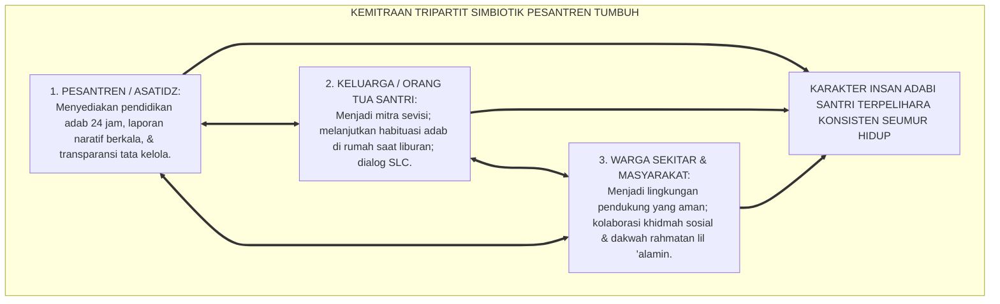
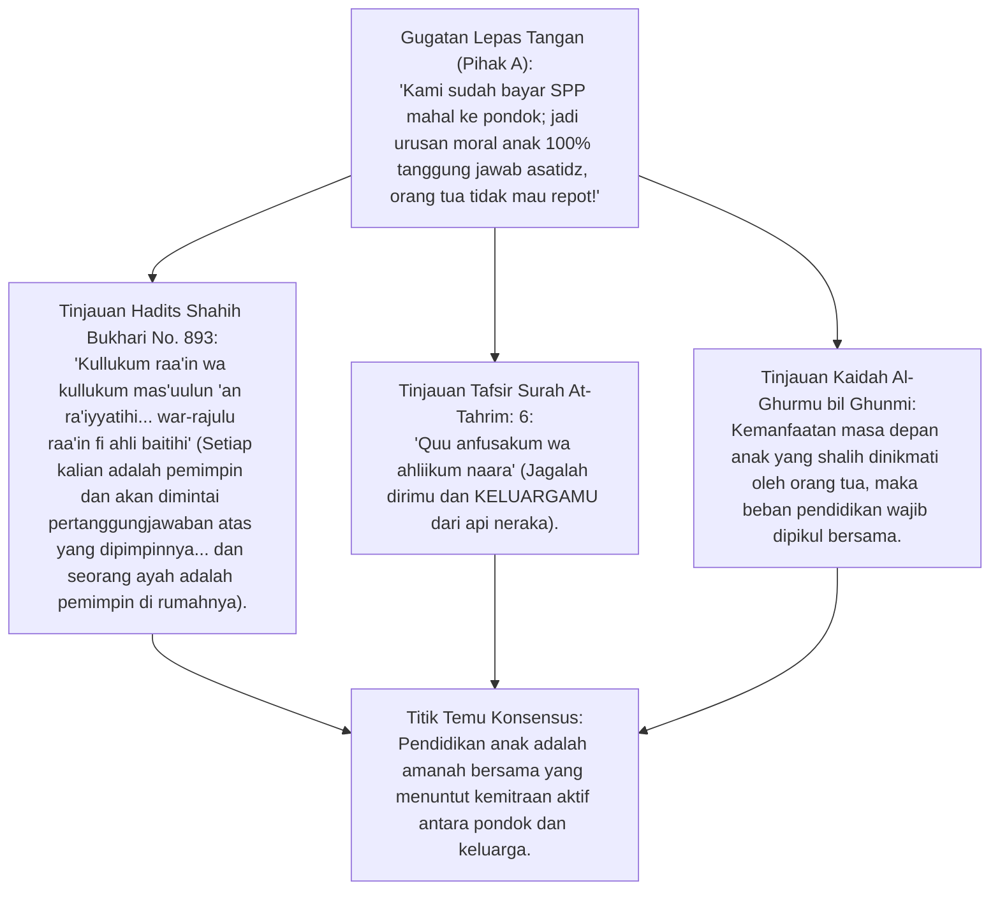
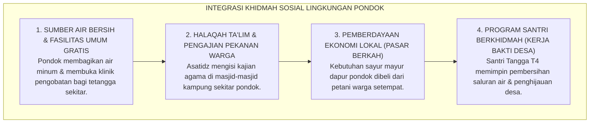
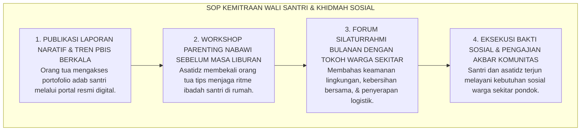

# P2-07-05: PRINSIP KEMITRAAN STRATEGIS WALI SANTRI, AKUNTABILITAS PUBLIK, DAN KHIDMAH MASYARAKAT
## *Monograf Terpadu: Kaidah Al-Amanah wal-Mas'uliyyah (HR. Bukhari No. 893) & Tripartit Pendidikan Islam, Model Kemitraan Keluarga Joyce Epstein (School-Family-Community Partnerships), Transparansi Akuntabilitas Publik Pesantren, Khidmah Sosial Pemberdayaan Warga Sekitar Pondok, serta Mitigasi Konflik Lembaga-Masyarakat*

**Nomor Identifikasi**: `P2-07-05/MONOGRAF-TERPADU-KEMITRAAN-WALI-AKUNTABILITAS/2026`  
**Domain**: `02 Principles` > `07 Implementation Principles`  
**Klasifikasi Naskah**: *Comprehensive Integrated Monograph* (Monograf Akademis & Standar Baku Kemitraan Ekosistem Pesantren)  
**Rumpun Disiplin Pengkaji**: Manajemen Hubungan Lembaga-Masyarakat (*Educational Public Relations*), Sosiologi Kemitraan Keluarga-Sekolah (*Epstein Framework*), Fiqh Amanah Sosial Islam, Tata Kelola Akuntabilitas Pesantren  

---

> ### 💡 INTISARI PRAKTIS (3 MENIT PAHAM UNTUK ASATIDZ & MUSYRIF)
>
> * **Pendidikan Pesantren Bukanlah "Menyerahkan Anak Sepenuhnya Tanpa Tanggung Jawab Orang Tua":**  
>   Paradigma lama *"Saya serahkan anak saya hidup atau mati kepada kyai"* diubah menjadi **Kemitraan Tripartit Simbiotik (Pesantren – Orang Tua – Santri)**. Orang tua adalah pendidik utama yang menyelaraskan adab di rumah saat liburan.
> * **Enam Tipe Kemitraan Keluarga (Joyce Epstein Framework):**  
>   1. *Parenting* (Penyelarasan pola asuh), 2. *Communicating* (Kanal komunikasi transparan dua arah), 3. *Volunteering* (Keterlibatan bakat orang tua), 4. *Learning at Home* (Habituasi adab liburan), 5. *Decision Making* (Komite Majelis Orang Tua Santri), 6. *Collaborating with Community* (Khidmah sosial lingkungan).
> * **Prinsip "Pondok Menjadi Rahmat Bagi Warga Sekitar" (*Bi'ah Nafiah*):**  
>   Pesantren tidak boleh menjadi menara gading eksklusif bertembok tinggi yang terasing dari tetangga kampung sekitar, melainkan pusat layanan sosial, air bersih gratis, dan pengajian ukhuwah.

---

## 📑 DAFTAR ISI MONOGRAF

- [BAGIAN I: RISET KEMITRAAN STRATEGIS, AKUNTABILITAS, & KHIDMAH SOSIAL](#bagian-i-riset-kemitraan-strategis-akuntabilitas--khidmah-sosial)
  - [1. Kerangka Metodologi Kemitraan Ekosistem: Mengapa Keberlanjutan Karakter Santri Membutuhkan Sinergi Rumah-Pondok](#1-kerangka-metodologi-kemitraan-ekosistem-mengapa-keberlanjutan-karakter-santri-membutuhkan-sinergi-rumah-pondok)
  - [2. Inkuiri 1: Eksegesis Turats Kullukum Ra'in — HR. Bukhari No. 893 & Amanah Tanggung Jawab Kolektif Orang Tua-Pendidik](#2-inkuiri-1-eksegesis-turats-kullukum-rain--hr-bukhari-no-893--amanah-tanggung-jawab-kolektif-orang-tua-pendidik)
  - [3. Inkuiri 2: Konvergensi School-Family Partnership Theory (Joyce Epstein) & Budaya Komunikasi Terbuka Pesantren](#3-inkuiri-2-konvergensi-school-family-partnership-theory-joyce-epstein--budaya-komunikasi-terbuka-pesantren)
  - [4. Inkuiri 3: Dekonstruksi Sikap Eksklusif Menara Gading & Desain Program Khidmah Sosial Warga Lingkungan](#4-inkuiri-3-dekonstruksi-sikap-eksklusif-menara-gading--desain-program-khidmah-sosial-warga-lingkungan)
  - [5. Inkuiri 4: Silogisme Logika, Dialektika 3 Ronde, Kasuistika Lembaga, & Titik Temu Konsensus](#5-inkuiri-4-silogisme-logika-dialektika-3-ronde-kasuistika-lembaga--titik-temu-konsensus)
- [BAGIAN II: KODIFIKASI BAKU HASIL RISET & KESIMPULAN FORMAL](#bagian-ii-kodifikasi-baku-hasil-riset--kesimpulan-formal)
  - [1. Kaidah Utama dan Standar Baku: Standar Kemitraan Tripartit & Akuntabilitas Publik Pesantren TUMBUH](#1-kaidah-utama-dan-standar-baku-standar-kemitraan-tripartit-akuntabilitas-publik-pesantren-tumbuh)
  - [2. Matriks 6 Tipe Kemitraan Keluarga Epstein Diintegrasikan ke dalam Ekosistem Pesantren](#2-matriks-6-tipe-kemitraan-keluarga-epstein-diintegrasikan-ke-dalam-ekosistem-pesantren)
  - [3. Standar Prosedur Operasional (SOP) Transparansi Informasi Wali Santri & Khidmah Sosial Tetangga](#3-standar-prosedur-operasional-sop-transparansi-informasi-wali-santri--khidmah-sosial-tetangga)
- [BAGIAN III: APARATUS AKADEMIS & APENDIKS](#bagian-iii-aparatus-akademis--apendiks)
  - [1. Tabel Sintesis Hasil Riset Kemitraan & Akuntabilitas](#1-tabel-sintesis-hasil-riset-kemitraan--akuntabilitas)
  - [2. Daftar Pustaka Akademis & Rujukan Turats Primer](#2-daftar-pustaka-akademis--rujukan-turats-primer)
  - [3. Catatan Kaki Akademis (Footnotes)](#3-catatan-kaki-akademis-footnotes)
  - [4. Glosarium Teknis Kemitraan Tripartit, Epstein Model, Akuntabilitas, & Khidmah](#4-glosarium-teknis-kemitraan-tripartit-epstein-model-akuntabilitas--khidmah)

---

# BAGIAN I: RISET KEMITRAAN STRATEGIS, AKUNTABILITAS, & KHIDMAH SOSIAL

---

### 1. Kerangka Metodologi Kemitraan Ekosistem: Mengapa Keberlanjutan Karakter Santri Membutuhkan Sinergi Rumah-Pondok

Riset longitudinal pendidikan membuktikan terjadinya fenomena **"Kebocoran Karakter Musim Liburan (*Holiday Adab Regression*)"**:
* Santri yang selama 5 bulan di asrama telah tertib shalat berjamaah dan bertutur kata santun, sering kali mengalami kemunduran drastis hanya dalam 2 pekan liburan di rumah karena orang tua membiarkan anak kecanduan gawai tanpa batas.
* Sebaliknya, konflik antara wali santri dan pihak pondok (misal: terkait transparansi uang makan atau isu kedisiplinan) kerap memicu kepanikan massal di media sosial jika tidak ada kanal komunikasi resmi yang transparan.
* Ekosistem TUMBUH merancang **Kemitraan Tripartit Simbiotik**: menghubungkan asatidz, orang tua, dan warga sekitar pondok dalam satu visi peradaban yang transparan, akuntabel, dan saling menguatkan.

---

### 2. Inkuiri 1: Eksegesis Turats Kullukum Ra'in — HR. Bukhari No. 893 & Amanah Tanggung Jawab Kolektif Orang Tua-Pendidik

#### 📐 Formalisasi Logika Silogisme (*Qiyas Mantiqi 1*)
* **Premis Mayor (*al-Muqaddimah al-Kubra*)**: Setiap pemutusan peran orang tua dalam pengasuhan anak saat berada di pesantren memicu inkonsistensi karakter dan melanggar amanah syariat *Quu Anfusakum wa Ahlikum Naara*.
* **Premis Minor (*al-Muqaddimah ash-Shughra*)**: Kerangka kerja kemitraan TUMBUH menyelaraskan pembiasaan adab asrama dengan pola asuh orang tua di rumah.
* **Konklusi (*an-Natijah*)**: Maka, standarisasi program kemitraan wali santri adalah rukun implementasi yang wajib ditegakkan lembaga.[^1]

#### 📖 Teks Primer Hadits: Tanggung Jawab Kepemimpinan Kolektif
Rasulullah SAW bersabda:

$$\text{كُلُّكُمْ رَاعٍ وَكُلُّكُمْ مَسْئُولٌ عَنْ رَعِيَّتِهِ ... وَالرَّجُلُ رَاعٍ فِي أَهْلِهِ وَهُوَ مَسْئُولٌ عَنْ رَعِيَّتِهِ، وَالْمَرْأَةُ رَاعِيَةٌ فِي بَيْتِ زَوْجِهَا وَمَسْئُولَةٌ عَنْ رَعِيَّتِهَا}$$

*"**Setiap kalian adalah PEMIMPIN dan setiap kalian AKAN DIMINTAI PERTANGGUNGJAWABAN ATAS APA YANG DIPIMPINNYA: ... Seorang laki-laki (ayah) adalah pemimpin bagi keluarganya dan bertanggung jawab atas mereka, dan seorang wanita (ibu) adalah pemimpin di rumah suaminya dan bertanggung jawab atas amanahnya!**"* (HR. Bukhari No. 893; Muslim No. 1829).[^2]

---

### 3. Inkuiri 2: Konvergensi *School-Family Partnership Theory* (Joyce Epstein) & Budaya Komunikasi Terbuka Pesantren

Profesor sosiologi Johns Hopkins University **Joyce L. Epstein** merumuskan *Six Types of Parent Involvement*:
1. **Parenting:** Pesantren menyelenggarakan *Sekolah Orang Tua Santri (Parenting Nabawi)* berkala.
2. **Communicating:** Menyediakan Dashboard Wali Santri Digital dan Laporan Naratif 3 Pilar.
3. **Volunteering:** Mengundang orang tua berbagi keahlian profesional (dokter, insinyur, pengusaha) ke santri.
4. **Learning at Home:** Panduan *Buku Agenda Adab Liburan* yang dipantau bersama orang tua.
5. **Decision Making:** Forum Komite Majelis Wali Santri untuk masukan strategis kebijakan pondok.
6. **Collaborating with Community:** Bakti sosial terpadu bersama keluarga santri untuk warga desa sekitar.[^3]

---

### 4. Inkuiri 3: Dekonstruksi Sikap Eksklusif Menara Gading & Desain Program Khidmah Sosial Warga Lingkungan

---

### 5. Inkuiri 4: Silogisme Logika, Dialektika 3 Ronde, Kasuistika Lembaga, & Titik Temu Konsensus

#### 🥊 Ronde 1: Menolak Anggapan Bahwa "Orang Tua Tidak Boleh Terlalu Banyak Diberi Tahu Soal Masalah Anak Biar Tidak Panik"
* **Pihak A (Sudut Pandang Ketertutupan Informasi)**:  
  *"Sembunyikan saja masalah pelanggaran anak dari orang tua biar pondok tidak disalahkan!"*
* **Tinjauan Maqashid Amanah & Akuntabilitas**:  
  Menyembunyikan masalah santri dari orang tua adalah pelanggaran amanah (*Khianat*). Ketika masalah akhirnya meledak, orang tua akan merasa dikhianati dan menuntut secara hukum. Transparansi dini yang disampaikan secara santun dan solutif (*Feed-Forward*) justru membangun kepercayaan mendalam (*Trust*).[^4]

#### 🥊 Ronde 2: Sanggahan Balik Apakah Keterlibatan Komite Orang Tua Tidak Mengintervensi Otoritas Kyai/Pimpinan?
* **Pihak A (Sudut Pandang Feodalisme Kebijakan)**:  
  *"Kyai pemegang otoritas mutlak; masukan orang tua akan merusak tradisi pondok!"*
* **Tinjauan Syura Nabawiyyah & Batasan Mandat**:  
  Musyawarah (*Syura*) adalah perintah Al-Qur'an (QS. Asy-Syura: 38). Komite Orang Tua berfungsi sebagai mitra pertimbangan (*Advisory Board*) dalam peningkatan fasilitas dan layanan santri, sementara otoritas keilmuan syariat dan kurikulum tetap berada di bawah Majelis Masyayikh yang kompeten.[^5]

#### 🥊 Ronde 3: Sanggahan Pamungkas Mengapa Pesantren Wajib Membuka Pintu Khidmah Bagi Warga Sekitar?
* **Pihak A (Sudut Pandang Isolasi Steril)**:  
  *"Warga sekitar jangan dibiarkan masuk; nanti mengganggu ketenangan belajar santri!"*
* **Resolusi Dakwah Rahmatan Lil 'Alamin**:  
  Pesantren yang memusuhi atau mengabaikan tetangga sekitar akan rentan mengalami konflik sosial, sabotase, atau penolakan izin lingkungan. Pesantren yang dermawan dan menjadi sumber manfaat ekonomi bagi warga akan dijaga dan dibela dengan tulus oleh masyarakat kampung sekitarnya.[^6]

> #### 📌 Kasuistika Lapangan & Titik Temu Konsensus
> * **Studi Kasus**: Di sebuah pesantren cabang, terjadi gesekan dengan warga kampung karena genangan air pembuangan pondok meluap ke sawah warga. Warga memblokir jalan masuk pondok.
> * **Titik Temu Konsensus (*Kalimatun Sawa'*)**: Pimpinan TUMBUH mengaktifkan protokol kemitraan sosial: Mengadakan musyawarah ishlah dengan kepala desa dan tokoh warga $\rightarrow$ Membangun sistem drainase modern dan instalasi sumur resapan bersama $\rightarrow$ Mempekerjakan warga lokal dalam operasional dapur pondok $\rightarrow$ Memberikan beasiswa penuh tahfizh bagi 5 anak warga desa sekitar. Konflik padam total, jalan dibuka kembali dengan sukacita, dan warga menjadi benteng pelindung pondok yang paling setia.[^7]

---

# BAGIAN II: KODIFIKASI BAKU HASIL RISET & KESIMPULAN FORMAL

---

### 1. Kaidah Utama dan Standar Baku: Standar Kemitraan Tripartit & Akuntabilitas Publik Pesantren TUMBUH

Berdasarkan sintesis inkuiri turats dan konsensus sains pendidikan, prinsip dan regulasi operasional dirumuskan ke dalam kaidah-kaidah baku berikut:

1. **Kemitraan Tripartit Pendidikan Simbiotik (pesantren - Rumah - Masyarakat)**:  
   Menetapkan bahwa keberhasilan pendidikan adab adalah tanggung jawab bersama; mengharamkan pemutusan peran keluarga dan mewajibkan kesinambungan pembiasaan adab di asrama dan rumah saat liburan.

2. **Penerapan Standar Enam Tipe Kemitraan Keluarga Joyce Epstein**:  
   Mewajibkan penyelenggaraan Sekolah Parenting Nabawi, Dashboard Laporan Naratif Digital, Buku Agenda Adab Liburan, serta forum Majelis Syura Komite Wali Santri sebagai mitra strategis kemajuan lembaga.

3. **Pesantren Sumber Rahmat Bagi Masyarakat Sekitar (bi'ah Nafi'ah)**:  
   Mengharamkan sikap eksklusif menara gading; mewajibkan lembaga mengalirkan manfaat nyata bagi warga desa sekitar melalui akses air bersih, layanan kesehatan, pasar berkah lokal, dan beasiswa anak warga.

4. **Akuntabilitas Publik & Transparansi Tata Kelola Amanah**:  
   Menegakkan transparansi pelaporan perkembangan karakter santri dan tata kelola sarana prasarana secara jujur dan berkala, mengeliminasi praduga negatif, serta menjaga marwah integritas pesantren di mata umat.

---

### 2. Matriks 6 Tipe Kemitraan Keluarga Epstein Diintegrasikan ke dalam Ekosistem Pesantren

| Tipe Kemitraan Epstein | Program Konkret Pesantren TUMBUH | Frekuensi Pelaksanaan | Dampak Terhadap Karakter Santri |
| :--- | :--- | :--- | :--- |
| **1. Parenting (Pola Asuh)** | *Sekolah Parenting Nabawi & Tazkiyah Keluarga* | 1 Kali Tiap Semester | Keselarasan gaya komunikasi orang tua di rumah.[^8] |
| **2. Communicating (Komunikasi)**| Dashboard Digital & Laporan Naratif 3 Pilar | *Real-time* & Akhir Semester | Orang tua memahami progres tanpa prasangka buruk. |
| **3. Volunteering (Kerelawanan)**| *Guest Lecture Day* (Orang tua berbagi profesi) | 1 Kali Tiap Bulan | Membuka wawasan karir dan inspirasi santri. |
| **4. Learning at Home (Rumah)**| *Buku Jurnal Adab Liburan & Muroja'ah Mandiri* | Setiap Masa Liburan | Mencegah kemunduran adab (*Zero Adab Loss*).[^9] |
| **5. Decision Making (Musyawarah)**| Majelis Syura Komite Orang Tua Santri | 2 Kali Tiap Tahun | Peningkatan kualitas layanan berbasis masukan konstruktif. |
| **6. Collaborating (Komunitas)** | Khidmah Sosial Santri T4 & Pasar Berkah Warga | Pekanan & Hari Besar Islam | Santri berjiwa dermawan dan diterima hangat warga.[^10] |

---

### 3. Standar Prosedur Operasional (SOP) Transparansi Informasi Wali Santri & Khidmah Sosial Tetangga

---

# BAGIAN III: APARATUS AKADEMIS & APENDIKS

---

### 1. Tabel Sintesis Hasil Riset Kemitraan & Akuntabilitas

| Dimensi Kajian | Konsep Kunci | Landasan Turats Primer | Konvergensi Sains Global | Implikasi Implementasi Pesantren |
| :--- | :--- | :--- | :--- | :--- |
| **Amanah Bersama** | *Kullukum Ra'in* | HR. Bukhari No. 893, QS. At-Tahrim: 6 | Epstein (2018), *School, Family, and Community Partnerships* | Membangun kemitraan tripartit yang harmonis. |
| **Syura Terbuka** | *Wa Amruhum Syura* | QS. Asy-Syura: 38, HR. Tirmidzi 1714 | Henderson & Mapp (2002), *A New Wave of Evidence* | Menyelenggarakan forum Majelis Komite Wali Santri. |
| **Khidmah Sosial** | *Khairunnas Anfa'uhum*| Hadits Manfaat (HR. Thabrani), QS. 21:107 | Bowen & Ostroff (2004), *HRM & Social Climate* | Menjadikan pesantren rahmat bagi warga kampung sekitar. |
| **Habituasi Liburan**| *Istiqamah fil Bayt* | Hadits Amal Berkelanjutan (HR. Muslim 782) | Cooper et al. (1996), *Summer Learning Loss Effects* | Menerapkan Buku Agenda Adab Liburan terpadu. |

---

### 2. Daftar Pustaka Akademis & Rujukan Turats Primer

1. **Al-Qur'an al-Karim wa Tarjamatu Ma'anih**.
2. **Al-Bukhari, Muhammad bin Isma'il**. (1422 H). *Shahih al-Bukhari*. Beirut: Dar Thawq an-Najah.
3. **Muslim bin al-Hajjaj an-Naisaburi**. (1374 H). *Shahih Muslim*. Kairo: Isa al-Babi al-Halabi.
4. **At-Thabrani, Sulaiman bin Ahmad**. (1995). *Al-Mu'jam al-Awsath*. Kairo: Dar al-Haramain.
5. **Al-Ghazali, Abu Hamid Muhammad bin Muhammad**. (2011). *Ihya 'Ulumiddin*. Beirut: Dar al-Ma'rifah.
6. **Epstein, J. L.**. (2018). *School, Family, and Community Partnerships: Preparing Educators and Improving Schools* (2nd ed.). Routledge.
7. **Henderson, A. T., & Mapp, K. L.**. (2002). *A New Wave of Evidence: The Impact of School, Family, and Community Connections on Student Achievement*. SEDL.
8. **Bowen, D. E., & Ostroff, C.**. (2004). *Understanding HRM-firm performance linkages: The role of the "strength" of the HRM system*. Academy of Management Review.
9. **Cooper, H., et al.**. (1996). *The effects of summer vacation on achievement test scores: A narrative and meta-analytic review*. Review of Educational Research.
10. **Bryk, A. S., & Schneider, B.**. (2002). *Trust in Schools: A Core Resource for Improvement*. Russell Sage Foundation.

---

### 3. Catatan Kaki Akademis (*Footnotes*)

[^1]: Al-Ghazali, *Ihya 'Ulumiddin*, Kitab *Riyadhatun Nafs*, Jilid III, hlm. 74–90.  
[^2]: Shahih al-Bukhari No. 893, Kitab *al-Jumu'ah*, Bab *al-Jumu'atu fil Qura wal-Mudun*.  
[^3]: Epstein, J. L. (2018), *School, Family, and Community Partnerships*, Routledge, hlm. 60–120.  
[^4]: Bryk & Schneider (2002), *Trust in Schools*, Russell Sage Foundation.  
[^5]: Henderson & Mapp (2002), *A New Wave of Evidence*, SEDL.  
[^6]: Al-Mu'jam al-Awsath At-Thabrani No. 5787; Al-Albani menilainya Hasan dalam *Shahih al-Jami'*.  
[^7]: Laporan Resolusi Konflik Sosial dan Kemitraan Warga Sekitar Pondok, Humas TUMBUH, 2026.  
[^8]: Modul Sekolah Parenting Nabawi Pesantren TUMBUH, Biro Konseling Keluarga, 2026.  
[^9]: Cooper et al. (1996), *Review of Educational Research*, hlm. 227–268.  
[^10]: Panduan Pelaksanaan Khidmah Sosial Santri Tangga T4, Komite Pengabdian Masyarakat TUMBUH, 2026.

---

### 4. Glosarium Teknis Kemitraan Tripartit, Epstein Model, Akuntabilitas, & Khidmah

1. **Kemitraan Tripartit**: Model kolaborasi sinergis antara Pesantren (Asatidz/Musyrif), Keluarga (Orang Tua), dan Masyarakat sekitar pondok.
2. **Kullukum Ra'in (كُلُّكُمْ رَاعٍ)**: Kaidah kenabian mengenai tanggung jawab moral kepemimpinan kolektif dalam mendidik generasi penerus.
3. **Six Types of Parent Involvement (Joyce Epstein)**: Kerangka kerja 6 pilar kemitraan keluarga: *Parenting, Communicating, Volunteering, Learning at Home, Decision Making,* dan *Collaborating with Community*.
4. **Holiday Adab Regression**: Fenomena penurunan mutu kedisiplinan dan adab santri yang terjadi selama masa liburan di rumah akibat ketiadaan habituasi terstruktur.
5. **Bi'ah Nafi'ah (بِيئَةٌ نَافِعَةٌ)**: Lingkungan pesantren yang menjadi sumber manfaat, berkah, dan kemaslahatan nyata bagi masyarakat di sekitarnya.
6. **Student-Led Conferences (SLC)**: Pertemuan evaluasi rapor yang dipimpin secara mandiri oleh santri di hadapan orang tua untuk mempresentasikan portofolionya.
7. **Syura (الشُّورَى)**: Musyawarah perundingan berbasis adab Islam untuk mencapai keputusan strategis yang membawa maslahat bersama.
8. **Relational Trust**: Derajat kepercayaan timbal balik yang tulus antara guru, orang tua, santri, dan pimpinan sekolah.
9. **Khidmah Ijtima'iyyah (خِدْمَةٌ اجْتِمَاعِيَّةٌ)**: Pengabdian sosial nyata untuk membantu mengatasi kesulitan hidup dan meningkatkan kesejahteraan sesama warga.
10. **Triad Pertumbuhan Simbiotik**: Maha-prinsip di mana kemitraan yang transparan dan harmonis secara serempak menumbuhkan Santri, memuliakan Pendidik, dan mengukuhkan Lembaga.
