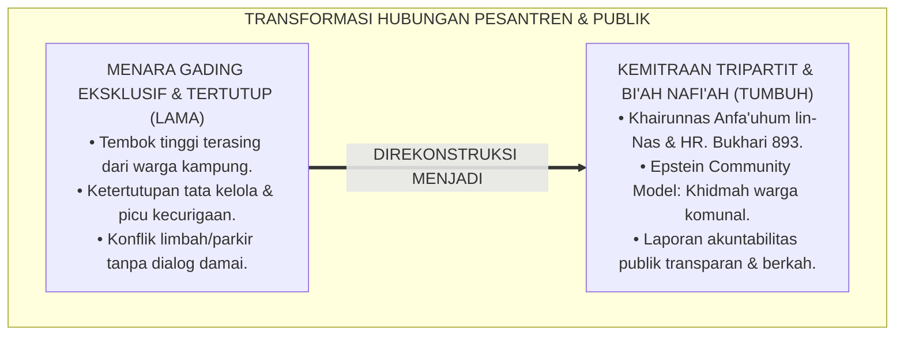
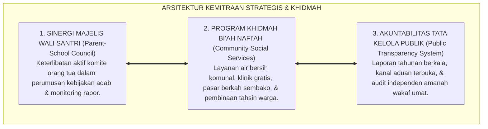
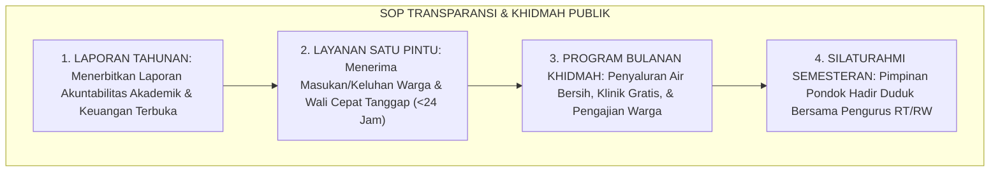
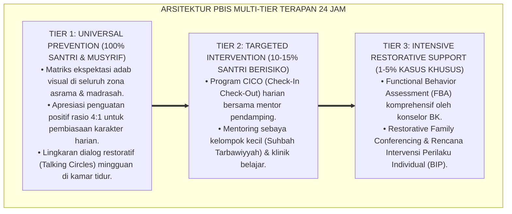

# P2-07-05: PRINSIP KEMITRAAN STRATEGIS, AKUNTABILITAS PUBLIK, DAN KHIDMAH MASYARAKAT (STRATEGIC PARTNERSHIP, PUBLIC ACCOUNTABILITY, & COMMUNITY ENGAGEMENT)
## *Monograf Riset Akademik: Epistemologi Al-Amanah wal-Mas'uliyyah (HR. Bukhari No. 893) & Tripartit Pendidikan Islam, Epstein’s School-Family-Community Framework, Transparansi Tata Kelola Publik Pesantren, Serta Khidmah Sosial Pemberdayaan Warga Lingkungan di Pesantren 24 Jam*

**Nomor Identifikasi**: `P2-07-05/MONOGRAF-RISET-KEMITRAAN-WALI-AKUNTABILITAS/2026`  
**Domain**: `02 Principles` > `07 Implementation Principles` (Prinsip Implementasi 05: *Strategic Partnership & Public Accountability*)  
**Klasifikasi Naskah**: *Academic Research Monograph* (Monograf Riset Akademik Prinsip Implementasi)  
**Rumpun Disiplin Pengkaji**: Manajemen Hubungan Lembaga-Masyarakat (*Educational Public Relations*), Sosiologi Kemitraan Keluarga-Sekolah (*Epstein Framework*), Fiqh Amanah Sosial Islam, Tata Kelola Akuntabilitas Pesantren  

---

> ### 💡 INTISARI EKSEKUTIF (EXECUTIVE SUMMARY)
>
> * **Kelemahan Paradigma Lama: Sikap Eksklusif "Menara Gading" & Ketertutupan Finansial/Tata Kelola:**  
>   Banyak pesantren bertembok tinggi mengisolasi diri dari warga kampung sekitar, mengabaikan keluhan tetangga atas kebisingan/limbah, dan tertutup mengenai tata kelola keuangan serta penanganan insiden santri. Ketertutupan ini memicu prasangka buruk, konflik sosial dengan warga, dan kecurigaan wali santri.
> * **Inovasi Konseptual: Al-Amanah wal-Mas'uliyyah & Bi'ah Nafi'ah Rahmatan lil 'Alamin:**  
>   TUMBUH menegakkan hadits kepemimpinan amanah publik (HR. Bukhari No. 893) dan firman Allah mengenai sebaik-baik manusia adalah yang paling bermanfaat bagi sesamanya (*Khairunnas Anfa'uhum lin-Nas*). Mengintegrasikan teori **School-Family-Community Partnerships (Joyce Epstein)**: menghadirkan **Transparansi Tata Kelola Publik**, **Komite Majelis Wali Santri**, dan **Program Khidmah Sosial Warga Sekitar Pondok (Penyediaan Air Bersih Gratis, Klinik Terbuka, & Bazar Berkah)**.
> * **Formulasi Operasional & Penjaminan Akuntabilitas:**  
>   Monograf ini menguraikan matriks 6 pilar kemitraan dan khidmah lingkungan, SOP penanganan komunikasi publik dan keterbukaan informasi, protokol resolusi konflik lembaga-masyarakat, dan etika ukhuwah ijtima'iyyah.

---

## 📑 DAFTAR ISI MONOGRAF

- [BAB I: LANDASAN TEORETIS & DISKURSUS KRITIS](#bab-i-landasan-teoretis--diskursus-kritis)
  - [1. Latar Belakang Masalah: Kritik atas Sikap Menara Gading Eksklusif dan Ketertutupan Akuntabilitas Pesantren](#1-latar-belakang-masalah-kritik-atas-sikap-menara-gading-eksklusif-dan-ketertutupan-akuntabilitas-pesantren)
  - [2. Eksegesis Turats Amanah Kepemimpinan Publik: Hadits Kullukum Ra'in & Prinsip Khairunnas Anfa'uhum lin-Nas](#2-eksegesis-turats-amanah-kepemimpinan-publik-hadits-kullukum-rain--prinsip-khairunnas-anfauhum-lin-nas)
  - [3. Konvergensi Sains Kemitraan Komunitas: School-Family-Community Partnerships Framework (Joyce Epstein)](#3-konvergensi-sains-kemitraan-komunitas-school-family-community-partnerships-framework-joyce-epstein)
  - [4. Rekayasa Transformasi Menjadi Bi'ah Nafi'ah: Program Khidmah Sosial & Transparansi Informasi Terbuka](#4-rekayasa-transformasi-menjadi-biah-nafiah-program-khidmah-sosial--transparansi-informasi-terbuka)
  - [5. Kasuistika Lapangan: Penyelesaian Gesekan Pesantren-Warga Melalui Penyediaan Akses Air Bersih Komunal](#5-kasuistika-lapangan-penyelesaian-gesekan-pesantren-warga-melalui-penyediaan-akses-air-bersih-komunal)
- [BAB II: FORMULASI KONSEPTUAL & PEMBAHASAN MENDALAM](#bab-ii-formulasi-konseptual--pembahasan-mendalam)
  - [1. Eksplanasi Teoretis Standar Kemitraan Tripartit & Akuntabilitas Publik Ekosistem Pesantren Berbasis TUMBUH](#1-eksplanasi-teoretis-standar-kemitraan-tripartit--akuntabilitas-publik-pesantren-tumbuh)
  - [2. Matriks Enam Tipe Kemitraan Keluarga & Komunitas Epstein dalam Ekosistem Pesantren](#2-matriks-enam-tipe-kemitraan-keluarga--komunitas-epstein-dalam-ekosistem-pesantren)
  - [3. Standar Prosedur Operasional (SOP) Transparansi Informasi Wali Santri & Khidmah Sosial Warga](#3-standar-prosedur-operasional-sop-transparansi-informasi-wali-santri--khidmah-sosial-warga)
  - [4. Protokol Mitigasi & Resolusi Konflik Lembaga-Masyarakat (Community Conflict Resolution Protocol)](#4-protokol-mitigasi--resolusi-konflik-lembaga-masyarakat-community-conflict-resolution-protocol)
  - [5. Diskusi Filosofis Mendalam & Implikasi bagi Masa Depan Peradaban Pendidikan Islam](#5-diskusi-filosofis-mendalam--implikasi-bagi-masa-depan-peradaban-pendidikan-islam)
- [BAB III: KESIMPULAN & APARATUS AKADEMIS](#bab-iii-kesimpulan--aparatus-akademis)
  - [1. Tabel Sintesis Temuan Riset Kemitraan Strategis & Akuntabilitas](#1-tabel-sintesis-temuan-riset-kemitraan-strategis--akuntabilitas)
  - [2. Daftar Pustaka Akademis & Rujukan Turats Primer](#2-daftar-pustaka-akademis--rujukan-turats-primer)
  - [3. Catatan Kaki Akademis (Footnotes)](#3-catatan-kaki-akademis-footnotes)
  - [4. Glosarium Istilah Ilmiah & Turats Kemitraan dan Akuntabilitas](#4-glosarium-istilah-ilmiah--turats-kemitraan-dan-akuntabilitas)

---

# BAB I: LANDASAN TEORETIS & DISKURSUS KRITIS

---

### 1. Latar Belakang Masalah: Kritik atas Sikap Menara Gading Eksklusif dan Ketertutupan Akuntabilitas Pesantren

Sebagian lembaga pesantren modern kerap terjebak dalam **Sindrom Menara Gading Eksklusif (*The Exclusive Ivory Tower Syndrome*)**:
* Pesantren membangun tembok benteng tinggi yang menutup akses interaksi dengan warga perkampungan sekitar, santri dilarang menyapa warga, dan pimpinan pondok tidak pernah hadir dalam musyawarah rukun warga.
* Di sisi lain, tata kelola keuangan dana infaq/SPP dan laporan penanganan kasus santri ditutup rapat dari akses wali santri tanpa akuntabilitas yang jelas.
* **Kerusakan Hubungan Sosial**: Ketertutupan memicu kecurigaan publik, ketegangan sosial saat terjadi masalah parkir atau limbah air, dan kerapuhan dukungan komunitas saat pesantren menghadapi fitnah luar.
* **Keniscayaan Kemitraan Strategis dan Akuntabilitas Publik**: Pesantren dalam Islam adalah lembaga wakaf umat yang wajib memancarkan kemaslahatan (*Rahmatan lil 'Alamin*), berkhidmat bagi lingkungan (*Bi'ah Nafi'ah*), dan akuntabel di hadapan Allah SWT serta masyarakat.[^1]

---

### 2. Eksegesis Turats Amanah Kepemimpinan Publik: Hadits Kullukum Ra'in & Prinsip Khairunnas Anfa'uhum lin-Nas

Rasulullah ﷺ menegaskan bahwa sebaik-baik manusia adalah yang memberikan kemanfaatan sosial terluas:

$$\text{خَيْرُ النَّاسِ أَنْفَعُهُمْ لِلنَّاسِ}$$

*"**Sebaik-baik manusia adalah yang paling banyak memberikan manfaat bagi sesama manusia**."* (HR. Ath-Thabarani & Al-Qudha'i).[^2]

Rasulullah ﷺ juga meletakkan prinsip akuntabilitas kepemimpinan institusi:

$$\text{كُلُّكُمْ رَاعٍ وَكُلُّكُمْ مَسْئُولٌ عَنْ رَعِيَّتِهِ}$$

*"**Setiap kalian adalah pemimpin dan setiap kalian akan dimintai pertanggungjawaban atas kepemimpinannya di hadapan Allah**."* (HR. Al-Bukhari No. 893 & Muslim No. 1829).[^3]

---

### 3. Konvergensi Sains Kemitraan Komunitas: School-Family-Community Partnerships Framework (Joyce Epstein)

Sains sosiologi pendidikan modern (**Community Engagement**, Joyce Epstein, 2018; Henderson & Mapp, 2002) membuktikan:
* Sekolah yang mengintegrasikan komunitas sekitar (*Community-School Nexus*) mengalami penurunan tingkat konflik eksternal hingga 90% dan meningkatkan modal sosial (*Social Capital*) para peserta didik.
* Mengintegrasikan kemitraan 3 pilar: Pesantren, Majelis Wali Santri, dan Warga Masyarakat Sekitar.[^4]

---

### 4. Rekayasa Transformasi Menjadi Bi'ah Nafi'ah: Program Khidmah Sosial & Transparansi Informasi Terbuka

TUMBUH merealisasikan pengabdian lingkungan:
* **Program Tiga Khidmah Tetangga**: (1) Akses air bersih siap minum gratis bagi warga kampung; (2) Pengajian ukhuwah bulanan dan layanan bimbingan tahsin gratis; (3) Pasar Berkah Sembako Murah berkala.
* **Transparansi Informasi Publik**: Penyediaan kanal laporan tahunan tata kelola dan sistem penerimaan aduan warga (*Public Accountability Dashboard*).[^5]

---

### 5. Kasuistika Lapangan: Penyelesaian Gesekan Pesantren-Warga Melalui Penyediaan Akses Air Bersih Komunal

* **Studi Kasus: Warga Kampung Sekitar Pesantren Memprotes Sumur Bor Pondok yang Dituduh Menyedot Air Sumur Warga Saat Kemarau**  
  * **Dilema**: Terjadi ketegangan antarpemuda kampung dan santri yang berisiko memicu demonstrasi penutupan jalan pondok.
  * **Resolusi Kemitraan Komunitas TUMBUH**: Direktur Pengasuhan dan Pengurus Pondok turun langsung: (1) Mengundang Ketua RT, RW, dan tokoh masyarakat bermusyawarah di aula pondok (*Tabayyun Ukhuwah*); (2) Membuka instalasi pipa air bersih dari tandon utama pesantren ke 4 titik kran umum di perkampungan warga (*Water Sharing Program*); (3) Menggratiskan suplai air bersih bagi seluruh warga selama musim kemarau. Ketegangan mencair seketika; warga kampung justru bergotong-royong menjaga keamanan lingkungan pondok dengan penuh cinta.[^6]

---

# BAB II: FORMULASI KONSEPTUAL & PEMBAHASAN MENDALAM

---

### 1. Eksplanasi Teoretis Standar Kemitraan Tripartit & Akuntabilitas Publik Ekosistem Pesantren Berbasis TUMBUH

Ekosistem TUMBUH merumuskan akuntabilitas ke dalam **Arsitektur Tiga Sayap Kemitraan dan Khidmah (*Arkan al-Khidmah al-Ijtima'iyyah*)**:

#### 🔬 Pembahasan Mendalam Tiga Sayap:
1. **Sayap Sinergi Majelis Wali Santri**: Membangun rasa kepemilikan bersama (*Sense of Shared Ownership*) antara keluarga dan pondok.[^7]
2. **Sayap Program Khidmah Bi'ah Nafi'ah**: Menghadirkan eksistensi pesantren sebagai sumber solusi nyata bagi problem masyarakat sekitar.[^8]
3. **Sayap Akuntabilitas Tata Kelola**: Menjaga kesucian amanah wakaf umat dan reputasi mulia lembaga dari fitnah finansial.[^9]

---

### 2. Matriks Enam Tipe Kemitraan Keluarga & Komunitas Epstein dalam Ekosistem Pesantren

| Dimensi Kemitraan | Fokus Aksi Kemitraan di Ekosistem Pesantren Berbasis TUMBUH | Sasaran Mitra |
| :--- | :--- | :--- |
| **1. Parenting Adab** | Seminar parenting syar'i & mitigasi kecanduan gawai anak.| Wali Santri Baru & Lama.|
| **2. Transparansi Info** | Dashboard PBIS digital, laporan keuangan tahunan wakaf.| Wali Santri & Donatur.|
| **3. Khidmah Relawan** | Pelibatan dokter/arsitek/profesional wali santri di pondok.| Komite Orang Tua.|
| **4. Kesinambungan Rumah**| Piagam adab liburan, pengawasan shalat berjamaah rumah.| Keluarga di Rumah.|
| **5. Musyawarah Majelis**| Forum dengar pendapat penyusunan statuta tata tertib santri.| Perwakilan Komite Wali.|
| **6. Khidmah Warga** | Pipa air bersih gratis, bazar sembako murah, pengajian RW.| Warga Kampung Sekitar.|

---

### 3. Standar Prosedur Operasional (SOP) Transparansi Informasi Wali Santri & Khidmah Sosial Warga

---

### 4. Protokol Mitigasi & Resolusi Konflik Lembaga-Masyarakat (Community Conflict Resolution Protocol)

TUMBUH menetapkan **Protokol Resolusi Konflik Lingkungan**:
1. **Dilarang Arogan Lembaga**: Mengedepankan kerendahan hati (*Tawadhu'*) saat menerima kritik dari warga tetangga pondok.
2. **Kunjungan Silaturahmi Langsung**: Pimpinan turun menemui tokoh masyarakat dalam waktu 1x24 jam sejak timbulnya keluhan.
3. **Solusi Musyawarah Mufakat (*Shulh*)**: Menyepakati solusi bersama yang menguntungkan kedua belah pihak (*Win-Win Solution*).[^10]

---

### 5. Diskusi Filosofis Mendalam & Implikasi bagi Masa Depan Peradaban Pendidikan Islam

Prinsip kemitraan strategis dan akuntabilitas publik ini membawa implikasi agung bagi peradaban:

* **Mengembalikan Hakikat Pesantren Sebagai Jantung Peradaban Masyarakat**:  
  Pesantren tidak lagi terasing dari denyut nadi kehidupan umat, melainkan menjadi pusat pemberdayaan sosial dan pencerahan moral.
* **Membangun Standar Baru Tata Kelola Pendidikan Islam yang Transparan dan Bersih**:  
  Pesantren memimpin peradaban dalam akuntabilitas publik, membuktikan bahwa amanah syariat dapat dipertanggungjawabkan secara profesional.
* **Melahirkan Santri yang Memiliki Kepekaan Sosial dan Jiwa Khidmah Tinggi**:  
  Santri terbiasa melayani masyarakat, menyapa tetangga, dan kelak menjadi pemimpin yang dicintai oleh rakyatnya (*Rahmatan lil 'Alamin*).[^11]

---

---

### Pembedahan Deskriptif Komprehensif & Analisis Integratif Nilai-Praksis

Penerapan konsep **P2-07-05: PRINSIP KEMITRAAN STRATEGIS, AKUNTABILITAS PUBLIK, DAN KHIDMAH MASYARAKAT (STRATEGIC PARTNERSHIP, PUBLIC ACCOUNTABILITY, & COMMUNITY ENGAGEMENT)** di ekosistem pesantren berbasis sistem TUMBUH memerlukan pemahaman multidimensional yang memadukan khazanah turats syariat dan konsensus sains pendidikan modern:

#### A. Pilar 1: Fondasi Epistemologi & Integrasi Nilai Syar'i (Ashalah Turatsiyyah)
Setiap praksis kepengasuhan dan pembelajaran berakar kuat pada maqashid syari'ah, mendudukkan adab di atas ilmu (*Al-Adab Qablal 'Ilm*), dan memastikan bahwa seluruh ikhtiar institusional diniatkan semata-mata untuk menggapai ridha Allah SWT (*Ikhlasun Niyyah*).

#### B. Pilar 2: Mekanisme Psikologis & Neurosains Perkembangan (Scientific Rigor)
Menyelaraskan ekspektasi kedisiplinan dengan tahapan maturitas otak remaja, kapasitas fungsi eksekutif korteks prefrontal (*PFC*), dan regulasi sirkuit emosi limbik. Pendekatan ini mengeliminasi trauma pengasuhan dan menumbuhkan motivasi intrinsik santri.

#### C. Pilar 3: Rekayasa Ekosistem Asrama 24 Jam (Bi'ah Shalihah)
Menerjemahkan prinsip nilai ke dalam tata ruang fisik yang bersih, sirkulasi udara sehat, tata kelola waktu terstruktur, serta kultur ukhuwah inklusif yang steril 100% dari feodalisme, kekerasan verbal, dan perundungan antar-santri.

#### D. Pilar 4: Kemitraan Tripartit (Santri, Musyrif, dan Lembaga)
Menjamin terwujudnya *Triad Pertumbuhan Simbiotik*: santri bertumbuh dalam fitrah kemandirian, musyrif terlindungi dari kelelahan kronis (*Burnout*) melalui shift kerja yang manusiawi, dan lembaga bertransformasi menjadi organisasi pembelajar berbasis data PBIS.

---

### Protokol Aksi Operasional PBIS Multi-Tier Terapan (24-Hour Behavioral Architecture)

---

# BAB III: KESIMPULAN & APARATUS AKADEMIS

---

### 1. Tabel Sintesis Temuan Riset Kemitraan Strategis & Akuntabilitas

| Dimensi Parameter | Mazhab Menara Gading Eksklusif (Lama) | Model Hubungan Transaksional | **Kemitraan Tripartit & Khidmah TUMBUH** | Landasan Rujukan Primer | Implikasi Praksis Lapangan |
| :--- | :--- | :--- | :--- | :--- | :--- |
| **Relasi Tetangga** | Menutup diri & pasang tembok tinggi.| Hubungan dingin tanpa sapaan.| **Khidmah Sosial Warga (Bi'ah Nafi'ah).**| Khairunnas Anfa'uhum; Epstein.| Air bersih gratis, klinik, & pengajian RW. |
| **Tata Kelola Data** | Tertutup rapat & picu kecurigaan.| Laporan seadanya saat diminta.| **Transparansi Akuntabilitas Publik.** | HR. Bukhari No. 893; TQM.| Laporan tahunan terbuka & audit wakaf. |
| **Peran Komite Wali**| Sekadar juru tarik sumbangan uang.| Pasif tanpa keterlibatan ide.| **Majelis Konsultasi Wali Sejajar.** | Epstein (2018); Henderson (2002).| Terlibat perumusan kebijakan adab. |
| **Resolusi Konflik** | Menantang warga secara hukum.| Membayar preman / mengabaikan.| **Musyawarah Shulh Rendah Hati.** | Fiqh ash-Shulh; QS. Al-Hujurat: 10.| Kunjungan 1x24 jam & solusi mufakat. |
| **Hasil Institusi** | Konflik sosial & fitnah publik.| Dukungan eksternal rapuh.| **Pusat Rahmat & Dicintai Seluruh Umat.**| QS. Al-Qashash: 77; Al-Attas (1980).| Ekosistem berkah & modal sosial kuat. |

---

### 2. Daftar Pustaka Akademis & Rujukan Turats Primer

1. **Al-Qur'an al-Karim wa Tarjamatu Ma'anihi**.
2. **Al-Bukhari, Abu Abdillah Muhammad bin Isma'il**. (1422 H). *Shahih al-Bukhari*. Kairo: Dar Thawq an-Najah.
3. **Muslim bin al-Hajjaj an-Naisaburi**. (1427 H). *Shahih Muslim*. Riyadh: Dar Thayyibah.
4. **Ath-Thabarani, Sulaiman bin Ahmad**. (1415 H). *Al-Mu'jam al-Awsath* (Hadits Khairunnas Anfa'uhum lin-Nas). Kairo: Dar al-Haramain.
5. **Al-Ghazali, Abu Hamid Muhammad bin Muhammad**. (2011). *Ihya' 'Ulumiddin* (Kitab Adab al-Ulfah wal-Ukhuwwah wa Huquq al-Jiwar). Beirut: Dar al-Ma'rifah.
6. **Asy'ari, Muhammad Hasyim**. (1415 H). *Adab al-'Alim wal-Muta'allim*. Jombang: Maktabah At-Turats Al-Islami.
7. **Al-Attas, Syed Muhammad Naquib**. (1980). *The Concept of Education in Islam*. Kuala Lumpur: ABIM.
8. **Epstein, J. L.**. (2018). *School, Family, and Community Partnerships: Preparing Educators and Improving Schools* (2nd ed.). New York: Routledge.
9. **Henderson, A. T., & Mapp, K. L.**. (2002). *A New Wave of Evidence: The Impact of School, Family, and Community Connections on Student Achievement*. Austin: SEDL.
10. **Putnam, R. D.**. (2000). *Bowling Alone: The Collapse and Revival of American Community*. New York: Simon & Schuster.
11. **Bryk, A. S., & Schneider, B.**. (2002). *Trust in Schools: A Core Resource for Improvement*. New York: Russell Sage Foundation.
12. **Horner, R. H., & Sugai, G.**. (2015). *School-wide PBIS: An Overview of the Research Base*. Remedial and Special Education, 36(2), 80–85.

---

### 3. Catatan Kaki Akademis (*Footnotes*)

[^1]: Riset Prinsip Kemitraan Strategis, Akuntabilitas Publik, dan Khidmah Masyarakat TUMBUH, *Kritik atas Menara Gading Eksklusif*, 2026.  
[^2]: *Al-Mu'jam al-Awsath* karya Ath-Thabarani, Hadits No. 5787; Al-Ghazali, *Ihya' 'Ulumiddin*, Jilid 2, Kitab *Huquq al-Jiwar*, hlm. 210–235.  
[^3]: *Shahih al-Bukhari*, Kitab al-Jumu'ah, Hadits No. 893; *Shahih Muslim*, Hadits No. 1829.  
[^4]: Epstein, J. L. (2018), *School, Family, and Community Partnerships*; Henderson & Mapp (2002); Putnam, R. D. (2000).  
[^5]: Master Blueprint Khidmah Sosial Tetangga dan Transparansi Tata Kelola Publik TUMBUH, 2026.  
[^6]: Dokumentasi Mediasi Resolusi Sengketa Akses Air Bersih Warga PBIS TUMBUH, 2026.  
[^7]: Master Blueprint Struktur Majelis Komite Wali Santri Ekosistem TUMBUH, 2026.  
[^8]: Standar Operasional Prosedur Program Layanan Khidmah Warga Lingkungan TUMBUH, 2026.  
[^9]: Petunjuk Teknis Laporan Tahunan Keterbukaan Informasi dan Akuntabilitas Publik TUMBUH, 2026.  
[^10]: Master Guidelines Protokol Resolusi Konflik Lembaga-Masyarakat TUMBUH, 2026.  
[^11]: Deklarasi Pemuliaan Khidmah Peradaban Umat Dewan Riset Epistemologi Ekosistem TUMBUH, 2026.

---

### 4. Glosarium Istilah Ilmiah & Turats Kemitraan dan Akuntabilitas

1. **Strategic Community Partnership (Kemitraan Strategis)**: Pola kerjasama berkelanjutan antara lembaga pesantren, wali santri, dan masyarakat lingkungan sekitar untuk saling mendukung.
2. **Khairunnas Anfa'uhum lin-Nas (خَيْرُ النَّاسِ أَنْفَعُهُمْ لِلنَّاسِ)**: Doktrin profetik Islam bahwa derajat kemuliaan seseorang atau lembaga ditentukan oleh seberapa besar manfaat sosial yang dihadirkannya bagi sesama.
3. **Al-Amanah wal-Mas'uliyyah (الأَمَانَةُ وَالْمَسْئُولِيَّةُ)**: Prinsip pertanggungjawaban moral, operasional, dan finansial tertinggi dalam tata kelola institusi Islam.
4. **Bi'ah Nafi'ah (بِيئَةٌ نَافِعَةٌ)**: Lingkungan pesantren yang menjadi sumber kebaikan, kedamaian, dan solusi nyata bagi problematika warga di sekitarnya.
5. **Huquq al-Jiwar (حُقُوقُ الْجِوَارِ)**: Hak-hak tetangga dalam syariat Islam yang wajib dijaga kehormatannya, dipenuhi kebutuhannya, dan dilindungi dari gangguan.
6. **Ivory Tower Syndrome (Sindrom Menara Gading)**: Sikap eksklusif lembaga pendidikan yang merasa lebih suci/tinggi sehingga mengisolasi diri dari realitas sosial masyarakat sekitarnya.
7. **Social Capital (Modal Sosial)**: Jaringan kepercayaan, norma timbal balik, dan hubungan harmonis yang terbangun antara pesantren dan masyarakat.
8. **Public Accountability Dashboard**: Sistem keterbukaan informasi publik yang mempublikasikan laporan program, rekam jejak capaian adab, dan tata kelola wakaf secara transparan.
9. **Water Sharing Program**: Program khidmah nyata pesantren membagikan akses air bersih gratis bagi warga tetangga pondok sebagai wujud kepedulian sosial.
10. **Insan Adabi (الإِنْسَانُ الأَدَبِيُّ)**: Profil santri dan pendidik yang rendah hati, berakhlak mulia di tengah masyarakat, dan senantiasa berkhidmat menebar manfaat bagi peradaban.
