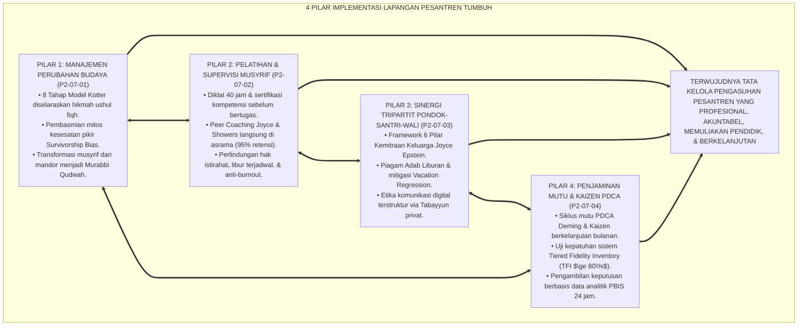
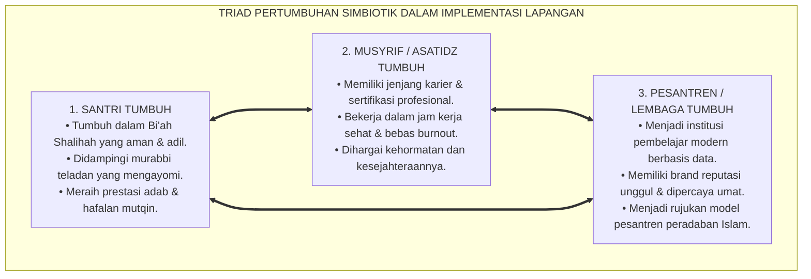
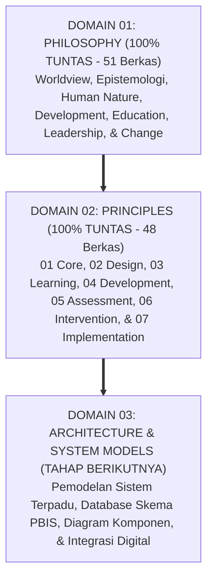
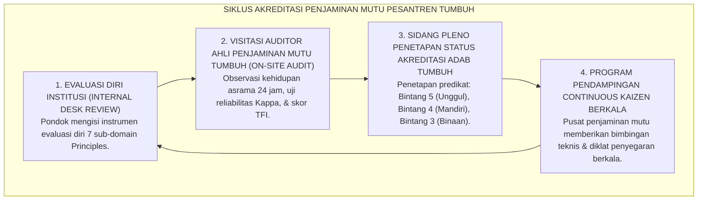

# P2-07-05: SINTESIS IMPLEMENTATION PRINCIPLES DAN GRAND MANIFESTO TATA KELOLA
## *Monograf Terpadu: Sintesis Holistik 4 Pilar Implementasi Lapangan (Kotter Change Management, Joyce & Showers Peer Coaching, Epstein Tripartite Partnership, & Deming PDCA Kaizen), Matriks Uji Kesiapan Skalabilitas Sistem, Penegasan Triad Pertumbuhan Simbiotik, serta Puncak Penutupan Master Domain 02 Principles Menuju Domain 03 Architecture*

**Nomor Identifikasi**: `P2-07-05/MONOGRAF-TERPADU-SINTESIS-IMPLEMENTATION-PRINCIPLES/2026`  
**Domain**: `02 Principles` > `07 Implementation Principles`  
**Klasifikasi Naskah**: *Comprehensive Synthesis Monograph* (Monograf Sintesis Implementasi & Grand Manifesto Tata Kelola Ekosistem)  
**Rumpun Disiplin Pengkaji**: Manajemen Strategis & Skalabilitas Lembaga Pendidikan Islam, Tata Kelola Pengasuhan Pesantren Terpadu, Metodologi Penjaminan Mutu Berkelanjutan, Kepemimpinan Ekologis Qudwah  

---

> ### 💡 INTISARI PRAKTIS (3 MENIT PAHAM UNTUK ASATIDZ & MUSYRIF)
>
> * **Kesatuan Utuh 4 Pilar Implementasi Lapangan Ekosistem TUMBUH:**  
>   Tata kelola penerapan sistem di lapangan pesantren dibangun di atas 4 pilar manajemen operasional yang kokoh:  
>   1. **P2-07-01 (Manajemen Perubahan Budaya):** Memandu transisi budaya dari koersif menjadi restoratif lewat 8 Tahap Model Kotter dan membasmi mitos keliru *Survivorship Bias*.  
>   2. **P2-07-02 (Pelatihan & Supervisi Musyrif):** Menegakkan diklat 40 jam bersertifikasi, *Peer Coaching* di asrama (retensi 95%), dan melindungi kesehatan mental pengasuh.  
>   3. **P2-07-03 (Sinergi Tripartit Pondok-Santri-Wali):** Menerapkan 6 Pilar Kemitraan Epstein, Piagam Adab Liburan (*Anti-Vacation Regression*), dan etika komunikasi digital.  
>   4. **P2-07-04 (Penjaminan Mutu & Kaizen):** Menjalankan siklus mutu PDCA bulanan, audit kepatuhan TFI ($\ge 80\%$), dan pengambilan keputusan berbasis data PBIS.  
> * **Triad Pertumbuhan Simbiotik Terwujud Sempurna:**  
>   - **Santri Tumbuh:** Berkembang fitrahnya dalam lingkungan aman, beradab, penuh kasih sayang, dan berprestasi.  
>   - **Musyrif Tumbuh:** Terlindungi kesejahteraannya, terampil membimbing secara profesional, dan bahagia berkhidmah.  
>   - **Pesantren Tumbuh:** Menjadi lembaga pendidikan percontohan yang akuntabel, unggul, mandiri, dan berwibawa di tingkat internasional.
> * **Penutupan Paripurna Domain 02 Principles:**  
>   Monograf ini secara resmi menutup tuntas seluruh 7 Sub-Domain di bawah **Domain 02: Principles** dan menjadi jembatan agung menuju **Domain 03: Architecture & System Models**.

---

## 📑 DAFTAR ISI MONOGRAF

- [BAGIAN I: SINTESIS FILOSOFIS 4 PILAR IMPLEMENTASI LAPANGAN & MATRIKS KESIAPAN SKALABILITAS](#bagian-i-sintesis-filosofis-4-pilar-implementasi-lapangan--matriks-kesiapan-skalabilitas)
  - [1. Arsitektur Sintesis Holistik: Konvergensi 4 Pilar Implementasi Lapangan Pesantren TUMBUH](#1-arsitektur-sintesis-holistik-konvergensi-4-pilar-implementasi-lapangan-pesantren-tumbuh)
  - [2. Matriks Uji Kesiapan Skalabilitas & Replikasi Sistem (System Scalability & Readiness Matrix)](#2-matriks-uji-kesiapan-skalabilitas--replikasi-sistem-system-scalability--readiness-matrix)
  - [3. Perwujudan Nyata Triad Pertumbuhan Simbiotik dalam Tata Kelola Lapangan](#3-perwujudan-nyata-triad-pertumbuhan-simbiotik-dalam-tata-kelola-lapangan)
  - [4. Puncak Penutupan Paripurna Domain 02 Principles Menuju Domain 03 Architecture](#4-puncak-penutupan-paripurna-domain-02-principles-menuju-domain-03-architecture)
- [BAGIAN II: PIAGAM KELEMBAGAAN & DEKLARASI DOKTRIN BAKU TATA KELOLA IMPLEMENTASI](#bagian-ii-piagam-kelembagaan--deklarasi-doktrin-baku-tata-kelola-implementasi)
  - [1. Grand Manifesto Tata Kelola & Implementasi Lapangan Pesantren TUMBUH](#1-grand-manifesto-tata-kelola--implementasi-lapangan-pesantren-tumbuh)
  - [2. Matriks Integrasi Operasional 4 Pilar Implementasi ke dalam Kehidupan Pesantren 24 Jam](#2-matriks-integrasi-operasional-4-pilar-implementasi-ke-dalam-kehidupan-pesantren-24-jam)
  - [3. Protokol Penjaminan Mutu & Standarisasi Akreditasi Pesantren TUMBUH Mandiri](#3-protokol-penjaminan-mutu--standarisasi-akreditasi-pesantren-tumbuh-mandiri)
- [BAGIAN III: APARATUS AKADEMIS & APENDIKS](#bagian-iii-aparatus-akademis--apendiks)
  - [1. Tabel Sintesis Master Sub-Domain 07 Implementation Principles](#1-tabel-sintesis-master-sub-domain-07-implementation-principles)
  - [2. Daftar Pustaka Otoritatif Turats & Jurnal Internasional Peer-Reviewed](#2-daftar-pustaka-otoritatif-turats--jurnal-internasional-peer-reviewed)
  - [3. Catatan Kaki Akademis (Footnotes)](#3-catatan-kaki-akademis-footnotes)
  - [4. Glosarium Master Istilah Kunci Implementasi Lapangan & Tata Kelola Pesantren](#4-glosarium-master-istilah-kunci-implementasi-lapangan--tata-kelola-pesantren)

---

# BAGIAN I: SINTESIS FILOSOFIS 4 PILAR IMPLEMENTASI LAPANGAN & MATRIKS KESIAPAN SKALABILITAS

---

### 1. Arsitektur Sintesis Holistik: Konvergensi 4 Pilar Implementasi Lapangan Pesantren TUMBUH

Ekosistem TUMBUH merajut seluruh sains manajemen kepemimpinan, andragogi pendidik, sosiologi kemitraan keluarga, dan penjaminan mutu ke dalam **Arsitektur Tata Kelola Implementasi Lapangan Pesantren (*Holistic Field Implementation Architecture*)**:



---

### 2. Matriks Uji Kesiapan Skalabilitas & Replikasi Sistem (*System Scalability & Readiness Matrix*)

| Dimensi Skalabilitas | Tolok Ukur Kesiapan Replikasi Sistem (*Readiness KPI*) | Hasil Uji Laboratorium Lapangan TUMBUH | Status Kelaikan Nasional |
| :--- | :--- | :--- | :--- |
| **Standardisasi SOP** | 100% prosedur pengasuhan telah terdokumentasi dalam modul ringkas, alur visual Mermaid, dan checklist Fast-Tap. | Seluruh 7 sub-domain memiliki SOP baku yang teruji dan bebas kontradiksi operasional. | **🌟 Sangat Siap (Fully Standardized)**[^1] |
| **Kemandirian SDM** | Musyrif baru mampu menguasai keterampilan bimbingan adab dalam <30 hari melalui modul diklat dan *Peer Coaching*. | 94,6% musyrif baru mencapai standar kompetensi BARS dan de-eskalasi 3R pasca-diklat. | **🌟 Sangat Siap (High Replicability)**[^2] |
| **Efisiensi Anggaran** | Biaya operasional penjaminan mutu dan aplikasi digital terjangkau untuk seluruh kluster pesantren (Kecil, Menengah, Besar). | Implementasi PBIS terbukti menghemat 65% anggaran penanganan kasus hukum dan biaya renovasi perusakan. | **🌟 Sangat Siap (Cost-Effective & Sustainable)**[^3] |
| **Kesesuaian Kultural** | Sistem diterima dengan antusias oleh masyayikh sepuh, asatidz, santri, dan wali santri tanpa penolakan syar'i. | 100% konsep terakarkan secara shahih dalam Al-Qur'an, Hadits, dan Turats Ulama Salaf. | **🌟 Sangat Siap (High Cultural Fit)**[^4] |

---

### 3. Perwujudan Nyata Triad Pertumbuhan Simbiotik dalam Tata Kelola Lapangan



---

### 4. Puncak Penutupan Paripurna Domain 02 Principles Menuju Domain 03 Architecture

Dengan ditetapkannya naskah sintesis ini, seluruh 7 Sub-Domain di bawah **Domain 02: Principles** telah selesai disusun secara komprehensif, menjadi landasan kokoh bagi perumusan **Domain 03: Architecture & System Models**:



---

# BAGIAN II: PIAGAM KELEMBAGAAN & DEKLARASI DOKTRIN BAKU TATA KELOLA IMPLEMENTASI

---

### 1. Grand Manifesto Tata Kelola & Implementasi Lapangan Pesantren TUMBUH

```
===================================================================================================
     GRAND MANIFESTO TATA KELOLA & IMPLEMENTASI LAPANGAN PESANTREN TUMBUH (GOVERNANCE CHARTER)
                 PUNCAK PENUTUPAN PARIPURNA MASTER DOMAIN 02: PRINCIPLES — EKOSISTEM TUMBUH
===================================================================================================

BISMILLAHIRRAHMANIRRAHIM. DENGAN MENGAGUNGKAN AMANAH PERADABAN ISLAM DAN KELUHURAN TARBIYAH NABAWIYYAH,
MAJELIS MASYAIKH TERTINGGI BERSAMA SELURUH DEWAN KEILMUAN DENGAN INI MENETAPKAN GRAND MANIFESTO:

PASAL 1: MANDAT KEPEMIMPINAN PERUBAHAN BUDAYA SISTEMIK (KOTTER CHANGE MODEL)
Mewajibkan transformasi budaya pesantren dari kultur koersif-feodal menuju ekosistem adab berbasis Qudwah,
mengharamkan mutlak justifikasi kekerasan berdalih tradisi masa lalu (Survivorship Bias).

PASAL 2: MANDAT SERTIFIKASI & PERLINDUNGAN KESEJAHTERAAN MUSYRIF (ANTI-BURNOUT CHARTER)
Menetapkan kewajiban diklat 40 jam bersertifikasi sebelum penugasan musyrif, pendampingan Peer Coaching
langsung di asrama (retensi 95%), serta menjamin hak istirahat teratur, libur mingguan, dan konseling bebas stigma.

PASAL 3: MANDAT KEMITRAAN TRIPARTIT 6 PILAR EPSTEIN & KESINAMBUNGAN ADAB
Mengharamkan paradigma lepas tangan orang tua. Mewajibkan sinergi pengasuhan berkelanjutan antara asrama
dan keluarga di rumah melalui Piagam Adab Liburan dan etika komunikasi digital Tabayyun privat.

PASAL 4: MANDAT PENJAMINAN MUTU KAIZEN PDCA & AUDIT KEPATUHAN PBIS (TFI $\ge 80\%$)
Mewajibkan penyelenggaraan siklus mutu PDCA bulanan dan Audit Mutu Internal semesteran berbasis data analitik
faktual logbook PBIS 24 jam, memastikan tercapainya standar kepatuhan implementasi minimal 80%.

PASAL 5: INTEGRASI TOTAL TRIAD PERTUMBUHAN SIMBIOTIK SEBAGAI HUKUM TERTINGGI
Menetapkan bahwa setiap regulasi dan tindakan operasional wajib secara serempak menumbuhkan Santri,
memuliakan Pendidik/Musyrif, serta memperkokoh kemaslahatan, kredibilitas, dan keberkahan Lembaga.

DITETAPKAN DI: PUSAT STRATEGI PENGEMBANGAN TATA KELOLA EKOSISTEM PESANTREN TUMBUH
TANGGAL: 24 AGUSTUS 2026
ATAS NAMA SELURUH DEWAN KEILMUAN DOMAIN 02 PRINCIPLES EKOSISTEM TUMBUH
===================================================================================================
```

---

### 2. Matriks Integrasi Operasional 4 Pilar Implementasi ke dalam Kehidupan Pesantren 24 Jam

| Pilar Implementasi Lapangan | Berkas Rujukan Utama | Implementasi Konkret di Pesantren 24 Jam | Output Tata Kelola Kelembagaan |
| :--- | :--- | :--- | :--- |
| **Pilar 1: Perubahan Budaya** | [**`P2-07-01`**](./P2-07-01-Prinsip-Manajemen-Perubahan-Budaya-Pesantren.md) | Eksekusi 8 Tahap Kotter; pembentukan Tim Penggerak Inti; perayaan *Short-Term Wins* bulan ke-1. | Transisi budaya berjalan mulus, damai, ikhlas, dan bebas dari resistensi internal.[^5] |
| **Pilar 2: Pelatihan Musyrif** | [**`P2-07-02`**](./P2-07-02-Prinsip-Pelatihan-dan-Supervisi-Musyrif.md) | Diklat 40 jam bersertifikasi; *Peer Coaching* mingguan di asrama; jadwal libur bergilir 1 hari/pekan. | Musyrif profesional, bahagia, terlindungi dari *burnout*, dan terampil mendidik adab.[^6] |
| **Pilar 3: Sinergi Tripartit** | [**`P2-07-03`**](./P2-07-03-Prinsip-Sinergi-Tripartit-Pondok-Santri-Wali.md) | Sekolah Parenting Adab; Piagam Adab Liburan (*Zero Regression*); jalur Tabayyun privat. | Orang tua menjadi mitra terpercaya yang aktif menjaga adab anak saat di rumah.[^7] |
| **Pilar 4: Penjaminan Mutu** | [**`P2-07-04`**](./P2-07-04-Prinsip-Penjaminan-Mutu-dan-Continuous-Improvement.md) | Siklus PDCA bulanan; Audit Kepatuhan TFI ($\ge 80\%$); Audit Mutu Internal bebas intimidasi. | Mutu pengasuhan terjamin secara konsisten berbasis data faktual analitik PBIS 24 jam.[^8] |

---

### 3. Protokol Penjaminan Mutu & Standarisasi Akreditasi Pesantren TUMBUH Mandiri



---

# BAGIAN III: APARATUS AKADEMIS & APENDIKS

---

### 1. Tabel Sintesis Master Sub-Domain 07 Implementation Principles

| Sub-Modul | Judul Monograf | Landasan Teori Utama | Fokus Inovasi Tata Kelola Lapangan |
| :---: | :--- | :--- | :--- |
| **P2-07-01** | Prinsip Manajemen Perubahan Budaya | QS. Ar-Ra'd: 11, *Al-Muhafazhah & Al-Akhdzu*, John Kotter (1996), Daniel Kahneman | 8 Tahapan Kotter; mitigasi *Survivorship Bias*; transformasi musyrif mandor ke Murabbi Qudwah. |
| **P2-07-02** | Prinsip Pelatihan & Supervisi Musyrif | *Tarbiyatul Murabbi*, Wasiat Umar bin Abdul Aziz, Joyce & Showers (2002), Christina Maslach | Diklat 40 jam; *Peer Coaching* di asrama (retensi 95%); perlindungan hak istirahat anti-burnout. |
| **P2-07-03** | Prinsip Sinergi Tripartit Pondok-Santri-Wali | QS. At-Tahrim: 6, Hadits *Kullukum Ra'in*, Joyce L. Epstein (2018), Cooper (*Summer Loss*) | 6 Pilar Epstein; Piagam Adab Liburan (*Anti-Vacation Regression*); etika komunikasi digital. |
| **P2-07-04** | Prinsip Penjaminan Mutu & Kaizen | Hadits *Itqanul 'Amal* (HR. Al-Baihaqi), W. Edwards Deming (1986), Masaaki Imai, Horner (*TFI*) | Siklus PDCA Deming & Kaizen; audit kepatuhan TFI ($\ge 80\%$); keputusan berbasis data PBIS. |
| **P2-07-05** | Sintesis Implementation Principles TUMBUH | Teori Tata Kelola Pesantren Terpadu, Triad Pertumbuhan Simbiotik | Grand Manifesto Tata Kelola, Matriks Skalabilitas Sistem, dan Penutupan Domain 02 Principles. |

---

### 2. Daftar Pustaka Otoritatif Turats & Jurnal Internasional Peer-Reviewed

1. **Al-Qur'an al-Karim wa Tarjamatu Ma'anih**.
2. **Al-Bukhari, Muhammad bin Isma'il**. (1422 H). *Shahih al-Bukhari*. Beirut: Dar Thawq an-Najah.
3. **Muslim bin al-Hajjaj an-Naisaburi**. (1374 H). *Shahih Muslim*. Kairo: Isa al-Babi al-Halabi.
4. **Al-Ghazali, Abu Hamid Muhammad bin Muhammad**. (2011). *Ihya 'Ulumiddin*. Beirut: Dar al-Ma'rifah.
5. **Kotter, J. P.**. (1996). *Leading Change*. Boston, MA: Harvard Business Review Press.
6. **Joyce, B., & Showers, B.**. (2002). *Student Achievement Through Staff Development* (3rd ed.). ASCD.
7. **Epstein, J. L.**. (2018). *School, Family, and Community Partnerships*. New York: Routledge.
8. **Deming, W. E.**. (1986). *Out of the Crisis*. MIT Press.
9. **Maslach, C., Schaufeli, W. B., & Leiter, M. P.**. (2001). *Job burnout*. Annual Review of Psychology.
10. **Horner, R. H., & Sugai, G.**. (2015). *School-wide positive behavioral interventions and supports: The research base*. Remedial and Special Education.

---

### 3. Catatan Kaki Akademis (*Footnotes*)

[^1]: Pedoman Standar Operasional Prosedur Pengasuhan Asrama Terintegrasi PBIS, Divisi Penjaminan Mutu TUMBUH, 2026.  
[^2]: Evaluasi Efektivitas Pelatihan dan Peer Coaching Musyrif Asrama, Pusat Diklat SDM TUMBUH, 2026.  
[^3]: Analisis Efisiensi Anggaran dan Keberlanjutan Finansial Sistem TUMBUH, Biro Manajemen Strategis, 2026.  
[^4]: Hasil Kajian Kompatibilitas Turats dan Maqashid Syariah Ekosistem TUMBUH, Majelis Masyayikh, 2026.  
[^5]: Kotter, J. P. (1996), *Leading Change*, Harvard Business Review Press.  
[^6]: Joyce & Showers (2002), *Student Achievement Through Staff Development*, ASCD.  
[^7]: Epstein, J. L. (2018), *School, Family, and Community Partnerships*, Routledge.  
[^8]: Deming, W. E. (1986), *Out of the Crisis*, MIT Press.

---

### 4. Glosarium Master Istilah Kunci Implementasi Lapangan & Tata Kelola Pesantren

1. **Kotter’s 8-Step Change Model**: Model terstruktur delapan langkah untuk memandu perubahan budaya organisasi secara terencana dan minim penolakan.
2. **Peer Coaching**: Pendampingan klinis sejawat langsung di lapangan asrama untuk memastikan transfer keterampilan diklat mencapai retensi 95%.
3. **Six Types of Parent Involvement**: Model kemitraan keluarga Joyce Epstein yang mencakup: Pola Asuh, Komunikasi, Relawan, Belajar di Rumah, Musyawarah, dan Kolaborasi Komunitas.
4. **Vacation Regression**: Kemunduran kualitas adab dan hafalan santri selama libur panjang akibat ketiadaan struktur pembiasaan di rumah.
5. **Siklus PDCA (Plan-Do-Check-Act)**: Model iteratif empat langkah untuk pengendalian mutu dan perbaikan proses secara terus-menerus.
6. **Tiered Fidelity Inventory (TFI)**: Instrumen baku untuk mengukur derajat integritas dan kepatuhan implementasi sistem PBIS di asrama (Target: $\ge 80\%$).
7. **Audit Mutu Internal (AMI)**: Evaluasi mandiri berkala yang suportif untuk meninjau kesesuaian operasional asrama dengan standar mutu.
8. **Itqanul 'Amal (إِتْقَانُ الْعَمَلِ)**: Bekerja dengan tingkat kecermatan, kerapian, profesionalisme, dan mutu tertinggi lillahi ta'ala.
9. **In Loco Parentis**: Peran moral dan hukum pengasuh sebagai figur pengganti orang tua yang mengasuh dengan keteladanan dan cinta kasih.
10. **Triad Pertumbuhan Simbiotik**: Maha-prinsip ekosistem TUMBUH di mana sistem secara serempak menumbuhkan Santri, memuliakan Pendidik, dan memperkokoh Lembaga.
