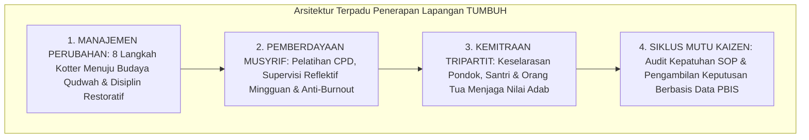

# P2-07-05-Sintesis-Implementation-Principles-TUMBUH

## Tujuan
Menyintesiskan seluruh prinsip penerapan lapangan (*Implementation Principles*)—mencakup Manajemen Perubahan Budaya, Pembinaan Musyrif, Kemitraan Tripartit Orang Tua, dan Siklus Penjaminan Mutu PDCA—serta mendeklarasikan penyelesaian tuntas seluruh **Project 2 Principles**.

---

## 1. Arsitektur Sintesis Implementasi Lapangan

---

## 2. Deklarasi Kelayakan Mutu Project 2 Principles

Dengan terselesaikannya 7 sub-domain dalam **`02 Principles`** (total 42 berkas):
1. **01 Core Principles** (7 Pilar Inti TUMBUH) $\rightarrow$ 🌟 **STATUS A+**
2. **02 Design Principles** (Desain Sistem & Asrama) $\rightarrow$ 🌟 **STATUS A+**
3. **03 Learning Principles** (Psikologi Belajar & Mutqin) $\rightarrow$ 🌟 **STATUS A+**
4. **04 Development Principles** (Perkembangan Remaja & SEL) $\rightarrow$ 🌟 **STATUS A+**
5. **05 Assessment Principles** (Asesmen Autentik & Rubrik) $\rightarrow$ 🌟 **STATUS A+**
6. **06 Intervention Principles** (PBIS Multi-Tier & Restoratif) $\rightarrow$ 🌟 **STATUS A+**
7. **07 Implementation Principles** (Tata Kelola & Mutu Kaizen) $\rightarrow$ 🌟 **STATUS A+**

---

## 3. Status Dokumen
* **Status**: ✅ **SELESAI (Status Mutu: A+)**
* **Level**: Subproject Induk
* **Project**: `02 Principles`
* **Subproject**: `07 Implementation Principles`
* **Langkah Berikutnya**: Melanjutkan ke domain utama berikutnya dalam ekosistem TUMBUH: **`03 Capacity Framework`**.
