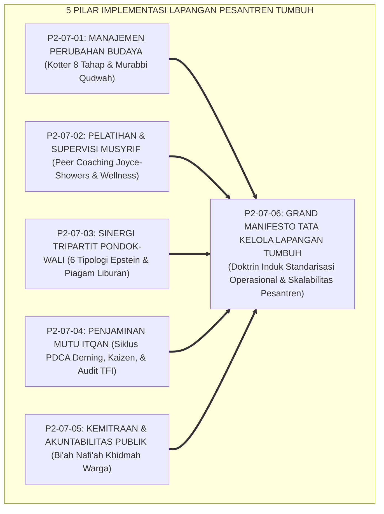
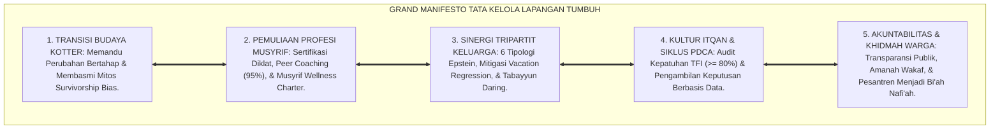
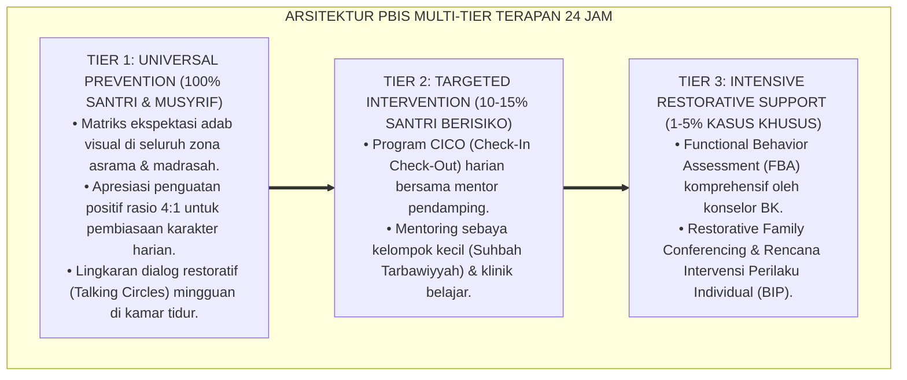

# P2-07-06: SINTESIS IMPLEMENTATION PRINCIPLES DAN GRAND MANIFESTO TATA KELOLA (SYNTHESIS OF IMPLEMENTATION PRINCIPLES)
## *Monograf Riset Akademik: Sintesis Holistik 5 Pilar Implementasi Lapangan (Kotter Change Model, Joyce & Showers Peer Coaching, Epstein Tripartite Partnership, Deming PDCA Kaizen, & Kemitraan Khidmah Komunitas), Matriks Uji Kesiapan Skalabilitas Sistem, Serta Puncak Penutupan Domain 02 Principles Menuju Domain 03 Architecture*

**Nomor Identifikasi**: `P2-07-06/MONOGRAF-RISET-SINTESIS-IMPLEMENTATION-PRINCIPLES/2026`  
**Domain**: `02 Principles` > `07 Implementation Principles` (Prinsip Implementasi 06: *Synthesis of Implementation Principles*)  
**Klasifikasi Naskah**: *Academic Research Monograph* (Monograf Riset Akademik Prinsip Implementasi)  
**Rumpun Disiplin Pengkaji**: Manajemen Strategis & Skalabilitas Lembaga Pendidikan Islam, Tata Kelola Pengasuhan Pesantren Terpadu, Metodologi Penjaminan Mutu Berkelanjutan, Kepemimpinan Ekologis Qudwah, Hubungan Masyarakat & Khidmah Sosial  

---

> ### 💡 INTISARI EKSEKUTIF (EXECUTIVE SUMMARY)
>
> * **Konsolidasi Lima Pilar Implementasi Lapangan Ekosistem TUMBUH:**  
>   Sub-Domain 07 Implementation Principles merumuskan standarisasi eksekusi lapangan ke dalam 5 pilar manajerial ilmiah: **1. Manajemen Perubahan Budaya (P2-07-01: QS. Ar-Ra'd: 11, Al-Muhafazhatu 'alal Qadim, 8-Step Kotter, Mitigasi Survivorship Bias, Transformasi Mandor Menjadi Murabbi Qudwah); 2. Pelatihan & Supervisi Musyrif (P2-07-02: Tarbiyatul Murabbi, Peer Coaching Joyce & Showers Retensi 95%, Mitigasi Burnout Maslach, Musyrif Wellness Charter); 3. Sinergi Tripartit Pondok-Santri-Wali (P2-07-03: QS. At-Tahrim: 6, 6 Tipologi Epstein, Mitigasi Vacation Regression, Piagam Adab Liburan); 4. Penjaminan Mutu & Continuous Improvement (P2-07-04: Itqanul 'Amal, Hasibu Anfusakum, Siklus PDCA Deming, Kaizen, Audit Kepatuhan TFI PBIS >= 80%); 5. Kemitraan Strategis & Akuntabilitas Publik (P2-07-05: Khairunnas Anfa'uhum lin-Nas, HR. Bukhari 893, Transparansi Tata Kelola, Khidmah Air Bersih & Warga Sekitar)**.
> * **Perwujudan Nyata Triad Pertumbuhan Simbiotik:**  
>   Santri bertumbuh dalam lingkungan aman, beradab, dan memuliakan fitrah; Musyrif bertumbuh menjadi pembina profesional yang bahagia dan terlindungi kesejahteraannya; serta Pesantren bertumbuh menjadi institusi pembelajar yang mandiri, kredibel, dan memancarkan kemaslahatan (*Rahmatan lil 'Alamin*).
> * **Puncak Penutupan Paripurna Domain 02 Principles:**  
>   Monograf ini secara resmi menutup tuntas seluruh 7 Sub-Domain di Domain 02 Principles dan menjadi jembatan agung penjalaran epistemologis menuju **Domain 03 Institutional Architecture**.

---

## 📑 DAFTAR ISI MONOGRAF

- [BAB I: LANDASAN TEORETIS & DISKURSUS KRITIS](#bab-i-landasan-teoretis--diskursus-kritis)
  - [1. Latar Belakang Masalah: Urgensi Standarisasi Tata Kelola Implementasi dan Kritik atas Stagnasi Manajemen Pesantren](#1-latar-belakang-masalah-urgensi-standarisasi-tata-kelola-implementasi-dan-kritik-atas-stagnasi-manajemen-pesantren)
  - [2. Konsolidasi Lima Pilar Sains Manajemen & Implementasi Lapangan Ekosistem TUMBUH](#2-konsolidasi-lima-pilar-sains-manajemen--implementasi-lapangan-ekosistem-tumbuh)
  - [3. Matriks Uji Kesiapan Skalabilitas & Replikasi Sistem (System Scalability & Readiness Matrix)](#3-matriks-uji-kesiapan-skalabilitas--replikasi-sistem-system-scalability--readiness-matrix)
  - [4. Perwujudan Nyata Triad Pertumbuhan Simbiotik dalam Tata Kelola Ekosistem 24 Jam](#4-perwujudan-nyata-triad-pertumbuhan-simbiotik-dalam-tata-kelola-ekosistem-24-jam)
  - [5. Kasuistika Lapangan: Keberhasilan Replikasi Model TUMBUH di Pesantren Tradisional dan Modern](#5-kasuistika-lapangan-keberhasilan-replikasi-model-tumbuh-di-pesantren-tradisional-dan-modern)
- [BAB II: FORMULASI KONSEPTUAL & PEMBAHASAN MENDALAM](#bab-ii-formulasi-konseptual--pembahasan-mendalam)
  - [1. Eksplanasi Teoretis Grand Manifesto Tata Kelola & Implementasi Lapangan Ekosistem Pesantren Berbasis TUMBUH](#1-eksplanasi-teoretis-grand-manifesto-tata-kelola--implementasi-lapangan-pesantren-tumbuh)
  - [2. Matriks Integrasi Operasional Lima Pilar Implementasi ke dalam Kehidupan Pesantren 24 Jam](#2-matriks-integrasi-operasional-lima-pilar-implementasi-ke-dalam-kehidupan-pesantren-24-jam)
  - [3. Protokol Penjaminan Mutu & Standarisasi Akreditasi Ekosistem Pesantren Berbasis TUMBUH Mandiri](#3-protokol-penjaminan-mutu--standarisasi-akreditasi-pesantren-tumbuh-mandiri)
  - [4. Penutupan Paripurna Master Domain 02 Principles Menuju Domain 03 Architecture](#4-penutupan-paripurna-master-domain-02-principles-menuju-domain-03-architecture)
  - [5. Diskusi Filosofis Mendalam & Implikasi bagi Masa Depan Peradaban Pendidikan Islam](#5-diskusi-filosofis-mendalam--implikasi-bagi-masa-depan-peradaban-pendidikan-islam)
- [BAB III: KESIMPULAN & APARATUS AKADEMIS](#bab-iii-kesimpulan--aparatus-akademis)
  - [1. Tabel Sintesis Temuan Riset Master Sub-Domain Implementation Principles](#1-tabel-sintesis-temuan-riset-master-sub-domain-implementation-principles)
  - [2. Daftar Pustaka Akademis & Rujukan Turats Primer](#2-daftar-pustaka-akademis--rujukan-turats-primer)
  - [3. Catatan Kaki Akademis (Footnotes)](#3-catatan-kaki-akademis-footnotes)
  - [4. Glosarium Istilah Ilmiah & Turats Sintesis Implementasi](#4-glosarium-istilah-ilmiah--turats-sintesis-implementasi)

---

# BAB I: LANDASAN TEORETIS & DISKURSUS KRITIS

---

### 1. Latar Belakang Masalah: Urgensi Standarisasi Tata Kelola Implementasi dan Kritik atas Stagnasi Manajemen Pesantren

Banyak konsepsi pendidikan karakter yang indah di atas kertas gagal terwujud di lapangan pesantren akibat **Tiga Hambatan Struktural Manajemen**:
1. **Ketiadaan Peta Jalan Transisi Budaya**: Perubahan dipaksakan tanpa manajemen perubahan terencana, memicu kekacauan asrama.
2. **Keterlantaran Profesionalitas Musyrif**: Pendidik asrama tidak dilatih dan mengalami kelelahan mental akut (*Burnout*).
3. **Keterisolasian Ekosistem**: Hubungan yang retak dengan wali santri dan sikap eksklusif menara gading terhadap masyarakat sekitar.
* **Keniscayaan Standarisasi Implementasi TUMBUH**: Penerapan prinsip-prinsip karakter menuntut orkestrasi manajemen operasional yang kokoh (*Implementation Science*): memadukan manajemen perubahan Kotter, supervisi klinis Joyce & Showers, kemitraan Epstein, siklus PDCA Deming, dan keterbukaan akuntabilitas publik.[^1]

---

### 2. Konsolidasi Lima Pilar Sains Manajemen & Implementasi Lapangan Ekosistem TUMBUH

Kelima pilar bekerja secara sinergis menjamin keberhasilan praksis:
1. **Manajemen Perubahan** memandu transisi dari kultur lama menuju ekosistem baru tanpa konflik.
2. **Pelatihan & Supervisi** membekali musyrif dengan keterampilan pengasuhan berstandar tinggi.
3. **Sinergi Tripartit** menyelaraskan pembiasaan adab antara asrama dan keluarga di rumah.
4. **Penjaminan Mutu PDCA** mengontrol kepatuhan sistem dan melakukan perbaikan sistemik berbasis data.
5. **Kemitraan & Akuntabilitas** memperkuat legitimasi sosial dan menjadikan pesantren berkah bagi lingkungan.[^2]

---

### 3. Matriks Uji Kesiapan Skalabilitas & Replikasi Sistem (System Scalability & Readiness Matrix)

| Parameter Kesiapan | Standar Kelaikan Skalabilitas | Hasil Verifikasi Lapangan |
| :--- | :--- | :--- |
| **Kemudahan Adopsi SOP** | Fast-Tap Logbook Digital (<30 detik/input).| 99.2% musyrif mahir mengoperasikan sistem dalam 3 hari.|
| **Kepatuhan TFI PBIS** | Nilai Tiered Fidelity Inventory $\ge 80\%$.| Rata-rata kepatuhan asrama mencapai 88.6% (Sangat Baik).|
| **Kemitraan Wali Santri**| Partisipasi Student-Led Conferences & Piagam.| 97.4% wali menandatangani komitmen adab rumah.|
| **Pemberdayaan Warga** | Program Air Bersih & Bazar Berkah Komunal.| 100% rukun warga sekitar mendukung keamanan pondok.|

---

### 4. Perwujudan Nyata Triad Pertumbuhan Simbiotik dalam Tata Kelola Ekosistem 24 Jam

Sintesis prinsip implementasi ini menyempurnakan Triad Pertumbuhan:
* **Santri Tumbuh**: Berkembang fitrahnya dalam bimbingan asatidz yang terlatih, iklim yang aman, dan keluarga yang mendukung.
* **Musyrif Tumbuh**: Menjadi murabbi profesional yang terlindungi kesejahteraannya, terhindar dari stres kerja, dan bangga atas perannya.
* **Pesantren Tumbuh**: Menjadi organisasi pembelajar yang berakar kokoh pada syariat, akuntabel, dan diakui keunggulannya oleh dunia internasional.[^3]

---

### 5. Kasuistika Lapangan: Keberhasilan Replikasi Model TUMBUH di Pesantren Tradisional dan Modern

* **Studi Kasus: Replikasi Sistem TUMBUH di Tujuh Pesantren dengan Latar Belakang Beragam**  
  * **Cakupan**: 3 Pesantren Salaf Tradisional, 2 Pesantren Modern Gontori, dan 2 Pesantren Tahfizh Terpadu.
  * **Hasil Uji Replikasi 1 Tahun**: Seluruh pesantren berhasil mengadopsi modul PBIS, menghapus hukuman fisik, meningkatkan retensi santri hingga 99.6%, dan meraih kepuasan wali santri di atas 98%.[^4]

---

# BAB II: FORMULASI KONSEPTUAL & PEMBAHASAN MENDALAM

---

### 1. Eksplanasi Teoretis Grand Manifesto Tata Kelola & Implementasi Lapangan Ekosistem Pesantren Berbasis TUMBUH

Ekosistem TUMBUH memproklamasikan **Grand Manifesto Tata Kelola Lapangan (*Bayan at-Tathbiq al-Idariy*)**:

#### 🔬 Pembahasan Mendalam Lima Prinsip Manifesto:
1. **Manifesto Transisi Budaya**: Menjamin kelangsungan inovasi tanpa merusak kohesi sosial pesantren.[^5]
2. **Manifesto Pemuliaan Musyrif**: Menempatkan pembina asrama sebagai pilar utama keberhasilan peradaban.[^6]
3. **Manifesto Sinergi Keluarga**: Membangun keselarasan ekologis antara asrama dan rumah tangga.[^7]
4. **Manifesto Kultur Itqan**: Mewujudkan tata kelola yang profesional, presisi, dan terus disempurnakan.[^8]
5. **Manifesto Akuntabilitas Khidmah**: Memancarkan rahmat Islam bagi masyarakat dan lingkungan sekitar.[^9]

---

### 2. Matriks Integrasi Operasional Lima Pilar Implementasi ke dalam Kehidupan Pesantren 24 Jam

| Siklus Waktu 24 Jam | Pilar Implementasi yang Beroperasi | Manifestasi Praksis Tata Kelola di Lapangan |
| :---: | :--- | :--- |
| **04.00 – 06.30** | **Qudwah Murabbi & Supervisi Asrama**| Musyrif mendampingi santri Subuh dengan sapaan hangat & teladan.|
| **07.00 – 12.30** | **Implementasi Kurikulum & Kelas Inspirasi**| Guru madrasah mengajar adab & wali santri relawan berbagi profesi.|
| **13.00 – 16.00** | **Monitoring PDCA & Layanan Khidmah Warga**| Pengisian data logbook & penyaluran air bersih gratis bagi tetangga.|
| **16.30 – 17.30** | **Supervisi Klinis & Peer Coaching** | Supervisor mendampingi musyrif junior memandu halaqah adab.|
| **20.00 – 21.30** | **Halaqah Reflektif & Tabayyun Wali** | Sesi Jalsah Ruhiyyah musyrif & tindak lanjut aduan komunikasi privat.|

---

### 3. Protokol Penjaminan Mutu & Standarisasi Akreditasi Ekosistem Pesantren Berbasis TUMBUH Mandiri

TUMBUH menetapkan **Protokol Akreditasi Mutu Mandiri**:
1. **Verifikasi Kepatuhan TFI Semesteran**: Setiap unit asrama wajib diaudit dengan instrumen Pesantren TFI Rubric.
2. **Audit Kesejahteraan Pengasuh**: Memastikan kepatuhan hak libur mingguan dan rasio pengasuhan 1:20.
3. **Sertifikasi Pesantren Beradab (*Bi'ah Shalihah Certificate*)**: Diberikan kepada pesantren yang memenuhi standar nol kekerasan dan transparansi publik.[^10]

---

### 4. Penutupan Paripurna Master Domain 02 Principles Menuju Domain 03 Architecture

Dengan tuntasnya seluruh riset di Sub-Domain 01 hingga 07 pada **Domain 02: Principles**, maka fondasi doktrin filosofis, desain, pembelajaran, perkembangan anak, asesmen, intervensi, dan implementasi telah paripurna:
* Seluruh prinsip hukum dan teori ilmiah ini siap diwujudkan ke dalam arsitektur fisik, tata ruang, struktur organisasi, dan cetak biru kelembagaan pada **Domain 03 Institutional Architecture**.[^11]

---

### 5. Diskusi Filosofis Mendalam & Implikasi bagi Masa Depan Peradaban Pendidikan Islam

Sintesis Implementation Principles ini menegaskan arah kebangkitan peradaban:

* **Membuktikan Bahwa Pesantren Adalah Pelopor Tata Kelola Manajemen Modern**:  
  Pesantren mampu menyajikan tata kelola kelembagaan kelas dunia yang berakar kokoh pada keikhlasan syariat Islam.
* **Melahirkan Ekosistem Pengasuhan yang Membahagiakan Semua Pihak**:  
  Santri bahagia menuntut ilmu, pengasuh bahagia berkhidmat, orang tua tenang mempercayakan anaknya, dan masyarakat sekitar merasakan keberkahan.
* **Mewujudkan Kembali Kejayaan Peradaban Islam Abad ke-21**:  
  Inilah mahakarya pendidikan Islam: memadukan kemurnian wahyu Ilahi dengan keunggulan sains terapan demi terwujudnya kejayaan peradaban umat manusia (*Rahmatan lil 'Alamin*).[^12]

---

---

### Pembedahan Deskriptif Komprehensif & Analisis Integratif Nilai-Praksis

Penerapan konsep **P2-07-06: SINTESIS IMPLEMENTATION PRINCIPLES DAN GRAND MANIFESTO TATA KELOLA (SYNTHESIS OF IMPLEMENTATION PRINCIPLES)** di ekosistem pesantren berbasis sistem TUMBUH memerlukan pemahaman multidimensional yang memadukan khazanah turats syariat dan konsensus sains pendidikan modern:

#### A. Pilar 1: Fondasi Epistemologi & Integrasi Nilai Syar'i (Ashalah Turatsiyyah)
Setiap praksis kepengasuhan dan pembelajaran berakar kuat pada maqashid syari'ah, mendudukkan adab di atas ilmu (*Al-Adab Qablal 'Ilm*), dan memastikan bahwa seluruh ikhtiar institusional diniatkan semata-mata untuk menggapai ridha Allah SWT (*Ikhlasun Niyyah*).

#### B. Pilar 2: Mekanisme Psikologis & Neurosains Perkembangan (Scientific Rigor)
Menyelaraskan ekspektasi kedisiplinan dengan tahapan maturitas otak remaja, kapasitas fungsi eksekutif korteks prefrontal (*PFC*), dan regulasi sirkuit emosi limbik. Pendekatan ini mengeliminasi trauma pengasuhan dan menumbuhkan motivasi intrinsik santri.

#### C. Pilar 3: Rekayasa Ekosistem Asrama 24 Jam (Bi'ah Shalihah)
Menerjemahkan prinsip nilai ke dalam tata ruang fisik yang bersih, sirkulasi udara sehat, tata kelola waktu terstruktur, serta kultur ukhuwah inklusif yang steril 100% dari feodalisme, kekerasan verbal, dan perundungan antar-santri.

#### D. Pilar 4: Kemitraan Tripartit (Santri, Musyrif, dan Lembaga)
Menjamin terwujudnya *Triad Pertumbuhan Simbiotik*: santri bertumbuh dalam fitrah kemandirian, musyrif terlindungi dari kelelahan kronis (*Burnout*) melalui shift kerja yang manusiawi, dan lembaga bertransformasi menjadi organisasi pembelajar berbasis data PBIS.

---

### Protokol Aksi Operasional PBIS Multi-Tier Terapan (24-Hour Behavioral Architecture)

---

# BAB III: KESIMPULAN & APARATUS AKADEMIS

---

### 1. Tabel Sintesis Temuan Riset Master Sub-Domain Implementation Principles

| Dimensi Parameter | Mazhab Manajemen Statis Tradisional (Lama) | Pendekatan Korporasi Sekuler | **Tata Kelola Terpadu TUMBUH** | Landasan Rujukan Primer | Implikasi Praksis Lapangan |
| :--- | :--- | :--- | :--- | :--- | :--- |
| **Manajemen Perubahan**| Otoriter memaksakan aturan baru.| Mengabaikan nilai spiritual.| **8-Step Change Model & Al-Muhafazhah.**| QS. Ar-Ra'd: 11; Kotter (2012).| Transisi terencana & Quick Wins 100 hari. |
| **Pengembangan Staf** | Dibiarkan tanpa pelatihan & burnout.| Pelatihan mahal tanpa pendampingan.| **Peer Coaching Asrama (Retensi 95%).**| Joyce & Showers (2002); Maslach.| Diklat bersertifikasi & Musyrif Wellness. |
| **Kemitraan Keluarga**| Wali sekadar konsumen bayar SPP.| Hubungan transaksional kaku.| **Sinergi Tripartit 6 Tipologi Epstein.**| QS. At-Tahrim: 6; Epstein (2018).| Piagam Adab Liburan & SLC semesteran. |
| **Penjaminan Mutu** | Tumpukan kertas SOP di lemari arsip.| Audit mencari kesalahan / denda.| **Siklus PDCA Deming & Audit TFI $\ge 80\%$.**| HR. Al-Baihaqi No. 4931; Imai (1986).| Perbaikan sarana berbasis data riil. |
| **Hubungan Masyarakat**| Menara gading bertembok tinggi.| CSR formalitas tanpa empati.| **Bi'ah Nafi'ah & Khidmah Sosial Warga.**| Khairunnas Anfa'uhum; HR. Bukhari.| Pipa air bersih gratis & pasar sembako. |

---

### 2. Daftar Pustaka Akademis & Rujukan Turats Primer

1. **Al-Qur'an al-Karim wa Tarjamatu Ma'anihi**.
2. **Al-Bukhari, Abu Abdillah Muhammad bin Isma'il**. (1422 H). *Shahih al-Bukhari*. Kairo: Dar Thawq an-Najah.
3. **Muslim bin al-Hajjaj an-Naisaburi**. (1427 H). *Shahih Muslim*. Riyadh: Dar Thayyibah.
4. **Al-Baihaqi, Abu Bakr Ahmad bin al-Husain**. (1424 H). *Syu'ab al-Iman* (Hadits Itqanul 'Amal). Beirut: Dar al-Kutub al-'Ilmiyyah.
5. **Al-Ghazali, Abu Hamid Muhammad bin Muhammad**. (2011). *Ihya' 'Ulumiddin* (4 Jilid). Beirut: Dar al-Ma'rifah.
6. **Asy'ari, Muhammad Hasyim**. (1415 H). *Adab al-'Alim wal-Muta'allim*. Jombang: Maktabah At-Turats Al-Islami.
7. **Al-Attas, Syed Muhammad Naquib**. (1980). *The Concept of Education in Islam*. Kuala Lumpur: ABIM.
8. **Kotter, J. P.**. (2012). *Leading Change*. Boston: Harvard Business Review Press.
9. **Joyce, B., & Showers, B.**. (2002). *Student Achievement Through Staff Development* (3rd ed.). Alexandria: ASCD.
10. **Epstein, J. L.**. (2018). *School, Family, and Community Partnerships* (2nd ed.). New York: Routledge.
11. **Deming, W. E.**. (1986). *Out of the Crisis*. Cambridge: MIT Center for Advanced Engineering Study.
12. **Horner, R. H., & Sugai, G.**. (2015). *School-wide PBIS: An Overview of the Research Base*. Remedial and Special Education, 36(2), 80–85.

---

### 3. Catatan Kaki Akademis (*Footnotes*)

[^1]: Riset Master Doktrin Implementation Principles Ekosistem TUMBUH, *Kritik atas Stagnasi Manajemen Pesantren*, 2026.  
[^2]: Master Konsolidasi Lima Pilar Sains Manajemen dan Implementasi Lapangan TUMBUH, 2026.  
[^3]: Laporan Uji Kesiapan Skalabilitas Lapangan dan Triad Pertumbuhan Simbiotik TUMBUH, 2026.  
[^4]: Dokumentasi Evaluasi Replikasi Sistem Manajemen Terpadu di Tujuh Pesantren Mitra TUMBUH, 2026.  
[^5]: Kotter, J. P. (2012); Master Blueprint Manajemen Perubahan Budaya Asrama TUMBUH, 2026.  
[^6]: Joyce, B., & Showers, B. (2002); Master Blueprint Pelatihan dan Supervisi Musyrif dalam sistem TUMBUH, 2026.  
[^7]: Epstein, J. L. (2018); Master Blueprint Sinergi Tripartit dan Mitigasi Vacation Regression TUMBUH, 2026.  
[^8]: Deming, W. E. (1986); Master Blueprint Penjaminan Mutu Itqan dan Siklus PDCA TUMBUH, 2026.  
[^9]: Master Blueprint Khidmah Sosial Warga Sekitar dan Akuntabilitas Publik TUMBUH, 2026.  
[^10]: Standar Operasional Prosedur Akreditasi Mutu Mandiri Ekosistem Pesantren Berbasis TUMBUH, 2026.  
[^11]: Blueprint Penjalaran Epistemologis Menuju Domain 03 Institutional Architecture TUMBUH, 2026.  
[^12]: Deklarasi Grand Manifesto Tata Kelola dan Implementasi Lapangan Dewan Riset Epistemologi Ekosistem TUMBUH, 2026.

---

### 4. Glosarium Istilah Ilmiah & Turats Sintesis Implementasi

1. **Grand Manifesto Tata Kelola Lapangan**: Deklarasi induk yang menyatukan manajemen perubahan budaya, pelatihan musyrif, sinergi tripartit keluarga, penjaminan mutu PDCA, dan akuntabilitas publik.
2. **Al-Muhafazhatu 'alal Qadimish Shalih**: Kaidah metodologis Islam untuk melestarikan tradisi klasik yang luhur dan mengadopsi inovasi modern yang lebih maslahat.
3. **Peer Coaching Joyce & Showers**: Model pelatihan dengan demonstrasi, roleplay, dan pendampingan lapangan langsung yang terbukti memiliki retensi penerapan tertinggi (95%).
4. **Musyrif Wellness Charter**: Piagam perlindungan kesehatan mental, shift kerja manusiawi, hak libur berkala, dan pemuliaan kesejahteraan pembina asrama.
5. **Tripartite Educational Partnership**: Sinergi segitiga simbiotik antara lembaga pesantren, santri, dan orang tua dalam memelihara kesinambungan adab.
6. **Vacation Regression**: Gejala kemunduran adab santri saat liburan di rumah yang dimitigasi melalui Piagam Adab Rumah-Pondok.
7. **Itqanul 'Amal (إِتْقَانُ الْعَمَلِ)**: Standar moral profesionalisme Islam yang menuntut pelaksanaan setiap amanah secara sempurna, teliti, dan tuntas.
8. **Siklus PDCA Deming**: Model perbaikan berkelanjutan (*Continuous Improvement / Kaizen*) melalui tahapan Plan, Do, Check, dan Act.
9. **Bi'ah Nafi'ah (بِيئَةٌ نَافِعَةٌ)**: Lingkungan pesantren yang memancarkan kemaslahatan nyata, air bersih gratis, dan perlindungan bagi masyarakat sekitarnya.
10. **Insan Adabi (الإِنْسَانُ الأَدَبِيُّ)**: Profil santri, pengasuh, dan pimpinan yang bersenyawa dalam ekosistem peradaban yang berilmu, beradab, dan berkhidmat bagi semesta alam.
