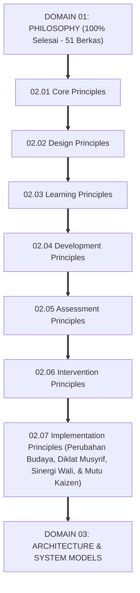
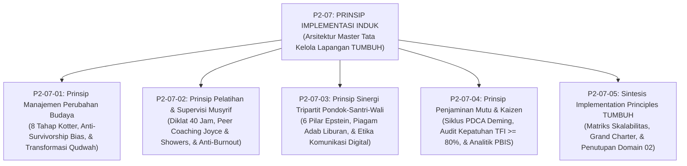
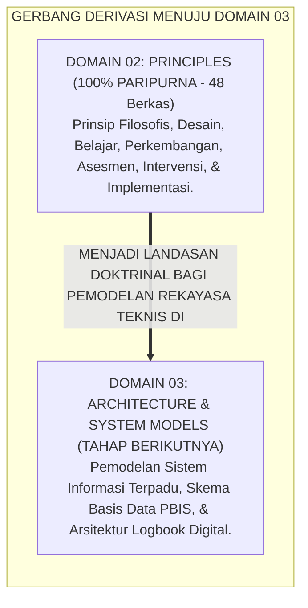

# P2-07: IMPLEMENTATION PRINCIPLES (PRINSIP IMPLEMENTASI LAPANGAN) EKOSISTEM TUMBUH
## *Monograf Induk Sub-Domain 07: Arsitektur Master Tata Kelola, Manajemen Perubahan, Supervisi Musyrif, Sinergi Wali, & Penjaminan Mutu Pesantren 24 Jam, Rekapitulasi 4 Pilar Implementasi, serta Puncak Penutupan Domain 02 Principles Menuju Domain 03 Architecture*

**Nomor Identifikasi**: `P2-07/MONOGRAF-INDUK-IMPLEMENTATION-PRINCIPLES/2026`  
**Domain**: `02 Principles` > `07 Implementation Principles`  
**Klasifikasi Naskah**: *Master Sub-Domain Monograph* (Monograf Induk Sub-Domain Prinsip Implementasi & Tata Kelola Lapangan)  
**Rumpun Disiplin Pengkaji**: Tata Kelola Manajemen Pendidikan Pesantren Terpadu, Manajemen Perubahan Budaya Islam (*Change Management*), Supervisi Klinis Pengasuhan Asrama, Total Quality Management Kaizen  

---

> ### 💡 INTISARI PRAKTIS (3 MENIT PAHAM UNTUK ASATIDZ & MUSYRIF)
>
> * **Posisi Sub-Domain 07 Implementation Principles:**  
>   Menjawab pertanyaan mendasar ketujuh dalam ekosistem pesantren: *"Bagaimanakah mengoperasionalkan, mengelola perubahan budaya, melatih tenaga musyrif, menyinergikan orang tua, dan menjamin mutu pelaksanaan seluruh sistem TUMBUH di lapangan asrama 24 jam secara terukur, akuntabel, dan berkelanjutan (Itqanul 'Amal), sehingga terbebas dari formalitas kertas dan resistensi internal?"*
> * **Empat Pilar Implementasi Lapangan Ekosistem TUMBUH yang Terintegrasi:**  
>   1. **P2-07-01 (Manajemen Perubahan Budaya):** Memandu transisi budaya dari koersif menjadi restoratif lewat 8 Tahap Model Kotter dan membasmi mitos *Survivorship Bias*.  
>   2. **P2-07-02 (Pelatihan & Supervisi Musyrif):** Menegakkan diklat 40 jam bersertifikasi, *Peer Coaching* di asrama (retensi 95%), dan melindungi kesehatan mental pengasuh.  
>   3. **P2-07-03 (Sinergi Tripartit Pondok-Santri-Wali):** Menerapkan 6 Pilar Kemitraan Epstein, Piagam Adab Liburan (*Anti-Vacation Regression*), dan etika komunikasi digital.  
>   4. **P2-07-04 (Penjaminan Mutu & Kaizen):** Menjalankan siklus mutu PDCA bulanan, audit kepatuhan TFI ($\ge 80\%$), dan pengambilan keputusan berbasis data PBIS.
> * **Puncak Penutupan Paripurna Domain 02 Principles:**  
>   Menjadi kulminasi penyempurnaan seluruh 7 sub-domain filosofis-operasional di bawah **Domain 02: Principles** dan mengantarkan repositori menuju perumusan **Domain 03: Architecture & System Models**.

---

## 📑 DAFTAR ISI MONOGRAF INDUK

- [BAGIAN I: ARSITEKTUR ONTOLOGIS & POHON HUBUNGAN SUB-DOMAIN 07](#bagian-i-arsitektur-ontologis--pohon-hubungan-sub-domain-07)
  - [1. Posisi Dokumen dalam Taksonomi 11 Domain TUMBUH](#1-posisi-dokumen-dalam-taksonomi-11-domain-tumbuh)
  - [2. Pohon Hubungan Antar-Monograf Sub-Domain 07 Implementation Principles](#2-pohon-hubungan-antar-monograf-sub-domain-07-implementation-principles)
  - [3. Rangkuman 4 Pilar Implementasi Lapangan Pesantren](#3-rangkuman-4-pilar-implementasi-lapangan-pesantren)
  - [4. Penegasan Triad Pertumbuhan Simbiotik dalam Implementasi](#4-penegasan-triad-pertumbuhan-simbiotik-dalam-implementasi)
- [BAGIAN II: KODIFIKASI MATRIKS RESMI & DIREKTORI MONOGRAF TERPADU](#bagian-ii-kodifikasi-matriks-resmi--direktori-monograf-terpadu)
  - [1. Matriks Rujukan Lengkap 5 Berkas Monograf Sub-Domain 07](#1-matriks-rujukan-lengkap-5-berkas-monograf-sub-domain-07)
  - [2. Gerbang Derivasi Menuju Domain 03 Architecture & System Models](#2-gerbang-derivasi-menuju-domain-03-architecture--system-models)
- [BAGIAN III: APARATUS AKADEMIS & APENDIKS](#bagian-iii-aparatus-akademis--apendiks)
  - [1. Daftar Pustaka Otoritatif Turats & Sains Global](#1-daftar-pustaka-otoritatif-turats--sains-global)
  - [2. Catatan Kaki Akademis (Footnotes)](#2-catatan-kaki-akademis-footnotes)
  - [3. Glosarium Istilah Kunci Implementasi Lapangan Induk](#3-glosarium-istilah-kunci-implementasi-lapangan-induk)

---

# BAGIAN I: ARSITEKTUR ONTOLOGIS & POHON HUBUNGAN SUB-DOMAIN 07

---

### 1. Posisi Dokumen dalam Taksonomi 11 Domain TUMBUH

Jika sub-domain sebelumnya mendefinisikan desain, pembelajaran, perkembangan, asesmen, dan intervensi, maka **Sub-Domain 07 Implementation Principles** menetapkan **Bagaimana Seluruh Sistem Tersebut Dikelola, Dilatihkan, Disupervisi, dan Dijamin Mutunya di Lapangan Asrama 24 Jam**:

---

### 2. Pohon Hubungan Antar-Monograf Sub-Domain 07 Implementation Principles

Sub-Domain `07 Implementation Principles` memuat 1 Monograf Induk dan 5 Monograf Riset Khusus yang saling menopang secara utuh:

---

### 3. Rangkuman 4 Pilar Implementasi Lapangan Pesantren

1. **Pilar 1: Manajemen Perubahan Budaya (P2-07-01)**:  
   Menegakkan kaidah sunnatullah *Taghyirul Anfus* (QS. Ar-Ra'd: 11) dan *Al-Muhafazhatu 'alal Qadimish Shalih wal Akhdzu bil Jadidil Ashlah*. Mengimplementasikan 8 Tahapan Model John Kotter, membasmi mitos *Survivorship Bias*, dan mentransformasikan identitas musyrif mandor menjadi *Murabbi In Loco Parentis*.
2. **Pilar 2: Pelatihan & Supervisi Musyrif (P2-07-02)**:  
   Menegakkan kaidah *Tarbiyatul Murabbi Qabla Tarbiyatis Santri* dan wasiat Umar bin Abdul Aziz. Mewajibkan diklat 40 jam bersertifikasi, *Peer Coaching* langsung di asrama Joyce & Showers (retensi 95%), serta menegakkan Piagam Perlindungan Kesejahteraan dan Anti-Burnout Pengasuh.
3. **Pilar 3: Sinergi Tripartit Pondok-Santri-Wali (P2-07-03)**:  
   Menegakkan amanah pengasuhan (QS. At-Tahrim: 6 & Hadits *Kullukum Ra'in*). Mengoperasikan 6 Tipe Keterlibatan Keluarga Joyce Epstein, merumuskan Piagam Komitmen Adab Liburan guna mencegah *Vacation Regression*, dan menata etika komunikasi digital via Tabayyun privat.
4. **Pilar 4: Penjaminan Mutu & Kaizen (P2-07-04)**:  
   Menegakkan doktrin *Itqanul 'Amal* (HR. Al-Baihaqi No. 4931) dan atsar hisab diri Sayyidina Umar RA. Mengoperasikan siklus mutu PDCA Deming & Kaizen bulanan, menguji kepatuhan sistem via *Tiered Fidelity Inventory (TFI PBIS $\ge 80\%$)*, dan menyelenggarakan Audit Mutu Internal yang memberdayakan.[^1]

---

### 4. Penegasan Triad Pertumbuhan Simbiotik dalam Implementasi

* **Santri Tumbuh**: Mendapatkan lingkungan asrama yang aman, beradab, berkeadilan, dan diasuh oleh murabbi yang berjiwa stabil penuh kasih sayang.
* **Musyrif Tumbuh**: Terlindungi hak-hak kesejahteraannya, terampil membimbing secara profesional melalui *coaching*, dan bahagia menjalankan tugas khidmah mulia.
* **Pesantren Tumbuh**: Memiliki sistem tata kelola modern berbasis data yang akuntabel, dipercaya penuh oleh masyarakat, dan menjadi pusat rujukan peradaban Islam.

---

# BAGIAN II: KODIFIKASI MATRIKS RESMI & DIREKTORI MONOGRAF TERPADU

---

### 1. Matriks Rujukan Lengkap 5 Berkas Monograf Sub-Domain 07

| Kode Berkas | Judul Naskah Monograf | Dewan Keilmuan Pengkaji | Tautan Berkas Markdown |
| :---: | :--- | :--- | :--- |
| **P2-07-01** | **Prinsip Manajemen Perubahan Budaya Pesantren** | `pakar-tata-kelola-qudwah` `pakar-filosofi-tumbuh` `pakar-psikologi-sosial-santri` | [**`Buka Naskah P2-07-01`**](./P2-07-01-Prinsip-Manajemen-Perubahan-Budaya-Pesantren.md) |
| **P2-07-02** | **Prinsip Pelatihan dan Supervisi Musyrif** | `pakar-pengasuhan-asrama` `pakar-pedagogi-master-guru` `pakar-tata-kelola-qudwah` | [**`Buka Naskah P2-07-02`**](./P2-07-02-Prinsip-Pelatihan-dan-Supervisi-Musyrif.md) |
| **P2-07-03** | **Prinsip Sinergi Tripartit Pondok-Santri-Wali** | `pakar-social-emotional-learning` `pakar-perlindungan-anak-dan-advokasi-santri` `pakar-arsitektur-digital-pesantren` | [**`Buka Naskah P2-07-03`**](./P2-07-03-Prinsip-Sinergi-Tripartit-Pondok-Santri-Wali.md) |
| **P2-07-04** | **Prinsip Penjaminan Mutu dan Continuous Improvement** | `pakar-kritikus-dan-auditor-kualitas` `pakar-pbis` `pakar-metodologi-riset-tumbuh` | [**`Buka Naskah P2-07-04`**](./P2-07-04-Prinsip-Penjaminan-Mutu-dan-Continuous-Improvement.md) |
| **P2-07-05** | **Sintesis Implementation Principles TUMBUH** | `pakar-filosofi-tumbuh` `pakar-kritikus-dan-auditor-kualitas` `pakar-tata-kelola-qudwah` | [**`Buka Naskah P2-07-05`**](./P2-07-05-Sintesis-Implementation-Principles-TUMBUH.md) |

---

### 2. Gerbang Derivasi Menuju Domain 03 Architecture & System Models

---

# BAGIAN III: APARATUS AKADEMIS & APENDIKS

---

### 1. Daftar Pustaka Otoritatif Turats & Sains Global

1. **Al-Qur'an al-Karim wa Tarjamatu Ma'anih**.
2. **Al-Bukhari, Muhammad bin Isma'il**. (1422 H). *Shahih al-Bukhari*. Beirut: Dar Thawq an-Najah.
3. **Muslim bin al-Hajjaj an-Naisaburi**. (1374 H). *Shahih Muslim*. Kairo: Isa al-Babi al-Halabi.
4. **Al-Baihaqi, Abu Bakr Ahmad bin al-Husain**. (1424 H). *Syu'abul Iman*. Riyadh: Maktabah ar-Rusyd.
5. **Al-Ghazali, Abu Hamid Muhammad bin Muhammad**. (2011). *Ihya 'Ulumiddin*. Beirut: Dar al-Ma'rifah.
6. **Kotter, J. P.**. (1996). *Leading Change*. Harvard Business Review Press.
7. **Joyce, B., & Showers, B.**. (2002). *Student Achievement Through Staff Development*. ASCD.
8. **Epstein, J. L.**. (2018). *School, Family, and Community Partnerships*. Routledge.
9. **Deming, W. E.**. (1986). *Out of the Crisis*. MIT Press.
10. **Horner, R. H., & Sugai, G.**. (2015). *School-wide PBIS: The research base*. Remedial and Special Education.

---

### 2. Catatan Kaki Akademis (*Footnotes*)

[^1]: Kotter (1996), *Leading Change*; Joyce & Showers (2002), *Peer Coaching*; Epstein (2018), *Partnerships*; Deming (1986), *Out of the Crisis*.

---

### 3. Glosarium Istilah Kunci Implementasi Lapangan Induk

1. **Implementation Principles**: Kumpulan prinsip metodologis untuk memandu operasionalisasi sistem, pelatihan tenaga pendidik, dan penjaminan mutu di lapangan pesantren 24 jam.
2. **Kotter 8-Step Model**: Kerangka kerja delapan langkah kepemimpinan perubahan organisasi secara terencana dan berkelanjutan.
3. **Peer Coaching**: Pendampingan klinis antar-pengasuh langsung di kamar asrama guna melipatgandakan retensi penguasaan keterampilan hingga 95%.
4. **Six Types of Parent Involvement**: Model kemitraan keluarga Joyce Epstein yang mencakup enam dimensi kolaborasi sekolah-rumah.
5. **Vacation Regression**: Kemunduran kualitas adab dan hafalan santri yang terjadi selama liburan akibat ketiadaan pembiasaan di rumah.
6. **Siklus PDCA**: Model iteratif empat langkah (Plan-Do-Check-Act) untuk perbaikan mutu tata kelola pengasuhan secara berkelanjutan.
7. **Tiered Fidelity Inventory (TFI)**: Instrumen validasi kepatuhan penerapan sistem PBIS di asrama (Target: $\ge 80\%$).
8. **Itqanul 'Amal**: Sikap profesionalisme bekerja dengan standar mutu, kerapian, dan keahlian tertinggi karena Allah SWT.
9. **In Loco Parentis**: Doktrin peran moral pengasuh sebagai figur pengganti orang tua yang mengasuh dengan keteladanan nyata (*Qudwah*).
10. **Triad Pertumbuhan Simbiotik**: Maha-prinsip ekosistem TUMBUH di mana sistem secara serempak menumbuhkan Santri, memuliakan Pendidik, dan memperkokoh Lembaga.
