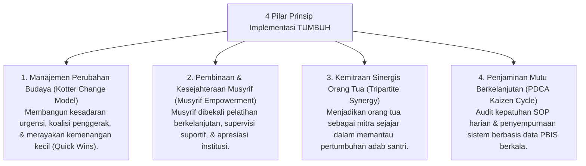

# P2-07-Prinsip-Implementasi-Lapangan-TUMBUH (Implementation Principles Induk)

## Tujuan
Menetapkan prinsip-prinsip penerapan di lapangan (*Implementation Principles*) agar transformasi ekosistem pesantren TUMBUH dapat dieksekusi secara mulus (*seamless*), berkelanjutan, didukung oleh seluruh pemangku kepentingan (Kyai, Asatidz, Musyrif, Santri, Orang Tua), dan menghasilkan dampak nyata yang terukur.

---

## 1. 4 Pilar Prinsip Implementasi Lapangan

---

## 2. Rincian 4 Pilar Implementasi

### 1. Manajemen Perubahan Budaya (*Change Management*)
* Mengubah kebiasaan lama pesantren (dari menghukum fisik menuju disiplin restoratif) menuntut keteladanan pimpinan tertinggi (*Top Leadership Commitment*), sosialisasi bertahap, dan perayaan capaian kecil (*Quick Wins*) untuk membuktikan efektivitas sistem baru.

### 2. Pemberdayaan & Kesejahteraan Musyrif (*Musyrif Empowerment*)
* Musyrif adalah ujung tombak keberhasilan sistem. Mereka tidak boleh dibiarkan bekerja sendiri tanpa bekal.
* Lembaga wajib menyelenggarakan pelatihan rutin (*Continuous Professional Development*), supervisi kesehatan mental, dan beban kerja yang manusiawi.

### 3. Kemitraan Tripartit (Pondok - Santri - Orang Tua)
* Orang tua dilibatkan sejak awal melalui penandatanganan pakta integritas *Disiplin Restoratif*, menerima laporan portofolio adab naratif berkala, dan panduan pembiasaan adab di rumah saat liburan semester.

### 4. Siklus Mutu Berkelanjutan (*Plan-Do-Check-Act / Kaizen*)
* Sistem tidak bersifat kaku/statis. Setiap temuan data perilaku dianalisis dalam rapat koordinasi bulanan untuk menyempurnakan SOP dan rekayasa lingkungan asrama.

---

## 3. Status Dokumen
* **Status**: 🌟 **A+ (Dokumen Induk Implementation Principles)**
* **Level**: Project 2 - `02 Principles / 07 Implementation Principles`
* **Langkah Berikutnya**: **`P2-07-01-Prinsip-Manajemen-Perubahan-Budaya-Pesantren.md`**.
