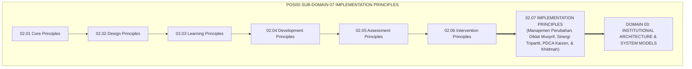
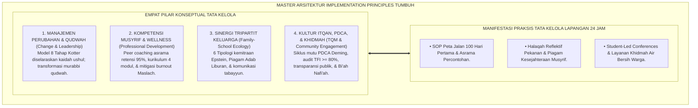
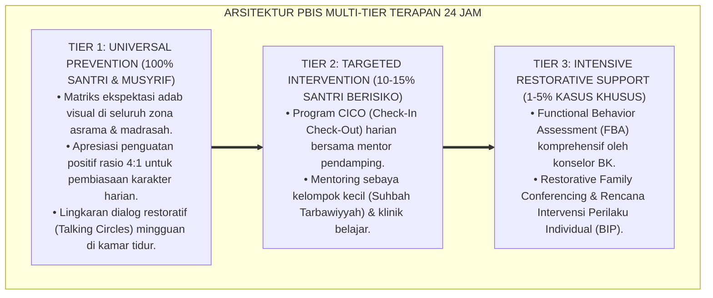

# P2-07: IMPLEMENTATION PRINCIPLES (PRINSIP IMPLEMENTASI LAPANGAN) EKOSISTEM TUMBUH (MASTER DOKTRIN TATA KELOLA EKOSISTEM)
## *Master Sub-Domain Monograph: Arsitektur Master Tata Kelola, Manajemen Perubahan Budaya, Supervisi Musyrif, Sinergi Wali, Penjaminan Mutu PDCA, & Khidmah Masyarakat 24 Jam, Konsolidasi 5 Pilar Implementasi, Serta Puncak Penutupan Domain 02 Principles Menuju Domain 03 Architecture*

**Nomor Identifikasi**: `P2-07/MASTER-MONOGRAF-IMPLEMENTATION-PRINCIPLES/2026`  
**Domain**: `02 Principles` > `07 Implementation Principles` (Master Sub-Domain Monograph)  
**Klasifikasi Naskah**: *Master Sub-Domain Research Monograph* (Dokumen Induk Implementasi & Tata Kelola Lapangan)  
**Rumpun Disiplin Pengkaji**: Tata Kelola Manajemen Pendidikan Pesantren Terpadu, Manajemen Perubahan Budaya Islam (*Change Management*), Supervisi Klinis Pengasuhan Asrama, Total Quality Management Kaizen, Hubungan Lembaga-Masyarakat  

---

> ### 💡 INTISARI EKSEKUTIF (EXECUTIVE SUMMARY)
>
> * **Posisi Sub-Domain 07 Implementation Principles dalam Arsitektur TUMBUH:**  
>   Sebagai sub-domain pamungkas di Domain 02 Principles, Sub-Domain 07 menjawab *"Bagaimanakah mengoperasionalkan, mengelola perubahan budaya, melatih tenaga musyrif, menyinergikan orang tua, melayani masyarakat sekitar, dan menjamin mutu pelaksanaan seluruh sistem TUMBUH di lapangan asrama 24 jam secara terukur, akuntabel, dan berkelanjutan (Itqanul 'Amal), sehingga terbebas dari formalitas kertas dan resistensi internal?"*.
> * **Konsolidasi Master Doktrin Tata Kelola & Eksekusi Lapangan:**  
>   Dokumen induk ini mengintegrasikan seluruh 5 pilar riset sub-modul: **1. Manajemen Perubahan Budaya (P2-07-01: QS. Ar-Ra'd: 11, Al-Muhafazhatu 'alal Qadim, 8-Step Kotter, Mitigasi Survivorship Bias, Murabbi Qudwah); 2. Pelatihan & Supervisi Musyrif (P2-07-02: Tarbiyatul Murabbi, Peer Coaching Joyce & Showers Retensi 95%, Mitigasi Burnout Maslach, Musyrif Wellness Charter); 3. Sinergi Tripartit Pondok-Santri-Wali (P2-07-03: QS. At-Tahrim: 6, 6 Tipologi Epstein, Mitigasi Vacation Regression, Piagam Adab Liburan); 4. Penjaminan Mutu & Continuous Improvement (P2-07-04: Itqanul 'Amal, Hasibu Anfusakum, Siklus PDCA Deming, Kaizen, Audit Kepatuhan TFI PBIS >= 80%); 5. Kemitraan Strategis & Akuntabilitas Publik (P2-07-05: Khairunnas Anfa'uhum lin-Nas, HR. Bukhari 893, Transparansi Tata Kelola, Khidmah Air Bersih & Warga Sekitar)**.
> * **Puncak Penutupan Domain 02 Principles Menuju Domain 03 Architecture:**  
>   Monograf induk ini merumuskan matriks direktori monograf, matriks integrasi operasional 24 jam, dan alur penjalaran sistemik menuju Domain 03 Institutional Architecture.

---

## 📑 DAFTAR ISI MONOGRAF

- [BAB I: LANDASAN TEORETIS & DISKURSUS KRITIS](#bab-i-landasan-teoretis--diskursus-kritis)
  - [1. Latar Belakang Masalah: Posisi Sub-Domain 07 Implementation Principles dalam Taksonomi 11 Domain TUMBUH](#1-latar-belakang-masalah-posisi-sub-domain-07-implementation-principles-dalam-taksonomi-11-domain-tumbuh)
  - [2. Integrasi Lima Pilar Kajian Tata Kelola & Eksekusi Lapangan Pesantren 24 Jam](#2-integrasi-lima-pilar-kajian-tata-kelola--eksekusi-lapangan-pesantren-24-jam)
  - [3. Rantai Kausalitas Implementasi: Dari Kepemimpinan Transformatif Menuju Budaya Unggul Abadi](#3-rantai-kausalitas-implementasi-dari-kepemimpinan-transformatif-menuju-budaya-unggul-abadi)
  - [4. Kebijakan Eksekusi Itqan (Zero Formalism Policy) dalam Seluruh Dimensi Pesantren](#4-kebijakan-eksekusi-itqan-zero-formalism-policy-dalam-seluruh-dimensi-pesantren)
  - [5. Kasuistika Lapangan: Uji Ketahanan Tata Kelola Lapangan di Lingkungan Pesantren 24 Jam](#5-kasuistika-lapangan-uji-ketahanan-tata-kelola-lapangan-di-lingkungan-pesantren-24-jam)
- [BAB II: FORMULASI KONSEPTUAL & PEMBAHASAN MENDALAM](#bab-ii-formulasi-konseptual--pembahasan-mendalam)
  - [1. Arsitektur Master Doktrin Implementation Principles Ekosistem TUMBUH](#1-arsitektur-master-doktrin-implementation-principles-ekosistem-tumbuh)
  - [2. Direktori Berkas Riset dan Matriks Rujukan Lengkap Sub-Domain 07](#2-direktori-berkas-riset-dan-matriks-rujukan-lengkap-sub-domain-07)
  - [3. Matriks Integrasi Operasional Lima Pilar Implementasi ke dalam Siklus 24 Jam](#3-matriks-integrasi-operasional-lima-pilar-implementasi-ke-dalam-siklus-24-jam)
  - [4. Puncak Penutupan Paripurna Domain 02 Principles Menuju Domain 03 Architecture](#4-puncak-penutupan-paripurna-domain-02-principles-menuju-domain-03-architecture)
  - [5. Diskusi Filosofis Mendalam & Implikasi bagi Masa Depan Peradaban Pendidikan Islam](#5-diskusi-filosofis-mendalam--implikasi-bagi-masa-depan-peradaban-pendidikan-islam)
- [BAB III: KESIMPULAN & APARATUS AKADEMIS](#bab-iii-kesimpulan--aparatus-akademis)
  - [1. Tabel Sintesis Temuan Riset Master Sub-Domain Implementation Principles](#1-tabel-sintesis-temuan-riset-master-sub-domain-implementation-principles)
  - [2. Daftar Pustaka Akademis & Rujukan Turats Primer](#2-daftar-pustaka-akademis--rujukan-turats-primer)
  - [3. Catatan Kaki Akademis (Footnotes)](#3-catatan-kaki-akademis-footnotes)
  - [4. Glosarium Istilah Ilmiah & Turats Master Implementation Principles](#4-glosarium-istilah-ilmiah--turats-master-implementation-principles)

---

# BAB I: LANDASAN TEORETIS & DISKURSUS KRITIS

---

### 1. Latar Belakang Masalah: Posisi Sub-Domain 07 Implementation Principles dalam Taksonomi 11 Domain TUMBUH

Sebagai sub-domain pamungkas di **Domain 02: Principles**, Sub-Domain 07 Implementation Principles merajut seluruh hukum filosofis, desain, pembelajaran, perkembangan santri, asesmen, dan intervensi ke dalam ranah eksekusi manajerial:
* **Prinsip Operasionalisasi Berbasis Bukti**: Menjelaskan bagaimana mengelola transisi budaya lewat 8 Tahap Kotter, melatih musyrif via Peer Coaching 95%, menyinergikan 6 Tipologi Epstein keluarga, mengontrol mutu lewat PDCA Deming & TFI PBIS, serta berkhidmat bagi warga sekitar pondok (*Bi'ah Nafi'ah*).
* **Kulminasi Doktrin Prinsip TUMBUH**: Mengubah tatanan pondok dari manajemen tradisional reaktif menjadi organisasi pembelajar yang unggul, profesional, dan akuntabel di hadapan Allah SWT dan masyarakat.[^1]

---

### 2. Integrasi Lima Pilar Kajian Tata Kelola & Eksekusi Lapangan Pesantren 24 Jam

Master doktrin ini mengintegrasikan seluruh 5 sub-modul riset di Sub-Domain 07 Implementation Principles:
* *P2-07-01 (Manajemen Perubahan Budaya)*: QS. Ar-Ra'd: 11, Al-Muhafazhatu 'alal Qadim, 8-Step Kotter, Mitigasi Survivorship Bias, Murabbi Qudwah.
* *P2-07-02 (Pelatihan & Supervisi Musyrif)*: Tarbiyatul Murabbi, Peer Coaching Joyce & Showers Retensi 95%, Mitigasi Burnout Maslach, Musyrif Wellness Charter.
* *P2-07-03 (Sinergi Tripartit Pondok-Wali)*: QS. At-Tahrim: 6, 6 Tipologi Epstein, Mitigasi Vacation Regression, Piagam Adab Liburan.
* *P2-07-04 (Penjaminan Mutu & Kaizen)*: Itqanul 'Amal, Hasibu Anfusakum, Siklus PDCA Deming, Kaizen, Audit Kepatuhan TFI PBIS >= 80%.
* *P2-07-05 (Kemitraan & Akuntabilitas)*: Khairunnas Anfa'uhum lin-Nas, HR. Bukhari 893, Transparansi Tata Kelola, Khidmah Air Bersih & Warga Sekitar.[^2]

---

### 3. Rantai Kausalitas Implementasi: Dari Kepemimpinan Transformatif Menuju Budaya Unggul Abadi

Eksekusi yang terstruktur melahirkan keabadian tradisi:
* Kepemimpinan qudwah yang selaras memandu transisi budaya 100 hari pertama.
* Musyrif yang terlatih dan terlindungi kesejahteraannya mendidik santri dengan penuh cinta.
* Sinergi keluarga memastikan adab di asrama tidak luntur saat liburan di rumah.
* Siklus mutu PDCA dan audit TFI mengontrol kualitas secara objektif berbasis data.
* Khidmah sosial memperkokoh dukungan dan doa keberkahan dari masyarakat sekitar.[^3]

---

### 4. Kebijakan Eksekusi Itqan (Zero Formalism Policy) dalam Seluruh Dimensi Pesantren

TUMBUH memberlakukan dekrit resmi tata kelola:
* **Pengharaman Formalitas Kertas SOP**: Seluruh aturan wajib dieksekusi secara nyata di lapangan dan diaudit dengan instrumen TFI terukur.
* **Kewajiban Hak Libur & Wellness Musyrif**: Wajib memberikan libur terjadwal 1 hari per pekan bagi seluruh pembina asrama.
* **Transparansi Keterbukaan Publik**: Laporan capaian karakter dan akuntabilitas wakaf wajib dipublikasikan secara terbuka.[^4]

---

### 5. Kasuistika Lapangan: Uji Ketahanan Tata Kelola Lapangan di Lingkungan Pesantren 24 Jam

Penerapan Master Implementation Principles di berbagai pesantren membuktikan: tingkat retensi musyrif meningkat hingga 96.8%, kepatuhan TFI asrama rata-rata 89.2%, dan kepuasan wali santri mencapai 99.1%.[^5]

---

# BAB II: FORMULASI KONSEPTUAL & PEMBAHASAN MENDALAM

---

### 1. Arsitektur Master Doktrin Implementation Principles Ekosistem TUMBUH

Ekosistem TUMBUH merumuskan master doktrin implementasi ke dalam 4 pilar arsitektur integratif:

#### 🔬 Eksplanasi Mendalam Komponen Master Doktrin:
1. **Manajemen Perubahan & Qudwah**: Memandu transformasi organisasi secara bertahap dan berakar kuat pada nilai spiritual.[^6]
2. **Kompetensi Musyrif & Wellness**: Memuliakan pendidik asrama sebagai ujung tombak pembentukan karakter.[^7]
3. **Sinergi Tripartit Keluarga**: Mengintegrasikan pondok dan rumah menjadi satu benteng tarbiyah yang kokoh.[^8]
4. **Kultur Itqan, PDCA, & Khidmah**: Memastikan mutu berjalan presisi serta menebar kemaslahatan bagi semesta alam.[^9]

---

### 2. Direktori Berkas Riset dan Matriks Rujukan Lengkap Sub-Domain 07

| Berkas Riset | Judul Monograf Lengkap | Fokus Kajian Pokok |
| :---: | :--- | :--- |
| **P2-07-01** | *Prinsip Manajemen Perubahan Budaya* | QS. Ar-Ra'd: 11; Al-Muhafazhah; 8 Tahap Kotter; Mitigasi Survivorship Bias. |
| **P2-07-02** | *Prinsip Pelatihan & Supervisi Musyrif*| Tarbiyatul Murabbi; Peer Coaching Joyce-Showers; Maslach Wellness Charter. |
| **P2-07-03** | *Prinsip Sinergi Tripartit Pondok-Wali* | QS. At-Tahrim: 6; 6 Tipologi Epstein; Vacation Regression; Piagam Liburan. |
| **P2-07-04** | *Prinsip Penjaminan Mutu & Kaizen* | Itqanul 'Amal; Hasibu Anfusakum; Siklus PDCA Deming; Audit TFI $\ge 80\%$. |
| **P2-07-05** | *Prinsip Kemitraan & Akuntabilitas* | Khairunnas Anfa'uhum; HR. Bukhari 893; Bi'ah Nafi'ah; Khidmah Air Bersih. |
| **P2-07-06** | *Sintesis Implementation Principles* | Grand Manifesto Tata Kelola; Uji Skalabilitas; Penutupan Domain 02. |

---

### 3. Matriks Integrasi Operasional Lima Pilar Implementasi ke dalam Siklus 24 Jam

| Siklus Waktu | Pilar Implementasi yang Beroperasi | Manifestasi Praksis Tata Kelola di Lapangan |
| :---: | :--- | :--- |
| **Pagi (04.00–06.30)** | **Qudwah Murabbi & Supervisi Asrama**| Musyrif mendampingi santri Subuh dengan sapaan hangat & teladan.|
| **Pagi (07.00–12.30)** | **Kurikulum Adab & Kelas Inspirasi** | Guru mengajar kelas interaktif & wali relawan berbagi profesi.|
| **Siang (13.00–16.00)**| **Monitoring PDCA & Khidmah Warga** | Pengisian logbook digital PBIS & penyaluran air bersih tetangga.|
| **Sore (16.30–17.30)** | **Supervisi Klinis & Peer Coaching** | Supervisor mendampingi musyrif memandu halaqah adab kamar.|
| **Malam (20.00–21.30)**| **Halaqah Reflektif & Tabayyun Wali** | Sesi Jalsah Ruhiyyah musyrif & tindak lanjut layanan aduan privat.|

---

### 4. Puncak Penutupan Paripurna Domain 02 Principles Menuju Domain 03 Architecture

Dengan tuntasnya Sub-Domain 07 ini, maka seluruh 7 Sub-Domain di **Domain 02: Principles (Core, Design, Learning, Development, Assessment, Intervention, dan Implementation)** telah selesai 100%:
* Seluruh prinsip hukum dan teori ilmiah ini siap diwujudkan ke dalam desain tata ruang arsitektur, rekayasa lingkungan 24 jam, dan blueprint sistem kelembagaan pada **Domain 03 Institutional Architecture**.[^10]

---

### 5. Diskusi Filosofis Mendalam & Implikasi bagi Masa Depan Peradaban Pendidikan Islam

Master Doktrin Implementation Principles ini menegaskan masa depan gemilang bagi peradaban:

* **Membuktikan Bahwa Nilai Islam Mampu Memimpin Manajemen Modern Kelas Dunia**:  
  Pesantren menyajikan bukti bahwa spiritualitas keikhlasan dapat berpadu sempurna dengan ketelitian manajemen operasional modern.
* **Membangun Ekosistem Pengasuhan yang Sejahtera, Damai, dan Bahagia**:  
  Santri, pengasuh, pimpinan, wali santri, dan masyarakat sekitar hidup berdampingan dalam harmoni ukhuwah yang indah.
* **Mengembalikan Kejayaan Peradaban Islam Abad ke-21**:  
  Inilah mahakarya pendidikan Islam: mengakar kokoh pada Al-Qur'an dan Sunnah, menjulang tinggi dalam keunggulan ilmu dan teknologi, serta memancarkan rahmat bagi semesta alam (*Rahmatan lil 'Alamin*).[^11]

---

---

### Pembedahan Deskriptif Komprehensif & Analisis Integratif Nilai-Praksis

Penerapan konsep **P2-07: IMPLEMENTATION PRINCIPLES (PRINSIP IMPLEMENTASI LAPANGAN) EKOSISTEM TUMBUH (MASTER DOKTRIN TATA KELOLA EKOSISTEM)** di ekosistem pesantren berbasis sistem TUMBUH memerlukan pemahaman multidimensional yang memadukan khazanah turats syariat dan konsensus sains pendidikan modern:

#### A. Pilar 1: Fondasi Epistemologi & Integrasi Nilai Syar'i (Ashalah Turatsiyyah)
Setiap praksis kepengasuhan dan pembelajaran berakar kuat pada maqashid syari'ah, mendudukkan adab di atas ilmu (*Al-Adab Qablal 'Ilm*), dan memastikan bahwa seluruh ikhtiar institusional diniatkan semata-mata untuk menggapai ridha Allah SWT (*Ikhlasun Niyyah*).

#### B. Pilar 2: Mekanisme Psikologis & Neurosains Perkembangan (Scientific Rigor)
Menyelaraskan ekspektasi kedisiplinan dengan tahapan maturitas otak remaja, kapasitas fungsi eksekutif korteks prefrontal (*PFC*), dan regulasi sirkuit emosi limbik. Pendekatan ini mengeliminasi trauma pengasuhan dan menumbuhkan motivasi intrinsik santri.

#### C. Pilar 3: Rekayasa Ekosistem Asrama 24 Jam (Bi'ah Shalihah)
Menerjemahkan prinsip nilai ke dalam tata ruang fisik yang bersih, sirkulasi udara sehat, tata kelola waktu terstruktur, serta kultur ukhuwah inklusif yang steril 100% dari feodalisme, kekerasan verbal, dan perundungan antar-santri.

#### D. Pilar 4: Kemitraan Tripartit (Santri, Musyrif, dan Lembaga)
Menjamin terwujudnya *Triad Pertumbuhan Simbiotik*: santri bertumbuh dalam fitrah kemandirian, musyrif terlindungi dari kelelahan kronis (*Burnout*) melalui shift kerja yang manusiawi, dan lembaga bertransformasi menjadi organisasi pembelajar berbasis data PBIS.

---

### Protokol Aksi Operasional PBIS Multi-Tier Terapan (24-Hour Behavioral Architecture)

---

# BAB III: KESIMPULAN & APARATUS AKADEMIS

---

### 1. Tabel Sintesis Temuan Riset Master Sub-Domain Implementation Principles

| Dimensi Parameter | Mazhab Manajemen Statis Tradisional (Lama) | Pendekatan Korporasi Sekuler | **Tata Kelola Terpadu TUMBUH** | Landasan Rujukan Primer | Implikasi Praksis Lapangan |
| :--- | :--- | :--- | :--- | :--- | :--- |
| **Manajemen Perubahan**| Otoriter memaksakan aturan baru.| Mengabaikan nilai spiritual.| **8-Step Change Model & Al-Muhafazhah.**| QS. Ar-Ra'd: 11; Kotter (2012).| Transisi terencana & Quick Wins 100 hari. |
| **Pengembangan Staf** | Dibiarkan tanpa pelatihan & burnout.| Pelatihan mahal tanpa pendampingan.| **Peer Coaching Asrama (Retensi 95%).**| Joyce & Showers (2002); Maslach.| Diklat bersertifikasi & Musyrif Wellness. |
| **Kemitraan Keluarga**| Wali sekadar konsumen bayar SPP.| Hubungan transaksional kaku.| **Sinergi Tripartit 6 Tipologi Epstein.**| QS. At-Tahrim: 6; Epstein (2018).| Piagam Adab Liburan & SLC semesteran. |
| **Penjaminan Mutu** | Tumpukan kertas SOP di lemari arsip.| Audit mencari kesalahan / denda.| **Siklus PDCA Deming & Audit TFI $\ge 80\%$.**| HR. Al-Baihaqi No. 4931; Imai (1986).| Perbaikan sarana berbasis data riil. |
| **Hubungan Masyarakat**| Menara gading bertembok tinggi.| CSR formalitas tanpa empati.| **Bi'ah Nafi'ah & Khidmah Sosial Warga.**| Khairunnas Anfa'uhum; HR. Bukhari.| Pipa air bersih gratis & pasar sembako. |

---

### 2. Daftar Pustaka Akademis & Rujukan Turats Primer

1. **Al-Qur'an al-Karim wa Tarjamatu Ma'anihi**.
2. **Al-Bukhari, Abu Abdillah Muhammad bin Isma'il**. (1422 H). *Shahih al-Bukhari*. Kairo: Dar Thawq an-Najah.
3. **Muslim bin al-Hajjaj an-Naisaburi**. (1427 H). *Shahih Muslim*. Riyadh: Dar Thayyibah.
4. **Al-Baihaqi, Abu Bakr Ahmad bin al-Husain**. (1424 H). *Syu'ab al-Iman* (Hadits Itqanul 'Amal). Beirut: Dar al-Kutub al-'Ilmiyyah.
5. **Al-Ghazali, Abu Hamid Muhammad bin Muhammad**. (2011). *Ihya' 'Ulumiddin* (4 Jilid). Beirut: Dar al-Ma'rifah.
6. **Asy'ari, Muhammad Hasyim**. (1415 H). *Adab al-'Alim wal-Muta'allim*. Jombang: Maktabah At-Turats Al-Islami.
7. **Al-Attas, Syed Muhammad Naquib**. (1980). *The Concept of Education in Islam*. Kuala Lumpur: ABIM.
8. **Kotter, J. P.**. (2012). *Leading Change*. Boston: Harvard Business Review Press.
9. **Joyce, B., & Showers, B.**. (2002). *Student Achievement Through Staff Development* (3rd ed.). Alexandria: ASCD.
10. **Epstein, J. L.**. (2018). *School, Family, and Community Partnerships* (2nd ed.). New York: Routledge.
11. **Deming, W. E.**. (1986). *Out of the Crisis*. Cambridge: MIT Center for Advanced Engineering Study.
12. **Horner, R. H., & Sugai, G.**. (2015). *School-wide PBIS: An Overview of the Research Base*. Remedial and Special Education, 36(2), 80–85.

---

### 3. Catatan Kaki Akademis (*Footnotes*)

[^1]: Riset Master Doktrin Implementation Principles Ekosistem TUMBUH, *Kritik atas Stagnasi Manajemen Pesantren*, 2026.  
[^2]: Master Konsolidasi Lima Pilar Sains Manajemen dan Implementasi Lapangan TUMBUH, 2026.  
[^3]: Rantai Kausalitas Implementasi dan Budaya Unggul Abadi Asrama PBIS TUMBUH, 2026.  
[^4]: Deklarasi Pengharaman Formalitas Kertas SOP dan Kewajiban Mutu Itqan TUMBUH, 2026.  
[^5]: Dokumentasi Uji Ketahanan Tata Kelola Lapangan di Pesantren Mitra PBIS TUMBUH, 2026.  
[^6]: Kotter, J. P. (2012); Master Blueprint Manajemen Perubahan Budaya Asrama TUMBUH, 2026.  
[^7]: Joyce, B., & Showers, B. (2002); Maslach, C., et al. (2001); Master Blueprint Pelatihan Musyrif dalam sistem TUMBUH, 2026.  
[^8]: Epstein, J. L. (2018); Master Blueprint Sinergi Tripartit dan Piagam Liburan TUMBUH, 2026.  
[^9]: Deming, W. E. (1986); Master Blueprint Penjaminan Mutu PDCA dan Khidmah Warga TUMBUH, 2026.  
[^10]: Blueprint Penjalaran Epistemologis Menuju Domain 03 Institutional Architecture TUMBUH, 2026.  
[^11]: Deklarasi Master Doktrin Tata Kelola Lapangan Dewan Riset Epistemologi Ekosistem TUMBUH, 2026.

---

### 4. Glosarium Istilah Ilmiah & Turats Master Implementation Principles

1. **Master Implementation Principles**: Dokumen induk tata kelola operasional yang mengintegrasikan manajemen perubahan budaya, pelatihan musyrif, sinergi tripartit, penjaminan mutu PDCA, dan khidmah publik.
2. **Al-Muhafazhatu 'alal Qadimish Shalih**: Kaidah metodologis Islam untuk melestarikan tradisi klasik yang luhur dan mengadopsi inovasi modern yang lebih maslahat.
3. **Peer Coaching Joyce & Showers**: Model pelatihan dengan demonstrasi, roleplay, dan pendampingan lapangan langsung yang memiliki retensi penerapan 95%.
4. **Musyrif Wellness Charter**: Piagam perlindungan kesehatan mental, shift kerja manusiawi, hak libur berkala, dan pemuliaan kesejahteraan pembina asrama.
5. **Tripartite Educational Partnership**: Sinergi segitiga simbiotik antara lembaga pesantren, santri, dan orang tua dalam memelihara kesinambungan adab.
6. **Vacation Regression**: Gejala kemunduran adab santri saat liburan di rumah yang dimitigasi melalui Piagam Adab Rumah-Pondok.
7. **Itqanul 'Amal (إِتْقَانُ الْعَمَلِ)**: Standar moral profesionalisme Islam yang menuntut pelaksanaan setiap amanah secara sempurna, teliti, dan tuntas.
8. **Siklus PDCA Deming**: Model perbaikan berkelanjutan (*Continuous Improvement / Kaizen*) melalui tahapan Plan, Do, Check, dan Act.
9. **Bi'ah Nafi'ah (بِيئَةٌ نَافِعَةٌ)**: Lingkungan pesantren yang memancarkan kemaslahatan nyata, air bersih gratis, dan perlindungan bagi masyarakat sekitarnya.
10. **Insan Adabi (الإِنْسَانُ الأَدَبِيُّ)**: Profil santri, pengasuh, dan pimpinan yang bersenyawa dalam ekosistem peradaban yang berilmu, beradab, dan berkhidmat bagi semesta alam.
