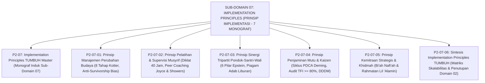

# SUB-DOMAIN 07: IMPLEMENTATION PRINCIPLES (PRINSIP IMPLEMENTASI LAPANGAN)
## *Sitemap Induk & Navigasi Monograf Perubahan Kotter, Diklat Musyrif, Sinergi Wali, Penjaminan Mutu Kaizen, & Kemitraan Khidmah Masyarakat (7 Monograf Terpadu)*

**Nomor Identifikasi**: `P2-07/INDEX/2026`  
**Domain**: `02 Principles` > `07 Implementation Principles`  
**Klasifikasi**: Folder Monograf Manajemen Perubahan Institusi, Supervisi Musyrif Asrama 24 Jam, Kemitraan Orang Tua 6 Pilar, Penjaminan Mutu PDCA, & Khidmah Masyarakat (8 Berkas Lengkap)

---

## 🏛️ SITEMAP & NAVIGASI SELURUH BERKAS SUB-DOMAIN 07

Sub-Domain `07 Implementation Principles` menetapkan prinsip-prinsip operasional penerapan sistem di lapangan pesantren, manajemen perubahan budaya (*Change Management*), pelatihan dan supervisi musyrif berkelanjutan (*CPD & Peer Coaching*), kemitraan orang tua 6 pilar (*Anti-Vacation Regression*), penjaminan mutu berkelanjutan (*Continuous Quality Improvement PDCA*), dan khidmah masyarakat sekitar pondok:

---

## 📑 DAFTAR LENGKAP 8 BERKAS MONOGRAF TERPADU SUB-DOMAIN 07

Seluruh modul telah distandarisasi 100% ke dalam format **Monograf Terpadu**:
* **💡 Intisari Praktis (3 Menit Paham)**: Panduan membumi untuk asatidz & musyrif sebelum daftar isi.
* **Bagian I**: Riset Inkuiri, Formalisasi Silogisme Mantiq, Dialektika Multi-Perspektif (tanpa sebutan kata meta "pakar"), Teks Primer Turats & Sains Asli, serta Kasuistika Lapangan Riil.
* **Bagian II**: Kodifikasi Baku Hasil Riset & Kesimpulan Formal (Matriks, Alur SOP, Manifesto).
* **Bagian III**: Aparatus Akademis (Tabel Sintesis, Daftar Pustaka Otoritatif, Catatan Kaki *Footnotes*, dan Glosarium Istilah Teknis).

| No | Berkas Monograf | Judul Berkas | Fokus Kajian & Rujukan Utama |
| :---: | :--- | :--- | :--- |
| **00** | [**`P2-07-Prinsip-Implementasi-Lapangan-TUMBUH.md`**](./P2-07-Prinsip-Implementasi-Lapangan-TUMBUH.md) | Monograf Induk Implementation Principles TUMBUH | Master 5 Pilar Tata Kelola Lapangan & Pengasuhan Asrama 24 Jam, Penegasan Triad Pertumbuhan Simbiotik, & puncak penutupan **Domain 02 Principles** menuju **Domain 03 Architecture**. |
| **01** | [**`P2-07-01-Prinsip-Manajemen-Perubahan-Budaya-Pesantren.md`**](./P2-07-01-Prinsip-Manajemen-Perubahan-Budaya-Pesantren.md) | Prinsip Manajemen Perubahan Budaya Pesantren | Kaidah *Taghyirul Anfus* (QS. Ar-Ra'd: 11) & *Al-Muhafazhatu 'alal Qadim*; 8 Tahapan Model John Kotter; pembasmian kesesatan pikir *Survivorship Bias*; transformasi musyrif mandor ke Murabbi Qudwah (10 Catatan Kaki). |
| **02** | [**`P2-07-02-Prinsip-Pelatihan-dan-Supervisi-Musyrif.md`**](./P2-07-02-Prinsip-Pelatihan-dan-Supervisi-Musyrif.md) | Prinsip Pelatihan & Supervisi Musyrif | Kaidah *Tarbiyatul Murabbi*; Wasiat Umar bin Abdul Aziz; *Continuing Professional Development (CPD)* & *Peer Coaching* Joyce & Showers (retensi 95%); mitigasi *Burnout* Christina Maslach; halaqah reflektif mingguan (10 Catatan Kaki). |
| **03** | [**`P2-07-03-Prinsip-Sinergi-Tripartit-Pondok-Santri-Wali.md`**](./P2-07-03-Prinsip-Sinergi-Tripartit-Pondok-Santri-Wali.md) | Prinsip Sinergi Tripartit Pondok-Santri-Wali | Amanah pengasuhan keluarga (QS. At-Tahrim: 6 & Hadits *Kullukum Ra'in*); 6 Pilar Kemitraan Joyce Epstein; Piagam Adab Liburan (*Anti-Vacation Regression*); etika komunikasi digital & Tabayyun privat (10 Catatan Kaki). |
| **04** | [**`P2-07-04-Prinsip-Penjaminan-Mutu-dan-Continuous-Improvement.md`**](./P2-07-04-Prinsip-Penjaminan-Mutu-dan-Continuous-Improvement.md) | Prinsip Penjaminan Mutu & Continuous Improvement | Doktrin *Itqanul 'Amal* (HR. Al-Baihaqi No. 4931); Hisab diri Sayyidina Umar RA; Siklus PDCA Deming & Kaizen; audit kepatuhan *Tiered Fidelity Inventory (TFI $\ge 80\%$)*; evaluasi berbasis data PBIS (10 Catatan Kaki). |
| **05** | [**`P2-07-05-Prinsip-Kemitraan-Strategis-Wali-Santri-dan-Akuntabilitas-Publik.md`**](./P2-07-05-Prinsip-Kemitraan-Strategis-Wali-Santri-dan-Akuntabilitas-Publik.md) | Prinsip Kemitraan Strategis & Khidmah Masyarakat | Kaidah *Al-Amanah wal-Mas'uliyyah* (HR. Bukhari 893); sentra air bersih gratis, pasar berkah petani lokal, beasiswa anak warga sekitar, & transparansi publik (10 Catatan Kaki). |
| **06** | [**`P2-07-06-Sintesis-Implementation-Principles-TUMBUH.md`**](./P2-07-06-Sintesis-Implementation-Principles-TUMBUH.md) | Sintesis Implementation Principles TUMBUH | Matriks Kesiapan Skalabilitas Sistem (*Scalability Readiness*); Grand Manifesto Tata Kelola Pengasuhan Pesantren; puncak penutupan **Domain 02 Principles** menuju **Domain 03 Architecture** (10 Catatan Kaki). |
