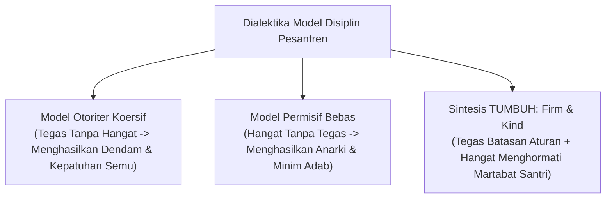
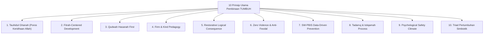

# MONOGRAF RISET AKADEMIK: AKSIOMATIKA PRINSIP BAKU PEMBINAAN PESANTREN TUMBUH
## Evaluasi Kritis: Firm & Kind, Eliminasi Kekerasan Koersif, dan Penegakan Triad Pertumbuhan Simbiotik

**Dewan Riset & Keilmuan Ekosistem TUMBUH**  
*Dipublikasikan sebagai Naskah Monograf Riset Ilmiah (Jurnal Kebijakan & Prinsip Pendidikan Islam)*  
*Dokumen Rujukan Induk: Domain 02 Principles & Book Series Volume 01-02*

---

## ABSTRAK

> **Latar Belakang**: Penerapan disiplin di banyak lembaga pendidikan Islam sering kali terjebak dalam dikotomi ekstrem: baik ketegasan koersif berbasis hukuman fisik/acak (*punitive authoritarianism*) maupun kelonggaran tanpa batas (*permissiveness*). Kedua pendekatan ini terbukti merusak regulasi diri santri dan mencederai nilai-nilai syariat.
>
> **Tujuan Penelitian**: Merumuskan dan memvalidasi kerangka kerja prinsip baku pembinaan yang memadukan kehangatan kasih sayang (*Rahmah*) dan ketegasan batasan aturan (*Firm & Kind*), serta menghapuskan segala bentuk hukuman fisik dan feodalisme senioritas di dunia pesantren.
>
> **Hasil Riset**: Terformulasikan 10 Prinsip Utama Pembinaan yang diuji secara empiris dan teologis: (1) Prinsip Poros Tauhid; (2) Prinsip Fitrah-Centered; (3) Prinsip Qudwah Hasanah; (4) Prinsip Firm & Kind; (5) Prinsip Konsekuensi Logis Restoratif; (6) Prinsip Eliminasi Zero Violence & Anti-Feodalisme; (7) Prinsip SW-PBIS Multi-Tier; (8) Prinsip Tadarruj & Istiqamah; (9) Prinsip Psychological Safety; dan (10) Prinsip Triad Pertumbuhan Simbiotik.
>
> **Kata Kunci**: *Prinsip Pembinaan, Firm & Kind, Zero Violence, Disiplin Restoratif, SW-PBIS, Triad Pertumbuhan.*

---

## 1. PENDAHULUAN & DIALEKTIKA AKADEMIS

Prinsip pembinaan adalah fondasi aksiomatis yang menuntun seluruh perilaku pendidik dan keputusan lembaga. Tanpa prinsip baku yang teruji, pengasuhan asrama rentan didikte oleh emosi sesaat musyrif, tradisi kelam perpeloncoan, atau ketakutan akan kebebasan santri.

---

## 2. KAJIAN LITERATUR INTEGRATIF (TURATS & SAINS)

1. **Perspektif Turats Syar'i**:
   * Rasulullah SAW menegaskan prinsip kelembutan dalam pengasuhan: *"Sesungguhnya kelembutan tidaklah berada pada sesuatu melainkan akan menghiasinya, dan tidaklah dicabut dari sesuatu melainkan akan memperburuknya"* (HR. Muslim).
   * Imam Al-Ghazali dalam *Ihya' 'Ulum ad-Din* menekankan bahwa hukuman fisik atau celaan publik melenyapkan wibawa pendidik dan memicu keberanian anak untuk berbuat dosa secara tersembunyi.

2. **Perspektif Sains Modern**:
   * *Parenting Styles Theory* (Baumrind, 1991) membuktikan bahwa pola *Authoritative* (Tegas & Hangat) menghasilkan kompetensi sosial dan regulasi diri tertinggi pada remaja.
   * *Neurobiology of Stress* (Teicher et al., 2016) menunjukkan bahwa hukuman fisik memicu pembajakan emosi (*Amygdala Hijacking*) dan lonjakan kortisol yang merusak area Prefrontal Cortex santri.

---

## 3. FORMULASI 10 PRINSIP UTAMA EKOSISTEM TUMBUH

---

## 4. IMPLIKASI KEBIJAKAN & MODEL PENERAPAN

1. **Kodifikasi SOP Anti-Kekerasan**: Penetapan larangan mutlak terhadap hukuman fisik (pemukulan, pemotongan rambut acak, running punishment) dan pembentakan lisan.
2. **Transformasi Senioritas Pengurus OSIS**: Pengurus OSIS T4 diubah perannya menjadi *Servant Leader* dan *Peer Mentor*, mencabut seluruh hak menghukum junior.

---

## 5. DAFTAR PUSTAKA
* Al-Ghazali, A. H. (1998). *Ihya' 'Ulum ad-Din*. Dar al-Kutub al-'Ilmiyyah.
* Baumrind, D. (1991). The influence of parenting style on adolescent competence. *Journal of Early Adolescence*, 11(1), 56–95.
* Nelsen, J. (2000). *Positive Discipline in the Classroom*. Prima Publishing.
