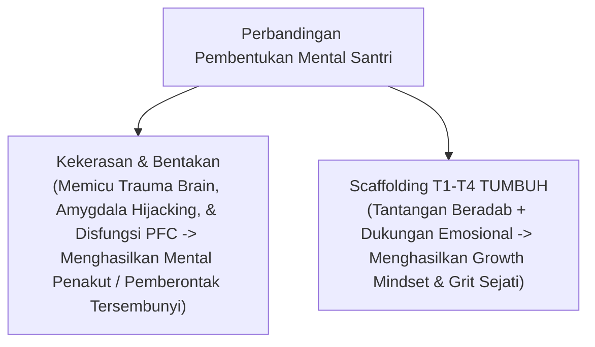

# P2-01: PANDUAN SYAR'I ELIMINASI KEKERASAN DAN REDAM RESISTENSI SENIORITAS
## Pembuktian Ilmiah-Teologis: Mengapa Zero Violence Membentuk Ketahanan Banting (Grit) Sejati Santri

**Dewan Keilmuan Ekosistem TUMBUH**  
*Sub-Domain*: `02 Principles / 01 Core Principles`  
*Penanggung Jawab*: Pakar Perlindungan Anak, Pakar Neurosains, & Pakar Epistemologi Turats

---

## 1. PENDAHULUAN & DIALEKTIKA RESISTENSI

Dokumen ini disusun untuk meredam kekhawatiran Musyrif senior atau alumni pengurus yang salah paham dan menganggap bahwa kebijakan **Zero Violence (Bebas Hukuman Fisik & Pembentakan)** dan **Eliminasi Feodalisme Senioritas** akan "melemahkan mental santri" atau membuat santri "manja dan tidak tahan banting".

---

## 2. PEMBUKTIAN TEOLOGIS & TURATS ISLAM

1. **Teladan Agung Rasulullah SAW dalam Pengasuhan**:
   * Rasulullah SAW tidak pernah menggunakan hukuman fisik atau celaan kasar sepanjang hidup beliau. Hadits Anas bin Malik RA (HR. Muslim) meriwayatkan: *"Aku melayani Rasulullah SAW selama 10 tahun, tidak pernah beliau berkata 'Ah' kepadaku, dan tidak pernah beliau mempertanyakan 'Mengapa kamu melakukan ini?' atau 'Mengapa tidak kamu lakukan itu?'"*.
   * **Implikasi**: Ketahanan mental para sahabat terbentuk dari keagungan *Qudwah* dan rasa cinta (*Mahabbah*), bukan dari ketakutan akan cambuk atau bentakan.

2. **Kritik Ulama Turats Terhadap Kekerasan dalam Pendidikan**:
   * **Ibn Khaldun** dalam monograf monumental *Muqaddimah* secara eksplisit menulis bab khusus: *"Pendidikan yang Keras Membahayakan Santri"*:
     > *"Barangsiapa yang dididik dengan cara keras dan paksaan, maka paksaan itu akan menyempitkan jiwanya, melenyapkan kegembiraannya, mendorongnya untuk berbohong dan bersikap pura-pura karena takut..."*

---

## 3. PEMBUKTIAN NEUROSAINS: BAGAIMANA "GRIT" SEJATI TERBENTUK

1. **Ilusi "Tahan Banting" Akibat Kekerasan**:
   * Kekerasan fisik dan pembentakan tidak pernah membangun mental tahan banting. Secara neurobiologis, kekerasan memicu penyusutan volume *Hippocampus* dan kebal emosi (*Emotional Numbing*). Santri terlihat "tahan banting" hanya karena emosinya sudah mati (*numbed*), namun di dalam hatinya menyimpan dendam yang akan dilampiaskan saat menjadi senior.

2. **Ketahanan Banting (*Grit*) Sejati**:
   * *Grit* (Angela Duckworth, 2016) dan *Growth Mindset* (Carol Dweck, 2006) terbentuk melalui **peningkatan taraf tantangan secara bertahap (*Scaffolding*) yang didukung oleh ekosistem yang aman (*Psychological Safety*)**.

---

## 4. TABEL PERUBAHAN PERAN SENIORITAS (SENIOR OSIS T4)

| Karakteristik | Feodalisme Senioritas Lama [TERLARANG] | Servant Leadership T4 [STANDAR TUMBUH] |
| :--- | :--- | :--- |
| **Status Posisi** | Penguasa yang menuntut dilayani & dihormati. | Pelayan (*Khaadim*) yang mengayomi junior. |
| **Wewenang** | Berhak menghukum fisik & membentak junior. | Dilarang keras menghukum; fokus pada *Peer Mentoring*. |
| **Metode Interaksi** | Barisan sidak malam, pembentakan, & perpeloncoan. | *Peer Buddy System*, musyawarah restoratif, & kawan diskusi. |

---

## 5. KESIMPULAN

Kebijakan **Zero Violence** adalah perintah Syariat dan penemuan Neurosains Modern. Santri yang dididik tanpa kekerasan akan tumbuh menjadi generasi yang kokoh perilakunya, berani membela kebenaran, dan beradab tinggi.
