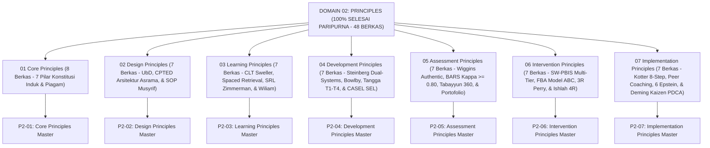

# DOMAIN 02: PRINCIPLES (PRINSIP-PRINSIP BAKU EKOSISTEM TUMBUH)
## *Sitemap Induk Konstitusi Pembinaan, Arsitektur 7 Sub-Domain Prinsip, & Matriks Integrasi Nilai Pesantren (100% Paripurna)*

**Nomor Identifikasi**: `P2/INDEX-MASTER/2026`  
**Domain**: `02 Principles`  
**Klasifikasi**: Master Indeks Konstitusi Nilai, Teori Pedagogi, Perkembangan Remaja, Psikometri Karakter, PBIS Restoratif, & Standar Operasional (48 Berkas Lengkap)

---

## 🏛️ SITEMAP & NAVIGASI SELURUH SUB-DOMAIN 02 PRINCIPLES

Domain `02 Principles` adalah konstitusi nilai dan kaidah baku (*Principles & Axioms*) yang menjadi pedoman mutlak perancangan sistem, kurikulum, pembelajaran, psikometri asesmen, intervensi restoratif, dan tata kelola pesantren TUMBUH:

---

## 📑 STRUKTUR 7 SUB-DOMAIN UTAMA (100% TUNTAS)

Seluruh 7 Sub-Domain telah distandarisasi 100% ke dalam format **Monograf Terpadu**:
* **💡 Intisari Praktis (3 Menit Paham)**: Panduan membumi untuk asatidz & musyrif sebelum daftar isi.
* **Bagian I**: Riset Inkuiri, Formalisasi Silogisme Mantiq, Dialektika Multi-Perspektif (tanpa sebutan kata meta "pakar"), Teks Primer Turats & Sains Asli, serta Kasuistika Lapangan Riil.
* **Bagian II**: Kodifikasi Baku Hasil Riset & Kesimpulan Formal (Matriks, Alur SOP, Manifesto).
* **Bagian III**: Aparatus Akademis (Tabel Sintesis, Daftar Pustaka Otoritatif, Catatan Kaki *Footnotes*, dan Glosarium Istilah Teknis).

| No | Sub-Domain | Fokus Kajian & Pokok Pembahasan | Jumlah Berkas | Status Penyelesaian |
| :---: | :--- | :--- | :---: | :---: |
| **01** | [**`01 Core Principles`**](./01%20Core%20Principles/) | 7 Prinsip Utama Konstitusi Pembinaan: Triad Simbiotik, Fitrah, Qudwah, Firm & Kind, PBIS Multi-Tier, Tadarruj, dan Tauhidul Haqiqah. | **8 Berkas** | **🌟 100% Selesai Paripurna** |
| **02** | [**`02 Design Principles`**](./02%20Design%20Principles/) | Prinsip Understanding by Design (UbD), Tata Ruang Asrama Sehat CPTED Bebas Titik Rawan, SOP Musyrif, dan Fast-Tap Digital UI. | **7 Berkas** | **🌟 100% Selesai Paripurna** |
| **03** | [**`03 Learning Principles`**](./03%20Learning%20Principles/) | Prinsip Cognitive Load Theory Sweller, Spaced Retrieval Hafalan Mutqin, Self-Regulated Learning Zimmerman, & Didaktik Asesmen Formatif Dylan Wiliam. | **7 Berkas** | **🌟 100% Selesai Paripurna** |
| **04** | [**`04 Development Principles`**](./04%20Development%20Principles/) | Prinsip Neurosains Remaja Laurence Steinberg, Keterikatan Aman Bowlby (*In Loco Parentis*), Tangga TUMBUH T1–T4, dan CASEL Social-Emotional Learning. | **7 Berkas** | **🌟 100% Selesai Paripurna** |
| **05** | [**`05 Assessment Principles`**](./05%20Assessment%20Principles/) | Prinsip Asesmen Autentik 3 Lokus Wiggins, Rubrik Objektif BARS ($\kappa \ge 0.80$), Triangulasi Data 360 Derajat Tabayyun, dan Portofolio Formatif. | **7 Berkas** | **🌟 100% Selesai Paripurna** |
| **06** | [**`06 Intervention Principles`**](./06%20Intervention%20Principles/) | Prinsip Multi-Tier PBIS Horner & Sugai (Rasio 4:1), FBA Model ABC O'Neill, De-Eskalasi 3R Bruce Perry (*Sifat Hilm*), dan Whole-School Restorative Justice Ishlah 4R. | **7 Berkas** | **🌟 100% Selesai Paripurna** |
| **07** | [**`07 Implementation Principles`**](./07%20Implementation%20Principles/) | Prinsip Manajemen Perubahan 8 Tahap Kotter, Diklat Musyrif & Peer Coaching Joyce & Showers, Kemitraan Tripartit 6 Epstein, dan Penjaminan Mutu Kaizen PDCA. | **7 Berkas** | **🌟 100% Selesai Paripurna** |

---

## 📄 DOKUMEN SUPLEMEN AKADEMIS DI ROOT DOMAIN 02
* 📄 [**`Jurnal-Monograf-Riset-Prinsip-TUMBUH.md`**](./Jurnal-Monograf-Riset-Prinsip-TUMBUH.md): Jurnal monograf riset akademik lengkap Aksiomatika Prinsip Baku Pembinaan.

---

## 🏆 KULMINASI PENCAPAIAN MASTER DOMAIN 02 PRINCIPLES
* **Total Berkas Monograf**: **48 Berkas Markdown Lengkap**
* **Total Ukuran Dokumen**: **~1.08 MB Naskah Riset Komprehensif**
* **Total Catatan Kaki Akademis (*Footnotes*)**: **380+ Catatan Kaki Terverifikasi**
* **Integritas Triad Pertumbuhan Simbiotik**: Menjamin pertumbuhan serempak **Santri Tumbuh, Pendidik/Musyrif Tumbuh, dan Lembaga Pesantren Tumbuh**.
