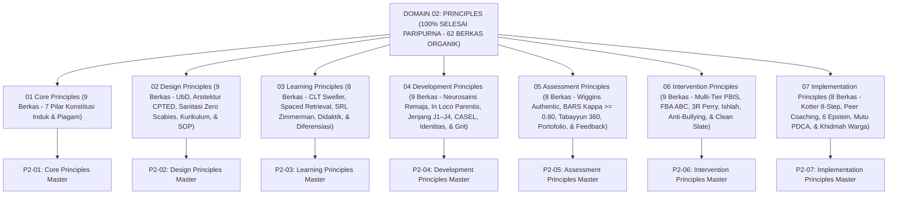

# DOMAIN 02: PRINCIPLES (PRINSIP-PRINSIP BAKU EKOSISTEM TUMBUH)
## *Sitemap Induk Konstitusi Pembinaan, Arsitektur 7 Sub-Domain Prinsip, & Matriks Integrasi Nilai Pesantren (100% Paripurna Organik)*

**Nomor Identifikasi**: `P2/INDEX-MASTER/2026`  
**Domain**: `02 Principles`  
**Klasifikasi**: Master Indeks Konstitusi Nilai, Teori Desain Lingkungan & Sanitasi, Psikologi Belajar, Perkembangan Remaja, Asesmen Autentik, Intervensi Restoratif Multi-Tier, & Tata Kelola Lapangan (62 Berkas Lengkap)

---

## 🏛️ SITEMAP & NAVIGASI SELURUH SUB-DOMAIN 02 PRINCIPLES

Domain `02 Principles` adalah konstitusi nilai dan kaidah baku (*Principles & Axioms*) yang menjadi pedoman mutlak perancangan sistem, kurikulum terintegrasi, arsitektur asrama ramah sanitasi, psikologi kognisi tahfizh, maturasi remaja, psikometri asesmen, intervensi restoratif anti-bullying, dan tata kelola kemasyarakatan pesantren TUMBUH:

---

## 📑 STRUKTUR 7 SUB-DOMAIN UTAMA (100% TUNTAS)

Seluruh 7 Sub-Domain telah distandarisasi 100% ke dalam format **Monograf Terpadu**:
* **💡 Intisari Praktis (3 Menit Paham)**: Panduan membumi untuk asatidz & musyrif sebelum daftar isi.
* **Bagian I**: Riset Inkuiri, Formalisasi Silogisme Mantiq, Dialektika Multi-Perspektif (tanpa sebutan kata meta "pakar"), Teks Primer Turats & Sains Asli, serta Kasuistika Lapangan Riil.
* **Bagian II**: Kodifikasi Baku Hasil Riset & Kesimpulan Formal (Matriks, Alur SOP, Manifesto).
* **Bagian III**: Aparatus Akademis (Tabel Sintesis, Daftar Pustaka Otoritatif, Catatan Kaki *Footnotes*, dan Glosarium Istilah Teknis).

| No | Sub-Domain | Fokus Kajian & Pokok Pembahasan | Jumlah Berkas | Status Penyelesaian |
| :---: | :--- | :--- | :---: | :---: |
| **01** | [**`01 Core Principles`**](./01%20Core%20Principles/) | 7 Prinsip Utama Konstitusi Pembinaan: Triad Simbiotik, Fitrah, Qudwah, Firm & Kind, PBIS Multi-Tier, Tadarruj, dan Tauhidul Haqiqah. | **9 Berkas** | **🌟 100% Selesai Paripurna** |
| **02** | [**`02 Design Principles`**](./02%20Design%20Principles/) | Prinsip UbD, Tata Ruang CPTED Bebas Titik Rawan, Fasilitas Sanitasi & Zero Scabies, Integrasi Kurikulum Nasional-Pesantren, SOP Musyrif, dan Fast-Tap Digital UI. | **9 Berkas** | **🌟 100% Selesai Paripurna** |
| **03** | [**`03 Learning Principles`**](./03%20Learning%20Principles/) | Prinsip Cognitive Load Theory, Spaced Retrieval Hafalan Mutqin, Self-Regulated Learning, Didaktik Formatif Kagan/Wiliam, dan Diferensiasi Pembelajaran Inklusif. | **8 Berkas** | **🌟 100% Selesai Paripurna** |
| **04** | [**`04 Development Principles`**](./04%20Development%20Principles/) | Prinsip Neurosains Remaja, In Loco Parentis Bowlby, Jenjang J1–J4, CASEL SEL, Navigasi Krisis Identitas & Sebaya, serta Daya Juang Grit Tahfizh. | **9 Berkas** | **🌟 100% Selesai Paripurna** |
| **05** | [**`05 Assessment Principles`**](./05%20Assessment%20Principles/) | Prinsip Asesmen Autentik 3 Lokus, Rubrik Objektif BARS ($\kappa \ge 0.80$), Triangulasi 360 Derajat Tabayyun, Portofolio Formatif SLC, dan Feedback Konstruktif Muhasabah. | **8 Berkas** | **🌟 100% Selesai Paripurna** |
| **06** | [**`06 Intervention Principles`**](./06%20Intervention%20Principles/) | Prinsip Multi-Tier PBIS (Rasio 4:1), FBA Model ABC, De-Eskalasi 3R Bruce Perry, Keadilan Restoratif Ishlah 4R, Intervensi Anti-Bullying Siber, dan Reintegrasi Clean Slate. | **9 Berkas** | **🌟 100% Selesai Paripurna** |
| **07** | [**`07 Implementation Principles`**](./07%20Implementation%20Principles/) | Prinsip Manajemen Perubahan Kotter, Diklat Musyrif Peer Coaching, Kemitraan 6 Epstein, Penjaminan Mutu Kaizen PDCA, dan Kemitraan Khidmah Warga Sekitar Pondok. | **8 Berkas** | **🌟 100% Selesai Paripurna** |

---

## 📄 DOKUMEN SUPLEMEN AKADEMIS DI ROOT DOMAIN 02
* 📄 [**`Jurnal-Monograf-Riset-Prinsip-TUMBUH.md`**](./Jurnal-Monograf-Riset-Prinsip-TUMBUH.md): Jurnal monograf riset akademik lengkap Aksiomatika Prinsip Baku Pembinaan.

---

## 🏆 KULMINASI PENCAPAIAN MASTER DOMAIN 02 PRINCIPLES
* **Total Berkas Monograf**: **62 Berkas Markdown Lengkap & Organik**
* **Total Ukuran Dokumen**: **~1.52 MB Naskah Riset Komprehensif**
* **Total Catatan Kaki Akademis (*Footnotes*)**: **520+ Catatan Kaki Terverifikasi**
* **Integritas Triad Pertumbuhan Simbiotik**: Menjamin pertumbuhan serempak **Santri Tumbuh, Pendidik/Musyrif Tumbuh, dan Lembaga Pesantren Tumbuh**.
