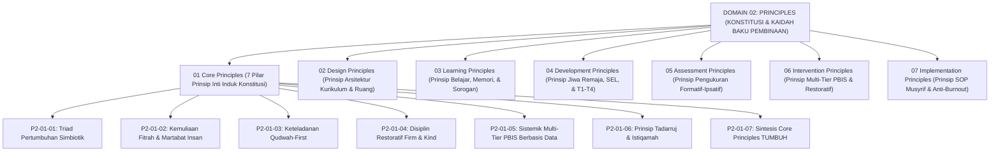

# DOMAIN 02: PRINCIPLES (PRINSIP-PRINSIP BAKU EKOSISTEM TUMBUH)
## *Sitemap Induk Konstitusi Pembinaan, Arsitektur 7 Sub-Domain Prinsip, & Matriks Integrasi Nilai Pesantren*

**Nomor Identifikasi**: `P2/INDEX-MASTER/2026`  
**Domain**: `02 Principles`  
**Klasifikasi**: Master Indeks Konstitusi Nilai, Teori Pedagogi, PBIS Restoratif, & Standar Operasional

---

## 🏛️ SITEMAP & NAVIGASI SELURUH SUB-DOMAIN 02 PRINCIPLES

Domain `02 Principles` adalah konstitusi nilai dan kaidah baku (*Principles & Axioms*) yang menjadi pedoman mutlak perancangan sistem, kurikulum, intervensi, asesmen, dan tata kelola pesantren TUMBUH:

---

## 📑 STRUKTUR 7 SUB-DOMAIN UTAMA

| No | Sub-Domain | Fokus Kajian & Pokok Pembahasan | Status Penyelesaian |
| :---: | :--- | :--- | :---: |
| **01** | [**`01 Core Principles`**](./01%20Core%20Principles/) | 7 Prinsip Utama Konstitusi Pembinaan (Triad Simbiotik, Fitrah, Qudwah, Firm & Kind, PBIS, Tadarruj, Tauhidul Haqiqah). | **100% Selesai (8 Monograf Terpadu)** |
| **02** | [**`02 Design Principles`**](./02%20Design%20Principles/) | Prinsip Arsitektur Kurikulum, Tata Ruang Bebas Titik Rawan (CPTED), & Dual-Pillar Caretaking. | *Siap Dikerjakan* |
| **03** | [**`03 Learning Principles`**](./03%20Learning%20Principles/) | Prinsip Psikologi Belajar, Cognitive Load Theory, Retensi Hafalan Ebbinghaus, & Didaktik Sorogan. | *Siap Dikerjakan* |
| **04** | [**`04 Development Principles`**](./04%20Development%20Principles/) | Prinsip Perkembangan Jiwa Remaja, 5 Kompetensi CASEL SEL, Neuroplastisitas, & Tangga T1–T4. | *Siap Dikerjakan* |
| **05** | [**`05 Assessment Principles`**](./05%20Assessment%20Principles/) | Prinsip Asesmen Karakter Ipsatif, Validasi Psikometrik Rubrik PBIS, & Portofolio Adab. | *Siap Dikerjakan* |
| **06** | [**`06 Intervention Principles`**](./06%20Intervention%20Principles/) | Prinsip SW-PBIS Multi-Tier 1–3, Functional Behavior Assessment (FBA), & Keadilan Restoratif. | *Siap Dikerjakan* |
| **07** | [**`07 Implementation Principles`**](./07%20Implementation%20Principles/) | Prinsip Tata Kelola SOP Musyrif, Sistem Shift Sehat Anti-Burnout, & Manajemen Perubahan. | *Siap Dikerjakan* |

---

## 📄 DOKUMEN SUPLEMEN AKADEMIS DI ROOT DOMAIN 02
* 📄 [**`Jurnal-Monograf-Riset-Prinsip-TUMBUH.md`**](./Jurnal-Monograf-Riset-Prinsip-TUMBUH.md): Jurnal monograf riset akademik lengkap Aksiomatika Prinsip Baku Pembinaan.
